# AI 驱动 HarmonyOS 复杂需求开发实践课

> 用一个真实 MDM 需求跑通 SDD + Ralph Loop + 设备证据，再把同一方法迁移到 AVC420 / AVC444 卡顿诊断

> **Rich V2 / 本地媒体增补版**：保留原 39 页结构；重点丰富第 28–38 页的案例带入、图片、视频、实操、故障处理与人—AI—MCP 协同。配套素材见 `harmonyos-sdd-workshop-media/`，完整讲师脚本见附录 J。

## 课程定位

这不是“AI 提示词技巧课”，也不是项目复盘。课程面向已经具备 HarmonyOS / ArkTS / C++ 基础的新员工，通过两个真实代码库，带着学员完成一次可追踪、可调试、可验收的复杂需求开发。

课程主线只有一条：

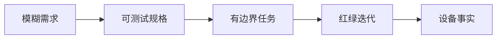

- **MDM 主实践**：Feature-first。先冻结多用户、状态、事务和失败语义，再让 AI 实现。
- **GPU 方法迁移**：Evidence-first。先建立帧级证据，再决定修改解码、队列、合成还是输出。
- **MCP 的位置**：不是第三套方法，只负责每轮 Ralph 的 Verify——构建、安装、操作、日志、截图和验收取证。

## 学员最终交付

```text
workshop/
├── mdm/
│   ├── spec.md
│   ├── design.md
│   ├── tasks/T01.md
│   ├── progress.md
│   ├── patch.diff
│   ├── acceptance.md
│   └── evidence/
│       ├── unit-test-red.txt
│       ├── unit-test-green.txt
│       ├── build.txt
│       ├── device-log.txt
│       ├── runtime-state.json
│       └── screenshot.png
└── gpu-diagnosis.md
```

最低通过标准：同一条行为必须能够从需求 ID 追踪到设计、不变量、任务、失败测试、最小代码差异和设备证据；设备或系统 getter 不可用时标记 `UNKNOWN`，不能用 UI 文案代替系统事实，也不能把 mock 结果写成 PASS。

## 120 分钟课程结构

| 时间 | 模块 | 学员动作 | 当场产出 |
|---|---|---|---|
| 00–26 | 需求闭合 | 领域建模、歧义选择、EARS、行为矩阵 | `spec.md` |
| 26–70 | 设计与 Ralph | 真相源、任务卡、RED→GREEN、故障注入 | `design.md`、patch、`progress.md` |
| 70–88 | 平台与验收 | 权限预检、跨进程、MCP 设备证据 | `acceptance.md`、evidence |
| 88–116 | GPU 迁移 | 还原帧链、420/444 分路、证据诊断 | `gpu-diagnosis.md` |
| 116–120 | 收束 | 同伴审阅与七问迁移 | 最终交付包 |

## 事实标签

材料对代码事实和课堂目标严格分层：

- `CURRENT`：仓库当前代码已经具备，可现场打开验证。
- `GAP`：仓库当前仍存在的风险或未闭合问题。
- `TARGET`：本轮课堂希望设计或实现的能力。
- `TEACHING`：为了教学建立的 FR / D / T 编号，不是仓库既有资产。

## 视觉与 PPT 制作约定

- 画面：16:9，浅灰白技术讲解页 + 深色代码 / 日志舞台。
- 色彩：深海军蓝=结构；蓝=规格；紫=AI / Ralph；橙红=失败；绿=证据 / PASS。
- 字体：HarmonyOS Sans SC / 思源黑体；代码 JetBrains Mono。
- 页型只使用六种：`CLAIM`、`MAP`、`CODE`、`DEBUG`、`LAB`、`CHECKPOINT`。
- 每页只有一个视觉中心；画面正文建议 250–400 汉字；代码不超过 12 行；大表、提交历史和完整答案进入讲师备注。
- 页脚固定进度带：`需求 ─ 设计 ─ 任务 ─ 代码 ─ 调试 ─ 证据`，只高亮当前阶段。

## 仓库范围

- MDM：`repos/security_tool`
- 远控：`repos/harmony-windows-bridge`
- FreeRDP：`repos/harmony-windows-bridge/harmony/third_party/FreeRDP`
- 测试与验收辅助：`repos/harmonyos-dev-mcp`

---

# 39 页 PPT-ready 讲师稿

## 第 1 页｜今天交付的不是代码，是可信结果

<!--
type: CLAIM
section: OPENING
layout: hero
time: 2m
progress: 需求
-->

### 画面

# AI 驱动 HarmonyOS 复杂需求开发

**从一句需求，到可运行代码，再到设备证据**

> 需求 → 规格 → 任务 → 代码 → 调试 → 证据

主视觉建议：左侧是一句模糊需求，中央是紫色 Ralph 循环，右侧是绿色设备证据包；背景只保留真实设备、测试结果和日志的低透明度拼贴。

### 讲师备注

开场不要先解释 SDD 名词。先问：“AI 说改完了、单测也过了，但新增账号没有策略，这算完成吗？”让学员明确本课的完成定义不是代码生成，而是系统事实可证明。

两个案例不是为了炫技。MDM 展示复杂业务如何被拆成可实现规格；GPU 展示现象模糊时如何先取证再改。课程结束后，学员应能把方法迁移到任何 HarmonyOS 复杂需求。

### 演示动作

快速展示一组对照：绿色单测输出 + 真机上账号 123 未收敛的日志。此时不解释原因，只留下悬念。

### 通过条件

学员能复述：**AI 输出只是候选变更，测试与设备事实共同决定是否完成。**

### 素材

- MDM 首页真机截图
- 一段单测全绿输出
- 一段账号新增后未收敛的设备日志

---

## 第 2 页｜两小时只完成一个英雄任务

<!--
type: MAP
section: OPENING
layout: timeline
time: 3m
progress: 需求
-->

### 画面

**英雄任务**

> 设备当前处于 `public` 且防火墙已开启，已覆盖账号 `[100,112]`。系统收到 `account-added(123)` 后，先等待账号事实稳定，再把 public policy / preset rules 补到最新账号集合。若账号 123 的第 2 条规则下发失败，必须恢复旧状态，不得保存目标 signature，并留下可回读证据。


### 讲师备注

课程后面遇到的“已经开启/关闭、重复事件、部分失败、跨进程、systemRuleId、MCP 回读”，都挂到这一个任务上。不要每几页换一个案例。

冻结课堂语义：

- 新增事件第一次读到 `[100,112]` 不是稳定；直到包含触发账号 123 才可 dispatch。
- public/private 账号集合变化时重放模式；custom 只同步默认 policy，不自动扩大旧自定义规则作用域。
- 模式重放是事务：失败后尝试整体补偿，并重建恢复后的 deployment identity。
- 总开关部分失败不是同一语义，后面专门比较。

### 演示动作

在白板或画布上固定写出 `100 / 112 / 123`，后续所有需求、测试与日志都沿用这三个 ID。

### 通过条件

所有小组使用同一英雄任务，不按模块分组拆散主链。

### 素材

- 账号集合变化示意图
- `FirewallAccountChangeHandler.ets`
- `FirewallModeSwitchService.ets`

---

## 第 3 页｜一轮 Ralph 必须留下六类证据

<!--
type: MAP
section: OPENING
layout: loop
time: 3m
progress: 任务
-->

### 画面

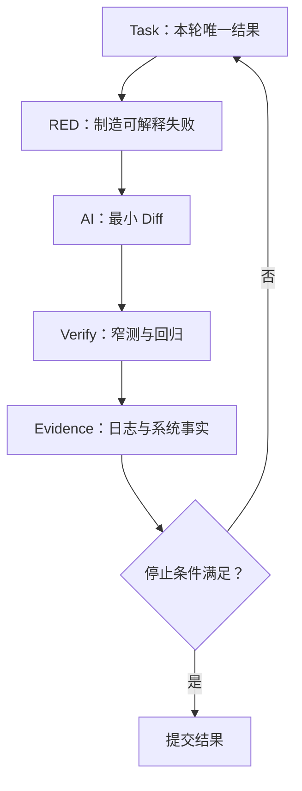

每轮写入 `progress.md`：

`假设 / RED 命令与输出 / 修改文件 / GREEN 输出 / 新事实 / 剩余风险 / Stop 或 Next`

### 讲师备注

SDD 负责“要到哪里、边界是什么”；Ralph 负责“一次走多远、何时停止”；MCP 只是 Verify 阶段的执行器。不要把三者画成并列方法。

停止条件必须可执行：窄测试绿、相关回归绿、diff 在任务允许范围、设备事实与规格一致。权限、签名、设备或 getter 阻塞时，结论是 `UNKNOWN`，记录阻塞并停止，不继续猜测。

**Anthropic 方法锚点**：`Building Effective Agents` 强调 Agent 每一步都要从环境获取 ground truth，并用 checkpoint 与 stopping condition 控制执行；`Best practices for Claude Code` 进一步强调“给 Agent 一个它能运行的检查”，否则它只能在“看起来完成”时停下。本课把这一观点具体化为四级检查：目标 RED/GREEN、相关回归、HAP 构建、真机 getter / 帧级证据。截图是可读信号，但不能替代更强的系统事实。

### 演示动作

展示两份短 `progress.md`：Round 1 解决账号可见性；Round 2 解决模式重放失败补偿。让学员看到“循环真正发生”。

### 通过条件

学员能区分 `PASS / FAIL / UNKNOWN`，并知道 UNKNOWN 不是失败，也不是可以伪装成 PASS。

### 素材

- 附录 D 任务卡模板
- 附录 E `progress.md` 模板

---

# 第一幕：把 MDM 原始需求变成可执行规格

## 第 4 页｜先认识五个对象，再谈“防火墙开关”

<!--
type: MAP
section: MDM_SPEC
layout: domain-model
time: 4m
progress: 需求
-->

### 画面

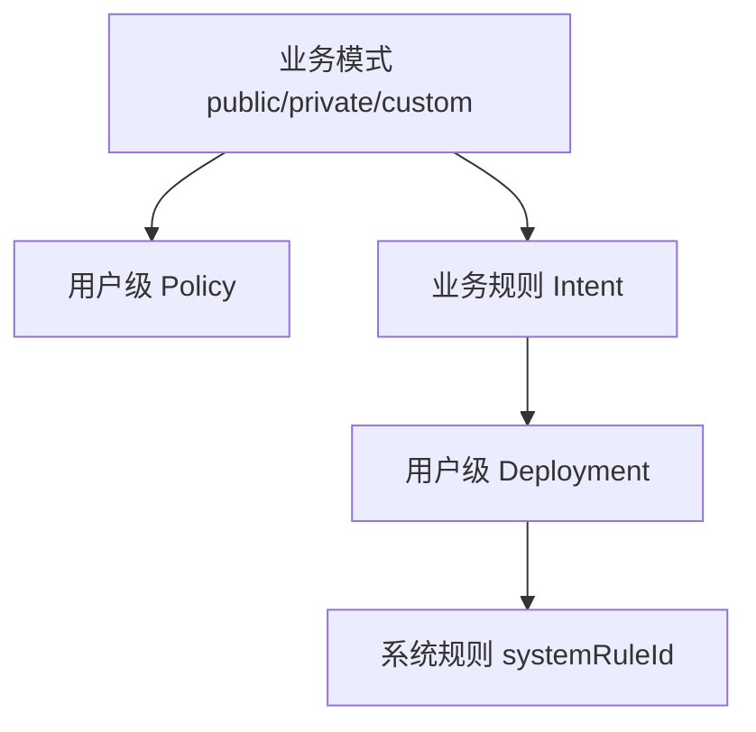

| 对象 | 作用 | 真相来源 |
|---|---|---|
| Account Set | 当前应该覆盖谁 | OS account API |
| Policy | `isOpen` 与默认动作 | MDM system getter |
| Intent | 用户想表达的业务规则 | Local repository |
| Deployment | Intent 在各用户的落点 | Local mapping + system ID |

### 讲师备注

新员工最容易把“账号”当 UI 筛选条件，把一条业务规则直接等同一个系统 rule。实际一条 `FirewallRuleIntent(localRuleId, targetUserIds=[100,123])` 会展开为多个 deployment，每个 deployment 拥有独立 `systemRuleId`。

还要把三个维度拆开：

- `isOpen`：总开关。
- `mode`：默认动作与预置规则策略。
- `rules`：显式规则集合。

提交 `deaf8f27` 的真实故障就是旧实现把模式切换与 `isOpen=true` 绑定，导致“已经关闭，切模式又打开”。它比抽象解释状态分层更适合开场。

### 演示动作

打开 `models/firewall/FirewallModels.ets` 或设计文档，只定位 Intent、Deployment、Policy 三个结构；暂不浏览 UI。

### 通过条件

学员能解释为什么恢复系统规则后，不能继续使用旧 `systemRuleId`。

### 素材

- `entry/src/main/ets/models/firewall/FirewallModels.ets`
- commit `0ad3c1fa`、`deaf8f27`

---

## 第 5 页｜原始需求的问题不是长，而是决定被藏起来了

<!--
type: CLAIM
section: MDM_SPEC
layout: statement-annotations
time: 4m
progress: 需求
-->

### 画面

> 防火墙支持 public / private / custom 三种模式和总开关；面向全部本地账号下发；账号增删后自动同步；处理已经开启/关闭、重复操作、部分失败和页面刷新。

只高亮四个实现分叉：

1. “全部账号”以事件参数、缓存还是 OS 快照为准？
2. 部分失败时保留成功结果，还是整体回滚？
3. “已应用”由本地 mode、signature 还是系统回读决定？
4. Extension 完成后，UI 如何跨进程获得事实？

### 讲师备注

AI 直接拿到这段话时，往往会自行补齐业务决策：用当前登录账号、对所有失败统一 try/catch、操作成功后直接改 UI、用内存单例通知页面。这些实现都可能编译通过，但不一定是正确产品语义。

课程不要求学员一开始知道答案，只要求先把“会导致不同代码路径”的问题列出来。判断标准：不同答案是否会改变状态模型、系统调用顺序、回滚、测试或验收？如果会，就是必须关闭的歧义。

### 演示动作

将原始需求交给 AI，只允许输出：名词、状态、触发器、失败点、待决问题；禁止给代码和架构。

### 通过条件

至少得到 8 个会改变实现的待决问题；没有出现“建议使用 MVVM”之类泛化方案。

### 素材

- 原始需求卡
- 推荐 Prompt：附录 C

---

## 第 6 页｜实践：先让 AI 找分叉，人来冻结语义

<!--
type: LAB
section: MDM_SPEC
layout: four-block
time: 4m
progress: 需求
-->

### 画面

**输入**：英雄任务 + 当前领域对象。

**AI 允许做**：列出实现分叉，并说明每个分叉会影响哪类代码或测试。

**人必须决定**：账号事实、重复操作、部分失败、提交点、UI 展示口径。

**交付**：`spec.md / Open Decisions`，每项只有 `OPEN` 或明确答案。

Prompt 约束：

```text
不要设计方案，不要写代码。
只找会改变状态、调用顺序、补偿或验收的歧义。
每项给出至少两个互斥答案及其工程影响。
```

### 讲师备注

课堂揭晓的核心决定：

- 账号事件只是触发器，OS account snapshot 才是事实。
- `account-added` 当前稳定条件是“快照包含 triggerAccountId”，不是连续两次读取相同。
- 首页总开关写入覆盖全部用户，但展示只读当前/管理用户；这是 `CURRENT`，不是全局一致性证明。
- 模式切换失败整体补偿；总开关部分失败保留成功账号。这两条并不矛盾，因为事务边界由规格决定。
- UI 刷新与业务 reconcile 分离，CommonEvent 传递事实，不承担业务事务。

### 演示动作

2 人一组，3 分钟标记 AI 输出中的“事实问题”和“产品决策”；最后 1 分钟全班冻结课堂答案。

### 通过条件

不允许把仍为 `OPEN` 的高影响问题直接交给 AI 实现。

### 素材

- `AccountChangeCoordinator.ets`
- `FirewallPolicyService.ets`
- commit `c0c1bc9f`、`b8339196`

---

## 第 7 页｜EARS 让一句“自动同步”直接长出测试

<!--
type: CODE
section: MDM_SPEC
layout: before-after
time: 3m
progress: 需求
-->

### 画面

**Before**

> 新增账号后自动同步防火墙。

**After — TEACHING / FR-ACC-001**

```text
WHEN 收到 account-added(123)，
WHILE 当前模式为 public 且 desiredEnabled=true，
THE SYSTEM SHALL 在包含 123 的账号快照上重放模式；
IF 5 次读取后仍不包含 123，
THEN SHALL 不 dispatch、不提交 signature，并记录 timeout。
```

### 讲师备注

EARS 不是为了写得像规范，而是把测试输入、前置状态、动作、结果和失败分支放进同一句话。课堂 ID 是教学资产，明确标注 `TEACHING`，避免学员误以为仓库已有这些编号。

真实实现参数：新增事件会以约 200 ms 间隔最多重试 5 次；到达包含触发账号的快照才 dispatch。删除事件当前只读一次，没有对称等待，这是后续高级 GAP。

### 演示动作

让学员把“重复事件不要重复下发”改写成一条 EARS；答案必须出现排序 signature 和提交条件。

### 通过条件

语句能直接导出至少一个成功测试和一个失败/超时测试。

### 素材

- `account-change-coordinator.test.ets`
- commit `c0c1bc9f`

---

## 第 8 页｜行为矩阵先冻结“什么时候回滚”

<!--
type: MAP
section: MDM_SPEC
layout: matrix
time: 3m
progress: 需求
-->

### 画面

| 场景 | 系统动作 | 本地提交 | 失败语义 |
|---|---|---|---|
| 重复开启 | UI no-op | 不变 | 不再写系统 |
| 总开关部分失败 | 全用户 best-effort | 不写 `desiredEnabled` | 成功用户保留 |
| public + 新账号 | 最新快照重放 | 成功后写 mode/signature | 失败整体补偿 |
| 重复 signature | 不重放 | 不变 | 幂等跳过 |

> **不是所有失败都必须回滚；事务边界先由规格决定。**

### 讲师备注

这是整堂课最重要的业务判断。`FirewallPage.handleToggleWithAuth` 处理“已经开/关”的 UI no-op；`FirewallPolicyService.setFirewallEnabledForAllUsers` 自身仍会认证、读取并逐用户写入。不要把 UI 层 no-op 误讲成 Service 幂等。

总开关部分失败时，100/102 成功、101 失败，成功用户不回滚，但 `desiredEnabled` 不保存，结果返回 false。模式切换不同：先快照，失败后恢复 policy/rules/mapping。完整矩阵放附录 B，PPT 只展示四个最能改变实现的场景。

### 演示动作

让学员给“空账号集合”和“custom 新增账号”补两行，只说预期，不写代码。

### 通过条件

任何人都能根据矩阵回答：失败后系统哪些变化保留、本地哪些状态能提交。

### 素材

- `FirewallPolicyService.ets`
- `FirewallModeSwitchService.ets`
- `service.test.ets`

---

# 第二幕：把规格变成 AI 不容易越界的设计与任务

## 第 9 页｜五类状态必须分开，才能定义“已应用”

<!--
type: MAP
section: MDM_DESIGN
layout: state-layers
time: 3m
progress: 设计
-->

### 画面

| 状态层 | 示例 | 能否单独证明成功 |
|---|---|---|
| User intent | `desiredEnabled=true` | 不能 |
| Local apply record | `mode=public, signature=100,112,123` | 不能 |
| System truth | 每用户 policy / rules | 可以作为最终事实 |
| UI projection | 顶部开关、模式文案 | 不能 |

醒目结论：`currentMode=public` **不等于** public 已覆盖最新账号集合。

### 讲师备注

还存在第 5 类“事件/运行态”：trigger、pending、inFlight、retry count。它决定何时开始 reconcile，但不能取代账号事实。

`CURRENT GAP`：`saveModeApplyState` 通过两个独立 `setValue + flush` 保存 mode 和 signature，第二次失败可能形成半提交；快照/回滚也没有完整恢复旧 apply state。课程主任务先把它写入风险清单，不假装已经解决。可作为高级任务把 mode/signature 收敛到单一原子记录。

### 演示动作

给出 `public + signature=100,112`，再新增账号 123，问“当前状态叫什么？”正确答案是模式意图仍为 public，但 apply coverage 已陈旧。

### 通过条件

学员不再用 UI 状态或本地 mode 单独判定系统已应用。

### 素材

- `FirewallLocalRepository.ets`
- `FirewallOverviewViewModel.ets`

---

## 第 10 页｜真相源决定不变量，也暴露当前 GAP

<!--
type: CLAIM
section: MDM_DESIGN
layout: truth-source
time: 3m
progress: 设计
-->

### 画面

**TEACHING：英雄任务的四条不变量**

1. 所有写操作基于一个明确、已记录的账号快照。
2. 模式切换只改变默认动作 / 规则，必须保留旧 `isOpen`。
3. 失败补偿后，本地 deployment 指向恢复后新生成的 `systemRuleId`。
4. 只有系统操作全部成功，才提交目标 mode 与 account signature。

**CURRENT GAP**：系统读取失败不能被当成“系统确实为空”。

### 讲师备注

仓库当前 `FirewallSystemRepository.listRules` 失败时可能回退为 `[]`，本地 mapping 读取失败也可能回退为空。这样所谓“完整快照”无法区分真实空集合与读取失败，后续 clear 可能产生破坏性动作。

因此课堂设计要增加 snapshot validity：每个 truth source 必须返回 `OK(value)` 或 `ERROR(evidence)`；只要关键读取失败，事务在写入前终止。不要让 AI 用 `catch { return [] }` 把未知变成事实。

### 演示动作

让 AI 搜索所有返回空数组的 catch 分支，并按“真实空 / 降级空 / 错误被吞”分类；此轮禁止改代码。

### 通过条件

设计文档明确列出：事实源、失败表达、写入前置条件、禁止的 fallback。

### 素材

- `FirewallSystemRepository.ets`
- `FirewallLocalRepository.ets`
- `FirewallModeSwitchService.createSnapshot`

---

## 第 11 页｜进程边界比类图更早决定设计

<!--
type: MAP
section: MDM_DESIGN
layout: architecture
time: 3m
progress: 设计
-->

### 画面

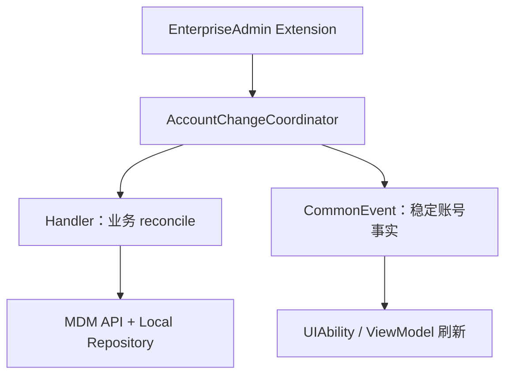

- Extension 与 UI 不是共享内存。
- CommonEvent 负责跨进程通知，不负责事务。
- UI / ViewModel 的互斥只保护 UI 入口，不是全局 writer lock。

### 讲师备注

提交 `53751b2e` 将协调器改为 handler registry；`cecf6d17` 让稳定账号事实即使某个 handler 失败也继续发布，避免一个业务消费者阻断整个 UI 刷新链。

必须指出真实边界：`FirewallPage` / `FirewallOverviewViewModel` 的模式与开关互斥，只覆盖 UI 进程；Extension 触发的 account reconcile 与 UI 操作之间仍没有全局写串行器。这是 `CURRENT GAP`，不能说“Coordinator 已串行所有写操作”。

### 演示动作

打开 Extension、Coordinator、EntryAbility 三处代码，用同一 `eventId / accountId / signature` 标注跨进程日志位置。

### 通过条件

学员能回答：业务处理失败后为什么仍可能需要发布账号事实，以及 UI lock 为什么不能防止 Extension 并发写。

### 素材

- `AccountChangeCoordinator.ets`
- `FirewallAccountChangeHandler.ets`
- commit `53751b2e`、`cecf6d17`、`f6886182`

---

## 第 12 页｜一行追踪关系，限制 AI 只改必要边界

<!--
type: MAP
section: MDM_DESIGN
layout: traceability
time: 3m
progress: 设计
-->

### 画面

| 需求 | 设计决定 | 实现锚点 | 验证证据 |
|---|---|---|---|
| FR-ACC-001 | 新增账号必须等 trigger 可见 | `loadStableSnapshot` | RED/GREEN + retry log |
| FR-MODE-002 | 模式失败整体补偿 | `rollbackToSnapshot` | fault injection + getter |
| FR-ID-001 | 恢复后重映射 ID | `remapDeployments` | mapping 与系统 ID 对齐 |

页尾：**追踪矩阵不是文档装饰，它决定下一轮 AI 可以碰哪里。**

### 讲师备注

课堂只展示英雄任务三行；完整追踪矩阵放附录。每一行必须能回答：为什么改、哪个边界负责、先看到什么失败、最后用什么事实验收。

不允许“为了更优雅”同时重构 ViewModel、Repository、Service。若失败首先发生在 snapshot 时序，本轮文件边界就只允许 Coordinator 与对应测试。设计的价值之一，是帮 AI 拒绝无关改动。

### 演示动作

让学员选 FR-ACC-001，圈出允许修改的两个文件和明确禁止的 UI / Store 文件。

### 通过条件

一条需求可以顺向追到证据，也能从一个 diff 反向说明它服务哪个需求。

### 素材

- 附录 C 设计模板
- 附录 D 任务卡模板

---

## 第 13 页｜实践：先做只读勘察，不让 AI 猜代码

<!--
type: LAB
section: MDM_DESIGN
layout: four-block
time: 2m
progress: 任务
-->

### 画面

**T00 / Read-only Exploration**

**输入**：FR-ACC-001、仓库根目录、英雄任务。

**只允许**：搜索入口、调用链、真相源、写入点、提交点、测试和历史提交。

**禁止**：修改生产文件；凭命名推断行为；给出未经代码支持的 API。

**输出七项**：

`入口 / 事实源 / 副作用 / commit point / 现有测试 / 相关提交 / Spec Gap`

### 讲师备注

这是 AI 使用中最省返工的一步。推荐让 AI 先用 `rg` 找符号，再读最短调用链，再用 `git log -S` / `git show` 解释为什么代码现在这样。提交历史是证据，不是课程结构。

英雄任务的真实入口包括：`AccountChangeCoordinator.loadStableSnapshot/runOnce`、`FirewallAccountChangeHandler.handle`、`FirewallModeSwitchService.createSnapshot/applyModeToUsers/rollbackToSnapshot/remapDeployments`。

**Anthropic 方法锚点**：Claude Code 官方建议将 Explore、Plan、Implement 分开，避免在尚未理解代码时直接解决错误问题。T00 就是这个原则的 HarmonyOS 版本：勘察轮次保持只读，输出必须引用文件、函数、测试和历史提交；冻结 Spec Gap 与修改边界后，再用干净的实现轮次执行任务。探索过程可以很宽，但交给实现轮次的上下文必须收敛。

### 演示动作

现场运行一次只读 Prompt；若 AI 输出了不存在的 `firewall.get_runtime_state`，当场标红并要求提供定义位置。

### 通过条件

输出中的每个函数、测试和能力都能在仓库中定位；未知项标记 GAP，不得编造。

### 素材

- `repos/security_tool`
- commit `94ff17e7`、`c0c1bc9f`、`0b5edc5f`

---

## 第 14 页｜任务卡只允许一个可观察结果

<!--
type: CODE
section: MDM_DESIGN
layout: task-card
time: 2m
progress: 任务
-->

### 画面

```text
T01 — account-added 等到 trigger 可见
Requirement: FR-ACC-001
Allowed: AccountChangeCoordinator + 对应测试
Forbidden: UI、Firewall Handler、Repository
RED: [100,112] → [100,112] → [100,112,123]
GREEN: handler 只执行一次，参数包含 123
STOP: 窄测/回归绿；diff 不越界；progress 已记录
```

> 任务按“可验证依赖”切，不按页面、类或文件数量切。

### 讲师备注

推荐四张任务卡：

- T00：只读勘察。
- T01：新增账号稳定快照。
- T02：模式重放故障与补偿。
- T03：设备验收 getter / evidence contract。

当前生产 `wait()` 使用真实 `setTimeout` 且为私有实现，不能在讲义里伪装成可直接 mock 的测试。课堂有两种诚实做法：使用仓库现有 Hamock 测试结构与短等待；或先把 `Clock / RetryPolicy` 注入作为独立设计任务，再写确定性测试。

**Anthropic 方法锚点**：`Effective Harnesses for Long-Running Agents` 观察到长任务最常见的失败是一次做太多、留下半实现，或看到已有进度后提前宣布完成。其应对方式是一次只推进一个 feature，完成后留下干净状态、Git 记录和 progress。T01/T02/T03 因此不是按页面或类拆分，而是按“一个可观察结果＋一个可执行停止条件”拆分；不得通过删除测试、扩大范围或顺手重构制造假完成。

### 演示动作

学员将一个“实现多用户防火墙”大任务改写成上面的一张 7 行任务卡。

### 通过条件

本轮失败时能明确判断：是任务没完成，还是任务定义越界；不存在“顺便重构”。

### 素材

- `entry/src/test/firewall/account-change-coordinator.test.ets`
- 附录 D

---

# 第三幕：让 Ralph 真正跑两轮

## 第 15 页｜Round 1：先看见一个解释得通的 RED

<!--
type: CODE
section: MDM_RALPH
layout: test-first
time: 4m
progress: 代码
-->

### 画面

**目标行为**：新增账号事件到达时，旧快照不能进入 handler。

```text
Read #1  [100,112]       → reject
Read #2  [100,112]       → reject
Read #3  [100,112,123]   → dispatch once
```

RED 断言：

- 在第 1、2 次读取后 handler 调用数为 0。
- 第 3 次读取后 handler 调用数为 1。
- dispatch snapshot 包含 123。
- 超时路径不 dispatch、不 publish 旧快照。

### 讲师备注

不要展示一段无法运行的伪 Hamock 代码。现场材料应提前在当前仓库环境中跑过，并保留真实命令与失败输出。测试先失败的原因必须与需求一致，而不是 import、mock 或 SDK 配置错误。

当前实现所谓 stable 不是“两次读取完全相同”，而是新增场景中“包含 triggerAccountId”。`account-removed` 当前读一次即处理；可把“删除事件仍看到 123”作为高级 RED，但不要混进 T01。

### 演示动作

运行单个测试文件，保存 `unit-test-red.txt`；让学员用一句话解释失败与 FR-ACC-001 的关系。

### 通过条件

只有目标断言失败；环境错误、编译错误或无关用例失败不能进入实现阶段。

### 素材

- `account-change-coordinator.test.ets`
- commit `c0c1bc9f`

---

## 第 16 页｜Round 1：AI 只补最小状态转换

<!--
type: CODE
section: MDM_RALPH
layout: diff
time: 4m
progress: 代码
-->

### 画面

```text
event = account-added(123)
repeat at most 5 times:
  snapshot = readSystemAccounts()
  if snapshot contains 123:
    return VALID(snapshot)
  wait 200ms
return TIMEOUT
```

AI 修改约束：

- 不改 handler 业务。
- 不把 trigger 直接 append 到快照。
- 读取失败与空集合保持可区分。
- timeout 不 dispatch 旧事实。

### 讲师备注

“把 123 加进数组”会让测试绿，却伪造 OS 事实；这正是需要人工审查的 AI 捷径。实现还要考虑协调器已有的 debounce、single-flight 和 pending 语义，不能为一个重试分支破坏全局调度。

代码已经存在相应实现，课堂可以采用“遮住关键分支，让 AI 按任务卡补齐”的训练仓，或使用历史提交前的版本。若直接在当前 HEAD 上演示，应改为高级缺口，例如移除事件对称稳定条件。

### 演示动作

让 AI 先输出计划和预计 diff，再允许写；完成后展示实际 diff，只审查状态转换与越界文件。

### 通过条件

T01 窄测试转绿，相关 coordinator 回归通过，修改文件不超出 Allowed。

### 素材

- `AccountChangeCoordinator.loadStableSnapshot`
- `AccountChangeCoordinator.runOnce`

---

## 第 17 页｜Ralph 的价值写在 progress，不在聊天记录

<!--
type: DEBUG
section: MDM_RALPH
layout: progress-ledger
time: 3m
progress: 调试
-->

### 画面

| Round | 假设 | 证据 | Stop / Next |
|---|---|---|---|
| 1 | 事件先于账号查询可见 | 前两读无 123，第三读出现 | GREEN；进入故障注入 |
| 2 | 模式重放失败会污染 apply state | 用户 123 第 2 条 add 失败 | 回滚后 getter 再判断 |

`progress.md` 本轮新增事实：

> “稳定”是 trigger 可见，不是连续读相同；删除事件尚无对称等待。

### 讲师备注

每轮至少记录七项：hypothesis、RED command/output、files changed、GREEN command/output、new fact、remaining risk、stop reason。这样换人、换会话或上下文压缩后，AI 仍从事实继续，而不是重新猜一遍。

不要把长聊天复制进 progress。它是外部控制面：一句事实对应一份证据，一条风险对应下一张任务卡。

**Anthropic 方法锚点**：`Effective Context Engineering for AI Agents` 将上下文视为有限注意力预算，目标不是把资料全部塞进去，而是保留能最大化当前任务成功率的最小高信号信息；对长任务，结构化记笔记比保留完整聊天更可靠。因此新会话只加载 spec、当前 task、progress、相关代码和证据索引：保留架构决定、未解决风险、修改文件和验证命令，丢弃重复搜索过程与大段原始工具输出。

### 演示动作

故意开启一个新 AI 会话，只提供 spec、task、progress 和相关文件，验证它能否准确说出下一步与禁止修改范围。

### 通过条件

另一组只读 `progress.md` 就能复现已完成行为、剩余风险与停止原因。

### 素材

- 附录 E `progress.md` 模板
- `unit-test-red.txt` / `unit-test-green.txt`

---

## 第 18 页｜DEBUG：先找最早异常，不从 UI 倒推

<!--
type: DEBUG
section: MDM_RALPH
layout: log-ladder
time: 3m
progress: 调试
-->

### 画面

```text
10:01:02.120  event account-added id=123
10:01:02.125  read accounts=[100,112]
10:01:02.330  read accounts=[100,112,123]
10:01:02.338  reconcile mode=public sig=100,112,123
10:01:02.401  addRule user=123 index=2 code=401
```

最早异常：**系统调用 `addRule` 返回 401**，不是“页面没刷新”。

下一步只收集：`userId / sanitized payload / error code / rule index / transactionId`。

### 讲师备注

真实提交 `4906f7d3 → 06864339 → 78fca089` 很适合演示 Evidence-first 调试：public 规则把可选字段 `remoteIps: undefined` 带进 MDM API，真机 `addNetFirewallRule` 返回 401；随后收敛为只有有效字段才进入 payload，并保留原始错误码供上层映射。

平台真实缺少企业管理员能力常见错误码为 `9200001`；201 是权限 / admin 状态类映射之一。课堂不要把模拟错误码当唯一真机事实。

### 演示动作

打开失败前后 `FirewallRuleUtils.ets` diff，对比成功与失败 payload；让学员将“optional key 不得携带 undefined”补成一条规格和测试。

### 通过条件

定位结论能被具体日志字段推翻；不能只写“可能是权限或参数”。

### 素材

- commit `4906f7d3`、`06864339`、`78fca089`
- `FirewallRuleUtils.ets`
- `FirewallSystemRepository.ets`

---

## 第 19 页｜先由规格决定事务边界

<!--
type: MAP
section: MDM_RALPH
layout: compare-semantics
time: 4m
progress: 设计
-->

### 画面

| 操作 | 当前语义 | 部分失败后 | 本地提交 |
|---|---|---|---|
| 总开关 | Best-effort | 成功账号保持 | 不写 desired |
| 模式切换 | All-or-nothing | 尝试整体补偿 | 不写 mode/signature |
| 新增规则 | Collect-all + rollback | 删除已成功 deployment | 不写 intent/mapping |
| DNS 目标编辑 | Remove + add | 重建旧 DNS | 保存恢复后的新 ID |

### 讲师备注

必须修正两个常见误讲：

1. 当前多用户 Create 会继续尝试全部目标账号、收集失败，再统一回滚；不是“第二个失败就停止第三个”。如果课程要讲 fail-fast，必须标为 TARGET 规格。
2. 不是所有 DNS 相关编辑都 remove+add；只有 `nextIntent.type === RULE_DNS` 走替换。`DNS → IP` 当前走 retained deployment 原地 update，测试 `should update retained deployments in place when editing DNS to IP` 固化了该行为。

这页核心是让学员理解：事务不是统一模板，操作的业务承诺不同，补偿策略就不同。

### 演示动作

让学员分别给总开关与模式切换写一句失败后断言，观察是否错误地把两者都要求 rollback。

### 通过条件

任务卡明确写出“允许保留什么、必须恢复什么、什么时候提交本地状态”。

### 素材

- `FirewallPolicyService.setFirewallEnabledForAllUsers`
- `FirewallModeSwitchService.applyModeToUsers`
- `FirewallRuleMutationService.ets`

---

## 第 20 页｜成功路径先锁住唯一 commit point

<!--
type: MAP
section: MDM_RALPH
layout: transaction-flow
time: 3m
progress: 设计
-->

### 画面

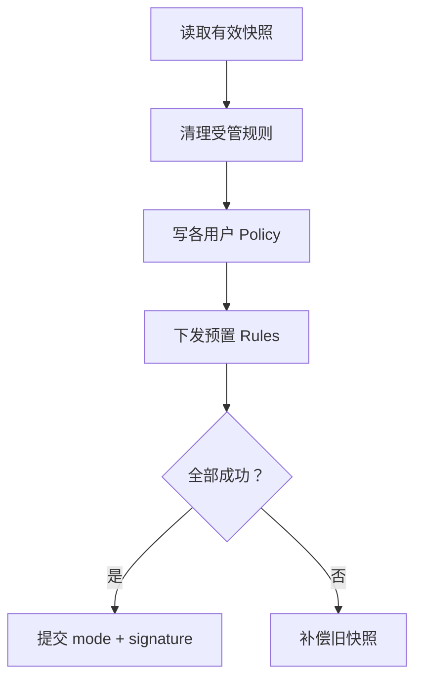

只在绿色节点之后，目标 apply state 才能被持久化。

### 讲师备注

真实 `FirewallModeSwitchService.applyModeToUsers` 已经体现“快照→清理→应用 policy/rules→成功才保存→失败 rollback”。课堂先让学员把成功路径写成测试，再注入失败；不要在同一轮同时生成完整正向与所有回滚分支。

`CURRENT GAP`：mode/signature 双 key 保存不是原子操作，旧 apply state 也未完整进入 rollback。画面保持主流程简洁，备注中必须诚实标出风险。

提交 `deaf8f27` 还证明模式写入必须保留各用户旧 `isOpen`；不要因为目标是 public 就把开关偷偷设为 true。

### 演示动作

打开 `applyModeToUsers`，让学员在代码中标出 read barrier、side effects、commit point 和 compensation entry。

### 通过条件

代码中只有一个可解释的目标状态提交点；任何早于它的本地写都被视为风险。

### 素材

- `FirewallModeSwitchService.ets`
- commit `deaf8f27`、`0b5edc5f`

---

## 第 21 页｜Round 2：在账号 123 的第 2 条规则注入失败

<!--
type: LAB
section: MDM_RALPH
layout: fault-injection
time: 4m
progress: 调试
-->

### 画面

**T02 / Mode transaction fault**

初始：`public + enabled + users=[100,112]`

目标：重放到 `[100,112,123]`

注入：账号 123 的第 2 次 `addRule` 返回失败。

四个核心断言：

1. 目标 `mode/signature` 不提交。
2. 旧 policy / rules 被尝试恢复。
3. 已新增的目标规则不残留。
4. deployment 指向恢复后新 `systemRuleId`。

### 讲师备注

先列出预期系统调用顺序，再让 AI 写 fault-injection test。测试要覆盖“补偿本身也可能失败”的证据输出，但无需在画面塞满所有断言。

现有 `FirewallFailedItem` 没有结构化 `phase=forward|compensate`，rollback 失败主要靠 `errorMessage` 推断。这是观测性 GAP。建议课堂 TARGET 返回：`userId / operation / phase / originalCode / rollbackCode / localRuleId / systemRuleId`。

### 演示动作

运行 RED；把失败点从第 2 条规则移动到 local save，观察事务期望是否仍成立。AI 只能修改 ModeSwitch 与对应测试。

### 通过条件

测试先红后绿；失败证据能区分 forward 与 compensate；本地没有伪造目标 signature。

### 素材

- `service.test.ets`
- `FirewallModeSwitchService.rollbackToSnapshot`
- commit `0b5edc5f`

---

## 第 22 页｜回滚最难的是 identity，不是把旧对象写回去

<!--
type: CODE
section: MDM_RALPH
layout: identity-remap
time: 3m
progress: 代码
-->

### 画面

```text
Before failure
  intent R1 → user 100 → systemRuleId 8001

Rollback re-add
  old rule 8001 → add again → new systemRuleId 9417

After rollback
  intent R1 → user 100 → systemRuleId 9417
```

> 业务 identity 要稳定；系统 resource identity 允许在补偿后变化。

### 讲师备注

如果只恢复系统规则、不更新 deployment mapping，下一次编辑或删除仍会针对 8001，形成“画面看起来恢复，后续操作全部错位”的延迟故障。

真实代码通过 `remapDeployments` 维护 old→new ID。DNS 目标编辑的 remove+add 也有相同问题；恢复旧 DNS 时，新 add 仍会产生新 ID。最有价值的断言不是“规则数量恢复”，而是本地 mapping 与系统返回的新 ID 一致。

### 演示动作

在测试 fake repository 中让 re-add 返回固定新 ID 9417；故意保留旧 mapping，观察下一次 delete 的目标 ID。

### 通过条件

补偿后立即执行一次 edit/delete 仍能命中真实系统规则；mapping 不是靠旧快照原样写回。

### 素材

- `FirewallModeSwitchService.remapDeployments`
- `FirewallRuleMutationService.applyDnsReplaceUpdateTransaction`
- commit `0b5edc5f`、`76e7f6e6`

---

# 第四幕：让代码越过 HarmonyOS 平台门并形成设备证据

## 第 23 页｜代码正确之前，先过四道平台门

<!--
type: CHECKPOINT
section: MDM_PLATFORM
layout: four-gates
time: 3m
progress: 证据
-->

### 画面

| Gate | 预检问题 | 失败结论 |
|---|---|---|
| SDK / API | 目标 API、API level、类型定义存在？ | BLOCKED |
| Permission / ACL | `ENTERPRISE_MANAGE_NETWORK` 等权限与签名匹配？ | BLOCKED |
| Admin | 企业管理员已激活、应用身份正确？ | BLOCKED |
| Device | 账号、网络、HDC endpoint、包版本可确认？ | UNKNOWN |

页尾：**平台预检失败时不要改业务代码。**

### 讲师备注

多用户账号读取还涉及 `GET_LOCAL_ACCOUNT_IDENTIFIERS`；仓库演进曾经历 activated accounts、权限约束、最终回到系统账号事实源。提交 `8f99fc27` / `9ea957d2` 可用于解释 API 与权限如何共同决定实现。

真机缺少企业管理能力可见 `9200001` 等错误；参数非法常见 401 / 2100001；DNS 冲突场景可见 29400007。不要只显示翻译后的 Toast，要保留原始 code、operation、userId 和 sanitized payload。

### 演示动作

用 MCP 列设备、查询包版本、构建 debug HAP；再在真机上确认 admin 激活和账号列表。任何门失败就写入 `acceptance.md / Preconditions`。

### 通过条件

四道 Gate 全有明确 PASS；无法确认的一项标 UNKNOWN，并停止“业务已完成”的结论。

### 素材

- `entry/src/main/module.json5`
- `SystemUserProvider.ets`
- `harmonyos-dev-mcp/README.md`

---

## 第 24 页｜跨进程事件传事实，业务事务仍留在 Handler

<!--
type: MAP
section: MDM_PLATFORM
layout: sequence
time: 3m
progress: 调试
-->

### 画面

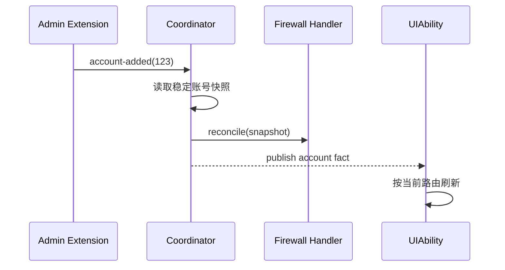

三个边界：

- Handler 失败不应吞掉稳定账号事实。
- CommonEvent 不能承担 policy/rule rollback。
- UI 互斥不覆盖 Extension 与 UI 的全局并发写。

### 讲师备注

页面第 11 页讲“架构为什么这样分”，本页讲“运行时如何调试”。建议用同一个 `eventId` 串联 Extension、Coordinator、Handler、UI 四段日志，先确定事件丢在哪一层，再决定是否修改。

提交 `0650b8eb` 展示 Extension 与 UI 不能依赖进程内单例；`cecf6d17` 展示 handler 失败与账号事实发布是两种结果。这里还要保留 `CURRENT GAP`：缺少覆盖所有 writer 的全局串行策略。

### 演示动作

模拟 Handler 返回失败，观察 CommonEvent 与 UI 刷新仍发生；再并行触发 UI 模式切换，讨论需要 session/transaction token 还是全局 writer coordinator。

### 通过条件

日志能区分 `factPublished`、`businessSucceeded`、`uiRefreshed` 三个布尔结果，而不是一个“成功”。

### 素材

- `AccountChangeCoordinator.ets`
- `AccountChangeEventBus.ets`
- commit `0650b8eb`、`cecf6d17`

---

## 第 25 页｜MCP 是证据执行器，不是事实制造器

<!--
type: MAP
section: MDM_ACCEPTANCE
layout: evidence-ladder
time: 3m
progress: 证据
-->

### 画面

| 证据层 | CURRENT | 能证明什么 |
|---|---|---|
| Build / install / launch | MCP 已支持 | 工程与设备链路可运行 |
| UI tree / action / screenshot | MCP 已支持 | 用户路径执行、画面结果 |
| HiLog query | MCP 已支持 | 调用顺序、错误码、关联 ID |
| Firewall system getter | **尚未实现** | 每用户 policy/rules 的最终事实 |

**TARGET**：补一个只读 getter / bridge；若课前未准备，系统验收只能是 `UNKNOWN`。

### 讲师备注

`harmonyos-dev-mcp` 当前明确提供设备发现、构建、安装、运行、UI 自动化、日志查询和截图。`security_tool` 的 action map 有 `firewall.toggle_status → toggle_firewall`，但没有 `firewall.get_runtime_state`。

现有 `status_toggle.json` 主要确认页面文字仍可见，并允许 `allow_unknown:true`；它不能证明所有账号的 `getNetFirewallPolicy(userId)` / `getNetFirewallRules(userId)` 正确。提交 `72cd7d47` 删除正式 E2E 的 mock/scripted 结果通道，正好强调：模拟结果不能冒充真机验收。

**Anthropic 方法锚点**：`Writing Effective Tools for Agents` 建议优先建设少量高价值、边界清晰的工具，而不是把每个底层 API 薄包装后全部暴露；工具返回也应优先提供与下一步决策相关的高信号上下文。映射到本课：`build_app`、`logs_query`、`firewall.get_runtime_state` 应分别回答“能否构建”“最早异常在哪”“系统最终事实是什么”；默认返回状态、原因码、关键对象和 evidence path，大日志按需读取，避免一次调用污染 Agent 上下文。

### 演示动作

现场打开 MCP README、bridge action map 和 `status_toggle.json`，用 CURRENT / TARGET / GAP 三色贴纸标注能力。

### 通过条件

没有人把截图、UI 文案或 mock JSON 当作系统 policy/rules 的最终证据。

### 素材

- `repos/harmonyos-dev-mcp/README.md`
- `scripts/e2e/tools/bridge_action_map.json`
- `scripts/e2e/cases/firewall/status_toggle.json`
- commit `72cd7d47`

---

## 第 26 页｜实践：把验收写成可执行的系统契约

<!--
type: LAB
section: MDM_ACCEPTANCE
layout: contract
time: 5m
progress: 证据
-->

### 画面

**T03 / Read-only Runtime Getter — TARGET**

```json
{
  "result": "PASS|FAIL|UNKNOWN",
  "accounts": [100, 112, 123],
  "mode": "public",
  "signature": "100,112,123",
  "users": [{"id": 123, "isOpen": true, "ruleCount": 4}],
  "failures": [],
  "evidence": {"device": "...", "timestamp": "..."}
}
```

操作链：`build → install → activate admin → trigger → logs → getter → screenshot`

### 讲师备注

这页不是声称仓库已有该 getter，而是把验收缺口变成明确任务。课前最佳做法：准备一个测试专用、只读、最小权限的 app bridge，直接调用现有 system repository getter，返回每用户 policy、受管规则、local apply record 和读取错误；不要通过 UI 文字二次解析。

契约必须保留：设备 ID、包版本/commit、账号快照、每用户结果、原始错误码、采集时间。读取任一关键真相源失败时 `result=UNKNOWN`，不能返回空数组并 PASS。

### 演示动作

学员先设计 JSON Schema 和 PASS 判定，再让 AI 生成 bridge 适配；只读 getter 不允许写 policy/rules。若课堂没有预构建 getter，执行到该步骤并展示诚实的 UNKNOWN。

### 通过条件

PASS 必须同时满足：系统账号集合、各用户 policy、预期规则、local signature/mapping 一致；截图只做辅证。

### 素材

- 附录 F 验收结果模板
- `FirewallSystemRepository.ets`
- `FirewallLocalRepository.ets`

---

## 第 27 页｜MDM Checkpoint：交付一条完整证据链

<!--
type: CHECKPOINT
section: MDM_ACCEPTANCE
layout: deliverable-pack
time: 4m
progress: 证据
-->

### 画面

**同伴验收只问六件事**

1. `spec.md` 是否冻结账号事实、失败语义与提交点？
2. `design.md` 是否区分 intent、local apply、system truth、UI？
3. T01 是否真的出现过可解释 RED 与 GREEN？
4. T02 故障后是否恢复 identity，而非只恢复数量？
5. 设备证据是否来自真机，UNKNOWN 是否被诚实保留？
6. diff 是否完全落在任务允许边界？

结果只允许：`PASS / FAIL / UNKNOWN`。

### 讲师备注

评分建议：规格 20，设计与不变量 20，Ralph 红绿证据 25，真机回读 25，GPU 迁移 10。不要按代码行数、Prompt 长度或 AI 生成速度评分。

扩展题放到课后：删除账号对称稳定条件、mode/signature 原子保存、全局 writer serializer、结构化 compensation phase、读取失败不降级为空。它们是真实 GAP，但不应在主实践中继续扩张任务。

**Anthropic 方法锚点**：Claude Code 最佳实践建议在长时间执行后加入 fresh-context adversarial review，让没有参与实现的 Reviewer 只根据计划、diff、测试和证据寻找缺口。课堂中的相邻小组互审就是人工版本：不读取实现者的长聊天和自我解释，只读取 spec、task、diff、progress 与 evidence pack，报告需求遗漏、越界修改和证据不足，不评价个人代码风格。

### 演示动作

相邻小组交换 evidence pack，4 分钟内只按六问给结论，并指出一条最早缺失证据。

### 通过条件

每组拥有可独立检查的完整包；没有“我本机应该是好的”这种口头通过。

### 素材

- 附录 A Runbook
- 附录 G 评分表

---

# 第五幕：把同一方法迁移到 AVC420 / AVC444

## 第 28 页｜GPU 问题先走 Evidence-first

<!--
type: CLAIM
section: GPU_METHOD
layout: transition
time: 2m
progress: 需求
-->

### 画面

**MDM：Feature-first**

`需求 → 规格 → 设计 → RED → 实现 → 系统回读`

**GPU：Evidence-first**

`现象 → 帧级证据 → 可证伪假设 → 设计 → 最小修改 → 同帧验收`

> 当“卡顿”还不能对应到某个边界时，直接让 AI 优化代码只会扩大搜索空间。

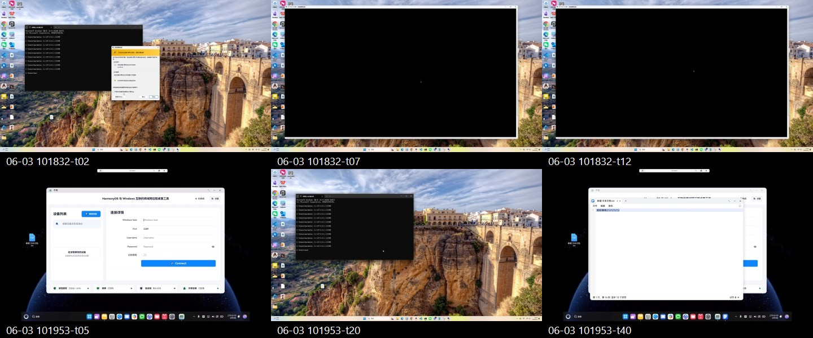

**先让学员选，不先公布答案**：看到黑屏，你的第一步是改 shader、换 decoder、加线程，还是冻结现象并采证？要求每组选一项，并写出它能被什么证据推翻。

### 讲师备注

GPU 不是第二门 48 分钟原理课，而是方法迁移：学员要学会把“视频卡、拖拽卡、白帧”变成 frameId 可追踪的问题，并判断是 decode、queue、compose、present 还是上游内容。

交付只有一张 `gpu-diagnosis.md`：现象、路径、最早异常、被排除的层、下一轮唯一修改边界、反证、验收字段。

### 演示动作

播放 13 秒黑屏录屏，先做三列记录：`直接观察 / 推测 / 尚缺证据`。第一轮不允许回答“上硬解”“改 GPU”或“加线程”。

[▶ 播放：连接后持续黑屏（13.7 秒）](../harmonyos-sdd-workshop-media/gpu-failure-black-screen-13s.mp4)

### 通过条件

每个判断都能说出需要哪条日志或指标来证明 / 推翻。

### 素材

- 黑屏故障录屏与关键帧联系表
- AVC420 / AVC444 各一段真实 HiLog

---

## 第 29 页｜先分开两条真实数据路径

<!--
type: MAP
section: GPU_METHOD
layout: dual-pipeline
time: 3m
progress: 设计
-->

### 画面

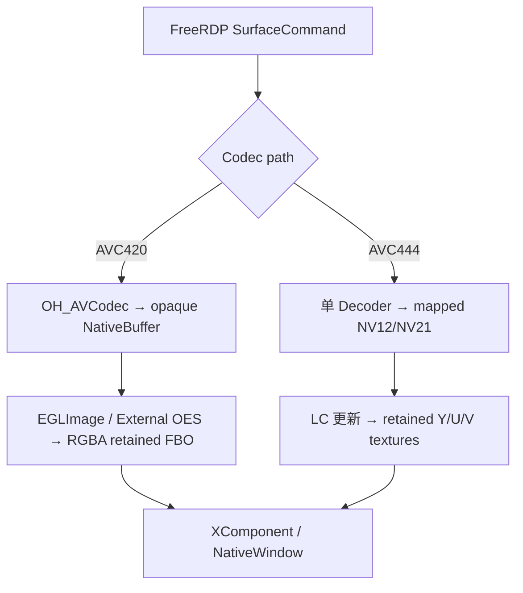

- GDI snapshot/base 只参与 AVC420 的可信 base / retained 合成；但 GPU 未消费当前命令时，420 与 444 都可能回到原生 GDI 路径，不能把“背景参与方式”和“失败回退路径”混为一谈。
- 420 的核心是 **opaque import + dirty rect + RGBA retained**。
- 444 的核心是 **mapped planes + LC + Y/U/V retained**。


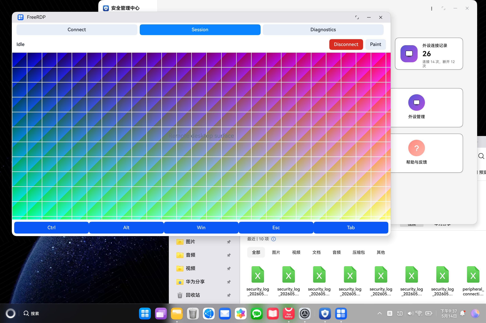

**课堂追问**：两张图肉眼几乎一致，能否据此证明它们走了同一条 Buffer 路径？答案必须回到代码入口、Buffer 类型和日志，而不是“看起来一样”。

### 讲师备注

这是必须纠正的架构事实：AVC420 retained surface 不是“4:2:0 composite”，而是 GL RGBA Texture + FBO；解码输出经 `OH_NativeBuffer → EGLImage → GL_TEXTURE_EXTERNAL_OES` 写入 dirty rect。

AVC444 才会把解码输出映射为 NV12/NV21 planes，并更新独立 Y/U/V texture state。不要把 stride / sliceHeight / plane offset 作为两个 codec 的共同 compositor 入口。

### 演示动作

在代码中分别定位 `Avc420GpuCompositorImpl` 与 `Avc444GpuCompositorImpl::State`，画出每条路径的“协议对象→Buffer→retained state→present”。

### 通过条件

学员能说明为什么不能写一个“通用 NV12 upload”同时替换 420 与 444。

### 素材

- `surface/avc420_gpu_compositor_internal.cpp`
- `surface/avc444_gpu_compositor_internal.cpp`

---

## 第 30 页｜实践：用同一个 frameId 还原一帧

<!--
type: LAB
section: GPU_METHOD
layout: trace-lab
time: 3m
progress: 调试
-->

### 画面

**G01 / Instrument only**

本轮禁止改变 renderer、queue policy 与 codec fallback，只补一条公共事件结构：

```text
runId sessionId frameId seq tsUs path event pts
queueDepth queueAgeMs durationUs owner targetEpoch result reason
```

其中 `targetEpoch` 是 **TARGET telemetry**：当前实现还没有完整的 task-carried surface generation 契约，课堂中必须标 GAP，不能伪装成现成字段。

必须串出：

`command → enqueue/decode → retained update → EndFrame → swap/present`

分别为 AVC420、AVC444 找到第一处缺失或异常事件。

### 讲师备注

AI 任务卡要限制日志开销：采样策略、周期聚合、错误全量、禁止打印 bitstream 和敏感画面数据。当前仓库已有 avg/max/count、queue depth、max EndFrame gap 等诊断；不要在课程中声称已有 P95，除非这轮真的实现并验证。

MCP 可负责构建、安装、启动、日志查询与保存，但帧级字段必须由应用 HiLog / diagnostics 提供。先建立可关联 schema，后续每轮都复用，不要每次发明新日志。

当前本地 `harmony/out` 日志只能证明若干阶段事件，例如 AVC444 prewarm 与 mapped-plane 路径，**还没有一条完整的同帧 command→decode→retained→EndFrame→present 证据**。因此这页的课堂目标是补观测，不是拿残缺日志宣布 PASS。

**真实协同片段**：

> 人：来的本来就是区域的，不要跟全屏绑定，要自己合成哈。
>
> AI：据此撤回“把当前 Buffer 当完整 Surface”的假设，把修改边界收窄到 retained RGBA FBO：SurfaceCommand 只更新 dirty rect，EndFrame 再提交完整 composite。

这段对话适合先遮住 AI 回答，只展示人的一句纠偏，让学员写出“需求语义发生了什么变化”。

### 演示动作

四人协同实操：A 控制复现场景，B 用 MCP 构建/安装/抓日志，C 让 AI 只做同 frameId 排序与缺口标注，D 负责反证。保存 `gpu-frame-trace.txt`，禁止让 AI 在这一轮改 renderer。

### 通过条件

同一帧至少能跨越 command、decode、compose/present 三层；缺失层被明确写成下一轮观测任务。

### 素材

- `Avc420GpuCompositor::Diagnostics`
- `Avc444GpuCompositor::Diagnostics`
- MCP `logs_query`

---

## 第 31 页｜指标只负责选择下一层，不替你下结论

<!--
type: DEBUG
section: GPU_METHOD
layout: diagnosis-matrix
time: 2m
progress: 调试
-->

### 画面

| 证据组合 | 最可能边界 | 下一轮只验证 |
|---|---|---|
| decode 高、queue 低 | codec / 输入格式 | 硬解输出与 PTS |
| decode 低、queue age 高 | worker / 背压 | 排队与顺序 |
| compose 高 | texture / dirty rect | import、shader、rect |
| 全段低但画面白 | 上游内容 / readiness | first abnormal frame |

页尾：FPS 是结果指标；**最早异常 + 分段耗时 + queue age** 才能选择修改层。


**带入问题**：CPU 低、decode 低，但画面仍卡，下一条日志应该放在 decoder 里，还是 queue→EndFrame/present 边界？先说反证，再选层。

### 讲师备注

矩阵是训练样例，不是自动根因分类器。必须同时记录设备、分辨率、codec、drag 场景和样本窗口。平均值会隐藏尖峰；仓库当前没有完整 P95 时，应写“建议新增 percentile telemetry”，不能伪造数字。

白帧不一定是 GPU 输出错误。先判断 primary / decoded content 是否已经白，再检查 retained state、readiness、owner 与 swap。

### 演示动作

先播放修复后 16 秒动态录屏，让学员观察“视频连续播放、窗口切换、遮挡恢复”分别验证了什么；再给两组指标样例：A `decode=3ms, queueAge=95ms`；B 各段都低但首个 decoded sample 全白。让学员分别写下一条证伪日志。

[▶ 播放：视频播放与窗口交互验证（16 秒）](../harmonyos-sdd-workshop-media/gpu-validation-video-playback-16s.mp4)

### 通过条件

答案只选择一个边界，且给出能推翻该假设的反证。

### 素材

- GPU 训练日志 A/B
- 附录 F 诊断卡

---

## 第 32 页｜HarmonyOS 适配难在 Buffer 与 Surface 生命周期

<!--
type: MAP
section: GPU_PLATFORM
layout: platform-differences
time: 3m
progress: 设计
-->

### 画面

| 移植问题 | HarmonyOS 需要显式处理 | 验证证据 |
|---|---|---|
| Codec 输出 | OH_AVCodec 异步输入/输出、NativeBuffer 生命周期 | callback、PTS、format |
| GPU 导入 | EGLImage / External OES 或 MapPlanes | format、stride、planes |
| 输出目标 | XComponent / NativeWindow create、resize、destroy | generation、size、owner |
| 失败回退 | 释放 owner、恢复 GDI producer/presenter | transition reason |

### 讲师备注

“Qt 已经鸿蒙化”并不等于 Windows/Android 的媒体与渲染路径可以原样搬过来。Qt 解决 UI/框架适配，远控视频仍要面对 HarmonyOS 的 OH_AVCodec、OH_NativeBuffer、EGL 与 XComponent 生命周期。

不要泛化为“Windows 一定用 Media Foundation”。课堂只比较当前项目的真实边界：原 FreeRDP native GDI fallback 与应用侧 GPU compositor。Surface destroy/recreate 是高频真实故障源，必须用 generation 或 target identity 防止旧回调写新窗口。

**CURRENT / GAP 必须分开**：当前代码能观察 target create/resize/destroy 与 owner reset，但还没有完整的“任务携带 surfaceGeneration，提交前再次校验”的闭环。`targetEpoch` 是下一轮设计任务，不是现状能力。

本地历史还出现过 resize 后旧的 `2432×1360` composite 被提交到新的 `3120×1885` target，而新内容实际是 `3120×1872`，最终在任务栏上方残留旧内容。这是典型的“每一帧都解码成功，但 target/retained 生命周期错位”。

### 演示动作

旋转、切后台或销毁 XComponent，观察 target changed、owner transition 与 retained state 日志；确认旧 frame 不再 present。

### 通过条件

设计中明确 Buffer 所有权、释放方、Surface generation 与旧回调处理规则。

### 素材

- `surface/xcomponent_native_host.cpp`
- `surface/surface_bridge.cpp`
- `surface/render_output_owner.cpp`

---

## 第 33 页｜项目里其实是两层、三套 OH_AVCodec 接入

<!--
type: MAP
section: GPU_PLATFORM
layout: decoder-boundaries
time: 3m
progress: 设计
-->

### 画面

| 接入 | 所在层 | 角色 |
|---|---|---|
| `h264_ohos_decoder*.c` | FreeRDP codec subsystem | 原生 GDI decode / fallback |
| `Avc420HardwareDecoder` | App AVC420 compositor | opaque NativeBuffer → EGL |
| `Avc444HardwareDecoder` | App AVC444 compositor | mapped planes → LC 合成 |

公共生命周期：`create → configure → callbacks → start → push input → consume output → release/reset`

> 公共的是 codec 生命周期，不是 420/444 的合成语义。

### 讲师备注

如果 AI 只搜索 `h264_ohos_decoder.c`，它会把优化写到 FreeRDP GDI fallback，却不影响应用侧 GPU compositor；反过来也一样。T00 勘察必须先确定用户看到的卡顿路径当前由哪个 owner 与 decoder 消费。

真实日志曾出现 `confirmed=avc444`，但实际命令计数却是 `avc420:389 avc444:0`。这说明“协商能力确认”不等于“当前每条 SurfaceCommand 的实际 codec 路径”；真正的分流事实要看命令里的 `codecId` 与实际 consumer。

解码成功只证明拿到输出 Buffer；还必须验证 format、PTS、buffer ownership、retained update、EndFrame 与 present。不要把 callback 返回当成“画面已显示”。

### 演示动作

先只给学员 `confirmed=avc444`，让其预测实际路径；再揭示 `avc420:389 avc444:0`。随后用 `rg` 搜三套 decoder，分别标注调用入口、输出对象和最终 presenter；让 AI 解释本轮修改为什么只属于其中一套。

### 通过条件

代码 diff 落在真实数据路径；没有“改了 fallback，却拿 GPU compositor 日志宣称生效”。

### 素材

- `FreeRDP/libfreerdp/codec/h264_ohos_decoder.c`
- `surface/avc420_gpu_compositor_internal.cpp`
- `surface/avc444_gpu_compositor_internal.cpp`

---

## 第 34 页｜实践：420 验证 import，444 验证 plane math

<!--
type: LAB
section: GPU_PLATFORM
layout: split-buffer
time: 3m
progress: 代码
-->

### 画面

**AVC420 / opaque output**

- `OH_NativeBuffer` 能否创建 EGLImage？
- External OES 纹理采样方向、裁剪与色彩是否正确？
- dirty rect 外像素是否由 RGBA retained FBO 保留？

**AVC444 / mapped output**

- `MapPlanes` 返回的 Y / UV offset、rowStride、pixelStride？
- NV12 与 NV21 的 U/V 顺序？
- sliceHeight / 对齐是否导致越界或错色？


图片只能证明“输出视觉一致”；420 的 import 成功必须由 EGLImage/OES 日志证明，444 的 plane math 必须由 runtime planes 与边界检查证明。两张漂亮图都不能替代结构化证据。

### 讲师备注

这页必须分栏，不能再把 NV12 plane 计算当作 AVC420 compositor 的公共步骤。420 当前走 opaque NativeBuffer import；444 需要 mapped-plane 校验并上传到纹理。

为 444 准备一个 8×4 小 Buffer 练习，要求学员根据 runtime planes 而不是 `width*height` 猜偏移。为 420 准备色块和局部 dirty rect，验证 retained 区域不被清空。所有检查先在小样本完成，再回到 1080p/4K 性能。

### 演示动作

让 AI 生成只读 Buffer inspector 与色块 test pattern，不允许改正式 shader；分别保存 import result 和 plane layout。

### 通过条件

420 的证据包含 EGLImage import + rect 结果；444 的证据包含真实 planes、格式与无越界检查。任一路都不能用另一条路径的证据代替。

### 素材

- `OH_NativeBuffer` / EGL 日志
- `Avc444HardwareDecoder::MapDecodedFrame`
- 色块与 dirty-rect 测试帧

---

## 第 35 页｜AVC420 先有可信背景，才能接管输出

<!--
type: MAP
section: GPU_420
layout: takeover-flow
time: 3m
progress: 代码
-->

### 画面

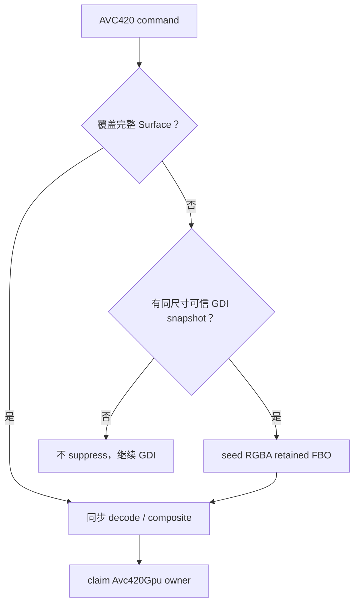

首次 takeover 同步消费借用的 command 数据；进入 Active 后才深拷贝 stream / rect 并异步入队。

### 讲师备注

AVC420 retained state 是 RGBA FBO：GDI base 与 AVC dirty rect 在同一 retained composite 中更新。局部更新没有可信背景时，不能以黑底或空纹理接管，否则拖拽后会出现缺块。

这里加入一段真实“错误方向→语义纠偏→设计收敛”的案例：早期方案把 dirty-region AVC420 输出当完整帧直接 OES present，日志出现 `lastFullSurface=no`，绿块、黑块与暴露区域无法避免；人的一句“来的本来就是区域的，不要跟全屏绑定，要自己合成哈”冻结了需求语义，随后才转向 retained RGBA FBO。

另一条白帧案例也可对照：GDI primary buffer 在 resize/init 后已存在，但尚无真实远端更新，内容本身是白像素；native 又请求 repaint，于是白帧被正确地“显示”出来。最终修复不是改 ArkTS Stack、clear color 或 shader，而是在真实 `HarmonyEndPaint` 后才标记 primary renderable。

可信 GDI snapshot 至少要满足 target 可用、尺寸匹配、时间新鲜、像素有效。当前日志会报告 snapshot 失败与 `maxAgeMs=500`，但不会输出真实 `snapshot age=...`；若需要年龄，标为 TARGET telemetry，不能把示例 920ms 当现有字段。

0 dirty rect、inter-frame command 与 synthetic EndFrame 也要进入测试。`frameOpen=false` 时 FreeRDP bridge 会构造 synthetic matched callback，解释了部分帧为何可以立即走完边界。

### 演示动作

依次输入：full update、partial+fresh snapshot、partial+no snapshot；观察 owner 是否只在前两种接管。随后让学员用遮罩盖住右半屏，只拖动左侧窗口，检查 rect 外旧像素是否保留。

### 通过条件

无可信背景的 partial command 不抑制 GDI；接管后 rect 外旧像素保持不变。

### 素材

- `Avc420GpuCompositor::OnSurfaceCommand`
- `SeedBackgroundBeforeTakeover`
- commit `a9c05d2`、`a6918ba1`

---

## 第 36 页｜AVC420 的稳定性来自状态与顺序

<!--
type: DEBUG
section: GPU_420
layout: state-risk
time: 2m
progress: 调试
-->

### 画面

状态：`Detached → Active ↔ TargetPaused`；致命失败进入 `Failed`，后续成功可再次直接接管。

三条审查提醒：

- `failures >= 3` 与 `ignoredUpdates >= 6` 是生命周期累计计数，不是“连续 N 次”。
- Active 队列深度达到 24 后会先压缩 backlog，尽量保留最新匹配 EndFrame；若压缩后仍达到硬上限 720，enqueue 失败，当前 command 转同步处理，可能越过旧队列工作，属于顺序 GAP。
- fail-open 释放 GPU owner 并恢复 GDI pipeline，不代表 GDI 能在同一帧立即完整恢复。

### 讲师备注

当前状态枚举是 `Detached / Active / TargetPaused / Failed`。不要画一个不存在的 Bootstrapping 状态；bootstrap 是接管过程，不一定是公开 state。

普通 AVC pending 需要匹配 EndFrame 再 present，但 AVC420 存在明确例外：无 AVC pending 的 GDI-only 更新可立即提交；deferred GDI-only 可在匹配 EndFrame 提交；target 恢复可重呈现 retained composite。不要讲成“所有 present 必须 EndFrame”。

历史排查中曾因“降低延迟”丢弃 25 个旧 SurfaceCommand。对全帧视频这听起来合理，但 dirty-region AVC420 的旧命令可能包含未被后帧覆盖的像素，删除它们等于破坏画面状态。课堂让学员先回答：**局部更新队列能否套用 latest-frame-wins？**

### 演示动作

故障注入三种情况：target 暂不可用、连续累积失败、队列接近 720。让学员分别判断 preserve、pause、release owner 与顺序风险。

### 通过条件

诊断报告区分状态、owner、累计计数和 queue ordering；没有把 fail-open 写成无缝恢复保证。

### 素材

- `avc420_gpu_compositor.h/.cpp`
- `avc420_gpu_compositor_internal.cpp`
- commit `93c6207`、`d789bb5`

---

## 第 37 页｜AVC444 的关键是 LC 与单 Decoder

<!--
type: MAP
section: GPU_444
layout: lc-state
time: 2m
progress: 代码
-->

### 画面

| LC | 要解码的内容 | retained 更新 |
|---:|---|---|
| 0 | stream1=luma，stream2=chroma | Y + U/V |
| 1 | stream1=luma | Y，并初始化/保留 base chroma |
| 2 | stream1=chroma | U/V，保留 Y |

**一个硬件 decoder 顺序消费 luma / chroma**，按流准备 SPS/PPS 与 reset/resync；不是两路普通视频并行播放。

**先问再揭晓**：为什么不用两个 decoder 并行解 luma 与 chroma？让学员从“参考状态、SPS/PPS、reset/resync、LC=1/2 retained readiness”四个词中选两个组成反证。

### 讲师备注

解码输出经 MapPlanes 得到 NV12/NV21，再由 shader 按 dirty rect 更新 retained Y/U/V textures。v1/v2 chroma 的变换要以 FreeRDP CPU 路径作为 oracle 做已知帧对照，“接近参考模型”不能写成 bit-exact，除非测试已经证明。

`CURRENT GAP`：AVC444 的 `kMaxWorkerTasks=720` 当前主要累加 `queueOverLimit` 后仍继续 push，不是真正硬上限；Surface destroy 时外层 owner 会重置，但 compositor 资源与 active 生命周期没有像 420 一样完整闭合。两项都应进入风险与验收，而不是当成已实现特性。

### 演示动作

用 LC=0、1、2 各一条命令，检查 decoder 调用顺序、retained luma/chroma readiness 与 EndFrame present。

### 通过条件

没有为 luma/chroma 创建两个互相失去参考状态的 decoder；LC 更新后未更新的 plane 保持旧值。

### 素材

- `Avc444GpuCompositorImpl::State`
- `Avc444GpuRenderer::ApplyLuma/ApplyChroma*`
- commit `5370d34`、`227c1a9`

---

## 第 38 页｜420 / 444 共守输出契约，但不能共用实现假设

<!--
type: CHECKPOINT
section: GPU_ACCEPTANCE
layout: contract-and-challenge
time: 2m
progress: 证据
-->

### 画面

**公共输出契约**

1. 任一时刻只有一个 `RenderOutputOwner` 写 XComponent。
2. 首次接管前 retained state 必须完整可信。
3. 普通 pending frame 只在匹配 real / synthetic EndFrame present。
4. **TARGET / GAP**：Surface generation 变化后，旧 task/callback 必须因 `targetEpoch` 不匹配而被拒绝；当前实现尚未完整闭环。

**诊断挑战**

- Case 420：decode 4ms，queue age 110ms，队列满后同步 fallback。
- Case 444：decode/compose 都低，LC=2 到达但 luma readiness=false。


### 讲师备注

必须拆开 AVC420 的两套状态：应用侧 `RenderOutputOwner::Avc420Gpu` 决定谁可写 XComponent；FreeRDP 侧 `avc420GpuOutputActive` 决定原生 GDI decode / presenter 是否 suppress。二者不同步会出现“双写”或“无人写”。

Case 420 的第一假设是 backpressure 与队列顺序，不是继续换 decoder；Case 444 的第一假设是首次接管 readiness / 命令序列，不是色彩转换。详细答案与反证见附录 F。

### 演示动作

每组任选一个 Case，写出：最早异常、下一轮唯一修改边界、反证、需要保存的同 frameId 日志。最后播放正向录屏，但只允许对契约逐项判定：视频动了不等于全 PASS；没有同帧日志与 targetEpoch 证据的条目仍是 UNKNOWN。

[▶ 播放：修复后动态验证（16 秒）](../harmonyos-sdd-workshop-media/gpu-validation-video-playback-16s.mp4)

### 通过条件

诊断没有跨 codec 套用错误假设；输出 owner、readiness、EndFrame、Surface generation 均有证据。

### 素材

- `render_output_owner.h/.cpp`
- `ohos_rdpgfx_surface.c`
- `gpu-diagnosis.md`

---

## 第 39 页｜把方法带回项目，只保留七个问题

<!--
type: CLAIM
section: CLOSING
layout: final-chain
time: 4m
progress: 证据
-->

### 画面

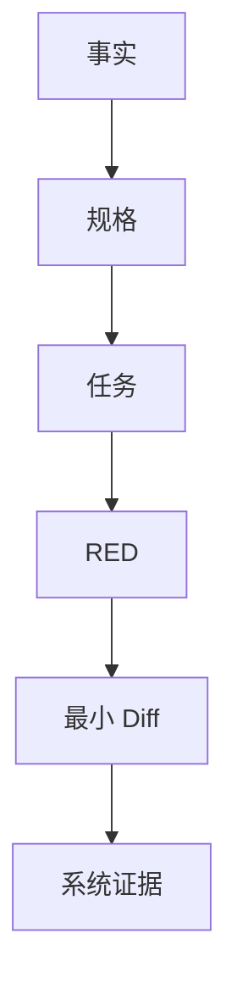

下一次拿到复杂需求，只问七个问题：

1. 哪些词会让实现分叉？
2. 最终真相在哪一层？
3. 哪些不变量绝不能破坏？
4. 本轮只允许 AI 改哪个边界？
5. 怎样先制造一个可解释的 RED？
6. 最早异常证据在哪里？
7. 什么证据满足后，Ralph 必须停止？

### 讲师备注

用两个案例做最后对照：MDM 的关键是先由规格冻结多用户与事务语义；GPU 的关键是先由证据缩小未知边界。但两者最后都落到同一个外部循环：任务小、失败真、diff 窄、证据可追踪、停止条件明确。

请学员展示最终包，不再展示聊天窗口。讲师最后强调：AI 可以加速探索、测试、实现和取证，但产品决策、真相源、事务边界和 PASS 判定仍由工程师负责。

### 演示动作

每组用 30 秒说出一条“原本准备让 AI 猜、现在改为先冻结或先取证”的真实工作项。

### 通过条件

学员带走的是可复用工作流与模板，而不是两个项目答案。

### 素材

- MDM evidence pack
- `gpu-diagnosis.md`
- 七问行动卡

---

# 附录 A｜120 分钟讲师 Runbook

## A1. 严格时间盒

| 时间 | 页码 | 目标 | 必须保住的实践 |
|---|---:|---|---|
| 00–08 | 1–3 | 建立课程契约、英雄任务与 Ralph 循环 | PASS / FAIL / UNKNOWN |
| 08–26 | 4–8 | 领域模型、歧义、EARS、行为矩阵 | `spec.md` |
| 26–42 | 9–14 | 状态、真相源、架构、追踪、任务卡 | `design.md`、T01 |
| 42–70 | 15–22 | 两轮 RED→GREEN、日志定位、故障注入、identity | `progress.md`、patch |
| 70–88 | 23–27 | 平台预检、跨进程、MCP、验收 | `acceptance.md`、evidence |
| 88–116 | 28–38 | GPU Evidence-first、420/444 实现与诊断 | `gpu-diagnosis.md` |
| 116–120 | 39 | 同伴审阅、迁移七问、收束 | 最终包 |

以上按每页 `time:` 元数据合计恰好 120 分钟。若现场工具链变慢，优先压缩讲师揭晓和代码浏览，不压缩以下四项：歧义冻结、一个真实 RED、一次故障注入、一次设备证据判定。

## A2. 讲师节奏

每 8–12 分钟完成一次“结论→示例→实践→证据”：

1. 先给一个可争论问题，不先给答案。
2. 学员让 AI 产出候选，人完成决策或证据判断。
3. 打开真实代码 / 测试 / 日志校正 AI。
4. 立即写入 spec、task、progress 或 evidence，不留在聊天窗口。

## A3. 现场降级策略

| 阻塞 | 允许的降级 | 不允许的假通过 |
|---|---|---|
| DevEco / SDK 不可用 | 使用课前 RED/GREEN 录制输出，结论标环境 UNKNOWN | 手写绿色输出 |
| 无真机 | 使用真实采集的只读 evidence bundle，标“回放证据” | 使用 mock 冒充本次真机 |
| Admin 激活失败 | 保留构建/安装证据，系统行为 UNKNOWN | 用 UI 页面可打开判 PASS |
| Getter 未准备 | 完成 contract 与现有 UI/log 证据，最终系统状态 UNKNOWN | 声称已有 `firewall.get_runtime_state` |

---

# 附录 B｜MDM 课堂冻结规格

## B1. TEACHING Requirements

### FR-ACC-001｜新增账号稳定快照

WHEN 收到 `account-added(triggerAccountId)`，THE SYSTEM SHALL 最多读取 5 次系统账号集合；只有包含触发账号时才 dispatch。若仍不可见，SHALL 不 dispatch、不 publish 旧快照，并记录 timeout evidence。

### FR-ACC-002｜账号集合幂等

WHEN 稳定账号集合的排序 signature 与最后成功 apply signature 相同，THE SYSTEM SHALL 跳过 public/private 模式重放；只有系统 apply 成功后才保存新 signature。

### FR-MODE-001｜保留总开关

WHEN 在任意账号上切换 public/private/custom，THE SYSTEM SHALL 保留该账号旧 policy 的 `isOpen`，只改变规格规定的默认动作与受管规则。

### FR-MODE-002｜模式事务

IF 任一用户的 policy、rule 或 local commit 失败，THE SYSTEM SHALL 不提交目标 apply state，并尝试恢复快照中的 policy、rules 与 deployment mapping；恢复后 mapping SHALL 使用系统重新分配的 rule ID。

### FR-TOGGLE-001｜总开关部分失败

WHEN 对全部用户设置 `isOpen` 且部分用户失败，THE SYSTEM SHALL 保留成功用户结果，返回每用户失败明细，并且不保存目标 `desiredEnabled`。

### FR-OBS-001｜结构化失败证据（TARGET）

WHEN forward 或 compensate 系统调用失败，THE SYSTEM SHALL 记录 `transactionId / userId / operation / phase / code / localRuleId / systemRuleId`，不得只返回模糊消息。

### NFR-SAFE-001｜未知不等于空

IF 系统 policy/rules、账号集合或 local mapping 读取失败，THE SYSTEM SHALL 在任何破坏性写入前停止；禁止把读取失败降级为空集合后继续 clear。

## B2. 完整行为矩阵

| 场景 | CURRENT / 课堂冻结行为 | 本地状态 | 证据重点 |
|---|---|---|---|
| 已开启再次开启 | Page 层 no-op；Service 本身无此保证 | 不变 | 系统 set 调用数 0 |
| 已关闭再次关闭 | Page 层 no-op | 不变 | 系统 set 调用数 0 |
| 总开关全成功 | 各用户只改 `isOpen`，保留 action | 保存 desired | 每用户 getter |
| 总开关部分失败 | 成功用户保留，失败用户明细 | 不保存 desired | mixed state + failedItems |
| public/private + 新账号 | 等 trigger 可见后在最新集合重放 | 成功后 mode/signature | 账号 123 policy/rules |
| custom + 新账号 | 同步默认 policy，不扩大旧规则 scope | 成功后更新 signature | intent targetUsers 不变 |
| 新增账号超时 | 不用旧快照 dispatch | 不提交 | retry + timeout |
| 删除账号 | CURRENT：读一次；空/失败不 prune | 安全时裁剪 mapping | removed user 不残留 |
| 重复 signature | 跳过重放 | 不变 | 系统写调用数 0 |
| 模式应用失败 | 快照补偿；恢复 ID 重映射 | 不提交目标 state | forward + rollback |
| 多用户 Create 部分失败 | CURRENT：继续收集所有失败后统一回滚 | 不写 intent/mapping | 所有 target 尝试过 |
| 普通 Edit | retained update + added add + removed remove | 全成功才保存 | bucket + reverse compensation |
| 目标类型 DNS | remove old + add new | 保存新 system ID | DNS replace |
| DNS→IP | CURRENT：retained deployment 原地 update | ID 保持 | update target ID |
| Delete 部分失败 | 重新 add 已删除规则 | 保留 intent | 恢复后 ID 对齐 |
| Local save 失败 | 视为事务失败并补偿系统 | 不形成半提交 | system/local 一致 |

## B3. 不变量与当前 GAP

| ID | 不变量 / 风险 | 状态 |
|---|---|---|
| I1 | 写入基于显式账号快照 | CURRENT 主要具备 |
| I2 | 模式切换保留 `isOpen` | CURRENT，`deaf8f27` 修复 |
| I3 | intent 可追踪到每用户 deployment | CURRENT |
| I4 | 补偿后 mapping 使用新 systemRuleId | CURRENT 主要具备 |
| I5 | 新增账号 trigger 可见才 dispatch | CURRENT |
| G1 | 读取失败可能被降级为空 | GAP |
| G2 | mode/signature 双 key 可能半提交 | GAP |
| G3 | account-removed 无对称稳定等待 | GAP |
| G4 | UI 与 Extension writer 无全局串行 | GAP |
| G5 | rollback phase 缺少结构化字段 | GAP |

## B4. `spec.md` 空白模板

```markdown
# <Feature> Specification

## Context
- 用户 / 设备 / 账号范围：
- 当前行为与证据：
- 本轮目标：
- 不在范围内：

## Terms
| Term | Exact meaning | Truth source |
|---|---|---|

## Open Decisions
| ID | Question | Options | Owner | Status |
|---|---|---|---|---|

## Functional Requirements
### FR-XXX
WHEN ...
WHILE ...
THE SYSTEM SHALL ...
IF ... THEN SHALL ...

## Behavior Matrix
| Initial | Trigger | System effect | Local commit | Failure |
|---|---|---|---|---|

## Invariants
- I1：

## Acceptance
- Direct fact required：
- PASS：
- FAIL：
- UNKNOWN：
```

## B5. `design.md` 空白模板

```markdown
# <Feature> Design

## Requirement Trace
| Requirement | Decision | Boundary | Test | Device evidence |
|---|---|---|---|---|

## State and Truth Sources
| State | Owner | Read failure | Write / commit point |
|---|---|---|---|

## Process Boundaries
- Extension：
- Service / Handler：
- UIAbility / ViewModel：
- Cross-process event：

## Transaction
- Snapshot：
- Forward order：
- Commit point：
- Compensation order：
- Identity remap：
- Compensation failure evidence：

## Concurrency
- Serialized writers：
- Still-unprotected writers：
- Stale callback / generation rule：

## Observability
- correlationId：
- mandatory fields：
- sampling / privacy：

## Current Gaps and Deferred Tasks
- GAP：
```

---

# 附录 C｜AI Prompt 梯子

下面的 Prompt 不是“万能咒语”，而是每轮输入/权限/输出/停止条件的模板。每次只使用当前阶段的一条。

## C1. 歧义勘察 Prompt

```text
你是需求分析协作者。不要设计方案，不要写代码。

输入：<原始需求>、<领域对象>、<目标平台约束>。

任务：只找会改变状态模型、系统调用顺序、事务补偿、
跨进程行为、测试或验收的实现分叉。

每项输出：
1) 原文中的模糊词；2) 至少两个互斥答案；
3) 每个答案改变的工程行为；4) 必须由谁决定；
5) 若不决定，AI 最可能做出的危险假设。

禁止输出架构、类名、代码。未知标 OPEN。
```

## C2. 仓库只读勘察 Prompt

```text
本轮禁止修改任何文件。

围绕 <Requirement ID>，使用搜索和提交历史给出：
- 用户/系统入口；
- 最短调用链；
- 每个真相源与失败表达；
- 所有副作用与唯一 commit point；
- 已有单测、设备测试、E2E；
- 相关提交为何改变行为；
- 规格与当前实现的差距。

每个结论必须附现有路径/符号/提交证据。
找不到就写 NOT FOUND，不得发明 API。
```

## C3. 任务切片 Prompt

```text
根据已冻结 spec/design，把 <Requirement ID> 切成最小任务。

每张任务卡必须包含：唯一可观察结果、Allowed Files/Layers、
Forbidden Changes、失败测试、实现提示、验证命令、证据文件、
停止条件、剩余风险。

一个任务若需要同时改 UI、Service、Repository、系统 bridge，
请继续拆分。不要按文件数量切任务。
```

## C4. RED Prompt

```text
只为 <Task ID> 增加一个会因缺少目标行为而失败的测试。
先阅读现有测试风格和可用 fake/mock；不要虚构 Hamock API。

运行最窄测试并报告：命令、退出码、唯一目标失败、关键输出。
若失败来自环境/编译/无关断言，停止并标 BLOCKED，禁止改生产代码。
```

## C5. 最小实现 Prompt

```text
目标：让 <Task ID> 的目标 RED 转 GREEN。

只允许修改：<Allowed>。
禁止修改：<Forbidden>。
必须保持：<Invariants>。

先说明最小状态转换和预计 diff，再实施。
不得删除/放宽测试，不得把未知降级为空，不得顺便重构。
完成后运行窄测试、相关回归，并更新 progress.md。
```

## C6. DEBUG Prompt

```text
不要先给修复。根据同一个 correlationId/frameId 的证据：
1) 标出最早异常事件；
2) 列出已被证据排除的层；
3) 给出一个可证伪假设；
4) 只增加验证该假设所需的最小日志/探针；
5) 写出会推翻假设的反证。

禁止根据最终 UI 现象直接跳到根因。
```

## C7. 验收审阅 Prompt

```text
按 spec 的每个 SHALL 审阅 evidence pack。
只返回 PASS / FAIL / UNKNOWN。

PASS：必须有要求层级的直接事实；
FAIL：直接证据与预期矛盾；
UNKNOWN：设备、权限、getter、日志字段或证据缺失。

UI 文案只能证明 UI；mock 只能证明测试逻辑；
不得用较弱证据替代 system getter。
```

---

# 附录 D｜Ralph 任务与进度模板

## D1. Task Card

```markdown
# TXX — <一个可观察结果>

## Requirement
- FR-...

## Current Evidence
- 现有行为：
- 代码锚点：
- 已知 GAP：

## Allowed
- 文件 / Layer：

## Forbidden
- 不得修改：
- 不得改变的不变量：

## RED First
- 输入：
- 注入失败：
- 预期断言：
- 运行命令：

## Minimal Implementation Hint
- 只描述边界和状态转换，不预写完整实现。

## Verify
- Narrow test：
- Related regression：
- Build / device：
- Evidence paths：

## Stop
- [ ] RED 原因正确
- [ ] GREEN + 回归
- [ ] diff 未越界
- [ ] 设备事实 PASS，或阻塞为 UNKNOWN
- [ ] progress.md 已更新
```

## D2. Progress Ledger

```markdown
## Round <N> — <timestamp>

- Task：
- Hypothesis：
- RED command / exit / evidence：
- Files changed：
- GREEN command / exit / evidence：
- New fact：
- Remaining risk：
- Verdict：PASS | FAIL | UNKNOWN
- Stop reason / Next task：
```

## D3. 两轮课堂示例

### Round 1 / T01

- Hypothesis：账号事件先于 OS 查询结果可见。
- RED：旧快照 `[100,112]` 被 dispatch。
- Minimal diff：新增事件按 trigger 可见性重试；timeout 拒绝旧快照。
- New fact：stable=trigger present，不是 consecutive equal reads。
- Next：在最新快照上注入模式下发失败。

### Round 2 / T02

- Hypothesis：账号 123 第 2 条 add 失败会污染目标 signature 或旧 mapping。
- RED：rollback 后 deployment 仍指向旧 systemRuleId。
- Minimal diff：收集 re-add 返回 ID，并 remap deployment；目标 apply state 不提交。
- Remaining risk：rollback phase 不结构化；mode/signature 原子性未解决。
- Stop：窄测/回归绿，设备 getter 仍待课前能力；最终为 UNKNOWN 或 PASS 取决于证据。

---

# 附录 E｜构建、测试与 MCP 验收手册

## E1. 本地验证命令

在 `repos/security_tool` 按项目 README 与本机 DevEco 工具链执行：

```powershell
hvigorw test --mode module -p product=default -p module=entry@default
hvigorw assembleHap --mode module -p product=default -p module=entry@default
```

设备侧测试示例：

```powershell
hvigorw test --mode module -p product=default -p module=entry@ohosTest
hvigorw assembleHap --mode module -p product=default -p module=entry@ohosTest
hdc shell aa test -b com.huawei.securitytool -m entry \
  -s unittest OpenHarmonyTestRunner -w 60000
```

命令必须按实际 OS、SDK 与签名环境调整；讲师课前把最终可用命令写进 task card，不在现场猜工具路径。

## E2. MCP 可执行链（CURRENT）

`harmonyos-dev-mcp` 当前可组合：

```text
list_devices
→ build_app(project_path, target="hap", module_name="entry")
→ install_app(hap_path, device_id)
→ run_app(bundle_name, device_id)
→ find_elements / click / input_text
→ logs_query(package_name, marker_keywords, save_path)
→ get_ui_tree
→ screenshot(local_path)
```

建议把一次验收固定为一个 `runId`，在应用日志、文件名与 `acceptance.md` 中复用。冷构建给足 120 秒工具超时；UI mutation 在同一设备串行，不要并发点击制造假失败。

## E3. 系统 Getter（TARGET）

只读 getter 至少返回：

```json
{
  "schemaVersion": 1,
  "runId": "mdm-20260831-001",
  "deviceId": "<device>",
  "bundleVersion": "<version-or-commit>",
  "readAt": "<iso-time>",
  "accounts": {"status": "OK", "ids": [100, 112, 123]},
  "applyState": {"mode": "public", "signature": "100,112,123"},
  "users": [
    {"id": 123, "policyStatus": "OK", "isOpen": true,
     "inAction": "...", "outAction": "...",
     "rulesStatus": "OK", "managedRuleIds": [9417, 9418]}
  ],
  "mappingStatus": "OK",
  "errors": []
}
```

任何 `status != OK` 都使最终判定至少为 UNKNOWN。禁止使用 `rules=[]` 同时表达“确实无规则”和“读取失败”。

## E4. `acceptance.md` 模板

```markdown
# Acceptance — <runId>

## Identity
- Device / HDC endpoint：
- Bundle / version / commit：
- Build artifact hash：
- Time range：

## Preconditions
- SDK / permission / ACL：admin：PASS | FAIL | UNKNOWN
- Accounts before：
- Mode / desired before：

## Action
- Trigger / UI flow：
- Injected failure：

## Evidence
- unit-test-red.txt：
- unit-test-green.txt：
- build.txt：
- device-log.txt：
- runtime-state.json：
- screenshot.png：

## Requirement Verdicts
| Requirement | Direct evidence | Verdict | Reason |
|---|---|---|---|

## Final
PASS | FAIL | UNKNOWN
```

---

# 附录 F｜GPU 实现与诊断手册

## F1. AVC420 / AVC444 事实对照

| 维度 | AVC420 | AVC444 |
|---|---|---|
| Decoder output | opaque NativeBuffer | mapped NV12/NV21 planes |
| GPU input | EGLImage + External OES | Y/UV plane upload |
| Retained state | RGBA Texture + FBO | Y/U/V texture state |
| First takeover | full update 或可信 GDI base | 完整 luma/base-chroma readiness |
| Partial update | dirty rect 外保留旧 RGBA | LC 更新指定 luma/chroma |
| GDI relation | producer 保留；GPU owner 时 presenter 受控 | GPU owner 时 GDI presenter 受控 |
| Decoder model | AVC stream + retained GDI | 单 decoder 顺序消费 luma/chroma |
| Current risk | 累计阈值、queue 720 同步越序、0 rect | queue 非硬上限、Surface lifecycle |

## F2. AVC420 接管判定

| 输入 | 背景 | 结果 |
|---|---|---|
| Full-surface AVC | 不要求 GDI seed | 可同步构建 base 并尝试接管 |
| Partial AVC | fresh、同尺寸、有效 GDI snapshot | seed RGBA FBO 后接管 |
| Partial AVC | 无可信 snapshot | 返回 false，不 suppress GDI |
| Active AVC | retained 已可信 | 深拷贝 command 后入 worker |
| Active enqueue 失败 | retained / owner 仍在 | 当前实现可能同步处理，检查顺序 GAP |

`failures` 与 `ignoredUpdates` 是累计计数；教学时若要表达“连续失败”，必须先设计 reset 条件并补测试。

## F3. AVC444 LC 判定

```text
LC=0: needsLuma=true,  needsChroma=true
      stream1=luma, stream2=chroma

LC=1: needsLuma=true,  needsChroma=false
      stream1=luma

LC=2: needsLuma=false, needsChroma=true
      stream1=chroma
```

只有 retained state 满足 present readiness 时才可 claim / present。测试至少覆盖 LC 顺序变化、SPS/PPS 缺失、decoder reset、NV12/NV21、v1/v2 chroma、0 dirty rect、Surface recreate。

## F4. Frame boundary 的规则与例外

- 普通 AVC pending update：匹配 real 或 synthetic EndFrame 后 present。
- `frameOpen=false`：bridge 生成 synthetic matched frame callback。
- AVC420 GDI-only 且无 AVC pending：可以立即 present。
- AVC420 deferred GDI-only：可在匹配 EndFrame present。
- target 恢复：可以直接重呈现 retained composite。

因此验收断言应写具体分支，不能写成“所有 present 都必须对应真实 EndFrame”。

## F5. `gpu-diagnosis.md` 模板

```markdown
# GPU Diagnosis — <runId>

## Reproduction
- Device / build / resolution / network：
- Gesture or workload：
- AVC420 | AVC444 | shared：
- Time window / frameId：

## Symptom
- 可观察现象：
- 基线指标：decode / queueAge / compose / present / fps：

## Earliest Anomaly
- Event：
- Evidence：
- Layers already excluded：

## Falsifiable Hypothesis
- Hypothesis：
- One boundary to change or instrument：
- Counter-evidence that would reject it：

## Minimal Diff
- Allowed files：
- Forbidden changes：

## Verification
- Same frameId trace：
- Owner / readiness / EndFrame / Surface generation：
- Before / after metrics：
- Visual evidence：

## Verdict
PASS | FAIL | UNKNOWN
```

## F6. 两个课堂 Case 参考答案

### Case 420

证据：decode 4ms、compose 3ms、queueAge 110ms，queue 达 720 后 enqueue false、当前命令转同步路径。

- 最早异常：worker 排队与排序边界。
- 下一轮：只记录 sequence number、enqueue/processed order、fallback path；不要改 decoder。
- 反证：若 queueAge 降低且严格顺序仍卡，假设被推翻，继续看 present / target。
- GAP：同步处理可能越过旧队列任务，不能宣称天然保序。

### Case 444

证据：decode/compose 均低，首个可见命令 LC=2，retained `hasLuma=false`。

- 最早异常：首次接管 readiness / 命令序列，不是 shader 性能。
- 下一轮：记录 LC、SPS/PPS、hasLuma/hasChroma、claim owner；验证是否应等待 luma base。
- 反证：若此前有成功 LC0/1 并且 luma state 在同 Surface generation 有效，则检查生命周期丢失。

## F7. GPU 验收矩阵

| 场景 | 必备直接证据 | PASS 条件 |
|---|---|---|
| 420 full takeover | command、import、retained、owner | 首帧完整、无双写 |
| 420 partial + seed | snapshot validity、rect、FBO | rect 外像素保留 |
| 420 partial no seed | suppress/owner log | 保持 GDI，不出现黑底 |
| 420 target pause/recover | generation、state、re-present | 旧 callback 不写新 target |
| 420 backlog | enqueue/process sequence | 无协议乱序或明确安全策略 |
| 444 LC0/1/2 | LC、decode order、readiness | 未更新 plane 保持旧值 |
| 444 NV12/NV21 | planes、shader input、known frame | 无错色/越界 |
| 444 queue / Surface | depth、destroy/reset、owner | 队列有界目标与资源闭合 |
| 共用输出 | owner transition、EndFrame、swap | 单 owner、帧边界正确 |

---

# 附录 G｜代码与提交素材索引

## G1. MDM 代码锚点

| 教学问题 | 真实锚点 |
|---|---|
| 全用户总开关 | `FirewallPolicyService.setFirewallEnabledForAllUsers` |
| 稳定账号快照 | `AccountChangeCoordinator.loadStableSnapshot/runOnce` |
| 账号对账 | `FirewallAccountChangeHandler.handle` |
| 模式事务 | `FirewallModeSwitchService.createSnapshot/applyModeToUsers/rollbackToSnapshot` |
| Identity remap | `FirewallModeSwitchService.remapDeployments` |
| 规则事务 | `FirewallRuleMutationService.applyUpdateTransaction` |
| DNS replace | `FirewallRuleMutationService.applyDnsReplaceUpdateTransaction` |
| UI 互斥 | `FirewallPage`、`FirewallOverviewViewModel` |

推荐提交故事：

- `deaf8f27`：模式切换错误地重新开启防火墙。
- `ddff7a5f`：拆分 Policy / Mode / Rule 等职责。
- `0b5edc5f`：快照、补偿、systemRuleId remap。
- `f6886182`：UI / ViewModel 模式与开关互斥。
- `063ac1ab`：Create / Edit / Delete 事务补偿。
- `76e7f6e6`：目标 DNS 的 remove+add 与新 ID。
- `94ff17e7`：账号变化对账、desiredEnabled、mode/signature。
- `53751b2e`：handler registry 与 CommonEvent。
- `c0c1bc9f`：account-added 200ms×5 等 trigger 可见。
- `9c7fb186`：custom 模式保存 signature。
- `cecf6d17`：handler 失败仍发布账号事实。
- `4906f7d3 → 06864339 → 78fca089`：401、undefined payload、错误证据闭环。
- `72cd7d47`：正式 E2E 删除 mock/scripted 结果通道。

## G2. GPU 代码锚点

| 教学问题 | 真实锚点 |
|---|---|
| 420 owner/state/queue | `surface/avc420_gpu_compositor.h/.cpp` |
| 420 decode/EGL/retained | `surface/avc420_gpu_compositor_internal.cpp` |
| 444 queue/callback | `surface/avc444_gpu_compositor.cpp` |
| 444 decoder/LC/YUV | `surface/avc444_gpu_compositor_internal.cpp` |
| 公共 owner | `surface/render_output_owner.h/.cpp` |
| XComponent target | `surface/xcomponent_native_host.cpp` |
| FreeRDP OHOS bridge | `client/OHOS/ohos_rdpgfx_surface.c` |
| FreeRDP H264 fallback | `libfreerdp/codec/h264_ohos_decoder*.c` |

可用于讲师备注的提交锚点：`a9c05d2`、`a6918ba1`、`93c6207`、`d789bb5`、`5370d34`、`227c1a9`、`1c07750`、`00544cb`。上课不在画面堆哈希，只在打开历史时使用。

## G3. 每 2–3 页插入的真实素材

1. MDM 首页与账号列表截图。
2. `rg` 勘察结果与调用链。
3. T01 红测 / 绿测对照。
4. 模式事务关键代码与 fault injection 输出。
5. Extension / Coordinator / UI 同 eventId 日志。
6. MCP build/install/log/screenshot 输出。
7. AVC420 opaque import、dirty rect、owner 日志。
8. AVC444 planes、LC、readiness 日志。
9. Surface destroy/recreate 与 owner transition。
10. 最终 evidence pack 文件树。

---

# 附录 H｜课前准备与视觉交付清单

## H1. 讲师必须提前准备

- 锁定两个仓库的演示 commit，确认所有代码锚点仍存在。
- 准备训练分支：T01/T02 可产生真实 RED；不要直接在已经修复的 HEAD 上假演示失败。
- 在授课设备跑通 Hvigor test/build、签名、安装、admin 激活与 HDC。
- 准备账号 `[100,112,123]` 或等价真机条件。
- 若要最终 PASS，课前实现并验证只读 firewall runtime getter；否则在材料中固定展示 UNKNOWN。
- 预采集一份真机 evidence bundle，作为设备故障时的“回放证据”，标明设备与时间。
- 为 GPU 准备 AVC420/AVC444 可复现片段、卡顿录屏、已脱敏 frame trace 与色块 Buffer。
- 提前验证 39 页所有 `time:` 合计 120 分钟。

## H2. PPT 资产命名

```text
assets/
├── 01-opening-device-vs-tests.png
├── 04-mdm-domain-model.svg
├── 15-t01-red.png
├── 16-t01-green.png
├── 18-mdm-401-log.png
├── 21-rollback-fault.png
├── 24-cross-process-log.png
├── 25-mcp-current-target.png
├── 29-dual-codec-path.svg
├── 34-buffer-inspection.png
├── 35-avc420-takeover.png
├── 37-avc444-lc.png
└── 38-owner-frame-trace.png
```

## H3. 页面制作验收

- [ ] 画面层每页只有一个判断中心。
- [ ] 所有长答案、完整矩阵、哈希与路径进入 Notes / 附录。
- [ ] 表格画面层不超过 4×4；代码不超过 12 行。
- [ ] CLAIM / MAP / CODE / DEBUG / LAB / CHECKPOINT 节奏交替。
- [ ] 所有 CURRENT / GAP / TARGET 标签颜色统一。
- [ ] LAB 都有输入、允许动作、交付和通过条件。
- [ ] DEBUG 都有最早异常、下一步和反证。
- [ ] 证据页明确 PASS / FAIL / UNKNOWN。
- [ ] 页脚进度带 `需求—设计—任务—代码—调试—证据` 与本页阶段一致。

---

# 附录 I｜项目事实与方法论依据

## I1. 项目事实来源

本课程的项目事实以以下本地仓库及其提交历史为准：

- `repos/security_tool`
- `repos/harmony-windows-bridge`
- `repos/harmony-windows-bridge/harmony/third_party/FreeRDP`
- `repos/harmonyos-dev-mcp`

对外分享前，再按授课当天的 HarmonyOS SDK、MDM API、OH_AVCodec / OH_NativeBuffer 文档复核接口签名、权限、错误码和生命周期约束。外部文档只用于确认平台契约；案例行为仍必须由当前代码、测试和真机证据共同支持。

## I2. Anthropic 方法论文章

| 官方文章 | 核心观点（本课采用的部分） | 在课程中的落点 |
|---|---|---|
| [Best practices for Claude Code](https://code.claude.com/docs/en/best-practices) | 先 Explore，再 Plan、Implement；给 Agent 可运行的检查；主动管理上下文；长任务后用新上下文反证 | 第 3、13、27 页 |
| [Building Effective AI Agents](https://www.anthropic.com/engineering/building-effective-agents) | 从最简单可行方案开始；工作流适合确定路径，Agent 适合开放任务；执行中持续获取环境 ground truth，并设置 checkpoint / stopping condition | 第 3、28、39 页 |
| [Effective Harnesses for Long-Running Agents](https://www.anthropic.com/engineering/effective-harnesses-for-long-running-agents) | 首轮建立任务与验证清单；后续一次只推进一个 feature；使用 progress、Git 和端到端测试完成跨上下文交接 | 第 14–17 页、附录 D |
| [Effective Context Engineering for AI Agents](https://www.anthropic.com/engineering/effective-context-engineering-for-ai-agents) | 上下文是有限注意力预算；保留完成当前任务所需的最小高信号信息；长任务使用压缩、结构化记录和按需检索 | 第 13、17 页、附录 D |
| [Writing Effective Tools for Agents](https://www.anthropic.com/engineering/writing-tools-for-agents) | 少量高价值工具优于大量重叠薄包装；工具应有清晰边界、语义化返回、token 效率，并用真实任务评测 | 第 25–26 页、附录 E |

## I3. 从文章观点到本课动作

本课不照搬 Claude Code 命令或 Web App 示例，而是提炼跨工具、跨项目成立的工程动作：

| Anthropic 观点 | 本课工程化动作 | HarmonyOS 项目证据 |
|---|---|---|
| Agent 需要环境 ground truth | 每轮必须读取测试、构建、日志、system getter 或帧链事实 | MDM policy/rules；GPU frameId/owner/EndFrame |
| 没有检查就只能“看起来完成” | STOP 由可执行 Verification 决定，阻塞时返回 UNKNOWN | RED/GREEN、HAP build、真机回读 |
| 一次只推进一个 feature | 一张 Task Card 只允许一个可观察结果和有限文件范围 | T01 稳定快照；T02 故障补偿；T03 getter |
| progress 是跨上下文控制面 | 记录新事实、证据路径、剩余风险和 Stop/Next，不复制聊天 | `progress.md` 与 evidence pack |
| 上下文要少而高信号 | 只给 spec、current task、progress、相关文件和证据索引 | 新会话复现下一步，不重新扫描整仓 |
| 工具应面向工作流而非底层 API | MCP 返回 Agent 下一步决策所需的状态、原因码和证据路径 | `build_app`、`logs_query`、TARGET runtime getter |
| 实现者不应独自给自己打分 | 同伴或新上下文只按 AC、diff、测试和证据反证 | 第 27 页 evidence pack 互审 |

引用这些文章的目的不是给课程增加一套新名词，而是说明：本课从两个真实 HarmonyOS 项目提炼出的“任务小、失败真、上下文窄、证据强、停止清楚”，与 Anthropic 在 Agent 工程实践中总结的可靠性原则一致。

---

# 附录 J｜GPU 图片、视频与协同实操包

本附录只服务第 28–38 页，不改变原 39 页结构。正文保留概念与判断，附录提供“怎么让学员带入、怎么播放素材、怎么实操、怎么判定”的完整脚本。若严格维持 120 分钟，可选做 J2 的前两轮；若作为半天 workshop，可完整执行三轮。

## J1. 已整理进课件包的素材

| 素材 | 内容 | 课堂用途 | 能证明 / 不能证明 |
|---|---|---|---|
| `gpu-failure-black-screen-13s.mp4` | 连接后远程窗口持续黑屏 | 第 28、32 页故障起点 | 能证明用户现象可复现；不能直接证明 decoder、GPU 或 Surface 是根因 |
| `gpu-failure-black-screen-contact.jpg` | 黑屏录屏关键帧 | 投屏静止讨论、标注最早异常 | 能证明现象时序；不能替代 frameId 日志 |
| `gpu-validation-video-playback-16s.mp4` | 视频播放、窗口切换与遮挡变化 | 第 31、38 页动态验证 | 能证明可见交互与连续性；不能单独证明 owner、EndFrame、targetEpoch 契约 |
| `gpu-validation-video-playback-contact.jpg` | 修复后动态录屏关键帧 | 逐格检查场景覆盖 | 适合对比遮挡前后；不证明 bit-exact 或没有偶发尖峰 |
| `gpu-connection-interaction-contact.jpg` | 连接、打开内容、页面变化、右键交互 | 可选扩展验证 | 证明多种交互被执行；前段含连接信息，公开投屏前需裁剪/脱敏 |
| `nativebuffer-test-pattern.png` | NativeBuffer 阶段色块 | 第 29、34 页 420 import | 只证明该阶段画面；路径事实仍需 EGLImage/OES 日志 |
| `rgba-renderer-test-pattern.png` | RGBA renderer 阶段色块 | 第 29、34 页 retained 输出 | 可与上一张肉眼对照；不能替代 dirty-rect 保留断言 |

仓库素材目录：`../harmonyos-sdd-workshop-media/`。

## J2. 三轮实操：需求拆解 → 开发 → 验证 → 问题处理

### Round 1｜先把“黑屏”拆成可验证需求（6–8 分钟）

1. 播放 `gpu-failure-black-screen-13s.mp4`，第一次静音、不暂停。
2. 学员只写观察：什么时候进入远程窗口、黑色区域是否变化、鼠标/外层窗口是否仍响应。
3. 第二次播放时建立行为契约：
   - WHEN 远端已有真实更新且 target 可用，THE SYSTEM SHALL 在匹配帧边界提交可见内容。
   - IF primary/retained 尚未 ready，THEN SHALL 保留 fallback 或返回 UNKNOWN，不得把空/白/黑状态标为可显示。
4. 每组把“换 decoder、改 shader、加线程”放入假设栏，不得写入需求栏。
5. 交付：`gpu-diagnosis.md / Symptom + First Missing Evidence`。

讲师追问：如果黑屏窗口外的 HarmonyOS UI 正常，排除了什么？没有排除什么？

### Round 2｜只开发最小观测，不急着修 renderer（8–10 分钟）

任务卡只允许新增/补齐公共帧事件：

```text
runId sessionId frameId seq tsUs path event pts
queueDepth queueAgeMs durationUs owner targetEpoch result reason
```

协同分工：

- 人：冻结本轮问题语义、Allowed/Forbidden 与停止条件。
- AI：只读搜索实际 codec/owner 路径，生成日志点候选和最小 diff；不得顺手换 decoder 或重构队列。
- MCP/设备操作者：构建、安装、启动、复现、抓日志、截图，记录设备与包版本。
- Reviewer：按同一个 frameId 排序，只找“最早缺失/异常”，不评价代码风格。

交付物必须包含命令、退出结果、时间窗与 evidence path。若日志仍串不起完整一帧，结论为 UNKNOWN，下一轮任务是补唯一缺口。

### Round 3｜修复后做正向与破坏性验证（8–12 分钟）

播放 `gpu-validation-video-playback-16s.mp4`，逐项检查：

| 动作 | 可见检查 | 同步证据 | 判定 |
|---|---|---|---|
| 视频连续播放 | 无持续静止、黑/绿块 | queue age、EndFrame gap、present | PASS / FAIL / UNKNOWN |
| 窗口移动/遮挡 | 暴露区域被正确恢复 | dirty rect、retained readiness | PASS / FAIL / UNKNOWN |
| 切换设置/返回 | owner 不双写、不丢写 | owner transition、target identity | PASS / FAIL / UNKNOWN |
| resize/重建 | 无旧尺寸残留 | old/new size、targetEpoch | 当前通常为 UNKNOWN，直到 epoch 闭环完成 |

随后注入一个失败：target 暂不可用、partial+no snapshot、LC=2 且 luma not ready，三选一。观察系统是否 preserve/pause/fail-open，而不是只看“最后有没有画面”。

## J3. 一组图片不是装饰，而是一条证据叙事

建议按以下顺序投屏：

1. **现象图**：黑屏联系表。问“我们直接看到了什么？”
2. **路径图**：420/444 双路径。问“最早应该在哪个边界分流？”
3. **代码图**：三套 decoder 的搜索结果。问“改哪一套才会影响当前命令？”
4. **日志图**：同 frameId 事件。问“第一处缺失在哪？”
5. **设计图**：retained takeover / LC readiness。问“哪条不变量阻止错误接管？”
6. **验证图**：动态录屏联系表。逐项判 PASS/FAIL/UNKNOWN。
7. **剩余风险图**：targetEpoch、AVC420 同步 fallback 顺序、AVC444 软上限。明确哪些仍未完成。

截图时固定四个角标：`runId`、设备/分辨率、codec/path、commit/包版本。没有这四项的图只做场景素材，不进入最终 evidence pack。

## J4. 人、AI、MCP 如何协同，才不会演成聊天秀

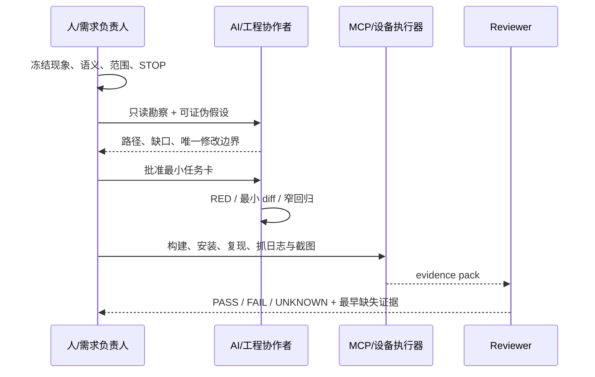

真实协同的关键不是谁打字，而是谁拥有哪类决定：

- 人决定问题语义。例如“来的本来就是区域的，不要跟全屏绑定，要自己合成哈”直接否定了 full-frame 假设。
- AI 负责快速搜索、列假设、生成最小修改与测试，但不能替人扩张范围。若人只要求清缓存，AI 不得顺手删除整条 EGLImage 路径。
- MCP 负责重复、可记录的设备动作，不负责把截图解释成系统真相。
- Reviewer 只依赖 spec、task、diff、test 与 evidence；不接受“实现者说已经好了”。

## J5. 现场可直接使用的 Prompt

### 只读定位

```text
只处理 AVC420/AVC444 GPU 送显，不修改文件。根据当前代码与一段录屏，区分：
1) 直接观察；2) 未证实假设；3) 实际 codec/owner 路径；4) 最早缺失证据。
所有结论给出代码符号或日志字段。找不到就写 NOT FOUND。
```

### 最小开发

```text
只允许补 frame trace，不允许修改 renderer、decoder、queue policy、fallback。
字段固定为 runId/sessionId/frameId/seq/tsUs/path/event/pts/queueDepth/
queueAgeMs/durationUs/owner/targetEpoch/result/reason。
先给 RED 与开销预算，再做最小 diff。无法串起完整帧时停止并标 UNKNOWN。
```

### 验收审查

```text
按同一个 runId/frameId 审查 command→decode→retained→EndFrame→present。
对 owner、readiness、dirty-rect 保留、target identity 分别给 PASS/FAIL/UNKNOWN。
视频和截图只能作辅证；缺字段不得推断为 PASS。
```

## J6. 最终证据包目录

```text
evidence/gpu-<runId>/
├── 00-identity.txt              # device / resolution / codec / commit / package
├── 01-symptom.mp4               # 原始复现，未剪掉失败过程
├── 02-frame-trace.txt           # 同 frameId 排序
├── 03-diagnostics.txt           # queue/decode/compose/present 聚合
├── 04-before.png
├── 05-after.png
├── 06-diff.patch
├── 07-test-output.txt
├── 08-device-build-install.txt
└── acceptance.md                # 每条契约 PASS / FAIL / UNKNOWN
```

## J7. 仍在本地、但未直接打包的可选录屏

| 本地文件 | 时长/内容 | 使用建议 |
|---|---|---|
| `LOCAL_ONLY/屏幕录制 2026-05-21 211221.mp4` | 约 61 秒；连接、打开内容、页面变化、右键交互 | 很适合完整 E2E，但前段含连接信息；先裁剪/脱敏再公开投屏 |
| `LOCAL_ONLY/屏幕录制 2026-06-03 102420.mp4` | 约 67.7 秒；多窗口与图片操作 | 含私网地址、用户名与私人窗口，不建议原样用于公开课 |
| `LOCAL_ONLY/屏幕录制 2026-08-07 144716.mp4` | 约 11.3 秒；新版连接页与 USB 选项 | 属于产品/USB 演示，不放进 GPU 28–38 页 |
| `LOCAL_ONLY/屏幕录制 2026-06-03 102437.mp4` | 0 字节 | 无效素材，禁止列入验证证据 |

## J8. 讲师最终检查

- [ ] 每段视频播放前有问题，播放后有判定，不是背景素材。
- [ ] 故障录屏保留失败过程，没有只展示“修好了”。
- [ ] 截图标明 runId、设备、codec/path 与版本。
- [ ] 当前实现、历史方案、TARGET/GAP 使用不同标签。
- [ ] `confirmed codec` 与实际 `SurfaceCommand.codecId` 不混用。
- [ ] 420 与 444 不共享错误的 Buffer/compositor 假设。
- [ ] 没有把单帧截图、漂亮色块或流畅视频单独当作系统 PASS。
- [ ] 公开投屏前完成 IP、用户名、聊天窗口与密码区域脱敏。
