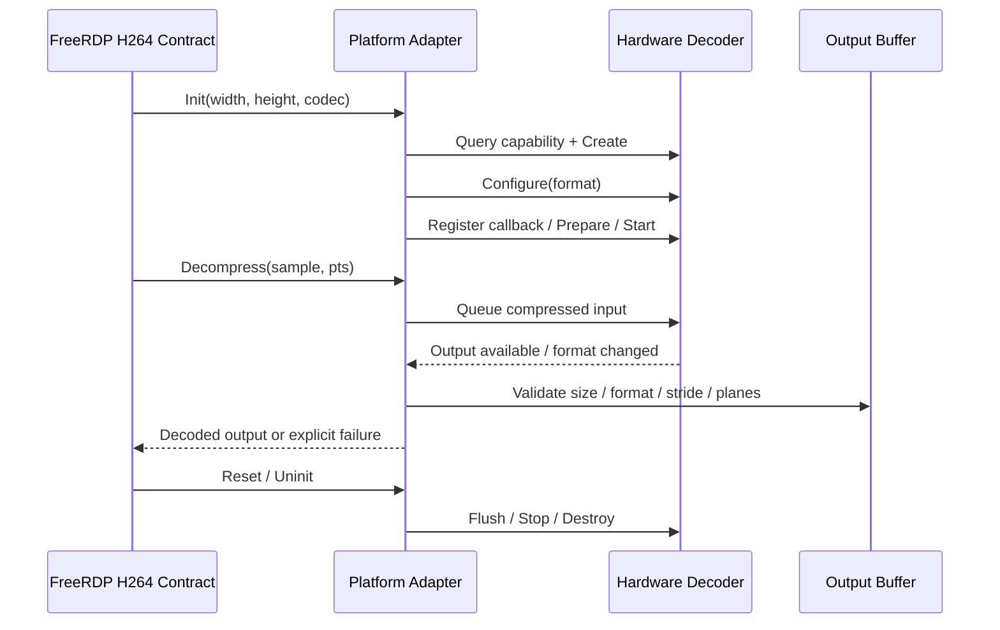
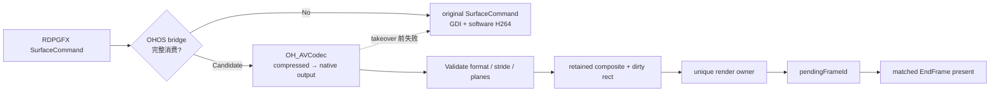

# 阶段 3｜跨平台 H.264 实现调研

> 调研目标：不是让 AI 找一篇“HarmonyOS 硬解教程”，而是从 FreeRDP 已有平台实现中提炼稳定契约，再推导 HarmonyOS 必须适配的 decoder、buffer、Surface、frame boundary 和 fallback 边界。

## 1. 调研输入与输出

### 输入问题

1. FreeRDP 原生 H.264 subsystem 如何隔离不同 decoder backend？
2. Windows Media Foundation 和 Android MediaCodec 如何管理硬解生命周期？
3. FFmpeg/OpenH264 为什么仍要保留？
4. HarmonyOS `OH_AVCodec` 能直接复用哪些契约？
5. 为什么“替换 decoder”不等于“完成 GPU 远控渲染”？

### 必须产出

```text
platform-research.md
├─ 同与不同对照表
├─ decoder 生命周期时序图
├─ RDPGFX command 到 present 的责任示意图
├─ HarmonyOS 能力映射表
├─ 可复用 / 不可照抄清单
└─ 对 ADR 和最小穿刺的直接输入
```

## 2. AI 怎么读：先接口，后平台细节

| 轮次 | 只读什么 | 要回答什么 | 停止条件 |
|---|---|---|---|
| R1 上层契约 | `h264.c` 与 subsystem 接口 | backend 必须交付什么 | 能列出 init/decompress/reset/uninit 与输出语义 |
| R2 正确性基线 | `h264_ffmpeg.c` / `h264_openh264.c` | 软解回退与 YUV 语义 | 能说明硬解失败时回到哪里 |
| R3 硬解对照 | `h264_mf.c` / `h264_mediacodec.c` | create/configure/input/output/flush/release | 能区分通用契约与平台对象 |
| R4 目标平台 | `h264_ohos_decoder*.c` | capability、AVBuffer、format、stride/plane | 能写出 OHOS 能力映射和 GAP |
| R5 显示边界 | `ohos_rdpgfx_*` + `avc420_gpu_compositor*` | consumed、owner、dirty rect、EndFrame、fallback | 能证明 decoder 实现不是完整方案 |

AI 每读一个平台只写四行摘要：`Create`、`Input`、`Output`、`Failure/Cleanup`。未回答当前调研问题的实现细节不进入上下文。

## 3. 跨平台源码事实对照

| 实现 | 代码入口 | 运行模型 | 可复用契约 | 不可照抄 |
|---|---|---|---|---|
| FFmpeg | `h264_ffmpeg.c` | 同步软解、CPU YUV 输出 | 正确性基线、错误传播、fallback | 软件线程/内存与 GPU 性能模型 |
| OpenH264 | `h264_openh264.c` | 软解对照 | decode 状态、I420 语义 | 平台 Surface 与 native buffer |
| Windows MF | `h264_mf.c` | 平台硬解、sample in/out | decoder 创建、format 协商、flush/release | COM、Media Foundation sample 和 Windows surface |
| Android MediaCodec | `h264_mediacodec.c` | 移动平台异步 buffer 队列 | input/output buffer 生命周期、format change、有界等待 | Android buffer index、JNI/Surface 时序 |
| HarmonyOS AVCodec | `h264_ohos_decoder.c` / `_buffer.c` | `OH_AVCodec` + `OH_AVBuffer/OH_NativeBuffer` | hardware capability、configure/start、native output、stride/plane | 仅解决 decoder；不自动解决 RDPGFX consumed/owner/EndFrame |

### 可复用结论

> **我们复用的是契约，不是代码。** 平台实现都需要创建、配置、输入、取得输出、验证格式和释放；但 buffer 所有权、Surface 和异步回调时序必须按 HarmonyOS 重新设计。

## 4. 通用 decoder 生命周期时序图



### 平台差异放在哪里

```text
Windows MF     : COM object + Media Sample + Windows Surface
Android        : buffer index/callback + MediaCodec Surface
HarmonyOS      : OH_AVCodec + OH_AVBuffer + OH_NativeBuffer

共同点          : 状态机、输入输出关联、格式验证、失败释放
必须适配      : API、buffer ownership、callback 线程、Surface 生命周期
```

## 5. 为什么 decoder 调研还不是完整方案

decoder 只把压缩 H.264 变成解码输出。远控客户端还必须回答：当前 command 是否由 GPU 完整消费、谁可以写显示 Surface、dirty rect 如何与上一帧合成、什么时候 present、失败时能否回到 GDI。



**方案推导：**

- FreeRDP OHOS bridge 拥有 command 校验、consumed/fallback 和 frame 语义。
- App compositor 拥有 `OH_AVCodec`、native buffer、retained composite、worker queue 与 owner。
- ArkTS/UI 只交付 NativeWindow 与生命周期事件，不介入 codec 状态机。
- original GDI/H264 subsystem 保留，作为 takeover 前的可解释 fallback。

## 6. HarmonyOS 能力映射与证据要求

| 能力问题 | HarmonyOS 对接点 | 开发时必须保存的证据 |
|---|---|---|
| 是否有硬件 H.264 decoder | `OH_AVCodec_GetCapabilityByCategory(..., HARDWARE)` | decoder name、capability result、device/build identity |
| 如何配置 | video format + configure/prepare/start | width/height/pixel format/返回码 |
| 如何输入 | AVBuffer/input callback | frameId、PTS、bytes、queue result |
| 如何取得输出 | output callback + description | output PTS、size、format、stride、planes |
| 如何进入 GPU | `OH_AVBuffer_GetNativeBuffer` + compositor | native import、target generation、owner |
| 何时显示 | pending state + matched EndFrame | pendingFrameId、EndFrame id、present result |
| 失败怎么办 | original callback / GDI fallback | reason、consumed=false、owner transition、可见恢复 |

## 7. 三个候选方案

| 方案 | 做法 | 看起来的优点 | 关键问题 | 结论 |
|---|---|---|---|---|
| A 只替换 H264 subsystem | 新增 OHOS decoder backend，输出仍走 GDI | 接口小、fallback 清晰 | 不能建立 native-buffer GPU owner 与 retained composite | 保留为 fallback/对照，不是完整方案 |
| B App 旁路直播 | App 收 H.264 字节后直接送 Surface | 演示快 | 绕开 dirty rect、AVC444 LC、EndFrame 与原生 fallback | 淘汰 |
| C RDPGFX 受控接管 | bridge 保存原回调，App compositor 管硬解/GPU，EndFrame 显示 | 语义完整、可回退、可逐层验收 | 边界多，必须先穿刺 | 采用 |

## 8. 调研结论如何直接输入 ADR

```text
Decision
  在 OHOS RDPGFX bridge 保存并替换 SurfaceCommand/EndFrame 回调；
  App compositor 直接管理 OH_AVCodec、native buffer、retained state 和 present；
  original GDI/H264 subsystem 保留为 fallback。

First Slice
  AVC420 一份压缩输入 → 一份合法 native output
  → 一次 retained composite → 一次 matched EndFrame present
  → 一次 takeover 前失败回退。

Deferred
  AVC444、zero-copy、连续队列优化、resize/后台/重连长稳。
```

## 9. 调研证据等级

1. 当前 FreeRDP/HarmonyOS 源文件：主证据。
2. HarmonyOS 官方 API/SDK 契约：平台能力证据。
3. 已保存的源码调用链与 evidence index：复现入口。
4. 博客、问答、示例：只作为搜索线索。
5. AI 的概括：必须回到源码或官方契约核对，不能单独进入 ADR。

## 10. 阶段出口门

- [x] 已对照软解、Windows 硬解、Android 硬解和 HarmonyOS AVCodec 实现。
- [x] 已提炼平台无关 decoder 生命周期。
- [x] 已明确 decoder 与 RDPGFX/GPU 显示契约是两层问题。
- [x] 已淘汰 App 旁路直播方案。
- [x] 已把采用方案、第一切片和延后项输入 ADR。
- [ ] 目标设备硬件 decoder identity 与格式支持仍需最小穿刺证明。
