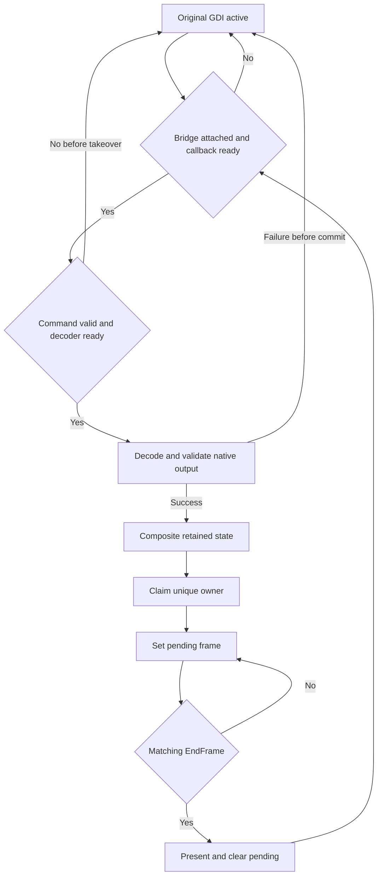

# ADR-GPU-001｜HarmonyOS H.264 硬解接入方案

- 状态：Accepted；源码实现已存在，真机性能与长稳验收仍需补证据
- 适用：FreeRDP HarmonyOS client
- 依据：代码认知地图、跨平台实现调研、当前 OHOS adapter

## Context

原始实现的视频处理走 CPU/软件 H.264 路径，未走 GPU，用户在远端视频播放中感知到卡顿。这是本案例已冻结的需求背景；软件路径同时保留为正确性 fallback。方案目标是在不破坏 FreeRDP 协议语义和原生回退的前提下，接入 HarmonyOS 硬件 decoder 与 GPU 合成。具体 CPU/FPS 改善幅度、设备兼容性与长稳结果由后续同场景 A/B 单独判定，不在 ADR 中预设。

## Decision

1. 在 OHOS RDPGFX bridge 保存并替换 `StartFrame / SurfaceCommand / EndFrame` 回调；原回调始终保留为原生 GDI fallback。
2. GPU 接管路径由 App compositor 直接管理 `OH_AVCodec`、`OH_NativeBuffer`、retained composite 与 worker；不把 GPU 显示问题简化成只替换 `H264_CONTEXT_SUBSYSTEM`。
3. 原生 `gdi_SurfaceCommand → H264_CONTEXT_SUBSYSTEM` 路径继续存在，负责未接管、未支持或 takeover 前失败的 command。
4. 第一条最小穿刺选择 AVC420：一份压缩输入、一份合法 native output、一次 retained composite、一次匹配 EndFrame present、一次可解释 fallback。
5. 只有 command 通过原生顺序校验、target/background 可用、decode/composite 成功并建立 pending present 后，才允许新路径返回 consumed 并 suppress GDI。
6. decode/composite 发生在 SurfaceCommand；真正的前台交换只发生在 `pendingFrameId` 匹配的 EndFrame。
7. FreeRDP OHOS 层拥有协议校验、frame 语义、consumed/fallback policy；App C++ compositor 拥有 decoder、buffer、queue、owner 与 present；ArkTS/UI 只交接权限、NativeWindow 和生命周期事件。

## 方案调用链

```text
RDPGFX SurfaceCommand
→ OHOS RDPGFX bridge 校验与 candidate policy
├─ GPU ready
│  → App compositor → OH_AVCodec → OH_NativeBuffer
│  → retained composite → pendingFrameId
│  → matched EndFrame → RenderOutputOwner → EGL present
└─ not consumed / takeover 前失败
   → 保存的 original SurfaceCommand
   → gdi_SurfaceCommand → H264_CONTEXT_SUBSYSTEM / GDI
```

## 责任边界

| 组件 | 输入 | 持有状态 | 输出/提交点 | 失败语义 |
|---|---|---|---|---|
| FreeRDP GDI | 未接管的 SurfaceCommand | 原生 surface/H.264 context | original SurfaceCommand | 保持既有路径 |
| OHOS RDPGFX bridge | StartFrame、SurfaceCommand、EndFrame | original callbacks、frame/candidate/consumed | 调 App callback 或回 original | 接管前失败返回 original，不静默吞 command |
| App pipeline | bridge callback、NativeWindow/lifecycle | callback wiring、output policy | AVC420/444 compositor | callback 未 ready 时不允许接管 |
| AVC420 compositor | command、target、EndFrame | decoder、worker、retained surface、pendingFrameId | 唯一 owner 的 present | output/target 不合法时不提交 pending |
| RenderOutputOwner | GDI/AVC420/AVC444 ownership 请求 | 当前 owner 与 transition reason | 允许唯一显示路径 | 拒绝双写或无原因切换 |
| ArkTS/UI | XComponent Surface 和生命周期 | 页面/Surface 生命周期 | target bind/detach | 不拥有 codec 或帧状态机 |

## 接管状态机



状态提交点是 `pendingFrameId` 建立并返回 consumed。该点之前允许走 original GDI；该点之后不得让 original path 写同一帧，后续失败必须走显式 owner/recovery 策略，不能同时回放两个 renderer。

## 不变量

```text
I1: original callbacks 在 attach 时保存，bridge detach/recovery 前始终可定位。
I2: callback/decoder/output/target 任一未 ready 时 consumed=false。
I3: output format、size、stride、planes、native buffer 未验证时不 claim owner。
I4: 同一 frameId 只有一个 render owner。
I5: pendingFrameId 与 EndFrame 不匹配时不 present。
I6: target generation 变化后，旧 worker task 不得写入新 Surface。
I7: 运行证据不能关联 commit/runId 时，状态只能是 UNKNOWN。
```

## 失败决策表

| 失败点 | 是否已接管 | 动作 | 必须记录 |
|---|---:|---|---|
| bridge/callback 未 ready | 否 | 调 original callback | reason、frameId、callback state |
| 无硬件 decoder / init 失败 | 否 | 调 original callback；设备标 `UNSUPPORTED/FAIL` | decoder name/category、stage、return code |
| input/output/format/native buffer 失败 | 否 | 不提交 pending，调 original callback | input/output PTS、format、reason |
| composite 或 owner claim 失败 | 否 | 保留 original path，不产生双写 | target generation、owner transition、reason |
| pending 后 target 丢失 | 是 | 暂停/丢弃旧 generation，按 lifecycle 策略恢复 | pending frame、old/new generation、recovery verdict |
| EndFrame mismatch | 是 | 不 present，清理或保留由状态机决定 | active/pending/end frameId |

## Alternatives

| 方案 | 结论 | 原因 |
|---|---|---|
| 在 App 旁路收到 H.264 字节直接送 Surface | Reject | 绕开 dirty rect、AVC444 LC、EndFrame 和 fallback |
| 只替换 `H264_CONTEXT_SUBSYSTEM` | Reject as complete solution | 可解决 decoder backend，但不能建立 native-buffer GPU owner、retained composite 与 EndFrame present |
| 先实现完整 zero-copy AVC444 | Defer | 同时引入 codec、plane、owner、surface、shader 变量 |
| 永久使用软件解码 | Keep as fallback | 正确性可兜底，但不能满足性能目标 |

## Deferred

- AVC444 LC / 单 decoder / retained state。
- zero-copy 优化。
- resize、后台、重连的完整长稳。
- 多设备 decoder 兼容矩阵。

## 进入实现的证据门

只有最小穿刺 `SP-01..05` 全部有结论，才能把方案拆成完整任务；否则 ADR 仍是方向，不是已完成设计。
