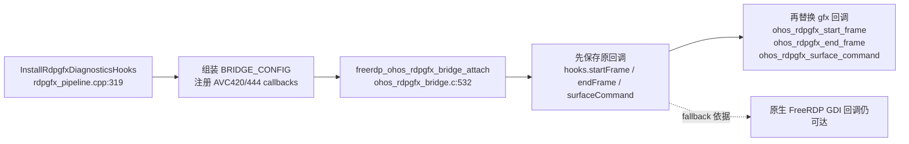
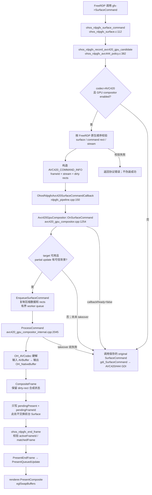
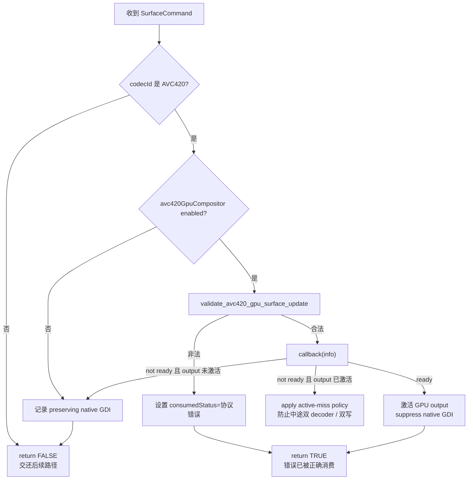
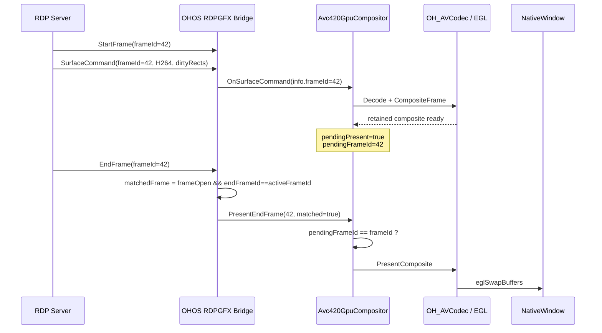
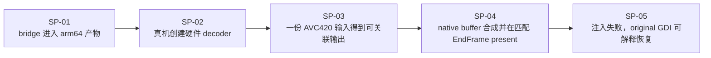
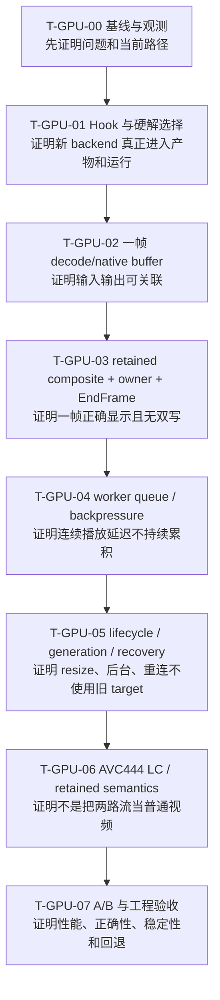

# 阶段 2～6｜从源码调用链到可验收任务

> 这份文档不是最终架构图，而是第二个案例的“证据主线”：AI 如何在大代码库里找到真实接入点，如何判断新路径没有破坏 FreeRDP 语义，如何用最小穿刺消除关键不确定性，再如何把已经验证的边界拆成任务。

## 0. 阅读范围与证据边界

本次源码快照：

```text
工程：harmony
commit：aa31146 docs(rdp): verify input and HNP lifecycle
FreeRDP：third_party/FreeRDP
HarmonyOS App/C++：app/common/src/main/cpp
```

文中的行号只用于当前快照快速定位，后续提交可能导致行号变化；评审时以“文件路径 + 函数名”为主，以 commit 为复现基线。

事实分成两类：

- `REPO FACT`：源码已经证明的结构、调用关系和保护条件。
- `RUN FACT`：必须通过某次真机运行才能证明的路径、性能和稳定性。

因此，读完源码可以证明“设计有没有沿着正确边界实现”，不能直接证明“CPU 已经下降”或“视频已经不卡”。后两者必须绑定同一 `commit + runId + device + scene` 的日志、指标和视频。

---

## 1. 勘察入口：先追一条命令，不先读完整仓库

### 1.1 先把需求改写成可追踪的问题

原始需求不是“实现 HarmonyOS 硬解”，而是：

> 远控视频播放卡顿，案例已确认原始实现走 CPU/软件处理路径、未走 GPU。需要在保留 FreeRDP 原生语义与可解释回退的前提下，接入 HarmonyOS 硬件解码与 GPU 合成。CPU/FPS 基线、改善幅度和运行路径截图尚未入库，在课件中保持占位。

第一轮只追五个问题：

1. `RDPGFX_SURFACE_COMMAND` 从哪里进入客户端？
2. 哪个函数决定 GPU 路径是否消费当前 command？
3. 压缩 H.264 数据在哪里转成 `OH_AVBuffer / OH_NativeBuffer`？
4. 为什么 decode 成功后不能立即 `present`？
5. 新路径失败时，原生 GDI 是否仍然可达？

这五问把几十万行代码压缩成一条可验证调用链。AI 每次只需要保留当前问题、当前调用链、少量已证实事实和下一个探针，避免把整个仓库塞进上下文。

### 1.2 三个入口，分别回答三类问题

| 入口 | 首个源码锚点 | 回答的问题 |
|---|---|---|
| 协议入口 | `libfreerdp/gdi/gfx.c::gdi_SurfaceCommand` | FreeRDP 原生如何分发 AVC420 / AVC444；回退最终去哪里 |
| OHOS 注入点 | `client/OHOS/ohos_rdpgfx_bridge.c::freerdp_ohos_rdpgfx_bridge_attach` | 新路径如何接入，同时保存原始回调 |
| App 输出点 | `app/common/src/main/cpp/channels/rdpgfx_pipeline.cpp::InstallRdpgfxDiagnosticsHooks` | App 如何注册 compositor、surface target、日志和 EndFrame 回调 |

先执行符号搜索并保存结果，再接受 AI 的调用链结论：

```bash
rg -n "gdi_SurfaceCommand|SurfaceCommand =" third_party/FreeRDP
rg -n "freerdp_ohos_rdpgfx_bridge_attach|ohos_rdpgfx_surface_command" third_party/FreeRDP/client/OHOS
rg -n "InstallRdpgfxDiagnosticsHooks|OnSurfaceCommand|PresentEndFrame" app/common/src/main/cpp
```

### 1.3 第一张图：真实 hook 是怎么装进去的



源码证据：

- `ohos_rdpgfx_bridge.c:569-574` 保存 `gfx->StartFrame / EndFrame / SurfaceCommand`。
- `ohos_rdpgfx_bridge.c:591-598` 将这些回调替换为 OHOS wrapper。
- `rdpgfx_pipeline.cpp:343-348` 注册 AVC420/444 的 SurfaceCommand 与 EndFrame callback。
- `rdpgfx_pipeline.cpp:351-353` 执行 attach。

关键判断：这不是“另起一条旁路直接播放 H.264”，而是在 FreeRDP 的 RDPGFX 回调点进行受控拦截；原回调被显式保存，所以失败时存在回退路径。

---

## 2. 一条 AVC420 SurfaceCommand 的真实执行路径

### 2.1 主流程图：从协议命令到 EndFrame present



这张图要读出四个工程事实：

1. **拦截发生在协议回调点。** `ohos_rdpgfx_surface_command` 先询问 AVC420、再询问 AVC444，只有 candidate 明确 consumed 才提前返回。
2. **GPU 路径复用原生校验顺序。** `ohos_rdpgfx_record_avc420_gpu_candidate` 在调用 App callback 前执行校验，避免 GPU 路径接受原生 GDI 会拒绝的非法命令。
3. **消费权晚于成功。** compositor 没准备好、target 不可用、partial update 缺少可信背景或首次 native import 失败时返回 `false`，wrapper 继续调用原 GDI。
4. **decode/composite 与 present 分离。** `ProcessCommand` 只生成 retained composite 并排队；真正呈现发生在匹配的 EndFrame。

### 2.2 “是否消费 command”不是一个布尔开关，而是一组有顺序的门

`ohos_rdpgfx_record_avc420_gpu_candidate` 的判断顺序：



容易讲错的地方：

- `return TRUE` 不等于“渲染成功”。在校验失败时，它表示 wrapper 已经产生了正确协议错误，不能再让原 GDI 重复处理。
- takeover 前可以安全回到 GDI；takeover 后不能对单个中间帧随意切回，否则 GDI 的 H.264 状态可能已经不同步。源码因此引入 active-miss policy、连续失败阈值和 owner 释放。
- “有硬解输出”仍不等于“应该 suppress GDI”。还要验证 native buffer 可导入、retained background 有效、target 与 frame 边界正确。

### 2.3 原生回退路径在哪里

`ohos_rdpgfx_surface_command` 在 AVC420/444 都没有消费时执行：

```text
bridge->hooks.surfaceCommand(context, command)
  → libfreerdp/gdi/gfx.c::gdi_SurfaceCommand
     → gdi_SurfaceCommand_AVC420
        或 gdi_SurfaceCommand_AVC444
     → h264_context_new(FALSE)
     → FreeRDP H.264 subsystem
```

因此验收 fallback 不能只看“没有崩溃”，必须看到：

- 新路径明确记录未消费原因；
- original callback 实际被调用；
- GDI decoder/path 日志恢复；
- 画面恢复且没有 GPU/GDI 双写。

---

## 3. 为什么必须等 EndFrame：源码中的帧一致性

### 3.1 时序图



对应源码：

- `ohos_rdpgfx_bridge.c::ohos_rdpgfx_end_frame` 计算 `matchedFrame`，并把 `frameId / activeFrameId / matchedFrame` 交给 compositor。
- `avc420_gpu_compositor_internal.cpp::ProcessCommand` 在成功 decode/composite 后只设置 `pendingPresent` 与 `pendingFrameId`。
- `PresentQueuedUpdate` 要求 `matchedFrame && frameId == pendingFrameId`；不匹配会丢弃 pending，不能把旧帧交换到新帧边界。
- `PresentEndFrame` 最终调用 `PresentQueuedUpdate("EndFrame", ...)`，然后 `renderer.PresentComposite` 内部完成 EGL 交换。

### 3.2 为什么“decode 后立即 swap”是错的

如果在 `SurfaceCommand` 回调中直接显示：

- 同一个 frame 的多个 dirty rect 可能只显示了一部分；
- AVC444 的 luma/chroma retained state 可能尚未闭合；
- GDI background 与 GPU 更新可能不在同一帧边界；
- resize/target generation 变化时容易把旧 buffer 显示到新 Surface；
- 性能看似更快，但正确性与可恢复性失去证据。

所以 EndFrame 不是“后续优化”，而是接入方案的协议正确性边界。

---

## 4. 硬解、native buffer 与 worker queue 的实际边界

### 4.1 硬件 decoder 证据链

`avc420_gpu_compositor_internal.cpp` 中可以看到完整的 OH_AVCodec 生命周期：

```text
OH_AVCodec_GetCapabilityByCategory(..., HARDWARE)
  → OH_VideoDecoder_CreateByName / CreateByMime
  → OH_VideoDecoder_Prepare
  → OH_VideoDecoder_Start
  → Query/GetInputBuffer
  → OH_AVBuffer_SetBufferAttr
  → PushInputBuffer
  → Query/GetOutputBuffer
  → OH_AVBuffer_GetNativeBuffer
```

代码存在只能证明“实现调用了硬件类别 API”。真机还要记录 capability、decoder name、configure/start 结果、输入输出 PTS 和 native format，才能证明当前 run 实际走到硬解。

### 4.2 为什么要复制 command 数据再入 worker

`Avc420GpuCompositor::EnqueueSurfaceCommand` 不把 FreeRDP callback 里的裸指针直接跨线程保存，而是：

- 复制压缩 stream；
- 复制 dirty rects；
- 修正 task 内部指针指向自有存储；
- 确保 worker 启动；
- backlog 达阈值时压缩；
- 超过 `kMaxWorkerTasks` 时拒绝继续入队；
- 记录 depth、drop、frameId、bytes、rects。

这段代码回答了一个经常被 AI 忽略的问题：**从协议线程切到解码线程后，原 command 的内存生命周期是否仍然有效？**

### 4.3 owner 不是 UI 概念，而是防止双写的正确性机制

`OnSurfaceCommand` 只有在以下条件成立后才 claim output：

1. target 可用；
2. partial update 有可信 retained background，或本次是 full-surface update；
3. `ProcessCommand` 成功；
4. native buffer 能被 GPU compositor 导入；
5. 之后能够在匹配 EndFrame 呈现。

takeover 之前失败，返回 `false` 保留 GDI；takeover 之后发生瞬时失败，先保持 owner 并尝试 decoder resync，超过阈值再释放 owner。这样避免单帧在 GPU/GDI 之间来回切换造成双 decoder 状态分叉。

---

## 5. 从调用图到方案：不是先写任务，而是先提炼五个不确定边界

### 5.1 调用图暴露出的五个未知

| 源码边界 | 调用图给出的事实 | 仍需验证的未知 | 对应穿刺 |
|---|---|---|---|
| Hook / fallback | 原回调已保存，wrapper 可选择 consumed | 构建产物是否真的带入 OHOS bridge，失败是否回到 original | SP-01、SP-05 |
| Decoder | 已调用 OH_AVCodec hardware category | 目标设备选中哪个 decoder，是否能 start | SP-02 |
| Buffer | 输入输出 API 与 native buffer 获取已实现 | 实际 format/stride/native import 是否受支持 | SP-03、SP-04 |
| Frame / present | pending 与 matched EndFrame 逻辑已实现 | 真机是否同 frameId 完成 decode→present | SP-04 |
| Owner / recovery | takeover 前后有不同失败策略 | 故障注入时是否无双写并可恢复 | SP-05 |

### 5.2 最小穿刺为什么是 SP-01～05



顺序不能调换：

- SP-01 不成立，后面的真机日志可能来自旧产物。
- SP-02 不成立，SP-03 的输出可能是软件 decoder。
- SP-03 不成立，SP-04 的黑屏不能判断是 decode、buffer 还是 present。
- SP-04 不成立，不能 claim output，更不能 suppress GDI。
- SP-05 不成立，方案只在成功路径成立，不具备工程上线条件。

### 5.3 穿刺的结束条件

穿刺只回答“这些边界能否连通”，不回答完整性能与稳定性。每一步必须输出 `PASS / FAIL / UNKNOWN`：

| Spike | 最小 PASS 证据 | 不允许的替代说法 |
|---|---|---|
| SP-01 | arm64 symbol/link + HAP 中实际库身份 | “本地编译过” |
| SP-02 | capability + decoder name + configure/start | “调用了硬解 API” |
| SP-03 | frameId/PTS + input bytes + output buffer 属性 | “回调返回成功” |
| SP-04 | native format + import + owner + matched EndFrame present | “屏幕亮了” |
| SP-05 | failure reason + owner transition + original GDI path + visible recovery | “没有崩溃” |

---

## 6. 穿刺完成后，如何拆成 T-GPU-00～07

Story 不是按“模块数量”平均切，而是按**可独立验证的风险闭环**切。每个 Worker Packet 必须只有一个主要结果，并明确允许修改的源码边界、禁止扩散的范围和 Stop 条件。

### 6.1 拆分总图



### 6.2 每个任务如何从源码边界推导出来

| Task | 主要源码范围 / 符号 | 为什么单独拆 | 核心验收点 |
|---|---|---|---|
| T-GPU-00 | diagnostics、frame/path/owner/present 日志；不改 decoder | 没有基线就无法证明优化，也无法复现 AI 的判断 | 同一 runId 的视频、CPU/FPS、queue、codec path |
| T-GPU-01 | `rdpgfx_pipeline.cpp::InstallRdpgfxDiagnosticsHooks`；`ohos_rdpgfx_bridge.c::freerdp_ohos_rdpgfx_bridge_attach`；decoder capability/init | 先证明 hook 和 backend 真正进入目标产物/设备 | symbol、decoder name、hardware capability、start、fallback reason |
| T-GPU-02 | `avc420_gpu_compositor_internal.cpp` 中 decoder input/output、`OH_AVBuffer_GetNativeBuffer` | 把 codec 问题与显示问题隔离 | frameId/PTS、bytes、output size/format、native buffer、bounded wait |
| T-GPU-03 | `ohos_rdpgfx_avc444_policy.c::ohos_rdpgfx_record_avc420_gpu_candidate`；`Avc420GpuCompositor::OnSurfaceCommand`；`ProcessCommand`；`PresentEndFrame` | consumed、owner、dirty rect、EndFrame 是同一个正确性闭环 | callbackReady、owner claim、pendingFrameId、matched EndFrame、无 GDI/GPU 双写 |
| T-GPU-04 | `Avc420GpuCompositor::EnqueueSurfaceCommand`、worker backlog/compaction | 一帧正确不代表连续播放不会堆积 | queue depth/age p95、drop reason、frame order、CPU/FPS |
| T-GPU-05 | target/surface generation、pause/detach/recreate、stale task rejection | 生命周期错误会表现成偶发黑屏，不能混入 codec 任务 | resize/后台/重连、旧 target 拒绝、可恢复、owner transition |
| T-GPU-06 | `ohos_rdpgfx_record_avc444_gpu_candidate` 与 AVC444 compositor/policy | AVC444 有 LC、双 bitstream、retained state，风险与 AVC420 不同 | LC、stream 顺序、单 decoder 状态、retained readiness、EndFrame |
| T-GPU-07 | 测试/脚本/报告；生产代码冻结 | 验收阶段只判定，不边测边改掩盖问题 | BUILD/PATH/420/444/PERF/STABLE/INPUT/FALLBACK/SCOPE |

### 6.3 任务之间的进入门

| 从 | 到 | 必须先拿到的证据 |
|---|---|---|
| T00 | T01 | 问题可复现，当前 decoder/path 可观察 |
| T01 | T02 | bridge 与硬件 decoder 身份已在真机确认 |
| T02 | T03 | 一帧输出属性合法，输入输出可关联 |
| T03 | T04 | 一帧在匹配 EndFrame 显示，owner 唯一，fallback 可达 |
| T04 | T05 | 连续队列有界，延迟不持续增长 |
| T05 | T06 | 生命周期与恢复不再污染 codec 判断 |
| T06 | T07 | AVC420/444 语义分别闭环，已冻结生产代码 |

如果进入门没有满足，状态应写成 `UNKNOWN / NEEDS_REPLAN`，而不是让 AI 同时改 decoder、queue、renderer、lifecycle 来“试到能跑”。

---

## 7. 怎么判断 AI 是对的

### 7.1 四层证据必须同时成立

| 层 | 要证明什么 | 证据 | 常见伪证据 |
|---|---|---|---|
| 语义 | AI 没有绕开 FreeRDP 的 codec、dirty rect、EndFrame 和 fallback 约束 | 调用图、原生实现对照、ADR | “其他平台也是硬解” |
| 实现 | 修改落在允许边界，校验顺序与 owner 状态机正确 | diff、符号、单测、构建 | “代码能编译” |
| 路径 | 本次真机真的经过目标 decoder→buffer→composite→present | 同 frameId trace、decoder name、native format、owner、EndFrame | “画面出来了” |
| 结果 | 同场景性能改善且回归可控 | A/B 指标、录屏、soak、故障注入 | “主观感觉流畅” |

只有四层同时 PASS，才能说方案正确。源码 review PASS、运行结果 UNKNOWN 时，结论仍然是 UNKNOWN。

### 7.2 一条可评审的 frame trace

同一 `frameId=42` 至少应关联：

```text
StartFrame(42)
SurfaceCommand(codec=AVC420, bytes, rects)
candidate validation=PASS
decoder=OHOS hardware, inputPts=...
outputPts=..., nativeFormat=..., size=...
CompositeFrame(rects)=PASS
owner: GDI → AVC420_GPU
pendingFrameId=42
EndFrame(frameId=42, active=42, matched=yes)
PresentComposite=PASS
queueDepth / decodeUs / presentUs
```

缺任何关键环节，都不能用解释补齐。例如视频可见但没有 decoder identity，只能证明“有画面”，不能证明“走了硬解”。

---

## 8. AI 不对时怎么处理：沿调用链找第一处异常

### 8.1 固定排障流程

```text
Stop：停止扩大修改范围
  → Preserve：固定 commit、设备、场景、runId 和原始日志
  → Locate：按 frameId 找第一处 expected != actual
  → Falsify：设计最小探针推翻当前假设
  → Repair：只修改拥有该状态的组件
  → Replay：同场景重放，并执行 fallback/regression
```

### 8.2 三个典型问题如何定位

#### 问题 A：黑屏，但 decoder 有 output

不要继续调 decoder 参数。按顺序检查：

1. `OH_AVBuffer_GetNativeBuffer` 是否得到可导入 buffer；
2. `CompositeFrame` 是否成功，dirty rect 是否有效；
3. `pendingPresent` 是否写入正确 frameId；
4. `ohos_rdpgfx_end_frame` 的 `matchedFrame` 是否为 true；
5. `decoderSurfaceTarget` 的 window/generation 是否当前有效；
6. `PresentComposite / eglSwapBuffers` 是否成功。

第一处异常在哪里，就只修哪一层。

#### 问题 B：偶发花屏或只更新局部区域

优先检查 `OnSurfaceCommand` 的 retained background 前提：

- 当前 command 是否 full-surface；
- partial update 的背景尺寸是否与 surface 一致；
- takeover 前是否已经完成 background seed；
- resize 后是否清除了旧 retained state；
- AVC444 是否错误复用了 AVC420 dirty-rect 假设。

#### 问题 C：开始流畅，随后越来越卡

优先看 `EnqueueSurfaceCommand` 与 worker 指标：

- queue depth 是否持续增长；
- command age p95 是否增长；
- compaction/drop 是否保留了正确 EndFrame；
- 解码耗时、合成耗时还是 present gap 首先恶化；
- 是否因 target 暂停而积压旧任务。

这类问题不能用“增加线程”直接修复；先证明瓶颈和顺序约束。

---

## 9. 源码锚点索引

| 主题 | 文件 | 函数 / 快照行号 |
|---|---|---|
| App 注册 bridge | `app/common/src/main/cpp/channels/rdpgfx_pipeline.cpp` | `InstallRdpgfxDiagnosticsHooks`，319-368 |
| callback 到 compositor | 同上 | `OhosRdpgfxAvc420SurfaceCommandCallback`，150；AVC444，145 |
| 保存/替换回调 | `third_party/FreeRDP/client/OHOS/ohos_rdpgfx_bridge.c` | `freerdp_ohos_rdpgfx_bridge_attach`，532-606 |
| EndFrame 匹配 | 同上 | `ohos_rdpgfx_end_frame`，268-349 |
| SurfaceCommand wrapper | `third_party/FreeRDP/client/OHOS/ohos_rdpgfx_surface.c` | `ohos_rdpgfx_surface_command`，112-138 |
| AVC420 consumed/fallback policy | `third_party/FreeRDP/client/OHOS/ohos_rdpgfx_avc444_policy.c` | `ohos_rdpgfx_record_avc420_gpu_candidate`，382-562 |
| AVC444 policy | 同上 | `ohos_rdpgfx_record_avc444_gpu_candidate`，610 起 |
| App takeover / background | `app/common/src/main/cpp/surface/avc420_gpu_compositor.cpp` | `OnSurfaceCommand`，1254-1425 |
| worker queue | 同上 | `EnqueueSurfaceCommand`，740-829 |
| decode/composite/pending | `app/common/src/main/cpp/surface/avc420_gpu_compositor_internal.cpp` | `ProcessCommand`，2045-2280 |
| matched present | 同上 | `PresentQueuedUpdate`，2292-2394；`PresentEndFrame`，2484-2516 |
| native buffer | 同上 | `OH_AVBuffer_GetNativeBuffer`，约 790 |
| EGL 交换 | 同上 | `eglSwapBuffers`，约 1209 |
| 原生 GDI 分发 | `third_party/FreeRDP/libfreerdp/gdi/gfx.c` | `gdi_SurfaceCommand`，1246 起；AVC420，693 起；AVC444，844 起 |
| H.264 subsystem | `third_party/FreeRDP/libfreerdp/codec/h264.c` | `h264_context_new`，809 起 |

---

## 10. 调用链审阅门

进入 Story 前逐项检查：

1. `SurfaceCommand` 的 original callback 已保存，且未接管分支仍可达。
2. `consumed=true` 的前置条件能回到源码条件，而不是一个笼统 GPU 开关。
3. decoder input/output、native buffer、owner、pending frame 和 EndFrame 能用同一 frameId 关联。
4. 任何接管前失败都有显式 reason，并且不会静默吞掉 command。
5. T02、T03、T04 分别隔离 codec、显示边界和连续队列，失败时能定位到单一责任域。
6. 所有运行结论都指向当前 commit/runId；缺证据时保持 `PENDING/UNKNOWN`。
