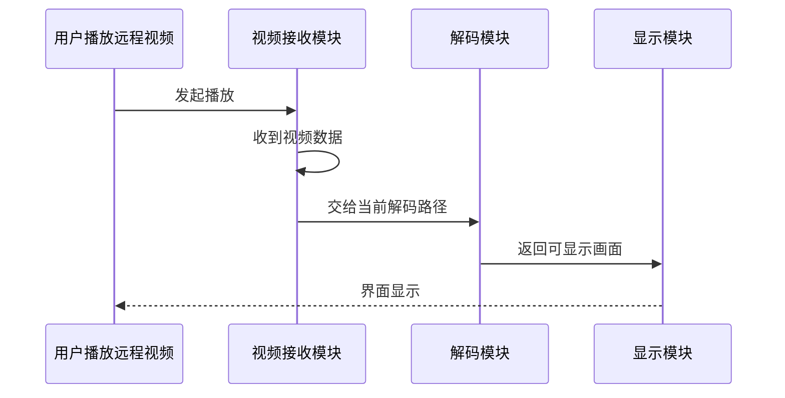
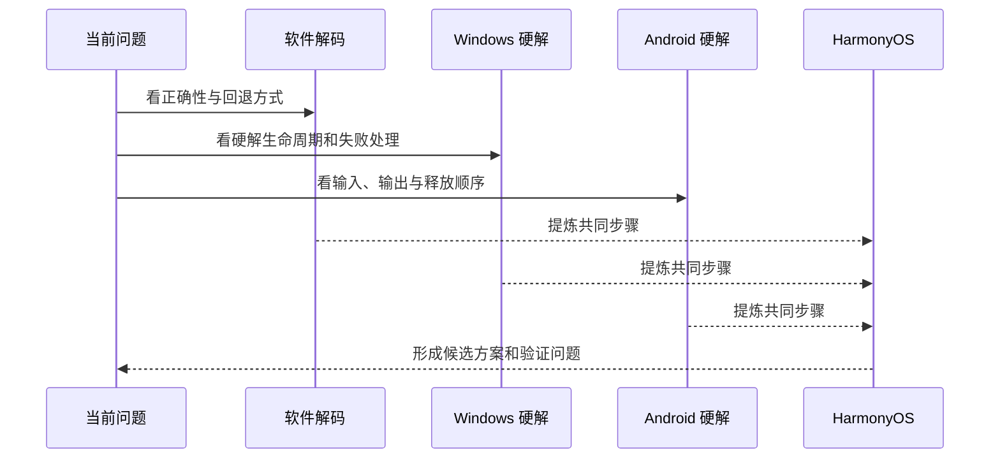

# GPU 案例讲课版简化叙事（P28–P37）

> 这是第 28–37 页的课堂正文真源。源码符号、帧归属和释放顺序仍保留在原案例文档中，只作为讲师备注和附录，不直接压到主画面。

## 十页故事线

卡顿背景 → 在大仓库中找到视频主链 → 参考其他平台提炼共同步骤 → 确定 HarmonyOS 方案 → 做最小穿刺 → 用截图和日志判断穿刺是否真的成功 → 根据穿刺结果生成新计划 → 拆任务 → 写验收点 → 汇总证据与结论。

## 第 28 页｜案例背景：远控视频能播放，但走 CPU 时明显卡顿

为什么要做这个案例？现在已经知道什么，还缺什么？

- 现象：远控视频能播放，但操作和画面不流畅。
- 已知：当前视频走 CPU / 软件解码，没有使用 GPU 硬解能力。
- 缺口：还没有同设备、同片段的 before / after 性能数据。
- 目标：先证明 HarmonyOS 硬解能够跑通，再拆完整工程任务。

```text
播放卡顿 → 已知走 CPU → 目标接入硬解 → 先做最小穿刺
```

当前只有问题背景与代码路径判断。CPU、FPS、帧延迟和视频证据没有补齐时，性能提升必须标记为 `PENDING`。

## 第 29 页｜面对 55 万行代码，AI 先追一条“视频从哪来、到哪去”

1. 确定问题：卡顿发生在远控视频。
2. 搜索入口：只搜索 `video / decode / display` 等少量关键词。
3. 找到接收点：确认哪里收到远端视频数据。
4. 继续向下追：确认哪里解码、哪里把结果交给显示。
5. 形成地图：记录命中文件、函数入口、下一步调用和未知项。



AI 每一步留下：搜索词、命中文件、函数入口、下一步调用、还没确认的问题。输出是一张可复查的代码地图，不是“AI 已经读懂整个仓库”。

## 第 30 页｜参考其他平台，不是照抄代码，而是找共同步骤



| 参考实现 | 能学什么 | 不能照抄什么 |
|---|---|---|
| FFmpeg / OpenH264 | 正确性与软件回退 | CPU 内存与线程模型 |
| Windows 硬解 | 硬解生命周期与失败处理 | Windows API |
| Android 硬解 | 输入、输出、释放顺序 | MediaCodec / Surface 细节 |
| HarmonyOS | 最终要使用的平台能力 | 仍需最小穿刺验证 |

只复用“输入—解码—取结果—显示—失败回退”的共同步骤，不复制平台 API。调研输出是一份候选方案、风险清单和待验证问题。

## 第 31 页｜最终方案：保留旧路径，先让硬解跑通，再逐步替换

```text
视频数据到达
    ↓
检查设备能力与当前状态 ── 条件不满足 ──→ 继续走旧方案
    ↓ 条件满足
送入硬解 → 拿到结果 → 转为可显示画面 → 更新界面 → 记录结果
    ↓ 任一步失败
记录原因 → 切回旧方案 → 应用继续可用
```

- 新方案先只做三件事：解码、拿到画面、显示。
- 不在穿刺阶段同时做并发、性能和长稳优化。
- 新方案失败必须立即回退，不能让应用失去基本可用性。

先保证正确和可回退，再谈连续播放、性能和长稳。

## 第 32 页｜最小穿刺只回答：HarmonyOS 硬解能不能跑通一次

| 步骤 | 只做什么 | 通过时看到什么 | 失败就停在哪 |
|---|---|---|---|
| SP-01 | 新模块进入安装包 | 构建日志中可以找到 | 先修构建，不写解码 |
| SP-02 | 真机选择硬解 | 日志显示硬解名称 | 不支持就停止 |
| SP-03 | 解码一个短片段 | 有解码结果 | 没结果就停在解码 |
| SP-04 | 把结果显示出来 | 出现正确画面 | 黑屏就停在显示 |
| SP-05 | 模拟失败并回退 | 旧方案仍可播放 | 回退失败不进入完整开发 |

穿刺范围：一个短片段、一次成功显示、一次失败回退；不做并发、性能和长稳。穿刺通过后，才允许拆完整开发任务。

## 第 33 页｜穿刺结果先给截图：画面出现了，还要补两条证据

现有远控播放截图可以证明：应用能连接远程桌面、视频内容可见、窗口与输入交互没有立即失效。

现有截图不能单独证明：真机已选择硬解、硬解失败后可以回退、CPU / FPS 已经改善。

```text
画面截图/视频 + 同一次运行的硬解日志 + 故障注入后的回退证据 = 穿刺 PASS
```

目前已有画面证据；硬解选择日志与回退证据未到齐时必须标记 `PENDING`，不能把“有画面”说成“硬解已经成功”。

## 第 34 页｜穿刺之后，AI 根据真实结果重新生成开发计划

```text
穿刺结论 → 保留已证实路径 → 列出剩余问题 → 生成新计划
```

| 阶段 | Plan | 本阶段只解决什么 | 完成标志 |
|---|---|---|---|
| 固化 | P0 | 保存穿刺代码与证据 | 可以重复运行 |
| 接入 | P1 | 接入真实远控视频 | 能连续播放 |
| 稳定 | P2 | 处理暂停、恢复、窗口变化 | 场景切换不黑屏 |
| 回退 | P3 | 新方案失败时回到旧方案 | 应用继续可用 |
| 性能 | P4 | 做同场景 CPU / FPS 对比 | 有 before / after |
| 兼容 | P5 | 补不同视频格式 | 目标格式通过 |
| 回归 | P6 | 重跑输入和交互场景 | 无明显回退 |
| 交付 | P7 | 汇总日志、视频和报告 | Reviewer 可以复查 |

这份计划不是穿刺前凭空生成，而是根据穿刺真实暴露的成功点和剩余问题重新生成。

## 第 35 页｜把新计划拆成 Ralph Story，每个 Story 只交付一个结果

拆分文档使用 `Plan → Story → Ralph Worker Packet` 三层结构，完整真源见 `13-GPU-Ralph-Story拆分与伪代码验收.md`。

| 任务 | 只交付什么 | 本任务验收点 |
|---|---|---|
| T1 接入真实视频 | 远控视频进入硬解路径 | 连续播放短片段 |
| T2 显示稳定 | 暂停、恢复、窗口变化后仍有画面 | 三个场景通过 |
| T3 失败回退 | 硬解失败时切回旧方案 | 注入失败后仍可播放 |
| T4 性能对比 | 采集同场景 CPU / FPS | before / after 可比较 |
| T5 兼容回归 | 覆盖目标格式和交互 | 回归清单通过 |
| T6 证据交付 | 汇总代码、日志、截图、视频 | Reviewer 可独立复查 |

任务不按文件切，而按“可验收结果”切。每张 Story 必须写 Source Scope、Allowed、Forbidden、伪代码、AC、证据、Stop 和 Exit Gate。

## 第 36 页｜先写验收点，再让 AI 开发

每个验收点都必须写清：场景、预期、证据、失败怎么办。

Story 先用伪代码冻结输入、分支、成功提交和失败不提交；验收点评审通过后，才允许 Ralph Session 映射到真实类和函数。

| 验收点 | 通过标准 | 必须留下的证据 |
|---|---|---|
| 构建安装 | 新模块进入目标 HAP 并可启动 | build / install 日志 |
| 硬解选择 | 真机日志显示硬解被选中 | decoder 日志 |
| 画面显示 | 指定短片段可见且可交互 | 截图 / 视频 |
| 失败回退 | 注入失败后旧方案仍可用 | 失败日志 + 回退视频 |
| 性能改善 | 同设备同片段 CPU / FPS 优于 before | A/B CSV + 视频 |
| 稳定回归 | 暂停、恢复、窗口变化与长稳通过 | 回归矩阵 + soak 记录 |

证据缺失时只能写 `PENDING` 或 `UNKNOWN`，不能用“应该没问题”替代验收。

## 第 37 页｜最后只看这张表：哪些已证明，哪些还不能下结论

截图、日志和性能数据分别证明不同问题，不能互相替代。

| 需要证明 | 当前证据 | 结论 |
|---|---|---|
| 画面与交互可见 | 现有播放截图 / 视频 | READY |
| 确实选择硬解 | 缺少同一次运行的硬解日志 | PENDING |
| 失败可以回退 | 缺少故障注入记录 | PENDING |
| CPU / FPS 有改善 | 缺少同场景 A/B | PENDING |
| 场景切换稳定 | 缺暂停、恢复、窗口变化矩阵 | UNKNOWN |
| 可以工程交付 | 上述证据未全部到齐 | NOT YET |

这一页不是证明“项目已经全部成功”，而是证明团队能够区分已证实、待补证据和未知项，并据此决定下一步。
