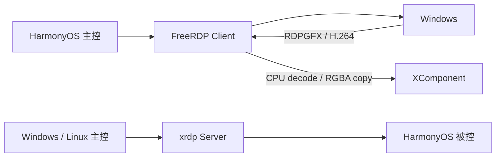
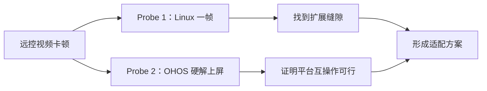
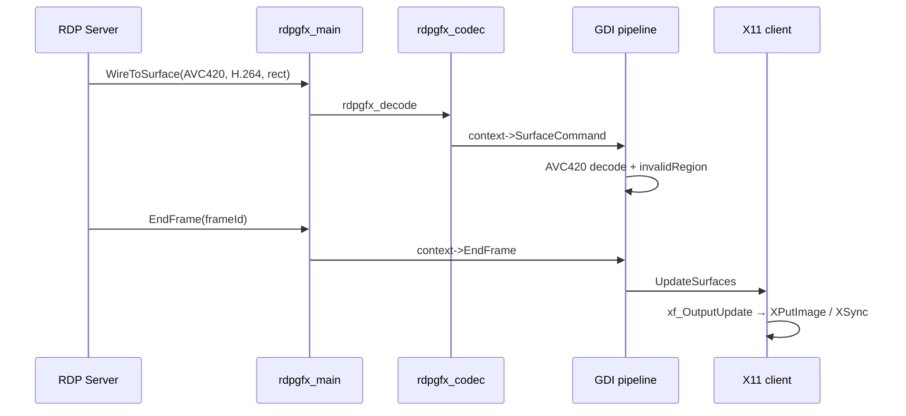
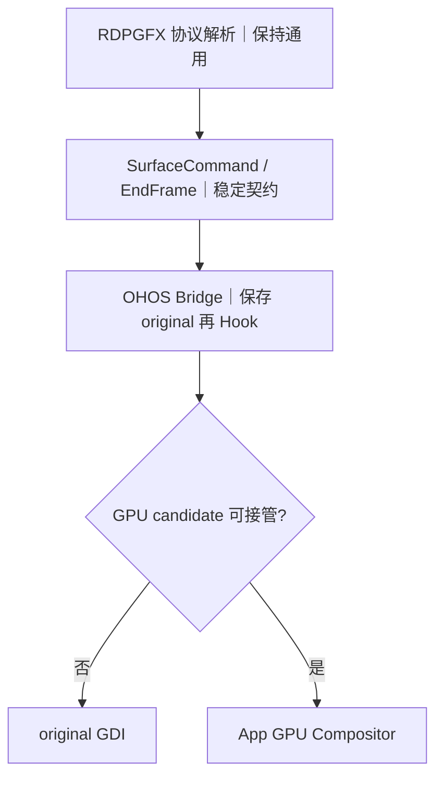
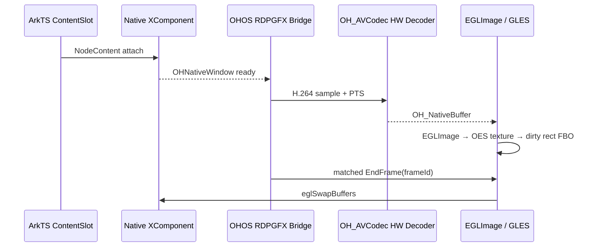
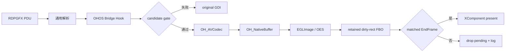
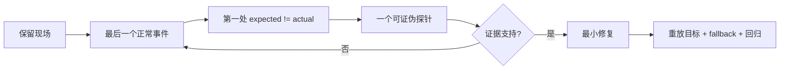

# GPU 案例第 28–38 页｜复杂三方项目适配讲稿

> 本段只讲一条主线：如何面对 FreeRDP 这种大型三方项目，从参考实现里找到稳定适配点，用 HarmonyOS 最小探针验证可行，再形成方案、迭代开发并处理问题。完整源码推导见 `17-复杂三方项目GPU适配源码分析与探针方案.md`。

## 0. 连续叙事

```mermaid
flowchart LR
    P28[28 产品背景与卡顿] --> P29[29 两个探针缩小问题]
    P29 --> P30[30 Linux 一帧时序]
    P30 --> P31[31 找到稳定适配缝隙]
    P31 --> P32[32 HarmonyOS XComponent 探针]
    P32 --> P33[33 探针证明可行]
    P33 --> P34[34 冻结最终方案]
    P34 --> P35[35 具体适配步骤文档]
    P35 --> P36[36 迭代开发与验证]
    P36 --> P37[37 沿同一链路处理问题]
    P37 --> P38[38 结果画面与方法收束]
```



---

## 第 28 页｜背景：双向远控已经可用，主控视频链仍走 CPU

- HarmonyOS 通过 FreeRDP 做主控，通过 xrdp 做被控。
- 本案例只聚焦 HarmonyOS 主控连接 Windows。
- 已经能连接、能输入、能看到画面；播放视频时，旧路径落到 CPU/GDI 缓冲并复制显示，操作和画面会卡顿。
- 本节目标不是“调一个 GPU API”，而是完成一项可维护的三方库平台适配。



讲师强调：xrdp 是产品背景；接下来追踪的是 FreeRDP 客户端视频链。

---

## 第 29 页｜面对大代码库，先用两个探针缩小未知

```text
探针 1：Linux/X11 收到一帧后，经过哪些回调，何时提交显示？
探针 2：HarmonyOS 能否把同一份 H.264 输入，经硬解和 native buffer 显示到 XComponent？
```

只搜索 `WireToSurface / SurfaceCommand / AVC420 / EndFrame / UpdateSurfaces`。每个命中只记录输入、下一跳、owner、失败去向。



文档证据：`17-复杂三方项目GPU适配源码分析与探针方案.md` 第 2 节。

---

## 第 30 页｜探针一：Linux 一帧从 RDPGFX 到 X11 的时序



```text
rdpgfx_main.c::rdpgfx_recv_wire_to_surface_1_pdu
rdpgfx_codec.c::rdpgfx_decode_AVC420
libfreerdp/gdi/gfx.c::gdi_SurfaceCommand_AVC420 / gdi_EndFrame
client/X11/xf_gfx.c::xf_UpdateSurfaces / xf_OutputUpdate
```

结论：要迁移的是 `SurfaceCommand + EndFrame` 契约，不是 X11 API。

---

## 第 31 页｜从 Linux 找到真正的适配点：回调表，而不是协议解析器



- `gdi_graphics_pipeline_init_ex` 把帧相关回调装进 `RdpgfxClientContext`；
- `xf_graphics_pipeline_init` 先复用通用 GDI，再覆盖 X11 平台 surface/update；
- `freerdp_ohos_rdpgfx_bridge_attach` 保存 original callbacks 后安装 OHOS Hook；
- `ohos_rdpgfx_surface_command` 只有 candidate consumed 才截断，否则调用 original。

稳定扩展点通常出现在“通用语义已经形成、平台副作用尚未发生”的位置。

---

## 第 32 页｜探针二：用 XComponent 穿刺 HarmonyOS 硬解上屏



探针只回答：单个 AVC420 command 能否完成“硬解 output → native import → matched EndFrame → XComponent 可见”。这一步不加入连续流优化、AVC444、resize 或长稳。

---

## 第 33 页｜探针结果：最危险的三个互操作边界已经可行

| 边界 | 源码行为 | Probe PASS 条件 |
|---|---|---|
| XComponent → NativeWindow | surface callback 更新 target | window 非空、尺寸有效、destroy 后失效 |
| AVCodec → NativeBuffer | HARDWARE decoder + output PTS | identity 可记录、output 可关联、native buffer 非空 |
| NativeBuffer → GLES | EGLImage + external OES | import 成功、dirty rect 合成、swap 后可见 |

```text
active=yes
source=native-buffer-oes
decoded=2397 / presented=2396
mismatch=0 / failures=0 / importFallbacks=0
```

结论写“方案方向验证可行”，不把历史日志冒充当前版本完整性能验收。

---

## 第 34 页｜由探针收敛方案：协议保持通用，平台层受控接管



冻结四个不变量：original 始终可达；首帧验证前不 suppress GDI；一帧只有一个 owner；只有 matched EndFrame 才 present。

---

## 第 35 页｜把方案写成可执行步骤，而不是一张抽象架构图

页面展示 `17-复杂三方项目GPU适配源码分析与探针方案.md` 第 7 节：

1. 建立 `ContentSlot → Native XComponent → OHNativeWindow`；
2. 保存 original callbacks，安装 OHOS Bridge；
3. 定义 codec/surface/target/state candidate gate；
4. 查询并启动 HARDWARE AVC decoder；
5. 用 PTS 维持 input/output 关联；
6. `OH_NativeBuffer → EGLImage → OES texture`；
7. dirty rect 合成到 retained FBO；
8. matched EndFrame 才提交；
9. 首帧成功后切 owner，失败回 original；
10. 补齐 frameId/PTS/import/present/fallback/gap 日志。

PPT 左侧放文档页面，右侧放十步主线，让观众知道方案如何从代码推导出来。

---

## 第 36 页｜迭代开发：每轮只增加一个已验证能力

| 迭代 | 唯一目标 | 验收点 |
|---|---|---|
| I0 | 一帧调用链可追踪 | Linux/OHOS path::symbol 闭合 |
| I1 | XComponent target 生命周期 | create/change/destroy 正确 |
| I2 | 单 sample 硬解 | hardware identity + PTS output |
| I3 | 单帧 native-buffer 上屏 | EGLImage/OES/swap 可见 |
| I4 | dirty rect + EndFrame | 无提前显示、残影或双写 |
| I5 | 连续播放 | decoded/presented 前进、backlog 有界 |
| I6 | resize/reconnect/fallback | target generation 和 owner 可恢复 |

探针通过后才生成下一轮计划；不要一次把 decoder、队列、生命周期、AVC444 和性能优化全部交给 AI。

---

## 第 37 页｜问题处理不是新方法：仍沿同一条一帧链找第一断点



| 现象 | 第一条证据链 |
|---|---|
| 无 output | input → decoder state → PTS → SPS/PPS |
| 绿屏/错位 | native format → stride/crop → OES texture |
| output 已有但黑屏 | import → pending → matched EndFrame → target |
| 开始流畅随后卡顿 | command/endFrame/present gap → queue age/depth |

历史真实例子：“立即 present”修改构建安装成功但仍黑屏，日志证伪后回退并重建。代码成功编译不等于假设成立。

---

## 第 38 页｜结果与收束：从复杂项目中找到适配点，再逐步证明

- 中央保留大图/视频封面：`gpu-validation-video-playback-16s.mp4`。
- 旁边小入口放 `gpu-failure-black-screen-13s.mp4`，用于引出第 37 页的问题定位。
- 后续有更好的流畅播放截图，只替换结果图，不改变章节结构。

```text
参考实现追踪 → 找到稳定回调缝隙 → 平台最小探针 → 冻结边界与回退
→ 按最小能力迭代 → 沿同一证据链处理问题 → 结果可见、过程可复查
```

AI 可以帮助阅读和实现，但人要控制问题边界、适配点、验证门和回退策略。

---

## 文档交接表

| 页 | 主要文档/证据 |
|---:|---|
| 28 | `01-问题与基线.md`、产品 `harmony/README.md` |
| 29 | `17-复杂三方项目GPU适配源码分析与探针方案.md` 第 2 节 |
| 30 | 同文档第 3 节 Linux 时序与源码锚点 |
| 31 | 同文档第 4 节责任边界 |
| 32 | 同文档第 5 节 HarmonyOS 探针时序 |
| 33 | 同文档第 5 节、`16-历史Session可复用证据.md` |
| 34 | 同文档第 6 节最终方案 |
| 35 | 同文档第 7 节十步适配文档 |
| 36 | 同文档第 8 节迭代计划 |
| 37 | 同文档第 9 节、历史黑屏回退记录 |
| 38 | 16 秒播放视频、13 秒黑屏视频 |
