# GPU 案例第 28–38 页｜详细讲稿与文档证据

> 本文件是 GPU 案例的课堂真源。它沿用 MDM 案例的工程链：**定位事实 → 调研并冻结方案 → 最小能力穿刺 → Story / Worker Packet → Ralph 循环 → 分层验收**。PPT 只摘录关键图、表和真实文档截图；完整输入、AI 动作、Human Review、源码锚点、证据边界与讲师口播均保留在这里。

## 0. 11 页连续证据链

```mermaid
flowchart LR
    P28["28 问题与证据边界"] --> P29["29 源码地图"] --> P30["30 源码调用时序"]
    P30 --> P31["31 跨平台调研"] --> P32["32 ADR 冻结方案"] --> P33["33 最小穿刺"]
    P33 --> P34["34 穿刺判定与新计划"] --> P35["35 S0–S7 Story"]
    P35 --> P36["36 Worker Packet"] --> P37["37 Ralph 排障循环"] --> P38["38 工程验收"]
```

每页必须回答：本页减少哪个未知；AI 读了什么；产生哪份文档；Human Review 冻结/拒绝什么；下一页如何消费。

---

## 第 28 页｜问题不是“怎么调用 GPU”，而是“怎样证明卡顿路径被替换”

### 页面正文

```text
业务现象：远端视频能播放，但操作和画面明显卡顿
案例已知：原路径走 CPU / 软件处理，未走 HarmonyOS 硬解与 GPU 合成
工程目标：新路径正确、可回退、可定位、可长期运行、可独立验收
证据边界：before 视频、路径日志、CPU/FPS 数值尚未绑定同一 runId，保持 PENDING
```

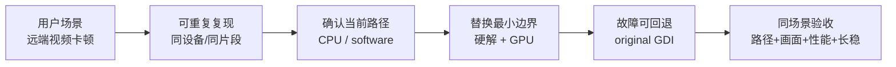

对应文档：`01-问题与基线.md`、`00-证据状态总表.md`。场景图为 `freerdp-stutter-scenario.jpeg`；`GPU-VIDEO-BEFORE / GPU-PATH-BEFORE / GPU-PERF-A-B` 未到齐前不填假数据。

讲法：代码存在硬解 API 不等于当前 run 选中了硬件 decoder；截图有画面不等于持续流畅；CPU 下降也不能替代 fallback、resize 和长稳。此页只冻结问题、范围和证据缺口。

---

## 第 29 页｜55.9 万行代码怎么读：先形成一张源码地图

### 文档生成卡

| 字段 | 内容 |
|---|---|
| Document | `02-大代码库认知地图.md` |
| Input | 问题背景、仓库文件清单、`gfx->SurfaceCommand` 入口 |
| AI action | `rg` 找定义/赋值/调用；沿一帧记录 `path::symbol`、输入、输出、owner、fallback、未知 |
| Human Review | 每个锚点可跳转；代码存在不能冒充运行事实 |
| Why | 把 55.9 万行压缩成高信号 evidence index |
| Next | 限定源码追踪和跨平台调研的边界 |

```text
上下文预算 = 1 个问题 + 1 条调用链 + 3–7 个符号 + 1 个假设 + 1 条下一步命令
```

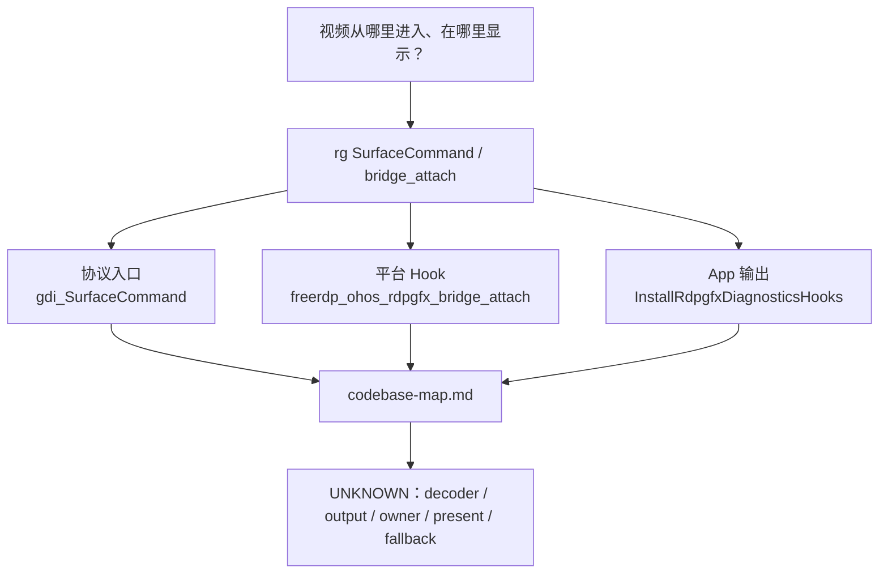

源码锚点：

```text
libfreerdp/gdi/gfx.c::gdi_SurfaceCommand
client/OHOS/ohos_rdpgfx_bridge.c::freerdp_ohos_rdpgfx_bridge_attach
app/common/src/main/cpp/channels/rdpgfx_pipeline.cpp::InstallRdpgfxDiagnosticsHooks
```

对应截图：`harmonyos-sdd-workshop-media/gpu-docs/doc-29-codebase-map.png`。

---

## 第 30 页｜源码级定位：CPU 旧路径和 GPU 候选路径在哪里分叉

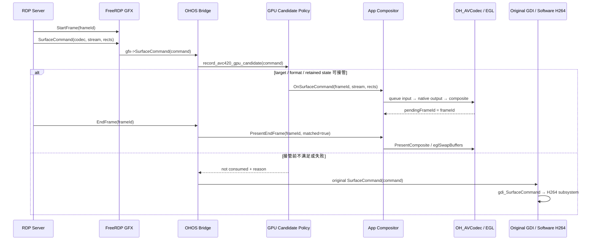

| 边界 | 源码已确认 | 仍需运行证据 |
|---|---|---|
| Hook | original callback 先保存再替换 | 目标 HAP 是否含该 bridge |
| Candidate | ready/consumed 才接管 | 当前 command 走哪条分支 |
| Decoder | 存在 hardware category 调用 | 真机 decoder name/configure/start |
| Present | pending；匹配 EndFrame 才显示 | 同一 frameId output→present |
| Fallback | takeover 前可回 original GDI | 故障注入后的日志与画面 |

对应文档：`09-源码调用链与任务拆解.md` 第 1–4 节。时序图让学员看到谁拥有 command、何时能 suppress 旧路径、为什么不能 decode 后立即显示。

---

## 第 31 页｜跨平台调研：只迁移生命周期契约，不迁移平台假设

| 字段 | 内容 |
|---|---|
| Document | `03-跨平台实现调研.md` |
| Input | codebase-map + FFmpeg/OpenH264/MF/MediaCodec/OH_AVCodec |
| AI action | 对齐 Init / Decompress / output / flush / release、buffer 状态与失败传播 |
| Human Review | 只接受可回到源码或官方 API 的事实；推断标 `INFERENCE` |
| Why | 调研必须减少 ADR 的未知，而不是罗列资料 |
| Next | 输出 Alternatives、Preferred、Deferred、Risk、Evidence Gate |

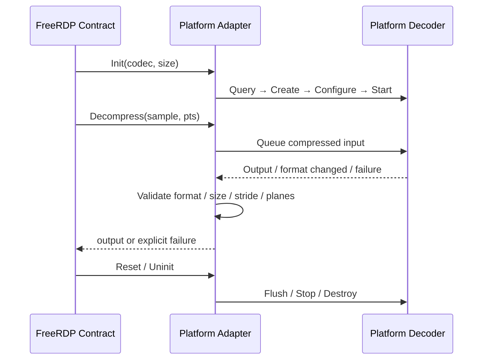

| 平台 | 可复用契约 | 不能照抄 |
|---|---|---|
| FFmpeg/OpenH264 | 正确性和 fallback | CPU 线程/内存模型 |
| Windows MF | 生命周期与失败处理 | COM/Windows Surface |
| Android MediaCodec | input/output、format change、有界等待 | buffer index/Surface ownership |
| HarmonyOS | hardware capability、AVBuffer、native output | consumed、dirty rect、owner、EndFrame、fallback 仍需设计 |

对应截图：`gpu-docs/doc-30-platform-research.png`。

---

## 第 32 页｜制定并冻结方案：ADR 先定义接管、显示和回退

| 字段 | 内容 |
|---|---|
| Document | `04-ADR-GPU-001-HarmonyOS硬解方案.md` |
| Input | 源码调用链、跨平台调研、回退要求、证据缺口 |
| AI action | Alternatives / Preferred / Deferred / Risk / Evidence Gate |
| Human decision | Bridge 受控接管 + App Compositor + original GDI fallback |
| Why | 冻结 owner、EndFrame、fallback，阻止架构漂移 |
| Next | Spike 只验证最大未知，不做全量优化 |

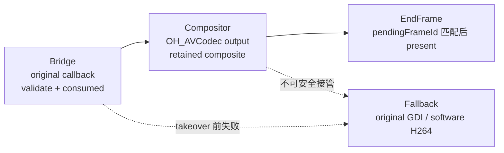

ADR 冻结四条不变量：先保存 original callback；未准备好时不得 suppress GDI；同帧只有一个 owner；decode/composite 与 matched EndFrame present 分离。对应截图：`gpu-docs/doc-31-adr.png`。

---

## 第 33 页｜最小能力穿刺：只证明一帧主链和一次可解释回退

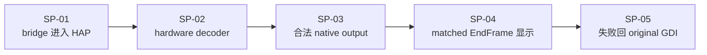

| Spike | 必须证据 | Stop |
|---|---|---|
| SP-01 | symbol/library hash/attach log | 先修构建，不写 decoder |
| SP-02 | capability/decoder name/start | unsupported 则停止或改 ADR |
| SP-03 | frameId/PTS/format/stride/planes | output 不可关联，不进入显示 |
| SP-04 | owner/pending/matched present | 黑屏停在 import/present |
| SP-05 | fallback reason/original path/video | 回退失败，不拆后续 Story |

生成链：`ADR Evidence Gate → AI 倒推 SP-01～05 → Human 冻结“一帧 + fallback” → verdict 决定 CONTINUE/REPLAN/STOP`。对应截图：`gpu-docs/doc-32-spike-plan.png`。

历史 Session `019e867d-*` 已有 `active=yes`、`source=native-buffer-oes`、decoded/presented 和零 mismatch/failure，可作为穿刺过程的 `HISTORICAL SESSION FACT`；仓库也已有 16 秒播放与 13 秒黑屏。它们未绑定同一 run，因此课堂可讲、最终工程 Spike 仍为 `PARTIAL/PENDING`。

---

## 第 34 页｜穿刺后重新计划：只把已证实边界变成开发输入

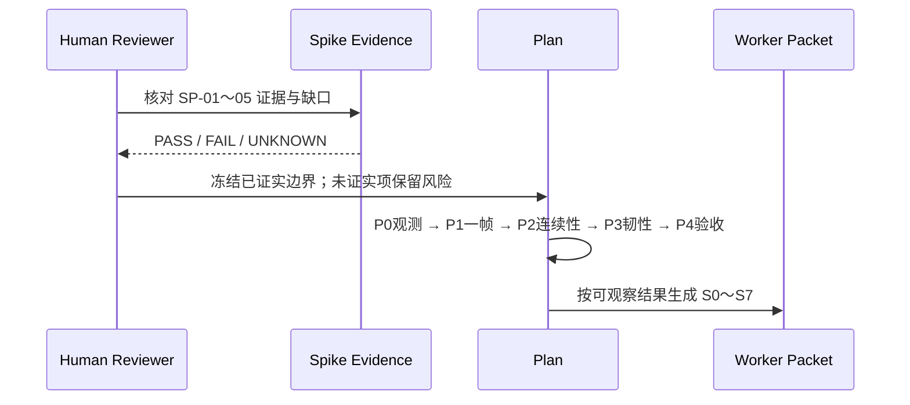

```yaml
spike_verdict: PASS | FAIL | UNKNOWN
commit:
run_id:
selected_decoder:
input_output_identity:
display_owner_and_boundary:
fallback_result:
missing_evidence:
decision: CONTINUE | REPLAN | STOP
```

| 阶段 | 完成门 |
|---|---|
| P0 观测 | before、路径和 trace schema 可重复 |
| P1 一帧 | decoder/output/owner/present 同帧闭合 |
| P2 连续性 | queue depth/age 不持续增长 |
| P3 韧性 | lifecycle/fallback/AVC444 可恢复 |
| P4 验收 | 每条 AC 可回到原始证据 |

---

## 第 35 页｜拆成 Ralph Story：按可验收行为切，不按文件切

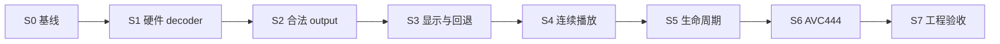

| Story | 唯一结果 | Exit Gate |
|---|---|---|
| S0 | before 与路径事实可复查 | 无基线不得宣称改善 |
| S1 | 真机硬件 decoder | identity/start 绑定 run |
| S2 | 一份输入得到合法 output | PTS/format/stride/planes 闭合 |
| S3 | 唯一 owner 正确显示并可回退 | 无双写，fallback 可见 |
| S4 | 连续播放有界 | backlog 不增长 |
| S5 | resize/后台/重连恢复 | stale target 被拒绝 |
| S6 | AVC444 LC/retained 正确 | 不用 AVC420 替代验收 |
| S7 | A/B、故障、长稳、交付 | Reviewer 可独立复查 |

详细真源：`13-GPU-Ralph-Story拆分与伪代码验收.md`；截图：`gpu-docs/doc-35-ralph-story.png`。

---

## 第 36 页｜Worker Packet：文档、伪代码和 AC 先于代码

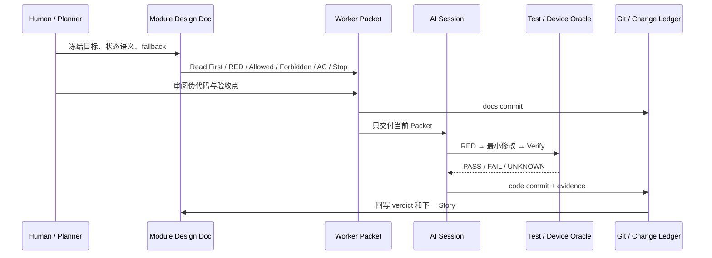

```yaml
story_id: S3
goal: 唯一 owner 在 matched EndFrame 显示；接管前失败回原路径
read_first: ADR + S2 verdict + source call chain
red: output 已有但 owner/present 不闭合，或 GPU/GDI 双写
allowed_paths: candidate policy / compositor / owner / EndFrame + tests
forbidden: queue 优化 / AVC444 重写 / 删除 original fallback
acceptance: 场景 + 标准 + 同帧证据 + 失败结论
stop: owner 不唯一、提前 present、fallback 不可达
```

```text
handle(command):
  if !validate(command) or !targetReady(): return NOT_CONSUMED
  output = decode(command)
  if !output.valid or !nativeImportReady(): return NOT_CONSUMED
  composite(output, command.rects); markPending(command.frameId)
  return CONSUMED

onEndFrame(frameId):
  if frameId != pendingFrameId: discardPending(); return FAIL
  claimSingleOwner(); present()
```

一条 AC 必须同时写场景、通过标准、必须证据和不通过结论。文档提交先于代码提交；代码、测试和证据回写到 Change Ledger。

---

## 第 37 页｜Ralph 循环：AI 不对时，沿第一异常处理

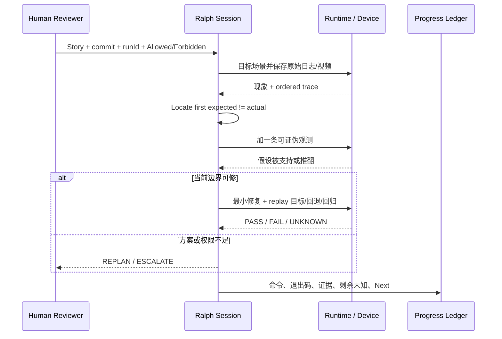

```text
Stop → Preserve → Locate → Falsify → Repair → Replay
```

| 现象 | 第一条证据链 | 不要先做 |
|---|---|---|
| decoder 有 output 但黑屏 | native output→import→pending→matched EndFrame→target | 猜 decoder 参数/shader |
| 色块/错位 | format/stride/planes→dirty rect→retained background | 盲换色彩矩阵 |
| 开始流畅随后卡顿 | queue depth/age→decodeUs→present gap | 加线程/无限队列 |

Progress Ledger 必填 `story/commit/runId/hypothesis/last-good/first-abnormal/one change/commands/evidence/verdict/next`。黑屏视频可用于练方法，但未绑定同 run frame trace，不能宣称根因已确认。

本地已经有真实闭环，无需讲师再制造问题：Session `019e867d-*` 中“GDI 背景合成后立即 present”完成构建安装后仍然黑，日志推翻假设，随后回退该修改、重新构建、覆盖安装并重启。完整摘录见 `16-历史Session可复用证据.md`。

---

## 第 38 页｜工程验收：路径、画面、性能、回退和长稳同时闭合

| 验收层 | 必须证据 | 当前状态 |
|---|---|---|
| Build | build log / symbol / library hash | `HISTORICAL SESSION FACT`；当前包仍待同 run |
| Path | decoder identity + candidate/owner log | `HISTORICAL PARTIAL`；已有 GPU active/native-buffer |
| Frame | ordered output→pending→matched present | `HISTORICAL PARTIAL`；已有 decoded/presented 计数 |
| Outcome | 同场景 video + CPU/FPS/frame/queue A/B | `MEDIA + SESSION FACT`；无严格 before/after A/B |
| Fallback | fault reason + original callback + video | 排障回退 `TEACHING READY`；运行时 fault injection 待工程验收 |
| Lifecycle | generation/owner matrix + video | `UNKNOWN` |
| Stability | soak report，无积压/泄漏/漂移 | `UNKNOWN` |
| Regression | 输入、窗口、AVC420/444、旧路径矩阵 | `PENDING` |

```text
commit + package hash + runId + device + codec + scene
  ├─ video-before/after.mp4
  ├─ runtime-path.log
  ├─ frame-trace.log
  ├─ cpu-fps-queue.csv
  ├─ fault-injection.md
  ├─ lifecycle-soak-matrix.md
  └─ reviewer-verdict.md
```

源码调用链、方案、Story 和验收设计是 `REPO FACT`；播放/黑屏录屏是未绑定实现 run 的 `MEDIA FACT / UNBOUND`。硬解、同帧、fallback、A/B 和长稳未齐时，最终只能是 `NOT YET`。

课堂不要求补齐上述工程矩阵。现有文档、媒体和历史 Session 已能支撑主线；只推荐可选补一段原始 CPU/软件路径卡顿 before。严格 identity、A/B、fault injection 和 soak 作为工程附录保留。

---

## 文档交接表

| 页 | 阶段产物 | 下一页消费 |
|---:|---|---|
| 28 | `01-问题与基线.md` | 只读定位问题与缺口 |
| 29 | `02-大代码库认知地图.md` | 三入口与五个未知 |
| 30 | 源码时序与事实/未知表 | 限定调研边界 |
| 31 | `03-跨平台实现调研.md` | ADR 候选、风险、Evidence Gate |
| 32 | `04-ADR-GPU-001-*.md` | Spike 最大未知 |
| 33 | `05-最小能力穿刺计划.md` | verdict 决定继续/重规划/停止 |
| 34 | Spike verdict + 新计划 | 生成 Story |
| 35 | `13-GPU-Ralph-Story拆分与伪代码验收.md` | 选择 Worker Packet |
| 36 | Worker Packet + docs commit | 限定 Ralph 读写与验收 |
| 37 | Progress Ledger + `16-历史Session可复用证据.md` | 汇总验收矩阵 |
| 38 | `06-工程验收计划.md` + 历史/当前证据分层 | Reviewer release verdict |

课堂统一收尾：AI 的判断是什么？证据在哪里？哪条证据能推翻它？不对时回到哪个文档/Story？下一步最小动作是什么？哪些结论仍必须写 `PENDING / UNKNOWN`？
