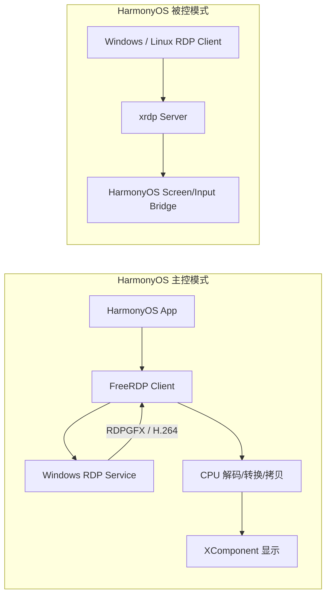
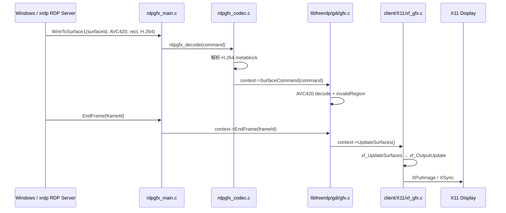
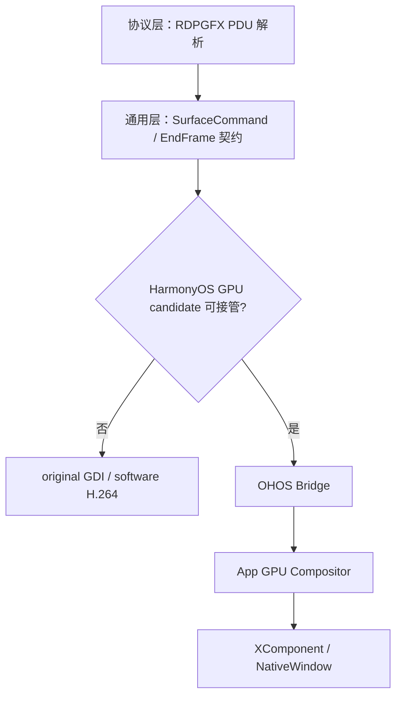
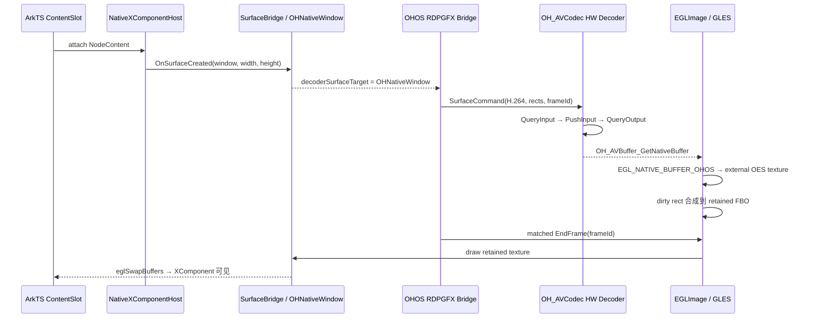
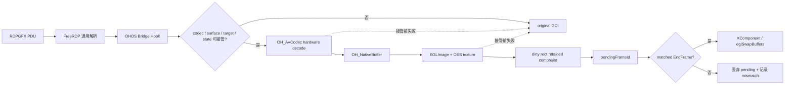
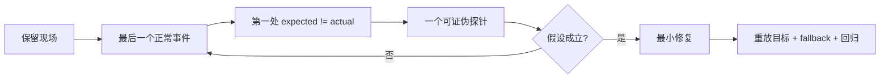

# 复杂三方项目 GPU 适配｜源码分析、探针与落地方案

> 工程目标：面对 FreeRDP 这种大型三方项目，从数十万行代码中找到稳定适配点，用两个最小探针证明方向，再把结果收敛成可迭代、可验证、可回退的工程方案。

## 0. 范围与证据边界

- 源码仓库：`C:/Users/mu/Desktop/code/demo`
- 源码版本：`aa31146`
- 本文引用的 GPU 相关文件在分析时没有未提交修改。
- 产品同时包含两种角色：HarmonyOS 通过 FreeRDP client 做主控；通过 xrdp server 做被控。
- 本案例只聚焦“HarmonyOS 主控连接 Windows”时的视频显示链。xrdp 用于交代产品背景，不混入客户端 GPU 适配链。

## 1. 背景：双角色远控已打通，主控视频链仍走 CPU



已有远控功能能连接、能输入、能看到画面，但控制 Windows 播放视频时，旧链路把 H.264 解码结果落到 CPU 可访问的 RGBA/GDI 缓冲，再复制到显示目标。高频更新叠加格式转换、内存复制和显示提交后，交互和画面会出现卡顿。

大型三方项目里，不能直接让 AI“改成 GPU”，而要先回答：RDPGFX 帧从哪里进入？哪个函数决定 codec 路径？一帧何时允许显示？平台实现接在哪个扩展点？失败时怎样回原 GDI？

## 2. 限定阅读预算：只沿“一帧”追踪

第一轮只搜索：

```text
WireToSurface / SurfaceCommand / AVC420 / EndFrame / UpdateSurfaces
```

每进入一个函数，只记录输入、输出、下一跳、owner 和失败去向，不展开无关通道与 UI。

| 层 | 首个锚点 | 只回答的问题 |
|---|---|---|
| 协议接收 | `rdpgfx_recv_wire_to_surface_1_pdu` | 压缩数据何时变成 `RDPGFX_SURFACE_COMMAND` |
| Codec 分发 | `rdpgfx_decode_AVC420` | H.264 元数据在哪里解析，何时调用平台回调 |
| 通用 GDI | `gdi_SurfaceCommand_AVC420` | 旧解码、dirty region 和更新触发如何工作 |
| Linux 显示 | `xf_UpdateSurfaces` / `xf_OutputUpdate` | 平台显示接在哪个回调，EndFrame 如何驱动刷新 |
| HarmonyOS Hook | `freerdp_ohos_rdpgfx_bridge_attach` | 如何保留原回调并插入新路径 |
| HarmonyOS 显示 | `Avc420GpuCompositor` | 硬解输出如何进入 XComponent |

产物不是“仓库总结”，而是一张可以继续验证的调用链。

## 3. 探针一：Linux/X11 怎样消费一帧



源码锚点：

- `channels/rdpgfx/client/rdpgfx_main.c:1334-1404`：读取 PDU，组装 command，调用 `rdpgfx_decode`。
- `channels/rdpgfx/client/rdpgfx_codec.c:185-214`：解析 AVC420 metablock，把 H.264 stream 放进 `cmd->extra`，调用 `context->SurfaceCommand`。
- `libfreerdp/gdi/gfx.c:1246-1301`：按 codec 分发到 AVC420/AVC444。
- `libfreerdp/gdi/gfx.c:316-351`：`StartFrame` 记录 frameId；`EndFrame` 触发 `UpdateSurfaces`。
- `client/X11/xf_gfx.c:39-140`：根据 invalid region 更新 drawable 并同步。
- `client/X11/xf_gfx.c:507-530`：先装通用 GDI pipeline，再覆盖 X11 surface/update 回调。

探针结论：`SurfaceCommand` 是“协议解析结束、平台处理开始”的缝隙；`EndFrame` 是提交边界；平台通过回调表接入，不需要重写协议解析器。

## 4. 从参考实现推导 HarmonyOS 责任边界



| 位置 | 决策 | 原因 |
|---|---|---|
| `rdpgfx_main.c` / `rdpgfx_codec.c` | 保持通用 | 协议解析与平台无关，改动风险最大 |
| `libfreerdp/gdi/gfx.c` | 保留原路径 | correctness oracle，也是失败回退 |
| `client/OHOS/ohos_rdpgfx_bridge.*` | 放协议语义 Hook | 能理解 codec、surface、frame 与原回调 |
| `app/.../channels/rdpgfx_pipeline.cpp` | 放装配与回调 | 把 FreeRDP bridge 接到应用 compositor |
| `app/.../surface/*gpu_compositor*` | 放 AVCodec/EGL/GLES | 依赖 XComponent、NativeWindow 与应用生命周期 |

`freerdp_ohos_rdpgfx_bridge_attach` 先保存原来的 `StartFrame/EndFrame/SurfaceCommand`，再替换成 OHOS Hook；候选路径不消费 command 时，`ohos_rdpgfx_surface_command` 继续调用 original callback。

## 5. 探针二：XComponent 能否承接硬解输出

探针二不做完整播放器，只回答：一份 AVC420 压缩输入，能否经硬件 decoder 产生可采样 native buffer，并在匹配的 EndFrame 显示到 XComponent？



源码锚点：

- `RdpSessionPage.ets:60-66`：`ContentSlot` 挂载 `NodeContent`。
- `surface/xcomponent_native_host.cpp:22-76`：创建 Native XComponent，注册回调并添加节点。
- `napi/native_bridge_context.cpp:284-314,419-443`：surface 生命周期进入 `SurfaceBridge`，刷新 RDPGFX 输出目标。
- `surface/avc420_gpu_compositor_internal.cpp:551-603`：查询 `HARDWARE` AVC capability，Create/Configure/Prepare/Start。
- 同文件 `606-712`：压缩数据进入 input buffer，并按 PTS 查询 output。
- 同文件 `788-803`：通过 `OH_AVBuffer_GetNativeBuffer` 取得 native 输出及 format/size/stride。
- 同文件 `1569-1632`：`OH_NativeBuffer → NativeWindowBuffer → EGLImage → GL_TEXTURE_EXTERNAL_OES`。
- 同文件 `1007-1061`：只把 dirty rect 合成到 retained FBO。
- 同文件 `2292-2393`：只有 pending frame 与 EndFrame 匹配才显示。
- 同文件 `1150-1217`：把 retained texture 画到 XComponent 并 `eglSwapBuffers`。

| Gate | 最小通过条件 | 失败意味着什么 |
|---|---|---|
| Surface | callback 给出非空 `OHNativeWindow` | UI/生命周期问题，先不碰 decoder |
| Decoder | `HARDWARE` capability，Configure/Prepare/Start 成功 | 设备或格式不支持，修改方案或回退 |
| Output | output PTS 可关联，`OH_NativeBuffer` 非空 | 不能安全进入 native-buffer 路径 |
| Import | EGLImage 与 OES texture 成功 | 互操作不可用，不能 suppress GDI |
| Frame | pending command 与 EndFrame 匹配 | 帧所有权不闭合，禁止显示 |
| Visible | swap 后可见且无双写 | 探针通过 |

历史记录出现 `active=yes`、`source=native-buffer-oes`、decoded/presented 递增且 mismatch/failure 为零，说明最小链路具备可行性；它不替代当前版本完整性能验收。

## 6. 两个探针收敛出的最终方案



必须冻结四条不变量：original callback 始终可达；GPU 首帧验证前不 suppress GDI；同一帧只有一个显示 owner；decode/composite 与 present 分离，只有 matched EndFrame 才提交。

## 7. 具体适配步骤

1. **建立显示目标**：用 `ContentSlot + NodeContent` 挂载 Native XComponent；在 created/changed/destroyed 中维护 `OHNativeWindow`、尺寸和 generation。
2. **安装 FreeRDP Hook**：保存 original `StartFrame/EndFrame/SurfaceCommand`，再安装 OHOS bridge；不改变通用协议解析。
3. **定义 candidate gate**：只允许合法 codec、surface、rect、target 和 compositor state 进入 GPU candidate；不满足就 `NOT_CONSUMED`。
4. **创建硬件 decoder**：按 `video/avc + HARDWARE` 查询 capability，依次 Create、Configure、Prepare、Start，并记录实际 decoder identity。
5. **维持输入输出关联**：向 input buffer 写入 sample 和可追踪 PTS；丢弃 stale output，只接受当前 command 对应输出。
6. **导入 native buffer**：`OH_AVBuffer → OH_NativeBuffer → NativeWindowBuffer → EGLImage → OES texture`；接管前导入失败即回 GDI。
7. **按 dirty rect 合成**：把有效区域画入 retained FBO，保留未更新区域，避免局部帧覆盖整屏。
8. **在 EndFrame 提交**：合成只设置 `pendingFrameId`；active/pending/endFrameId 匹配才 swap。
9. **切换 owner 与回退**：首个完整 probe 成功后再从 GDI 切到 GPU；禁止 GPU/GDI 同时写同一窗口。
10. **补齐可观测性**：记录 codec、surfaceId、frameId、PTS、decoder、native format、import、queued/presented、mismatch、fallback、queue depth 与各段 gap。

## 8. 迭代开发与验证

| 迭代 | 只增加的能力 | 验收点 | 失败时停止在哪 |
|---|---|---|---|
| I0 追踪 | Linux 与 OHOS 调用链 | 一帧能跨文件追到显示边界 | 不写 GPU |
| I1 Surface | XComponent target 生命周期 | create/change/destroy 状态正确 | 不建 decoder |
| I2 Decoder | 单 sample 硬解 | hardware identity + 对应 PTS output | 不做 EGL import |
| I3 Import | 单帧 native buffer 上屏 | EGLImage/OES/swap 可见 | 不接管连续流 |
| I4 Frame | dirty rect + matched EndFrame | 无残影、提前 present、双写 | 不做性能优化 |
| I5 Continuous | 连续播放和节奏观测 | decoded/presented 前进，backlog 有界 | 定位第一 gap |
| I6 Resilience | resize/background/reconnect/fallback | generation 与 owner 可恢复 | 不宣布交付 |

每轮只改变一个未知；验证通过后才把已证实边界写入下一轮计划。

## 9. 遇到问题仍沿同一条链定位



| 现象 | 首先检查 | 不要先做 |
|---|---|---|
| 没有 output | input push、decoder state、PTS、SPS/PPS | 重写 shader |
| 绿屏/错色/偏移 | native format、stride、crop、texture target | 随意换色彩矩阵 |
| 有 output 但黑屏 | import、pending、matched EndFrame、window target | 直接增加线程 |
| 开始流畅随后卡顿 | command/endFrame/present gap、queue age/depth | 放大无界队列 |
| resize 后冻结 | target generation、stale window、decoder/composite reset | 继续向旧 window swap |

历史 Session 曾尝试“GDI 背景合成后立即 present”，构建安装成功但仍黑屏；日志推翻假设后回退并重新构建安装。问题处理不是另起一套方法，而是继续沿同一链路寻找第一断点。

## 10. 结果证据与交付收束

- 结果视频：`harmonyos-sdd-workshop-media/gpu-validation-video-playback-16s.mp4`
- 问题视频：`harmonyos-sdd-workshop-media/gpu-failure-black-screen-13s.mp4`
- 结果证据保留一张大图或视频封面；后续有更清晰的流畅播放截图时可以替换，但不得改变已冻结的证据结论。

> 复杂三方项目的适配，不是先写平台代码，而是先沿参考实现追到稳定契约；再用平台探针证明最危险的互操作边界；最后把已证实的链路冻结成方案，按最小可验证增量迭代。

## 11. 探针必须留下可审阅记录

探针不是一句“调研完成”。每个探针都使用同一份记录结构，让下一轮 AI 只读结论和未关闭问题，不必重新扫描整个仓库。

```text
Probe ID:
Question:          本探针只回答哪一个问题
Entry / Exit:      从哪个函数开始，追到哪个函数即停止
Read Set:          实际读取的文件和符号
Observed Contract: 输入、输出、owner、生命周期、失败语义
Evidence:          path::symbol:line + 日志/截图/命令
Verdict:           CONTINUE / REPLAN / STOP
Unknowns:          尚未关闭的问题
Next Command:      下一条只读或验证命令
```

### Probe-Linux-01

| 字段 | 内容 |
|---|---|
| Question | Linux/X11 在什么扩展点接收 RDPGFX 帧，并在什么边界提交屏幕更新？ |
| Entry / Exit | `rdpgfx_recv_wire_to_surface_1_pdu` → `xf_OutputUpdate` |
| Read Set | `rdpgfx_main.c`、`rdpgfx_codec.c`、`libfreerdp/gdi/gfx.c`、`client/X11/xf_gfx.c` |
| Contract | `SurfaceCommand` 消费 surface command；`EndFrame` 触发 `UpdateSurfaces`；平台后端负责最终显示 |
| Verdict | `CONTINUE`：HarmonyOS 实现同一回调契约，不修改 RDPGFX PDU 解析 |
| Unknowns | surface 生命周期、硬解输出格式、native buffer 导入、owner 切换 |
| Next | 启动 `Probe-OHOS-01`，只验证一帧 XComponent → AVCodec → EGL → EndFrame |

### Probe-OHOS-01

| 字段 | 内容 |
|---|---|
| Question | HarmonyOS 能否在不破坏原 GDI 路径的前提下，把一帧 AVC420 硬解输出显示到 XComponent？ |
| Entry / Exit | `OnXComponentSurfaceCreated` / `OhosRdpgfxAvc420SurfaceCommandCallback` → `PresentQueuedUpdate → PresentComposite → eglSwapBuffers` |
| Read Set | `xcomponent_native_host.cpp`、`native_bridge_context.cpp`、`rdpgfx_pipeline.cpp`、`ohos_rdpgfx_bridge.c`、`ohos_rdpgfx_surface.c`、`avc420_gpu_compositor_internal.cpp` |
| Contract | target ready 后才建链；candidate 未消费必须调用 original；decode/composite 只写 pending；matched EndFrame 才 present |
| Verdict | `CONTINUE`：五个互操作 Gate 均存在明确源码实现，允许形成工程方案 |
| Unknowns | 当前版本同 run 的 before/after、resize/后台/重连长稳、AVC444 完整回归 |

## 12. 适配缝隙的执行语义

### 12.1 Hook 必须可逆

源码依据：`client/OHOS/ohos_rdpgfx_bridge.c:569-606,609-666`。

```cpp
attach(gfx, config):
    original.startFrame     = gfx->StartFrame
    original.endFrame       = gfx->EndFrame
    original.surfaceCommand = gfx->SurfaceCommand
    gfx->StartFrame     = ohos_start_frame
    gfx->EndFrame       = ohos_end_frame
    gfx->SurfaceCommand = ohos_surface_command

detach(gfx):
    gfx->StartFrame     = original.startFrame
    gfx->EndFrame       = original.endFrame
    gfx->SurfaceCommand = original.surfaceCommand
```

验收不是“attach 返回成功”，而是 attach 前后的函数指针、detach 后的恢复结果和目标 HAP 中的符号身份都能被记录。

### 12.2 Candidate 只有真正消费后才能截断旧路径

源码依据：`client/OHOS/ohos_rdpgfx_surface.c:112-138`。

```cpp
surfaceCommand(command):
    record(command)
    if avc420Candidate(command).consumed:
        return avc420Candidate.status
    if avc444Candidate(command).consumed:
        return avc444Candidate.status
    return originalSurfaceCommand(command)
```

`consumed` 必须同时意味着 codec/surface/target 合法、decoder ready、native output 合法且 GPU import/composite 成功。缺一项都不能把 command 宣布为已消费。

### 12.3 Decode 与 Present 必须分离

源码依据：`avc420_gpu_compositor_internal.cpp:2254-2289,2292-2393`。

```cpp
onSurfaceCommand(command):
    frame = hardwareDecode(command.stream, command.pts)
    texture = importNativeBuffer(frame.nativeBuffer)
    compositeDirtyRects(texture, command.regionRects, retainedFbo)
    pending = { valid: true, frameId: command.frameId }
    return CONSUMED

onEndFrame(endFrame):
    if !pending.valid: return NOT_HANDLED
    if !matchedFrame || endFrame.frameId != pending.frameId:
        clear(pending); recordMismatch(); return outputActive
    if !surfaceTarget.ready:
        preserveOrClearAccordingToOwnerPolicy(); return outputActive
    presentComposite(); clear(pending); return HANDLED
```

如果 SurfaceCommand 内直接 swap，局部更新、帧顺序和 GDI 背景合成都失去统一提交边界。这也是历史上“立即 present”修改没有解决黑屏后必须回退的原因。

### 12.4 Surface 生命周期驱动 owner 回收

源码依据：`native_bridge_context.cpp:284-323`。

```text
Created   → target.ready=true  → 更新 RDPGFX target → 允许预热
Changed   → generation++       → 拒绝旧 target      → 重新确保 renderer
Destroyed → target.ready=false → owner GPU→GDI     → 停止向旧 window swap
```

## 13. 候选方案对比

| 候选 | 优点 | 关键风险 | 结论 |
|---|---|---|---|
| 直接修改 `rdpgfx_main/codec` | 入口直接 | 污染通用协议层，平台耦合和回归面最大 | 拒绝 |
| 在 GDI RGBA 后上传纹理 | 改动较小 | 仍保留软件解码、格式转换和 CPU 拷贝 | 仅作过渡观测 |
| Hook 回调 + AVCodec native output + EGL import | 保留三方协议资产，减少 CPU 中转，可回退 | owner、EndFrame、生命周期复杂 | 采用 |
| 绕开 FreeRDP 自建 RDPGFX pipeline | 自由度高 | 重复实现协议、surface 和 frame 状态机 | 拒绝 |

选择回调 Hook 方案的依据是：改动边界可控、原路径可达、关键假设能分别穿刺、最终实现可按 FreeRDP 帧语义验收。

## 14. 五个 Gate 的输入、观测与停止条件

| Gate | 输入 | 必须观测 | PASS | FAIL 后动作 |
|---|---|---|---|---|
| G1 Surface | XComponent NodeContent | created/changed/destroyed、window、size、generation | target 非空且 generation 一致 | 停在 surface 层，不启动 decoder |
| G2 Decoder | AVC420 SPS/PPS + sample | decoder name、category、configure/prepare/start rc | 明确选择 HARDWARE 且启动成功 | 回退 GDI；记录设备/格式能力 |
| G3 Output | 带 PTS 的 input sample | output PTS、buffer、format/width/height/stride | 对应 output 且 NativeBuffer 非空 | 禁止 mapped-buffer 猜测；回退 |
| G4 Import | OH_NativeBuffer | NativeWindowBuffer、EGLImage、OES target、GL/EGL error | import 与 dirty composite 成功 | `consumed=false`，保留 original GDI |
| G5 Frame | pendingFrameId + EndFrame | active/pending/endFrameId、owner、swap result | frameId 匹配且单 owner present | 丢弃 pending；记录 mismatch；不得提前 swap |

## 15. 一帧日志字段

建议把一帧的证据收敛为一条结构化记录：

```text
runId=<build+device+scene> sessionId=<rdp-session>
generation=<surface-generation> codec=AVC420 surfaceId=<id>
frameId=<id> pts=<input/output pts> decoder=<hardware decoder name>
native=<format,width,height,stride> import=<ok|fail:reason>
owner=<gdi|avc420_gpu|avc444_gpu> pending=<yes|no>
endFrame=<id> present=<ok|skip|fail:reason>
fallback=<none|original_gdi:reason> queueDepth=<n>
commandGapUs=<n> endFrameGapUs=<n> presentGapUs=<n>
```

判断第一异常点时，固定按 `input → decoder → output → native format → import → pending → EndFrame → target → swap` 读取。禁止把不同 runId 的视频、日志和性能数据拼成一个结论。

## 16. 源码审阅检查表

### Bridge

- 覆盖回调前是否保存 original？detach 是否恢复全部回调？
- candidate 返回 not-ready/not-consumed 时是否只调用一次 original？
- `consumed=true` 是否发生在 native import 和 composite 成功之后？
- 日志是否区分 disabled、not-ready、not-consumed、consumed、fallback？

### Decoder / Buffer

- 是否查询 `HARDWARE` capability 并记录实际 decoder name？
- SPS/PPS、关键帧和普通帧输入顺序是否保留？
- input/output 是否通过 PTS 或等价标识关联？
- 是否拒绝空 NativeBuffer、未知 format 和非法 stride？
- output buffer 的 release/unreference 是否只有一个 owner？

### EGL / Composite

- `OH_NativeBuffer → NativeWindowBuffer → EGLImage → OES` 每一步是否检查错误？
- external OES texture 是否使用匹配 shader？
- dirty rect 是否只更新有效区域并保留其他区域？
- EGLImage、texture、FBO、surface 是否可以重复释放？

### Frame / Lifecycle

- 是否只在 matched EndFrame present？
- mismatch 的 pending 处理策略是否明确？
- resize/后台/重连后是否拒绝 stale generation？
- surface destroy 是否把 GPU owner 归还 GDI？
- 同一帧是否可能同时被 GDI 和 GPU 写入目标窗口？

## 17. 完整实施任务包

方案文档回答“为什么这样做”；实际开发使用 `case-materials/gpu/18-GPU适配实施任务包与验收点.md`。该文档把方案展开成 G0–G8 Story，逐轮列出 Read First、Allowed、伪代码、AC、故障注入、证据和 Stop 条件。
