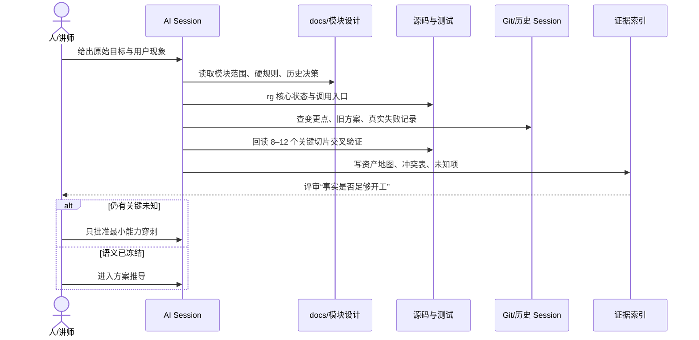

# 阶段 1｜资产同步与冲突清单

## 1. 阶段目标

让 AI 在不把 30 万行工程全部塞入上下文的情况下，回答五个问题：

1. 用户操作从哪个 View 进入？
2. 哪个 ViewModel 持有可见状态，谁只做协调？
3. 哪个 Service 是系统调用和事务编排边界？
4. 哪个 Repository 分别保存默认策略和设备策略？
5. 哪些结论已有测试/设备证据，哪些仍未知？

资产同步的出口不是“我读完代码了”，而是一张可审阅的范围图、冲突表和证据索引。

## 2. 分层读取，不做全仓灌入

| 第几轮 | 只读什么 | 要产出什么 | 停止条件 |
|---|---|---|---|
| 1 仓库地图 | `AGENTS.md`、路由、模块设计、目录结构 | 业务入口和硬约束 | 能定位外设模块和验证命令 |
| 2 符号地图 | `rg` 搜索 `usbDisabled/defaultPolicy/desiredPolicy/activePolicy` | 核心状态与函数清单 | 能画出 UI→VM→Service→Repo/MDM |
| 3 关键切片 | 只打开命中的 8–12 个文件 | 函数契约和冲突点 | 不再需要浏览无关模块 |
| 4 历史地图 | 两份 Story、模块 changelog、相关 git log | 方案为什么变化 | 能解释至少一个旧方案为何错误 |
| 5 证据地图 | UT 名称、覆盖率、E2E JSON、截图/视频 | 证据等级和空缺 | 每个强结论都有证据或 PENDING |

推荐检索：

```powershell
rg -n "usbDisabled|usbDefaultPolicy|desiredPolicy|activePolicy|clearAllPolicies" `
  entry/src/main/ets/viewmodels/peripheral `
  entry/src/main/ets/services/peripheral

git log --all --oneline --grep="peripheral\|usb\|外设" -i -40
```

这里同步的是“索引和结论”，不是把完整文件复制到 prompt。下一轮只通过路径、符号和行号回读必要切片。

### 2.1 实际同步时序



### 2.2 资产同步真正生成什么

| 产物 | 内容 | 下一步如何使用 |
|---|---|---|
| `scope-map.md` | 页面、VM、Service、Repo、系统 API 的路径和 Owner | 防止 Story 越界 |
| `requirement-card.md` | 全局、默认、单设备、存储策略的范围与非目标 | 生成方案候选 |
| `conflicts.md` | 文档、代码、产品口径和系统能力不一致处 | 决定 Spike/ADR |
| `evidence-index.md` | 每个结论的代码、测试、Session、日志、设备证据 | 后续验收追踪 |
| `unknowns.md` | 还无法从静态资产回答的问题 | 生成最小穿刺任务 |

课堂上不要只展示目录树；要展示这五份文档怎样把“读过代码”转换成下一阶段可消费的结构化输入。

## 3. 同步后的资产地图

```text
MainPage（共享 PeripheralViewModel）
  └─ PeripheralPage（3 个 Tab 的页面组合）
      ├─ InterfaceControlTab
      │   └─ InterfaceControlViewModel
      │       ├─ UsbGlobalPolicyService（USB 全局事务）
      │       ├─ PeripheralService（其它 restrictions / USB 存储）
      │       └─ WiredNetworkService
      ├─ DeviceRecordList
      │   └─ PeripheralRecordViewModel → Trace Repository
      └─ PolicyList
          └─ PeripheralPolicyViewModel
              ├─ PeripheralDevicePolicyRepository（默认 allow/deny）
              ├─ UsbDevicePolicyStateService（设备意图与执行态）
              ├─ UsbDevicePolicyStateRepository（RDB）
              └─ PeripheralDevicePolicyDispatchService（MDM 下发）
```

### 3.1 四条真实数据链，不能混读

| 数据链 | 起点 | 终点 | 它回答什么 | 它不回答什么 |
|---|---|---|---|---|
| 接口管控 | `InterfaceControlTab` | restrictions `usb` | USB 全局是否允许 | 某台设备的长期规则 |
| 默认规则 | `PolicyList.defaultPolicyRow` | Preferences | 新设备第一次按 allow 还是 deny | 已有设备现在是否生效 |
| 单设备规则 | USB 事件/名单操作 | Policy State RDB + MDM type rule | 该 fingerprint 的意图与执行态 | 系统能否真正按 SN 隔离 |
| 连接/审计记录 | CommonEvent/策略快照 | Trace RDB | 当时发生过什么 | 当前策略真值 |

这四条链的“Owner、写入时机、刷新通知、验收 oracle”都不同。复杂需求最容易出错的地方，正是把其中一条链的数据拿去替另一条链回答问题。

## 4. 需求重述卡

### Feature

在企业管理员激活的 2in1 设备上，支持 USB 全局总控、USB 存储访问模式、USB 设备黑白名单与新设备默认策略；策略应动态更新、失败不假成功、全局切换可补偿、最终可由系统回读和实物行为验收。

### In Scope

- 全局 USB 启用/禁用；
- USB 存储 `READ_WRITE / READ_ONLY / DISABLED`；
- 设备显式 allow/deny；
- 新设备默认 allow/deny；
- 规则优先级、动态刷新、冲突拦截、失败回退；
- USB 插拔状态与策略快照；
- 文档、UT、E2E、系统回读和实物视频证据。

### Out of Scope

- 蓝牙单设备黑白名单；
- 企业管理员激活流程本身；
- 通过 VID/PID 实现真正硬件单设备粒度的 MDM 禁止；
- 把 UI 回显当成系统状态真源；
- 未完成的全设备类型兼容性结论。

## 5. 资产冲突清单

### C1｜“USB 接口”究竟是全局开关还是默认策略

- 旧计划：2026-05-14 文档曾把 USB 接口开关改成应用侧 `usb_default_policy`。
- 当前代码：`InterfaceControlViewModel` 对 USB 调用 `UsbGlobalPolicyService`，最终下发 restrictions `usb`。
- 当前默认策略入口：黑白名单页中的独立策略栏，存储在 `peripheral_device_policy.usb_default_policy`。
- 决策：全局开关与默认策略必须拆开；旧计划只作方案演进证据。

### C2｜“单设备黑名单”与 MDM 下发粒度不一致

- UI/本地状态按 fingerprint（SN 或弱指纹）区分设备。
- `PeripheralDevicePolicyDispatchService` 实际按 USB `baseClass` 构造 `UsbDeviceType` 下发。
- 风险：页面看起来像单设备，系统影响范围可能是同类型设备。
- 决策：课程明确区分“业务身份粒度”和“系统执行粒度”，验收必须插入同类型第二台设备验证影响面。

### C3｜连接记录不是黑白名单真源

- 旧思路：从历史连接记录反推候选设备。
- 当前代码：只从 `usb_device_policy_states` 构建名单。
- 原因：清空 trace 不应删除策略；历史事件也不能表达当前意图。
- 决策：Trace 与 Policy State 分库分责。

### C4｜逻辑策略和真实执行态不能是一个字段

- `desiredPolicy`：管理员长期意图，拔出、全局禁用后仍保留。
- `activePolicy`：当前设备级 deny 是否真实下发，只能是 `none/deny`。
- `present`：设备是否在线，决定是否可以动态修改和是否需要恢复重放。
- 决策：三字段独立，禁止用 UI 的 allow/deny 推断系统执行态。

### C5｜“还原”不是删除

- 旧实现倾向：删除本地策略记录。
- 当前语义：先清理 EDM 残留类型策略，再把所有本地记录恢复为 `desired=allow/active=none`，卡片保留。
- 原因：资产身份和策略历史仍有价值；删除会掩盖系统残留与本地不一致。

### C6｜MDM 文档内部仍有过期描述

模块设计 2.1 与当前代码明确 USB 是全局总控，但异常章节仍残留“USB 接口不再映射 restrictions”的旧文案。

- 决策：代码、2.1 权威规格和 2026-07-11 Story 互相印证，旧句标记为文档债务，不把它带入课程结论。
- 教学价值：AI 不能因为“文档写了”就停止交叉验证。

### C7｜EDM 错误码不是简单成功/失败二态

- `9200010`：设备日志与 EDM 数据库显示，常见含义是仍存在冲突策略；本案例曾残留 `baseClass=3` 的 HID 禁止项。
- `9200007`：USB 存储从只读恢复读写时，系统参数已经写成 `false`，但卷重新挂载失败；策略已保存，当前设备却未完成运行态切换。
- 决策：操作结果至少区分“已生效 / 策略已保存但等待重枚举或重挂载 / 完全失败”。
- 教学价值：只看 API throw 或 UI Toast 会把部分生效误判成完全失败。

### C8｜事件驱动在线态会失真

- USB attach 把 `present=true`，detach 才把它改为 `false`。
- 应用未运行、订阅未启动或 attach/detach 指纹字段不一致时，数据库可能长期残留 `present=true`。
- 当前页面重新加载只读状态表，不能天然证明设备仍在线。
- 决策：启动/恢复时需要用 `usbManager.getDevices()` 做真实在场对账；没有完成实机证据前标为风险项。

## 6. 课堂截图卡｜六类冲突如何改变方案

> **截图结论（CURRENT）：** 资产同步不是“读了多少文件”，而是找出会改变架构和验收方式的冲突。

| 冲突 | 如果直接相信 | 交叉验证后的决策 |
|---|---|---|
| 全局开关 vs 默认规则 | 一个字段承担两种语义 | 两个入口、两个真源 |
| fingerprint vs MDM 粒度 | 声称可精确禁止某台硬件 | 业务按设备识别，系统按 `baseClass` 执行 |
| Trace vs Policy State | 清连接记录时误删策略 | 连接事实与策略意图分库分责 |
| desired vs active | UI 规则被误当系统已生效 | 意图、执行态、在线态独立 |
| 还原 vs 删除 | 页面干净了，系统残留仍在 | 先清 EDM，再恢复 `allow/none`，卡片保留 |
| 单份文档 vs 当前事实 | AI 选了一个“看起来更新”的答案 | 当前代码 + 权威规格 + 测试互证 |
| API 返回错误 vs 实际状态 | 失败就等于没有生效 | 错误码 + 回读 + 运行态共同判定 |
| `present` vs 真实在线 | RDB 在线字段永远可靠 | 事件状态需启动对账和实物 oracle |

**这张图能证明：** 为什么要先同步资产、记录冲突，再让 AI 写方案。

**这张图不能证明：** 设备策略已在真机完整通过；真机结论仍需系统回读和实物证据。

## 7. 证据登记

| 需求点 | 代码锚点 | UT/E2E | 当前结论 |
|---|---|---|---|
| 全局 USB | `UsbGlobalPolicyService.setDisabled()` | `usb-global-policy-service.test.ets`、`PER-IF-002` | 代码/UT/UI 有证据，系统矩阵待补 |
| 默认策略 | `PeripheralDevicePolicyRepository` | `device-policy-repository.test.ets` | allow fallback 和动态保存有证据 |
| 首次 allow/deny | `UsbDevicePolicyStateService.handleConnect()` | 三条 connect UT | 分支逻辑有证据 |
| 显式动态规则 | `setDevicePolicy()`/`setPolicy()` | Policy VM/State Service UT | 代码与 UT 有证据 |
| 回退/还原 | `clearAllPolicies()` | 还原 UT、旧 FAIL 与新 PASS E2E | UI 入口有证据，系统回读待补 |
| 真实设备影响 | MDM `add/removeDisallowedUsbDevices` | 无完整矩阵 | `PENDING` |

### 7.1 本地 Session 证据卡

| 日期/主题 | 用户可见现象 | 关键证据 | 对课程的价值 |
|---|---|---|---|
| 2026-07-06 连接记录不刷新 | 策略切换后只有插拔才刷新 | Trace 是不可变快照；重查旧 RDB 不会改变旧记录 | 区分“重查数据”和“产生新事实” |
| 2026-07-11 USB 禁用策略 | 禁用后拔插仍允许 | 入口只写默认值，历史 allow 优先 | 冻结 L1 与 L3 分离 |
| 2026-07-11 设备级 MDM 调研 | UI 像按 SN，系统却影响同类设备 | MDM 参数只有 `UsbDeviceType/baseClass` | 冻结身份粒度与执行粒度 |
| 2026-07-13 名单不生成 | 默认 allow 新设备没有卡片 | `handleConnect()` 提前返回，状态库为空 | 设备资产、意图、执行态三分 |
| 2026-07-14 策略清理 | USB 已启用仍无法切存储模式 | EDM 残留 HID deny，错误码 `9200010` | 还原必须清系统残留 |
| 2026-07-15 读写切换 | API 报错但回读已是读写 | `readonly=false`，Unmount 失败，`9200007` | 引入“部分生效”状态 |

Session 只能证明调查与决策过程；最终事实仍需当前代码、测试、系统回读和设备行为复核。

## 8. 阶段出口门

- [x] 入口、核心状态、服务与仓储可追到真实文件。
- [x] 全局、默认、显式、存储四类策略已分开。
- [x] 记录了旧方案与当前实现冲突。
- [x] 记录了业务身份粒度与系统下发粒度冲突。
- [x] 记录了错误码部分生效与事件在线态风险。
- [x] 每个强结论标注证据级别。
- [ ] 全局/默认/显式策略完整实物矩阵待补拍。

未过出口门时，不进入架构编码；优先补问题清单和最小穿刺。
