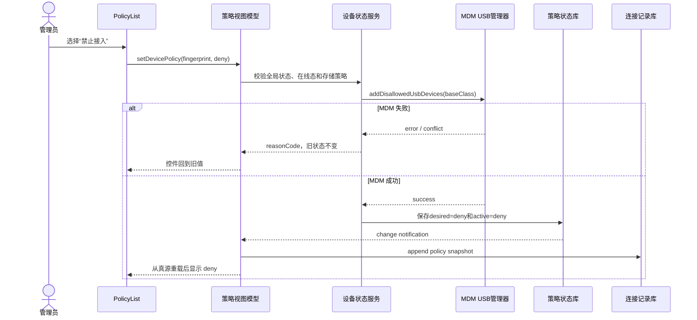
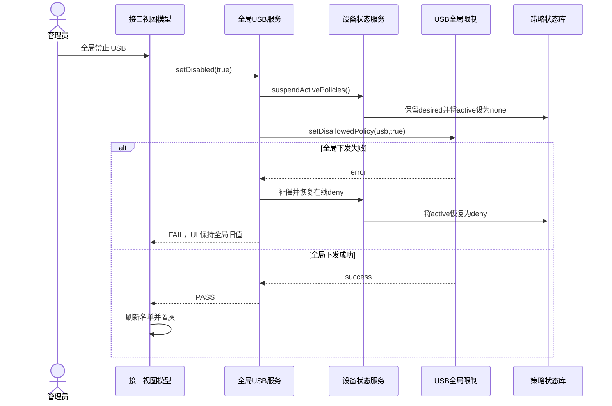

# 阶段 2｜方案推导与决策记录

## 1. 先画问题，不先画类

表面需求是“增加 USB 黑白名单和默认规则”，真正的问题链是：

```text
USB 全局禁用？
  ├─ 是：所有设备有效结果 deny，但不能丢掉原规则
  └─ 否：USB 存储是否被总策略禁用？
          ├─ 是：存储设备不可提交单设备 allow/deny
          └─ 否：设备是否已有显式策略？
                  ├─ 是：执行 desiredPolicy
                  └─ 否：执行 usbDefaultPolicy

任何 MDM 下发失败
  └─ 不提交“已生效”状态，保留旧状态和失败原因
```

如果不先写这棵树，AI 很可能把四个概念塞进一个 `usbDisabled`，然后用 UI 状态反推系统事实。

必须明确：“接口管控启用”表示所有设备通过全局闸门，并不等于给每台设备写一条白名单记录。通过全局闸门后，已有设备仍受单设备显式规则约束；只有没有显式规则的新设备才读取默认黑/白名单。

## 2. 三个候选方案

| 方案 | 做法 | 优点 | 失败模式 | 结论 |
|---|---|---|---|---|
| A 单布尔状态 | 一个 `usbDisabled` 同时代表全局和默认 | 写得快 | 无法表达白名单、恢复和失败补偿 | 淘汰 |
| B UI 列表即真源 | 页面 records 保存 allow/deny，直接调用 MDM | 页面简单 | 重启/清 trace/刷新后丢语义；容易假成功 | 淘汰 |
| C 分层策略模型 | 系统全局真源 + 默认 Preferences + 设备状态 RDB | 能表达优先级、动态规则和恢复 | 类更多，需要显式事务 | 采用 |

## 3. 最小能力穿刺

在拆完整任务之前，只穿刺最危险的四个假设。

### P1｜系统是否支持全局 USB restrictions 回读

目标链路：

```text
restrictions.setDisallowedPolicy(ADMIN_WANT, 'usb', value)
restrictions.getDisallowedPolicy(ADMIN_WANT, 'usb')
```

穿刺结论：全局状态可以系统回读，因此不应额外持久化一个全局布尔值。

### P2｜MDM “单设备”实际能精确到什么粒度

代码最终构造：

```ts
{
  baseClass,
  subClass: 0,
  protocol: 0,
  descriptor: usbManager.Descriptor.INTERFACE
}
```

穿刺结论：系统侧按 USB 类型规则下发，本地 fingerprint 只负责业务身份、列表和意图。不得将其表述为硬件序列号级精确阻断。

### P3｜全局禁用和设备 deny 是否会冲突

穿刺结论：全局下发前先暂停 active deny；全局失败则补偿恢复；全局恢复后重放在线显式 deny。于是需要单独的编排 Service，而不是 ViewModel 连续调用两个 API。

### P4｜即时系统回读是否永远可靠

USB 存储策略写入后，立即回读可能短暂返回旧值。当前父 VM 在成功后把已提交目标状态作为 override 刷新 Policy VM。

穿刺结论：UI 的乐观/确认状态必须有明确来源；不能无限 sleep，也不能假设所有系统 API 强一致。

### P5｜API 报错是否一定等于策略未生效

真实设备日志出现过：

```text
UsbReadOnlyPlugin ... readonly value:false
StorageManagerProvider::Unmount start
Unmount: volumeId=vol-8-49 state=0 not allowed
UsbReadOnlyPlugin ... Unmount failed
error code=9200007
```

这里系统已经把只读参数改成 `false`，但重新挂载失败。若只按 API 返回值判断，会把“策略已保存、运行态待重挂载”误判成“完全没下发”。

穿刺结论：系统操作必须允许三态结果：

| 结果 | API | 回读 | 运行态/实物 | 处理 |
|---|---|---|---|---|
| 已生效 | success | 目标值 | 行为符合目标 | 提交成功 |
| 部分生效 | fail/9200007 | 已是目标值 | 未完成重挂载/重枚举 | 保留目标，提示重新插拔并继续取证 |
| 下发失败 | fail | 仍是旧值 | 行为不变 | 保持旧状态，返回可行动错误 |

## 4. 选定方案

### 4.1 三层策略与两类真源

| 层级 | 状态 | 真源 | 作用域 |
|---|---|---|---|
| L1 | `usbGloballyDisabled` | restrictions `usb` 系统回读 | 所有外接 USB |
| L2 | `desiredPolicy/activePolicy/present` | `usb_device_policy_states` RDB | 已识别 fingerprint |
| L3 | `usbDefaultPolicy` | Preferences `usb_default_policy` | 尚无显式策略的新设备 |
| 并行上层 | USB 存储访问模式 | MDM USB storage API | USB_STORAGE 类型 |

优先级固定为：

```text
L1 接口管控全局闸门
  > L2 已识别设备显式规则
    > L3 新设备默认黑/白名单
```

L1 全局启用只表示继续向下判断，不会自动清除 L2 的 deny；L3 是兜底，不会覆盖已经存在的 L2。

### 4.2 有效策略

```text
if globalDisabled:
  effective = deny
elif deviceState exists:
  effective = deviceState.desiredPolicy
else:
  effective = usbDefaultPolicy
```

存储设备还要经过账户/类型级存储策略冲突校验；`DISABLED` 时拒绝单设备策略写入。

### 4.3 两条关键时序先在方案阶段画出来

#### 在线设备从 allow 改为 deny



#### 全局 USB 禁用与失败补偿



### 4.4 意图与执行态分离

```text
desiredPolicy = 管理员希望设备长期怎样
activePolicy  = 当前是否真实下发了设备 deny
present       = 当前是否在线、可否操作
```

这三个字段解决四个关键场景：拔出后保留规则、全局禁用时保留规则、恢复时只重放在线 deny、失败时不冒充已生效。

## 5. ADR-001｜全局 USB 总控采用独立事务编排服务

- 决策：`UsbGlobalPolicyService` 是唯一编排边界。
- 原因：ViewModel 不应知道“暂停设备 deny—下发全局—失败补偿—恢复重放—写策略快照”的事务细节。
- 失败语义：全局下发失败必须尝试恢复暂停的 deny；快照写入失败不回滚已成功系统策略，但要告警。
- 后果：ViewModel 只处理 processing、reasonCode 和成功后提交 UI 状态。

## 6. ADR-002｜默认策略只影响未来首次出现的设备

- 决策：切换默认 allow/deny 只写 Preferences，不扫描、不批量下发、不改已有记录。
- 原因：默认值不是全局迁移命令；已有显式意图优先。
- 失败语义：持久化失败则 UI 保持旧值。
- 默认回退：缺值、损坏值、初始化异常均回到 allow，避免升级后误封未知设备。

## 7. ADR-003｜系统成功后才提交本地执行态

- 决策：deny 下发成功后才写 `activePolicy=deny`；默认 deny 首次下发失败时不创建“已成功黑名单”。
- 原因：本地状态不是愿望清单，而是后续恢复/补偿的依据。
- 例外：`desiredPolicy=allow` 可以作为白名单意图保存，因为它不声称执行了 deny。

## 8. ADR-004｜还原优先修复系统残留，再恢复本地意图

顺序：

```text
读取 EDM getDisallowedUsbDevices()
  → remove 当前全部类型 deny
  → 将本地卡片 desired=allow / active=none
  → 刷新 ViewModel
```

如果系统清理失败，不得先把本地状态显示为 allow；否则会制造“页面允许、系统仍拒绝”的假成功。

## 9. 动态规则如何生效

| 动作 | 系统动作 | 本地状态 | UI 更新 |
|---|---|---|---|
| 默认 allow→deny | 无即时系统动作 | Preferences 更新 | 默认策略栏刷新 |
| 在线设备 allow→deny | MDM add deny | 成功后 `desired=deny/active=deny` | 列表与 trace 刷新 |
| 在线设备 deny→allow | MDM remove deny | 成功后 `desired=allow/active=none` | 列表与 trace 刷新 |
| 离线设备修改 | 拒绝 | 不变 | 原值 + 可操作失败提示 |
| 全局 USB disable | 暂停 active deny，再全局禁用 | desired 保留，active→none | 名单置灰但规则仍可见 |
| 全局 USB enable | 全局启用，再重放在线 deny | 成功项 active→deny | 刷新名单；部分失败告警 |

### 9.1 为什么“全局启用”不是清空黑名单

全局启用只是把 L1 从“全部禁止”改为“允许继续向下判断”。随后必须恢复 L2：

```text
global enable
  → present + explicit deny：重放 deny
  → explicit allow：允许
  → no explicit rule：读取默认黑/白名单
```

如果启用后顺手把所有设备改成 allow，就会丢失管理员已经配置的单设备规则；如果启用后不重放 deny，页面黑名单和系统实际行为又会相反。

## 10. ADR 决策摘要

> **决策结论（CURRENT）：** 方案不是“AI 推荐了哪个类”，而是每个状态的 Owner、提交时机和失败语义都已冻结。

| ADR | 冻结的规则 | 失败时怎么办 |
|---|---|---|
| 001 全局编排 | 只有 `UsbGlobalPolicyService` 编排暂停/补偿/重放 | 全局下发失败则恢复已暂停 deny |
| 002 默认策略 | 只影响未来首次出现的设备 | 保存失败保持旧值；坏值回退 allow |
| 003 提交顺序 | MDM 成功后才写 `activePolicy` | 下发失败不创建“已生效黑名单” |
| 004 管理员还原 | 先清系统残留，再恢复本地 `allow/none` | EDM 清理失败则不改 UI/本地状态 |

```text
effective(device) = global deny > explicit desiredPolicy > usbDefaultPolicy
```

**证据边界：** 这是设计决策证据，需继续用源码、UT、系统回读和实物行为验证它是否真实落地。

## 11. 怎么判断方案是对的

方案评审不问“类图好不好看”，而问：

- 同一个设备在全局开/关、在线/离线、默认 allow/deny 下是否都有唯一结果？
- 任一失败点是否会出现 UI 与系统相反的假成功？
- 是否能从状态恢复出下一步动作，而不是靠历史猜测？
- 是否有独立 oracle 验证系统真源？
- 系统 API 的粒度限制是否被如实暴露？

## 12. 阶段出口门

- [x] 候选方案和失败模式已对比。
- [x] 全局、默认、显式和存储策略的优先级已固定。
- [x] 真相源、所有权、失败语义已写入 ADR。
- [x] 最小穿刺暴露了系统下发粒度与即时回读问题。
- [x] 错误码与回读矛盾时的“部分生效”语义已定义。
- [x] 动态设置与回退顺序已定义。
- [ ] 进入开发前仍需把 ADR 映射到真实 MVVM 类和验收点。
