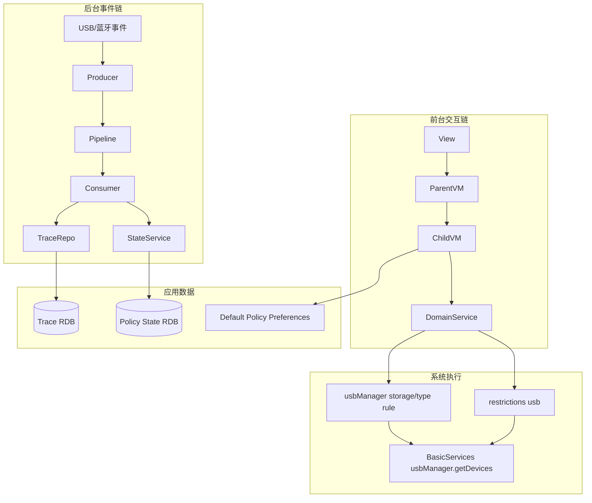
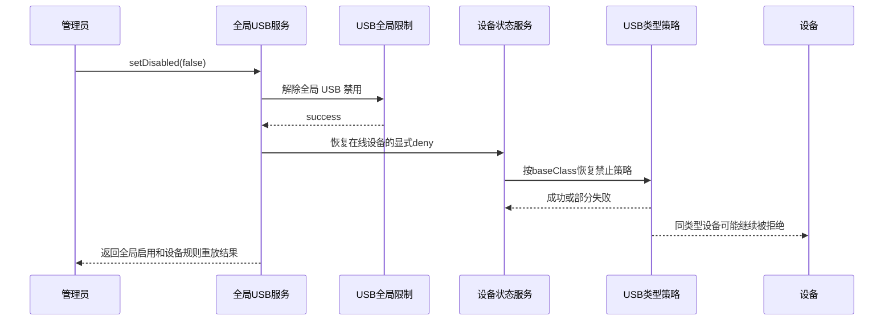
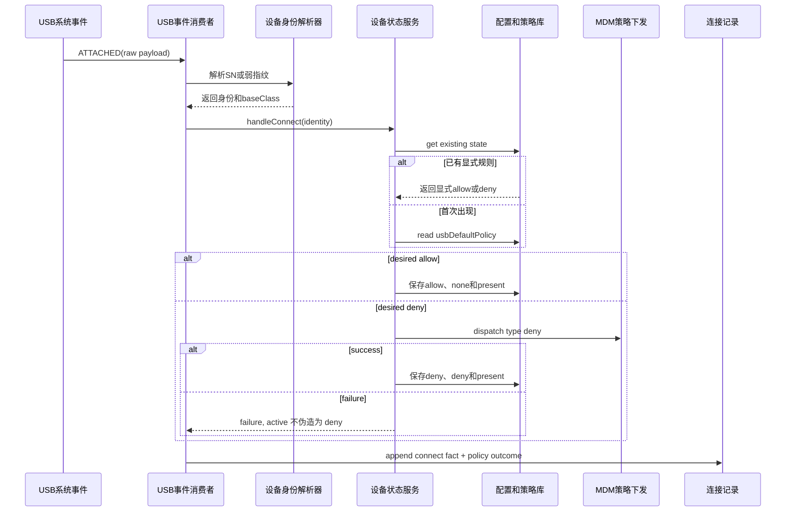

# 阶段 3｜外设管理 MVVM 与策略 RFC

## 1. RFC 目标

定义一个可实现、可恢复、可验证的外设策略架构，使页面展示、应用侧意图、MDM 系统状态和真实设备行为能够被分别观察，并通过明确的优先级收敛。

## 2. 核心不变量

1. 全局 USB 状态只相信 restrictions 系统回读，不另存本地镜像。
2. 默认策略和全局开关是两个独立概念、两个入口、两个真源。
3. 接口管控是全局闸门、优先级最高；设备显式规则优先于黑白名单默认规则。
4. 全局禁用不得改写 `desiredPolicy`。
5. 系统下发成功前，不得把 `activePolicy` 提前写成目标状态。
6. 首次默认 deny 下发失败，不得新增“已生效黑名单”。
7. 离线设备不得动态修改策略。
8. USB 存储总策略为 DISABLED 时，存储设备的 allow/deny 两个方向都拒绝。
9. 还原策略先清系统残留，后改本地记录；记录恢复为 allow，不删除资产卡片。
10. UI/E2E 结果不能代替 MDM 回读和实物接入 oracle。

冻结规则：

```text
接口管控 global gate
  > fingerprint 单设备显式 allow/deny
    > 未配置设备默认黑/白名单
```

“USB 全局启用”表示所有 USB 设备可以继续进入下一层规则判定，不表示自动删除单设备 deny；“默认白名单”也不是对所有历史设备批量写 allow。

## 3. MVVM 真实结构

```text
┌──────────────────────────────── View ────────────────────────────────┐
│ MainPage                                                            │
│   └─ PeripheralPage                                                 │
│       ├─ InterfaceControlTab：全局接口与 USB 存储选择器              │
│       ├─ DeviceRecordList：连接/策略快照事实                         │
│       └─ PolicyList：默认策略 + USB 设备黑白名单                      │
└───────────────────────────────┬──────────────────────────────────────┘
                                │ 事件 + 受控状态
┌──────────────────────────── ViewModel ───────────────────────────────┐
│ PeripheralViewModel（父级协调，不承载底层事务）                      │
│   ├─ InterfaceControlViewModel：接口状态、processingKey              │
│   ├─ PeripheralPolicyViewModel：默认策略、设备记录、updatingKeys     │
│   └─ PeripheralRecordViewModel：连接记录、详情、导出                 │
└───────────────────────────────┬──────────────────────────────────────┘
                                │ 用例调用
┌──────────────────────────── Service / Domain ────────────────────────┐
│ UsbGlobalPolicyService：暂停/补偿/全局下发/恢复重放/快照             │
│ UsbDevicePolicyStateService：connect/disconnect/动态规则/还原        │
│ PeripheralDevicePolicyDispatchService：MDM 类型规则下发              │
│ PeripheralPolicyService：状态记录 → 页面模型                         │
│ PeripheralPolicySnapshotTraceService：真实在场设备策略快照           │
└───────────────────────────────┬──────────────────────────────────────┘
                                │ 真源读写
┌────────────────────────── Repository / System ───────────────────────┐
│ Preferences：usb_default_policy                                     │
│ RDB：usb_device_policy_states                                       │
│ MDM restrictions：USB 全局状态                                      │
│ MDM usbManager：存储访问模式、类型级 deny                            │
│ BasicServices usbManager：当前真实在场设备                           │
└──────────────────────────────────────────────────────────────────────┘
```

### 3.1 外设运行框架不仅是 MVVM

MVVM 解决“页面如何持有和提交状态”，但完整外设框架还包括两条后台链和两个系统事实源：



因此“页面没刷新”至少要沿三条路径排查：是否产生系统事件、是否成功写库并通知、ViewModel 是否重新查询并提交可观察状态。直接在 View 上加刷新按钮，只会掩盖其中一层断点。

## 4. 为什么父 ViewModel 还要存在

三个子 ViewModel 各有自己的状态，但跨 Tab 的刷新必须由父 VM 协调：

- USB 全局切换成功后，黑白名单要重新读取 `usbGloballyDisabled` 并置灰/恢复。
- USB 存储模式变更后，存储设备的 `editable` 要立即变化。
- 单设备规则更新后，连接记录和策略列表都可能需要刷新。
- Trace 变化只刷新记录，不反向重建策略；Policy State 变化只刷新名单。

父 VM 不读取子 VM 的内部数据库，也不编排 MDM 事务，只负责顺序、权限门、reasonCode 和刷新边界。

真实代码骨架：

```ts
@ObservedV2
export class PeripheralViewModel {
  @Trace interfaceControl = new InterfaceControlViewModel()
  @Trace records = new PeripheralRecordViewModel()
  @Trace policy = new PeripheralPolicyViewModel()

  async toggleInterface(feature, disallow): Promise<boolean> {
    if (!this.ensureAdminReady()) return false
    this.reasonCode = await this.interfaceControl.toggleInterface(feature, disallow)
    if (this.reasonCode === null && feature === 'usb') {
      await this.policy.reloadRecords()
    }
    return this.reasonCode === null
  }
}
```

## 5. 状态模型

### 5.1 接口管控状态

```ts
class InterfaceControlStateModel {
  usbDisabled: boolean
  btDisabled: boolean
  wifiDisabled: boolean
  ethernetDisabled: boolean
  hdcDisabled: boolean
  networkDisabled: boolean
  printerDisabled: boolean
  microphoneDisabled: boolean
  cameraDisabled: boolean
  usbStoragePolicyIndex: number
}
```

`processingKey` 只表示当前异步操作，不是业务真源。选择器是受控组件：成功后父级状态改变，失败后仍显示旧值。

### 5.2 黑白名单状态

```ts
class PeripheralPolicyState {
  records: PeripheralPolicyRecord[]
  updatingKeys: string[]
  hasRestorableRecords: boolean
  usbDefaultPolicyIndex: number
  usbGloballyDisabled: boolean
}
```

`records` 是展示模型，不是持久化真源；重新加载时由 `usb_device_policy_states` 生成。

### 5.3 USB 设备策略状态

```ts
interface UsbDevicePolicyStateRecord {
  fingerprintKey: string
  fingerprintType: 'serial' | 'weak'
  vendorId: number
  productId: number
  description: string
  baseClass: number
  deviceName: string
  desiredPolicy: 'allow' | 'deny'
  present: boolean
  activePolicy: 'none' | 'deny'
  lastSeenAt: number
  updatedAt: number
}
```

不保存 `effectivePolicy`，因为它由全局状态、设备意图和默认策略推导；不保存全局 USB 状态，因为系统是唯一真源。

## 6. 规则定义

### 6.1 优先级矩阵

| 全局 USB | 存储模式 | 设备记录 | 默认 | 有效结果 | 可编辑 |
|---|---|---|---|---|---|
| 禁用 | 任意 | allow/deny/无 | 任意 | 全部 deny | 否 |
| 启用 | DISABLED | USB_STORAGE allow | 任意 | 存储禁止 | 否 |
| 启用 | DISABLED | USB_STORAGE deny | 任意 | 存储禁止 | 否 |
| 启用 | 非 DISABLED | 显式 deny | 任意 | deny | 在线时可改 |
| 启用 | 非 DISABLED | 显式 allow | 任意 | allow | 在线时可改 |
| 启用 | 非 DISABLED | 无 | deny | 首次接入尝试 deny | 暂无卡片 |
| 启用 | 非 DISABLED | 无 | allow | allow，并建白名单卡片 | 在线时可改 |

矩阵中的“无”必须理解为“没有 fingerprint 显式规则”，而不是“页面暂时没有渲染卡片”。规则查询顺序必须在 Service 中固定，不能由 UI 的列表是否为空决定。

### 6.2 身份规则

```text
有 SN：USB-SN:<serial>
无 SN：USB-WEAK:<vid>:<pid>:<descriptionHash>
```

- fingerprint 是业务身份 key。
- RDB 只保存 key，不负责生成算法。
- Hub（baseClass 0x09）在进入策略链前过滤。
- VID/PID 无效时只保留必要诊断，不进入黑白名单。

### 6.3 默认策略规则

```ts
const desiredPolicy = existing?.desiredPolicy ??
  (PeripheralDevicePolicyRepository.isUsbDefaultDeny() ? 'deny' : 'allow')
```

- 只对首次出现、没有历史显式策略的设备求值。
- 切换默认策略不影响已经有记录的设备。
- 配置缺失或非法值统一 normalize 为 allow。

### 6.4 动态修改规则

动态 allow/deny 不是先改页面再异步“尽力同步”，而是：

```text
校验全局未禁用
  → 校验设备是 USB 且 fingerprint 合法
  → 校验设备在线
  → 校验 USB 存储冲突
  → 下发 MDM
  → 系统成功后保存 desired/active
  → 写策略快照
  → 重新从 Repository 读 UI
```

### 6.5 业务规则粒度与系统执行粒度

```text
业务身份：USB-SN:xxx / USB-WEAK:vid:pid:hash
系统下发：UsbDeviceType { baseClass, subClass=0, protocol=0 }
```

这意味着“根据设备单独设置”在应用层是按 fingerprint 保存意图，但当前系统调用可能影响同 `baseClass` 的其它设备。RFC 必须同时保留两句话：

1. 产品交互允许管理员对某个设备卡片设置显式规则。
2. 在当前系统 API 粒度下，不能宣传成已证明的 SN 级物理隔离。

验收必须准备两台同类型设备：A 设 deny 后插入 B，观察 B 是否也受影响。这是验证执行粒度的必要反例，单台设备结果无法证明隔离粒度。

## 7. 全局 USB 禁用事务

```text
1. 读取 USB 存储模式，必须为 READ_WRITE
2. suspendActivePolicies()
   - 对 active=deny 的类型先下发 allow
   - 每成功一个就把 active 改为 none
   - 中途失败则 compensate 已暂停项
3. captureCurrentUsbDevices()
4. restrictions 设置全局 usb=true
5. 失败：restorePresentDeniedPolicies()，UI 不提交
6. 成功：为禁用前真实在场设备写 deny policy_snapshot
7. 父 VM 刷新 Policy VM，名单保留 desired 但置灰
```

关键点：先捕获设备是为了全局禁用后设备可能消失；快照失败不反向撤销安全策略，但必须记录 warning。

真实编排片段：

```ts
if (disallow) {
  if (storageResult.data !== UsbPolicy.READ_WRITE) return conflict
  if (!await UsbDevicePolicyStateService.suspendActivePolicies()) return failure
  connectedDevices = captureCurrentUsbDevices()
}

const result = setInterfaceDisabledWithResult('usb', disallow)
if (!result.success && disallow) {
  await UsbDevicePolicyStateService.restorePresentDeniedPolicies()
}
```

## 8. 全局 USB 恢复事务

```text
1. restrictions 设置全局 usb=false
2. 对 present=true 且 desired=deny 的设备重放 deny
3. 部分失败：全局启用保持成功，但 warning + 状态保留重试依据
4. 等待 500ms 枚举；为空再等 1000ms
5. 为当前真实在场设备写 allow policy_snapshot
6. 父 VM 刷新名单与可编辑状态
```

这不是严格数据库事务：系统全局策略一旦成功，不能因为一条 trace 写失败就回滚。RFC 明确区分“安全策略主结果”和“审计副作用”。

### 8.1 恢复后为什么仍可能“USB 已启用但设备不可用”



全局启用和设备可用是两层结论。页面必须分别表达“全局闸门已打开”和“该设备仍命中显式 deny/存储策略”，不能用一个“USB 已启用”Toast 代替最终设备状态。

## 9. 首次连接状态机

```text
USB attach
  → IdentityResolver
  → 过滤 Hub / 非法身份
  → 读 existing state
      ├─ existing：沿用 desiredPolicy
      └─ missing：读取 usbDefaultPolicy
  → desired=deny 且无上层冲突：先 dispatch deny
      ├─ 成功：active=deny，保存记录
      └─ 失败：不创建假黑名单，连接事实仍可记录失败原因
  → desired=allow：不下发 deny，保存 allow/none 白名单记录
```

### 9.1 首次连接时序



## 10. 拔出与回退

MDM deny 是按设备类型下发，拔出某台设备时不能无脑 remove：

```text
if current.activePolicy == deny:
  if 还有同 baseClass 的其它在线 active deny:
    只把当前 active 收敛为 none
  else:
    下发 allow 清理类型策略
    成功后 active=none
```

拔出时的内部恢复不改变 `desiredPolicy`，不新增策略快照；下次插入仍按显式 deny 重放。

## 11. 还原策略

```text
View 点击“还原策略”
  → PeripheralViewModel.clearPeripheralPolicyRecords()
  → PeripheralPolicyViewModel.clearAllPolicies()
  → UsbDevicePolicyStateService.clearAllPolicies()
      1. getDisallowedUsbDevices()
      2. removeDisallowedUsbDevices(all)
      3. 所有本地记录 desired=allow / active=none
      4. upsertAll
  → reloadRecords()
```

若第 2 步失败，第 3 步不得执行。若第 4 步失败，则系统已恢复但本地未完成，返回失败并要求重新同步/人工核对，而不是显示成功。

还原是一个高风险顺序：当前实现若“系统清理成功、本地 `upsertAll` 失败”，会形成系统已允许、本地仍显示 deny 的反向不一致。该情况必须列为需要补偿或可重试的中间态，不能因为 happy-path UT 通过就判定完全闭环。

## 12. UI 失败回退

View 不维护重复业务状态。`AsyncSelectRow` 接收父级 `selectedIndex`：

- 操作开始：设置 `processingKey/updatingKeys`，行置灰；
- 成功：VM 提交新状态，再驱动 UI；
- 失败：VM 保持旧状态，控件自然回到旧选项；
- 最后：清 processing，展示映射后的 reasonCode。

页面置灰只是第一道防线，ViewModel 与 Service 必须重复校验全局禁用、离线和存储冲突，防止绕过 UI 调用。

## 13. 真实代码映射

| RFC 责任 | 真实文件/符号 |
|---|---|
| 页面组合 | `views/peripheral/overview/PeripheralPage.ets` |
| 父级刷新/权限门 | `PeripheralViewModel.ensureAdminReady/toggleInterface/handlePeripheralPolicyChange` |
| USB 全局入口 | `InterfaceControlViewModel.toggleInterface` |
| 全局事务 | `UsbGlobalPolicyService.setDisabled` |
| 默认策略 | `PeripheralDevicePolicyRepository.get/setUsbDefaultPolicy` |
| 策略页状态 | `PeripheralPolicyViewModel.reloadRecords/setDevicePolicy/clearAllPolicies` |
| 首次连接与拔出 | `UsbDevicePolicyStateService.handleConnect/handleDisconnect` |
| 暂停/恢复 | `suspendActivePolicies/restorePresentDeniedPolicies` |
| 系统下发 | `PeripheralDevicePolicyDispatchService.dispatch` |
| 系统残留清理 | `clearAllUsbDeviceTypePolicies` |
| 策略 RDB | `UsbDevicePolicyStateRepository` |
| 规则→页面模型 | `PeripheralPolicyService.buildPolicyRecords` |

## 14. MVVM 与提交边界摘要

> **架构结论（CURRENT）：** View 只发事件，VM 只管可见状态与协调，Service 负责规则/事务，Repository/System 才是真源；只有系统成功后才提交执行态。

```text
PolicyList (View)
  → PeripheralViewModel          admin 门禁 + 跨 Tab 刷新
  → PeripheralPolicyViewModel    fingerprint/global/loading 校验
  → UsbDevicePolicyStateService  present/desired/active 状态机
  → DispatchService              storage 冲突 + MDM 下发
       ├─ FAIL → 旧状态保留，reasonCode 可见
       └─ PASS → Repository.upsert → reloadRecords
```

| 边界 | 可以做 | 禁止做 |
|---|---|---|
| View | 发事件、展示受控状态 | 直接调 MDM/写 RDB |
| ViewModel | 校验、processing、reasonCode、协调刷新 | 伪造系统成功、藏 SQL/Preferences |
| Service | 状态机、事务、补偿、系统调用 | 维护页面控件状态 |
| Repository/System | 持久化与系统事实 | 反向决定 UI 交互 |

**评审方法：** 从 `PolicyList` 顺调用链追到 `DispatchService`，再确认 `upsert` 是否只位于 PASS 分支，用源码判断是否存在“假成功”。

## 15. 测试边界

| 层 | 验证重点 |
|---|---|
| Domain UT | 优先级、默认分支、成功后提交、失败不保存、补偿、离线拒绝 |
| ViewModel UT | 状态刷新、跨 Tab 协调、loading 清理、reasonCode、失败回显 |
| Repository UT | 默认 allow、非法值回退、持久化与 listener |
| E2E | 页面、Tab、操作入口和可见回显 |
| 系统回读 | restrictions、storage policy、disallowed USB device types |
| 实物矩阵 | U 盘、HID、摄像头、打印机；同类型第二台设备影响范围 |

## 16. 当前已知风险与待补契约

| 风险 | 真实症状/证据 | 当前判断 | 需要补的契约 |
|---|---|---|---|
| Trace 写入后未及时刷新 | 记录已进 RDB，切 Tab 后才出现 | 写入后的保留期/裁剪维护若失败，通知可能不到达 | 写入提交成功立即通知；维护失败不能吞掉已写事实 |
| 在线态残留 | 设备拔出后仍像在线 | `present` 依赖 attach/detach，缺少启动对账 | 初始化时用 `getDevices()` 对账；指纹不一致有降级匹配 |
| EDM 残留 | USB 已启用仍报 `9200010` | 本地 allow 不等于系统无类型 deny | 还原按钮状态必须读取系统；清理后回读 |
| 存储策略部分生效 | `9200007`，但 readonly 参数已变 | 策略写入与卷重挂载是两阶段 | 成功/部分生效/失败三态结果 |
| 还原的反向不一致 | 系统清理成功，本地保存可能失败 | 当前缺乏补偿事务 | 快照、补偿或显式可重试状态 |
| 系统粒度扩大 | deny 键盘后同类 HID 受影响 | MDM 按 `baseClass` 执行 | 双同类设备实测；UI 明示影响范围 |

这些不是附录里的“以后优化”；它们决定哪些结论只能标为 PARTIAL/PENDING，并直接进入 S8 验收矩阵。

## 17. RFC 评审门

- [x] MVVM 每层有真实类和禁止越界项。
- [x] 全局、默认、显式、执行态、在线态各有真源。
- [x] 优先级矩阵和状态机完整。
- [x] 动态设置、失败回退、全局补偿、还原顺序已写清。
- [x] 系统下发粒度限制已显式记录。
- [x] 测试与设备 oracle 分层。
- [x] 当前已知状态一致性风险已显式登记，不用 happy path 掩盖。
- [ ] 实物矩阵结果仍待回填。
