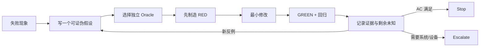

# 阶段 5｜Ralph 迭代运行账

> Ralph 在这里不是“让 AI 一直跑”，而是每轮只收敛一个可验证未知：读取外部记忆 → 实现/修正 → 独立验证 → 记录证据 → 决定停止、继续或升级。

## 1. 单轮协议

```text
READ
  RFC + 当前 Story + progress + 上轮失败证据
PLAN
  一个未知、最小文件面、一个独立 oracle
IMPLEMENT
  文档先行（若行为变更）+ 代码 + 测试
VERIFY
  UT → build → E2E/UI → 系统回读 → 实物
RECORD
  结论、证据路径、剩余未知、下一轮入口
STOP / CONTINUE / ESCALATE
```

每轮最多解决一个主失败。如果同时出现系统能力、UI 回显和数据迁移三个问题，拆成三轮。



没有“可证伪假设”和“独立 Oracle”的循环，只是让 AI 反复改代码；那不是 Ralph。

## 2. 真实演进账

| 轮次 | 发现的未知/错误 | 证据 | 修正 | 新不变量 |
|---|---|---|---|---|
| R1 | USB Hub 被当成可管理设备 | 运行时 payload/baseClass | 过滤 0x09 | Hub 不进 trace/名单/策略 |
| R2 | “USB 接口”被当成默认策略入口 | 旧 2026-05-14 计划与需求冲突 | 后续恢复为 restrictions 全局总控，默认策略移到名单页 | 全局与默认分离 |
| R3 | 名单从连接记录反推，清 trace 会丢候选 | 代码路径与清理行为 | 建 `usb_device_policy_states` | Trace ≠ Policy State |
| R4 | 拔出 deny 设备后系统类型规则残留 | 同类型 MDM 下发语义 | `activePolicy` + 同 baseClass 在线计数 + 内部 allow | desired 与 active 分离 |
| R5 | “还原”删除卡片，资产和意图丢失 | UI/状态测试 | 保留记录，恢复 allow/none | 还原不是删除 |
| R6 | 还原按钮只看本地 deny，无法清 EDM 残留 | 系统残留场景 | `hasDisallowedUsbDeviceTypePolicies()` 也计入 | 本地空不等于系统空 |
| R7 | 全局 USB 与单设备 deny 直接叠加，恢复易冲突 | 最小穿刺 | `UsbGlobalPolicyService` 暂停/补偿/重放 | 全局事务独立编排 |
| R8 | 全局禁用/启用没有留下真实在场设备策略证据 | trace 审阅 | 禁用前捕获；启用后重枚举写快照 | 不能从历史推断“当前在场” |
| R9 | 默认 allow 设备未进入白名单 | UT/页面空列表 | allow 首次连接也保存状态，不下发 deny | allow 也需要显式业务记录 |
| R10 | USB 存储写入后立即回读旧值导致名单仍可编辑 | 真机/状态同步问题 | 成功后用已确认目标状态刷新 | 已提交目标可作为短期 UI 刷新依据 |
| R11 | USB 已启用，存储模式仍报 `9200010` | EDM 数据库存在 `baseClass=3` HID deny | 还原读取并清系统残留 | 本地 allow 不代表系统无残留 |
| R12 | 只读→读写返回 `9200007`，但回读已经是读写 | hilog：参数写入成功、Unmount 失败 | 结果拆成成功/部分生效/失败 | API 返回值不是唯一 oracle |
| R13 | 连接记录已入库，当前 Tab 不显示 | 设备 RDB 时间线 + 缺失刷新日志 | 把“写入提交”和“后续维护通知”分开审计 | 写库成功必须立即发布事实 |
| R14 | 设备拔出后仍像在线 | `present` 只依赖事件、无启动对账 | 登记 `getDevices()` 对账契约 | 事件状态不是永久真源 |
| R15 | deny 一台 HID 影响同类设备 | EDM `disallowed_usb_devices baseClass=3` | 验收加入同类第二台设备 | fingerprint 意图 ≠ 系统执行粒度 |

对应真实提交包括：

- `63dda4b4 refactor peripheral usb policy state`
- `a2f0128b refactor peripheral policy state cleanup`
- `093cb6e4 fix peripheral policy restore cards`
- `786e370c fix peripheral policy restore state`
- `6e7702cd feat(peripheral): coordinate usb global disable with per-device policies`
- `23c4a046 fix(peripheral): restore usb policy records`
- `0d26c92e fix(peripheral): retry usb enable snapshots`
- `f95c5109 fix(peripheral): sync USB storage policy state`

运行账必须区分三种状态：已经进入当前代码、只完成了诊断/方案、仍待设备验证。表中的“修正”不是自动等于“当前全部闭环”，最终以证据总表为准。

## 3. 课堂截图卡｜五个转折如何变成工程不变量

> **截图结论（CURRENT）：** 迭代的价值不是“AI 多跑几轮”，而是每个反例都被写回设计、测试和下一轮的约束。

| 症状/反例 | 根因 | 固化的新不变量 | 下一轮 oracle |
|---|---|---|---|
| USB 接口变成默认策略 | 两种作用域共用入口 | 全局与默认分离 | restrictions 回读 + 首插策略 |
| 清 trace 后名单丢失 | 把历史事件当策略真源 | Trace ≠ Policy State | 清 trace 后规则仍在 |
| 拔出后 deny 残留 | `desired=active` 且忽略类型粒度 | 意图/执行态/在线态分离 | 同 baseClass 双设备 |
| 还原后卡片消失 | 把还原等于删除 | 先清 EDM，卡片恢复 allow/none | 系统残留 + UI 对照 |
| 默认 allow 设备不在名单 | 把“不下发 deny”当作“不需记录” | allow 也是管理意图 | RDB 记录 + Policy VM 卡片 |
| `9200010` 仍出现 | 只看本地规则，忽略 EDM 残留 | 还原先读取系统类型规则 | 清理前后系统列表 |
| `9200007` 被当成完全失败 | 只看 API 异常，不看回读/运行态 | 允许“部分生效” | 参数回读 + 挂载日志 + 重插 |
| 写库后 UI 不更新 | 通知绑在后续维护末尾 | 事实提交后立即通知 | RDB 时间线 + 刷新日志 |

**截图时要保留的链条：** 症状 → 根因 → 新不变量 → 下一轮 oracle。只截 commit 列表不能说明为什么 AI 修对了。

## 4. 展开一轮｜R7 全局 USB 协同

### 4.1 失败假设

最初直觉：先下发全局禁用，恢复时再按名单重新下发 deny 即可。

### 4.2 反例

- 系统已有按类型 deny 时，全局 restrictions 可能发生冲突。
- 如果先清 deny 后全局下发失败，原黑名单真实执行态被破坏。
- 如果禁用时把 `desiredPolicy` 改成 allow，恢复后无法知道谁应继续 deny。

### 4.3 红灯测试

- suspend 第二个策略失败时，第一个必须补偿为 deny。
- 全局下发失败时，所有在线显式 deny 被恢复。
- 全局成功时 desired 不变、active 归 none。
- 全局恢复时只重放 `present && desired=deny`。

### 4.4 实现

新增 `UsbGlobalPolicyService`，把事务从接口 ViewModel 中抽离；State Service 提供 suspend/restore/compensate 原语；父 VM 只在成功后刷新名单。

### 4.5 验证

- UT：编排分支与状态服务分支。
- 代码审阅：ViewModel 不直接访问 Policy VM 内部状态做事务。
- E2E：`PER-IF-002` 证明 UI 往返可执行。
- 系统/实物：完整矩阵仍为 PENDING。

### 4.6 下一轮未知

全局恢复后 USB 重新枚举存在延迟，立即捕获可能得到空集合，于是进入 R8 的有界重试。

## 5. 展开一轮｜R9 默认 allow 漏记录

### 症状

默认 allow 时设备可用，但黑白名单为空。若只看“设备能用”，很容易判为完成。

### 根因

早期逻辑把“没有下发 deny”误等同于“不需要保存状态”，导致允许设备没有业务身份记录。

### 修正

```ts
const shouldSave = desiredPolicy === 'allow' ||
  existing !== null ||
  dispatchResult?.success === true
```

### 独立 oracle

- 新 allow 设备不触发 dispatch；
- RDB 出现 `desired=allow/active=none/present=true`；
- Policy VM 能构建白名单记录。

这轮特别适合课堂讲：“功能可用”不等于“需求完成”，因为验收标准还要求资产可管理。

## 6. 五张真实问题卡｜如何从“看起来合理”走到证据结论

### 6.1 R11｜`9200010`：全局已启用，为什么存储策略仍冲突

**症状**

```text
USB 总接口：启用
USB 存储：尝试从禁止访问改成读写
结果：9200010
```

**错误假设**：管理员未激活，或 USB 总接口其实没启用。

**穿刺证据**：EDM 数据库仍有：

```text
policy_name = disallowed_usb_devices
baseClass = 3
subClass = 0
protocol = 0
descriptor = INTERFACE
```

`baseClass=3` 是 HID 类型。系统残留来自曾对某个键盘卡片下发 deny，但应用页面后来已显示 allow。

**结论**：

```text
页面 allow
≠ Policy State active=none
≠ EDM 无 disallowed type
≠ 设备最终可用
```

**规则修正**：还原按钮不能只看本地 deny；必须读取系统残留，先 `getDisallowedUsbDevices()`，再 remove，最后恢复本地 `allow/none` 并回读。

### 6.2 R12｜`9200007`：API 报错，策略却已经写入

**证据时间线**：

```text
readonly value:false                # 目标参数已写入
StorageManagerProvider::Unmount     # 开始重挂载
volume state=0 not allowed          # 运行态切换失败
error 9200007                       # API 整体返回失败
```

**错误修法**：无条件把 UI 回滚成“只读”。这会让页面和系统参数相反。

**正确判定**：

```text
API error + getter=目标值 + 当前卷未重挂载
  = PARTIAL_APPLIED
  = 提示关闭占用并重新插拔
```

这轮把“成功/失败”二态改成“已生效/部分生效/失败”三态，也是复杂系统中非常可迁移的判断方法。

### 6.3 R13｜连接记录已经入库，为什么切 Tab 后才出现

**设备数据库证据**：

```text
20:38:46.028 收到 ATTACHED
20:38:46.187 connect/deny 记录写入 RDB
当前 Tab 未更新
切换 Tab 后记录出现
```

**第一轮误判**：ArkUI 多层嵌套状态没有响应，应重构成一个大 UI State。

**继续取证**：写库后没有 `refreshTraceDrivenData` 日志。`appendEntries()` 把 `notifyChanged()` 放在保留期清理和上限裁剪之后；后续维护一旦失败，事实已经写入但通知不会发出。

**最小正向方案**：

```text
upsertBatch 成功
  → 立即 notifyChanged
  → ViewModel reload
  → 页面更新
  → 再执行过期清理/数量裁剪
```

这张卡用于教“先找最早缺失的证据，不要一上来重构最上层”。

### 6.4 R14｜设备已经拔出，为什么名单仍像在线

**症状**：Kingston 已移除，卡片仍保持正常颜色，策略字段仍显示 allow。

**拆成两个问题**：

1. `desiredPolicy=allow` 离线后仍保留是正确的，因为它代表下次接入意图。
2. `present=true` 若没有被 detach 修正则是错误的，因为它让操作入口继续可用。

**根因候选**：应用未运行时错过 detach，或 detach 的 SN/description 与 attach 不一致，按新 fingerprint 查不到旧记录。

**必须补的 oracle**：启动时枚举 `usbManager.getDevices()`，用真实在线集合与 RDB 对账；离线卡片保留规则但整行灰显、不可修改。

### 6.5 R15｜“单设备”为什么会影响另一台设备

**应用规则**：按 SN/弱指纹保存 A 的 deny、B 的 allow。

**系统执行**：`addDisallowedUsbDevices()` 收到的是 `baseClass`，不是 SN。A、B 同属存储或 HID 时，系统规则可能互相覆盖。

**Stop 条件**：单台设备测试永远不能证明单设备隔离；必须用同 `baseClass` 的第二台设备做反例。若平台无更细 API，应升级产品口径，而不是让 AI 继续“优化 fingerprint”。

## 7. progress.md 示例

```markdown
# Progress: USB layered policy

## Current story
S5 USB global disable/restore

## Completed
- global state reads restrictions usb
- suspend active deny with compensation
- preserve desiredPolicy during global disable
- restore present explicit deny after enable

## Evidence
- UT: usb-global-policy-service.test.ets PASS
- UT: usb-device-policy-state-service.test.ets PASS
- E2E: PER-IF-002 PASS (UI roundtrip only)
- device system readback: PENDING

## Known limits
- MDM deny dispatch is baseClass-level, not serial-level
- partial deny replay after global enable logs warning; device matrix pending

## Next
Run two same-class USB devices and record system readback + video.

## Stop reason
Code loop stops; remaining work requires physical device matrix.
```

## 8. 每轮 Reviewer 必问

1. 本轮改变的是意图、执行态、UI 状态还是系统真源？
2. 系统调用失败时，哪个字段保持旧值，哪个副作用需要补偿？
3. 测试的 fake 是否和真实系统 API 粒度一致？
4. E2E 的 PASS 到底断言了什么，是否被过度解读？
5. 下一轮的未知能否通过一个更小穿刺解决？

## 9. 停止与升级条件

### Stop

- Story 的 AC 均有对应证据。
- 重复运行结果稳定。
- 没有新增未知。
- 剩余项明确移交给后续 Story 或实物验收。

### Escalate

- 三轮都遇到同一系统冲突且无新证据。
- 需要真实 USB 设备、企业管理员权限或系统日志才能继续。
- 系统 API 粒度无法满足产品“单硬件设备”语义，需要产品/架构决策。
- 补偿失败后系统与本地可能不一致，需要人工清理与重新同步。

升级不是失败；在没有设备证据时继续让 AI 改代码，才是失控循环。
