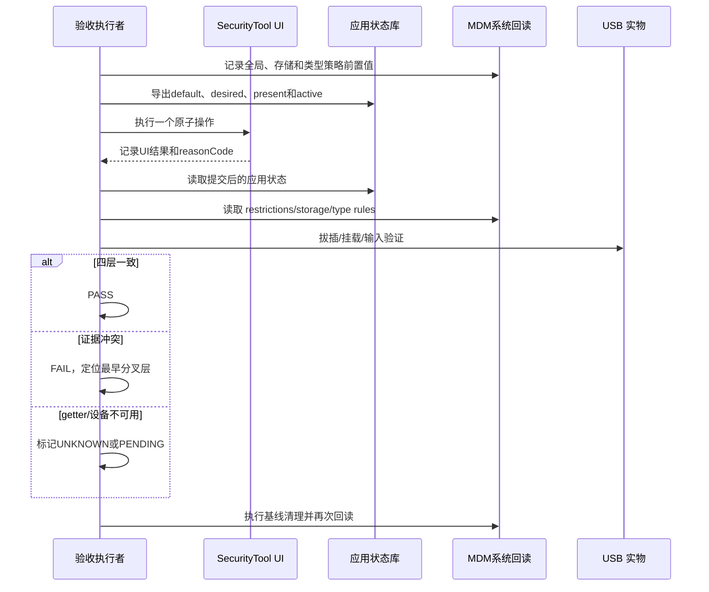

# 阶段 6｜测试与验收报告

## 1. 验收对象

本报告验收的不是“页面上有几个下拉框”，而是以下不变量：

- 策略优先级唯一且可解释；
- 管理员意图不会被全局状态或拔插覆盖；
- 系统失败不会被保存成成功；
- 动态设置、回退和还原有明确顺序；
- 页面、本地状态、系统回读和实物行为可以交叉验证。

## 2. 判定规则

```text
PASS    = 期望、执行、oracle 和证据都存在且一致
FAIL    = 执行完成，但 oracle 与期望不一致
UNKNOWN = 环境或观察能力不足，无法得出业务结论
PENDING = 尚未执行
```

禁止把 `UNKNOWN/PENDING` 汇总成 PASS；禁止用 build PASS 代替业务 PASS。

## 3. 验收矩阵

### 3.1 行为验收定义

这张表只定义“怎样才算满足”，不混入当前执行状态。每条 AC 必须按 Given 准备前置，执行一个 When，并同时观察 Then 中列出的状态。

| ID | Story | Given | When | Then | 必需 Oracle |
|---|---|---|---|---|---|
| AC-01 | S5 | 系统 restrictions USB 已有确定值 | 重新进入页面或重启应用 | USB 总开关等于系统回读，本地 Preferences 不得覆盖 | restrictions getter + UI |
| AC-02 | S2 | `usb_default_policy` 缺失或非法 | 加载默认策略 | 统一回退 allow，并保留诊断信息 | Preferences + Repository UT |
| AC-03 | S2 | 已有 A=allow、B=deny | 默认 allow 改为 deny | 只保存默认值；A/B 的 desired、active 和系统规则不变 | Preferences + RDB diff + Dispatch 零调用 |
| AC-04 | S3 | 新 USB 无状态，默认 allow | 插入设备 | 不下发 deny；新增 allow/none/present=true；名单可见 | 调用次数 + RDB + UI + 实物 |
| AC-05 | S3 | 新 USB 无状态，默认 deny | 插入且 MDM 下发成功 | 先下发类型 deny，再新增 deny/deny/present=true | 调用顺序 + MDM 回读 + RDB |
| AC-06 | S3 | 新 USB 默认 deny | MDM 下发失败 | 不创建成功黑名单，不写 active=deny，保留失败诊断 | RDB 无目标成功态 + trace |
| AC-07 | S4 | 在线 allow 设备 | 改为 deny | 系统成功后才保存 deny/deny；失败保持旧状态 | MDM 回读 + RDB diff + UI |
| AC-08 | S4 | 设备 present=false | 修改 allow/deny | UI 和 VM 均拒绝，状态与系统规则不变 | VM UT + RDB diff |
| AC-09 | S5 | 存储 READ_WRITE，存在在线 active deny | 禁用全局 USB | 先暂停设备 deny，再下发全局禁用；desired 保留、active=none | 调用顺序 + restrictions + RDB |
| AC-10 | S5 | 暂停或全局下发会失败 | 禁用全局 USB | 停止事务并补偿本轮已暂停项；UI 不显示成功 | 编排 UT + getter + RDB |
| AC-11 | S5 | 全局禁用，存在在线 desired deny | 恢复全局 USB | 先解除全局限制，再重放在线 deny；失败项返回 PARTIAL | restrictions + 类型规则 + RDB |
| AC-12 | S6 | USB 存储策略为 DISABLED | 修改 USB_STORAGE 的 allow/deny | UI 置灰；绕过 UI 调后端也拒绝；desired 不变 | UI + Dispatch UT + RDB |
| AC-13 | S7 | 本地或 EDM 存在 deny | 执行还原 | 先清 EDM，再保存所有卡片 allow/none；卡片不删除 | MDM 前后列表 + RDB + UI |
| AC-14 | S1/S4 | 同 baseClass 的 A、B 均在线且 active=deny | 拔出 A | 不误清仍在线 B 所需的系统 deny | 状态库 + MDM 回读 + 双设备 |
| AC-15 | S1 | 数据库 present 与真实在场设备不一致 | 重启或重新初始化 | 通过 `getDevices()` 对账 present；未实现则不得判 PASS | 设备枚举 + RDB |
| AC-16 | S5 | A=deny、B=allow，全局 USB 禁用 | 恢复全局 USB | L1 开闸；A 的 L2 deny 重放，B 不下发 deny | restrictions + 类型规则 + 实物 |
| AC-17 | S7 | 本地全部 allow，但 EDM 有残留 deny | 刷新并还原 | 还原入口可用；系统残留被清理，本地不制造假 deny | MDM 列表 + VM 状态 |
| AC-18 | S6 | 设置存储策略返回 9200007 | getter 已到目标值 | 标 PARTIAL_APPLIED；要求重挂载或重插，未验证前不判 PASS | API 码 + getter + hilog + 实物 |
| AC-19 | S3/S8 | 连接事实已写入 RDB | 后续策略维护或通知失败 | 已写事实不回滚；页面收到即时通知或明确记录开放项 | RDB 时间线 + observer + UI |
| AC-20 | S1 | 应用未运行时设备被拔出 | 再次启动应用 | 真实枚举修正残留 present=true | `getDevices()` + RDB |
| AC-21 | S4 | A、B 是同 baseClass 的两台设备 | 只对 A 设置 deny | 记录 B 的实际影响；不得将结果表述为 SN 级隔离 | 双设备视频 + MDM 参数/回读 |

### 3.2 当前证据状态

| ID | D3 UT | D5 E2E/UI | D6 系统/本地回读 | D7 实物 | 当前结论 |
|---|---|---|---|---|---|
| AC-01 | PASS | UI 可见 | PENDING | N/A | PARTIAL |
| AC-02 | PASS | N/A | N/A | N/A | PASS |
| AC-03 | PASS | 专用 Case 待补 | Preferences/RDB 待归档 | PENDING | PARTIAL |
| AC-04 | PASS | 页面证据待补 | RDB/MDM 待归档 | PENDING | PARTIAL |
| AC-05 | PASS | 页面证据待补 | PENDING | PENDING | PARTIAL |
| AC-06 | PASS | PENDING | PENDING | PENDING | PARTIAL |
| AC-07 | PASS | PENDING | PENDING | PENDING | PARTIAL |
| AC-08 | PASS | PENDING | N/A | N/A | PASS(D3) |
| AC-09 | PASS | `PER-IF-002` 仅证明 UI 往返 | PENDING | PENDING | PARTIAL |
| AC-10 | PASS | PENDING | PENDING | PENDING | PARTIAL |
| AC-11 | PASS | `PER-IF-002` 仅证明 UI 往返 | PENDING | PENDING | PARTIAL |
| AC-12 | PASS | `PER-POLICY-002` 提供部分 UI 证据 | PENDING | PENDING | PARTIAL |
| AC-13 | PASS | `PER-POL-001` 只证明入口 | PENDING | PENDING | PARTIAL |
| AC-14 | PASS(逻辑) | PENDING | PENDING | PENDING | PARTIAL |
| AC-15 | PASS(代码) | PENDING | PENDING | PENDING | PARTIAL |
| AC-16 | PASS(逻辑) | PENDING | PENDING | PENDING | PARTIAL |
| AC-17 | 局部 PASS | UI 入口 PASS | 曾复现 9200010 | PENDING | PARTIAL |
| AC-18 | PENDING | PENDING | 日志证据已有 | 重插结果待包 | PARTIAL |
| AC-19 | 当前实现待补 | 曾复现切 Tab 才显示 | RDB 时间线已有 | N/A | FAIL/OPEN |
| AC-20 | PENDING | PENDING | PENDING | PENDING | PENDING |
| AC-21 | PASS(认知) | N/A | 系统参数已知 | 双设备待测 | UNKNOWN |

责任映射：AC-01/09/11/16 → **U01**；AC-03/04/05/06 → **U02**；AC-13/17 → **U03**；AC-18 → **U04 + E03**；AC-14/21 → **U05**；AC-07/10 → **U07**；AC-12 → **U08**。AC-19 是 **E01 工程开放项**，AC-15/20 是 **E02 工程开放项**，在代码闭环前不转化为外部补采责任。完整采集要求见 `16-外部证据补充清单.md`。

## 4. 五层验收不能互相代替

> **证据结论（AS-IS）：** 当前可以证明架构、核心规则和多条 UI 路径；系统回读和 USB 实物矩阵仍不能声称通过。

| 证据层 | 当前状态 | 它能证明 | 它不能证明 |
|---|---|---|---|
| D1 文档 | PASS | 需求、ADR、不变量可审阅 | 代码已按方案实现 |
| D2 代码 | PASS | 真实类、调用链和提交顺序存在 | 系统 API 在目标设备必然生效 |
| D3/D4 UT+构建 | PASS/局部 | 多条分支与工程集成 | 真实 MDM 粒度和硬件行为 |
| D5 E2E/UI | 多条 PASS，保留 1 条旧 FAIL | 页面、入口和部分回显 | USB 真被禁用/恢复 |
| D6/D7 回读+实物 | **[需外部补充 U01–U08] PENDING** | 系统已生效与用户价值 | 未执行前不得推断；具体证据见 `16-外部证据补充清单.md` |

```text
发布结论 = 最低证据层级，不是最好看的一张 PASS 截图
```

**判定示例：** `PER-IF-002 PASS` 只能证明 UI 操作完成往返；它不能单独证明 USB 已被真实禁用，系统事实仍需 D6/D7。

## 5. 现有自动化证据

### 单元测试关注点

- `device-policy-repository.test.ets`
  - 默认 allow；
  - 读取持久化 deny；
  - 非法值回退 allow；
  - 保存失败不通知成功。
- `usb-device-policy-state-service.test.ets`
  - 还原为 allow 且保留卡片；
  - 默认 allow 建白名单不 dispatch；
  - 默认 deny 成功才保存；
  - 默认 deny 失败不保存；
  - 系统清理失败不提交本地 allow；
  - active deny 恢复保存失败返回失败。
- `PeripheralPolicyViewModel.test.ets`
  - 名单只来自策略状态库；
  - 存储 DISABLED 时保留 desired 但禁编辑；
  - 目标状态覆盖即时旧回读；
  - 非 USB、旧 ID、离线等拒绝；
  - 系统有残留而本地为空仍可还原。
- `usb-global-policy-service.test.ets`
  - 禁用/恢复编排、冲突、补偿和快照。

2026-09-01 的覆盖率报告显示：

| 文件 | 行覆盖率 | 分支覆盖率 | 解读 |
|---|---:|---:|---|
| `UsbGlobalPolicyService.ets` | 91.67% | 81.82% | 事务编排覆盖较高，但仍需设备 oracle |
| `InterfaceControlViewModel.ets` | 88.16% | 64.15% | UI 状态分支有基础保障 |
| `PeripheralPolicyService.ets` | 90.91% | 83.33% | 展示模型转换覆盖较高 |
| `UsbDevicePolicyStateService.ets` | 48.50% | 33.33% | 核心状态服务仍需补边界覆盖 |
| `PeripheralDevicePolicyDispatchService.ets` | 10.46% | 10.71% | 系统适配层 coverage 低，不能依赖 UT 宣称充分 |

覆盖率只是“哪些代码被执行”，不是“需求是否正确”。Dispatch 层低覆盖正说明系统回读与实物验收不能省略。

### E2E 结果

| Case | 结果 | 实际证明 |
|---|---|---|
| `PER-IF-001` | PASS | 外设页、接口管控和 USB 接口行可见 |
| `PER-IF-002` | PASS | USB 接口选择器往返操作后 UI 仍可见 |
| `PER-POL-001` | PASS | 黑白名单“还原策略”入口可见 |
| `PER-POLICY-002` | PASS | USB 存储只读→允许的 UI 操作与回显 |
| `PER-REC-001` | PASS | 连接记录页和导出入口可见 |
| `PER-WL-USB-001` | PASS | 黑白名单页和导出入口可见 |
| `PER-BL-USB-001` | FAIL | 旧运行没有稳定定位页面/还原入口；不能删除这份失败证据 |

E2E JSON 的 `artifacts` 当前为空，因此这些结果没有自动附带视频/截图；引用现有页面截图时必须标注为“可见性证据”。

## 6. 真机验收 Runbook

### 6.1 环境门

```powershell
hdc list targets
hdc install hapsigner/signApp.hap
hdc shell edm enable-admin -n com.huawei.securitytool -a EnterpriseAdminAbility -t super
```

记录：设备 ID、系统版本、应用 commit、HAP hash、管理员状态、USB 设备 VID/PID/baseClass/SN。

### 6.2 每条 Case 的三联证据

1. UI：操作前/后截图或连续视频。
2. 系统：restrictions、USB storage、disallowed type 的回读/日志。
3. 实物：设备能否枚举、挂载、输入或工作。

实际建议使用“四联证据”，把应用本地状态单独列出：

```text
UI        截图/录屏：用户看到什么
APP       RDB/Preferences：desired/present/active/default 是什么
SYSTEM    restrictions/storage/disallowed types：系统真值是什么
PHYSICAL  枚举/挂载/输入：用户价值是否真的发生
```

一条 Case 的证据包模板：

```markdown
## CASE USB-POL-004
- commit / HAP sha256:
- device / system build:
- physical USB: VID/PID/baseClass/SN:
- precondition system readback:
- operation timeline:
- UI before/after:
- app state before/after:
- system readback after:
- physical behavior after:
- logs / video / screenshots:
- verdict: PASS | FAIL | UNKNOWN
- cleanup completed: yes/no
```

### 6.3 推荐执行顺序

```text
Case A 默认 allow 新设备
Case B 默认 deny 新设备
Case C 显式 allow/deny 动态切换
Case D 全局禁用并保留规则
Case E 全局恢复并重放 deny
Case F 存储 DISABLED 冲突
Case G 还原策略与系统残留
Case H 两个同 baseClass 设备影响范围
Case I 重启后的状态一致性
```

每次执行前恢复基线；如果上一个 Case 留有系统 deny，不允许直接进入下一个 Case。

### 6.4 一次完整验收的时序



## 7. 失败时怎么处理

| 观察到的现象 | 先判断 | 动作 |
|---|---|---|
| UI 显示禁用，设备仍可用 | UI 是否只改了本地状态 | 读取 restrictions/MDM，检查是否假成功 |
| UI 显示允许，设备仍被拒绝 | EDM 是否有残留类型策略 | 执行还原并核对 `getDisallowedUsbDevices()` |
| 全局恢复后黑名单失效 | present/desired/active 是否正确 | 查看重放日志；失败项进入补偿/人工复核 |
| 默认 deny 没有黑名单记录 | dispatch 是否失败 | 不补写假记录；保留失败诊断，修系统能力 |
| 插入第二台同类设备也被禁止 | 系统粒度限制 | 不是简单 bug；升级产品/架构确认语义 |
| E2E 找不到 Tab | 导航驱动还是产品失败 | 读 step evidence/UI tree；必要时标 UNKNOWN，不直接改业务代码 |
| 立即回读旧存储状态 | 系统最终一致性 | 使用已确认目标刷新 UI，并安排延迟系统回读验证 |
| 返回 `9200010` | 是否有残留 `disallowed_usb_devices` | 读系统列表；还原后再次回读，不先改页面文案掩盖 |
| 返回 `9200007` 且 getter 已到目标 | 是否卡在卷重挂载 | 标 PARTIAL_APPLIED；关闭占用、重插并补实物证据 |
| 记录已在 RDB、页面未出现 | change notification 是否发出 | 查写库、维护、notify、VM reload 的最早缺口，不用 Tab 切换补查询 |
| 设备离线但 `present=true` | 是否错过 detach/指纹不一致 | 用 `getDevices()` 对账，保留 desired、修正 present |

### 7.1 怎么判断 AI 的修复方向对不对

| AI 提议 | 判断问题 | 通过标准 |
|---|---|---|
| “加一次刷新” | 最早缺失事实是在 View 还是写库/通知？ | 修在最早断点，View 不承担数据修复 |
| “失败就回滚” | 系统是否已经部分提交？ | 先 getter/日志，区分完全失败与部分生效 |
| “按 SN 黑名单” | 系统 API 参数真的带 SN 吗？ | 代码参数和双设备实物都支持才可声称 |
| “清空本地记录即可” | EDM 是否仍有残留规则？ | 系统清理与回读先于本地成功状态 |
| “E2E 已通过” | E2E 断言了 UI 还是系统行为？ | 只在它覆盖的证据层给 PASS |

如果 AI 的方案无法回答“它可能错在哪里、用什么证据推翻、失败后系统保持什么”，该方案还没有达到可开发状态。

## 8. 当前总判定

**结论：代码结构、关键规则和多条 UI 路径已有证据；完整设备级验收尚未完成。**

- 已有证据支持：MVVM 结构、策略优先级、真源分离、默认规则、动态设置、失败不提交、全局补偿、还原语义、E2E 证据边界。
- 当前证据不支持：所有 USB 类型均已在真机验证；fingerprint 等于系统精确单设备阻断；UI PASS 等于 MDM PASS。
- 最终证据包必须包含：全局开关视频、默认 allow/deny 插拔视频、系统回读、同类型双设备影响面、还原前后对照。
- 当前必须保留为 OPEN：Trace 写入后通知时机、启动在线态对账、`9200007` 部分生效呈现、同 baseClass 双设备影响面。
