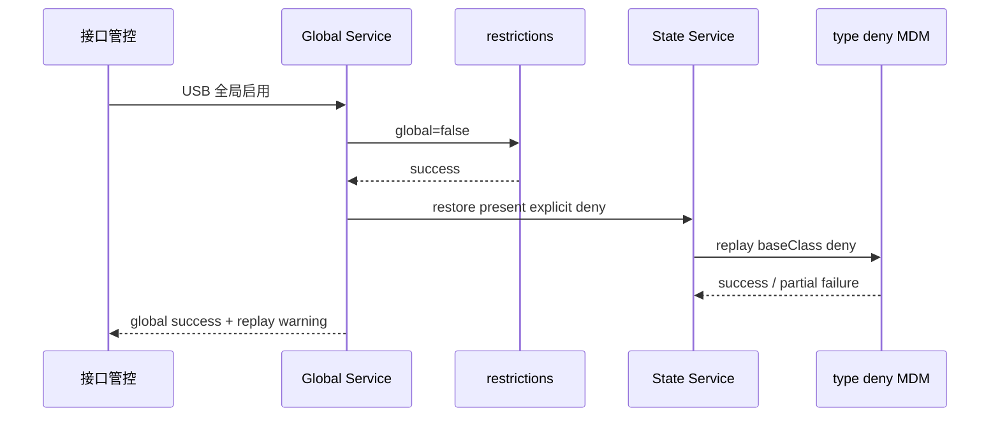

# 附录｜本地 Session 真实问题证据卡

> 本文件不是新的方法阶段，而是为“资产同步—方案推导—架构定义—任务切分—Ralph—验收”提供可追踪的真实反例。Session 记录证明调查过程和当时证据，最终结论仍以当前源码、当前系统回读和实物行为为准。

## 1. 证据来源索引

| Thread ID | 主题 | 时间 | 主要价值 |
|---|---|---|---|
| `019d3c94-0cd8-7a20-95c0-abf4e54bafb8` | 分析外设管理 MVVM 数据流动 | 2026-03-30 | 三类能力、页面/VM/Service/Repo 边界 |
| `019d7655-692d-79f3-9dab-41bbe6b9fc36` | 更新外设正式设计为轻量 RDB 策略 | 2026-04-10 | 策略状态持久化演进 |
| `019f356f-7673-7db1-a2d9-b642d1a48a9e` | 分析外设记录不刷新 | 2026-07-06 | Trace 快照、策略刷新、蓝牙事件语义 |
| `019f362c-c217-7282-adc6-21820dce9660` | 查 USB 默认策略连接回溯 | 2026-07-06 | 默认策略、名单状态、跨 ViewModel 刷新 |
| `019f5068-3260-7452-816f-f34fe7912a72` | 分析 USB 禁用策略 | 2026-07-11 | 全局与默认混淆、历史 allow 覆盖默认 deny |
| `019f5108-ca7f-7b21-a99b-bcd2c80572ae` | 调研禁用设备级 MDM 接口 | 2026-07-11 | restrictions 全局闸门、类型粒度、全局事务 |
| `019f5a8d-61a5-75b0-b3d7-f9639f73c244` | 排查 U 盘黑白名单异常 | 2026-07-13 | `present`、离线样式、启动对账缺口 |
| `019f5b43-c8a4-78c3-b1de-f8def8b564d6` | 黑白名单不会生成数据 | 2026-07-13 | 默认 allow 漏记录、Trace 通知断点、执行粒度 |
| `019f5ec5-5c38-7050-bae9-d38073d6f1eb` | 清理 MDM 策略管控记录 | 2026-07-14 | 全局恢复后显式 deny 重放、HID 类型影响 |
| `019f5ec6-8a28-7783-8453-52793f2de62d` | 接口管控 USB 启动失败 | 2026-07-14 | `9200010`、EDM 残留策略、还原顺序 |
| `019f6521-9953-7422-934b-62fad351e9b8` | 排查 USB 报错原因 | 2026-07-15 | `9200007`、策略写入与卷重挂载分离 |

## 2. 证据卡 A｜“USB 接口禁用”其实只改了默认值

### 用户现象

选择“USB 接口禁用”后，已连接设备不立即被禁用；设备拔插后仍可能按 allow 处理。

### 当时调用链

```text
InterfaceControlViewModel
  → save usb_default_policy=deny
  → 不调用 restrictions usb
  → 不修改已有设备 desiredPolicy

再次插入
  → existing.desiredPolicy=allow
  → existing 优先于新默认 deny
  → 不下发 deny
```

### 根因

一个 UI 入口同时承担了两种不同作用域：

- L1 全局接口闸门；
- L3 未配置设备默认规则。

### 固化结论

```text
接口管控 = restrictions usb 全局允许/禁止
默认黑白名单 = Preferences，只兜底新设备
```

### 课堂素材

- 左：旧代码/旧计划中 `usb_default_policy`。
- 右：当前 `UsbGlobalPolicyService → restrictions usb`。
- 页脚：同一个词“禁用”，作用域不同会导致完全不同的事务与验收。

## 3. 证据卡 B｜默认 allow 设备能用，却没有管理入口

### 用户现象

默认 allow 时插入 USB，设备可以使用，但黑白名单为空，用户无法将它改成 deny。

### 根因代码

早期实现对 `!existing && desiredPolicy === 'allow'` 直接返回；名单又只从 `usb_device_policy_states` 读取。

```text
连接事实存在
  → allow 不下发 deny
  → 误认为不需要保存状态
  → 名单无卡片
  → 没有单设备修改入口
```

### 修正后的状态

```text
desiredPolicy = allow
activePolicy = none
present = true
```

### 判断方法

设备“可以使用”只能证明当前物理行为；还要检查 RDB 是否有资产状态、Policy VM 是否能生成卡片、系统是否没有多余 deny。

## 4. 证据卡 C｜应用按设备管理，系统按类型执行

### 页面/本地模型

```text
USB-SN:<serial>
USB-WEAK:<vid>:<pid>:<descriptionHash>
```

### 系统调用模型

```ts
{
  baseClass,
  subClass: 0,
  protocol: 0,
  descriptor: INTERFACE
}
```

### 真实影响

曾对 HUAWEI Wired Keyboard 下发 deny，EDM 残留 `baseClass=3`，使 HID 类型策略持续存在。单设备卡片是业务意图入口，不等于平台已经提供 SN 级物理隔离。

### 决策门

- 若产品接受类型粒度：UI 明示影响范围，验收同类第二台设备。
- 若产品必须 SN 级隔离：寻找更细系统能力或升级架构决策。
- 禁止继续通过改 fingerprint 算法假装系统粒度变细。

## 5. 证据卡 D｜`9200010`：本地 allow，系统仍有残留 deny

### 现象

```text
USB 全局接口：启用
USB 存储访问：尝试设置读写
返回：9200010
```

### 系统证据

```text
policy_name = disallowed_usb_devices
baseClass = 3
```

### 根因

本地设备状态已显示 allow，但 EDM 中的类型禁止项没有彻底删除。USB 存储策略与残留类型策略发生冲突。

### 正确还原顺序

```text
getDisallowedUsbDevices
  → removeDisallowedUsbDevices(all)
  → 回读确认系统为空
  → 本地记录恢复 allow/none
  → UI reload
```

### 不可接受修法

- 只清本地 RDB。
- 把错误提示统一改成“管理员未激活”。
- 先显示成功，再后台尽力清理系统。

## 6. 证据卡 E｜`9200007`：策略已保存，但设备没有完成重挂载

### 日志

```text
readonly value:false
StorageManagerProvider::Unmount start
volumeId=vol-8-49 state=0 not allowed
UsbReadOnlyPlugin ... Unmount failed
error=9200007
```

### 分层判断

| 层 | 事实 |
|---|---|
| API | 返回失败 |
| 系统参数/getter | 已是 READ_WRITE/false |
| 运行态 | 卷卸载/重挂载失败 |
| 实物 | 是否可写仍需重插验证 |

### 结论

这是 `PARTIAL_APPLIED`，不是简单成功或失败。用户提示应说明策略已保存、当前设备需要关闭占用并重新插拔。

## 7. 证据卡 F｜Trace 已入库，为什么切 Tab 后才显示

### 数据库时间线

```text
20:38:46.028  USB ATTACHED
20:38:46.187  connect/deny 记录写入 RDB
当前 Tab 未出现记录
切换 Tab 后出现
```

### 排查演进

1. 第一假设：ArkUI 多层状态没有响应。
2. 继续查日志：没有 `refreshTraceDrivenData`。
3. 回到写入链：`notifyChanged()` 位于过期清理/数量裁剪之后。
4. 推断：维护步骤失败时，RDB 已写但 listener 未收到事实发布。

### 设计契约

```text
事实写入成功 → 立即 notify → VM reload
维护/裁剪 → 独立告警，不吞主提交
```

### 教学重点

找“最早缺失的证据”，比一开始重构整个 UI State 更可靠。

## 8. 证据卡 G｜设备离线，为什么规则仍显示、操作还可能可用

### 先分清两个字段

- `desiredPolicy`：离线后应保留，表示下次连接规则。
- `present`：离线后必须为 false，决定能否动态修改。

### 失真来源

- 应用不在运行时错过 detach。
- detach 缺少 serial/description，生成不同 fingerprint。
- 页面初始化只读 RDB，没有用当前设备集合做对账。

### 目标状态

```text
设备离线
  → 卡片保留 allow/deny 意图
  → 整行灰显 + 离线标识
  → 下拉不可操作
  → 启动时 getDevices() 可修正 stale present
```

只改颜色不能修正在线真源；只改在线真源但不改变视觉，也会继续误导用户。两个问题要分 Story 验收。

## 9. 证据卡 H｜全局启用不等于所有设备最终允许



全局启用只是打开 L1 闸门；L2 单设备显式 deny 仍需重放，L3 默认规则只处理没有显式规则的设备。若页面只提示“USB 已启用”，用户会误以为所有设备都已允许。

## 10. 六阶段如何引用这些卡

| 阶段 | 引用卡 | 用途 |
|---|---|---|
| 资产同步 | A/B/C | 暴露作用域、真源和执行粒度冲突 |
| 方案推导 | C/D/E | 设计 Spike、三态结果和系统残留处理 |
| 架构定义 | F/G/H | 定义事件链、通知链、在线对账和恢复事务 |
| 任务切分 | 每卡一个最早失败层 | 防止把所有问题塞进 UI Bug |
| Ralph 循环 | B/D/E/F | 展示假设如何被证据推翻并固化为不变量 |
| 验收 | C/D/E/G | 生成双设备、错误码、重插和启动对账 Case |

## 11. PPT 素材占位

| 编号 | 建议素材 | 当前 |
|---|---|---|
| S-A | 旧默认策略入口与当前 restrictions 调用对比 | **[可本地生成 L02]** 源码截图 |
| S-B | 默认 allow 名单为空 → 修复后白名单卡片 | **[需用户补充 U02]** 真机首次接入 |
| S-C | EDM `baseClass=3` 回读或数据库查询 | **[需用户补充 U05]** 系统回读 + 双设备 |
| S-D | `9200010` UI + 系统残留对照 | **[需用户补充 U03]** 原始复现材料 |
| S-E | `9200007` hilog 关键四行 | **[需用户补充 U04]** 若已有原始日志优先；Session 摘要仅作线索 |
| S-F | Trace RDB 时间线 + 缺失刷新日志 | **[工程开放项 E01]** 可先本地画时序图，不宣称已修复 |
| S-G | 离线卡片与 `getDevices()` 对账 | **[工程开放项 E02]** 先实现再请用户验证 |
| S-H | 全局恢复后显式 deny 重放 | **[需用户补充 U01/U06]** 时序图可本地生成，真机视频需用户提供 |
| S-I | UT 名称、覆盖范围与历史提交 | **[可本地生成 L03]** 从测试目录、coverage 和 Git 历史提取 |
| S-J | E2E 旧 FAIL→新 PASS 对照 | **[可本地生成 L04]** 使用现有 JSON 和摘要，不需要补拍 |
| S-K | MCP/E2E 架构、证据阶梯与 Ledger 图 | **[可本地生成 L05]** 从 Markdown/PPT 重绘，不需要用户素材 |
