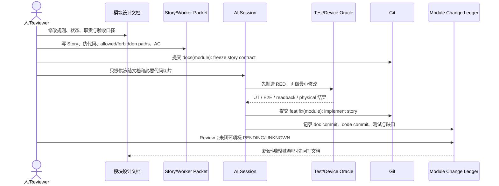

# 文档先行与模块提交协议

这份协议回答一个课堂上的工程化问题：AI 已经能写代码以后，如何让多轮 Session、多模块并行和后续维护仍然可追踪，而不是把关键决策留在聊天记录里。

## 1. 核心规则

任何会改变模块行为、状态、交互、系统调用、数据模型或验收口径的修改，都按下面顺序执行：

```text
模块设计文档 → Story / Worker Packet → 伪代码与 AC → 代码 → 测试 → 提交记录 → 证据回写
```

禁止顺序：先让 AI 大范围改代码，最后再根据实现“补一份看起来合理的文档”。那样文档只能解释结果，不能约束过程。

## 2. 一次模块修改的标准时序



## 3. 推荐提交粒度

一个复杂 Story 最少留下两类提交；设备证据可用时再补第三类：

| 提交 | 目的 | 必须包含 | 不应包含 |
|---|---|---|---|
| `docs(peripheral): freeze S5 global USB transaction` | 冻结设计契约 | 模块设计、Story、伪代码、AC、风险 | 业务实现 |
| `feat(peripheral): implement S5 global USB transaction` | 实现最小闭环 | allowed paths 内代码、对应 UT | 顺手重构其他模块 |
| `test(peripheral): record S5 device evidence` | 回写验收事实 | 系统回读、实物结果、FAIL/PENDING | 修改产品语义 |

文档提交和实现提交可以在同一分支连续完成，但顺序不可反；Reviewer 必须能在代码提交之前找到已冻结的文档版本。

## 4. 每个模块都要有 Change Ledger

模块记录不是提交列表，而是一张可反向追踪的交付卡：

```yaml
module: peripheral/interface-control
story_id: PER-USB-S5-GLOBAL-TRANSACTION
owner: human + ai-session
design_docs:
  - docs/03-模块设计/外设管理组件设计说明.md#全局USB事务
  - case-materials/mdm/04-Feature与Story拆解.md#S5
doc_commit: <git-hash>
implementation_commit: <git-hash>
allowed_paths:
  - services/peripheral/interface-control/UsbGlobalPolicyService.ets
  - services/peripheral/device-policy/UsbDevicePolicyStateService.ets
tests:
  - entry/src/test/peripheral/usb-global-policy-service.test.ets
evidence:
  - UT: PASS
  - restrictions_readback: PENDING
  - physical_usb: PENDING
open_risks:
  - same baseClass impact requires two-device verification
verdict: PARTIAL
```

Ledger 的更新时机：文档提交后建立记录，代码提交后填 commit 和测试，设备验收后更新最终 verdict。不得删除旧 FAIL；新证据追加在同一 Story 记录中。

## 5. 按 AI 容易理解的方式组织代码

目标不是为了 AI 创建特殊架构，而是让“业务能力、责任边界、文件路径和测试路径”使用同一套词汇。

### 5.1 当前外设模块的真实组织

```text
entry/src/main/ets/
├─ views/peripheral/overview/PeripheralPage.ets
├─ components/peripheral/
│  ├─ interface-control/InterfaceControlTab.ets
│  ├─ device-policy/PolicyList.ets
│  └─ connection-record/DeviceRecordList.ets
├─ viewmodels/peripheral/
│  ├─ overview/PeripheralViewModel.ets
│  ├─ interface-control/InterfaceControlViewModel.ets
│  ├─ device-policy/PeripheralPolicyViewModel.ets
│  └─ connection-record/PeripheralRecordViewModel.ets
└─ services/peripheral/
   ├─ interface-control/UsbGlobalPolicyService.ets
   ├─ device-policy/UsbDevicePolicyStateService.ets
   ├─ device-policy/PeripheralDevicePolicyDispatchService.ets
   ├─ device-policy/UsbDevicePolicyStateRepository.ets
   ├─ connection-record/PeripheralConnectionRecordPipeline.ets
   ├─ connection-record/PeripheralTraceMaintenanceService.ets
   └─ connection-record/PeripheralTraceEntryRepository.ets
```

### 5.2 AI 友好的七条约束

1. 目录按业务能力命名：`interface-control / device-policy / connection-record`，不按“临时需求”建目录。
2. RFC、Story、类名、测试名使用同一术语；不要在文档写“黑名单状态服务”，代码却叫 `Helper2`。
3. 一个公开入口对应一个主要责任；事务放 Service，系统差异放 Adapter/Dispatch，持久化放 Repository。
4. View 只提交用户意图，不直接修数据库、调用 MDM 或补偿事务。
5. 公共方法先表达业务顺序，复杂细节下沉到私有函数，使 AI 能先读 30–80 行获得调用骨架。
6. 测试目录与能力目录同名，Story 的 RED 能通过 `rg story-id / class / test` 快速定位。
7. 避免无业务语义的 `utils/common/misc` 扩张；共享代码必须有稳定契约和清晰 Owner。

## 6. Review Gate

合并前逐项回答：

- 文档提交是否早于实现提交？
- Story 是否包含伪代码、失败分支、allowed/forbidden paths 和 AC？
- 代码路径是否与模块能力和 RFC 用词一致？
- 每个模块是否有 Change Ledger，能追到 doc commit、code commit、测试和证据？
- 新反例是否先修改文档，再触发下一轮代码修改？
- 系统/实物证据缺失时，是否诚实标记 `PENDING/UNKNOWN`？

只有这些问题都能回答，AI 的“完成”才变成团队可复查、可接力、可继续演进的工程提交。
