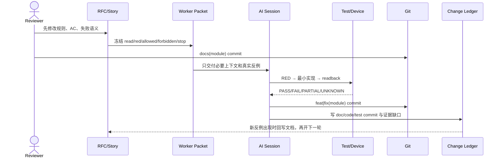

# MDM 外设案例｜S1–S8 Worker Packet 与模块变更账

这份文档补齐两个此前分散的信息：每个 Story 到底允许 AI 读什么、改什么、如何制造 RED、如何验收；每个模块如何记录文档提交、实现提交、测试与证据缺口。它不是新的需求来源，需求语义仍以 `03-外设管理MVVM与策略RFC.md` 和 `04-Feature与Story拆解.md` 为准。

> 核对基线：2026-09-02 本地 `security_tool`。下文的 commit 是历史实现锚点，只证明代码演进来源；旧提交未必遵循“文档先行”。新任务必须执行 `14-文档先行与模块提交协议.md`。

## 1. 一张表看懂八个工作包

| Story | 能力模块 | 主入口 | 最早 RED | 主要测试 | 历史锚点 | 当前证据结论 |
|---|---|---|---|---|---|---|
| S1 | `device-policy/identity-state` | `UsbDeviceIdentityResolver.resolve()` | 同一设备 attach/detach 得到不同 fingerprint | `usb-device-identity-resolver.test.ets` | `63dda4b4` | D2/D3 PASS；启动在线对账 PENDING |
| S2 | `device-policy/default-policy` | `PeripheralDevicePolicyRepository.setUsbDefaultPolicy()` | 切默认值误改已有设备 | `device-policy-repository.test.ets` | `8e252bf0`、`a2f0128b` | D2/D3 PASS；专用 UI Case PENDING |
| S3 | `connection-record/first-connect` | `UsbDevicePolicyStateService.handleConnect()` | 默认 allow 设备未进入管理状态 | `usb-device-policy-state-service.test.ets` | `63dda4b4`、`f95c5109` | D2/D3 PASS；D6/D7 PENDING |
| S4 | `device-policy/dynamic-rule` | `UsbDevicePolicyStateService.setPolicy()` | MDM 失败但 UI/RDB 已提交 | `PeripheralPolicyViewModel.test.ets` | `63dda4b4`、`f95c5109` | D2/D3 PASS；**[需用户补充 U05]** 同 baseClass 实物矩阵 PENDING |
| S5 | `interface-control/global-usb` | `UsbGlobalPolicyService.setDisabled()` | suspend 或全局下发失败后未补偿 | `usb-global-policy-service.test.ets` | `6e7702cd`、`0d26c92e` | D2/D3/D5 PASS；D6/D7 PENDING |
| S6 | `interface-control/storage-conflict` | `PeripheralService.setUsbStoragePolicyWithCleanupResult()` | `9200010` 与 `9200007` 被归为同一失败 | 两个 ViewModel 测试 | `f95c5109` | 冲突日志已有；部分生效闭环 PARTIAL |
| S7 | `device-policy/restore` | `UsbDevicePolicyStateService.clearAllPolicies()` | 只改本地 allow，EDM 残留未清 | State Service + Policy VM 测试 | `23c4a046` | D2/D3/D5 PASS；系统清理回读 PENDING |
| S8 | `evidence/acceptance` | `06-测试验收报告.md` | E2E PASS 被误写成设备 PASS | E2E JSON + 验收矩阵 | workshop `22b1137` | D1–D5 可用；完整 D6/D7 PENDING |

## 2. 所有 Worker Packet 的共同约束

每个 Packet 至少包含下面八项，缺一项不得交给新 Session：

```yaml
story_id: Sx
goal: 一个可独立证明的业务能力
read_first: RFC + Story + progress + 必要代码切片
red: 修改代码前必须先失败的测试或反例
allowed_paths: 本轮允许修改的最小路径集合
forbidden: 明确不能顺手改的层和模块
acceptance: AC + 独立 oracle + 失败语义
stop: 需要重新设计、缺权限或缺系统观察能力时停止
```

共同不变量：`global > explicit desired > default`；USB 存储策略是并行类型策略；系统成功后才提交本地执行态；UI、本地状态、MDM 回读和实物行为不能互相替代。

## 3. S1｜USB 身份与状态真源

### Goal 与阅读顺序

- Goal：稳定识别 USB 资产，并把长期意图、在线态、执行态分开保存。
- Read first：RFC §5.3、§6.2、§9；Story S1 与 §4.9；`13-本地Session真实问题证据卡.md` 的 B、G。
- Code slice：`UsbDeviceIdentityResolver.ets`、`UsbDevicePolicyStateRepository.ets`、`PeripheralConnectionRecordUsbConsumer.ets`。

### RED、修改边界与验收

| 项 | 内容 |
|---|---|
| RED | 无 SN 设备 attach/detach 的 description 轻微变化导致两个 fingerprint；清 trace 后策略状态消失；漏 detach 后仍显示在线 |
| Allowed | Resolver、USB 状态模型/仓储、USB Consumer、同名测试、外设模块设计文档 |
| Forbidden | 不在 View 拼 fingerprint；不把 connection trace 当策略真源；不因离线删除 `desiredPolicy` |
| AC | SN 优先；无 SN 使用弱指纹；Hub 跳过；detach 只改 `present=false`；启动对账缺失时诚实标 PENDING |
| Oracle | Resolver UT、RDB 状态、真实 attach/detach payload、启动 `getDevices()` 对账结果 |

### 模块记录

```yaml
module: peripheral/device-policy/identity-state
story: S1
design: 03-RFC §5.3/§6.2/§9
implementation_history: [63dda4b4]
tests: [usb-device-identity-resolver.test.ets, usb-device-policy-state-service.test.ets]
evidence: {code: PASS, ut: PASS, runtime_reconcile: PENDING}
verdict: PARTIAL
```

## 4. S2｜默认 allow / deny

### Goal 与阅读顺序

- Goal：默认策略只决定“尚未配置的新设备”首次接入行为，不批量重写现有资产。
- Read first：RFC §6.3；Story S2 与 §4.9；计划 `docs/superpowers/plans/2026-05-14-peripheral-usb-default-policy.md`。
- Code slice：`PeripheralDevicePolicyRepository.ets`、`PeripheralPolicyViewModel.setUsbDefaultPolicy()`。

### RED、修改边界与验收

| 项 | 内容 |
|---|---|
| RED | 非法持久化值导致默认 deny；allow→deny 后已有 allow 设备被批量改写；保存失败却通知 UI 成功 |
| Allowed | 默认策略 Repository、Policy VM、Preferences 适配、同名测试、模块设计文档 |
| Forbidden | 不枚举 USB；不调用 MDM deny；不修改已有 `desiredPolicy`；全局 USB 关闭时不允许偷偷保存 |
| AC | 缺值/坏值 normalize 为 allow；持久化成功后才更新内存并通知；已有设备状态前后不变 |
| Oracle | Repository UT、Preferences 前后值、已有设备 RDB diff、专用 UI Case |

### 模块记录

```yaml
module: peripheral/device-policy/default-policy
story: S2
design: 03-RFC §6.3
implementation_history: [8e252bf0, a2f0128b]
tests: [device-policy-repository.test.ets, PeripheralPolicyViewModel.test.ets]
evidence: {code: PASS, ut: PASS, ui_case: PENDING}
verdict: PARTIAL
```

## 5. S3｜首次连接

### Goal 与阅读顺序

- Goal：把 USB 事件转成可信资产状态；默认 deny 只有系统下发成功后才形成 active deny。
- Read first：RFC §9；Story S3 与 §4.9；证据卡 B、C。
- Code slice：`PeripheralConnectionRecordUsbConsumer.ets` → `UsbDevicePolicyStateService.handleConnect()` → State Repository / Dispatch。

### RED、修改边界与验收

| 项 | 内容 |
|---|---|
| RED | 默认 allow 设备能用但没有名单卡；默认 deny 下发失败却生成成功黑名单；已有显式策略被新默认覆盖 |
| Allowed | USB Consumer、State Service/Repository、Dispatch 接口、对应 UT、模块设计文档 |
| Forbidden | 不让 View 监听 USB 事件；不在诊断 trace 中反推策略；不把失败的 deny 写成 active |
| AC | allow 保存 `allow/none/present=true`；deny 成功保存 `deny/deny`；deny 失败不建假黑名单；已有意图优先 |
| Oracle | State Service UT、RDB 行、Dispatch 调用次数、UI 名单卡、MDM 回读与实物插入 |

### 模块记录

```yaml
module: peripheral/connection-record/first-connect
story: S3
design: 03-RFC §9
implementation_history: [63dda4b4, f95c5109]
tests: [connection-record-usb-consumer.test.ets, usb-device-policy-state-service.test.ets]
evidence: {code: PASS, ut: PASS, mdm_readback: PENDING, physical: PENDING}
verdict: PARTIAL
```

## 6. S4｜在线设备动态黑白名单

### Goal 与阅读顺序

- Goal：在线设备规则修改保持“用户意图、系统执行、本地提交”顺序一致，失败不出现假成功。
- Read first：RFC §6.4、§6.5；Story S4 与 §4.9；证据卡 C。
- Code slice：`PolicyList.ets` → `PeripheralPolicyViewModel.setDevicePolicy()` → `UsbDevicePolicyStateService.setPolicy()` → `PeripheralDevicePolicyDispatchService.dispatch()`。

### RED、修改边界与验收

| 项 | 内容 |
|---|---|
| RED | 离线设备仍可编辑；MDM 失败后选择器和 RDB 已变；旧 VID/PID ID 绕过 fingerprint；一台设备的类型规则影响另一台却仍宣称 SN 级隔离 |
| Allowed | Policy VM、State Service、Dispatch、受控选择器、同名测试、模块设计文档 |
| Forbidden | View 不直接写 RDB/MDM；不做无条件乐观更新；不隐藏 baseClass 系统粒度 |
| AC | 仅在线可改；行级防重入；Dispatch 成功后才 upsert；失败保持旧值并返回 reasonCode；影响面进入双设备矩阵 |
| Oracle | VM/Service UT、RDB diff、MDM disallowed types、两台同 baseClass 实物行为 |

### 模块记录

```yaml
module: peripheral/device-policy/dynamic-rule
story: S4
design: 03-RFC §6.4/§6.5
implementation_history: [63dda4b4, f95c5109]
tests: [PeripheralPolicyViewModel.test.ets, usb-device-policy-state-service.test.ets]
evidence: {code: PASS, ut: PASS, same_base_class_matrix: PENDING}
verdict: PARTIAL
```

## 7. S5｜USB 全局禁用与恢复事务

### Goal 与阅读顺序

- Goal：全局闸门切换时暂停/恢复显式 deny，保留长期意图，并对每个失败点补偿。
- Read first：RFC §7、§8；Story S5、§4.9 和原 Worker Packet；计划 `2026-07-11-peripheral-usb-global-control-story.md`。
- Code slice：`InterfaceControlViewModel.toggleInterface()` → `UsbGlobalPolicyService.setDisabled()` → State Service / `PeripheralService`。

### RED、修改边界与验收

| 项 | 内容 |
|---|---|
| RED | suspend 第 N 项失败后前 N-1 项未恢复；全局下发失败但 active deny 已清；恢复后未重放在线 deny；空枚举无限等待 |
| Allowed | Global Service、Interface VM、State Service、对应 UT、模块设计文档 |
| Forbidden | 不改 `desiredPolicy`；不在 View 编排事务；不新增本地 global 镜像替代 restrictions 回读；不无限 sleep |
| AC | 存储必须 READ_WRITE；suspend 失败不开始主操作；主操作失败补偿；恢复使用有界重枚举并重放 present deny |
| Oracle | 编排 UT、restrictions getter、disallowed types、USB 实物行为、`PER-IF-002` 仅作 UI 证据 |

### 模块记录

```yaml
module: peripheral/interface-control/global-usb
story: S5
design: 03-RFC §7/§8
implementation_history: [6e7702cd, 23c4a046, 0d26c92e]
tests: [usb-global-policy-service.test.ets, InterfaceControlViewModel.test.ets]
evidence: {code: PASS, ut: PASS, ui_e2e: PASS, restrictions_readback: PENDING, physical: PENDING}
verdict: PARTIAL
```

## 8. S6｜USB 存储策略冲突与部分生效

### Goal 与阅读顺序

- Goal：区分规则冲突、API 失败、系统已写入但运行态未收敛，不把不同状态压成一个错误 Toast。
- Read first：RFC §6.5、§12；Story S6 与 §4.9；证据卡 D、E。
- Code slice：`InterfaceControlViewModel.setUsbStoragePolicy()` → `PeripheralService.setUsbStoragePolicyWithCleanupResult()`；设备 deny 分支经过 Dispatch 的存储策略读取。

### RED、修改边界与验收

| 项 | 内容 |
|---|---|
| RED | `9200010` 被误报管理员未激活；`9200007` 但 getter 已到目标时 UI 回滚成旧值；存储 DISABLED 仍允许 USB_STORAGE 行编辑 |
| Allowed | PeripheralService、两个子 VM、Dispatch、错误映射、对应测试、模块设计文档 |
| Forbidden | 不只看异常码；不以 UI 状态代替 getter；不吞掉重挂载/重新插拔要求 |
| AC | 冲突返回可行动原因；DISABLED 前后端双重拒绝；error + getter target 标 PARTIAL_APPLIED；物理未收敛不判 PASS |
| Oracle | reasonCode UT、storage getter、hilog mount/unmount、重新插拔结果、`PER-POLICY-002` UI 证据 |

### 模块记录

```yaml
module: peripheral/interface-control/storage-conflict
story: S6
design: 03-RFC §6.5/§12
implementation_history: [f95c5109]
tests: [InterfaceControlViewModel.test.ets, PeripheralPolicyViewModel.test.ets, device-policy-dispatch-service.test.ets]
evidence: {conflict_log: PASS, ui_e2e: PASS, partial_applied_runtime: PENDING}
verdict: PARTIAL
```

## 9. S7｜还原与系统残留清理

### Goal 与阅读顺序

- Goal：先清理 EDM 类型规则，再恢复本地 allow；任何系统清理失败都不伪造本地成功。
- Read first：RFC §11；Story S7 与 §4.9；证据卡 D、H。
- Code slice：`PeripheralPolicyViewModel.clearAllPolicies()` → `UsbDevicePolicyStateService.clearAllPolicies()` → `PeripheralDevicePolicyDispatchService.clearAllUsbDeviceTypePolicies()`。

### RED、修改边界与验收

| 项 | 内容 |
|---|---|
| RED | 本地没有 deny 时按钮禁用，无法清系统残留；EDM 清理失败却把所有卡片改 allow；还原直接删除资产卡 |
| Allowed | Policy VM、State Service、Dispatch、State Repository、同名测试、模块设计文档 |
| Forbidden | 不先改本地再清系统；不删除卡片；全局 USB 禁用时不强行还原 L2 |
| AC | 系统残留可触发入口；先清 EDM；成功后 `desired=allow/active=none` 且保留资产；本地保存失败标可重试中间态 |
| Oracle | State/VM UT、清理前后 disallowed list、RDB 前后值、`PER-BL-USB-001` FAIL→`PER-POL-001` PASS、实物重插 |

### 模块记录

```yaml
module: peripheral/device-policy/restore
story: S7
design: 03-RFC §11
implementation_history: [23c4a046]
tests: [usb-device-policy-state-service.test.ets, PeripheralPolicyViewModel.test.ets]
evidence: {code: PASS, ut: PASS, ui_fail_to_pass: PASS, system_readback: PENDING}
verdict: PARTIAL
```

## 10. S8｜分层证据闭环

### Goal 与阅读顺序

- Goal：让每个业务结论都有适配它的 oracle，缺证据时输出 UNKNOWN/PENDING，而不是把“AI 已完成”当成交付。
- Read first：`00-外设管理证据状态总表.md`、`06-测试验收报告.md`、`12-附录E外设验收手册.md`、`evidence/mdm/peripheral-e2e-summary.md`。
- Execution slice：UT → build → E2E JSON → MDM getter → hilog → physical → acceptance.md。

### RED、修改边界与验收

| 项 | 内容 |
|---|---|
| RED | build PASS 被汇总成业务 PASS；E2E 只看到 UI 仍宣称 MDM 生效；旧 FAIL 被新 PASS 覆盖；设备缺失时写“基本通过” |
| Allowed | 测试、E2E Case、Reporter、evidence、验收文档、必要的可观测性改动 |
| Forbidden | 不为拿绿色结果改变产品语义；不删除 FAIL；不伪造系统日志、截图或实物结论 |
| AC | D1–D7 分层；每条 Case 有前置/动作/UI/本地/系统/实物/清理；缺必需 oracle 时 UNKNOWN/PENDING；污染时停止后续 Case |
| Oracle | 真实命令、原始 JSON、系统回读、视频/照片、可反向追踪的 acceptance.md |

### 模块记录

```yaml
module: peripheral/evidence/acceptance
story: S8
design: 06-测试验收报告 + 12-验收手册
results: [PER-IF-001, PER-IF-002, PER-POL-001, PER-POLICY-002, PER-BL-USB-001]
evidence: {docs: PASS, code: PASS, ut: PASS, ui_e2e: PASS, mdm_matrix: PENDING, physical_matrix: PENDING}
verdict: PARTIAL
```

## 11. 模块级 Change Ledger 总账

总账不是“八个 Story 都已完成”的宣言，而是告诉 Reviewer 当前能追到哪里、下一张证据应该补在哪里。

| Module | Stories | 设计真源 | 实现历史 | 已有证据 | 开放项 | 当前判定 |
|---|---|---|---|---|---|---|
| `device-policy/identity-state` | S1 | RFC §5.3/§6.2/§9 | `63dda4b4` | Resolver/State UT | 启动在线集合对账 | PARTIAL |
| `device-policy/default-policy` | S2 | RFC §6.3 | `8e252bf0`、`a2f0128b` | Repository UT | 专用 UI Case | PARTIAL |
| `connection-record/first-connect` | S3 | RFC §9 | `63dda4b4`、`f95c5109` | 首连四分支 UT | MDM/实物首次接入 | PARTIAL |
| `device-policy/dynamic-rule` | S4 | RFC §6.4/§6.5 | `63dda4b4`、`f95c5109` | VM/State UT | 同 baseClass 双设备 | PARTIAL |
| `interface-control/global-usb` | S5 | RFC §7/§8 | `6e7702cd`、`0d26c92e` | 编排 UT、UI E2E | restrictions + 实物 | PARTIAL |
| `interface-control/storage-conflict` | S6 | RFC §6.5/§12 | `f95c5109` | 冲突日志、VM UT | `9200007` 三态闭环 | PARTIAL |
| `device-policy/restore` | S7 | RFC §11 | `23c4a046` | UT、UI FAIL→PASS | EDM 清理系统回读 | PARTIAL |
| `evidence/acceptance` | S8 | 测试报告/验收手册 | workshop `22b1137` | D1–D5 | D6/D7 完整矩阵 | PARTIAL |

历史提交只能说明“改过什么”。从现在起，每个 Story 的新记录都必须增加：

```yaml
doc_commit: <docs(module): freeze contract>
code_commit: <feat|fix(module): minimum implementation>
test_commit: <test(module): evidence, optional>
session_id: <local session or task id>
commands: [<exact command>]
artifacts: [<result json>, <log>, <image/video>]
open_risks: [<PENDING/UNKNOWN item>]
verdict: PASS | FAIL | PARTIAL | UNKNOWN | PENDING
```

## 12. 新 Session 接力时序



## 13. 文档完整性检查

- [x] 六阶段每一阶段都有输入、输出和出口门。
- [x] S1–S8 都有 Story 描述和伪代码。
- [x] S1–S8 都有独立 Worker Packet、真实类、测试入口和停止边界。
- [x] 每个能力模块都有 Change Ledger 行和历史实现锚点。
- [x] 文档明确区分业务 fingerprint 与系统 baseClass 执行粒度。
- [x] 文档明确区分 PASS / FAIL / PARTIAL / UNKNOWN / PENDING。
- [x] 文档提交、实现提交、测试提交的顺序和命名已冻结。
- [ ] **[需用户补充 U01–U08]** D6 系统回读矩阵、D7 实物 USB 矩阵和视频；详细要求见 `16-用户补充素材清单.md`。
- [ ] **[工程开放项 E01]** Trace 通知失败分支仍未闭环，不能要求用户用视频替代工程修复。
- [ ] **[工程开放项 E02]** 启动在线态对账仍未实现，不能写成已闭环。

因此，当前文档包已足够支持课堂讲解、代码穿刺和分组实操；尚未完整的是设备证据，而不是方法、任务边界或实现索引。课堂上应把这三项开放事实直接展示出来。
