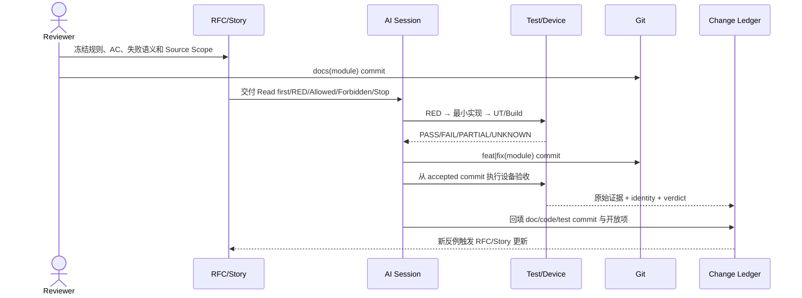

# MDM 外设案例｜模块变更账与 Session 交接

> S1–S8 的 Goal、状态契约、代码落点、伪代码、AC、Stop 和 Done 只以 [04-Feature与Story拆解.md](04-Feature与Story拆解.md) 为准。本文件不复制 Story 内容，只记录已发生的修改、验证身份、开放项和接力状态。

## 1. 记录目的

Change Ledger 不能证明功能正确，它解决三个可追踪问题：

1. 哪个文档提交冻结了哪条规则。
2. 哪个代码提交实现了哪个 Story，实际改了哪些模块。
3. 哪组测试和设备证据能够绑定到同一 accepted commit/runId。

历史提交只作为定位锚点。当前 verdict 必须由原始证据重新判定，不能因为“存在 commit”自动写 PASS。

## 2. 当前模块账

| Module | Story | 设计真源 | 历史实现锚点 | 已有证据 | 开放项 | Verdict |
|---|---|---|---|---|---|---|
| `device-policy/identity-state` | S1 | RFC §5.3/§6.2/§9 | `63dda4b4` | Resolver/State UT | E02 启动在线集合对账 | PARTIAL |
| `device-policy/default-policy` | S2 | RFC §6.3 | `8e252bf0`、`a2f0128b` | Repository UT | 专用 UI Case | PARTIAL |
| `connection-record/first-connect` | S3 | RFC §9 | `63dda4b4`、`f95c5109` | 首连分支 UT | U02 MDM/实物首次接入 | PARTIAL |
| `device-policy/dynamic-rule` | S4 | RFC §6.4/§6.5 | `63dda4b4`、`f95c5109` | VM/State UT | U05 同 baseClass 双设备 | PARTIAL |
| `interface-control/global-usb` | S5 | RFC §7/§8 | `6e7702cd`、`0d26c92e` | 编排 UT、UI E2E | U01 restrictions + 实物 | PARTIAL |
| `interface-control/storage-conflict` | S6 | RFC §6.5/§12 | `f95c5109` | 冲突日志、VM UT | U04 `9200007` 运行态闭环 | PARTIAL |
| `device-policy/restore` | S7 | RFC §11 | `23c4a046` | UT、UI FAIL→PASS | U03 EDM 清理系统回读 | PARTIAL |
| `evidence/acceptance` | S8 | 测试报告/验收手册 | workshop `22b1137` | D1–D5 | U01–U08 的 D6/D7 | PARTIAL |

## 3. 每次修改的固定记录

```yaml
change_id: CHG-MDM-<timestamp>
story: S1 | S2 | S3 | S4 | S5 | S6 | S7 | S8
module: <single capability module>
doc_commit: <docs(module): freeze contract>
code_commit: <feat|fix(module): minimum implementation>
test_commit: <test(module): evidence, optional>
accepted_commit: <commit used for final run>
session_id: <local session or task id>
source_scope:
  allowed: [<exact paths>]
  touched: [<git diff paths>]
commands: [<exact command>]
artifacts: [<result json>, <log>, <rdb dump>, <image/video>]
open_risks: [<PENDING/UNKNOWN item>]
verdict: PASS | FAIL | PARTIAL | UNKNOWN | PENDING
reviewer: <identity or pending>
```

约束：

- `touched` 超出 `allowed` 时，该轮进入 `NEEDS_REPLAN`，不能靠提交说明补授权。
- `accepted_commit` 与 HAP hash、runId 不一致时，设备证据为 `UNBOUND/UNKNOWN`。
- 同一 Story 的新结论必须追加记录，不覆盖产生历史决策的旧 FAIL。
- 生产代码在验收期间发生变化时，旧 run 作废；修复进入新 Story 或新一轮。

## 4. 文档、实现与证据提交顺序



一个模块的推荐提交链：

```text
docs(story) -> test(red) -> feat|fix(minimum) -> test(green/device) -> docs(evidence)
```

不得把多个 Story、临时重构和验收证据混在一个无法独立回滚的提交中。

## 5. 新 Session 接力包

下一 Session 开工前必须得到以下输入：

| 输入 | 必须包含 | 缺失时 |
|---|---|---|
| Story | `04` 中对应完整章节 | 不开工 |
| RFC | 状态/真源/事务/失败语义 | `NEEDS_REPLAN` |
| Last checkpoint | 上轮 first-abnormal、已尝试项、剩余未知 | 不重复盲试 |
| Source identity | repo path、branch、HEAD、dirty status | 证据不能绑定 |
| RED | 命令、fixture、原始失败 | 先建立最小复现 |
| Scope | allowed/forbidden paths | 不扩大修改 |
| Device dependency | 管理员、权限、设备矩阵、清理基线 | 标 `DEVICE_PENDING` |

接力输出固定为：`发生了什么 → 最早异常在哪一层 → 修改了什么 → 哪些证据通过 → 哪些仍未知 → 下一轮唯一目标`。

## 6. 合入前检查

- [ ] `04` 中对应 Story 的状态契约、AC、Stop 与实际实现一致。
- [ ] 模块行为变化已先更新源工程的外设模块设计文档。
- [ ] doc/code/test/accepted commit 与 runId 已登记。
- [ ] `git diff --name-only` 未越过 Source Scope。
- [ ] RED 和 GREEN 都保留原始输出；未覆盖旧失败。
- [ ] D6 系统回读、D7 实物证据缺失时仍为 `PENDING/UNKNOWN`。
- [ ] E01 Trace 通知失败与 E02 启动在线对账仍按工程开放项处理。
- [ ] U01–U08 的采集要求指向 [16-外部证据补充清单.md](16-外部证据补充清单.md)。

## 7. 当前结论

当前方法、代码落点、任务边界和实现索引已具备独立接力条件；设备级证据尚未完整，因此 S1–S8 不能整体升级为 PASS。后续每次变更只追加一条可绑定记录，不再维护第二份简化 Story。
