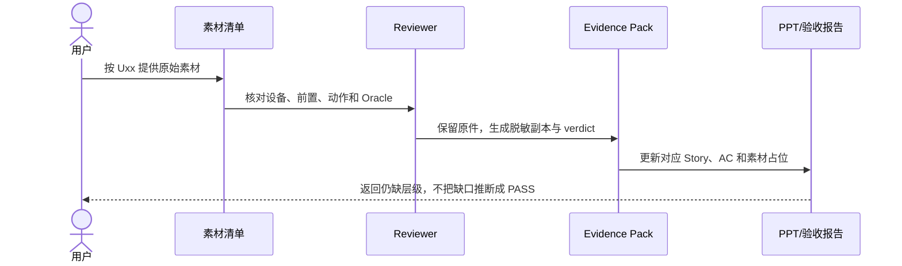

# MDM 外设案例｜用户补充素材清单

这份清单只列“必须由用户提供真实设备、原始录屏或现场日志”的内容。代码截图、文档截面、UT 结果、已有 E2E JSON 和示意图不在此清单内，可以直接从本地仓库生成。

## 1. 标记规则

- **`[需用户补充 Uxx]`**：依赖真机、实物外设、现场系统状态或用户已有原始材料，不能用示意图替代。
- **`[工程开放项 Exx]`**：代码或自动化尚未闭环；应先完成工程修改，再决定是否请用户补拍。
- **`[可本地生成 Lxx]`**：可从仓库、Session、测试结果或现有日志生成，不需要用户提供。

PPT 和 Markdown 中若只写 `PENDING`，必须同时指向一个 `Uxx` 或 `Exx`；这样能区分“在等用户素材”还是“工程自身还没完成”。

## 2. 需要用户补充的素材

| ID | 优先级 | 素材主题 | 最少需要提供什么 | 对应 Story / 验收 | 建议文件名 |
|---|---|---|---|---|---|
| U01 | P0 | USB 全局禁用与恢复 | 一段连续录屏：禁用前设备可用 → 全局禁用 → 名单仍在但不可编辑 → 全局恢复 → 在线显式 deny 重放；同时保留 restrictions/disallowed types 回读 | S5；V4/V5；AC-09/10/11 | `U01-global-usb-transaction.mp4` |
| U02 | P0 | 默认 allow / deny 首次接入 | 两段录屏或一段分章节视频：默认 allow 插入新 U 盘、默认 deny 插入另一新 U 盘；需拍到 UI 卡片、设备行为和 Case ID | S1/S2/S3；V1/V2；AC-03/04/05/06 | `U02-first-connect-allow-deny.mp4` |
| U03 | P0 | 还原策略与 `9200010` 残留 | 还原前后的 EDM disallowed types、页面卡片、操作结果和实物重插；若能复现 `9200010`，保留原始错误和时间点 | S6/S7；V8；AC-13/17 | `U03-restore-edm-residual.zip` |
| U04 | P0 | `9200007` 部分生效 | 同一时间线中的 API 结果、storage getter、Mount/Unmount hilog、重新插拔后的实际读写状态 | S6；V9；AC-18 | `U04-9200007-partial-applied.zip` |
| U05 | P1 | 两台同 baseClass 设备 | 两台设备的 VID/PID/SN/baseClass；A deny 前后 B 的行为；拔出 A 后 B 的行为；系统类型规则回读 | S4；V12；AC-14/21 | `U05-same-baseclass-two-devices.zip` |
| U06 | P1 | 黑名单设备拔出、重插与重放 | deny 设备拔出时的状态、重新插入后的 deny 重放、全局恢复后的再次重放；保留 RDB 与系统回读 | S1/S4/S5；V3/V5 | `U06-deny-detach-replay.zip` |
| U07 | P1 | MDM 下发失败与补偿 | 可控失败的一次完整过程：触发方式、reasonCode、UI 旧值、RDB 旧值、系统状态和重试结果 | S4/S5；V7；AC-07/10 | `U07-mdm-failure-compensation.zip` |
| U08 | P1 | USB 存储 DISABLED 冲突 | 存储设为 DISABLED 后尝试修改 USB_STORAGE 单设备规则；拍到置灰/拒绝提示、系统 getter 与实物行为 | S6；V6；AC-12 | `U08-storage-disabled-conflict.mp4` |

### 建议先补哪几个

第一轮只需要 U01–U04，就能补齐 PPT 最关键的“全局事务、首次接入、系统残留、部分生效”四组证据。U05–U08 适合作为课堂追问、扩展实验或答疑材料，不必阻塞第一版培训。

## 3. 每个素材包的固定内容

建议每个 `Uxx` 建一个同名目录：

```text
Uxx-topic/
├─ README.md        # 设备、系统版本、前置策略、复现步骤、结论
├─ screen.mp4       # 页面 + 实物同屏，或明确分屏时间点
├─ ui.png           # 关键页面静态截图
├─ system.json      # restrictions / storage / disallowed types 等结构化回读
├─ hilog.txt        # 仅保留相关时间窗，必要时脱敏
├─ state.txt        # RDB/状态导出；没有则写 NOT_AVAILABLE
└─ verdict.md       # PASS / FAIL / PARTIAL / UNKNOWN 及原因
```

最低要求：画面或日志里能确认 `Uxx`、时间、设备身份和动作顺序。缺少某一层不要补写推断，在 `verdict.md` 标 `UNKNOWN`。

## 4. 拍摄与脱敏要求

1. 视频开头展示 Case ID，例如 `U03`，避免后期无法确认场景。
2. USB 设备至少记录类型、VID/PID 和是否有 SN；真实 SN 可只保留后四位。
3. 账号、路径、IP、设备序列号和企业信息需要脱敏，但错误码、baseClass、策略值和时间顺序必须保留。
4. 不剪掉失败过程；可以追加成功复测，但不能只保留最终绿色结果。
5. 系统回读与实物行为不一致时，结论写 `PARTIAL`，并保留两份证据。
6. 一个视频只证明一个主要结论；多个场景用章节或单独文件。

## 5. 不需要用户补充的内容

| ID | 可本地生成内容 | 来源 |
|---|---|---|
| L01 | 六阶段文档目录、需求卡、ADR、RFC、Story、Worker Packet 截图 | `case-materials/mdm/` |
| L02 | 真实代码树、调用链、伪代码、时序图 | `security_tool` 源码与文档 |
| L03 | UT 名称、覆盖范围、历史提交 | `entry/src/test` 与 Git 历史 |
| L04 | E2E 旧 FAIL→新 PASS 对照 | `evidence/mdm/peripheral-e2e-summary.md` 与结果 JSON |
| L05 | MCP/E2E 架构示意图、证据阶梯和 Change Ledger 图 | 当前 PPT/Markdown，可重新绘制 |

这些内容不应再写“请用户补充”，由材料维护者直接生成即可。

## 6. 工程开放项，不应转嫁给用户

| ID | 工程开放项 | 当前状态 | 完成后是否还需用户素材 |
|---|---|---|---|
| E01 | Trace 已写入、后续维护失败时仍立即 `notifyChanged()` | FAIL/OPEN | 完成后需要一次真机/设备侧验证，但先由工程修复 |
| E02 | 应用未运行时拔出，启动后用 `getDevices()` 对账 `present` | OPEN | 完成后需要离线拔出/重启验证，但先由工程实现 |
| E03 | `9200007 + getter 已到目标` 的正式 PARTIAL_APPLIED 契约与自动化 | PARTIAL | U04 可先提供历史证据，最终仍需工程测试闭环 |

PPT 遇到 E01–E03 时标记 **`[工程开放项]`**，不要标记成 **`[需用户补充]`**。

## 7. 素材交付后的处理流程



用户只需要按 Uxx 交付素材；材料维护者负责整理、脱敏、截图、落版和回写验收结论。
