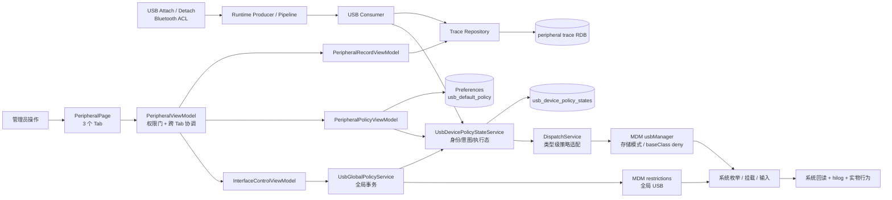
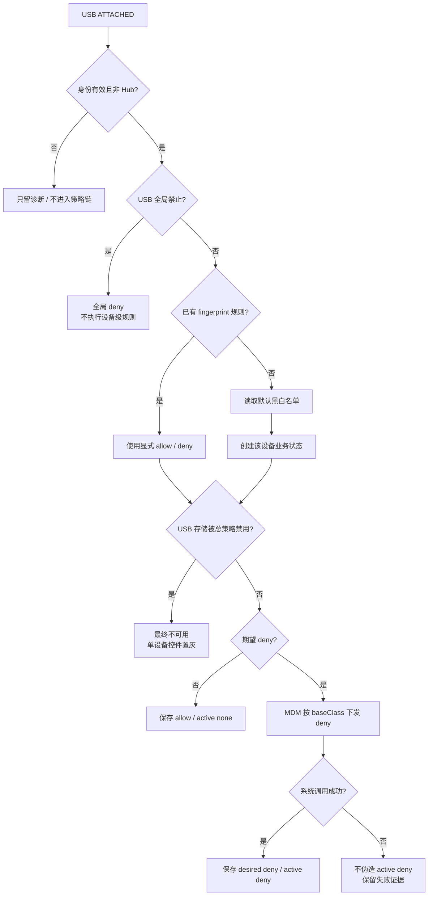
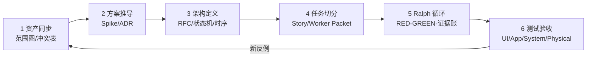

# MDM 外设管理案例｜六阶段交付包

这个案例不是“让 AI 写一个 USB 开关”，而是展示如何把一个存在多层策略、系统真源、失败补偿和动态状态的复杂需求，收敛成可以开发、循环和验收的工程交付。课堂从一个真实现象进入：页面只有几个选择器，但一次“允许/禁止”会同时穿过页面状态、设备身份、应用规则、EDM/MDM 类型策略、系统重新枚举和真实硬件行为。

## 0. 先冻结课堂口径

本案例以后统一按下面三层讲，不再把“USB 接口”“默认黑白名单”和“单设备规则”混成一个开关：

```text
L1 接口管控（最高优先级）
   └─ USB 全局允许 / 全局禁止，作用于所有 USB 外设

L2 单设备显式规则
   └─ 已识别 fingerprint 的 allow / deny

L3 黑白名单默认策略（最低优先级）
   └─ 只兜底尚未配置的新设备
```

USB 存储的“读写 / 只读 / 禁止访问”是一个并行的类型策略。它不是 L1–L3 中的第四种名单，却会覆盖 USB 存储设备的最终可用性，因此必须单独展示和验收。

规则可以写成一个可执行判定式：

```text
if usbGloballyDisabled:
    effective = deny
elif explicitDevicePolicy exists:
    effective = explicitDevicePolicy
else:
    effective = usbDefaultPolicy

if deviceType == USB_STORAGE and storagePolicy == DISABLED:
    effective = storage_disabled
```

这条口径回答了三个课堂上必须说清的问题：

1. 全局禁止后，单设备白名单不能穿透。
2. 全局允许后，已配置设备按自己的规则，不再受默认值变化影响。
3. 默认黑/白名单只处理“还没有单设备规则的新设备”。

## 主线问题

企业管理员需要统一管理 USB 等外设，同时允许按设备维护黑白名单。看似只有几个开关，实际至少有四类状态：

- 设备级 USB 全局总控；
- USB 存储访问模式；
- 单设备显式 `desiredPolicy`；
- 未见过设备的默认策略。

如果 AI 没有先定义优先级、真相源和失败语义，很容易出现“页面显示允许但系统仍拒绝”“全局恢复后黑名单丢失”“默认策略误伤已有设备”“失败后 UI 假成功”等问题。

## 案例全景｜外设运行框架



这张图要讲的不是“项目有很多类”，而是四种事实不能互相代替：

- View 事实：用户看到了什么、控件是否可操作。
- App 事实：默认值、`desiredPolicy/present/activePolicy` 保存了什么。
- System 事实：restrictions、storage policy、disallowed USB types 真正是什么。
- Physical 事实：设备是否枚举、挂载、输入或被拒绝。

## 规则框架｜一次设备接入如何判定



注意：fingerprint 是业务身份，`baseClass` 是当前 MDM 执行粒度。两者不相等，正是本案例最重要的工程风险之一。

## 阅读顺序

| 阶段 | 产物 | 回答的问题 |
|---|---|---|
| 证据入口 | [00-外设管理证据状态总表.md](00-外设管理证据状态总表.md) | 现在到底有什么证据、还缺什么 |
| 1 资产同步 | [01-资产同步与冲突清单.md](01-资产同步与冲突清单.md) | AI 如何快速理解复杂模块且不炸上下文 |
| 2 方案推导 | [02-方案推导与决策记录.md](02-方案推导与决策记录.md) | 为什么选三层策略与意图/执行态分离 |
| 3 架构定义 | [03-外设管理MVVM与策略RFC.md](03-外设管理MVVM与策略RFC.md) | MVVM 怎么落到真实类、状态和调用链 |
| 4 任务切分 | [04-Feature与Story拆解.md](04-Feature与Story拆解.md) | 如何拆成可独立验收的 Story |
| 5 循环开发 | [05-Ralph迭代运行账.md](05-Ralph迭代运行账.md) | 每一轮如何发现问题、修复并留下外部记忆 |
| 6 验收 | [06-测试验收报告.md](06-测试验收报告.md) | 怎么判断 AI 是对的，不对怎么办 |
| 课堂页稿 | [07-PPT第9-25页内容与备注.md](07-PPT第9-25页内容与备注.md) | 后续 PPT 第 9–25 页如何落版 |
| 源码穿刺 | [08-代码级调用链与课堂穿刺.md](08-代码级调用链与课堂穿刺.md) | 现场从 UI 一路走到 MDM 和状态库 |
| 整体审阅 | [09-MDM案例整体审阅与落版规则.md](09-MDM案例整体审阅与落版规则.md) | 哪些能讲、哪些必须留空 |
| Session 证据卡 | [13-本地Session真实问题证据卡.md](13-本地Session真实问题证据卡.md) | 每个真实问题的现象、调用链、证据与截图位 |

六阶段不是六份互不相干的说明，而是一条连续交付链：



每阶段的出口都会成为下一阶段的输入；反例若推翻了规则，必须回到文档修改，再继续代码，而不是只在当前 Session 里口头解释。

## 核心规则一句话

```text
effectivePolicy(device) =
  USB 全局禁用             -> deny
  否则设备已有 desiredPolicy -> desiredPolicy
  否则                     -> usbDefaultPolicy
```

全局总控只覆盖“当前有效结果”，不改写设备意图；默认策略只作用于首次出现且没有显式规则的设备；任何系统下发失败都不得被保存成已生效。

## 真实问题索引｜不是编造的教学例子

以下问题均来自本地开发 Session、真实代码、设备日志或系统数据库检查，后续六阶段会分别展开：

| 现象 | 最早错误判断 | 实际根因 | 改变了什么 |
|---|---|---|---|
| “USB 接口禁用”后设备仍能使用 | 页面刷新慢 | 当时入口只写 `usb_default_policy`，根本不是全局总控 | 拆开 L1 全局与 L3 默认 |
| 默认 allow 设备不出现在名单 | allow 不需要下发，所以不必记录 | 把“无需执行 deny”误当成“没有业务资产” | allow 也建 `desired=allow/active=none` |
| 一台键盘 deny 后鼠标也异常 | fingerprint 算错 | 系统实际按 `baseClass=3` 禁止整类 HID | 业务身份与执行粒度分开验收 |
| USB 接口已启用，存储策略仍报 `9200010` | 管理员未激活 | EDM 残留 `disallowed_usb_devices` 与存储策略冲突 | 还原必须读取并清理系统残留 |
| “只读→读写”返回 `9200007` | 策略没有下发 | 参数已改成读写，但卷重新挂载失败，属于部分生效 | 结果从二态改为成功/部分生效/失败 |
| 连接记录已入库，页面切 Tab 才出现 | ArkUI 一定会自动感知 RDB | 写入后的维护链可能失败，通知没有及时发出 | 写入提交与维护副作用分开 |
| 设备拔出后名单仍像在线 | 选择器禁用逻辑坏了 | `present=true` 依赖事件，错过 detach 后没有启动对账 | 增加在线真源与恢复对账验收 |

这些问题的共同点是：AI 最初给出的解释都“听起来合理”，但只有调用链、数据库、错误码、系统日志和实物行为能决定哪一个解释是真的。

## 课堂统一读法

每一阶段都按四问展开：

1. 怎么做：AI 读取什么、生成什么、调用什么。
2. 怎么判断：用哪个独立 oracle 判断正确。
3. 不对怎么办：回退、补偿、重试还是升级人工。
4. 证据在哪里：文档、代码、UT、E2E、系统回读还是实物视频。

## 事实边界

- 当前工程代码和模块设计是 As-Is 真源。
- 旧计划文档只用于说明方案演进，不能覆盖当前代码事实。
- E2E PASS 只能证明它断言的 UI/操作事实。
- 完整 USB 实物矩阵尚未形成证据包，相关页面必须保留 `PENDING` 视频与系统回读位。

源工程：`C:\Users\mu\Desktop\code\security_tool`
