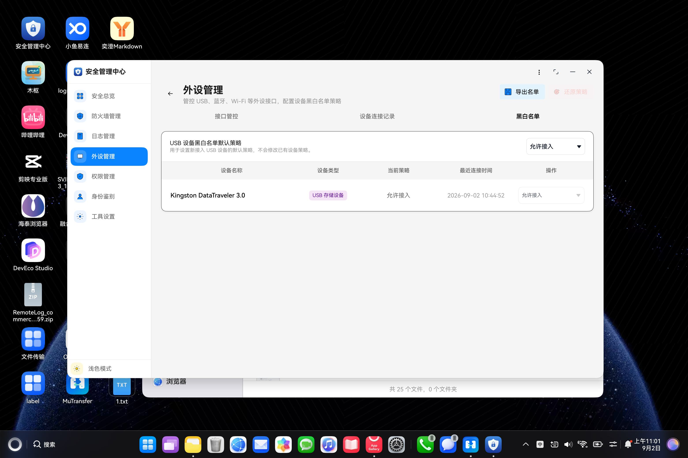

# 外设管理 E2E 结果摘要

最新真实运行：2026-09-02。完整归档见 [`e2e-runs/2026-09-02-peripheral-real`](./e2e-runs/2026-09-02-peripheral-real/README.md)，原始 JSON 是结论真源。

## 最终结论

| 项目 | 结果 |
|---|---|
| 真实设备 | `HAD-W32` |
| 应用 | `com.huawei.securitytool 1.0.7` |
| 执行后端 | `real_bridge` |
| 完整套件 | `8 PASS / 0 FAIL / 0 UNKNOWN` |
| 执行时间 | 2026-09-02 10:51:40—11:01:24（Asia/Shanghai） |
| 原始结果 | [`02-final-pass`](./e2e-runs/2026-09-02-peripheral-real/02-final-pass/) |
| 测试资产看板 | 44 条总用例；外设 8 条均为 `implemented + PASS + partial` |

| Case | Status | 关键步骤 | 结论边界 |
|---|---|---|---|
| `PER-IF-001` | PASS | launch → 外设管理 → 接口管控 → USB 接口可见 | 页面/文本可见 |
| `PER-IF-002` | PASS | 接口管控 → USB 选择器交互 → 恢复 → 行仍可见 | UI 操作与页面回显 |
| `PER-REC-001` | PASS | 设备连接记录 → 导出记录可见 | 记录页入口可见 |
| `PER-POL-001` | PASS | 黑白名单 → 还原策略可见 | 策略页入口可见 |
| `PER-POLICY-002` | PASS | 存储只读交互 → 恢复允许 → 行与策略可见 | UI 操作与页面回显 |
| `PER-USB-001` | PASS | 黑白名单 → USB 默认策略选项可见 | 默认策略入口可见 |
| `PER-WL-USB-001` | PASS | 黑白名单 → 导出名单可见 | 名单页入口可见 |
| `PER-BL-USB-001` | PASS | 黑白名单 → 还原策略可见 | 策略页入口可见 |

## 真实问题处理证据

第一次运行是 `0 PASS / 8 FAIL / 0 UNKNOWN`，8 条都失败在 `open_peripheral_manage`。UI 树已找到侧栏节点，但桥接调用的是旧 MCP 动作名；本机 `harmonyos-dev-mcp 0.9.1` 已改为新动作名。桥接兼容修复提交为 `a3f2023e60fbaecd5260b3ec4d179361866fecc7`。

这组证据适合课堂讲清楚：

1. 失败首先说明“验收链路没有闭环”，不自动等于产品缺陷；
2. 要从 failure stage、UI 树、MCP 工具清单逐层定位；
3. 先单条复验，再跑完整回归；
4. 最终 PASS 不能覆盖第一次 FAIL，两轮原始证据都要保留。

第一次失败证据见 [`01-initial-fail`](./e2e-runs/2026-09-02-peripheral-real/01-initial-fail/)。

## 真机截图

截图显示 `Kingston DataTraveler 3.0` 已被识别，USB 默认策略和设备当前策略均回显为“允许接入”。

## 测试资产看板为什么直接打开没有数据

`test-assets-dashboard.html` 会请求 `/api/catalog`，必须由 `python scripts/e2e/tools/test_assets_server.py` 提供接口。用 `file://` 直接打开只有页面壳，没有 API 数据；应访问 `http://127.0.0.1:8765/`。

看板数据快照已补到 [`dashboard-data`](./e2e-runs/2026-09-02-peripheral-real/dashboard-data/)：当前共 44 条正式用例，外设 8 条全部是 `PASS`，但自动化桥接覆盖仍为 `partial`。这正好可以用于课堂区分“用例跑过”和“证据链完全覆盖”。

## 共同证据边界

本轮证明了真实设备上的 UI 流程、策略交互和页面回显；还没有补齐 USB 物理可用性视频、MDM 系统 readback、重启持久化和三层策略冲突矩阵。因此不能仅凭这 8 条 PASS 宣称“系统层强制策略全部验收完成”。

待补素材已在完整归档中按 `[需用户补充]` 标记。
