# 使用 AI 进阶能力实现较为复杂的需求

> 以真实 HarmonyOS MDM 与 FreeRDP GPU 送显问题为载体，跑通需求拆解、上下文组织、Agent 协作、开发、验证、问题定位与证据交付

> **Rich V5 / 双案例工程闭环版**：保留 39 页与 120 分钟结构，不压缩 V4 的事实、媒体与 Session 证据；重新把“AI 如何完成复杂需求”放回主角位置。案例一用 MDM 跑通需求到验收，案例二基于 55 万行级 FreeRDP 源码，完整演示 CPU 视频卡顿如何经过代码认知、跨平台调研、HarmonyOS 对接、最小穿刺、任务拆解、开发排障和设备验收收口。

## 课程定位

这不是“AI 提示词技巧课”，也不是项目复盘。课程面向已经具备 HarmonyOS / ArkTS / C++ 基础的新员工，通过两个真实代码库，带着学员完成一次可追踪、可调试、可验收的复杂需求开发。

这里的“进阶”不是提示词更长、模型更贵或 Agent 更多，而是工程师能够驾驭复杂需求里的六类不确定性：需求会分叉、上下文会膨胀、执行链会跨工具、实现会跨会话、结果容易被误判、修改范围可能悄悄扩大。

| AI 进阶能力 | 真实问题先行 | 本课实践动作 | 可检查产物 |
|---|---|---|---|
| 需求澄清与边界冻结 | “全部账号”“自动同步”“回滚”被 AI 自行解释 | 歧义树、EARS、行为矩阵、不变量 | `spec.md` |
| 上下文工程 | 长 Session 反复搜索，换会话后重新猜问题 | 只读勘察、证据索引、按需检索、新会话交接 | `progress.md` + evidence index |
| Workflow / Agent 分工 | 构建安装等固定步骤与开放排障混在一起 | 固定动作走 Workflow，假设选择与最小修改交给 Agent | Task Card + execution trace |
| 工具契约与环境事实 | MCP 返回成功，但设备业务状态没有成功 | 分开 protocol、tool、business、system 四层结果 | tool result + getter/log |
| Eval 与反证 | UI 绿、测试绿或截图正常，但系统事实仍错误 | RED/GREEN、故障注入、状态回读、Trace/Outcome 双审 | `PASS / FAIL / UNKNOWN` |
| 长任务 Harness 与协同 | AI 越界修改、实现者自评完成、交接丢失事实 | 小任务、Git checkpoint、证据包、风险驱动 Reviewer | review verdict + next task |

Anthropic 的公开工程实践在这里充当“方法论参照系”，不是另一套产品教程。本课用真实 Session 解释方法为什么必要，再把抽象原则落到 HarmonyOS 的规格、代码、设备日志、截图、视频和系统 getter 上检验。Academy 的课程模型只轻量参考其“先澄清与迭代、每步都做辨别”的教学节奏，不作为本课主方法论。完整来源、候选文章、工程映射与取舍见附录 I。

每个关键页面都沿用同一课堂结构：

```text
问题现场 → AI 初判 → 反证 → 最小修正 → 验收 → 可迁移规则
```

页面右上角建议固定四个小标签：`能力 / 案例 / 问题 / 产出`。讲师如果只讲了正确做法，却没有让学员看到错误方案为何失败，该页视为未完成。

Agent 组织方式按风险升级，不把“Agent 更多”误当成“能力更进阶”：

| 任务特征 | 默认组织方式 |
|---|---|
| 单文件、强测试、低风险 | 单 Agent + 确定性检查 |
| 构建、安装、日志采集 | 固定 Workflow |
| 多文件、路径未知、需要探索 | Agent 只读勘察 + Task Card |
| 跨进程、事务、权限、GPU 状态 | Planner / Implementer 分离 |
| 高风险或接近模型可靠边界 | 增加独立 Reviewer / Evaluator |

课程主线不是一次瀑布交付，而是两个案例重复同一个受控循环：

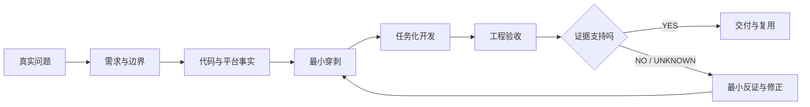

- **MDM 主实践**：Feature-first。先冻结多用户、状态、事务和失败语义，再让 AI 实现。
- **远控第二案例**：Context-first + Evidence-first。先控制 55 万行级代码库的上下文，再研究现有平台契约并映射 HarmonyOS；先让一帧走通硬解，再扩展到生命周期、队列、AVC420/AVC444 和最终验收。
- **MCP 的位置**：不是第三套方法，只负责受控循环中的 Verify——构建、安装、操作、日志、截图和验收取证。

判断 AI 是否正确不靠“它解释得很像”，固定做三层检查：

| 判断层 | 问题 | 合格证据 |
|---|---|---|
| 方案正确 | 是否沿用了协议和成熟平台已经存在的契约，而非重写一套想象中的架构 | 原生调用链、平台 API、Architecture Decision |
| 实现正确 | 代码是否只改变允许边界，并让同一输入在目标路径产生预期状态转换 | diff、单测、构建、路径日志、故障注入 |
| 结果正确 | 用户问题是否在真实设备和同一场景下改善，同时没有破坏回退、交互与稳定性 | before/after、CPU/FPS、真机视频、长稳、回归矩阵 |

任何一层缺证据都不能宣布完成：先标记 `UNKNOWN`，再补一条能推翻当前判断的最小观测；如果证据已经否定方案，就停止扩大修改，回到最近一个可信 checkpoint。

## 学员最终交付

```text
workshop/
├── mdm/
│   ├── spec.md
│   ├── design.md
│   ├── tasks/T01.md
│   ├── progress.md
│   ├── patch.diff
│   ├── acceptance.md
│   └── evidence/
│       ├── unit-test-red.txt
│       ├── unit-test-green.txt
│       ├── build.txt
│       ├── device-log.txt
│       ├── runtime-state.json
│       └── screenshot.png
└── gpu-diagnosis.md
```

最低通过标准：同一条行为必须能够从需求 ID 追踪到设计、不变量、任务、失败测试、最小代码差异和设备证据；设备或系统 getter 不可用时标记 `UNKNOWN`，不能用 UI 文案代替系统事实，也不能把 mock 结果写成 PASS。

## 120 分钟课程结构

| 时间 | 模块 | 学员动作 | 当场产出 |
|---|---|---|---|
| 00–26 | 需求闭合 | 领域建模、歧义选择、EARS、行为矩阵 | `spec.md` |
| 26–70 | 设计与受控迭代 | 真相源、任务卡、RED→GREEN、故障注入 | `design.md`、patch、`progress.md` |
| 70–88 | 平台与验收 | 权限预检、跨进程、MCP 设备证据 | `acceptance.md`、evidence |
| 88–116 | 远控第二案例 | 大库认知、跨平台调研、HM 方案、最小穿刺、任务与验收、开发排障 | codebase map、ADR、spike evidence、`gpu-diagnosis.md` |
| 116–120 | 收束 | 同伴审阅与七问迁移 | 最终交付包 |

每个模块结束固定做一次辨别力检查：**当前结论最可能错在哪里？我们看到的是表面输出、执行轨迹，还是最终系统事实？还缺哪一条证据？**

## 事实标签

材料对代码事实和课堂目标严格分层：

- `CURRENT`：仓库当前代码已经具备，可现场打开验证。
- `SESSION FACT`：真实 Session 中出现过的提示词、判断、日志或用户反馈。
- `GAP`：仓库当前仍存在的风险或未闭合问题。
- `TARGET`：本轮课堂希望设计或实现的能力。
- `TEACHING`：为了教学建立的 FR / D / T 编号，不是仓库既有资产。
- `TEACHING COMPOSITE`：将多个真实问题组合成一条可连续授课的案例，不表示它们在同一次历史执行中同时发生。

## 视觉与 PPT 制作约定

- 画面：16:9，浅灰白技术讲解页 + 深色代码 / 日志舞台。
- 色彩：深海军蓝=结构；蓝=规格；紫=AI / 受控循环；橙红=失败；绿=证据 / PASS。
- 字体：HarmonyOS Sans SC / 思源黑体；代码 JetBrains Mono。
- 页型只使用六种：`CLAIM`、`MAP`、`CODE`、`DEBUG`、`LAB`、`CHECKPOINT`。
- 每页只有一个视觉中心；画面正文建议 250–400 汉字；代码不超过 12 行；大表、提交历史和完整答案进入讲师备注。
- 页脚固定进度带：`需求 ─ 设计 ─ 任务 ─ 代码 ─ 调试 ─ 证据`，只高亮当前阶段。

## 仓库范围

- MDM：`repos/security_tool`
- 远控：`repos/harmony-windows-bridge`
- FreeRDP：`repos/harmony-windows-bridge/harmony/third_party/FreeRDP`
- 测试与验收辅助：`repos/harmonyos-dev-mcp`

---

# 39 页 PPT-ready 讲师稿

## 第 1 页｜今天交付的不是代码，是可信结果

<!--
type: CLAIM
section: OPENING
layout: hero
time: 2m
progress: 需求
-->

### 画面

# 使用 AI 进阶能力实现较为复杂的需求

**从需求拆解、开发、验证，到问题定位与协同闭环**

> 需求 → 规格 → 任务 → 代码 → 调试 → 证据

主视觉建议：左侧是一句模糊需求，中央是紫色受控 AI 循环，右侧是绿色设备证据包；背景只保留真实设备、测试结果和日志的低透明度拼贴。

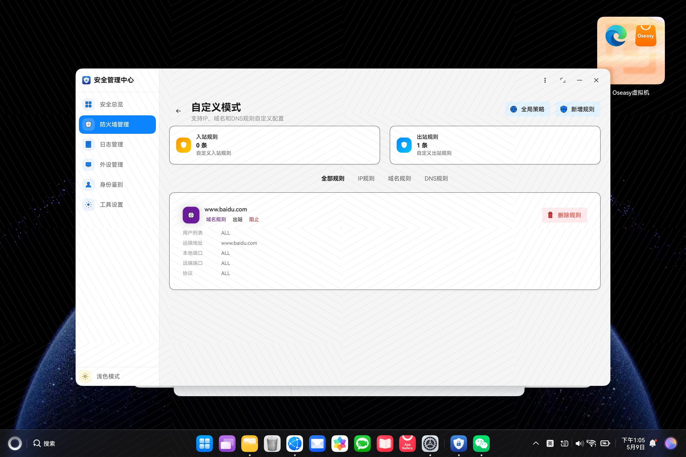

<sub>这张真机图只能证明规则已出现在 UI；它不能单独证明每个账号的系统 policy/rules 已正确下发。开场让学员先说“它能证明什么、不能证明什么”。</sub>

### 讲师备注

开场不要先解释 SDD 名词。先问：“AI 说改完了、单测也过了，但新增账号没有策略，这算完成吗？”让学员明确本课的完成定义不是代码生成，而是系统事实可证明。

课名里的“较为复杂”要在这一页说清楚：不是代码行数多，而是需求存在分叉、状态跨用户与进程、实现跨工具与会话、失败会留下部分状态、最终结果必须由设备事实验证。课名里的“进阶能力”则对应上下文工程、Workflow / Agent 分工、工具调用、长任务记忆、评估反证和协同交接。

两个案例不是为了炫技。MDM 展示复杂业务如何被拆成可实现规格；GPU 展示现象模糊时如何先取证再改。课程结束后，学员应能把方法迁移到任何 HarmonyOS 复杂需求。

### 演示动作

快速展示一组对照：绿色单测输出 + 真机上账号 123 未收敛的日志。此时不解释原因，只留下悬念。

### 通过条件

学员能复述：**AI 输出只是候选变更，测试与设备事实共同决定是否完成。**

### 素材

- MDM 首页真机截图
- 一段单测全绿输出
- 一段账号新增后未收敛的设备日志

---

## 第 2 页｜两小时跑通一条主闭环，再做一次跨域迁移

<!--
type: MAP
section: OPENING
layout: timeline
time: 3m
progress: 需求
-->

### 画面

**MDM 主闭环｜TEACHING COMPOSITE**

> 设备当前处于 `public` 且防火墙已开启，已覆盖账号 `[100,112]`。系统收到 `account-added(123)` 后，先等待账号事实稳定，再把 public policy / preset rules 补到最新账号集合。若账号 123 的第 2 条规则下发失败，必须恢复旧状态，不得保存目标 signature，并留下可回读证据。


### 讲师备注

这条英雄任务由三个真实问题组合：账号快照时序、跨进程事实传播、模式重放失败补偿。课程后面遇到的“已经开启/关闭、重复事件、部分失败、systemRuleId、MCP 回读”都挂到这条主闭环上；第 28–38 页再把同一套控制方法迁移到 GPU 证据诊断，而不是开启一门新课。

冻结课堂语义：

- 新增事件第一次读到 `[100,112]` 不是稳定；直到包含触发账号 123 才可 dispatch。
- public/private 账号集合变化时重放模式；custom 只同步默认 policy，不自动扩大旧自定义规则作用域。
- 模式重放是事务：失败后尝试整体补偿，并重建恢复后的 deployment identity。
- 总开关部分失败不是同一语义，后面专门比较。

### 演示动作

在白板或画布上固定写出 `100 / 112 / 123`，后续所有需求、测试与日志都沿用这三个 ID。

### 通过条件

所有小组使用同一英雄任务，不按模块分组拆散主链。

### 素材

- 账号集合变化示意图
- `FirewallAccountChangeHandler.ets`
- `FirewallModeSwitchService.ets`

---

## 第 3 页｜复杂任务每轮必须留下六类证据

<!--
type: MAP
section: OPENING
layout: loop
time: 3m
progress: 任务
-->

### 画面

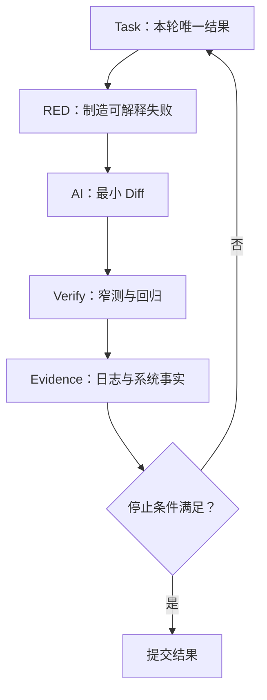

**可选对照图（PPT 制作时与上方 Mermaid 二选一）**


<sub>讲师读图：Agent 不是“连续生成代码”，而是在环境反馈中行动，并在检查点接受人类判断或满足停止条件。图源：Anthropic《Building Effective Agents》。</sub>

每轮写入 `progress.md`：

`假设 / RED 命令与输出 / 修改文件 / GREEN 输出 / 新事实 / 剩余风险 / Stop 或 Next`

### 讲师备注

SDD 负责“要到哪里、边界是什么”；Ralph Loop 是“一次走多远、何时停止”的一种 Harness；MCP 只是 Verify 阶段的执行器。不要把三者画成并列方法，也不要把课程讲成某个模型或框架的使用说明。

停止条件必须可执行：窄测试绿、相关回归绿、diff 在任务允许范围、设备事实与规格一致。权限、签名、设备或 getter 阻塞时，结论是 `UNKNOWN`，记录阻塞并停止，不继续猜测。

**Anthropic 方法锚点**：`Building Effective Agents` 强调 Agent 每一步都要从环境获取 ground truth，并用 checkpoint 与 stopping condition 控制执行；其 Agent 工程最佳实践进一步强调“给 Agent 一个它能运行的检查”，否则它只能在“看起来完成”时停下。本课把这一观点具体化为四级检查：目标 RED/GREEN、相关回归、HAP 构建、真机 getter / 帧级证据。截图是可读信号，但不能替代更强的系统事实。

### 演示动作

展示两份短 `progress.md`：Round 1 解决账号可见性；Round 2 解决模式重放失败补偿。让学员看到“循环真正发生”。

### 通过条件

学员能区分 `PASS / FAIL / UNKNOWN`，并知道 UNKNOWN 不是失败，也不是可以伪装成 PASS。

### 素材

- 附录 D 任务卡模板
- 附录 E `progress.md` 模板

---

# 第一幕：把 MDM 原始需求变成可执行规格

## 第 4 页｜先认识五个对象，再谈“防火墙开关”

<!--
type: MAP
section: MDM_SPEC
layout: domain-model
time: 3m
progress: 需求
-->

### 画面

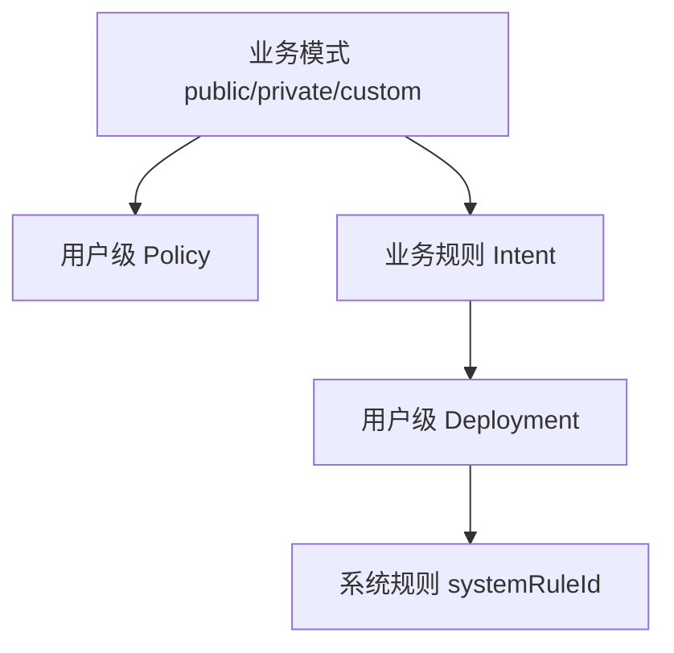

| 对象 | 作用 | 真相来源 |
|---|---|---|
| Account Set | 当前应该覆盖谁 | OS account API |
| Policy | `isOpen` 与默认动作 | MDM system getter |
| Intent | 用户想表达的业务规则 | Local repository |
| Deployment | Intent 在各用户的落点 | Local mapping + system ID |

### 讲师备注

新员工最容易把“账号”当 UI 筛选条件，把一条业务规则直接等同一个系统 rule。实际一条 `FirewallRuleIntent(localRuleId, targetUserIds=[100,123])` 会展开为多个 deployment，每个 deployment 拥有独立 `systemRuleId`。

还要把三个维度拆开：

- `isOpen`：总开关。
- `mode`：默认动作与预置规则策略。
- `rules`：显式规则集合。

提交 `deaf8f27` 的真实故障就是旧实现把模式切换与 `isOpen=true` 绑定，导致“已经关闭，切模式又打开”。它比抽象解释状态分层更适合开场。

### 演示动作

打开 `models/firewall/FirewallModels.ets` 或设计文档，只定位 Intent、Deployment、Policy 三个结构；暂不浏览 UI。

### 通过条件

学员能解释为什么恢复系统规则后，不能继续使用旧 `systemRuleId`。

### 素材

- `entry/src/main/ets/models/firewall/FirewallModels.ets`
- commit `0ad3c1fa`、`deaf8f27`

---

## 第 5 页｜原始需求的问题不是长，而是决定被藏起来了

<!--
type: CLAIM
section: MDM_SPEC
layout: statement-annotations
time: 4m
progress: 需求
-->

### 画面

> 防火墙支持 public / private / custom 三种模式和总开关；面向全部本地账号下发；账号增删后自动同步；处理已经开启/关闭、重复操作、部分失败和页面刷新。

**SESSION FACT｜问题不是一次说清楚的**

> “先不要改，先看看要怎么改，怎么实时拿到账号信息。”

这句话同时冻结了三件事：本轮禁止写代码、当前目标是找到系统事实源、输出必须是方案与验收点。

只高亮四个实现分叉：

1. “全部账号”以事件参数、缓存还是 OS 快照为准？
2. 部分失败时保留成功结果，还是整体回滚？
3. “已应用”由本地 mode、signature 还是系统回读决定？
4. Extension 完成后，UI 如何跨进程获得事实？

### 讲师备注

AI 直接拿到这段话时，往往会自行补齐业务决策：用当前登录账号、对所有失败统一 try/catch、操作成功后直接改 UI、用内存单例通知页面。这些实现都可能编译通过，但不一定是正确产品语义。真实 Session 里，用户先后追问“后面如果还有数据怎么办”“这样可拓展性怎么样”“这个修改感觉是在打补丁”，说明需求澄清不是一次生成文档，而是持续关闭会改变实现路径的分叉。

课程不要求学员一开始知道答案，只要求先把“会导致不同代码路径”的问题列出来。判断标准：不同答案是否会改变状态模型、系统调用顺序、回滚、测试或验收？如果会，就是必须关闭的歧义。

### 演示动作

先只投屏原始需求，让 AI 输出名词、状态、触发器、失败点和待决问题；再揭示 Session 原话，让学员标出新增的权限、目标和停止条件。禁止给代码和架构。

### 通过条件

至少得到 8 个会改变实现的待决问题；没有出现“建议使用 MVVM”之类泛化方案。

### 素材

- 原始需求卡
- 推荐 Prompt：附录 C

---

## 第 6 页｜实践：先让 AI 找分叉，人来冻结语义

<!--
type: LAB
section: MDM_SPEC
layout: four-block
time: 4m
progress: 需求
-->

### 画面

**输入**：英雄任务 + 当前领域对象。

**AI 允许做**：列出实现分叉，并说明每个分叉会影响哪类代码或测试。

**人必须决定**：账号事实、重复操作、部分失败、提交点、UI 展示口径。

**交付**：`spec.md / Open Decisions`，每项只有 `OPEN` 或明确答案。

Prompt 约束：

```text
不要设计方案，不要写代码。
只找会改变状态、调用顺序、补偿或验收的歧义。
每项给出至少两个互斥答案及其工程影响。
```

### 讲师备注

课堂揭晓的核心决定：

- 账号事件只是触发器，OS account snapshot 才是事实。
- `account-added` 当前稳定条件是“快照包含 triggerAccountId”，不是连续两次读取相同。
- 首页总开关写入覆盖全部用户，但展示只读当前/管理用户；这是 `CURRENT`，不是全局一致性证明。
- 模式切换失败整体补偿；总开关部分失败保留成功账号。这两条并不矛盾，因为事务边界由规格决定。
- UI 刷新与业务 reconcile 分离，CommonEvent 传递事实，不承担业务事务。

### 演示动作

2 人一组，3 分钟标记 AI 输出中的“事实问题”和“产品决策”；最后 1 分钟全班冻结课堂答案。

### 通过条件

不允许把仍为 `OPEN` 的高影响问题直接交给 AI 实现。

### 素材

- `AccountChangeCoordinator.ets`
- `FirewallPolicyService.ets`
- commit `c0c1bc9f`、`b8339196`

---

## 第 7 页｜EARS 让一句“自动同步”直接长出测试

<!--
type: CODE
section: MDM_SPEC
layout: before-after
time: 3m
progress: 需求
-->

### 画面

**Before**

> 新增账号后自动同步防火墙。

**After — TEACHING / FR-ACC-001**

```text
WHEN 收到 account-added(123)，
WHILE 当前模式为 public 且 desiredEnabled=true，
THE SYSTEM SHALL 在包含 123 的账号快照上重放模式；
IF 5 次读取后仍不包含 123，
THEN SHALL 不 dispatch、不提交 signature，并记录 timeout。
```

### 讲师备注

EARS 不是为了写得像规范，而是把测试输入、前置状态、动作、结果和失败分支放进同一句话。课堂 ID 是教学资产，明确标注 `TEACHING`，避免学员误以为仓库已有这些编号。

真实实现参数：新增事件会以约 200 ms 间隔最多重试 5 次；到达包含触发账号的快照才 dispatch。删除事件当前只读一次，没有对称等待，这是后续高级 GAP。

### 演示动作

让学员把“重复事件不要重复下发”改写成一条 EARS；答案必须出现排序 signature 和提交条件。

### 通过条件

语句能直接导出至少一个成功测试和一个失败/超时测试。

### 素材

- `account-change-coordinator.test.ets`
- T01 RED 基线：`4b372d0d` + 从 `c0c1bc9f` 提取的目标测试
- commit `c0c1bc9f`

---

## 第 8 页｜行为矩阵先冻结“什么时候回滚”

<!--
type: MAP
section: MDM_SPEC
layout: matrix
time: 3m
progress: 需求
-->

### 画面

| 场景 | 系统动作 | 本地提交 | 失败语义 |
|---|---|---|---|
| 重复开启 | UI no-op | 不变 | 不再写系统 |
| 总开关部分失败 | 全用户 best-effort | 不写 `desiredEnabled` | 成功用户保留 |
| public + 新账号 | 最新快照重放 | 成功后写 mode/signature | 失败整体补偿 |
| 重复 signature | 不重放 | 不变 | 幂等跳过 |

> **不是所有失败都必须回滚；事务边界先由规格决定。**

### 讲师备注

这是整堂课最重要的业务判断。`FirewallPage.handleToggleWithAuth` 处理“已经开/关”的 UI no-op；`FirewallPolicyService.setFirewallEnabledForAllUsers` 自身仍会认证、读取并逐用户写入。不要把 UI 层 no-op 误讲成 Service 幂等。

总开关部分失败时，100/102 成功、101 失败，成功用户不回滚，但 `desiredEnabled` 不保存，结果返回 false。模式切换不同：先快照，失败后恢复 policy/rules/mapping。完整矩阵放附录 B，PPT 只展示四个最能改变实现的场景。

### 演示动作

让学员给“空账号集合”和“custom 新增账号”补两行，只说预期，不写代码。

### 通过条件

任何人都能根据矩阵回答：失败后系统哪些变化保留、本地哪些状态能提交。

### 素材

- `FirewallPolicyService.ets`
- `FirewallModeSwitchService.ets`
- `service.test.ets`

---

# 第二幕：把规格变成 AI 不容易越界的设计与任务

## 第 9 页｜五类状态必须分开，才能定义“已应用”

<!--
type: MAP
section: MDM_DESIGN
layout: state-layers
time: 3m
progress: 设计
-->

### 画面

| 状态层 | 示例 | 能否单独证明成功 |
|---|---|---|
| User intent | `desiredEnabled=true` | 不能 |
| Local apply record | `mode=public, signature=100,112,123` | 不能 |
| System truth | 每用户 policy / rules | 可以作为最终事实 |
| UI projection | 顶部开关、模式文案 | 不能 |

醒目结论：`currentMode=public` **不等于** public 已覆盖最新账号集合。

### 讲师备注

还存在第 5 类“事件/运行态”：trigger、pending、inFlight、retry count。它决定何时开始 reconcile，但不能取代账号事实。

`CURRENT GAP`：`saveModeApplyState` 通过两个独立 `setValue + flush` 保存 mode 和 signature，第二次失败可能形成半提交；快照/回滚也没有完整恢复旧 apply state。课程主任务先把它写入风险清单，不假装已经解决。可作为高级任务把 mode/signature 收敛到单一原子记录。

### 演示动作

给出 `public + signature=100,112`，再新增账号 123，问“当前状态叫什么？”正确答案是模式意图仍为 public，但 apply coverage 已陈旧。

### 通过条件

学员不再用 UI 状态或本地 mode 单独判定系统已应用。

### 素材

- `FirewallLocalRepository.ets`
- `FirewallOverviewViewModel.ets`

---

## 第 10 页｜真相源决定不变量，也暴露当前 GAP

<!--
type: CLAIM
section: MDM_DESIGN
layout: truth-source
time: 2m
progress: 设计
-->

### 画面

**TEACHING：英雄任务的四条不变量**

1. 所有写操作基于一个明确、已记录的账号快照。
2. 模式切换只改变默认动作 / 规则，必须保留旧 `isOpen`。
3. 失败补偿后，本地 deployment 指向恢复后新生成的 `systemRuleId`。
4. 只有系统操作全部成功，才提交目标 mode 与 account signature。

**CURRENT GAP**：系统读取失败不能被当成“系统确实为空”。

### 讲师备注

仓库当前 `FirewallSystemRepository.listRules` 失败时可能回退为 `[]`，本地 mapping 读取失败也可能回退为空。这样所谓“完整快照”无法区分真实空集合与读取失败，后续 clear 可能产生破坏性动作。

因此课堂设计要增加 snapshot validity：每个 truth source 必须返回 `OK(value)` 或 `ERROR(evidence)`；只要关键读取失败，事务在写入前终止。不要让 AI 用 `catch { return [] }` 把未知变成事实。

### 演示动作

让 AI 搜索所有返回空数组的 catch 分支，并按“真实空 / 降级空 / 错误被吞”分类；此轮禁止改代码。

### 通过条件

设计文档明确列出：事实源、失败表达、写入前置条件、禁止的 fallback。

### 素材

- `FirewallSystemRepository.ets`
- `FirewallLocalRepository.ets`
- `FirewallModeSwitchService.createSnapshot`

---

## 第 11 页｜进程边界比类图更早决定设计

<!--
type: MAP
section: MDM_DESIGN
layout: architecture
time: 3m
progress: 设计
-->

### 画面

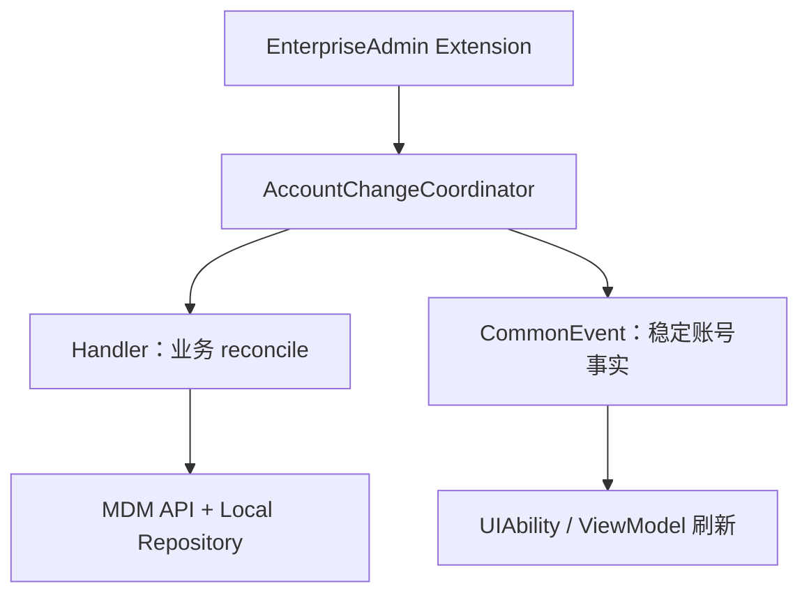

- Extension 与 UI 不是共享内存。
- CommonEvent 负责跨进程通知，不负责事务。
- UI / ViewModel 的互斥只保护 UI 入口，不是全局 writer lock。

### 讲师备注

提交 `53751b2e` 将协调器改为 handler registry；`cecf6d17` 让稳定账号事实即使某个 handler 失败也继续发布，避免一个业务消费者阻断整个 UI 刷新链。

必须指出真实边界：`FirewallPage` / `FirewallOverviewViewModel` 的模式与开关互斥，只覆盖 UI 进程；Extension 触发的 account reconcile 与 UI 操作之间仍没有全局写串行器。这是 `CURRENT GAP`，不能说“Coordinator 已串行所有写操作”。

### 演示动作

打开 Extension、Coordinator、EntryAbility 三处代码，先用历史已有的 `accountId / signature / process` 标注日志位置，再让学员补设计跨进程 `eventId`；明确后者是遥测改进，不是历史已有字段。

### 通过条件

学员能回答：业务处理失败后为什么仍可能需要发布账号事实，以及 UI lock 为什么不能防止 Extension 并发写。

### 素材

- `AccountChangeCoordinator.ets`
- `FirewallAccountChangeHandler.ets`
- commit `53751b2e`、`cecf6d17`、`f6886182`

---

## 第 12 页｜一行追踪关系，限制 AI 只改必要边界

<!--
type: MAP
section: MDM_DESIGN
layout: traceability
time: 3m
progress: 设计
-->

### 画面

| 需求 | 设计决定 | 实现锚点 | 验证证据 |
|---|---|---|---|
| FR-ACC-001 | 新增账号必须等 trigger 可见 | `loadStableSnapshot` | RED/GREEN + retry log |
| FR-MODE-002 | 模式失败整体补偿 | `rollbackToSnapshot` | fault injection + getter |
| FR-ID-001 | 恢复后重映射 ID | `remapDeployments` | mapping 与系统 ID 对齐 |

页尾：**追踪矩阵不是文档装饰，它决定下一轮 AI 可以碰哪里。**

### 讲师备注

课堂只展示英雄任务三行；完整追踪矩阵放附录。每一行必须能回答：为什么改、哪个边界负责、先看到什么失败、最后用什么事实验收。

不允许“为了更优雅”同时重构 ViewModel、Repository、Service。若失败首先发生在 snapshot 时序，本轮文件边界就只允许 Coordinator 与对应测试。设计的价值之一，是帮 AI 拒绝无关改动。

### 演示动作

让学员选 FR-ACC-001，圈出允许修改的两个文件和明确禁止的 UI / Store 文件。

### 通过条件

一条需求可以顺向追到证据，也能从一个 diff 反向说明它服务哪个需求。

### 素材

- 附录 C 设计模板
- 附录 D 任务卡模板

---

## 第 13 页｜实践：先做只读勘察，不让 AI 猜代码

<!--
type: LAB
section: MDM_DESIGN
layout: four-block
time: 4m
progress: 任务
-->

### 画面

**T00 / Read-only Exploration**

**输入**：FR-ACC-001、仓库根目录、英雄任务。

**只允许**：搜索入口、调用链、真相源、写入点、提交点、测试和历史提交。

**禁止**：修改生产文件；凭命名推断行为；给出未经代码支持的 API。

**输出七项**：

`入口 / 事实源 / 副作用 / commit point / 现有测试 / 相关提交 / Spec Gap`


<sub>讲师读图：把上半段“Clarify / Refine”对应需求拆解，把下半段“Search / Write / Test”对应开发验证；两段之间传递的是收敛后的上下文，不是整段聊天。图源：Anthropic《Building Effective Agents》。</sub>

### 讲师备注

这是 AI 使用中最省返工的一步。推荐让 AI 先用 `rg` 找符号，再读最短调用链，再用 `git log -S` / `git show` 解释为什么代码现在这样。提交历史是证据，不是课程结构。

英雄任务的真实入口包括：`AccountChangeCoordinator.loadStableSnapshot/runOnce`、`FirewallAccountChangeHandler.handle`、`FirewallModeSwitchService.createSnapshot/applyModeToUsers/rollbackToSnapshot/remapDeployments`。

**Anthropic 方法锚点**：Anthropic 的 Agent 工程实践建议将 Explore、Plan、Implement 分开，避免在尚未理解代码时直接解决错误问题。T00 就是这个原则的 HarmonyOS 版本：勘察轮次保持只读，输出必须引用文件、函数、测试和历史提交；冻结 Spec Gap 与修改边界后，再用干净的实现轮次执行任务。探索过程可以很宽，但交给实现轮次的上下文必须收敛。

### 演示动作

现场运行一次只读 Prompt；若 AI 输出了不存在的 `firewall.get_runtime_state`，当场标红并要求提供定义位置。

### 通过条件

输出中的每个函数、测试和能力都能在仓库中定位；未知项标记 GAP，不得编造。

### 素材

- `repos/security_tool`
- commit `94ff17e7`、`c0c1bc9f`、`0b5edc5f`

---

## 第 14 页｜任务卡只允许一个可观察结果

<!--
type: CODE
section: MDM_DESIGN
layout: task-card
time: 2m
progress: 任务
-->

### 画面

```text
T01 — account-added 等到 trigger 可见
Requirement: FR-ACC-001
Allowed: AccountChangeCoordinator + 对应测试
Forbidden: UI、Firewall Handler、Repository
RED: [100,112] → [100,112] → [100,112,123]
GREEN: handler 只执行一次，参数包含 123
STOP: 窄测/回归绿；diff 不越界；progress 已记录
```

> 任务按“可验证依赖”切，不按页面、类或文件数量切。

### 讲师备注

推荐四张任务卡：

- T00：只读勘察。
- T01：新增账号稳定快照。
- T02：模式重放故障与补偿。
- T03：设备验收 getter / evidence contract。

当前生产 `wait()` 使用真实 `setTimeout` 且为私有实现，不能在讲义里伪装成可直接 mock 的测试。课堂有两种诚实做法：使用仓库现有 Hamock 测试结构与短等待；或先把 `Clock / RetryPolicy` 注入作为独立设计任务，再写确定性测试。

**Anthropic 方法锚点**：`Effective Harnesses for Long-Running Agents` 观察到长任务最常见的失败是一次做太多、留下半实现，或看到已有进度后提前宣布完成。其应对方式是一次只推进一个 feature，完成后留下干净状态、Git 记录和 progress。T01/T02/T03 因此不是按页面或类拆分，而是按“一个可观察结果＋一个可执行停止条件”拆分；不得通过删除测试、扩大范围或顺手重构制造假完成。

### 演示动作

学员将一个“实现多用户防火墙”大任务改写成上面的一张 7 行任务卡。

### 通过条件

本轮失败时能明确判断：是任务没完成，还是任务定义越界；不存在“顺便重构”。

### 素材

- `entry/src/test/firewall/account-change-coordinator.test.ets`
- 附录 D

---

# 第三幕：让受控循环真正跑两轮

## 第 15 页｜Round 1：先看见一个解释得通的 RED

<!--
type: CODE
section: MDM_RALPH
layout: test-first
time: 4m
progress: 代码
-->

### 画面

**目标行为**：新增账号事件到达时，旧快照不能进入 handler。

```text
Read #1  [100,112]       → reject
Read #2  [100,112]       → reject
Read #3  [100,112,123]   → dispatch once
```

RED 断言：

- 在第 1、2 次读取后 handler 调用数为 0。
- 第 3 次读取后 handler 调用数为 1。
- dispatch snapshot 包含 123。
- 超时路径不 dispatch、不 publish 旧快照。

### 讲师备注

不要展示一段无法运行的伪 Hamock 代码。现场材料应提前在当前仓库环境中跑过，并保留真实命令与失败输出。测试先失败的原因必须与需求一致，而不是 import、mock 或 SDK 配置错误。

当前实现所谓 stable 不是“两次读取完全相同”，而是新增场景中“包含 triggerAccountId”。`account-removed` 当前读一次即处理；可把“删除事件仍看到 123”作为高级 RED，但不要混进 T01。

### 演示动作

在全模块测试中运行目标用例并保存 `unit-test-red.txt`。真实 RED 是 `expect 1 equals 2`：基线只读一次就 dispatch，而测试要求等到第二次快照出现 123。让学员用一句话解释它与 FR-ACC-001 的关系。

```text
ERROR: Error in should wait until added account appears before dispatching handlers,
expect 1 equals 2
BUILD SUCCESSFUL ...
HVIGOR_EXIT=0
```

这里故意保留 Hvigor 的反直觉输出：命令横幅和退出码看起来成功，目标用例仍然失败。判定必须读取用例级错误或 `test_result.txt`。

### 通过条件

只有目标断言失败；环境错误、编译错误或无关用例失败不能进入实现阶段。

### 素材

- `account-change-coordinator.test.ets`
- commit `c0c1bc9f`
- `evidence/mdm/t01-red-green.md`

---

## 第 16 页｜Round 1：AI 只补最小状态转换

<!--
type: CODE
section: MDM_RALPH
layout: diff
time: 4m
progress: 代码
-->

### 画面

```text
event = account-added(123)
repeat at most 5 times:
  snapshot = readSystemAccounts()
  if snapshot contains 123:
    return VALID(snapshot)
  wait 200ms
return TIMEOUT
```

AI 修改约束：

- 不改 handler 业务。
- 不把 trigger 直接 append 到快照。
- 读取失败与空集合保持可区分。
- timeout 不 dispatch 旧事实。

### 讲师备注

“把 123 加进数组”会让测试绿，却伪造 OS 事实；这正是需要人工审查的 AI 捷径。实现还要考虑协调器已有的 debounce、single-flight 和 pending 语义，不能为一个重试分支破坏全局调度。

**SESSION FACT｜错误方案必须进入课堂**

> “延迟 2S 还是拿不到，你分析得不对吧。”

这句话不是要求把 2 秒改成 5 秒，而是在否定“只是系统数据刷新慢”的假设。让学员回答：延迟改变了等待时间，但是否改变了事实源、进程边界和发布机制？若没有，就不能把继续加延迟称为最小实现。

代码已经存在相应实现，课堂可以采用“遮住关键分支，让 AI 按任务卡补齐”的训练仓，或使用历史提交前的版本。若直接在当前 HEAD 上演示，应改为高级缺口，例如移除事件对称稳定条件。

### 演示动作

让 AI 先输出计划和预计 diff，再允许写；完成后展示实际 diff，只审查状态转换与越界文件。最后运行同一条命令，确认目标用例记录 `result=Success`；覆盖率报告器仍出现的 `00507008` 单独记为工具链 GAP，不能混进本轮业务 GREEN。

### 通过条件

T01 窄测试转绿，相关 coordinator 回归通过，修改文件不超出 Allowed。

### 素材

- `AccountChangeCoordinator.loadStableSnapshot`
- `AccountChangeCoordinator.runOnce`
- T01 GREEN：`c0c1bc9f`
- `evidence/mdm/t01-red-green.md`

---

## 第 17 页｜长任务的记忆写在 progress，不在聊天记录

<!--
type: DEBUG
section: MDM_RALPH
layout: progress-ledger
time: 3m
progress: 调试
-->

### 画面

| Round | 假设 | 证据 | Stop / Next |
|---|---|---|---|
| 1 | 事件先于账号查询可见 | 前两读无 123，第三读出现 | GREEN；进入故障注入 |
| 2 | 模式重放失败会污染 apply state | 用户 123 第 2 条 add 失败 | 回滚后 getter 再判断 |


<sub>讲师读图：左边只优化一次输入；右边每轮都从文档、工具、记忆和历史中筛选上下文。课堂中 `spec + current task + progress + evidence index` 就是右侧 Curation 的具体实现。图源：Anthropic《Effective Context Engineering for AI Agents》。</sub>

`progress.md` 本轮新增事实：

> “稳定”是 trigger 可见，不是连续读相同；删除事件尚无对称等待。

### 讲师备注

每轮至少记录七项：hypothesis、RED command/output、files changed、GREEN command/output、new fact、remaining risk、stop reason。这样换人、换会话或上下文压缩后，AI 仍从事实继续，而不是重新猜一遍。

不要把长聊天复制进 progress。它是外部控制面：一句事实对应一份证据，一条风险对应下一张任务卡。

**Anthropic 方法锚点**：`Effective Context Engineering for AI Agents` 将上下文视为有限注意力预算，目标不是把资料全部塞进去，而是保留能最大化当前任务成功率的最小高信号信息；对长任务，结构化记笔记比保留完整聊天更可靠。因此新会话只加载 spec、当前 task、progress、相关代码和证据索引：保留架构决定、未解决风险、修改文件和验证命令，丢弃重复搜索过程与大段原始工具输出。

### 演示动作

做一次上下文 A/B：A 组获得压缩后的长聊天，B 组只获得 `spec + current task + progress + related files + evidence index`。两组都要在 90 秒内写出下一步、禁止范围和缺失证据，再比较谁引入了更多未经支持的假设。

### 通过条件

另一组只读 `progress.md` 就能复现已完成行为、剩余风险与停止原因。

### 素材

- 附录 E `progress.md` 模板
- `unit-test-red.txt` / `unit-test-green.txt`

---

## 第 18 页｜DEBUG：先找最早异常，不从 UI 倒推

<!--
type: DEBUG
section: MDM_RALPH
layout: log-ladder
time: 3m
progress: 调试
-->

### 画面

**SESSION FACT｜假设阶梯**

| 轮次 | 当前假设 | 新证据 | 判定 |
|---|---|---|---|
| 1 | 系统账号查询只是刷新慢 | 延迟 2 秒后现象不变 | 假设被推翻 |
| 2 | `SystemUserProvider` 没读到新事实 | Provider raw=`[100,114]`，snapshot signature=`100,114` | Provider 读取成立 |
| 3 | 进程内静态状态能通知页面 | Extension 与 UI 位于两个进程 | 传播边界错误 |
| 4 | 接入 CommonEvent 即全部完成 | 卡片刷新，但已有规则和记录未刷新 | 只得到局部 GREEN |

最早异常不是“页面没刷新”，而是：**事实已经产生，但没有跨进程、按职责传播到所有依赖者。**

### 讲师备注

本页优先沿账号主线展示“延迟补丁 → Provider 日志 → 进程边界 → 局部 GREEN”的推理。它训练的是：每轮只保留一个可证伪假设，并明确什么证据会推翻它。

第二个可选案例是提交 `4906f7d3 → 06864339 → 78fca089`：public 规则把可选字段 `remoteIps: undefined` 带进 MDM API，真机 `addNetFirewallRule` 返回 401；随后收敛为只有有效字段才进入 payload，并保留原始错误码供上层映射。这个案例用于说明“最早异常也可能位于 payload 契约”，不要与账号传播根因混成一次历史故障。

平台真实缺少企业管理员能力常见错误码为 `9200001`；201 是权限 / admin 状态类映射之一。课堂不要把模拟错误码当唯一真机事实。

### 演示动作

先给出前两轮证据，让学员选择下一条最小日志；揭示跨进程事实后，再让他们解释为什么 CommonEvent 只带来了局部 GREEN。时间允许时再打开 `FirewallRuleUtils.ets` 的 401 diff 作为迁移练习。

### 通过条件

定位结论能被具体日志、进程事实或系统返回推翻；不能只写“可能是缓存、权限或参数”。

### 素材

- commit `4906f7d3`、`06864339`、`78fca089`
- 账号变化 Session 证据卡（附录 L1）
- `FirewallRuleUtils.ets`
- `FirewallSystemRepository.ets`

---

## 第 19 页｜先由规格决定事务边界

<!--
type: MAP
section: MDM_RALPH
layout: compare-semantics
time: 4m
progress: 设计
-->

### 画面

| 操作 | 当前语义 | 部分失败后 | 本地提交 |
|---|---|---|---|
| 总开关 | Best-effort | 成功账号保持 | 不写 desired |
| 模式切换 | All-or-nothing | 尝试整体补偿 | 不写 mode/signature |
| 新增规则 | Collect-all + rollback | 删除已成功 deployment | 不写 intent/mapping |
| DNS 目标编辑 | Remove + add | 重建旧 DNS | 保存恢复后的新 ID |

### 讲师备注

必须修正两个常见误讲：

1. 当前多用户 Create 会继续尝试全部目标账号、收集失败，再统一回滚；不是“第二个失败就停止第三个”。如果课程要讲 fail-fast，必须标为 TARGET 规格。
2. 不是所有 DNS 相关编辑都 remove+add；只有 `nextIntent.type === RULE_DNS` 走替换。`DNS → IP` 当前走 retained deployment 原地 update，测试 `should update retained deployments in place when editing DNS to IP` 固化了该行为。

这页核心是让学员理解：事务不是统一模板，操作的业务承诺不同，补偿策略就不同。

### 演示动作

让学员分别给总开关与模式切换写一句失败后断言，观察是否错误地把两者都要求 rollback。

### 通过条件

任务卡明确写出“允许保留什么、必须恢复什么、什么时候提交本地状态”。

### 素材

- `FirewallPolicyService.setFirewallEnabledForAllUsers`
- `FirewallModeSwitchService.applyModeToUsers`
- `FirewallRuleMutationService.ets`

---

## 第 20 页｜成功路径先锁住唯一 commit point

<!--
type: MAP
section: MDM_RALPH
layout: transaction-flow
time: 3m
progress: 设计
-->

### 画面

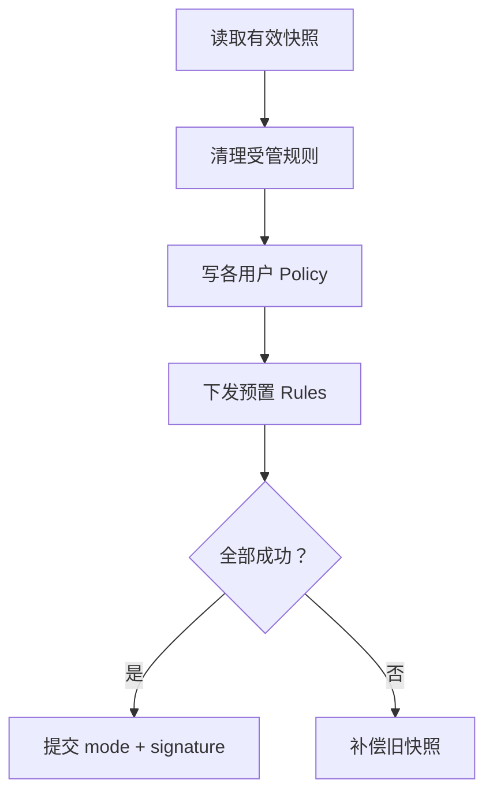

只在绿色节点之后，目标 apply state 才能被持久化。

### 讲师备注

真实 `FirewallModeSwitchService.applyModeToUsers` 已经体现“快照→清理→应用 policy/rules→成功才保存→失败 rollback”。课堂先让学员把成功路径写成测试，再注入失败；不要在同一轮同时生成完整正向与所有回滚分支。

`CURRENT GAP`：mode/signature 双 key 保存不是原子操作，旧 apply state 也未完整进入 rollback。画面保持主流程简洁，备注中必须诚实标出风险。

提交 `deaf8f27` 还证明模式写入必须保留各用户旧 `isOpen`；不要因为目标是 public 就把开关偷偷设为 true。

### 演示动作

打开 `applyModeToUsers`，让学员在代码中标出 read barrier、side effects、commit point 和 compensation entry。

### 通过条件

代码中只有一个可解释的目标状态提交点；任何早于它的本地写都被视为风险。

### 素材

- `FirewallModeSwitchService.ets`
- commit `deaf8f27`、`0b5edc5f`

---

## 第 21 页｜Round 2：在账号 123 的第 2 条规则注入失败

<!--
type: LAB
section: MDM_RALPH
layout: fault-injection
time: 4m
progress: 调试
-->

### 画面

**T02 / Mode transaction fault**

`TEACHING`：这是从真实失败语义抽取的确定性故障注入，不表示同一历史 Session 恰好在账号 123 的第 2 条规则失败。

初始：`public + enabled + users=[100,112]`

目标：重放到 `[100,112,123]`

注入：账号 123 的第 2 次 `addRule` 返回失败。

四个核心断言：

1. 目标 `mode/signature` 不提交。
2. 旧 policy / rules 被尝试恢复。
3. 已新增的目标规则不残留。
4. deployment 指向恢复后新 `systemRuleId`。

### 讲师备注

先列出预期系统调用顺序，再让 AI 写 fault-injection test。测试要覆盖“补偿本身也可能失败”的证据输出，但无需在画面塞满所有断言。

现有 `FirewallFailedItem` 没有结构化 `phase=forward|compensate`，rollback 失败主要靠 `errorMessage` 推断。这是观测性 GAP。建议课堂 TARGET 返回：`userId / operation / phase / originalCode / rollbackCode / localRuleId / systemRuleId`。

### 演示动作

运行 RED；把失败点从第 2 条规则移动到 local save，观察事务期望是否仍成立。AI 只能修改 ModeSwitch 与对应测试。

### 通过条件

测试先红后绿；失败证据能区分 forward 与 compensate；本地没有伪造目标 signature。

### 素材

- `service.test.ets`
- `FirewallModeSwitchService.rollbackToSnapshot`
- commit `0b5edc5f`

---

## 第 22 页｜回滚最难的是 identity，不是把旧对象写回去

<!--
type: CODE
section: MDM_RALPH
layout: identity-remap
time: 3m
progress: 代码
-->

### 画面

```text
Before failure
  intent R1 → user 100 → systemRuleId 8001

Rollback re-add
  old rule 8001 → add again → new systemRuleId 9417

After rollback
  intent R1 → user 100 → systemRuleId 9417
```

> 业务 identity 要稳定；系统 resource identity 允许在补偿后变化。

### 讲师备注

如果只恢复系统规则、不更新 deployment mapping，下一次编辑或删除仍会针对 8001，形成“画面看起来恢复，后续操作全部错位”的延迟故障。

真实代码通过 `remapDeployments` 维护 old→new ID。DNS 目标编辑的 remove+add 也有相同问题；恢复旧 DNS 时，新 add 仍会产生新 ID。最有价值的断言不是“规则数量恢复”，而是本地 mapping 与系统返回的新 ID 一致。

### 演示动作

在测试 fake repository 中让 re-add 返回固定新 ID 9417；故意保留旧 mapping，观察下一次 delete 的目标 ID。

### 通过条件

补偿后立即执行一次 edit/delete 仍能命中真实系统规则；mapping 不是靠旧快照原样写回。

### 素材

- `FirewallModeSwitchService.remapDeployments`
- `FirewallRuleMutationService.applyDnsReplaceUpdateTransaction`
- commit `0b5edc5f`、`76e7f6e6`

---

# 第四幕：让代码越过 HarmonyOS 平台门并形成设备证据

## 第 23 页｜代码正确之前，先过四道平台门

<!--
type: CHECKPOINT
section: MDM_PLATFORM
layout: four-gates
time: 3m
progress: 证据
-->

### 画面

| Gate | 预检问题 | 失败结论 |
|---|---|---|
| SDK / API | 目标 API、API level、类型定义存在？ | BLOCKED |
| Permission / ACL | `ENTERPRISE_MANAGE_NETWORK` 等权限与签名匹配？ | BLOCKED |
| Admin | 企业管理员已激活、应用身份正确？ | BLOCKED |
| Device | 账号、网络、HDC endpoint、包版本可确认？ | UNKNOWN |

页尾：**平台预检失败时不要改业务代码。**

### 讲师备注

多用户账号读取还涉及 `GET_LOCAL_ACCOUNT_IDENTIFIERS`；仓库演进曾经历 activated accounts、权限约束、最终回到系统账号事实源。提交 `8f99fc27` / `9ea957d2` 可用于解释 API 与权限如何共同决定实现。

真机缺少企业管理能力可见 `9200001` 等错误；参数非法常见 401 / 2100001；DNS 冲突场景可见 29400007。不要只显示翻译后的 Toast，要保留原始 code、operation、userId 和 sanitized payload。

### 演示动作

用 MCP 列设备、查询包版本、构建 debug HAP；再在真机上确认 admin 激活和账号列表。任何门失败就写入 `acceptance.md / Preconditions`。

### 通过条件

四道 Gate 全有明确 PASS；无法确认的一项标 UNKNOWN，并停止“业务已完成”的结论。

### 素材

- `entry/src/main/module.json5`
- `SystemUserProvider.ets`
- `harmonyos-dev-mcp/README.md`

---

## 第 24 页｜跨进程事件传事实，业务事务仍留在 Handler

<!--
type: MAP
section: MDM_PLATFORM
layout: sequence
time: 3m
progress: 调试
-->

### 画面

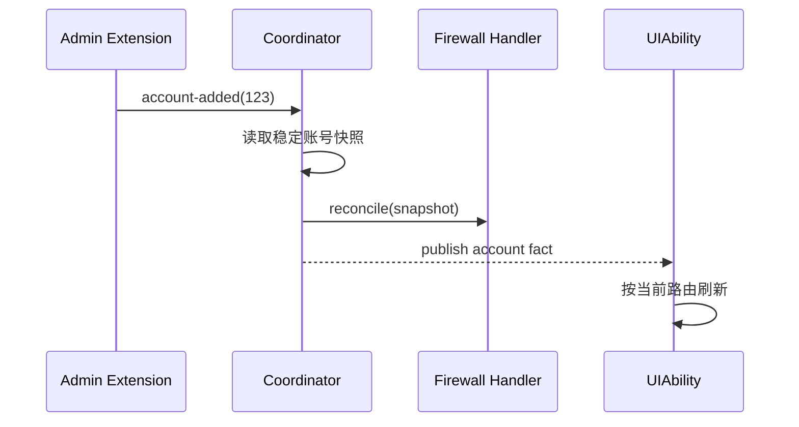

**SESSION FACT｜关键纠偏**

> “这是两个进程，你用这种静态的传递不行。”

| 接入 CommonEvent 后 | 结果 |
|---|---|
| 黑/白名单卡片 | 已刷新 |
| 已有防火墙规则 | 未刷新 |
| 操作记录 | 未刷新 |

结论：事件送达只是 `factPublished`；它不自动等于 `businessSucceeded` 或 `allConsumersReconciled`。

三个边界：

- Handler 失败不应吞掉稳定账号事实。
- CommonEvent 不能承担 policy/rule rollback。
- UI 互斥不覆盖 Extension 与 UI 的全局并发写。

### 讲师备注

页面第 11 页讲“架构为什么这样分”，本页讲“运行时如何调试”。历史真机日志已经证明 Extension 收到删除事件、Provider 读到 `[100,114]`、Coordinator dispatch 且 Handler 返回成功；同一链路没有 UI 进程日志，且 `previous=` 暴露首次 diff 基线不可信。

历史日志没有统一 `eventId`，不能为了课件完整而补造。目前只能用 `time window + source + trigger + signature + process` 关联；显式 `eventId/runId` 应作为下一张可观测性任务卡。因而这里讲“两进程、四阶段”，其中事件接收、事实读取、业务 reconcile 有证据，UI 消费只有局部 GREEN。

提交 `0650b8eb` 展示 Extension 与 UI 不能依赖进程内单例；`cecf6d17` 展示 handler 失败与账号事实发布是两种结果。这里还要保留 `CURRENT GAP`：缺少覆盖所有 writer 的全局串行策略。

### 演示动作

先给学员真实脱敏日志，要求判断哪些阶段有直接证据、哪些仍是 UNKNOWN；再给出 CommonEvent 后“卡片已刷新、规则和记录未刷新”的局部结果，分别填写 `eventReceived`、`businessSucceeded`、`factPublished`、`uiRefreshed`。最后让学员设计下一版 `eventId` 字段，而不是假设历史已经有它。

### 通过条件

日志能区分 `factPublished`、`businessSucceeded`、`uiRefreshed` 三个布尔结果，而不是一个“成功”。

### 素材

- `AccountChangeCoordinator.ets`
- `AccountChangeEventBus.ets`
- commit `0650b8eb`、`cecf6d17`
- `evidence/mdm/account-cross-process-log.md`

---

## 第 25 页｜MCP 是证据执行器，不是事实制造器

<!--
type: MAP
section: MDM_ACCEPTANCE
layout: evidence-ladder
time: 3m
progress: 证据
-->

### 画面

**SESSION FACT｜18 个工具真机测试暴露的四层结果**

| 结果层 | 关键问题 | 典型证据 |
|---|---|---|
| Protocol | 外部客户端请求是否满足 MCP Schema？ | 参数校验、requestId、协议错误 |
| Tool | 工具是否被调用并正常返回？ | tool result、退出码、artifact path |
| Business | 目标业务动作是否执行成功？ | 原始错误码、业务对象、日志链 |
| System | 设备最终状态是否真的改变？ | system getter、系统接口回读 |

**E2E FACT｜`FW-STATUS-001` 的真实结果摘要**

```text
tool action       toggle_firewall        PASS
UI before/after   false → true            PASS
evidence source   ui_tree                 PRESENT
internal getter   getPolicy/listRules     PRESENT
acceptance bridge get_runtime_state       MISSING
final verdict     UNKNOWN at system layer
```

CURRENT 已覆盖 build/install/launch、UI tree/action/screenshot 与 HiLog，App 内部也已有 `getNetFirewallPolicy` / `getNetFirewallRules` 读取。TARGET 是把现有读取通过测试专用只读 bridge 暴露为结构化验收事实。若课前未准备，系统验收只能是 `UNKNOWN`。

### 讲师备注

`harmonyos-dev-mcp` 当前明确提供设备发现、构建、安装、运行、UI 自动化、日志查询和截图。`security_tool` 的 action map 有 `firewall.toggle_status → toggle_firewall`，但没有 `firewall.get_runtime_state`。

现有 `status_toggle.json` 主要确认页面文字仍可见，并允许 `allow_unknown:true`；它不能证明所有账号的 `getNetFirewallPolicy(userId)` / `getNetFirewallRules(userId)` 正确。提交 `72cd7d47` 删除正式 E2E 的 mock/scripted 结果通道，正好强调：模拟结果不能冒充真机验收。

**Anthropic 方法锚点**：`Writing Effective Tools for Agents` 建议优先建设少量高价值、边界清晰的工具，而不是把每个底层 API 薄包装后全部暴露；工具返回也应优先提供与下一步决策相关的高信号上下文。映射到本课：`build_app`、`logs_query`、`firewall.get_runtime_state` 应分别回答“能否构建”“最早异常在哪”“系统最终事实是什么”；默认返回状态、原因码、关键对象和 evidence path，大日志按需读取，避免一次调用污染 Agent 上下文。

可选方法图放讲师备注，不与真实证据争夺画面中心：


<sub>讲师读图：MCP 位于 Tools，不是“第三个大脑”；Retrieval 负责取上下文，Memory / progress 负责跨轮保留事实，三者都只能为判断提供输入。图源：Anthropic《Building Effective Agents》。</sub>

### 演示动作

给学员一份“tool returned ok，但设备策略未改变”的结果，让他们分别填写 Protocol、Tool、Business、System；再打开 action map 与 `status_toggle.json` 找出缺失的最终事实。

### 通过条件

没有人把截图、UI 文案或 mock JSON 当作系统 policy/rules 的最终证据。

### 素材

- `repos/harmonyos-dev-mcp/README.md`
- `scripts/e2e/tools/bridge_action_map.json`
- `scripts/e2e/cases/firewall/status_toggle.json`
- commit `72cd7d47`
- MCP 全工具真机测试 Session 证据卡（附录 L2）
- `evidence/mdm/firewall-runtime-readback.md`

---

## 第 26 页｜实践：把验收写成可执行的系统契约

<!--
type: LAB
section: MDM_ACCEPTANCE
layout: contract
time: 5m
progress: 证据
-->

### 画面

**T03 / Structured Acceptance Readback — TARGET**

```json
{
  "result": "PASS|FAIL|UNKNOWN",
  "accounts": [100, 112, 123],
  "mode": "public",
  "signature": "100,112,123",
  "users": [{"id": 123, "isOpen": true, "ruleCount": 4}],
  "failures": [],
  "evidence": {"device": "...", "timestamp": "..."}
}
```

操作链：`build → install → activate admin → trigger → logs → getter → screenshot`

**课堂任务不是 5 分钟现场开发 getter，而是先冻结证据契约和 PASS 规则。**

### 讲师备注

仓库已经有 App 内部 system repository getter；本页要补的是“自动验收如何稳定调用并结构化返回”的边界。课前最佳做法：准备一个测试专用、只读、最小权限的 app bridge，直接调用现有 getter，返回每用户 policy、受管规则、local apply record 和读取错误；不要通过 UI 文字二次解析。

契约必须保留：设备 ID、包版本/commit、账号快照、每用户结果、原始错误码、采集时间。读取任一关键真相源失败时 `result=UNKNOWN`，不能返回空数组并 PASS。

### 演示动作

给学员 UI 文案、成功日志和一份缺字段的 runtime JSON，让他们先设计 JSON Schema、PASS 判定和 UNKNOWN 条件。只有课前已经准备预构建 getter 时才运行真实回读；主课堂不在 5 分钟内临时开发 bridge。

### 通过条件

PASS 必须同时满足：系统账号集合、各用户 policy、预期规则、local signature/mapping 一致；截图只做辅证。

### 素材

- 附录 F 验收结果模板
- `FirewallSystemRepository.ets`
- `FirewallLocalRepository.ets`
- `evidence/mdm/firewall-runtime-readback.md`

---

## 第 27 页｜MDM Checkpoint：交付一条完整证据链

<!--
type: CHECKPOINT
section: MDM_ACCEPTANCE
layout: deliverable-pack
time: 4m
progress: 证据
-->

### 画面

**同伴验收只问六件事**

1. `spec.md` 是否冻结账号事实、失败语义与提交点？
2. `design.md` 是否区分 intent、local apply、system truth、UI？
3. T01 是否真的出现过可解释 RED 与 GREEN？
4. T02 故障后是否恢复 identity，而非只恢复数量？
5. 设备证据是否来自真机，UNKNOWN 是否被诚实保留？
6. diff 是否完全落在任务允许边界？

结果只允许：`PASS / FAIL / UNKNOWN`。

| Eval 层 | 检查什么 | 反例 |
|---|---|---|
| Trace | Prompt、工具调用、diff、测试、是否越界 | 过程规范，但底层调用仍失败 |
| Outcome | 系统账号、policy、rules、signature、mapping | 页面偶然正确，但 AI 伪造账号事实 |

最终结论由 Outcome 决定；Trace 用于解释可信度、复现过程和发现越界行为。


<sub>讲师读图：Implementer 不能独自给自己打分。Reviewer 返回的必须是可执行反馈与缺失证据；只有达到预先冻结的 AC 才接受。图源：Anthropic《Building Effective Agents》。</sub>

### 讲师备注

评分建议：规格 20，设计与不变量 20，执行 Trace 20，真机 Outcome 30，GPU 迁移 10。不要按代码行数、Prompt 长度或 AI 生成速度评分。

扩展题放到课后：删除账号对称稳定条件、mode/signature 原子保存、全局 writer serializer、结构化 compensation phase、读取失败不降级为空。它们是真实 GAP，但不应在主实践中继续扩张任务。

**Anthropic 方法锚点**：Anthropic 的长任务实践建议在长时间或高风险执行后加入 fresh-context adversarial review，让没有参与实现的 Reviewer 只根据计划、diff、测试和证据寻找缺口。Reviewer 不是所有小任务的固定仪式：单文件、强测试、低风险任务可以由确定性检查完成；跨进程、事务、权限、GPU 或接近模型可靠边界的任务才值得承担独立评估开销。课堂中的相邻小组互审就是人工版本：不读取实现者的长聊天和自我解释，只读取 spec、task、diff、progress 与 evidence pack，报告需求遗漏、越界修改和证据不足，不评价个人代码风格。

### 演示动作

相邻小组交换 evidence pack，4 分钟内只按六问给结论，并指出一条最早缺失证据。

### 通过条件

每组拥有可独立检查的完整包；没有“我本机应该是好的”这种口头通过。

### 素材

- 附录 A Runbook
- 附录 G 评分表

---

# 第五幕：案例二——在 55 万行级开源库中完成 HarmonyOS 远控硬解闭环

## 第 28 页｜案例二背景：在 55 万行级 FreeRDP 上解决视频卡顿

<!--
type: CLAIM
section: CASE2_CONTEXT
layout: video-hero
time: 2m
progress: 需求
-->

### 画面

**任务背景**

> 基于 30 万行级以上开源库实现 HarmonyOS 远控应用。连接、输入与基础画面已经可用，但播放远端视频时，当前 CPU/软件解码路径出现明显卡顿，需要接入 HarmonyOS 硬件解码并形成可交付的工程方案。

```text
本地 FreeRDP 快照：2014 个相关源文件 / 约 559,355 行
用户现象：远端视频播放卡顿
第一目标：证明当前路径、建立 before 基线
最终目标：硬解路径可用、可回退、可验收、可维护
```

<!-- VIDEO SLOT: harmonyos-sdd-workshop-media/gpu-cpu-stutter-before.mp4 -->

当前用 `freerdp-stutter-scenario.jpeg` 做场景占位。正式授课应替换为 20–30 秒 before 视频，并同时录入 CPU/FPS 与 codec path；拍摄脚本见 `harmonyos-sdd-workshop-media/VIDEO_TODO.md`。

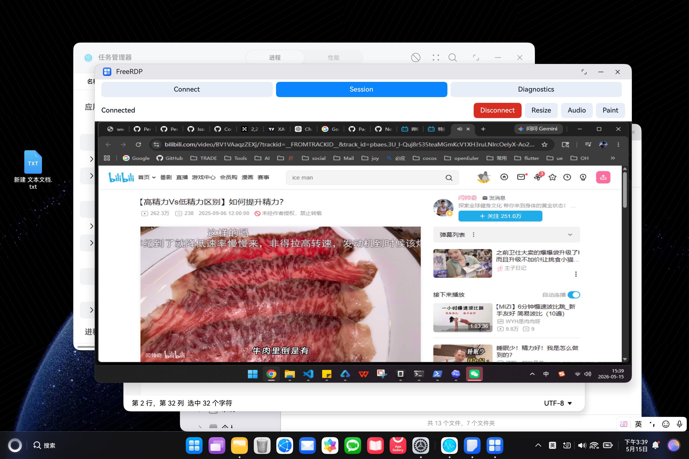

### 讲师备注

先介绍为什么这是一个“较为复杂的需求”，而不是直接说“调用 `OH_AVCodec`”：

- 55 万行代码不可能全部读进上下文；
- 视频数据经过协议、codec、buffer、合成、Surface 多个边界；
- 软件路径能显示不代表硬解路径只需替换一个函数；
- 一张正常截图不能证明持续流畅，也不能证明走了硬件 decoder；
- 即使平均 CPU 下降，黑屏、色块、resize 或 fallback 失效仍然算失败。

这里要区分“现象”和“根因”。如果没有 runtime path 日志，就只能说“视频卡顿”，不能先写成“CPU 解码导致卡顿”。本案例第一步不是改代码，而是把这个推断变成可验证事实。

### 演示动作

播放卡顿视频槽位，要求学员写下它能证明和不能证明什么。翻牌：视频可证明持续现象；CPU/FPS、协商 codec 和 decoder subsystem 需要独立采样。

### 通过条件

学员能说出：**用户问题是卡顿，CPU 软件解码只是待证假设；第一份产物应是可重复的 before 基线。**

### 素材

- `freerdp-stutter-scenario.jpeg`
- `harmonyos-sdd-workshop-media/VIDEO_TODO.md`
- `evidence/gpu/01-codebase-map.md`

---

## 第 29 页｜第一步：让 AI 快速熟悉代码，但不吞下整个仓库

<!--
type: LAB
section: CASE2_CONTEXT
layout: layered-map
time: 3m
progress: 设计
-->

### 画面

**从“读全库”改成“回答五个问题”**

```text
协议：H.264 从哪里进入？
选择：运行时选了哪个 decoder subsystem？
输出：格式、stride、plane 是什么？
显示：谁拥有 Surface，何时 present？
证明：怎样排除 software/GDI fallback？
```

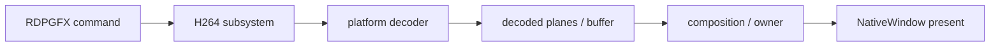

右侧放上下文预算：`1 个问题 + 1 条调用链 + 3–7 个接口 + 1 个假设 + 1 条下一步命令`。

### 讲师备注

AI 熟悉大库的产物不是“仓库总结”，而是 `codebase-map.md`：

| 层 | 本轮只读入口 | 先不读什么 |
|---|---|---|
| 原生 GDI/fallback | `libfreerdp/gdi/gfx.c`、`codec/h264.c` | 无关 channel |
| 平台 decoder 对照 | `h264_ffmpeg/openh264/mf/mediacodec/ohos_*` | 编码端与非 H.264 codec |
| OHOS hook/policy | `client/OHOS/ohos_rdpgfx_bridge.c`、`ohos_rdpgfx_surface.c`、`ohos_rdpgfx_avc444_policy.c` | ArkTS 页面业务 |
| App GPU 输出 | `rdpgfx_pipeline.cpp`、`avc420_gpu_compositor*`、`render_output_owner.*` | 尚未触发的优化分支 |

每个发现只保存 `path:line + 输入/输出 + 为什么相关 + 可信度`。AI 下一轮通过 evidence index 按需检索，而不是把整段历史 Session 再喂一遍。

#### 课堂 Prompt

```text
只读。不要修改代码，不要总结全库。
输出 SurfaceCommand → decoder → present 的调用链；
每一段只列 path:line、输入、输出、owner；
列出仍缺的运行时证据，以及下一轮最多打开的 5 个文件。
```

### 演示动作

让学员先从 `gfx->SurfaceCommand` 找到 `freerdp_ohos_rdpgfx_bridge_attach` 保存/替换回调的位置，再追 `ohos_rdpgfx_record_avc420_gpu_candidate` 的 consumed/fallback 分支；最后才打开 `h264_context_new`，确认它属于 original GDI 回退链。讲师用 `case-materials/gpu/09-源码调用链与任务拆解.md` 翻牌。

### 通过条件

- 调用链上的每个符号都能定位；
- 文件名推断不能标成运行时事实；
- 输出明确哪些事实仍为 `UNKNOWN`。

### 素材

- `evidence/gpu/01-codebase-map.md`
- `harmony/third_party/FreeRDP/libfreerdp/codec/h264.c`
- `harmony/third_party/FreeRDP/client/OHOS/README.md`

---

## 第 30 页｜第二步：研究其他平台，复制契约而不是复制代码

<!--
type: MAP
section: CASE2_RESEARCH
layout: comparison
time: 3m
progress: 设计
-->

### 画面

| 已有后端 | 作用 | AI 应该学习什么 |
|---|---|---|
| FFmpeg / OpenH264 | 通用软件路径 | 正确性 fallback、YUV 输出语义 |
| Windows Media Foundation | Windows 硬解 | 平台 decoder 生命周期与失败传播 |
| Android MediaCodec | 移动平台硬解 | buffer 输入输出、format change、释放 |
| HarmonyOS `OH_AVCodec` | 目标平台 | 能力查询、AVBuffer/Surface、stride/plane |

中央结论：

```text
共同契约：Create → Configure → Start → Input → Output → Validate → Release
平台差异：API、buffer ownership、output format、Surface/lifecycle
```

### 讲师备注

这一步不是让 AI 上网找一篇“HarmonyOS 硬解教程”然后照抄。先研究 `H264_CONTEXT_SUBSYSTEM` 如何隔离 FFmpeg、OpenH264、Media Foundation 和 MediaCodec，提炼 decoder 生命周期；随后必须回到 OHOS RDPGFX bridge，确认最终 GPU 接管还需要 command 校验、dirty rect、owner、fallback 与 EndFrame。decoder subsystem 是重要参考，不是完整方案。

AI 输出一张“同与不同”表：

- **必须保持**：上层 H.264 调用契约、错误语义、AVC420/444 协议语义、fallback；
- **必须适配**：能力查询、pixel format、异步 callback、stride/plane、NativeWindow 生命周期；
- **不能照抄**：Android 的 buffer ID、Windows COM 生命周期、其他平台的 Surface 所有权假设。

判断调研是否可信：每个“其他平台怎么做”都必须落到当前仓库的源文件或官方平台 API；二手文章只能提供关键词，不能直接成为 Architecture Decision。

### 演示动作

左右对照 `h264_mediacodec.c` 与 `h264_ohos_decoder.c`，只比较 Init/Decompress/Uninit 和 buffer 状态，不展开全部实现。

### 通过条件

学员能够说明：**我们复用其他平台的 decoder 生命周期经验，但最终接入点是 OHOS RDPGFX bridge；原生 H264 subsystem/GDI 保留为 fallback。**

### 素材

- `evidence/gpu/02-platform-research-and-spike.md`
- `h264_mediacodec.c` / `h264_mf.c` / `h264_ohos_decoder.c`

---

## 第 31 页｜先给出 HarmonyOS 对接方案，再决定改哪些文件

<!--
type: MAP
section: CASE2_RESEARCH
layout: architecture
time: 2m
progress: 设计
-->

### 画面

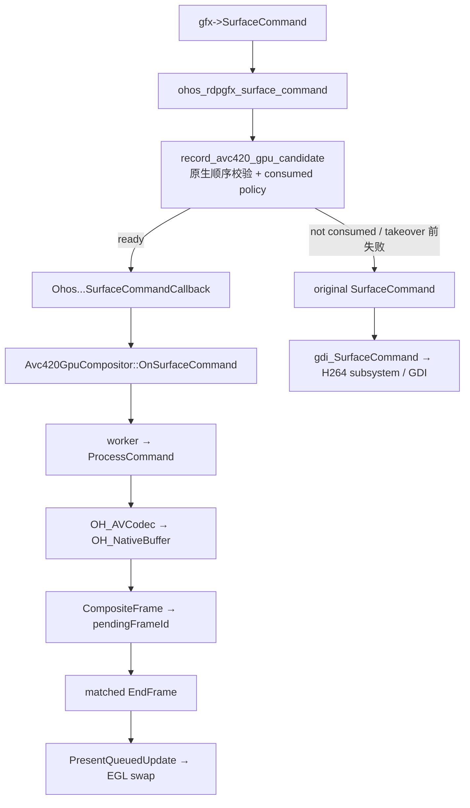

Architecture Decision：

```text
在 OHOS RDPGFX bridge 保存原回调并受控拦截；
App compositor 直接管理 OH_AVCodec、native buffer、retained composite 与 EndFrame；
takeover 前失败回到 original GDI/H264 subsystem；
先用 AVC420 证明一帧 decode→pending→matched present→fallback；
AVC444、队列与生命周期在边界证实后分任务推进。
```

### 讲师备注

方案评审只回答四个问题：

1. hook 是否先保存 original callback，再替换 SurfaceCommand/EndFrame？
2. command 只有在校验、target/background、decode/composite 成功后才 consumed 吗？
3. decode/composite 是否只生成 pending，并在匹配 EndFrame present？
4. takeover 前与 takeover 后的失败策略是否区分，owner 是否唯一？

AI 容易给出“OH_AVCodec → Surface 直接显示”的漂亮方案，但这可能绕开 dirty rect、AVC444 LC、EndFrame 和原生 fallback。只有调用链与失败语义完整，方案才进入穿刺。

### 演示动作

让两组学员互审 ADR：一组找“绕开原生契约”的风险，另一组找“无法验收”的风险。

### 通过条件

方案同时写明 Decision、Why、First slice、Deferred、Fallback 和 Evidence；不以架构图漂亮作为通过标准。

### 素材

- `evidence/gpu/02-platform-research-and-spike.md`
- `client/OHOS/README.md`

---

## 第 32 页｜第三步：最小能力穿刺，只证明一帧能走通

<!--
type: LAB
section: CASE2_SPIKE
layout: vertical-slice
time: 3m
progress: 代码
-->

### 画面

```text
SP-01 bridge 与 compositor 进入 arm64/HAP 产物
  ↓
SP-02 真机选择 hardware decoder
  ↓
SP-03 一个 AVC420 sample 产生可关联的 native output
  ↓
SP-04 同一 frame 完成 composite / pending / matched EndFrame present
  ↓
SP-05 注入失败时回到可解释 fallback
```

每个节点下固定显示一条证据：build symbol、decoder name、frameId + stride/planes、owner + EndFrame、fallback reason。

### 讲师备注

穿刺的价值是把五类风险分开：

- 编译和动态链接能否成立；
- 平台能力与 decoder 是否真实可用；
- compressed sample 是否能产生正确 output；
- output 是否能接回现有显示边界；
- 失败是否仍有正确性兜底。

“屏幕出现一帧”还不能证明连续视频性能，但已经能否定很多错误方向。反过来，只有 `OH_AVCodec_CreateByName` 成功也不够：如果输出格式、stride 或 owner 不明，穿刺仍是 `UNKNOWN`。

#### 学员产出

```markdown
Spike verdict: PASS | FAIL | UNKNOWN
Selected decoder:
Input frame identity:
Output format/stride/planes:
Display owner/present boundary:
Fallback injected/result:
Missing evidence:
```

### 演示动作

展示一组“API 返回成功但黑屏”的日志，让学员指出 SP-03 还是 SP-04 失败；随后播放 `gpu-failure-black-screen-13s.mp4`，禁止直接猜 shader。

### 通过条件

学员不把 build success、decoder create success 或单张截图当成整个 spike 的 PASS。

### 素材

- `gpu-failure-black-screen-13s.mp4`
- `evidence/gpu/02-platform-research-and-spike.md`
- `gpu-failure-black-screen-contact.jpg`

---

## 第 33 页｜穿刺以后再拆任务，并把验收点写进任务卡

<!--
type: LAB
section: CASE2_EXECUTION
layout: task-board
time: 3m
progress: 任务
-->

### 画面

| Task | 主要源码边界 | 一个可观察结果 / Stop |
|---|---|---|
| T00 | diagnostics only | 保存同 runId before；路径不明则不归因 |
| T01 | `InstallRdpgfxDiagnosticsHooks`、`bridge_attach`、decoder init | bridge + hardware decoder 真机成立；只编译成功则停 |
| T02 | decoder input/output、`OH_AVBuffer_GetNativeBuffer` | 一帧输入输出可关联；format/native buffer 不明则停 |
| T03 | candidate policy、`OnSurfaceCommand`、`ProcessCommand`、`PresentEndFrame` | consumed→owner→matched present 闭环；GDI/GPU 双写则 FAIL |
| T04 | `EnqueueSurfaceCommand`、worker compaction | 连续队列有界；depth/age 持续增长则停 |
| T05 | target generation、pause/detach/recreate | resize/后台/重连拒绝 stale task；旧 target 可写则 FAIL |
| T06 | AVC444 candidate/compositor、LC retained state | 单 decoder + LC + EndFrame；复用 420 假设则停 |
| T07 | 测试/脚本/报告，生产代码冻结 | 同场景 A/B；缺 CPU/FPS/path/soak 则 UNKNOWN |

### 讲师备注

穿刺以前只能确定探索任务，不能假装完整实现计划已经可靠。穿刺以后，任务沿源码中的状态所有权拆开：decoder 输出属于 T02；是否 consumed、谁拥有 output、何时 EndFrame present 属于 T03；跨线程积压属于 T04；target generation 属于 T05。这样黑屏或卡顿时能定位第一处异常，而不是让一个“大任务”同时改 codec、renderer、queue 和 lifecycle。

每张任务卡必须包含：Requirement、Current Evidence、Allowed、Forbidden、RED/Probe、Minimal Change、Verify、Stop。特别强调 `Forbidden` 写到对象和行为，例如：T02 不允许顺手重写 AVC444 compositor，也不允许为了“干净”删除原生 fallback。

验收标准分三层：

- Task 层：这一张卡的状态转换是否成立；
- Path 层：协议→decoder→output→owner→present 是否连续；
- Outcome 层：同一用户场景是否真实改善且回归可控。

### 演示动作

给学员一张错误任务卡：“完成 HarmonyOS FreeRDP 硬解优化”。要求拆成上表任务，并为每项补一个 FAIL/UNKNOWN 判定。

### 通过条件

任何 Task 都只有一个可观察结果；验收点在开发前写出，不由实现结果反向定义。

### 素材

- `evidence/gpu/03-task-acceptance-and-debug.md`
- `case-materials/gpu/09-源码调用链与任务拆解.md`
- 附录 D Task Card / Progress Ledger

---

## 第 34 页｜第四步：AI 开发不是一条聊天，而是一条可审查流水线

<!--
type: MAP
section: CASE2_EXECUTION
layout: swimlane
time: 3m
progress: 代码
-->

### 画面

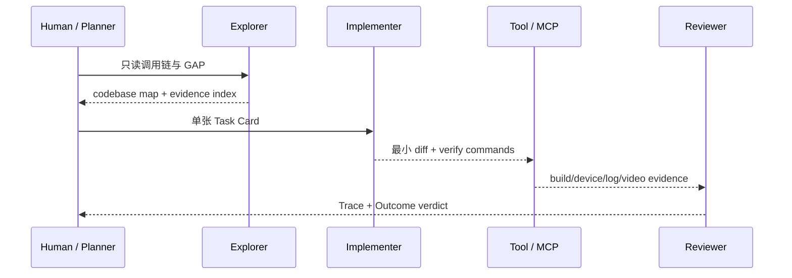

### 讲师备注

这里把“怎么协同”演出来，而不是只放一张 Agent 架构图：

- Planner 冻结任务和验收，不写实现细节；
- Explorer 只读，不靠记忆声称某条路径存在；
- Implementer 只能改 Allowed，并在 stop 条件触发时停手；
- MCP/脚本执行确定性动作并保存原始证据；
- Reviewer 不看“我已经完成”的总结，先看 diff、运行路径和 outcome。

一个人也可以分时扮演五个角色，但不能让同一段自我陈述同时充当方案、实现和验收证据。

#### 怎么判断 AI 写的代码“看起来对”还是“真的对”

```text
方案：与原生/其他平台契约一致吗？
实现：diff 只覆盖任务授权吗？
路径：真机真的运行了新代码吗？
结果：用户场景和工程回归都通过吗？
```

### 演示动作

展示“只要求删除 cache，却删除整条实现路径”的真实 Session 卡。让 Reviewer 即使看到 build green 也判 Trace FAIL，并说明如何只回滚越界部分。

### 通过条件

学员能区分实现者自评、工具结果、业务路径和独立验收四种不同事实。

### 素材

- 附录 L6 越界修改 Session Evidence Card
- `evidence/gpu/03-task-acceptance-and-debug.md`
- `anthropic/evaluator-optimizer.png`（讲师备注可选）

---

## 第 35 页｜开发遇到黑屏、色块或仍卡顿：先停，再找最早异常

<!--
type: DEBUG
section: CASE2_DEBUG
layout: evidence-ladder
time: 3m
progress: 调试
-->

### 画面

左侧循环播放黑屏片段；右侧逐层点亮：

```text
1 command received
2 codec/subsystem selected
3 compressed input queued
4 decoded output valid
5 format / stride / planes valid
6 command state applied
7 render owner correct
8 EndFrame present
9 next frame continues
```

底部写：**第一处与预期不一致的位置，才是本轮修改边界。**

### 讲师备注

AI 第一反应经常是列出十个可能原因并连续改代码。本课固定执行：

```text
Stop → Preserve → Locate → Falsify → Repair → Re-evaluate
```

典型问题：

| 现象 | 容易误改 | 最小观测 |
|---|---|---|
| 仍卡顿 | 加更多线程 | selected decoder + CPU/FPS + queue depth |
| 黑屏 | 改 shader | same frame input/output/owner/present |
| 白帧 | 改 UI 背景 | upload 前像素 + remote paint readiness |
| 粉/绿块 | 猜色彩矩阵 | output format/stride/planes/rect |
| 闪烁 | 增加 repaint | command consumed + EndFrame + owner |
| resize 后失效 | 重建 session | surface/target generation + stale queue |

没有日志时，正确动作不是继续猜，而是增加一条只回答当前假设的结构化日志。日志加到能区分两个分支的边界，不做全链路高频刷屏。

### 演示动作

先播放 `gpu-failure-black-screen-13s.mp4`，让学员选择下一条日志。随后给一张正确截图，追问：它能否证明第 9 步持续成立？

### 通过条件

学员提出的是可推翻当前判断的观测，而不是另一个无法证实的根因故事。

### 素材

- `gpu-failure-black-screen-13s.mp4`
- `gpu-failure-black-screen-contact.jpg`
- `docs/archive/rdp-white-frame-case-study.md`

---

## 第 36 页｜AI 不对时，用同一 frame 的事实推翻它

<!--
type: DEBUG
section: CASE2_DEBUG
layout: trace-table
time: 2m
progress: 调试
-->

### 画面

| frameId | codec | decoder | output | owner | present | verdict |
|---:|---|---|---|---|---|---|
| 842 | AVC420 | OHOS HW | NV12 valid | GDI-compatible | EndFrame | PASS |
| 843 | AVC444 | OHOS HW | luma only | GPU claimed | none | FAIL |
| 844 | AVC444 | fallback | unknown | unknown | screenshot ok | UNKNOWN |

下方两句：

> “API 调用成功”只证明一个边界。

> “截图看起来正确”只证明一个采样瞬间。

### 讲师备注

Reviewer 对 AI 的结论做两次审查：

- **Trace Eval**：这条 frame 是否按预期经过 command、decoder、state、owner 和 present？
- **Outcome Eval**：持续视频是否流畅、颜色正确、交互可用、CPU 改善、fallback 稳定？

如果 Trace FAIL，就修第一处异常边界；如果 Trace PASS 但 Outcome FAIL，才继续看队列、时延、帧节奏与更长时间行为。如果两者证据不足，结论是 `UNKNOWN`，不能让模型用解释填空。

AVC444 的真实教训是：两个 decoder、过早 suppress GDI、在 SurfaceCommand 直接 present 等方案都“局部合理”，但不符合原生 LC、单 `H264_CONTEXT` 与 EndFrame 语义。正确性来自契约和同帧证据，不来自代码复杂度。

### 演示动作

给出 frame 843，只允许学员选择一个最小修正：释放 owner、补 chroma、恢复 fallback 或移动 present；选择必须引用第一处 FAIL。

### 通过条件

修正建议与证据指向同一边界，不借机重写整条渲染链。

### 素材

- `gpu-e2e-interaction-public.jpg`
- `docs/archive/avc444-gpu-compositor-retrospective.md`
- 附录 F GPU Diagnosis 模板

---

## 第 37 页｜穿刺成功以后，工程化能力决定它能不能交付

<!--
type: CHECKPOINT
section: CASE2_HARDENING
layout: matrix
time: 2m
progress: 证据
-->

### 画面

| 工程能力 | 必须回答 | 失败表现 |
|---|---|---|
| 生命周期 | create/start/flush/stop/destroy 与 Surface generation 如何对齐 | resize 黑屏、旧 target |
| 队列/背压 | 输入、输出、present 队列是否有界 | 延迟增长、内存上涨 |
| 所有权 | GDI、AVC420、AVC444 谁能写 XComponent | 闪烁、旧帧覆盖 |
| 回退 | 硬解失败能否回软件/原生路径 | 静默黑屏 |
| 可观测性 | 能否证明 decoder、frame、owner、present | 只能靠肉眼猜 |
| 回归 | 输入、resize、后台、重连是否仍工作 | 局部 GREEN |

### 讲师备注

“接通 `OH_AVCodec`”只是能力穿刺，工程化还包括：

- 有界等待，不让同步调用永久阻塞；
- queue depth、drop、fallback reason 可观测；
- Surface/target generation 改变后不消费旧 buffer；
- AVC420 与 AVC444 共享输出契约，但不共享未经证明的实现假设；
- 先保留可靠 fallback，再逐步优化 zero-copy；
- 每个风险都有故障注入，而不是只跑成功路径。

这一页把原 32–37 页的技术深挖收束成工程验收维度；Buffer、plane math、LC、单 decoder 和队列推演的完整材料仍保留在附录 F、J、K 与本地复盘文档中，讲师按学员水平展开。

### 演示动作

让学员从矩阵中选一个最容易被遗漏的维度，为它补一条故障注入和一条恢复验收。

### 通过条件

方案不只覆盖 happy path；至少具有 fallback、生命周期、背压和可观测性四个工程闭环。

### 素材

- `freerdp-render-queue.jpeg`
- `freerdp-compositor-scale.jpeg`
- 附录 F1–F7

---

## 第 38 页｜最后结果：不仅展示“能播放”，还要证明为什么可信

<!--
type: CHECKPOINT
section: CASE2_OUTCOME
layout: before-after-evidence
time: 2m
progress: 证据
-->

### 画面

左：before 视频槽位（CPU/软件路径卡顿）

中：硬解路径证据链

```text
FreeRDP command
→ OHOS hardware decoder
→ valid output
→ correct owner
→ EndFrame present
```

右：after 动态播放与验收矩阵

| 结论 | 当前证据 | 判定 |
|---|---|---|
| HarmonyOS H.264 硬解对接方向成立 | 源码、构建与现有实现路径 | CURRENT / 可复核 |
| 画面与交互在某次运行可见 | 播放视频、交互联系表 | PARTIAL PASS |
| 黑屏/颜色/owner 问题有真实复盘 | 失败视频、日志、代码复盘 | PASS as diagnosis evidence |
| CPU 与卡顿达到目标 | 同场景 before/after CPU/FPS 尚未入库 | UNKNOWN / 待补 |
| resize/后台/重连长稳 | 需要完整 soak 与设备矩阵 | UNKNOWN / 待补 |

<!-- VIDEO SLOT: harmonyos-sdd-workshop-media/gpu-hwdecode-after.mp4 -->

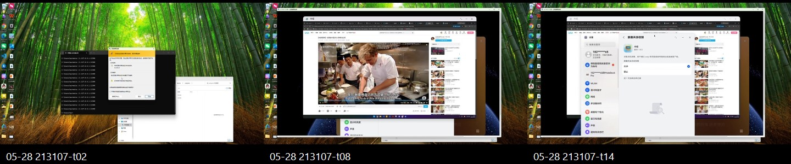

### 讲师备注

先播放 `gpu-validation-video-playback-16s.mp4`，但不要说“性能目标已经完成”。它能证明某次运行可以播放和交互，不能替代 CPU/FPS A/B、codec path 日志和长稳。

案例二最终收获不是一个 `OH_AVCodec` API 清单，而是五种可迁移能力：

1. **大库认知**：用问题、分层地图和 evidence index 控制上下文；
2. **平台迁移**：先理解成熟实现的契约，再映射目标平台差异；
3. **最小穿刺**：先证明最短真实路径，再拆完整工程任务；
4. **正确性判断**：方案、实现、路径、用户结果四层分别取证；
5. **失败处理**：不让 AI 连续猜测，用最早异常、最小反证和 checkpoint 收口。

最终证据包必须包含 codebase map、平台调研、ADR、任务卡、build、runtime path、frame trace、before/after 性能、视频、故障注入、回归矩阵和 Reviewer verdict。缺一项就标记对应维度 `UNKNOWN`，而不是把已有视频包装成完整成功。

### 演示动作

播放修复后视频，让学员先填验收矩阵再翻牌。最后要求每组回答：“AI 为什么可能是对的？我们用什么证明？如果错了，回到哪一个 checkpoint？”

### 通过条件

学员的结论包含证据边界；能够把“可见播放”“硬解路径”“性能改善”“工程可交付”区分为四个独立判定。

### 素材

- `gpu-validation-video-playback-16s.mp4`
- `gpu-validation-video-playback-contact.jpg`
- `gpu-e2e-interaction-public.jpg`
- `evidence/gpu/03-task-acceptance-and-debug.md`
- `harmonyos-sdd-workshop-media/VIDEO_TODO.md`

---
## 第 39 页｜把方法带回项目，只保留七个问题

<!--
type: CLAIM
section: CLOSING
layout: final-chain
time: 4m
progress: 证据
-->

### 画面

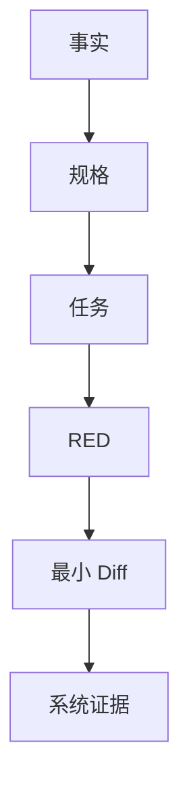

**可选收束主视觉（PPT 制作时与上方 Mermaid 二选一）**


<sub>讲师读图：任何单层检查都有孔洞。映射到本课就是测试、构建、日志、getter、截图/视频与同伴 Reviewer 叠加；只有多层证据对齐，才允许 PASS。图源：Anthropic《Demystifying Evals for AI Agents》。</sub>

下一次拿到复杂需求，只问七个问题：

1. 哪些词会让实现分叉？
2. 最终真相在哪一层？
3. 哪些不变量绝不能破坏？
4. 本轮只允许 AI 改哪个边界？
5. 怎样先制造一个可解释的 RED？
6. 最早异常证据在哪里？
7. 什么证据满足后，本轮必须停止？

**一分钟迁移题**

> 权限页面第一次进入数据为空，第二次进入正常。

每组必须用七问给出：一个最小只读勘察任务、一条可证伪假设、一项禁止修改范围和一个最终事实来源。不得直接回答“加延迟”或“页面初始化问题”。

### 讲师备注

用两个案例做最后对照：MDM 的关键是先由规格冻结多用户与事务语义；GPU 的关键是先由证据缩小未知边界。但两者最后都落到同一个外部循环：任务小、失败真、diff 窄、证据可追踪、停止条件明确。

再把七问映射回开场的六项进阶能力：前 3 问控制需求与上下文，第 4–5 问控制 Agent 边界和可验证实现，第 6 问依赖工具取得环境事实，第 7 问由 Eval 与风险匹配的 Reviewer 决定停止。这样学员离场时记住的是一套复杂需求交付框架，而不是 Ralph、MCP 或某个模型名称。

请学员展示最终包，不再展示聊天窗口。讲师最后强调：AI 可以加速探索、测试、实现和取证，但产品决策、真相源、事务边界和 PASS 判定仍由工程师负责。

### 演示动作

每组用 30 秒说出一条“原本准备让 AI 猜、现在改为先冻结或先取证”的真实工作项。

### 通过条件

学员带走的是可复用工作流与模板，而不是两个项目答案。

### 素材

- MDM evidence pack
- `gpu-diagnosis.md`
- 七问行动卡

---

# 附录 A｜120 分钟讲师 Runbook

## A1. 严格时间盒

| 时间 | 页码 | 目标 | 必须保住的实践 |
|---|---:|---|---|
| 00–08 | 1–3 | 建立课程契约、英雄任务与受控循环 | PASS / FAIL / UNKNOWN |
| 08–26 | 4–8 | 领域模型、歧义、EARS、行为矩阵 | `spec.md` |
| 26–42 | 9–14 | 状态、真相源、架构、追踪、任务卡 | `design.md`、T01 |
| 42–70 | 15–22 | 两轮 RED→GREEN、日志定位、故障注入、identity | `progress.md`、patch |
| 70–88 | 23–27 | 平台预检、跨进程、MCP、验收 | `acceptance.md`、evidence |
| 88–116 | 28–38 | GPU Evidence-first、420/444 实现与诊断 | `gpu-diagnosis.md` |
| 116–120 | 39 | 同伴审阅、迁移七问、收束 | 最终包 |

以上按每页 `time:` 元数据合计恰好 120 分钟。若现场工具链变慢，优先压缩讲师揭晓和代码浏览，不压缩以下四项：歧义冻结、一个真实 RED、一次故障注入、一次设备证据判定。

## A2. 讲师节奏

每 8–12 分钟完成一次“结论→示例→实践→证据”：

1. 先给一个可争论问题，不先给答案。
2. 学员让 AI 产出候选，人完成决策或证据判断。
3. 打开真实代码 / 测试 / 日志校正 AI。
4. 立即写入 spec、task、progress 或 evidence，不留在聊天窗口。

## A3. 现场降级策略

| 阻塞 | 允许的降级 | 不允许的假通过 |
|---|---|---|
| DevEco / SDK 不可用 | 使用课前 RED/GREEN 录制输出，结论标环境 UNKNOWN | 手写绿色输出 |
| 无真机 | 使用真实采集的只读 evidence bundle，标“回放证据” | 使用 mock 冒充本次真机 |
| Admin 激活失败 | 保留构建/安装证据，系统行为 UNKNOWN | 用 UI 页面可打开判 PASS |
| Getter 未准备 | 完成 contract 与现有 UI/log 证据，最终系统状态 UNKNOWN | 声称已有 `firewall.get_runtime_state` |

---

# 附录 B｜MDM 课堂冻结规格

## B1. TEACHING Requirements

### FR-ACC-001｜新增账号稳定快照

WHEN 收到 `account-added(triggerAccountId)`，THE SYSTEM SHALL 最多读取 5 次系统账号集合；只有包含触发账号时才 dispatch。若仍不可见，SHALL 不 dispatch、不 publish 旧快照，并记录 timeout evidence。

### FR-ACC-002｜账号集合幂等

WHEN 稳定账号集合的排序 signature 与最后成功 apply signature 相同，THE SYSTEM SHALL 跳过 public/private 模式重放；只有系统 apply 成功后才保存新 signature。

### FR-MODE-001｜保留总开关

WHEN 在任意账号上切换 public/private/custom，THE SYSTEM SHALL 保留该账号旧 policy 的 `isOpen`，只改变规格规定的默认动作与受管规则。

### FR-MODE-002｜模式事务

IF 任一用户的 policy、rule 或 local commit 失败，THE SYSTEM SHALL 不提交目标 apply state，并尝试恢复快照中的 policy、rules 与 deployment mapping；恢复后 mapping SHALL 使用系统重新分配的 rule ID。

### FR-TOGGLE-001｜总开关部分失败

WHEN 对全部用户设置 `isOpen` 且部分用户失败，THE SYSTEM SHALL 保留成功用户结果，返回每用户失败明细，并且不保存目标 `desiredEnabled`。

### FR-OBS-001｜结构化失败证据（TARGET）

WHEN forward 或 compensate 系统调用失败，THE SYSTEM SHALL 记录 `transactionId / userId / operation / phase / code / localRuleId / systemRuleId`，不得只返回模糊消息。

### NFR-SAFE-001｜未知不等于空

IF 系统 policy/rules、账号集合或 local mapping 读取失败，THE SYSTEM SHALL 在任何破坏性写入前停止；禁止把读取失败降级为空集合后继续 clear。

## B2. 完整行为矩阵

| 场景 | CURRENT / 课堂冻结行为 | 本地状态 | 证据重点 |
|---|---|---|---|
| 已开启再次开启 | Page 层 no-op；Service 本身无此保证 | 不变 | 系统 set 调用数 0 |
| 已关闭再次关闭 | Page 层 no-op | 不变 | 系统 set 调用数 0 |
| 总开关全成功 | 各用户只改 `isOpen`，保留 action | 保存 desired | 每用户 getter |
| 总开关部分失败 | 成功用户保留，失败用户明细 | 不保存 desired | mixed state + failedItems |
| public/private + 新账号 | 等 trigger 可见后在最新集合重放 | 成功后 mode/signature | 账号 123 policy/rules |
| custom + 新账号 | 同步默认 policy，不扩大旧规则 scope | 成功后更新 signature | intent targetUsers 不变 |
| 新增账号超时 | 不用旧快照 dispatch | 不提交 | retry + timeout |
| 删除账号 | CURRENT：读一次；空/失败不 prune | 安全时裁剪 mapping | removed user 不残留 |
| 重复 signature | 跳过重放 | 不变 | 系统写调用数 0 |
| 模式应用失败 | 快照补偿；恢复 ID 重映射 | 不提交目标 state | forward + rollback |
| 多用户 Create 部分失败 | CURRENT：继续收集所有失败后统一回滚 | 不写 intent/mapping | 所有 target 尝试过 |
| 普通 Edit | retained update + added add + removed remove | 全成功才保存 | bucket + reverse compensation |
| 目标类型 DNS | remove old + add new | 保存新 system ID | DNS replace |
| DNS→IP | CURRENT：retained deployment 原地 update | ID 保持 | update target ID |
| Delete 部分失败 | 重新 add 已删除规则 | 保留 intent | 恢复后 ID 对齐 |
| Local save 失败 | 视为事务失败并补偿系统 | 不形成半提交 | system/local 一致 |

## B3. 不变量与当前 GAP

| ID | 不变量 / 风险 | 状态 |
|---|---|---|
| I1 | 写入基于显式账号快照 | CURRENT 主要具备 |
| I2 | 模式切换保留 `isOpen` | CURRENT，`deaf8f27` 修复 |
| I3 | intent 可追踪到每用户 deployment | CURRENT |
| I4 | 补偿后 mapping 使用新 systemRuleId | CURRENT 主要具备 |
| I5 | 新增账号 trigger 可见才 dispatch | CURRENT |
| G1 | 读取失败可能被降级为空 | GAP |
| G2 | mode/signature 双 key 可能半提交 | GAP |
| G3 | account-removed 无对称稳定等待 | GAP |
| G4 | UI 与 Extension writer 无全局串行 | GAP |
| G5 | rollback phase 缺少结构化字段 | GAP |

## B4. `spec.md` 空白模板

```markdown
# <Feature> Specification

## Context
- 用户 / 设备 / 账号范围：
- 当前行为与证据：
- 本轮目标：
- 不在范围内：

## Terms
| Term | Exact meaning | Truth source |
|---|---|---|

## Open Decisions
| ID | Question | Options | Owner | Status |
|---|---|---|---|---|

## Functional Requirements
### FR-XXX
WHEN ...
WHILE ...
THE SYSTEM SHALL ...
IF ... THEN SHALL ...

## Behavior Matrix
| Initial | Trigger | System effect | Local commit | Failure |
|---|---|---|---|---|

## Invariants
- I1：

## Acceptance
- Direct fact required：
- PASS：
- FAIL：
- UNKNOWN：
```

## B5. `design.md` 空白模板

```markdown
# <Feature> Design

## Requirement Trace
| Requirement | Decision | Boundary | Test | Device evidence |
|---|---|---|---|---|

## State and Truth Sources
| State | Owner | Read failure | Write / commit point |
|---|---|---|---|

## Process Boundaries
- Extension：
- Service / Handler：
- UIAbility / ViewModel：
- Cross-process event：

## Transaction
- Snapshot：
- Forward order：
- Commit point：
- Compensation order：
- Identity remap：
- Compensation failure evidence：

## Concurrency
- Serialized writers：
- Still-unprotected writers：
- Stale callback / generation rule：

## Observability
- correlationId：
- mandatory fields：
- sampling / privacy：

## Current Gaps and Deferred Tasks
- GAP：
```

---

# 附录 C｜AI Prompt 梯子

下面的 Prompt 不是“万能咒语”，而是每轮输入/权限/输出/停止条件的模板。每次只使用当前阶段的一条。

## C1. 歧义勘察 Prompt

```text
你是需求分析协作者。不要设计方案，不要写代码。

输入：<原始需求>、<领域对象>、<目标平台约束>。

任务：只找会改变状态模型、系统调用顺序、事务补偿、
跨进程行为、测试或验收的实现分叉。

每项输出：
1) 原文中的模糊词；2) 至少两个互斥答案；
3) 每个答案改变的工程行为；4) 必须由谁决定；
5) 若不决定，AI 最可能做出的危险假设。

禁止输出架构、类名、代码。未知标 OPEN。
```

## C2. 仓库只读勘察 Prompt

```text
本轮禁止修改任何文件。

围绕 <Requirement ID>，使用搜索和提交历史给出：
- 用户/系统入口；
- 最短调用链；
- 每个真相源与失败表达；
- 所有副作用与唯一 commit point；
- 已有单测、设备测试、E2E；
- 相关提交为何改变行为；
- 规格与当前实现的差距。

每个结论必须附现有路径/符号/提交证据。
找不到就写 NOT FOUND，不得发明 API。
```

## C3. 任务切片 Prompt

```text
根据已冻结 spec/design，把 <Requirement ID> 切成最小任务。

每张任务卡必须包含：唯一可观察结果、Allowed Files/Layers、
Forbidden Changes、失败测试、实现提示、验证命令、证据文件、
停止条件、剩余风险。

一个任务若需要同时改 UI、Service、Repository、系统 bridge，
请继续拆分。不要按文件数量切任务。
```

## C4. RED Prompt

```text
只为 <Task ID> 增加一个会因缺少目标行为而失败的测试。
先阅读现有测试风格和可用 fake/mock；不要虚构 Hamock API。

运行最窄测试并报告：命令、退出码、唯一目标失败、关键输出。
若失败来自环境/编译/无关断言，停止并标 BLOCKED，禁止改生产代码。
```

## C5. 最小实现 Prompt

```text
目标：让 <Task ID> 的目标 RED 转 GREEN。

只允许修改：<Allowed>。
禁止修改：<Forbidden>。
必须保持：<Invariants>。

先说明最小状态转换和预计 diff，再实施。
不得删除/放宽测试，不得把未知降级为空，不得顺便重构。
完成后运行窄测试、相关回归，并更新 progress.md。
```

## C6. DEBUG Prompt

```text
不要先给修复。根据同一个 correlationId/frameId 的证据：
1) 标出最早异常事件；
2) 列出已被证据排除的层；
3) 给出一个可证伪假设；
4) 只增加验证该假设所需的最小日志/探针；
5) 写出会推翻假设的反证。

禁止根据最终 UI 现象直接跳到根因。
```

## C7. 验收审阅 Prompt

```text
按 spec 的每个 SHALL 审阅 evidence pack。
只返回 PASS / FAIL / UNKNOWN。

PASS：必须有要求层级的直接事实；
FAIL：直接证据与预期矛盾；
UNKNOWN：设备、权限、getter、日志字段或证据缺失。

UI 文案只能证明 UI；mock 只能证明测试逻辑；
不得用较弱证据替代 system getter。
```

---

# 附录 D｜Ralph 任务与进度模板

## D1. Task Card

```markdown
# TXX — <一个可观察结果>

## Requirement
- FR-...

## Current Evidence
- 现有行为：
- 代码锚点：
- 已知 GAP：

## Allowed
- 文件 / Layer：

## Forbidden
- 不得修改：
- 不得改变的不变量：

## RED First
- 输入：
- 注入失败：
- 预期断言：
- 运行命令：

## Minimal Implementation Hint
- 只描述边界和状态转换，不预写完整实现。

## Verify
- Narrow test：
- Related regression：
- Build / device：
- Evidence paths：

## Stop
- [ ] RED 原因正确
- [ ] GREEN + 回归
- [ ] diff 未越界
- [ ] 设备事实 PASS，或阻塞为 UNKNOWN
- [ ] progress.md 已更新
```

## D2. Progress Ledger

```markdown
## Round <N> — <timestamp>

- Task：
- Hypothesis：
- RED command / exit / evidence：
- Files changed：
- GREEN command / exit / evidence：
- New fact：
- Remaining risk：
- Verdict：PASS | FAIL | UNKNOWN
- Stop reason / Next task：
```

## D3. 两轮课堂示例

### Round 1 / T01

- Hypothesis：账号事件先于 OS 查询结果可见。
- RED：旧快照 `[100,112]` 被 dispatch。
- Minimal diff：新增事件按 trigger 可见性重试；timeout 拒绝旧快照。
- New fact：stable=trigger present，不是 consecutive equal reads。
- Next：在最新快照上注入模式下发失败。

### Round 2 / T02

- Hypothesis：账号 123 第 2 条 add 失败会污染目标 signature 或旧 mapping。
- RED：rollback 后 deployment 仍指向旧 systemRuleId。
- Minimal diff：收集 re-add 返回 ID，并 remap deployment；目标 apply state 不提交。
- Remaining risk：rollback phase 不结构化；mode/signature 原子性未解决。
- Stop：窄测/回归绿，设备 getter 仍待课前能力；最终为 UNKNOWN 或 PASS 取决于证据。

---

# 附录 E｜构建、测试与 MCP 验收手册

## E1. 本地验证命令

在 `repos/security_tool` 按项目 README 与本机 DevEco 工具链执行：

```powershell
hvigorw test --mode module -p product=default -p module=entry@default
hvigorw assembleHap --mode module -p product=default -p module=entry@default
```

设备侧测试示例：

```powershell
hvigorw test --mode module -p product=default -p module=entry@ohosTest
hvigorw assembleHap --mode module -p product=default -p module=entry@ohosTest
hdc shell aa test -b com.huawei.securitytool -m entry \
  -s unittest OpenHarmonyTestRunner -w 60000
```

命令必须按实际 OS、SDK 与签名环境调整；讲师课前把最终可用命令写进 task card，不在现场猜工具路径。

## E2. MCP 可执行链（CURRENT）

`harmonyos-dev-mcp` 当前可组合：

```text
list_devices
→ build_app(project_path, target="hap", module_name="entry")
→ install_app(hap_path, device_id)
→ run_app(bundle_name, device_id)
→ find_elements / click / input_text
→ logs_query(package_name, marker_keywords, save_path)
→ get_ui_tree
→ screenshot(local_path)
```

建议把一次验收固定为一个 `runId`，在应用日志、文件名与 `acceptance.md` 中复用。冷构建给足 120 秒工具超时；UI mutation 在同一设备串行，不要并发点击制造假失败。

## E3. 系统 Getter（TARGET）

只读 getter 至少返回：

```json
{
  "schemaVersion": 1,
  "runId": "mdm-20260831-001",
  "deviceId": "<device>",
  "bundleVersion": "<version-or-commit>",
  "readAt": "<iso-time>",
  "accounts": {"status": "OK", "ids": [100, 112, 123]},
  "applyState": {"mode": "public", "signature": "100,112,123"},
  "users": [
    {"id": 123, "policyStatus": "OK", "isOpen": true,
     "inAction": "...", "outAction": "...",
     "rulesStatus": "OK", "managedRuleIds": [9417, 9418]}
  ],
  "mappingStatus": "OK",
  "errors": []
}
```

任何 `status != OK` 都使最终判定至少为 UNKNOWN。禁止使用 `rules=[]` 同时表达“确实无规则”和“读取失败”。

## E4. `acceptance.md` 模板

```markdown
# Acceptance — <runId>

## Identity
- Device / HDC endpoint：
- Bundle / version / commit：
- Build artifact hash：
- Time range：

## Preconditions
- SDK / permission / ACL：admin：PASS | FAIL | UNKNOWN
- Accounts before：
- Mode / desired before：

## Action
- Trigger / UI flow：
- Injected failure：

## Evidence
- unit-test-red.txt：
- unit-test-green.txt：
- build.txt：
- device-log.txt：
- runtime-state.json：
- screenshot.png：

## Requirement Verdicts
| Requirement | Direct evidence | Verdict | Reason |
|---|---|---|---|

## Final
PASS | FAIL | UNKNOWN
```

---

# 附录 F｜GPU 实现与诊断手册

## F1. AVC420 / AVC444 事实对照

| 维度 | AVC420 | AVC444 |
|---|---|---|
| Decoder output | opaque NativeBuffer | mapped NV12/NV21 planes |
| GPU input | EGLImage + External OES | Y/UV plane upload |
| Retained state | RGBA Texture + FBO | Y/U/V texture state |
| First takeover | full update 或可信 GDI base | 完整 luma/base-chroma readiness |
| Partial update | dirty rect 外保留旧 RGBA | LC 更新指定 luma/chroma |
| GDI relation | producer 保留；GPU owner 时 presenter 受控 | GPU owner 时 GDI presenter 受控 |
| Decoder model | AVC stream + retained GDI | 单 decoder 顺序消费 luma/chroma |
| Current risk | 累计阈值、queue 720 同步越序、0 rect | queue 非硬上限、Surface lifecycle |

## F2. AVC420 接管判定

| 输入 | 背景 | 结果 |
|---|---|---|
| Full-surface AVC | 不要求 GDI seed | 可同步构建 base 并尝试接管 |
| Partial AVC | fresh、同尺寸、有效 GDI snapshot | seed RGBA FBO 后接管 |
| Partial AVC | 无可信 snapshot | 返回 false，不 suppress GDI |
| Active AVC | retained 已可信 | 深拷贝 command 后入 worker |
| Active enqueue 失败 | retained / owner 仍在 | 当前实现可能同步处理，检查顺序 GAP |

`failures` 与 `ignoredUpdates` 是累计计数；教学时若要表达“连续失败”，必须先设计 reset 条件并补测试。

## F3. AVC444 LC 判定

```text
LC=0: needsLuma=true,  needsChroma=true
      stream1=luma, stream2=chroma

LC=1: needsLuma=true,  needsChroma=false
      stream1=luma

LC=2: needsLuma=false, needsChroma=true
      stream1=chroma
```

只有 retained state 满足 present readiness 时才可 claim / present。测试至少覆盖 LC 顺序变化、SPS/PPS 缺失、decoder reset、NV12/NV21、v1/v2 chroma、0 dirty rect、Surface recreate。

## F4. Frame boundary 的规则与例外

- 普通 AVC pending update：匹配 real 或 synthetic EndFrame 后 present。
- `frameOpen=false`：bridge 生成 synthetic matched frame callback。
- AVC420 GDI-only 且无 AVC pending：可以立即 present。
- AVC420 deferred GDI-only：可在匹配 EndFrame present。
- target 恢复：可以直接重呈现 retained composite。

因此验收断言应写具体分支，不能写成“所有 present 都必须对应真实 EndFrame”。

## F5. `gpu-diagnosis.md` 模板

```markdown
# GPU Diagnosis — <runId>

## Reproduction
- Device / build / resolution / network：
- Gesture or workload：
- AVC420 | AVC444 | shared：
- Time window / frameId：

## Symptom
- 可观察现象：
- 基线指标：decode / queueAge / compose / present / fps：

## Earliest Anomaly
- Event：
- Evidence：
- Layers already excluded：

## Falsifiable Hypothesis
- Hypothesis：
- One boundary to change or instrument：
- Counter-evidence that would reject it：

## Minimal Diff
- Allowed files：
- Forbidden changes：

## Verification
- Same frameId trace：
- Owner / readiness / EndFrame / Surface generation：
- Before / after metrics：
- Visual evidence：

## Verdict
PASS | FAIL | UNKNOWN
```

## F6. 两个课堂 Case 参考答案

### Case 420

证据：decode 4ms、compose 3ms、queueAge 110ms，queue 达 720 后 enqueue false、当前命令转同步路径。

- 最早异常：worker 排队与排序边界。
- 下一轮：只记录 sequence number、enqueue/processed order、fallback path；不要改 decoder。
- 反证：若 queueAge 降低且严格顺序仍卡，假设被推翻，继续看 present / target。
- GAP：同步处理可能越过旧队列任务，不能宣称天然保序。

### Case 444

证据：decode/compose 均低，首个可见命令 LC=2，retained `hasLuma=false`。

- 最早异常：首次接管 readiness / 命令序列，不是 shader 性能。
- 下一轮：记录 LC、SPS/PPS、hasLuma/hasChroma、claim owner；验证是否应等待 luma base。
- 反证：若此前有成功 LC0/1 并且 luma state 在同 Surface generation 有效，则检查生命周期丢失。

## F7. GPU 验收矩阵

| 场景 | 必备直接证据 | PASS 条件 |
|---|---|---|
| 420 full takeover | command、import、retained、owner | 首帧完整、无双写 |
| 420 partial + seed | snapshot validity、rect、FBO | rect 外像素保留 |
| 420 partial no seed | suppress/owner log | 保持 GDI，不出现黑底 |
| 420 target pause/recover | generation、state、re-present | 旧 callback 不写新 target |
| 420 backlog | enqueue/process sequence | 无协议乱序或明确安全策略 |
| 444 LC0/1/2 | LC、decode order、readiness | 未更新 plane 保持旧值 |
| 444 NV12/NV21 | planes、shader input、known frame | 无错色/越界 |
| 444 queue / Surface | depth、destroy/reset、owner | 队列有界目标与资源闭合 |
| 共用输出 | owner transition、EndFrame、swap | 单 owner、帧边界正确 |

---

# 附录 G｜代码与提交素材索引

## G1. MDM 代码锚点

| 教学问题 | 真实锚点 |
|---|---|
| 全用户总开关 | `FirewallPolicyService.setFirewallEnabledForAllUsers` |
| 稳定账号快照 | `AccountChangeCoordinator.loadStableSnapshot/runOnce` |
| 账号对账 | `FirewallAccountChangeHandler.handle` |
| 模式事务 | `FirewallModeSwitchService.createSnapshot/applyModeToUsers/rollbackToSnapshot` |
| Identity remap | `FirewallModeSwitchService.remapDeployments` |
| 规则事务 | `FirewallRuleMutationService.applyUpdateTransaction` |
| DNS replace | `FirewallRuleMutationService.applyDnsReplaceUpdateTransaction` |
| UI 互斥 | `FirewallPage`、`FirewallOverviewViewModel` |

推荐提交故事：

- `deaf8f27`：模式切换错误地重新开启防火墙。
- `ddff7a5f`：拆分 Policy / Mode / Rule 等职责。
- `0b5edc5f`：快照、补偿、systemRuleId remap。
- `f6886182`：UI / ViewModel 模式与开关互斥。
- `063ac1ab`：Create / Edit / Delete 事务补偿。
- `76e7f6e6`：目标 DNS 的 remove+add 与新 ID。
- `94ff17e7`：账号变化对账、desiredEnabled、mode/signature。
- `53751b2e`：handler registry 与 CommonEvent。
- `c0c1bc9f`：account-added 200ms×5 等 trigger 可见。
- `9c7fb186`：custom 模式保存 signature。
- `cecf6d17`：handler 失败仍发布账号事实。
- `4906f7d3 → 06864339 → 78fca089`：401、undefined payload、错误证据闭环。
- `72cd7d47`：正式 E2E 删除 mock/scripted 结果通道。

## G2. GPU 代码锚点

| 教学问题 | 真实锚点 |
|---|---|
| 420 owner/state/queue | `surface/avc420_gpu_compositor.h/.cpp` |
| 420 decode/EGL/retained | `surface/avc420_gpu_compositor_internal.cpp` |
| 444 queue/callback | `surface/avc444_gpu_compositor.cpp` |
| 444 decoder/LC/YUV | `surface/avc444_gpu_compositor_internal.cpp` |
| 公共 owner | `surface/render_output_owner.h/.cpp` |
| XComponent target | `surface/xcomponent_native_host.cpp` |
| FreeRDP OHOS bridge | `client/OHOS/ohos_rdpgfx_surface.c` |
| FreeRDP H264 fallback | `libfreerdp/codec/h264_ohos_decoder*.c` |

可用于讲师备注的提交锚点：`a9c05d2`、`a6918ba1`、`93c6207`、`d789bb5`、`5370d34`、`227c1a9`、`1c07750`、`00544cb`。上课不在画面堆哈希，只在打开历史时使用。

## G3. 每 2–3 页插入的真实素材

1. MDM 首页与账号列表截图。
2. `rg` 勘察结果与调用链。
3. T01 红测 / 绿测对照。
4. 模式事务关键代码与 fault injection 输出。
5. Extension / Coordinator / UI 同 eventId 日志。
6. MCP build/install/log/screenshot 输出。
7. AVC420 opaque import、dirty rect、owner 日志。
8. AVC444 planes、LC、readiness 日志。
9. Surface destroy/recreate 与 owner transition。
10. 最终 evidence pack 文件树。

---

# 附录 H｜课前准备与视觉交付清单

## H1. 讲师必须提前准备

- 锁定两个仓库的演示 commit，确认所有代码锚点仍存在。
- 准备训练分支：T01/T02 可产生真实 RED；不要直接在已经修复的 HEAD 上假演示失败。
  - T01：GREEN=`c0c1bc9f`，基线 parent=`4b372d0d`；在训练分支上只加入目标 RED 测试，不提前带入生产修复。
  - T02：GREEN=`0b5edc5f`，基线 parent=`46819417`；故障注入必须能区分 forward 与 compensate。
- 在授课设备跑通 Hvigor test/build、签名、安装、admin 激活与 HDC。
- 准备账号 `[100,112,123]` 或等价真机条件。
- 若要最终 PASS，课前实现并验证只读 firewall runtime getter；否则在材料中固定展示 UNKNOWN。
- 预采集一份真机 evidence bundle，作为设备故障时的“回放证据”，标明设备与时间。
- 为 GPU 准备 AVC420/AVC444 可复现片段、卡顿录屏、已脱敏 frame trace 与色块 Buffer。
- 提前验证 39 页所有 `time:` 合计 120 分钟。

## H2. PPT 资产命名

先检查现成资产，不把“建议截图”误写成“证据已经准备”：

| 资产 | 当前状态 | 授课要求 |
|---|---|---|
| `harmonyos-sdd-workshop-media/mdm/firewall-domain-rule-created.jpeg` | READY | 第 1 页只用于证明 UI 可见，明确不能证明系统下发 |
| `harmonyos-sdd-workshop-media/gpu-*` 与 `freerdp-*` | READY | 结合 runId/frame trace 使用，不以单图判 PASS |
| T01 `unit-test-red/green` 输出 | EVIDENCE READY | `evidence/mdm/t01-red-green.md` 已保留 commit、命令、目标断言与退出码陷阱；课前只需转成截图 |
| P24 两进程四阶段日志 | EVIDENCE READY / TELEMETRY GAP | `evidence/mdm/account-cross-process-log.md` 已脱敏；历史无 eventId，课件不得补造 |
| P25 structured acceptance readback | TARGET | App 内部 getter 已存在，验收 bridge 未实现；固定演示 UNKNOWN，不用 UI tree 顶替 |

```text
assets/
├── 01-opening-device-vs-tests.png       # 可由 READY 真机图 + 测试输出组合
├── 04-mdm-domain-model.svg
├── 15-t01-red.png
├── 16-t01-green.png
├── 18-mdm-401-log.png
├── 21-rollback-fault.png
├── 24-cross-process-log.png
├── 25-mcp-current-target.png
├── 29-dual-codec-path.svg
├── 34-buffer-inspection.png
├── 35-avc420-takeover.png
├── 37-avc444-lc.png
└── 38-owner-frame-trace.png
```

## H3. 页面制作验收

- [ ] 画面层每页只有一个判断中心。
- [ ] 所有长答案、完整矩阵、哈希与路径进入 Notes / 附录。
- [ ] 表格画面层不超过 4×4；代码不超过 12 行。
- [ ] CLAIM / MAP / CODE / DEBUG / LAB / CHECKPOINT 节奏交替。
- [ ] 所有 CURRENT / GAP / TARGET 标签颜色统一。
- [ ] LAB 都有输入、允许动作、交付和通过条件。
- [ ] DEBUG 都有最早异常、下一步和反证。
- [ ] 证据页明确 PASS / FAIL / UNKNOWN。
- [ ] 每个真实截图/视频都写明“能证明 / 不能证明”，并绑定 runId 或时间范围。
- [ ] 每 10–12 分钟至少有一次学员可观察动作；不能连续三页只有讲师操作。
- [ ] 主画面优先真实问题与项目证据；Anthropic 配图只解释方法，不抢占案例证据中心。
- [ ] 页脚进度带 `需求—设计—任务—代码—调试—证据` 与本页阶段一致。

---

# 附录 I｜项目事实与方法论依据

## I1. 项目事实来源

本课程的项目事实以以下本地仓库及其提交历史为准：

- `repos/security_tool`
- `repos/harmony-windows-bridge`
- `repos/harmony-windows-bridge/harmony/third_party/FreeRDP`
- `repos/harmonyos-dev-mcp`

对外分享前，再按授课当天的 HarmonyOS SDK、MDM API、OH_AVCodec / OH_NativeBuffer 文档复核接口签名、权限、错误码和生命周期约束。外部文档只用于确认平台契约；案例行为仍必须由当前代码、测试和真机证据共同支持。

## I2. Anthropic 方法论文章

| 官方文章 | 核心观点（本课采用的部分） | 在课程中的落点 |
|---|---|---|
| [Best practices for Claude Code](https://code.claude.com/docs/en/best-practices) | 先 Explore，再 Plan、Implement；给 Agent 可运行的检查；主动管理上下文；长任务后用新上下文反证 | 第 3、13、27 页 |
| [Building Effective AI Agents](https://www.anthropic.com/engineering/building-effective-agents) | 从最简单可行方案开始；工作流适合确定路径，Agent 适合开放任务；执行中持续获取环境 ground truth，并设置 checkpoint / stopping condition | 第 3、28、39 页 |
| [Effective Harnesses for Long-Running Agents](https://www.anthropic.com/engineering/effective-harnesses-for-long-running-agents) | 首轮建立任务与验证清单；后续一次只推进一个 feature；使用 progress、Git 和端到端测试完成跨上下文交接 | 第 14–17 页、附录 D |
| [Effective Context Engineering for AI Agents](https://www.anthropic.com/engineering/effective-context-engineering-for-ai-agents) | 上下文是有限注意力预算；保留完成当前任务所需的最小高信号信息；长任务使用压缩、结构化记录和按需检索 | 第 13、17 页、附录 D |
| [Writing Effective Tools for Agents](https://www.anthropic.com/engineering/writing-tools-for-agents) | 少量高价值工具优于大量重叠薄包装；工具应有清晰边界、语义化返回、token 效率，并用真实任务评测 | 第 25–26 页、附录 E |
| [Demystifying Evals for AI Agents](https://www.anthropic.com/engineering/demystifying-evals-for-ai-agents) | 复杂 Agent 评估要区分 task、trial、trace 与 outcome；组合代码、模型和人工 grader；从真实失败建立可维护的 eval suite | 第 3、26–27、39 页、附录 E |
| [Harness Design for Long-Running Application Development](https://www.anthropic.com/engineering/harness-design-long-running-apps) | 把长任务拆成可处理片段，用结构化产物跨阶段交接；Planner、Generator 与 Evaluator 分工；持续检验 harness 中哪些假设真正必要 | 第 14–17、27、39 页、附录 D |
| [AI Fluency 研究型课程模型](https://academy.claude.com/tutorials/getting-good-at-claude-a-research-backed-curriculum) | 先教入口动作；描述能力沿耐久度逐渐扩展；辨别力不会随使用时间自然增长，必须在每一步重复训练 | 课程定位、第 1、3、27、39 页 |

使用这些来源时保留两个时间与适用性边界：

1. `Building Effective AI Agents` 发布于 2024 年，原页面已提示工具生态随后发生变化。本课只采用仍稳定的原则：从简单方案开始、区分 Workflow 与 Agent、持续读取环境事实、设置 checkpoint 和 stopping condition；不照搬具体产品配置。
2. 独立 Evaluator 不是所有任务的固定要求。任务位于模型可靠能力范围内且已有强确定性检查时，额外 Evaluator 可能只是开销；跨进程、事务、权限、GPU、主观质量或模型能力边缘任务才优先启用。

## I3. 从文章观点到本课动作

本课不照搬任何具体 AI 产品命令或功能清单，而是提炼跨工具、跨项目成立的工程动作：

| Anthropic 观点 | 本课工程化动作 | HarmonyOS 项目证据 |
|---|---|---|
| Agent 需要环境 ground truth | 每轮必须读取测试、构建、日志、system getter 或帧链事实 | MDM policy/rules；GPU frameId/owner/EndFrame |
| Workflow 与 Agent 解决不同问题 | 构建、安装、采集走可重复 workflow；歧义探索、假设选择和最小 diff 才交给 Agent | MCP 验证链固定；MDM / GPU 决策路径按证据分叉 |
| 入口动作决定后续学习质量 | 先冻结完成状态与边界，再进入小步迭代 | 英雄任务、歧义树与 Task Card |
| 辨别力必须刻意训练 | 每个模块都以“什么会让它错、还缺什么证据”收尾 | 故障注入、UNKNOWN、同伴反证与最终系统回读 |
| 没有检查就只能“看起来完成” | STOP 由可执行 Verification 决定，阻塞时返回 UNKNOWN | RED/GREEN、HAP build、真机回读 |
| 一次只推进一个 feature | 一张 Task Card 只允许一个可观察结果和有限文件范围 | T01 稳定快照；T02 故障补偿；T03 getter |
| progress 是跨上下文控制面 | 记录新事实、证据路径、剩余风险和 Stop/Next，不复制聊天 | `progress.md` 与 evidence pack |
| 上下文要少而高信号 | 只给 spec、current task、progress、相关文件和证据索引 | 新会话复现下一步，不重新扫描整仓 |
| 工具应面向工作流而非底层 API | MCP 返回 Agent 下一步决策所需的状态、原因码和证据路径 | `build_app`、`logs_query`、TARGET runtime getter |
| Trace 与 outcome 必须分开评估 | 既审查 Agent 的工具调用、修改轨迹和越界行为，也回读系统最终状态 | `progress.md` + diff 是 trace；getter / frame evidence 是 outcome |
| 高风险任务不由实现者独自打分 | Planner 冻结目标，Implementer 产出最小 diff，Reviewer 只按 AC、diff、测试和证据反证；低风险强测试任务允许确定性检查直接收口 | 第 27 页 evidence pack 互审 |

引用这些文章的目的不是给课程增加一套新名词，而是说明：本课从两个真实 HarmonyOS 项目提炼出的“需求先冻结、上下文高信号、Workflow 与 Agent 有边界、任务小、失败真、证据强、评估独立、停止清楚”，与 Anthropic 在 Agent 工程实践中总结的可靠性原则一致。

## I4. 把 Agent Eval 图翻译成课堂验收

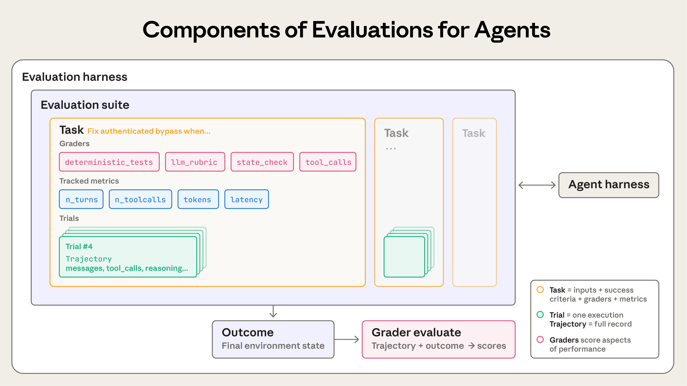

课堂不要求学员搭建完整评测平台，但必须理解图中的六个对象如何映射：

- `Task` → 一张带输入、AC、Allowed、Forbidden 与 Stop 的任务卡。
- `Trial / Trajectory` → 一次受控执行及其 Prompt、工具调用、diff、测试和 `progress.md`。
- `Outcome` → 真机最终 policy/rules，或 GPU 同一 `frameId` 的 owner / present 事实。
- `Graders` → 确定性测试、状态 getter、Reviewer rubric 与人工设备观察。
- `Evaluation suite` → 正常、失败注入、重复事件、跨进程和回归 Case 集合。
- `Harness` → 负责装载上下文、调用工具、保存轨迹、执行 grader 与汇总结论的外部控制面。

这张图最适合放在第 27 页之后做 2 分钟拓展：先遮住 `Outcome`，问学员“为什么聊天记录、diff 和测试全绿仍可能不够”；揭示最终环境状态后，再回到 `PASS / FAIL / UNKNOWN`。

## I5. 其他值得参考的文章：分级使用，不扩张主线

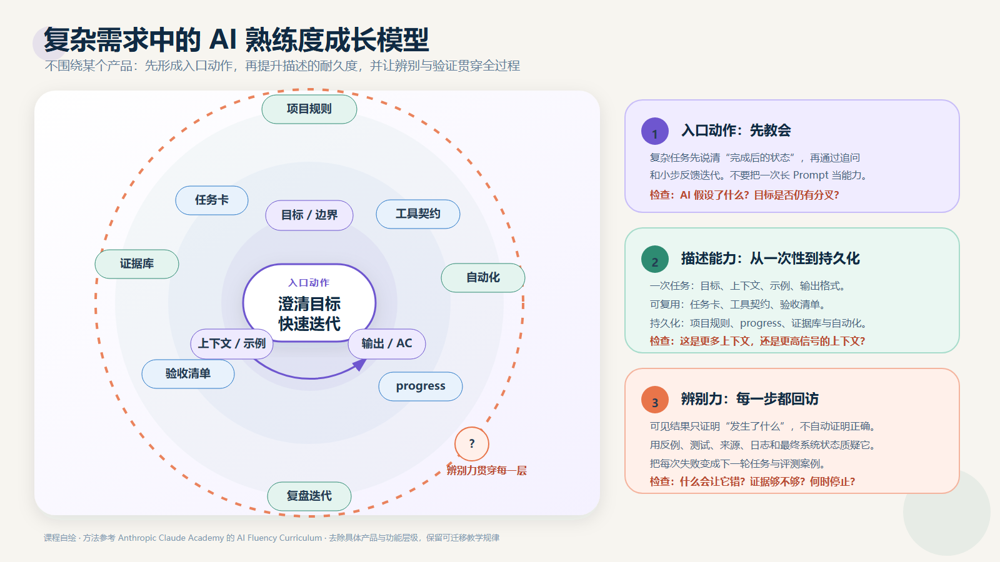

Academy 的课程模型只提供教学节奏：先形成“澄清目标＋快速迭代”的入口动作，再让辨别与验证贯穿每一步。课程自己的工程主线仍是 **需求拆解 → 开发 → 验证 → 问题定位与协同闭环**。

| 优先级 | 官方文章 | 最值得借用的观点 | 建议落点 | 不建议带入的内容 |
|---|---|---|---|---|
| A | [Anthropic Education Report: The AI Fluency Index](https://www.anthropic.com/research/AI-fluency-index) | 迭代与更多熟练行为强相关；产出代码/文档等成品时，用户反而更少质疑推理、检查事实和识别缺失上下文 | 第 1 或 27 页加入一张“越像完成，越要验证”的研究数据卡 | 不把相关性说成因果；保留样本与可观测行为限制 |
| A | [How AI Assistance Impacts the Formation of Coding Skills](https://www.anthropic.com/research/AI-assistance-coding-skills) | 对照实验中 AI 组掌握度更低；把 AI 用于追问、解释和概念理解的人保留得更好 | 实操要求学员解释真相源、不变量、失败原因和 diff，而不是只展示生成结果 | 不把单项研究泛化成“使用 AI 一定降低能力” |
| A | [The 4 Ds of AI Fluency](https://academy.claude.com/tutorials/the-4-ds-of-ai-fluency-behavioral-indicators) | Delegation、Description、Discernment、Diligence 可作为“学员行为观察表” | 结课评价：会不会分工、描述、判断和负责地交付 | 不新增一套工程流程，不取代 SDD / Task / Verify |
| B | [The 4 Properties of AI](https://academy.claude.com/tutorials/the-4-properties-of-ai) | next-token prediction、knowledge、working memory、steerability 解释了为什么 AI 会自信、遗忘上下文、误解意图 | 课前阅读或第 1 页 90 秒心智模型 | 不展开成模型原理课 |
| B | [Can You Trust What AI Tells You?](https://academy.claude.com/tutorials/can-you-trust-what-ai-tells-you) | 信任是随风险调整的刻度，不是开关；高影响决策需要更强审查 | 把 `PASS / FAIL / UNKNOWN` 与风险分级结合 | 不用泛泛“AI 会幻觉”替代具体证据标准 |
| B | [The “Think” Tool: Enabling Claude to Stop and Think](https://www.anthropic.com/engineering/claude-think-tool) | 长工具链拿到新证据后，应暂停、更新假设并检查信息是否齐全，再执行下一动作 | 第 18、30–31 页增加 `Observe → Reframe → Act` 口令 | 不讲具体工具 API；官方更新也不再建议多数场景使用独立 think tool |
| B | [How We Built Our Multi-Agent Research System](https://www.anthropic.com/engineering/multi-agent-research-system) | 只并行真正独立的搜索；Lead 负责任务拆分、预算和最终综合；Worker 返回压缩后的高信号结果 | 附录 J4 的协同演示与分组实操 | 不把“多 Agent”包装成进阶能力本身 |
| C | [Equipping Agents for the Real World with Agent Skills](https://www.anthropic.com/engineering/equipping-agents-for-the-real-world-with-agent-skills) | 把组织的步骤、脚本、模板和资源封装为可发现、按需加载的能力包 | 课后扩展：把 Task Card、MCP 命令和验收模板沉淀成团队能力 | 120 分钟主课不讲产品配置与安装流程 |

如果正文只再吸收两项，优先选择前两篇研究：一篇解释“为什么精美成品更需要辨别”，一篇解释“为什么学员必须能讲清 AI 生成的代码”。4D 适合做评分观察表，其余文章保持讲师备课参考即可。

---

# 附录 J｜GPU 图片、视频与协同实操包

本附录只服务第 28–38 页，不改变原 39 页结构。正文保留概念与判断，附录提供“怎么让学员带入、怎么播放素材、怎么实操、怎么判定”的完整脚本。若严格维持 120 分钟，可选做 J2 的前两轮；若作为半天 workshop，可完整执行三轮。

## J1. 已整理进课件包的素材

| 素材 | 内容 | 课堂用途 | 能证明 / 不能证明 |
|---|---|---|---|
| `gpu-failure-black-screen-13s.mp4` | 连接后远程窗口持续黑屏 | 第 28、32 页故障起点 | 能证明用户现象可复现；不能直接证明 decoder、GPU 或 Surface 是根因 |
| `gpu-failure-black-screen-contact.jpg` | 黑屏录屏关键帧 | 投屏静止讨论、标注最早异常 | 能证明现象时序；不能替代 frameId 日志 |
| `gpu-validation-video-playback-16s.mp4` | 视频播放、窗口切换与遮挡变化 | 第 31、38 页动态验证 | 能证明可见交互与连续性；不能单独证明 owner、EndFrame、targetEpoch 契约 |
| `gpu-validation-video-playback-contact.jpg` | 修复后动态录屏关键帧 | 逐格检查场景覆盖 | 适合对比遮挡前后；不证明 bit-exact 或没有偶发尖峰 |
| `gpu-connection-interaction-contact.jpg` | 连接、打开内容、页面变化、右键交互 | 可选扩展验证 | 证明多种交互被执行；前段含连接信息，公开投屏前需裁剪/脱敏 |
| `nativebuffer-test-pattern.png` | NativeBuffer 阶段色块 | 第 29、34 页 420 import | 只证明该阶段画面；路径事实仍需 EGLImage/OES 日志 |
| `rgba-renderer-test-pattern.png` | RGBA renderer 阶段色块 | 第 29、34 页 retained 输出 | 可与上一张肉眼对照；不能替代 dirty-rect 保留断言 |
| `freerdp-stutter-scenario.jpeg` | 远程桌面真实播放场景 | 第 28 页场景建立 | 是场景图，不是卡顿根因证据 |
| `freerdp-frame-pacing.jpeg` | 视频与侧栏交互画面 | 第 31 页节奏验证 | 辅助说明 workload；单帧不能证明 frame pacing |
| `freerdp-render-queue.jpeg` | 连接与诊断界面 | 第 30 页采集准备 | 证明诊断入口可达；不证明队列行为正确 |
| `freerdp-compositor-scale.jpeg` | compositor 缩放场景 | 第 32 页 resize 讨论 | 用来引出 target/retained 尺寸错位；仍需尺寸与 epoch 日志 |

仓库素材目录：`harmonyos-sdd-workshop-media/`。

## J2. 三轮实操：需求拆解 → 开发 → 验证 → 问题处理

### Round 1｜先把“黑屏”拆成可验证需求（6–8 分钟）

1. 播放 `gpu-failure-black-screen-13s.mp4`，第一次静音、不暂停。
2. 学员只写观察：什么时候进入远程窗口、黑色区域是否变化、鼠标/外层窗口是否仍响应。
3. 第二次播放时建立行为契约：
   - WHEN 远端已有真实更新且 target 可用，THE SYSTEM SHALL 在匹配帧边界提交可见内容。
   - IF primary/retained 尚未 ready，THEN SHALL 保留 fallback 或返回 UNKNOWN，不得把空/白/黑状态标为可显示。
4. 每组把“换 decoder、改 shader、加线程”放入假设栏，不得写入需求栏。
5. 交付：`gpu-diagnosis.md / Symptom + First Missing Evidence`。

讲师追问：如果黑屏窗口外的 HarmonyOS UI 正常，排除了什么？没有排除什么？

### Round 2｜只开发最小观测，不急着修 renderer（8–10 分钟）

任务卡只允许新增/补齐公共帧事件：

```text
runId sessionId frameId seq tsUs path event pts
queueDepth queueAgeMs durationUs owner targetEpoch result reason
```

协同分工：

- 人：冻结本轮问题语义、Allowed/Forbidden 与停止条件。
- AI：只读搜索实际 codec/owner 路径，生成日志点候选和最小 diff；不得顺手换 decoder 或重构队列。
- MCP/设备操作者：构建、安装、启动、复现、抓日志、截图，记录设备与包版本。
- Reviewer：按同一个 frameId 排序，只找“最早缺失/异常”，不评价代码风格。

交付物必须包含命令、退出结果、时间窗与 evidence path。若日志仍串不起完整一帧，结论为 UNKNOWN，下一轮任务是补唯一缺口。

### Round 3｜修复后做正向与破坏性验证（8–12 分钟）

播放 `gpu-validation-video-playback-16s.mp4`，逐项检查：

| 动作 | 可见检查 | 同步证据 | 判定 |
|---|---|---|---|
| 视频连续播放 | 无持续静止、黑/绿块 | queue age、EndFrame gap、present | PASS / FAIL / UNKNOWN |
| 窗口移动/遮挡 | 暴露区域被正确恢复 | dirty rect、retained readiness | PASS / FAIL / UNKNOWN |
| 切换设置/返回 | owner 不双写、不丢写 | owner transition、target identity | PASS / FAIL / UNKNOWN |
| resize/重建 | 无旧尺寸残留 | old/new size、targetEpoch | 当前通常为 UNKNOWN，直到 epoch 闭环完成 |

随后注入一个失败：target 暂不可用、partial+no snapshot、LC=2 且 luma not ready，三选一。观察系统是否 preserve/pause/fail-open，而不是只看“最后有没有画面”。

## J3. 一组图片不是装饰，而是一条证据叙事

建议按以下顺序投屏：

1. **现象图**：黑屏联系表。问“我们直接看到了什么？”
2. **路径图**：420/444 双路径。问“最早应该在哪个边界分流？”
3. **代码图**：三套 decoder 的搜索结果。问“改哪一套才会影响当前命令？”
4. **日志图**：同 frameId 事件。问“第一处缺失在哪？”
5. **设计图**：retained takeover / LC readiness。问“哪条不变量阻止错误接管？”
6. **验证图**：动态录屏联系表。逐项判 PASS/FAIL/UNKNOWN。
7. **剩余风险图**：targetEpoch、AVC420 同步 fallback 顺序、AVC444 软上限。明确哪些仍未完成。

截图时固定四个角标：`runId`、设备/分辨率、codec/path、commit/包版本。没有这四项的图只做场景素材，不进入最终 evidence pack。

## J4. 人、AI、MCP 如何协同，才不会演成聊天秀

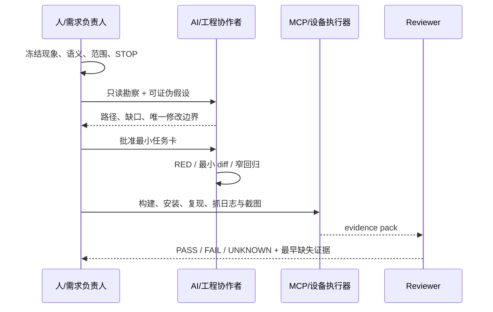


<sub>讲师读图：只有子任务真实独立时才并行；共享同一状态、事务或输出 owner 的任务必须串行或由一个协调者统一提交。多 Agent 是复杂任务的可选组织方式，不是“进阶”的必要条件。图源：Anthropic《Building Effective Agents》。</sub>

真实协同的关键不是谁打字，而是谁拥有哪类决定：

- 人决定问题语义。例如“来的本来就是区域的，不要跟全屏绑定，要自己合成哈”直接否定了 full-frame 假设。
- AI 负责快速搜索、列假设、生成最小修改与测试，但不能替人扩张范围。若人只要求清缓存，AI 不得顺手删除整条 EGLImage 路径。
- MCP 负责重复、可记录的设备动作，不负责把截图解释成系统真相。
- Reviewer 只依赖 spec、task、diff、test 与 evidence；不接受“实现者说已经好了”。

## J5. 现场可直接使用的 Prompt

### 只读定位

```text
只处理 AVC420/AVC444 GPU 送显，不修改文件。根据当前代码与一段录屏，区分：
1) 直接观察；2) 未证实假设；3) 实际 codec/owner 路径；4) 最早缺失证据。
所有结论给出代码符号或日志字段。找不到就写 NOT FOUND。
```

### 最小开发

```text
只允许补 frame trace，不允许修改 renderer、decoder、queue policy、fallback。
字段固定为 runId/sessionId/frameId/seq/tsUs/path/event/pts/queueDepth/
queueAgeMs/durationUs/owner/targetEpoch/result/reason。
先给 RED 与开销预算，再做最小 diff。无法串起完整帧时停止并标 UNKNOWN。
```

### 验收审查

```text
按同一个 runId/frameId 审查 command→decode→retained→EndFrame→present。
对 owner、readiness、dirty-rect 保留、target identity 分别给 PASS/FAIL/UNKNOWN。
视频和截图只能作辅证；缺字段不得推断为 PASS。
```

## J6. 最终证据包目录

```text
evidence/gpu-<runId>/
├── 00-identity.txt              # device / resolution / codec / commit / package
├── 01-symptom.mp4               # 原始复现，未剪掉失败过程
├── 02-frame-trace.txt           # 同 frameId 排序
├── 03-diagnostics.txt           # queue/decode/compose/present 聚合
├── 04-before.png
├── 05-after.png
├── 06-diff.patch
├── 07-test-output.txt
├── 08-device-build-install.txt
└── acceptance.md                # 每条契约 PASS / FAIL / UNKNOWN
```

## J7. 仍在本地、但未直接打包的可选录屏

| 本地文件 | 时长/内容 | 使用建议 |
|---|---|---|
| `LOCAL_ONLY/屏幕录制 2026-05-21 211221.mp4` | 约 61 秒；连接、打开内容、页面变化、右键交互 | 很适合完整 E2E，但前段含连接信息；先裁剪/脱敏再公开投屏 |
| `LOCAL_ONLY/屏幕录制 2026-06-03 102420.mp4` | 约 67.7 秒；多窗口与图片操作 | 含私网地址、用户名与私人窗口，不建议原样用于公开课 |
| `LOCAL_ONLY/屏幕录制 2026-08-07 144716.mp4` | 约 11.3 秒；新版连接页与 USB 选项 | 属于产品/USB 演示，不放进 GPU 28–38 页 |
| `LOCAL_ONLY/屏幕录制 2026-06-03 102437.mp4` | 0 字节 | 无效素材，禁止列入验证证据 |

## J8. 讲师最终检查

- [ ] 每段视频播放前有问题，播放后有判定，不是背景素材。
- [ ] 故障录屏保留失败过程，没有只展示“修好了”。
- [ ] 截图标明 runId、设备、codec/path 与版本。
- [ ] 当前实现、历史方案、TARGET/GAP 使用不同标签。
- [ ] `confirmed codec` 与实际 `SurfaceCommand.codecId` 不混用。
- [ ] 420 与 444 不共享错误的 Buffer/compositor 假设。
- [ ] 没有把单帧截图、漂亮色块或流畅视频单独当作系统 PASS。
- [ ] 公开投屏前完成 IP、用户名、聊天窗口与密码区域脱敏。

---

# 附录 K｜第 28–38 页逐页讲授导航

## K1. 三种授课模式

| 模式 | 时长 | 必讲/必做 | 适用场景 |
|---|---:|---|---|
| 核心迁移版 | 28 分钟 | 28 黑屏带入、29 双路径、30 同帧 trace、35 可信背景、38 验收矩阵 | 保持原 120 分钟总课时 |
| 完整演示版 | 45 分钟 | 核心版 + 31 指标案例、32 resize、33 三套 decoder、36 队列推演、37 LC 卡片 | 技术分享、内部 workshop |
| 分组实操版 | 60–75 分钟 | 完整演示版 + 34 Buffer 实操 + 故障注入 + evidence pack 互审 | 半天课程、训练营 |

“丰富”不等于每次全部讲完。课件负责给讲师足够选择，现场只沿一条证据主线推进。

## K2. 逐页节奏表

| 页 | 开场问题 | 第一层揭示 | 第二层揭示 | 学员动作 | 本页带走 |
|---:|---|---|---|---|---|
| 28 | 黑屏第一步改哪里？ | 区分观察与解释 | 冻结诊断交付 | 填三栏事实表 | 现象先变成可证伪问题 |
| 29 | confirmed=444 是否等于走 444？ | 能力确认 ≠ 命令分流 | owner 又是第三层事实 | 画命令身份证 | 先定位真实数据路径 |
| 30 | frameId 单独够不够？ | 加 run/session/seq/time | 找最早断链而非最终失败 | 重排 trace | 观测本身也是最小任务 |
| 31 | decode 低为何仍卡？ | 指标只排除一部分假设 | 上游、queue、lifecycle 都可能 | 写下一条反证 | 指标选择层，不宣布根因 |
| 32 | 每帧成功为何 resize 残留？ | old composite 写 new target | 入队检查不足以阻止晚回调 | 选择 epoch 校验点 | Buffer 与 target 生命周期要闭环 |
| 33 | 为什么改了 decoder 没效果？ | 两层三套接入 | callback ≠ 已显示 | 三组认领证据 | diff 必须落在真实 consumer |
| 34 | `width*height` 能算 UV offset 吗？ | runtime stride/sliceHeight | 420 与 444 证据完全不同 | 算 8×4 Buffer | 小样本先验证格式契约 |
| 35 | 白帧是 clear color 吗？ | 被提交内容本身已白 | readiness 才是最早异常 | 排除五轮假设 | 对象存在不等于内容可用 |
| 36 | latest-frame-wins 能用于 dirty rect 吗？ | 每个 command 是状态增量 | 720 后同步 fallback 仍有顺序 GAP | 队列卡片推演 | 局部更新不能随便丢历史命令 |
| 37 | luma/chroma 为什么不用双 decoder？ | LC 是同一协议状态 | readiness 决定能否接管 | 翻 Y/UV 卡 | 单 decoder 保持参考与参数状态 |
| 38 | 视频流畅是否全部 PASS？ | 可见结果只是一层 | targetEpoch/背压仍可能 UNKNOWN | 填验收矩阵 | 结束于证据，不结束于观感 |

## K3. 一条连续案例怎么贯穿 11 页

不要把 28–38 页讲成 11 个互不相关的技术点。建议始终追踪同一个案例：

```text
用户说“远程画面黑/卡”
→ 先冻结现象（28）
→ 判断实际是 420 还是 444，谁持有输出（29）
→ 补同帧 trace（30）
→ 用指标选择 queue / content / lifecycle（31）
→ 发现 resize/target 错位（32）
→ 确认不能改错 decoder（33）
→ 用小 Buffer 验证 import/plane（34）
→ 首次接管需要可信 retained/base（35）
→ 压力下还要保序与 fail-open（36）
→ 444 另有 LC/readiness 语义（37）
→ 用公共契约逐条验收，留下诚实 GAP（38）
```

每翻一页，都在白板保留六个字段：`现象 / 当前路径 / 最早异常 / 唯一修改 / 反证 / verdict`。学员会看到结论如何随着证据改变，而不是只记住最终答案。

## K4. 推荐讲师口播主线

### 开场

> “今天我不演示 AI 一次把 bug 猜对。我演示的是：当 AI 第一轮猜错时，我们怎样用本地代码、设备日志、截图和视频，把它拉回真实边界。”

### 需求拆解

> “用户说的是卡顿，但工程任务不能叫‘优化卡顿’。我们先把它拆成：哪条 codec 路径、哪一个 frame、哪个 owner、在哪个 target 上第一次不满足显示契约。”

### 开发

> “第一轮开发甚至不修画面，只补能把 command、decode、retained、EndFrame、present 串起来的观测。因为没有这条链，后面的每个优化都无法证明有效。”

### 发现问题后的处理

> “证据推翻假设不是失败，而是本轮最值钱的产出。比如我们原来把输入当全帧，人一句‘来的本来就是区域的’，就迫使设计从直接 present 收敛到 retained composite。”

### 验证

> “视频流畅是必要的用户证据，但不是全部契约。我们还要确认没有双写、没有 stale callback、局部更新没丢像素、LC readiness 正确。缺一个关键事实就写 UNKNOWN。”

## K5. 图片与视频的现场使用方式

### 黑屏录屏

- 第一次：不暂停，只让学员描述。
- 第二次：在进入黑色窗口时暂停，标注“UI alive / remote content unknown”。
- 第三次：配合 frame trace，指出视频时间与日志时间如何通过 runId/time range 对齐。

### 色块图片

- 先并排显示，不给标题，让学员找差异。
- 揭示两张视觉近似，但一张来自 NativeBuffer 阶段，一张来自 RGBA renderer。
- 追问：如果画面相同，为什么仍要保留 EGL import 和 rect 外 hash 两种证据？

### 修复后动态录屏

- 不问“是不是好了”，改问“这 16 秒覆盖了哪几条 AC，没覆盖哪几条？”
- 让学员在验收矩阵中只勾可见交互相关项。
- owner、EndFrame、targetEpoch 仍由日志决定。

### E2E 三帧联系表

- 30s：内容打开，证明会话与远端内容可达。
- 45s：页面变化，证明不是一张静态缓存图。
- 58s：右键交互，证明输入与画面更新形成闭环。
- 三帧仍不能证明无偶发卡顿，需要完整视频和分段指标。

## K6. 学员证据卡

每组打印或复制一张：

```markdown
# GPU Diagnosis Card

## 1. Symptom
- 场景/动作：
- 设备/分辨率：
- 录屏时间：

## 2. Actual Path
- negotiated codec：
- command codecId：
- decoder/consumer：
- RenderOutputOwner：

## 3. First Abnormal Boundary
- last known-good event：
- first missing/abnormal event：
- direct evidence：

## 4. One Hypothesis
- hypothesis：
- falsifier：
- only allowed probe/change：

## 5. Verification
- visible video/screenshot：
- same-frame trace：
- retained/readiness：
- owner/target：
- verdict：PASS | FAIL | UNKNOWN
```

## K7. 讲师故意设置的四个“坑”

1. **先给 `confirmed=avc444`**：看学员是否忘记检查实际 command codecId。
2. **给两张看起来一样的色块图**：看学员是否用视觉替代 Buffer 路径证据。
3. **给低 CPU/低 decode 数据**：看学员是否过早宣布 GPU 正常。
4. **播放流畅验证视频**：看学员是否把 targetEpoch、queue ordering 等未知项也勾成 PASS。

坑的目的不是难住学员，而是让“证据等级”在课堂中真实发生一次。

## K8. 设备不可用时的诚实降级

| 现场阻塞 | 仍可完成 | 必须保持 UNKNOWN |
|---|---|---|
| 无法连接远端 Windows | 回放原始录屏、分析代码与历史日志 | 本次设备可复现性 |
| HAP 构建失败 | 继续做路径勘察、任务卡与 trace schema | 本次包行为 |
| 无 AVC444 样本 | 用 8×4 plane 练习与历史 evidence | 真机 LC present |
| 日志缺 frameId | 证明缺口并设计最小观测任务 | 同帧因果链 |
| targetEpoch 未实现 | 做 resize 故障时间线与设计审查 | stale callback 已被阻止 |

## K9. GPU 段评分建议

| 维度 | 分值 | 满分表现 |
|---|---:|---|
| 需求拆解 | 15 | 把“卡”拆到场景、路径、边界与 AC |
| 路径事实 | 15 | 区分协商、command codecId、consumer、owner |
| 同帧证据 | 20 | 找到 last-good 与 first-abnormal，不只贴大段日志 |
| 最小开发 | 15 | diff 只落在允许边界，RED 与反证明确 |
| Buffer/retained | 10 | 420/444 不混用假设，小样本验证正确 |
| 生命周期/顺序 | 10 | 能识别 targetEpoch 与 queue ordering GAP |
| 验收诚实度 | 15 | 视频、日志、状态分别判定，缺证据保留 UNKNOWN |

不按代码行数、AI 回复长度、截图数量或“现场一次成功”评分。

---

# 附录 L｜真实 Session 证据卡

本附录保存可进入课堂的真实问题片段。它不是聊天记录归档：只保留能够改变工程判断的原始提示词、初始假设、反证、修正和迁移规则。投屏时隐藏个人路径、设备标识、账号、地址和无关上下文。

## L1. 账号变化：从延迟补丁到跨进程事实

| 阶段 | 证据 |
|---|---|
| 原始问题 | “新增规则为什么不会重新读取账号信息” |
| 约束升级 | “先不要改，先看看要怎么改，怎么实时拿到账号信息” |
| 错误假设 | 系统账号事实只是刷新慢，增加 2 秒延迟即可 |
| 用户反证 | “延迟 2S 还是拿不到，你分析得不对吧” |
| 最小观测 | Provider raw、snapshot signature、handler count、进程身份 |
| 边界发现 | Extension 与 UI 是两个进程，进程内静态状态不能传事实 |
| 局部 GREEN | CommonEvent 后卡片刷新，但已有规则和记录没有刷新 |
| 职责修正 | 事实发布、业务 reconcile、UI refresh 分开判定；规则收敛进入 Service |
| 真机链路 | 删除 115 → raw `[100,114]` → signature `100,114` → firewall handler success |
| 新缺口 | `previous=` 导致首次 diff 基线失真；历史日志无统一 eventId；UI 阶段没有完整日志 |

课堂用途：P5、P16、P18、P24；完整脱敏日志见 `evidence/mdm/account-cross-process-log.md`。迁移问题：权限、应用卸载、日志页面还有哪些消费者依赖同一账号事实？

## L2. MCP：工具返回成功不等于业务成功

| 阶段 | 证据 |
|---|---|
| 原始问题 | “之前发现 MCP 工具基本都失败了，请帮我看看为什么” |
| 范围扩大 | 使用真实 SecurityTool 测试全部工具，并保存完整测试结果 |
| 关键分层 | 外部客户端 Schema、工具调用、业务返回、设备最终状态 |
| 代码事实 | App 内部已有 `getNetFirewallPolicy` / `getNetFirewallRules` 系统读取 |
| 暴露问题 | E2E action map 没有 `firewall.get_runtime_state`，内部 getter 尚未变成验收侧结构化事实 |
| 结论 | 协议成功、Tool成功、Business成功、System成功必须分别记录 |

课堂用途：P25–P27；证据边界见 `evidence/mdm/firewall-runtime-readback.md`。学员任务：对一个 `tool returned ok` 的结果给出四层判定，并指出最小缺失证据。

## L3. 开关机事件：真实生命周期推翻静态分析

| 阶段 | 证据 |
|---|---|
| 现象 | 开关机事件缺失 |
| 动作 | 增加诊断日志、重新构建安装、等待用户真实重启 |
| 纠偏 | “你分析得不对”，要求重新以真机生命周期为准 |
| 结果 | 复现后行为恢复，原假设不足以解释结果 |
| 收尾 | 删除只用于诊断且已无长期价值的噪声日志 |

迁移规则：需要重启、登录、权限激活或远端连接的事实不能靠静态代码独立证明；诊断代码完成使命后也要接受最小化审查。

## L4. 权限策略：乐观 UI 与系统状态撕裂

| 阶段 | 证据 |
|---|---|
| 现象 | 第一次进入数据为空、按钮状态与实际策略不一致 |
| 错误方向 | 先在组件内部更新选择状态，再等待系统写入结果 |
| 用户约束 | 失败回滚原本就是设计目的，状态只应在成功后改变 |
| 修正 | ViewModel 保持系统事实，UI pending 与 committed state 分离 |
| 验收 | 成功、失败、刷新、重新进入、多账号分别验证 |

课堂用途：P19、P22、P39。迁移规则：乐观更新只能改变“pending intent”，不能提前伪造“system committed”。

## L5. GPU：截图正确也可能是持续显示错误

| 阶段 | 证据 |
|---|---|
| 现象 | AVC444 黑屏、颜色错误、闪烁；截图偶尔能抓到正确帧 |
| 危险结论 | 单张截图正确，因此 renderer 已修复 |
| 用户约束 | “不要怀疑，要看日志，没有就加” |
| 最小观测 | negotiated codec、command codecId、frameId、dirty rect、decoder、owner、present |
| 边界发现 | 截图只证明采样瞬间；帧配对、stride、LC readiness 或 owner 仍可能错误 |

课堂用途：P28–P38。迁移规则：可见证据必须与同一 runId/frameId 的运行时事实对齐。

## L6. AVC420：删除 cache 变成删除整条路径

| 阶段 | 证据 |
|---|---|
| 用户授权 | 移除一个尚未提交的 NativeBuffer/EGLImage cache 尝试 |
| 实际修改 | 扩大为删除整条相关实现路径 |
| 用户纠偏 | “我只让你把 cache 清除掉，你给我全删除了，反思一下，不要改代码了” |
| Trace 判定 | 即使能编译，仍因超出授权范围而 FAIL |
| 正确动作 | 立即停手，识别精确对象，只回滚越界部分，不继续用新改动掩盖错误 |

课堂用途：P14、P27、P36。迁移规则：Allowed/Forbidden 不只写文件，还要写具体对象、行为和删除边界。

## L7. Session Evidence Card 模板

```markdown
# Session Evidence Card — <问题名称>

- 能力：需求 | 上下文 | Workflow/Agent | 工具 | Eval | Harness
- 原始提示词：
- 用户授权边界：
- AI 初始假设：
- 初始动作：
- 直接反证：
- 最早异常边界：
- 被推翻的方案：
- 最小修正：
- Trace verdict：PASS | FAIL | UNKNOWN
- Outcome verdict：PASS | FAIL | UNKNOWN
- 仍缺证据：
- 可迁移规则：
- 适用页码：
```

选材规则：优先保留“改变了下一步”的短片段，不复制整段聊天；同一结论至少绑定一份代码、日志、测试、截图或系统回读证据。只有提示词、没有环境事实的片段只能作为问题素材，不能作为技术结论。

---

# 附录 M｜四线闭环与授课成效审计

## M1. 方法论、需求、演示、问题必须在同一页链路相遇

| 教学线 | 学员必须学会 | 主案例落点 | 不能退化成 |
|---|---|---|---|
| 方法论 | 选择规格、上下文、Agent、工具、Eval 与 Harness 控制方式 | P3、P13–P17、P25–P27 | 背六个名词或读 Anthropic 文章 |
| 具体需求 | 把多用户、事务、进程、帧链等真实复杂性写成可测试行为 | P4–P12、P19–P24、P29–P38 | 只看最终代码答案 |
| 演示/截图 | 判断证据等级，复现动作并保存可追踪产物 | P1、P15、P18、P25、P28、P30、P34、P38 | 看一张图后宣布“已经好了” |
| 处理问题 | 让假设被反证，控制修改范围，保留 UNKNOWN 和剩余风险 | P16、P18、P21–P22、P24、P31、P35–P36 | 罗列可能原因或连续打补丁 |

四条线缺一条，该段都不能算完成：只有方法没有问题会空；只有需求没有方法难迁移；只有演示没有系统事实会误判；只有正确答案没有错误过程，学员遇到新问题仍不会处理。

## M2. 120 分钟内学员必须产生的九个动作

| 页码 | 学员动作 | 当场产出 | 讲师判定 |
|---|---|---|---|
| P1 | 说出真机截图能证明和不能证明什么 | evidence scope | 不把 UI 当 system truth |
| P5–P6 | 找实现分叉并冻结一个产品语义 | Open Decision | 答案会改变代码/测试 |
| P13 | 完成只读勘察 | 入口、事实源、GAP | 所有符号可定位 |
| P15 | 解释目标 RED | failure statement | 失败来自目标行为而非环境 |
| P17 | 做上下文 A/B 交接 | Next / Forbidden / Missing evidence | 不靠完整聊天继续 |
| P18/P24 | 选择最小日志并重排跨进程链 | earliest anomaly | 能推翻当前假设 |
| P26–P27 | 设计证据契约并互审 | Trace/Outcome verdict | 只输出 PASS/FAIL/UNKNOWN |
| P30/P34 | 还原 frameId 与 plane/rect 不变量 | GPU diagnosis card | 420/444 不混用假设 |
| P39 | 将七问迁移到权限首次加载问题 | 新 Task Card | 不回答“加延迟” |

如果现场时间不足，优先保留 P6、P13、P18/P24、P26/P27、P30 和 P39；可以缩短讲师技术展开，但不要删除学员决策动作。

## M3. 每次演示统一使用七步脚本

```text
1. Show     展示原始需求、现象、截图或失败输出
2. Ask      只问“直接看到了什么”，禁止猜根因
3. Guess    揭示 AI 第一版判断或修改
4. Falsify  给出会推翻它的日志、进程事实、getter 或帧证据
5. Decide   学员选择下一条最小观测或修改边界
6. Verify   运行 RED/GREEN、回归、构建和系统回读
7. Transfer 换一个模块，复用同一控制方法
```

讲师不要直接从 Show 跳到 Verify。课程精髓位于 Guess → Falsify → Decide：学员必须亲自经历“第一反应不够、证据改变下一步”。

## M4. 四类常见授课失败

1. **方法论过满**：连续解释多个框架名词，却没有原始需求和失败证据。处理：方法图放备注，主画面先放项目事实。
2. **现场演示过冒险**：临时切历史提交、构建或连接远端，时间耗在环境。处理：训练分支预构建；实时操作失败时切换到带命令、退出码、commit 的回放证据。
3. **问题处理像公布答案**：讲师直接说跨进程、stride 或 owner。处理：分轮揭示证据，让学员先选择下一条探针。
4. **截图替代验收**：画面正常就把未知项全部勾 PASS。处理：每张图固定写“能证明/不能证明”，最终由系统 getter 或同帧 trace 收口。
