# 使用 AI 进阶能力实现较为复杂的需求

> 以真实 HarmonyOS MDM 与 FreeRDP GPU 送显问题为载体，跑通需求拆解、上下文组织、Agent 协作、开发、验证、问题定位与证据交付

> **Rich V5 / 双案例工程闭环版**：保留 39 页与 120 分钟结构，不压缩 V4 的事实、媒体与 Session 证据；重新把“AI 如何完成复杂需求”放回主角位置。案例一用 MDM 跑通需求到验收，案例二基于 55 万行级 FreeRDP 源码，从“原视频处理走 CPU/软件路径、未走 GPU，用户感知卡顿”的已冻结背景出发，演示代码认知、跨平台调研、HarmonyOS 对接、最小穿刺、任务拆解、开发循环、排障与交付验收。具体 CPU/FPS 数值、before/after 录屏、运行路径截图和长稳结果在没有同 run 证据前保持占位或 `PENDING/UNKNOWN`。

## 课程定位

这不是“AI 提示词技巧课”，也不是项目复盘。课程面向已经具备 HarmonyOS / ArkTS / C++ 基础的新员工，通过两个真实代码库，带着学员完成一次可追踪、可调试、可验收的复杂需求开发。

这里的“进阶”不是提示词更长、模型更贵或 Agent 更多，而是工程师能够驾驭复杂需求里的六类不确定性：需求会分叉、上下文会膨胀、执行链会跨工具、实现会跨会话、结果容易被误判、修改范围可能悄悄扩大。

| AI 进阶能力 | 真实问题先行 | 本课实践动作 | 可检查产物 |
|---|---|---|---|
| 需求澄清与边界冻结 | “全局禁用”“默认策略”“单设备规则”被 AI 混为一谈 | 歧义树、EARS、行为矩阵、不变量 | `spec.md` |
| 上下文工程 | 长 Session 反复搜索，换会话后重新猜问题 | 只读勘察、证据索引、按需检索、新会话交接 | `progress.md` + evidence index |
| Workflow / Agent 分工 | 构建安装等固定步骤与开放排障混在一起 | 固定动作走 Workflow，假设选择与最小修改交给 Agent | Task Card + execution trace |
| 工具契约与环境事实 | MCP 返回成功，但设备业务状态没有成功 | 分开 protocol、tool、business、system 四层结果 | tool result + getter/log |
| Eval 与反证 | UI 绿、测试绿或截图正常，但系统事实仍错误 | RED/GREEN、故障注入、状态回读、Trace/Outcome 双审 | `PASS / FAIL / UNKNOWN` |
| 长任务 Harness 与协同 | AI 越界修改、实现者自评完成、交接丢失事实 | 小任务、Git checkpoint、证据包、风险驱动 Reviewer | review verdict + next task |

公开的 AI Agent 工程研究与实践在这里充当“方法论参照系”，不是任何厂商的产品教程。本课用真实 Session 解释方法为什么必要，再把抽象原则落到 HarmonyOS 的规格、代码、设备日志、截图、视频和系统 getter 上检验。公开的 AI 熟练度课程模型只轻量参考其“先澄清与迭代、每步都做辨别”的教学节奏，不作为本课主方法论。完整来源、候选文章、工程映射与取舍见附录 C10。

每个关键页面都沿用同一课堂结构：

```text
问题现场 → AI 初判 → 反证 → 最小修正 → 验收 → 可迁移规则
```

页面右上角建议固定四个小标签：`能力 / 案例 / 问题 / 产出`。讲师如果只讲了正确做法，却没有让学员看到错误方案为何失败，该页视为未完成。

Agent 组织方式按风险升级，不把“Agent 更多”误当成“能力更进阶”：

| 任务特征 | 默认组织方式 |
|---|---|
| 单文件、强测试、低风险 | 单 Agent + 确定性检查 |
| 构建、安装、日志采集 | 固定 Workflow |
| 多文件、路径未知、需要探索 | Agent 只读勘察 + Task Card |
| 跨进程、事务、权限、GPU 状态 | Planner / Implementer 分离 |
| 高风险或接近模型可靠边界 | 增加独立 Reviewer / Evaluator |

课程主线不是一次瀑布交付，而是两个案例重复同一个受控循环：

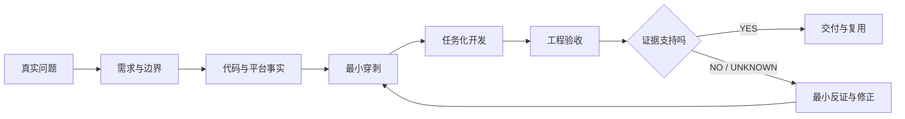

- **MDM 主实践**：Feature-first。先冻结多用户、状态、事务和失败语义，再让 AI 实现。
- **远控第二案例**：Context-first + Evidence-first。先控制 55 万行级代码库的上下文，再研究现有平台契约并映射 HarmonyOS；先让一帧走通硬解，再扩展到生命周期、队列、AVC420/AVC444 和最终验收。
- **MCP 的位置**：不是第三套方法，只负责受控循环中的 Verify——构建、安装、操作、日志、截图和验收取证。

判断 AI 是否正确不靠“它解释得很像”，固定做三层检查：

| 判断层 | 问题 | 合格证据 |
|---|---|---|
| 方案正确 | 是否沿用了协议和成熟平台已经存在的契约，而非重写一套想象中的架构 | 原生调用链、平台 API、Architecture Decision |
| 实现正确 | 代码是否只改变允许边界，并让同一输入在目标路径产生预期状态转换 | diff、单测、构建、路径日志、故障注入 |
| 结果正确 | 用户问题是否在真实设备和同一场景下改善，同时没有破坏回退、交互与稳定性 | before/after、CPU/FPS、真机视频、长稳、回归矩阵 |

任何一层缺证据都不能宣布完成：先标记 `UNKNOWN`，再补一条能推翻当前判断的最小观测；如果证据已经否定方案，就停止扩大修改，回到最近一个可信 checkpoint。

## 学员最终交付

```text
workshop/
├── mdm/
│   ├── spec.md
│   ├── design.md
│   ├── tasks/T01.md
│   ├── progress.md
│   ├── patch.diff
│   ├── acceptance.md
│   └── evidence/
│       ├── unit-test-red.txt
│       ├── unit-test-green.txt
│       ├── build.txt
│       ├── device-log.txt
│       ├── runtime-state.json
│       └── screenshot.png
└── gpu-diagnosis.md
```

最低通过标准：同一条行为必须能够从需求 ID 追踪到设计、不变量、任务、失败测试、最小代码差异和设备证据；设备或系统 getter 不可用时标记 `UNKNOWN`，不能用 UI 文案代替系统事实，也不能把 mock 结果写成 PASS。

## 120 分钟课程结构

| 时间 | 模块 | 学员动作 | 当场产出 |
|---|---|---|---|
| 00–18 | 背景与问题 | 区分对话式协作、仓库内 Agent 与异步任务代理，读懂 Agent Loop，判断“AI 完成”与“工程交付” | 一张复杂需求风险清单 |
| 18–42 | 需求闭合 | 资产同步、歧义选择、EARS、行为矩阵 | `spec.md` |
| 42–72 | 设计与受控迭代 | RFC、Story、真相源、任务卡、RED→GREEN、故障注入 | `design.md`、patch、`progress.md` |
| 72–88 | 平台与验收 | 权限预检、跨进程、MCP 设备证据 | `acceptance.md`、evidence |
| 88–116 | 远控第二案例 | 大库认知、跨平台调研、HM 方案、最小穿刺、任务与验收、开发排障 | codebase map、ADR、spike evidence、`gpu-diagnosis.md` |
| 116–120 | 收束 | 同伴审阅与七问迁移 | 最终交付包 |

每个模块结束固定做一次辨别力检查：**当前结论最可能错在哪里？我们看到的是表面输出、执行轨迹，还是最终系统事实？还缺哪一条证据？**

## 事实标签

材料对代码事实和课堂目标严格分层：

- `CURRENT`：仓库当前代码已经具备，可现场打开验证。
- `SESSION FACT`：真实 Session 中出现过的提示词、判断、日志或用户反馈。
- `GAP`：仓库当前仍存在的风险或未闭合问题。
- `TARGET`：本轮课堂希望设计或实现的能力。
- `TEACHING`：为了教学建立的 FR / D / T 编号，不是仓库既有资产。
- `TEACHING COMPOSITE`：将多个真实问题组合成一条可连续授课的案例，不表示它们在同一次历史执行中同时发生。

## 视觉与 PPT 制作约定

- 画面：16:9，浅灰白技术讲解页 + 深色代码 / 日志舞台。
- 色彩：深海军蓝=结构；蓝=规格；紫=AI / 受控循环；橙红=失败；绿=证据 / PASS。
- 字体：HarmonyOS Sans SC / 思源黑体；代码 JetBrains Mono。
- 页型只使用六种：`CLAIM`、`MAP`、`CODE`、`DEBUG`、`LAB`、`CHECKPOINT`。
- 每页只有一个视觉中心；画面正文建议 250–400 汉字；代码不超过 12 行；大表、提交历史和完整答案进入讲师备注。
- 页脚固定进度带：`需求 ─ 设计 ─ 任务 ─ 代码 ─ 调试 ─ 证据`，只高亮当前阶段。

## 仓库范围

- MDM：`repos/security_tool`
- 远控：`repos/harmony-windows-bridge`
- FreeRDP：`repos/harmony-windows-bridge/harmony/third_party/FreeRDP`
- 测试与验收辅助：`repos/harmonyos-dev-mcp`

---

# 39 页 PPT-ready 讲师稿

## 第 1 页｜AI 已经会写代码，为什么复杂需求仍然经常交付失败？

### PPT 内容

# 使用 AI 进阶能力实现较为复杂的需求

**从“让 AI 写代码”，升级到“让 AI 交付可验证的系统结果”**

开场只放一个问题：

> AI 修改完成、测试通过、页面也能打开——这能证明需求已经交付吗？

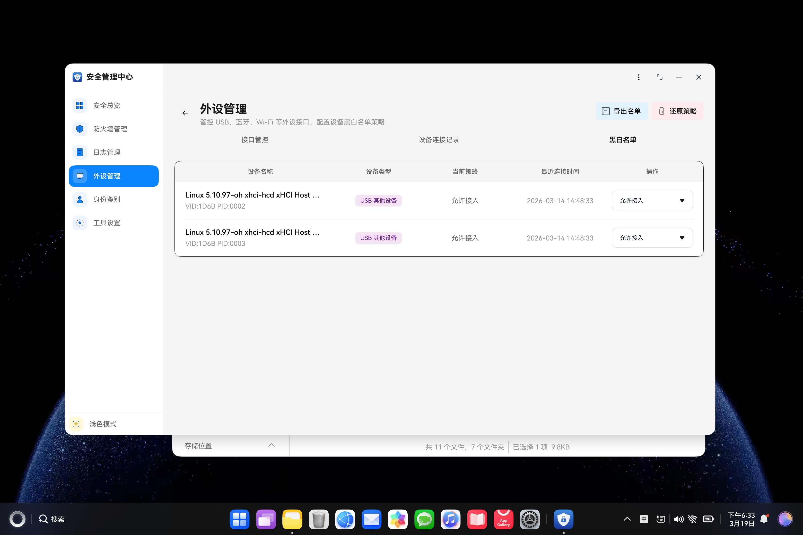

```text
需求：USB 全局总控、默认规则和设备黑白名单必须协同
AI：已完成
测试：816 / 816
页面：设备显示“禁止接入”
MDM 回读 / 实物行为：？
```

页脚小字：

```text
本课不比较模型排行榜，也不教授万能 Prompt。
我们只解决：复杂需求如何被拆解、执行、纠偏和验收。
```

### 主视觉

- 标题页保持克制，不画方法论大转盘。
- 可在右下角小幅使用真实 SecurityTool 页面，作为后续案例预告，不在本页解释调用链。
- 禁止使用“紫色 AI 中心 + 十几个节点”的自绘总览图。

### 讲师备注

开场不要先解释 SDD 名词。先问：“AI 说改完了、单测也过了，但 USB 系统回读和实物行为还没验证，这算完成吗？”让学员明确本课的完成定义不是代码生成，而是系统事实可证明。

课名里的“较为复杂”要在这一页说清楚：不是代码行数多，而是需求存在分叉、状态跨用户与进程、实现跨工具与会话、失败会留下部分状态、最终结果必须由设备事实验证。课名里的“进阶能力”则对应上下文工程、Workflow / Agent 分工、工具调用、长任务记忆、评估反证和协同交接。

两个案例不是为了炫技。MDM 展示复杂业务如何被拆成可实现规格；GPU 展示现象模糊时如何先取证再改。课程结束后，学员应能把方法迁移到任何 HarmonyOS 复杂需求。

### 演示动作

快速展示一组对照：绿色单测输出 + 页面显示“禁止接入”，但 MDM 系统回读和实物行为仍是 `PENDING`。此时不解释原因，只留下悬念。

### 通过条件

学员能复述：**AI 输出只是候选变更，测试与设备事实共同决定是否完成。**

### 素材

- MDM 首页真机截图
- 一段单测全绿输出
- 一份 USB 页面回显与系统回读待交叉验证的证据卡

---

## 第 2 页｜AI 能力越强，越需要把“完成”说清楚

<!--
type: CLAIM
section: ALIGNMENT
layout: split-image
time: 3m
progress: 需求
-->

### 画面

模型可以写出漂亮答案，却不知道你心里真正的“完成”。

- 太具体：把偶然路径写死，规则越多越脆弱。
- 太模糊：默认人和 AI 共享同一套背景、优先级与判断标准。
- 刚刚好：目标清楚、边界可执行，并允许在不确定时求助。


> **对齐的第一步不是把 Prompt 写得更长，而是让“期望行为”可以被双方检查。**

### 讲师备注

这一页只建立问题，不急着讲 SDD、Ralph 或 MDM。Anthropic 把系统提示词描述为一个需要校准的区间：过度具体会把流程写成脆弱的 if-else；过于模糊又会假设模型拥有并不存在的共享上下文。工程上的“刚刚好”不是固定长度，而是能够清楚表达目标、可用工具、输出形式、求助条件和必要边界。

来源：Anthropic《Effective context engineering for AI agents》。

### 通过条件

学员能区分“模型能力强”和“模型知道本任务怎样算完成”是两件事。

---

## 第 3 页｜复杂任务靠的不是更长 Prompt，而是可持续上下文

<!--
type: MAP
section: ALIGNMENT
layout: visual-compare
time: 3m
progress: 需求
-->

### 画面


**单轮问答**主要优化一句输入；**长任务 Agent**则要持续选择和恢复：

`系统指令 / 文档 / 工具 / 消息历史 / 外部记忆 / 新证据`

> **复杂任务的上下文不是一次装满，而是随着行动持续筛选、记录和恢复。**

### 讲师备注

上下文越多不代表效果越好。长任务中，工具输出、搜索结果和中间决策会不断积累，模型可能丢失重点，也可能在换会话后忘记关键约束。因此需要把高价值事实放进可持续资产，而不是只留在聊天窗口：规格写入 `spec.md`，执行边界写入 Task Card，进度与未决项写入 `progress.md`，最终判断写入 evidence。

来源：Anthropic《Effective context engineering for AI agents》。

### 通过条件

学员能解释为什么“把所有资料一次塞给 AI”不等于上下文工程。

---

## 第 4 页｜对齐发生在三方之间：人定目标，AI 提方案，环境给事实

<!--
type: MAP
section: ALIGNMENT
layout: roles
time: 3m
progress: 需求
-->

### 画面


| 角色 | 不可替代的职责 |
|---|---|
| 人 | 定义目标、优先级、禁止范围和高风险决策 |
| AI | 检索上下文、提出方案、执行最小动作并说明不确定性 |
| 环境 | 用测试、日志、系统回读和真实画面给出事实反馈 |

> **人不替 AI 做每一步；AI 也不能替人定义“什么算对”。**

### 讲师备注

这一页建立后面整门课的共同工作模型。人的重点不是逐行指挥，而是决定目标和约束；AI 的价值不是替人拍板，而是扩大搜索、推导和执行能力；环境负责提供 ground truth。没有环境反馈，AI 只能根据自己的输出评价自己；没有人的目标与边界，环境即使返回大量日志，也不知道该优化什么。

来源：Anthropic《Building Effective Agents》。

### 通过条件

学员能说清楚目标、候选方案和最终事实分别由谁负责。

---

## 第 5 页｜人能判断“更好”，却未必能一次写清目标

<!--
type: CLAIM
section: ALIGNMENT
layout: case-visual
time: 4m
progress: 需求
-->

### 画面

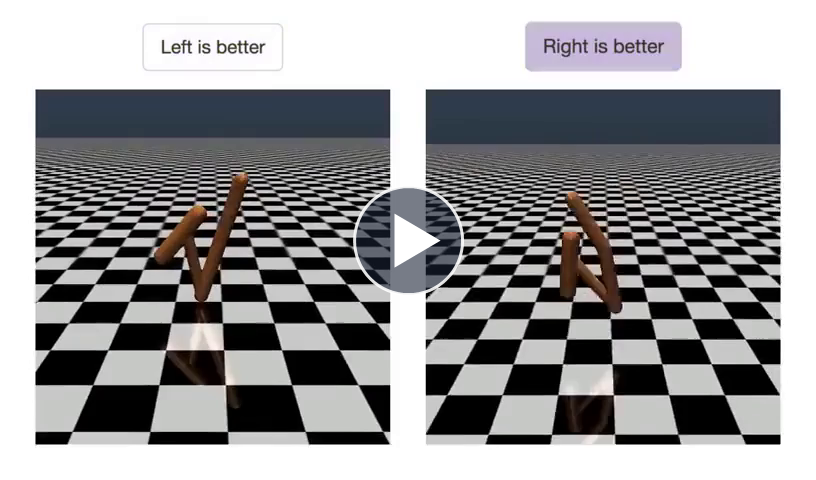

现场播放视频：`harmonyos-sdd-workshop-media/methodology/openai-human-feedback-training-ppt-compatible.mp4`（39 秒，PPT 内嵌、单击播放；上方关键帧同时作为无法播放时的备份）。

OpenAI 的后空翻实验中，人不需要先写出完整奖励函数，只需反复比较两段动作：**哪一段更接近目标？** 研究使用约 900 次二选一反馈，让 Agent 逐步学会后空翻。

> **容易判断，不等于容易说明；对齐可以从可重复的判断开始。**

### 讲师备注

这不是为了讲强化学习算法，而是让学员感受一个常见矛盾：人对结果往往有直觉，却很难一次把所有规则写全。工程任务也一样——“体验要流畅”“逻辑要正确”“把这个需求做完”都容易判断一个局部结果，却不足以直接生成稳定实现。下一页把这个矛盾迁移到长时间编码任务。

PPT 中嵌入 OpenAI 页面对应的 Human Feedback training process 视频；封面直接取自该视频的二选一反馈关键帧，无法播放时仍能用这一帧解释“人只需判断哪一段更好”。实验事实与视频来源：OpenAI《Learning from human preferences》。

### 通过条件

学员能复述：人的反馈必须变成稳定、可重复、可追踪的判断，而不是一句“感觉不对”。

---

## 第 6 页｜高层目标直接交给 Agent，会出现两种典型失控

<!--
type: DEBUG
section: ALIGNMENT
layout: failure-timeline
time: 4m
progress: 任务
-->

### 画面

> “构建一个 claude.ai 克隆应用。”

Anthropic 在长任务实验中观察到两类典型失败：

1. **做得太多**：Agent 试图一次完成整个应用，在上下文中途耗尽时留下半实现、无记录的功能；下一轮只能猜测发生了什么。
2. **过早宣布完成**：后续 Agent 看到已经存在部分功能，就误判整体任务已经结束。

```text
一次做太多 → 上下文中断 → 下一轮靠猜 → 过早宣布完成
```

> **问题不是 AI 不会写代码，而是目标、进度和完成标准没有被外化。**

### 讲师备注

Anthropic 的改进包括：初始化阶段展开完整功能清单；后续每轮只推进一个功能；用进度文件和 Git 历史交接；只有经过端到端验证后才把功能标记为通过。这些做法与本课后面的 `spec.md / Task Card / progress.md / evidence` 一一对应。

来源：Anthropic《Effective harnesses for long-running agents》。

### 通过条件

学员能指出“半实现无记录”和“看到进度就宣布完成”分别缺少哪一种外部资产。

---

## 第 7 页｜对齐不是一次确认，而是生成、评估、反馈的循环

<!--
type: MAP
section: ALIGNMENT
layout: evaluator-loop
time: 3m
progress: 证据
-->

### 画面


- **生成器**：给出候选方案或最小改动。
- **评估器**：按预先冻结的标准检查结果。
- **反馈**：指出缺口和下一条可执行动作。
- **接受**：不是“AI 觉得可以”，而是检查标准已经通过。

> **目标未满足 → 给出证据 → 缩小差距 → 重新评估。**

### 讲师备注

评估器不一定是第二个模型，也可以是确定性测试、静态检查、系统 getter、真机视频或人工评审。关键是实现者不能只根据自己的解释宣布完成。标准必须先于结果存在；反馈必须足够具体，能够决定下一条最小动作。

来源：Anthropic《Building Effective Agents》。

### 通过条件

学员能为一个编码任务分别给出生成器、评估器、证据和接受条件。

---

## 第 8 页｜进入工程案例前，先把四件事写成契约

<!--
type: CHECKPOINT
section: ALIGNMENT
layout: contract
time: 3m
progress: 需求
-->

### 画面

| 对齐契约 | 必须回答的问题 | 产物 |
|---|---|---|
| 目标 | 本轮唯一要改变的结果是什么？ | `spec / success criteria` |
| 边界 | 允许改什么、禁止改什么，哪些决定必须由人关闭？ | `allowed / forbidden / open` |
| 验收 | 用什么测试、回读、日志或画面证明结果成立？ | `RED / GREEN / evidence` |
| 停止 | 何时提交、回退，何时保留 `UNKNOWN` 并问人？ | `stop / rollback / escalate` |

> **第 9 页开始：把这四项放进真实文档、代码、测试和设备证据。**

### 讲师备注

这一页是引子收口。后面两个工程案例领域不同，但都必须先建立同一份对齐契约。OpenAI 的 Agent 指南也强调：超过失败阈值或进入高风险、不可逆动作时，需要人工介入；Anthropic 的长任务实践则通过功能清单、进度文件、一次一个功能和端到端验证控制长任务。

### 通过条件

学员能在不写代码的情况下，先写出一张包含目标、边界、验收和停止条件的 Task Card。

---

<!-- BEGIN ARCHIVED INTRO 2-8: retained for source history; ignored by the PPT extractor.

## 第 2 页｜两小时跑通一条主闭环，再做一次跨域迁移

<!--
type: MAP
section: OPENING
layout: timeline
time: 3m
progress: 需求
-->

### 画面

**MDM 主闭环｜TEACHING COMPOSITE**

> USB 全局开关当前启用，设备 A 为显式 `deny/active=deny`，设备 B 为 `allow`。管理员执行全局禁用时，系统必须先暂停在线 active deny，再下发 restrictions `usb`。若全局下发失败，必须补偿恢复 A 的 deny，不得改写 `desiredPolicy`，并留下可回读证据。


### 讲师备注

这条英雄任务由三个真实问题组合：全局与单设备策略优先级、意图与执行态分离、事务中途失败补偿。课程后面遇到的“页面回显、系统回读、部分失败、补偿、实物验收”都挂到这条主闭环上；第 28–38 页再把同一套控制方法迁移到 GPU 证据诊断，而不是开启一门新课。

冻结课堂语义：

- 优先级冻结为 `global deny > explicit desiredPolicy > usbDefaultPolicy`。
- 全局禁用只覆盖有效结果，不改写设备 `desiredPolicy`。
- MDM 下发成功后才提交 `activePolicy`；失败时 UI 和本地状态保持旧值。
- fingerprint 是业务身份，系统 deny 实际是 `baseClass` 粒度，必须用同类型双设备验收影响面。

### 演示动作

在白板或画布上固定写出 `global / desired / default / active`，后续所有需求、代码、测试与证据都沿用这四个语义。

### 通过条件

所有小组使用同一英雄任务，不按模块分组拆散主链。

### 素材

- USB 分层策略与补偿流程图
- `UsbGlobalPolicyService.ets`
- `UsbDevicePolicyStateService.ets`

---

## 第 3 页｜复杂任务每轮必须留下六类证据

<!--
type: MAP
section: OPENING
layout: loop
time: 3m
progress: 任务
-->

### 画面

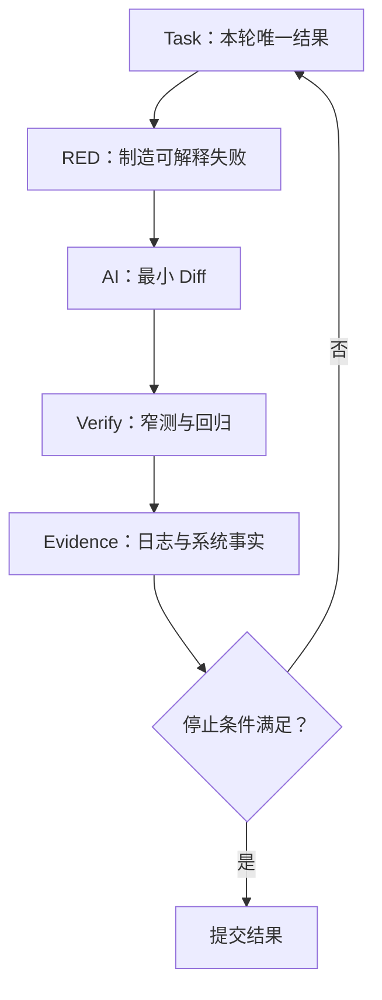

**可选对照图（PPT 制作时与上方 Mermaid 二选一）**


<sub>讲师读图：Agent 不是“连续生成代码”，而是在环境反馈中行动，并在检查点接受人类判断或满足停止条件。图源：Anthropic《Building Effective Agents》。</sub>

每轮写入 `progress.md`：

`假设 / RED 命令与输出 / 修改文件 / GREEN 输出 / 新事实 / 剩余风险 / Stop 或 Next`

### 讲师备注

SDD 负责“要到哪里、边界是什么”；Ralph Loop 是“一次走多远、何时停止”的一种 Harness；MCP 只是 Verify 阶段的执行器。不要把三者画成并列方法，也不要把课程讲成某个模型或框架的使用说明。

停止条件必须可执行：窄测试绿、相关回归绿、diff 在任务允许范围、设备事实与规格一致。权限、签名、设备或 getter 阻塞时，结论是 `UNKNOWN`，记录阻塞并停止，不继续猜测。

**Anthropic 方法锚点**：`Building Effective Agents` 强调 Agent 每一步都要从环境获取 ground truth，并用 checkpoint 与 stopping condition 控制执行；其 Agent 工程最佳实践进一步强调“给 Agent 一个它能运行的检查”，否则它只能在“看起来完成”时停下。本课把这一观点具体化为四级检查：目标 RED/GREEN、相关回归、HAP 构建、真机 getter / 帧级证据。截图是可读信号，但不能替代更强的系统事实。

### 演示动作

展示两份短 `progress.md`：Round 1 解决全局开关与默认策略语义冲突；Round 2 解决全局下发失败后的 deny 补偿。让学员看到“循环真正发生”。

### 通过条件

学员能区分 `PASS / FAIL / UNKNOWN`，并知道 UNKNOWN 不是失败，也不是可以伪装成 PASS。

### 素材

- 附录 B7 任务卡与进度模板
- 附录 B8 工程验收手册

---

# 第一幕：完成引子——从现象走到可执行规格

## 第 4 页｜复杂问题先拆成五层，两个案例都沿这条链

<!--
type: MAP
section: INTRO
layout: five-layer-map
time: 3m
progress: 需求
-->

### 画面

```text
触发事实 → 稳定快照 → 目标状态 → 执行结果 → 系统证据
```

| 层 | 必须回答的问题 | 可验证对象 |
|---|---|---|
| 触发事实 | 这轮变化由什么事件或操作开始？ | 事件源、时间戳、参数 |
| 稳定快照 | 执行前的完整事实是什么？ | 系统 getter、列表、版本号 |
| 目标状态 | 需求冻结后的期望结果是什么？ | `spec.md`、ADR、不变量 |
| 执行结果 | 哪些写入成功、失败或需要补偿？ | 返回值、映射、事务边界 |
| 系统证据 | 最终事实是否与目标一致？ | 回读、日志、截图/视频、性能 |

### 讲师备注

这一页仍然属于引子，不进入任何业务领域。它给后面两个案例建立同一套阅读顺序：先问触发了什么，再确认完整事实；规格决定目标，执行留下结果，最终只能由系统证据判定。

页面第一次为空、第二次正常，至少可能在“触发事实、稳定快照、系统证据”三个层次出现差异。若不先区分层次，AI 很容易把最终 UI 现象直接解释为根因。

### 演示动作

让学员把“页面第一次为空、第二次正常”分别填入五层：已知事实写入，未知项标 `OPEN`，不得填猜测。

### 通过条件

学员能说明 UI 画面、内存状态和系统事实不是同一层证据。

### 素材

- 附录 B6.1 歧义勘察 Prompt
- 附录 E4 权限策略 Session Evidence Card

---

## 第 5 页｜同一个现象，至少有四个事实边界不能靠猜

<!--
type: CLAIM
section: INTRO
layout: four-questions
time: 4m
progress: 需求
-->

### 画面

> “权限页面第一次进入为空，退出后第二次进入正常。”

这句话只描述了现象，没有告诉我们下面四个事实：

1. **数据来自哪里**：页面缓存、ViewModel 内存、业务 API，还是系统 getter？
2. **什么时候开始监听**：页面创建前后、首次读取前后，哪一个边界会丢事件？
3. **什么时候算完成**：调用返回、本地状态更新，还是系统回读与页面一致？
4. **失败时展示什么**：空列表、旧状态、加载态，还是可重试错误？

> **四个答案会改变监听顺序、状态模型、回归测试和最终证据。所以下一步不是设计，而是把分叉变成选择题。**

### 讲师备注

这一页仍然只是在引入问题，不给设计答案。附录 E4 的真实 Session 说明：第一次进入为空、按钮状态与系统事实不一致时，危险方向是先更新组件状态，再等待系统结果；正确判断必须先区分 `pending intent` 与 `system committed`。

课堂只要求学员识别“哪些答案不同会导致不同代码或测试”。若答案会改变状态所有权、监听顺序、失败展示或验收证据，它就是开发前必须关闭的歧义。

### 演示动作

只投屏现象，让 AI 按附录 B6.1 输出模糊词、互斥答案、工程影响、决定者和危险假设。禁止输出架构、类名和代码。

### 通过条件

四个问题都至少包含两个互斥答案；没有把“加延迟”“初始化问题”当作结论。

### 素材

- 附录 B6.1 歧义勘察 Prompt
- 附录 E4 权限策略：乐观 UI 与系统状态撕裂

---

## 第 6 页｜AI 先把分叉列完整，人再冻结本轮语义

<!--
type: LAB
section: INTRO
layout: decision-table
time: 4m
progress: 需求
-->

### 画面

AI 的职责是列出互斥答案、工程影响和危险假设；人的职责是关闭高影响 `OPEN`，冻结业务语义。

| 待决策项 | AI 列出的互斥答案 | 本轮冻结答案 | 直接影响 |
|---|---|---|---|
| 最终事实源 | 缓存 / ViewModel / API / 系统 getter | 系统 getter；ViewModel 只缓存 | 状态所有权 |
| 监听与首读顺序 | 先读后监听 / 先监听后读取 | 先建立监听，再发起首读 | 是否丢失首次事件 |
| 未返回时的状态 | 空列表 / 加载中 / 沿用旧值 | 显示加载中，不把空当完成 | 首次进入体验与测试 |
| 完成判定 | 调用返回 / 本地更新 / 系统回读一致 | 系统事实返回并刷新当前页面 | 验收证据与停止条件 |

> **仍然是 OPEN 的高影响问题不能交给 AI 开发。**

### 讲师备注

这四个答案是教学示例，用来说明“冻结语义”的产物长什么样，不声称已经定位了真实代码根因。真实项目中，答案必须由现有接口、调用链、产品约束和设备证据共同支持；证据不足时保留 `OPEN`，不要为了进入开发而强行选择。

这一页直接采用附录 B6.1 的五项输出：模糊词、互斥答案、工程行为、决定者、危险假设。PPT 为控制密度只展示冻结后的答案，完整勘察记录进入 `spec.md / Open Decisions`。

### 演示动作

2 人一组：一人扮演 AI，只列互斥选项；一人扮演产品/工程负责人，只关闭有证据支持的选项。无法决定的项保留 `OPEN`。

### 通过条件

能区分“AI 列出的候选答案”和“人已冻结的规格答案”；高影响 `OPEN` 不进入开发。

### 素材

- 附录 B6.1 歧义勘察 Prompt
- 附录 B4 `spec.md` 的 `Open Decisions` 模板

---

## 第 7 页｜冻结后的答案，要改写成可以直接生成测试的规格

<!--
type: CODE
section: INTRO
layout: before-after-tests
time: 3m
progress: 需求
-->

### 画面

**Before：只有现象，无法验收**

> 第一次进入为空，第二次进入正常。

**After：教学用 EARS 规格**

```text
WHEN 首次进入权限页面，
WHILE 系统事实尚未返回，
THE SYSTEM SHALL 显示加载态，不得把空列表提交为完成状态；
WHEN 系统事实返回，
THE SYSTEM SHALL 在当前页面刷新，不要求退出后再次进入；
IF 超时或读取失败，
THEN SHALL 显示可重试错误，并保留诊断证据。
```

由规格直接导出三条测试：

| 测试 | 条件 | 可观察结果 |
|---|---|---|
| T01 | 数据延迟返回 | 当前页面自动更新 |
| T02 | 事件早于首读完成 | 首次刷新不丢失 |
| T03 | 读取超时 | 错误态 + 诊断证据，不显示“空成功” |

### 讲师备注

EARS 不是为了写得像规范，而是把触发条件、等待状态、期望结果和失败分支写在一起。这里仍然是引子中的教学规格，不声明真实项目一定采用 loading、retry 或特定超时时间；进入案例后必须根据真实产品语义和代码事实重新冻结。

附录 E4 提供了真实问题的工程约束：`pending intent` 不能提前伪造 `system committed`。因此本页的关键不是 UI 样式，而是“未知不等于空”“系统事实返回前不能宣布完成”。

### 现场互动

让学员把“第二次进入正常”改写为一个失败测试：第一次进入期间数据稍后返回，页面必须在当前生命周期内更新。

1. AI 回复完成。
2. 代码可以编译。
3. 单元测试通过。
4. 需求对应的系统事实可回读，失败路径可解释。

规格能直接导出成功、竞态和超时三类测试，且每条都有可观察结果。

### 素材与来源

- 附录 B4 `spec.md` 模板
- 附录 E4 权限策略 Session Evidence Card
- 本地预告图：`harmonyos-sdd-workshop-media/e2e/peripheral-policy-current.png`

---

## 第 8 页｜满足四个准入条件后，才进入真实工程案例

<!--
type: MAP
section: INTRO
layout: four-gates
time: 3m
progress: 需求
-->

不按产品名称分类，而是看 AI 在哪里行动、上下文由谁维护、结果如何交付：

进入真实工程案例前，必须交付下面四项可复查产物：

| 准入条件 | 必须回答 | 产物 |
|---|---|---|
| 事实时间线 | 首次进入、事件到达、数据返回、页面更新分别发生在什么时候？ | 只读勘察记录 |
| 最终事实源 | 哪个 API / getter 能证明系统状态？UI 与缓存只属于哪一层？ | truth-source 表 |
| 可执行规格 | `WHEN / WHILE / SHALL / IF / THEN` 是否完整？高影响 `OPEN` 是否关闭？ | `spec.md` |
| 第一张任务卡 | 唯一结果、Allowed / Forbidden、RED、Verify 与 Stop 是否明确？ | Task Card |

> **下一页进入真实案例：用真实文档、代码、测试和设备证据验证这四项。**

### 讲师备注

这一页是引子收口，不讲 MDM 业务行为。它把前七页转换成进入案例的准入门槛：没有事实时间线就不能谈根因，没有最终事实源就不能判定成功，没有规格就无法产生测试，没有任务卡就无法约束 AI 的修改范围。

四项产物分别来自附录 B6.2 的只读勘察、附录 B4 的规格模板和附录 B7.1 的 Task Card。后面的两个案例可以领域不同，但都必须从这四项开始。

可选口播案例：同一个错误码问题，对话式协作负责解释和追问；仓库内 Agent 负责定位、修改与测试；异步任务代理负责汇总多份材料并生成 PRD、RFC 和验收清单。正文不展开这三条支线。

让学员检查前面权限页示例：四项产物中哪些已经有，哪些仍为 `OPEN`；缺失项只记录，不继续猜实现。

### 现场互动

学员能说明为什么“有一个合理方案”仍不足以进入开发，并能指出第一张任务卡必须包含的停止条件。

- 解释一个 HarmonyOS 权限错误。
- 修改已有模块并运行回归。
- 收集多份材料，生成 PRD、Story 和验收报告。

- 附录 B6.2 仓库只读勘察 Prompt
- 附录 B4 `spec.md` 模板
- 附录 B7.1 Task Card

---

# 第二幕：案例一——把 MDM 规格变成 AI 不容易越界的设计与任务

### PPT 内容

把 AI 应用的演进简化成四层：

```text
Prompt Engineering
→ Context Engineering
→ Harness Engineering
→ Controlled Agent Loop
```

页内结论：

> 演进的重点不是 Prompt 越写越长，而是上下文、工具、状态和验证逐步进入一个可控系统。

例：修复“登录后偶发白屏”时，四层分别解决问法、事实、工具和闭环。

### 主视觉

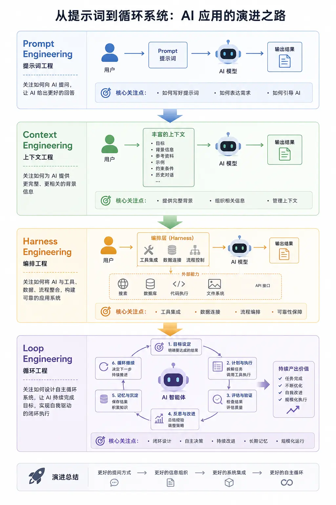

落版要求：原图为 2:3，只作为裁切素材；正文优先保留四个阶段名、每层输入变化和最下方演进结论。来源未补齐前，页脚标注“用户提供的概念示意图，仅用于教学解释”。

### 讲师备注

多家厂商正在把 Agent 能力放进终端、IDE、桌面工作区和后台任务：一类强调人与 AI 实时协作，另一类强调把多步骤目标交出去后再回来审阅。公开产品演进已经显示，两者正在逐步汇合，并进一步出现并行任务、专门 Agent 和长任务监督界面。

图中的四阶段是本课用于组织认知的教学视角，不宣称它是统一行业标准。尤其要纠正两个误区：Context Engineering 不是“给更多内容”，而是选择更少、更相关的高信号事实；Loop Engineering 也不是无限自治，而是把外部事实、验证、停止和升级条件放进循环。

可选口播展开：Prompt 只是“分析并修复白屏”；Context 增加复现步骤、日志、调用链和不可修改边界；Harness 固定搜索、构建、安装、截图和日志采集方式；Loop 才负责假设、最小修改、真机验证和停止。

这里的“趋势”是从多家官方产品形态做出的归纳，不等于宣称所有团队都应直接采用最高自治级别。任务越开放、动作权限越大，越需要可见过程、沙箱、检查点和人工决策。

[Sources]
- Anthropic, *Enabling Claude Code to work more autonomously*, 2025: https://www.anthropic.com/news/enabling-claude-code-to-work-more-autonomously
- Anthropic, *Claude Cowork*: https://claude.com/product/cowork
- OpenAI, *Introducing Codex*: https://openai.com/index/introducing-codex/
- OpenAI, *Introducing the Codex app*, 2026: https://openai.com/index/introducing-the-codex-app/
[/Sources]

### 现场互动

问学员：“当 AI 可以同时跑三个任务、离开电脑仍继续执行时，工程师减少的是哪类工作，增加的又是哪类工作？”

期望回答：减少重复操作和局部实现；增加目标定义、权限控制、过程监督、冲突处理和结果审阅。

---

## 第 4 页｜从 Prompt 到 Agent Loop，模型开始反复行动并读取环境

### PPT 内容

本页使用公开工程文章中的 Coding Agent Flow，不再放自绘 Mermaid。


图旁只保留五个词：

```text
Prompt
→ Model decides
→ Tool acts
→ Environment returns facts
→ Repeat or Stop
```

页内结论：

> Prompt 决定第一次怎么出发；Loop 决定后面如何根据环境继续走。

### 讲师备注

Agent Loop 的关键不是“模型连续思考”，而是模型与工具、环境反复交互。工具输出重新进入上下文，模型根据新事实决定下一步，直到返回结果、触发停止条件或需要人工输入。

OpenAI 对 Codex Agent Loop 的拆解指出：工具调用可能直接修改环境，Agent 的主要产物可能是代码而不是最后一条回复；与此同时，长链路会持续增长上下文并需要管理。Anthropic 则强调 Agent 每一步应从环境获得 ground truth，并在检查点或阻塞时回到人。

必须补一句：**Agent 返回最终消息，只能证明这次 Loop 结束了，不能自动证明业务目标完成。** 这句话直接引出第 5、6 页。

可选口播 Trace：以“默认 allow 的新 USB 没有进入白名单”为例，只讲搜索、RED、最小修改、GREEN、状态库回读五步；只有设备保持可用且新增 `desired=allow/active=none` 记录才允许 Stop。详细实现留到后面的 MDM 案例。

[Sources]
- Anthropic, *Building Effective AI Agents*: https://www.anthropic.com/engineering/building-effective-agents
- OpenAI, *Unrolling the Codex agent loop*, 2026: https://openai.com/index/unrolling-the-codex-agent-loop/
[/Sources]

### 现场互动

让学员在图上指出：编译错误、测试失败、设备日志、用户确认分别从哪里回到 Loop。答不出就说明还把 Agent 理解为聊天机器人。

---

## 第 5 页｜AI 越自主，人的辨别力越不能缺席

### PPT 内容

复杂需求中的 AI 熟练度成长模型：


图上方只补一句读图结论：

> 入口动作让任务启动，耐久上下文让能力复用，辨别力决定结果能否被信任。

### 讲师备注

先按 Claude Academy 原文讲三层，不要把图解释成产品功能清单：

1. **入口动作**：对话式工具先学会追问迭代；执行型与异步型 Agent 先学会在行动前澄清目标。本课把两者合并为“澄清完成状态，再用小步反馈迭代”。
2. **描述耐久度**：一次性的目标、上下文、示例和输出格式，逐步沉淀为任务卡、工具契约、项目规则、`progress`、证据库和自动化。
3. **辨别力螺旋**：描述能力可能随使用自然增长，但辨别力不会自动增长。每次升级都要重新追问：AI 假设了什么、证据够不够、什么会让它错、何时停止。

本地自绘图没有复制 Claude 的产品分区，而是把研究结构翻译成复杂需求工程资产。中心是一次任务的目标与快速反馈；中圈是可复用任务契约；外圈是跨 Session 的项目规则、自动化和证据。橙色虚线表示辨别力不是最后一步，而是贯穿每一层。

可选口播迁移：以“每周自动生成发布说明”为例，一次性层给提交和输出格式，可复用层沉淀任务卡与验收清单，持久层沉淀项目规则和证据目录；辨别问题始终是“每条说明能否追到真实 commit 和 issue”。

[Sources]
- Claude Academy, *Getting good at Claude: A research-backed curriculum*, 2026: https://academy.claude.com/tutorials/getting-good-at-claude-a-research-backed-curriculum
[/Sources]

### 现场互动

让学员选一个正在做的任务，在图上回答三件事：入口动作是什么？哪些信息只在当前 Prompt 中，哪些已经持久化？本轮最可能错在哪里？

### 怎么判断讲清楚了

学员能够把同一任务分别写成一次性 Prompt、可复用 Task Card 和跨 Session 项目规则，并且每一层都给出一个可执行的辨别检查。

---

## 第 6 页｜复杂需求最危险的误判：“AI 已经完成”

### PPT 内容

六类控制问题：

```text
输入不一致｜上下文漂移｜状态不一致｜局部成功｜范围蔓延｜验收错位
```

先给一个 20 秒具体场景：

```text
PRD：USB 全局禁用时保留设备黑白名单意图
实现：页面把设备改成 deny，但系统仍按旧策略运行
UI：显示“禁止接入”
测试：只覆盖 ViewModel 状态
结论：页面成功，MDM 与实物结果仍可能失败
```

主视觉继续使用真实 SecurityTool 页面，不使用通用插画。


右侧放分层判断：

```text
Agent message    “已完成”                    ≠ 交付
Unit tests       默认/显式/回退分支通过        = 代码协议证据
UI screenshot    黑白名单与开关可见            = 页面证据
MDM + USB        系统回读/实物未采集           = UNKNOWN
```

底部结论：

> 低层证据不能替代高层事实；缺少最终事实时，正确答案是 UNKNOWN。

### 讲师备注

先把六类问题落到真实后果，而不是停留在抽象名词：

| 问题 | 复杂需求中的真实后果 |
|---|---|
| 输入不一致 | 原图、PRD、代码表达不同，AI 选错事实源 |
| 上下文漂移 | 长 Session 后忘记边界，重新解释已冻结决策 |
| 状态不一致 | UI 成功、缓存成功，但系统状态未改变 |
| 局部成功 | 多用户、多步骤中一半成功、一半失败 |
| 范围蔓延 | 修一个问题时顺手重构无关模块 |
| 验收错位 | 测试了“能点击”，却宣布业务策略已下发 |

然后回到第 1 页投票，要求学员说明每一层到底证明了什么：

- 回复完成：证明 Agent 决定停止。
- 命令返回成功：证明工具调用成功。
- UT 全绿：证明被覆盖的代码契约通过。
- 页面截图：证明该时刻 UI 可见状态。
- 系统 getter/readback：才可能证明设备最终业务状态。

不要把本页讲成否定测试。它讲的是证据作用域：测试非常重要，但必须与需求声明处于同一层。复杂需求不是 Prompt 更长，而是每一步都可能改变下一步的正确答案。Anthropic 区分固定 Workflow 与动态 Agent，并提醒动态 Agent 可能累积错误；OpenAI 的 Codex 系统说明也强调用户应检查终端日志、文件和最终 Diff。

[Sources]
- OpenAI, *Codex system card addendum*: https://openai.com/index/o3-o4-mini-codex-system-card-addendum/
- Anthropic, *Building Effective AI Agents*: https://www.anthropic.com/engineering/building-effective-agents
- Anthropic, *Trustworthy agents in practice*: https://www.anthropic.com/research/trustworthy-agents
[/Sources]

### 现场互动

重新投票第 1 页问题。学员必须给出 `PASS / FAIL / UNKNOWN` 中一个，并说明结论作用域。页面可见而 system readback 缺失时，不能给系统层 PASS。

---

## 第 7 页｜Ralph 的价值，是给 Agent Loop 加外部记忆、验证和停止条件

### PPT 内容

课堂找错：下面这条循环已经有规划、执行、验证、修复、记忆和调度，为什么仍然不能直接交付？

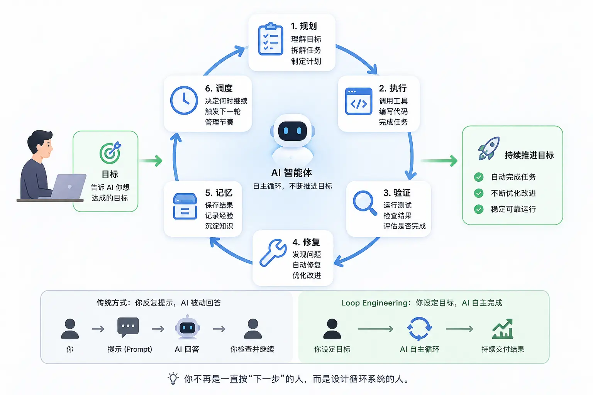

```text
表面完整 ≠ 工程受控
至少还缺：外部事实 / 独立验收 / Stop / Escalate
```

### 讲师备注

Ralph 不是模型、框架或魔法 Prompt。Geoffrey Huntley 的原始定义非常直接：纯粹形式就是把编码 Agent 放进 Bash 循环，每轮从文件和仓库重新获取状态。他同时反复强调“一轮只做一件事”，并明确提醒原始做法不适合直接套到已有代码库。

用户提供的图故意按“表面完整、工程不闭合”来讲：`验证` 如果只是 Agent 自己看输出，不是独立 oracle；`记忆` 如果写入的是错误结论，只会把错误带到下一轮；`调度` 如果没有最大迭代和升级条件，只会让错误更稳定地重复。讲完缺口后，再用 Anthropic Autonomous Agent Loop 中的 Environment Feedback / Stop 作为官方结构对照。

因此本课不是照搬无限循环，而是工程化改造：先有规格和任务，状态写入文件与 Git；每轮有独立 oracle；失败必须留下证据；达到停止条件才退出；超限或证据冲突时升级给人。对于确定性构建、签名、安装等步骤，优先使用 Workflow，不让 Agent 每轮重新发明流程。

展开时再补完整约束：一轮一个 Story，读取 spec/RFC，写回 progress/evidence，执行 RED/GREEN/regression，由独立 Reviewer 判断，并设置最大轮数、Stop、Escalate、权限边界和回滚点。Workflow、Agent Loop、Evaluator–Optimizer 与 Ralph 的区别只在讲师口播，不全部堆到本页。

[Sources]
- Geoffrey Huntley, *Ralph Wiggum as a “software engineer”*, 2025: https://ghuntley.com/ralph/
- Anthropic, *Building Effective AI Agents*: https://www.anthropic.com/engineering/building-effective-agents
[/Sources]

### 现场互动

给四个任务让学员选择 Workflow、单次 Agent、Evaluator–Optimizer 或受控 Ralph：

- 固定执行构建签名安装。
- 搜索一次 API 用法。
- 反复改进一份有评分标准的文档。
- 跨多个 Story 完成复杂 Feature。

### 怎么判断讲清楚了

学员知道“更多循环”不会自动提高正确性；Loop 必须得到外部事实、外部记忆和停止门约束。

---

## 第 8 页｜这门课用两种复杂需求，验证同一套受控交付方法

### PPT 内容

接下来用两个真实案例验证同一套方法：

| 主案例：MDM 应用 | 方法迁移：大型开源工程 |
|---|---|
| 入口是多源需求和业务规则 | 入口是性能现象和运行证据 |
| Feature-first：先冻结需求、状态和失败语义 | Evidence-first：先缩小调用链和根因范围 |

页内结论：

> 两个案例入口不同，但判断 AI 是否正确的方法相同：看它依据什么、改变了什么、如何证明。

### 主视觉

左侧：真实外设黑白名单页面，带出“页面策略、应用意图和系统执行态是否一致”。


右侧：真实远控场景画面，只用于带出“现象可见但根因仍未知”。


两张图中间只放六步共同主线，不补画不存在的性能曲线。

### 讲师备注

明确接下来的主线：第 9 页开始完整走 MDM 六阶段——资产同步、方案推导、RFC、Story、Ralph、测试验收。第二案例只负责证明这套方法能迁移到“没有清晰需求、只有运行现象”的场景。

共同主线只在口播中快速带过：管理输入 → 关闭关键未知 → 固化契约 → 拆任务 → 受控迭代 → 系统事实验收。需要互动时再给两个挑战：USB 全局开关与默认策略被混为一谈，先冻结优先级和真源；视频卡顿但没有同 run 证据，先采证据再决定改哪里。

转场问题：“如果原始 Excel、AI 修正版、PRD 和代码对同一个概念说法不同，你会先相信谁？”第 9、10 页用资产同步回答。

### 现场互动

请学员为两个案例分别选择入口：Feature-first 或 Evidence-first，并说明为什么不能反过来直接写代码。

---

END ARCHIVED INTRO 2-8 -->

## 第 9 页｜案例背景：三层优先级 + 一条并行存储策略

### 页内内容

```text
目标：企业管理员统一管控 USB，并支持动态黑白名单

L1 接口管控：USB 全局允许 / 禁止（最高）
L2 已识别设备显式 allow / deny
L3 未配置设备默认黑 / 白名单（最低）
并行覆盖：USB 存储读写 / 只读 / 禁止访问

难点：优先级、真相源、动态生效、失败回退、实物验收
```

右侧放现有 `peripheral-policy-current.png`，角标：“页面事实，不等于系统事实”。

### 讲师备注

- 怎么做：先让学员列出四层状态，不展示代码。
- 怎么判断：同一设备在 L1 全局闸门、L2 显式规则、L3 默认规则下是否只有一个结果。
- 不对怎么办：如果大家把默认策略说成全局开关，立即进入第 11 页的真实历史冲突。
- 证据：页面截图只证明 UI 已存在；完整实物矩阵 PENDING。

## 第 10 页｜资产同步：用索引建立上下文，不把工程塞进 Prompt

### 页内内容

| 读取轮次 | 输入 | 产物 |
|---|---|---|
| 仓库地图 | AGENTS、路由、模块设计 | 入口与硬约束 |
| 符号地图 | 5 个核心状态词 | 类与函数清单 |
| 关键切片 | 命中代码 | UI→VM→Service→Repo/MDM |
| 历史地图 | Story、changelog、git log | 旧方案为什么错 |
| 证据地图 | UT/E2E/截图 | PASS/FAIL/PENDING |

阶段实际产物：`scope-map / requirement-card / conflicts / evidence-index / unknowns`。

页脚命令：

```powershell
rg -n "usbDisabled|usbDefaultPolicy|desiredPolicy|activePolicy|clearAllPolicies" ...
```

### 讲师备注

- 怎么做：现场只打开 `PeripheralViewModel`、`UsbGlobalPolicyService` 和 `UsbDevicePolicyStateService` 三个关键文件。
- 怎么判断：能否在两分钟内指出全局状态、默认策略和设备规则各自真源。
- 不对怎么办：继续缩小检索，不要用“总结整个仓库”的超大 Prompt。
- 证据：资产清单见 `01-资产同步与冲突清单.md`。

## 第 11 页｜冲突是最有价值的资产：文档和 AI 都可能“合理地错”

### 页内内容

```text
2026-05-14 旧方案：USB 接口 = usb_default_policy
2026-07-11 当前方案：USB 接口 = restrictions usb 全局总控
当前默认策略：黑白名单页独立入口

为什么纠偏？
全局开关控制现在所有设备；默认策略只决定未来新设备。
```

再列两个冲突：连接记录 ≠ 策略真源；fingerprint 身份 ≠ 系统单设备粒度。

### 讲师备注

- 怎么做：并排展示两份 plan 和当前代码入口。
- 怎么判断：至少需要“当前代码 + 权威规格 + 测试”三者互证。
- 不对怎么办：把冲突写进清单，冻结结论，不让 AI 自选一个看起来最新的文档。
- 证据：模块设计 changelog 1.0.13 与 1.0.58/当前 2.1；代码 `InterfaceControlViewModel`。

## 第 12 页｜资产同步的出口是一张可验收需求卡

### 页内内容

```text
Feature：USB 外设分层策略管理

In：全局总控 / 存储模式 / 显式规则 / 默认规则 / 动态设置 / 回退
Out：蓝牙单设备名单 / 管理员激活流程 / 假设序列号级系统阻断
核心不变量：global > desired > default
Oracle：UI + 本地状态 + MDM 回读 + 实物行为
```

### 讲师备注

- 怎么做：让学员把“支持黑白名单”改写为 4 个可观察事实。
- 怎么判断：每条需求能否绑定独立 oracle。
- 不对怎么办：没有 oracle 的句子退回澄清，不进入开发。
- 证据：`01` 的需求重述卡与 `00` 证据状态总表。

## 第 13 页｜方案推导先比较失败模式

### 页内内容

| 方案 | 最大失败模式 |
|---|---|
| 单布尔状态 | 无法表达恢复与白名单 |
| UI records 真源 | 重启/清记录后丢策略，容易假成功 |
| 分层策略模型 | 结构更复杂，但可恢复、可验证 |

结论：采用“系统全局真源 + 默认 Preferences + 设备状态 RDB”。

### 讲师备注

- 怎么做：不问哪个方案代码最少，问失败后能否恢复。
- 怎么判断：是否能从持久状态推出下一步补偿动作。
- 不对怎么办：若需要读历史事件才能猜当前规则，说明真源建错了。
- 证据：`02-方案推导与决策记录.md`。

## 第 14 页｜最小能力穿刺：系统执行粒度改变了整个架构

### 页内内容

```ts
// 页面身份
USB-SN:<serial> / USB-WEAK:<vid>:<pid>:<hash>

// 系统下发
{ baseClass, subClass: 0, protocol: 0, descriptor: INTERFACE }
```

大字结论：业务上按 fingerprint 管理，系统上按 USB 类型执行。

### 讲师备注

- 怎么做：打开 Dispatch Service 的 `toUsbDeviceType()`。
- 怎么判断：插入两台同 baseClass 设备，观察影响面。
- 不对怎么办：如果产品要求真正序列号级阻断，升级架构/产品决策，不能改 UI 文案掩盖。
- 证据：D2 已有；同类型双设备 D6/D7 PENDING。

## 第 15 页｜ADR 把真相源、所有权和失败语义一次固定

### 页内内容

| 状态 | Owner | 失败语义 |
|---|---|---|
| 全局 USB | restrictions 系统 | 不本地镜像 |
| 默认策略 | Preferences Repo | 保存失败保持旧值；非法值→allow |
| desired/present/active | USB State Repo | 系统成功后才提交 active |
| trace | Trace Repo | 写失败不回滚已成功安全策略，但必须告警 |

### 讲师备注

- 怎么做：每个状态只允许一个 owner。
- 怎么判断：沿写路径搜索，是否存在第二个仓储或 UI 镜像。
- 不对怎么办：先合并真源，再写业务逻辑。
- 证据：ADR-001～004。

## 第 16 页｜MVVM 必须落到真实类，而不是抽象四层

### 页内内容

```text
PeripheralPage
  ├─ InterfaceControlTab ─ InterfaceControlViewModel
  │                         └─ UsbGlobalPolicyService
  └─ PolicyList ────────── PeripheralPolicyViewModel
                            ├─ DefaultPolicyRepository
                            ├─ UsbDevicePolicyStateService
                            └─ DispatchService

PeripheralViewModel：管理员门禁 + 跨 Tab 刷新

后台：USB/蓝牙事件 → Producer/Pipeline → Consumer
      → Policy State RDB + Trace RDB → Repository notify → VM reload
```

### 讲师备注

- 怎么做：强调父 VM 是协调器，不是万能 Service。
- 怎么判断：View 中无 MDM/RDB，VM 中无 SQL/Preferences 细节，Service 中无页面状态。
- 不对怎么办：发现越层调用时先重新分配责任，不在原类继续堆条件。
- 证据：RFC 第 3、4、13 节。

## 第 17 页｜源码调用链：动态规则为何不会假成功

### 页内内容

```text
PolicyList
 → PeripheralViewModel（admin + updating）
 → PeripheralPolicyViewModel（校验 fingerprint/global）
 → UsbDevicePolicyStateService（校验 present）
 → DispatchService（校验 storage + MDM）
 → 成功后 Repository.upsert
 → reloadRecords
```

红线：`dispatch failed → old state stays`。

### 讲师备注

- 怎么做：现场沿 `handlePeripheralPolicyChange()` 追到 `setPolicy()`。
- 怎么判断：查 `upsert` 是否位于 dispatch success 之后。
- 不对怎么办：先回滚状态提交顺序，再补失败测试。
- 证据：源码与 `PeripheralPolicyViewModel.test.ets`。

## 第 18 页｜按可独立证明的能力拆成 8 个 Story

### 页内内容

```text
S1 身份与状态真源
S2 默认策略
S3 首次连接
S4 动态黑白名单
S5 全局禁用/恢复
S6 存储冲突
S7 还原与残留清理
S8 证据闭环
```

依赖主线：`S1+S2 → S3 → S4 → S5/S6 → S7 → S8`。

### 讲师备注

- 怎么做：按不变量拆，不按页面拆。
- 怎么判断：每个 Story 能否单独写一个失败测试和 Done 证据。
- 不对怎么办：一个 Story 同时修改全局、默认、E2E 三套语义时继续拆。
- 证据：`04-Feature与Story拆解.md`。

## 第 19 页｜Worker Packet 让新 Session 不靠聊天记忆接力

### 页内内容

```text
Goal / Read first / Invariants / Allowed files / Forbidden
Tests / Device dependency / Done evidence / Stop condition
```

示例不变量：全局不改 desired；失败补偿；不新增 global 本地持久化。

### 讲师备注

- 怎么做：现场展示 S5 Worker Packet。
- 怎么判断：把当前聊天关掉，新 Session 是否仍能直接执行。
- 不对怎么办：若 Worker 需要“看上文”，说明外部记忆不完整。
- 证据：`04` 第 5 节。

## 第 20 页｜Ralph 一轮只收敛一个未知

### 页内内容

```text
READ → PLAN → IMPLEMENT → VERIFY → RECORD
                    ↑                     ↓
                    └── next unknown ─────┘

STOP：AC 已证明
CONTINUE：出现新未知
ESCALATE：需要设备/权限/产品决策
```

### 讲师备注

- 怎么做：限制每轮一个主失败和一个 oracle。
- 怎么判断：progress 能说清本轮证据和下一未知。
- 不对怎么办：重复三轮同一阻塞就升级，不无限重试。
- 证据：`05-Ralph迭代运行账.md`。

## 第 21 页｜真实十五轮收敛：每次错误都固化成不变量

### 页内内容

选择 5 个关键转折：

```text
默认策略误作全局开关 → 两入口分离
连接记录反推名单     → 独立策略状态库
desired=active        → 意图/执行态分离
还原=删除             → 清系统残留 + 保留卡片
默认 allow 不入名单  → allow 也保存资产状态
9200010 冲突残留     → 还原先读取并清 EDM
9200007 部分生效     → API + getter + 运行态三态判定
Trace 入库不刷新     → 事实提交与维护通知分离
present 在线态残留   → 启动时用真实设备集合对账
```

页脚放提交：`63dda4b4 / 6e7702cd / 23c4a046 / f95c5109`。

### 讲师备注

- 怎么做：不逐个讲 commit，只讲“症状→根因→新不变量”。
- 怎么判断：修复是否同时更新设计、代码、测试和证据。
- 不对怎么办：如果修复只改 UI，回到系统真源重做。
- 证据：完整症状、调用链、错误码和截图位见 `case-materials/mdm/13-本地Session真实问题证据卡.md`。

## 第 22 页｜失败处理：补偿和还原不是同一件事

### 页内内容

左侧“全局禁用失败补偿”：

```text
suspend deny → global disable FAIL → restore deny → UI 不提交
```

右侧“管理员还原”：

```text
read EDM residue → remove all → local allow/none → reload
```

页脚“部分生效不是补偿”：

```text
9200007 + getter 已到目标 + 重挂载失败
→ 保留目标状态，提示重插，并继续收集实物证据
```

### 讲师备注

- 怎么做：让学员指出哪一步失败会导致什么状态。
- 怎么判断：系统清理失败时本地是否仍保持原值。
- 不对怎么办：若出现系统/本地不一致，停止自动循环，重新回读并人工决策。
- 证据：Global Service 与 `clearAllPolicies()`。

## 第 23 页｜证据阶梯：不同证据只能证明不同事实

### 页内内容

```text
D1 文档 → D2 代码 → D3 UT → D4 构建
       → D5 E2E/UI → D6 系统回读 → D7 实物行为
```

示例：`PER-IF-002 PASS` 只证明 UI 往返，不证明 USB 真被禁用。

### 讲师备注

- 怎么做：给每个验收结论贴证据等级。
- 怎么判断：涉及“系统已生效”的句子是否至少有 D6。
- 不对怎么办：证据不足标 UNKNOWN/PENDING，不补推理。
- 证据：`00-外设管理证据状态总表.md`。

## 第 24 页｜保留 FAIL 才能证明迭代：同一入口从失败到通过

### 页内内容

| 运行 | 结果 | 证据 |
|---|---|---|
| `PER-BL-USB-001` | FAIL | 页面/Tab 定位 UNKNOWN，找不到“还原策略” |
| `PER-POL-001` | PASS | 页面、Tab、还原入口均可见 |

结论：失败证据不删除；修复后新增一份可比较结果。

### 讲师备注

- 怎么做：现场打开两个 JSON 的 status、steps、primary_evidence。
- 怎么判断：先区分驱动失败、环境未知和产品失败。
- 不对怎么办：导航 UNKNOWN 时先修测试可观测性，不直接改业务逻辑。
- 证据：两份真实 E2E JSON；自包含摘要见 `evidence/mdm/peripheral-e2e-summary.md`；artifacts 为空，视频仍 PENDING。

## 第 25 页｜最终验收：当前部分通过，完整设备矩阵仍待补

### 页内内容

| 维度 | 当前 |
|---|---|
| 架构与规则 | PASS（文档/代码） |
| 关键失败分支 | PASS/部分覆盖（UT） |
| 页面路径 | PASS（多条 E2E） |
| 系统回读 | PENDING |
| USB 实物矩阵 | PENDING |

当前 OPEN：Trace 通知时机、启动在线态对账、9200007 呈现、同 baseClass 双设备影响面。

预留视频：默认 allow/deny、全局禁用/恢复、还原、同类型双设备。

### 讲师备注

- 怎么做：用验收矩阵收口，不做口头“总体通过”。
- 怎么判断：每个 AC 都能追到 evidence ID。
- 不对怎么办：系统/实物缺证据就不发布“完成”，建立设备验收任务。
- 收获：复杂需求的完成定义是“架构可解释、失败可恢复、证据可复核”。

## 第 26 页｜实践：把外设策略验收写成可执行系统契约

### PPT 内容

学员任选一个场景，写完整 Case：

```text
A 默认 allow 新设备
B 默认 deny 新设备
C 全局禁用/恢复
D 还原系统残留
E 同 baseClass 双设备影响面
```

Case 必须包含：

```yaml
precondition:
  admin: activated
  global_usb: enabled
  storage_policy: read_write
  local_policy_state: baseline
action:
  - set_default_deny
  - attach_usb_device
oracles:
  ui: device appears in blacklist
  local: desired=deny, active=deny, present=true
  system: disallowed usb type is readable
  physical: device cannot be used
cleanup:
  - restore_all_policies
result: PENDING
```

### 怎么做 / 怎么判断 / 不对怎么办

- 怎么做：先写预置和清理，再写动作，最后定义四栏 oracle。
- 怎么判断：换一台设备、换一个 Session 仍能重复执行，并能区分 FAIL/UNKNOWN。
- 不对怎么办：无法系统回读时标 UNKNOWN；清理失败时停止下一 Case，避免污染。

### 讲师备注

- 要求学员特别写出“同类型第二台设备”，验证平台 baseClass 粒度。
- 强调视频是实物证据，但视频里还要同步出现操作、设备和时间/Case ID。

### 文档 / 截图

- 文档：`case-materials/mdm/06-测试验收报告.md#5-真机验收-runbook`
- **【视频占位】**：默认 deny 插入 U 盘，UI/系统回读/实物行为同屏。

---

## 第 27 页｜MDM Checkpoint：交付的不是代码，而是一条可复核证据链

### PPT 内容

```text
需求卡
  → 冲突清单
  → 穿刺与 ADR
  → MVVM / 策略 RFC
  → Story + Worker Packet
  → Ralph 运行账
  → UT / E2E / 系统回读 / 实物视频
  → 验收矩阵
```

本案例当前状态：

| 维度 | 结论 |
|---|---|
| 架构、规则、代码映射 | PASS |
| 关键分支 UT | PASS / 有覆盖缺口 |
| 页面 E2E | PASS（保留一份旧 FAIL） |
| 系统回读 | PENDING |
| 实物 USB 矩阵 | PENDING |

学员应能回答：

1. AI 为什么这样拆是对的？
2. 哪个状态是谁的真源？
3. 系统失败后怎样补偿或回退？
4. 哪份证据能证明哪层事实？
5. 证据不足时为什么要停止并升级？

### 怎么做 / 怎么判断 / 不对怎么办

- 怎么做：从验收矩阵任取一行，反向追到 Story、RFC、代码和需求。
- 怎么判断：链路任一跳都能打开真实文件或结果。
- 不对怎么办：断链处就是下一项工作，不用一句“整体完成”覆盖。

### 讲师备注

- 这一页把“复杂需求交付”收口到可复核，而不是代码量。
- 然后切入案例二：同样的方法如何进入 55 万行级 FreeRDP 与 GPU 性能问题。

### 文档 / 截图

- 文档：`case-materials/mdm/00-外设管理证据状态总表.md`
- 文档：`case-materials/mdm/04-Feature与Story拆解.md`
- **【补充素材】**：六阶段文档目录、关键代码、E2E FAIL→PASS 和待补视频位组成证据墙。

---

## 第 28 页｜背景：双向远控已可用，主控视频链仍走 CPU

<!-- type: CLAIM; section: CASE2_CONTEXT; time: 2m -->

### 产品背景

- HarmonyOS 通过 FreeRDP client 做主控，通过 xrdp server 做被控。
- 本案例只聚焦 HarmonyOS 主控连接 Windows。
- 已经能连接、能输入、能看到画面；播放视频时，旧链路仍把解码结果落到 CPU/GDI 缓冲再复制显示，操作和画面会卡顿。
- 目标不是“调用一个 GPU API”，而是完成一项可维护、可验证、可回退的三方库平台适配。

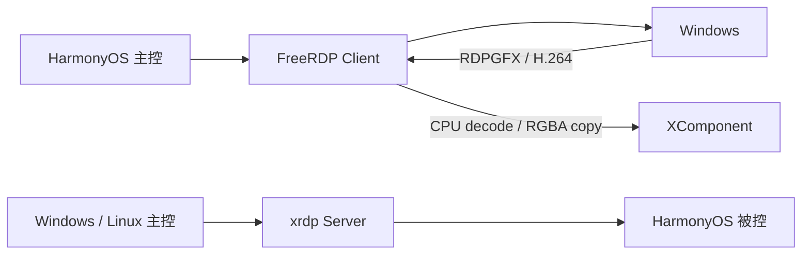

### 文档与证据

- 工程真源：`case-materials/gpu/README.md`、`09-源码调用链与任务拆解.md`、`13-GPU-Ralph-Story拆分与伪代码验收.md`
- 补充源码探针：`17-复杂三方项目GPU适配源码分析与探针方案.md`
- 输入：`01-问题与基线.md`、`00-证据状态总表.md`
- 场景图：`freerdp-stutter-scenario.jpeg`
- **可选补充**：如果能找到原始 CPU/软件路径卡顿 before，放 20～30 秒增强开场；没有时按已冻结的 `CASE FACT` 讲，不影响本案例的方法论主线。

---

## 第 29 页｜面对大代码库，先用两个探针缩小未知

<!-- type: LAB; section: CASE2_LOCATE; time: 3m -->

```text
探针 1：Linux/X11 收到一帧后，经过哪些回调，何时提交显示？
探针 2：HarmonyOS 能否把同一份 H.264 输入，经硬解和 native buffer 显示到 XComponent？
```

只搜索 `WireToSurface / SurfaceCommand / AVC420 / EndFrame / UpdateSurfaces`。每个命中只记录输入、下一跳、owner、失败去向。

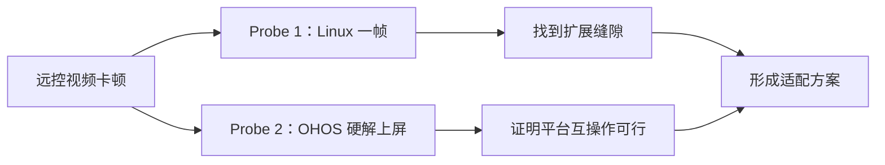

文档证据：`case-materials/gpu/17-复杂三方项目GPU适配源码分析与探针方案.md` 第 2 节。

---

## 第 30 页｜探针一：Linux 一帧从 RDPGFX 到 X11 的时序

<!-- type: MAP; section: CASE2_LOCATE; time: 3m -->

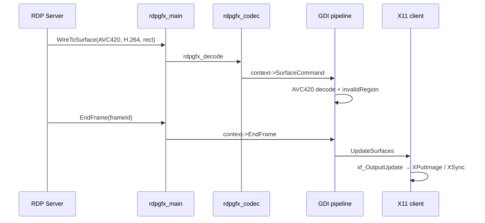

```text
rdpgfx_main.c::rdpgfx_recv_wire_to_surface_1_pdu
rdpgfx_codec.c::rdpgfx_decode_AVC420
libfreerdp/gdi/gfx.c::gdi_SurfaceCommand_AVC420 / gdi_EndFrame
client/X11/xf_gfx.c::xf_UpdateSurfaces / xf_OutputUpdate
```

结论：要迁移的是 `SurfaceCommand + EndFrame` 契约，不是 X11 API。源码行号与解释见 `17` 第 3 节。

---

## 第 31 页｜从 Linux 找到真正的适配点：回调表，而不是协议解析器

<!-- type: MAP; section: CASE2_RESEARCH; time: 3m -->

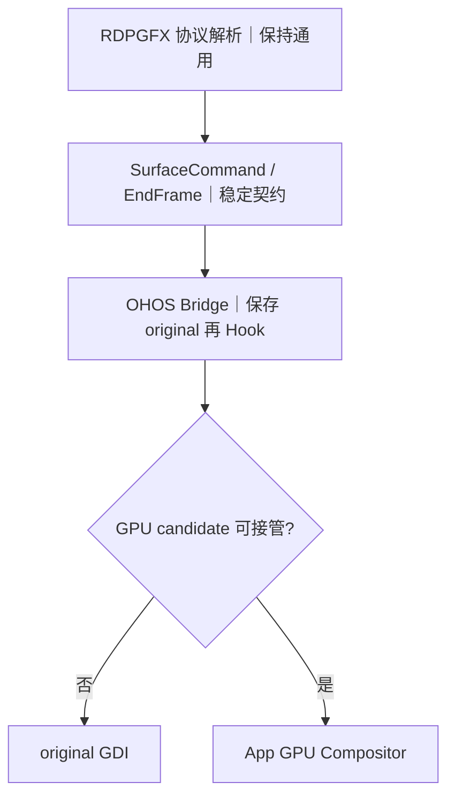

- `gdi_graphics_pipeline_init_ex` 把帧相关回调装进 `RdpgfxClientContext`；
- `xf_graphics_pipeline_init` 先复用通用 GDI，再覆盖 X11 平台 surface/update；
- `freerdp_ohos_rdpgfx_bridge_attach` 保存 original callbacks 后安装 OHOS Hook；
- `ohos_rdpgfx_surface_command` 只有 candidate consumed 才截断，否则调用 original。

判断原则：稳定适配点出现在“通用语义已经形成、平台副作用尚未发生”的位置。

---

## 第 32 页｜探针二：用 XComponent 穿刺 HarmonyOS 硬解上屏

<!-- type: MAP; section: CASE2_DECISION; time: 3m -->

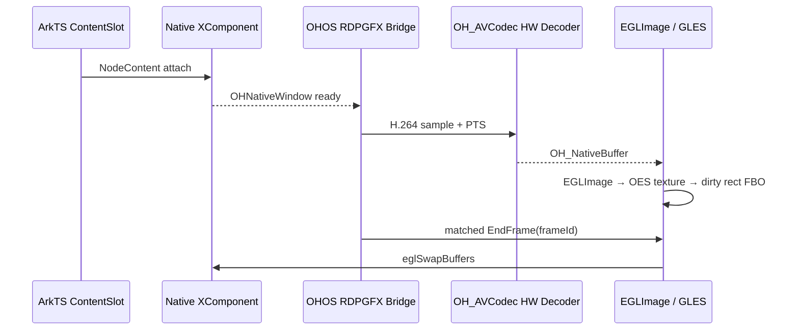

探针只回答：单个 AVC420 command 能否完成“硬解 output → native import → matched EndFrame → XComponent 可见”。先不加入连续流优化、AVC444、resize 或长稳。

---

## 第 33 页｜探针结果：最危险的三个互操作边界已经可行

<!-- type: LAB; section: CASE2_SPIKE; time: 3m -->

| 边界 | 源码行为 | Probe PASS 条件 |
|---|---|---|
| XComponent → NativeWindow | surface callback 更新 target | window 非空、尺寸有效、destroy 后失效 |
| AVCodec → NativeBuffer | HARDWARE decoder + output PTS | identity 可记录、output 可关联、native buffer 非空 |
| NativeBuffer → GLES | EGLImage + external OES | import 成功、dirty rect 合成、swap 后可见 |

```text
active=yes
source=native-buffer-oes
decoded=2397 / presented=2396
mismatch=0 / failures=0 / importFallbacks=0
```

结论是“方案方向验证可行”。历史日志用于证明探针方向，不冒充当前版本完整性能验收。

---

## 第 34 页｜由探针收敛方案：协议保持通用，平台层受控接管

<!-- type: LAB; section: CASE2_PLAN; time: 2m -->

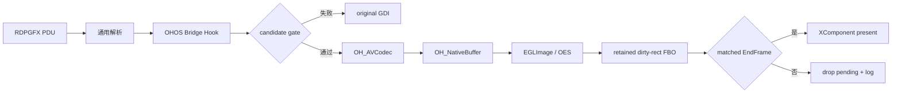

冻结四条不变量：original 始终可达；首帧验证前不 suppress GDI；一帧只有一个 owner；只有 matched EndFrame 才 present。

---

## 第 35 页｜把方案写成可执行步骤，而不是一张抽象架构图

<!-- type: LAB; section: CASE2_STORY; time: 3m -->

左侧展示 `case-materials/gpu/17-复杂三方项目GPU适配源码分析与探针方案.md` 的方案推导与十步路径，右侧展示 `case-materials/gpu/18-GPU适配实施任务包与验收点.md` 的任务入口。先回答“为什么这样改”，再回答“下一轮 AI 具体改什么”：

1. 建立 `ContentSlot → Native XComponent → OHNativeWindow`；
2. 保存 original callbacks，安装 OHOS Bridge；
3. 定义 codec/surface/target/state candidate gate；
4. 查询并启动 HARDWARE AVC decoder；
5. 用 PTS 维持 input/output 关联；
6. `OH_NativeBuffer → EGLImage → OES texture`；
7. dirty rect 合成到 retained FBO；
8. matched EndFrame 才提交；
9. 首帧成功后切 owner，失败回 original；
10. 补齐 frameId/PTS/import/present/fallback/gap 日志。

这一页不只放步骤摘要，还要保留 `path::symbol`、candidate gate、original fallback 和 matched EndFrame 等源码约束，让观众看见执行顺序是由代码证据推导出来的。

---

## 第 36 页｜迭代开发：每轮只增加一个已验证能力

<!-- type: LAB; section: CASE2_WORKER_PACKET; time: 3m -->

直接截取 `case-materials/gpu/18-GPU适配实施任务包与验收点.md`，并用统一 Worker Packet 说明每轮怎样约束 AI：

```text
Read First → RED/基线 → 只开放本轮文件 → 实现伪代码
→ 逐条 AC → 失败注入 → 保存证据 → 更新 Progress Ledger → Exit Gate
```

| 迭代 | 唯一目标 | 验收点 |
|---|---|---|
| I0 | 一帧调用链可追踪 | Linux/OHOS path::symbol 闭合 |
| I1 | XComponent target 生命周期 | create/change/destroy 正确 |
| I2 | 单 sample 硬解 | hardware identity + PTS output |
| I3 | 单帧 native-buffer 上屏 | EGLImage/OES/swap 可见 |
| I4 | dirty rect + EndFrame | 无提前显示、残影或双写 |
| I5 | 连续播放 | decoded/presented 前进、backlog 有界 |
| I6 | resize/reconnect/fallback | generation 和 owner 可恢复 |

探针通过后才生成下一轮计划；不要一次把 decoder、队列、生命周期、AVC444 和性能优化全部交给 AI。

课堂重点展示 G3（Bridge 可逆）、G4（硬解与 NativeBuffer）、G6（EndFrame/owner/fallback）三张任务卡。任一 AC 或证据位不闭合，后续 Story 保持 `BLOCKED`。

---

## 第 37 页｜问题处理不是新方法：仍沿同一条一帧链找第一断点

<!-- type: DEBUG; section: CASE2_DEBUG; time: 3m -->

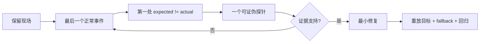

| 现象 | 第一条证据链 |
|---|---|
| 无 output | input → decoder state → PTS → SPS/PPS |
| 绿屏/错位 | native format → stride/crop → OES texture |
| output 已有但黑屏 | import → pending → matched EndFrame → target |
| 开始流畅随后卡顿 | command/endFrame/present gap → queue age/depth |

历史真实例子：“立即 present”修改构建安装成功但仍黑屏，日志证伪后回退并重建。代码成功编译不等于假设成立。

---

## 第 38 页｜结果与收束：从复杂项目中找到适配点，再逐步证明

<!-- type: CHECKPOINT; section: CASE2_ACCEPTANCE; time: 3m -->

- 中央保留大图/视频封面：`gpu-validation-video-playback-16s.mp4`。
- 旁边小入口放 `gpu-failure-black-screen-13s.mp4`，用于回看第 37 页的问题定位。
- 后续有更好的流畅播放截图，只替换结果图，不改变章节结构。

```text
参考实现追踪 → 找到稳定回调缝隙 → 平台最小探针 → 冻结边界与回退
→ 按最小能力迭代 → 沿同一证据链处理问题 → 结果可见、过程可复查
```

AI 可以帮助阅读和实现，但人要控制问题边界、适配点、验证门和回退策略。完整源码行号与十步文档见 `case-materials/gpu/17-复杂三方项目GPU适配源码分析与探针方案.md`。

---

## 第 39 页｜把方法带回项目，只保留七个问题

<!--
type: CLAIM
section: CLOSING
layout: final-chain
time: 4m
progress: 证据
-->

### 画面

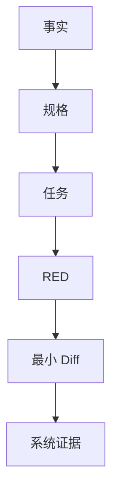

**可选收束主视觉（PPT 制作时与上方 Mermaid 二选一）**


<sub>讲师读图：任何单层检查都有孔洞。映射到本课就是测试、构建、日志、getter、截图/视频与同伴 Reviewer 叠加；只有多层证据对齐，才允许 PASS。图源：Anthropic《Demystifying Evals for AI Agents》。</sub>

下一次拿到复杂需求，只问七个问题：

1. 哪些词会让实现分叉？
2. 最终真相在哪一层？
3. 哪些不变量绝不能破坏？
4. 本轮只允许 AI 改哪个边界？
5. 怎样先制造一个可解释的 RED？
6. 最早异常证据在哪里？
7. 什么证据满足后，本轮必须停止？

**一分钟迁移题**

> 权限页面第一次进入数据为空，第二次进入正常。

每组必须用七问给出：一个最小只读勘察任务、一条可证伪假设、一项禁止修改范围和一个最终事实来源。不得直接回答“加延迟”或“页面初始化问题”。

### 讲师备注

用两个案例做最后对照：MDM 的关键是先由规格冻结多用户与事务语义；GPU 的关键是先由证据缩小未知边界。但两者最后都落到同一个外部循环：任务小、失败真、diff 窄、证据可追踪、停止条件明确。

再把七问映射回开场的六项进阶能力：前 3 问控制需求与上下文，第 4–5 问控制 Agent 边界和可验证实现，第 6 问依赖工具取得环境事实，第 7 问由 Eval 与风险匹配的 Reviewer 决定停止。这样学员离场时记住的是一套复杂需求交付框架，而不是 Ralph、MCP 或某个模型名称。

请学员展示最终包，不再展示聊天窗口。讲师最后强调：AI 可以加速探索、测试、实现和取证，但产品决策、真相源、事务边界和 PASS 判定仍由工程师负责。

### 演示动作

每组用 30 秒说出一条“原本准备让 AI 猜、现在改为先冻结或先取证”的真实工作项。

### 通过条件

学员带走的是可复用工作流与模板，而不是两个项目答案。

### 素材

- MDM evidence pack
- `gpu-diagnosis.md`
- 七问行动卡

---

# 附录 A｜讲师运行与 120 分钟时间盒

## A1. 严格时间盒

| 时间 | 页码 | 目标 | 必须保住的实践 |
|---|---:|---|---|
| 00–08 | 1–3 | 建立课程契约、英雄任务与受控循环 | PASS / FAIL / UNKNOWN |
| 08–26 | 4–8 | 领域模型、歧义、EARS、行为矩阵 | `spec.md` |
| 26–42 | 9–14 | 状态、真相源、架构、追踪、任务卡 | `design.md`、T01 |
| 42–70 | 15–22 | 两轮 RED→GREEN、日志定位、故障注入、identity | `progress.md`、patch |
| 70–88 | 23–27 | 平台预检、跨进程、MCP、验收 | `acceptance.md`、evidence |
| 88–116 | 28–38 | GPU Evidence-first、420/444 实现与诊断 | `gpu-diagnosis.md` |
| 116–120 | 39 | 同伴审阅、迁移七问、收束 | 最终包 |

以上按每页 `time:` 元数据合计恰好 120 分钟。若现场工具链变慢，优先压缩讲师揭晓和代码浏览，不压缩以下四项：歧义冻结、一个真实 RED、一次故障注入、一次设备证据判定。

## A2. 讲师节奏

每 8–12 分钟完成一次“结论→示例→实践→证据”：

1. 先给一个可争论问题，不先给答案。
2. 学员让 AI 产出候选，人完成决策或证据判断。
3. 打开真实代码 / 测试 / 日志校正 AI。
4. 立即写入 spec、task、progress 或 evidence，不留在聊天窗口。

## A3. 现场降级策略

| 阻塞 | 允许的降级 | 不允许的假通过 |
|---|---|---|
| DevEco / SDK 不可用 | 使用课前 RED/GREEN 录制输出，结论标环境 UNKNOWN | 手写绿色输出 |
| 无真机 | 使用真实采集的只读 evidence bundle，标“回放证据” | 使用 mock 冒充本次真机 |
| Admin 激活失败 | 保留构建/安装证据，系统行为 UNKNOWN | 用 UI 页面可打开判 PASS |
| MDM Getter 未准备 | 完成 contract 与现有 UI/log 证据，最终系统状态 UNKNOWN | 用 UI tree 顶替 restrictions / usbManager 回读 |

---

# 附录 B｜MDM 规格、AI 协同与工程验收

## B1. TEACHING Requirements

### FR-USB-001｜全局 USB 真源

WHEN 页面初始化或刷新，THE SYSTEM SHALL 从 restrictions `usb` 回读设备级全局状态；SHALL NOT 使用 Preferences/RDB 保存全局镜像。

### FR-USB-002｜策略优先级

FOR EACH USB device，THE SYSTEM SHALL 按 `global disabled > explicit desiredPolicy > usbDefaultPolicy` 求有效策略；USB_STORAGE 还必须服从上层 USB 存储访问模式。

### FR-USB-003｜默认策略

WHEN 管理员切换默认 allow/deny，THE SYSTEM SHALL 只保存 `usb_default_policy`，SHALL NOT 枚举、下发或修改已有设备记录；缺失或非法值 SHALL 回退 allow。

### FR-USB-004｜首次 allow

WHEN 新设备没有显式记录且默认 allow，THE SYSTEM SHALL 不下发 deny，但 SHALL 保存 `desired=allow/active=none/present=true` 的白名单资产状态。

### FR-USB-005｜首次 deny

WHEN 新设备没有显式记录且默认 deny，THE SYSTEM SHALL 先下发系统 deny；ONLY IF 系统下发成功，才保存 `desired=deny/active=deny`。失败不得产生假黑名单。

### FR-USB-006｜动态规则

WHEN 管理员修改在线 USB 的 allow/deny，THE SYSTEM SHALL 在系统下发成功后提交本地状态；离线、非法 fingerprint、全局禁用或存储冲突 SHALL 拒绝并保持旧值。

### FR-USB-007｜全局禁用与补偿

BEFORE 全局禁用，THE SYSTEM SHALL 暂停 active deny；IF 暂停或全局下发失败，SHALL 补偿已改变项并且 UI 不提交新状态。全局禁用不得改写 `desiredPolicy`。

### FR-USB-008｜全局恢复

AFTER 全局启用成功，THE SYSTEM SHALL 重放所有 `present=true && desired=deny` 的设备策略；部分失败 SHALL 留下 warning/失败依据，不伪造全部恢复成功。

### FR-USB-009｜还原策略

WHEN 执行还原，THE SYSTEM SHALL 先清理 EDM 当前全部 disallowed USB type 策略，再把本地卡片恢复 `allow/none`；系统清理失败时不得先改本地。

### FR-USB-010｜证据边界

验收 SHALL 分别记录 UI、本地状态、MDM 回读与实物行为；任一必要层缺失 SHALL 标 UNKNOWN/PENDING，不得用较低层证据代替。

### FR-USB-011｜部分生效

IF MDM API 返回错误但 getter 已等于目标值，THE SYSTEM SHALL NOT 简单回滚为旧状态；SHALL 区分策略已保存但重枚举/重挂载未完成，并提供可行动提示与后续实物验证。

### FR-USB-012｜事实发布

WHEN Trace RDB 写入事务成功，THE SYSTEM SHALL 立即发布变更；过期清理、数量裁剪等维护失败 SHALL NOT 吞掉已经提交的连接事实。

### FR-USB-013｜在线态对账

WHEN 外设运行时启动或恢复，THE SYSTEM SHALL 用当前真实 USB 设备集合对 `present` 执行对账；SHALL 保留离线设备的 `desiredPolicy`，但 SHALL NOT 允许离线设备继续动态修改。

## B2. 完整行为矩阵

| 全局 | 存储 | 显式状态 | 默认 | 动作/结果 | 状态提交 |
|---|---|---|---|---|---|
| 禁用 | 任意 | allow/deny/无 | 任意 | 全部有效 deny；名单置灰 | desired 保留，active 应为 none |
| 启用 | DISABLED | USB_STORAGE 任意 | 任意 | 拒绝单设备 allow/deny | 不变 |
| 启用 | READ_WRITE/ONLY | deny | 任意 | 在线时确保类型 deny | 成功后 active=deny |
| 启用 | READ_WRITE/ONLY | allow | 任意 | 不保留类型 deny | 成功后 active=none |
| 启用 | READ_WRITE/ONLY | 无 | allow | 不 dispatch，建白名单 | allow/none |
| 启用 | READ_WRITE/ONLY | 无 | deny | 先 dispatch deny | 成功 deny/deny，失败不新增 |
| 禁用失败 | READ_WRITE | 有 active deny | 任意 | 恢复已暂停 deny | UI 保持旧全局状态 |
| 恢复成功 | 任意 | present+desired deny | 任意 | 重放 deny | 逐项提交 active |
| 还原 | 非全局禁用 | 任意 | 任意 | 先清系统残留 | 全部 allow/none，卡片保留 |

## B3. 不变量与当前 GAP

| ID | 不变量 | 当前状态 |
|---|---|---|
| I1 | 全局状态只来自 restrictions | CURRENT |
| I2 | global > desired > default | CURRENT |
| I3 | desired 与 active 分离 | CURRENT |
| I4 | 系统成功后才提交 active | CURRENT |
| I5 | 默认值不批量修改已有设备 | CURRENT |
| I6 | 还原先系统后本地 | CURRENT |
| I7 | Trace 不作为 Policy State 真源 | CURRENT |
| G1 | 系统按 baseClass 而非 fingerprint 下发 | PLATFORM GAP / 产品需知情 |
| G2 | 全局恢复部分 deny 重放失败只告警 | OPERATIONAL GAP / 需设备复核 |
| G3 | 完整 D6/D7 设备矩阵未归档 | EVIDENCE GAP |
| G4 | E2E JSON artifacts 为空 | TELEMETRY GAP |
| G5 | Trace notify 位于维护流程末尾，写入后可能未即时发布 | STATE FLOW GAP / OPEN |
| G6 | `present` 尚无启动真实设备对账 | STATE TRUTH GAP / OPEN |
| G7 | `9200007` 部分生效尚未形成统一 ViewModel 结果模型 | ERROR SEMANTICS GAP / OPEN |
| G8 | 还原后系统成功、本地保存失败缺少完整补偿 | TRANSACTION GAP / OPEN |

## B4. `spec.md` 空白模板

```markdown
# Feature: <name>

## Business Goal
- User / device scope：
- Security value：

## Policy Layers
- Global policy：
- Type/account policy：
- Explicit device policy：
- Default policy：

## Truth Sources
| State | Owner | Read API | Write API |
|---|---|---|---|

## Priority
effectivePolicy = ...

## EARS Requirements
- WHEN ... THE SYSTEM SHALL ...
- IF ... THE SYSTEM SHALL ...

## State Matrix
| Global | Device | Default | Expected |
|---|---|---|---|

## Failure Semantics
- Precondition failure：
- System write failure：
- Local save failure：
- Compensation failure：

## Acceptance
- UI oracle：
- Local state oracle：
- System readback：
- Physical behavior：
- PASS / FAIL / UNKNOWN rule：

## Non-goals
- ...
```

## B5. `design.md` 空白模板

```markdown
# Design: <name>

## MVVM Responsibilities
| Layer/Class | Owns | Must not own |
|---|---|---|

## State Model
- desired：
- active：
- present：
- global：

## Main Flows
### Global disable
1. ...

### Global restore
1. ...

### First connect
1. ...

### Dynamic policy
1. ...

### Restore all
1. ...

## Transaction / Compensation
- Snapshot or pre-state：
- Commit point：
- Compensation：
- Irreversible side effects：

## Verification Mapping
| Invariant | UT | E2E | System | Physical |
|---|---|---|---|---|
```

---

## B6. AI Prompt 梯子

下面的 Prompt 不是“万能咒语”，而是每轮输入/权限/输出/停止条件的模板。每次只使用当前阶段的一条。

### B6.1 歧义勘察 Prompt

```text
你是需求分析协作者。不要设计方案，不要写代码。

输入：<原始需求>、<领域对象>、<目标平台约束>。

任务：只找会改变状态模型、系统调用顺序、事务补偿、
跨进程行为、测试或验收的实现分叉。

每项输出：
1) 原文中的模糊词；2) 至少两个互斥答案；
3) 每个答案改变的工程行为；4) 必须由谁决定；
5) 若不决定，AI 最可能做出的危险假设。

禁止输出架构、类名、代码。未知标 OPEN。
```

### B6.2 仓库只读勘察 Prompt

```text
本轮禁止修改任何文件。

围绕 <Requirement ID>，使用搜索和提交历史给出：
- 用户/系统入口；
- 最短调用链；
- 每个真相源与失败表达；
- 所有副作用与唯一 commit point；
- 已有单测、设备测试、E2E；
- 相关提交为何改变行为；
- 规格与当前实现的差距。

每个结论必须附现有路径/符号/提交证据。
找不到就写 NOT FOUND，不得发明 API。
```

### B6.3 任务切片 Prompt

```text
根据已冻结 spec/design，把 <Requirement ID> 切成最小任务。

每张任务卡必须包含：唯一可观察结果、Allowed Files/Layers、
Forbidden Changes、失败测试、实现提示、验证命令、证据文件、
停止条件、剩余风险。

一个任务若需要同时改 UI、Service、Repository、系统 bridge，
请继续拆分。不要按文件数量切任务。
```

### B6.4 RED Prompt

```text
只为 <Task ID> 增加一个会因缺少目标行为而失败的测试。
先阅读现有测试风格和可用 fake/mock；不要虚构 Hamock API。

运行最窄测试并报告：命令、退出码、唯一目标失败、关键输出。
若失败来自环境/编译/无关断言，停止并标 BLOCKED，禁止改生产代码。
```

### B6.5 最小实现 Prompt

```text
目标：让 <Task ID> 的目标 RED 转 GREEN。

只允许修改：<Allowed>。
禁止修改：<Forbidden>。
必须保持：<Invariants>。

先说明最小状态转换和预计 diff，再实施。
不得删除/放宽测试，不得把未知降级为空，不得顺便重构。
完成后运行窄测试、相关回归，并更新 progress.md。
```

### B6.6 DEBUG Prompt

```text
不要先给修复。根据同一个 correlationId/frameId 的证据：
1) 标出最早异常事件；
2) 列出已被证据排除的层；
3) 给出一个可证伪假设；
4) 只增加验证该假设所需的最小日志/探针；
5) 写出会推翻假设的反证。

禁止根据最终 UI 现象直接跳到根因。
```

### B6.7 验收审阅 Prompt

```text
按 spec 的每个 SHALL 审阅 evidence pack。
只返回 PASS / FAIL / UNKNOWN。

PASS：必须有要求层级的直接事实；
FAIL：直接证据与预期矛盾；
UNKNOWN：设备、权限、getter、日志字段或证据缺失。

UI 文案只能证明 UI；mock 只能证明测试逻辑；
不得用较弱证据替代 system getter。
```

---

## B7. Ralph 任务与进度模板

### B7.1 Task Card

```markdown
# TXX — <一个可观察结果>

## Requirement
- FR-...

## Current Evidence
- 现有行为：
- 代码锚点：
- 已知 GAP：

## Allowed
- 文件 / Layer：

## Forbidden
- 不得修改：
- 不得改变的不变量：

## RED First
- 输入：
- 注入失败：
- 预期断言：
- 运行命令：

## Minimal Implementation Hint
- 只描述边界和状态转换，不预写完整实现。

## Verify
- Narrow test：
- Related regression：
- Build / device：
- Evidence paths：

## Stop
- [ ] RED 原因正确
- [ ] GREEN + 回归
- [ ] diff 未越界
- [ ] 设备事实 PASS，或阻塞为 UNKNOWN
- [ ] progress.md 已更新
```

### B7.2 Progress Ledger

```markdown
## Round <N> — <timestamp>

- Task：
- Hypothesis：
- RED command / exit / evidence：
- Files changed：
- GREEN command / exit / evidence：
- New fact：
- Remaining risk：
- Verdict：PASS | FAIL | UNKNOWN
- Stop reason / Next task：
```

### B7.3 两轮课堂示例

### Round 1 / S3

- Hypothesis：默认 allow 不下发系统策略，因此不需要保存设备状态。
- RED：设备可用，但 Policy VM 没有白名单记录。
- Minimal diff：allow 分支保存 `desired=allow/active=none/present=true`，仍不 dispatch。
- New fact：系统未禁止与资产已纳管是两种不同事实。
- Next：给默认 deny 注入系统下发失败。

### Round 2 / S5

- Hypothesis：暂停设备 deny 后可以直接下发全局 USB 禁用。
- RED：全局调用失败后，已暂停的设备规则没有恢复。
- Minimal diff：在 `UsbGlobalPolicyService` 失败分支调用 `restorePresentDeniedPolicies()`；成功后才提交 UI。
- Remaining risk：补偿自身可能失败；系统按 baseClass 下发，需要实物矩阵。
- Stop：窄测/回归绿，MDM getter 与实物证据仍待补；最终保持 PARTIAL/PENDING。

---

## B8. 构建、测试与 MDM 外设验收手册

### B8.1 本地验证命令

```powershell
# 单元测试
hvigorw test --mode module -p product=default -p module=entry@default

# 主 HAP
hvigorw assembleHap --mode module -p product=default -p module=entry@default

# ohosTest 编译
hvigorw test --mode module -p product=default -p module=entry@ohosTest
hvigorw assembleHap --mode module -p product=default -p module=entry@ohosTest
```

报告：`entry/.test/default/outputs/test/reports/coverageReport.json`。先看目标测试是否执行，再看 coverage；coverage 不替代系统验收。

### B8.2 设备执行链

```powershell
hdc list targets
hdc install hapsigner/signApp.hap
hdc shell edm enable-admin -n com.huawei.securitytool -a EnterpriseAdminAbility -t super
hdc shell aa start -a EntryAbility -b com.huawei.securitytool -m entry
```

每次验收记录：

```text
runId / commit / HAP hash / deviceId / OS version
admin state / USB VID:PID / baseClass / SN / storage mode
```

### B8.3 E2E 可执行链（CURRENT）

```powershell
python scripts/e2e/run_e2e.py --list-suites
python scripts/e2e/run_e2e.py --case scripts/e2e/cases/peripheral/interfaces.json
python scripts/e2e/run_e2e.py --case scripts/e2e/cases/peripheral/usb_policy.json
python scripts/e2e/run_e2e.py --case scripts/e2e/cases/peripheral/usb_whitelist.json
python scripts/e2e/run_e2e.py --case scripts/e2e/cases/peripheral/usb_blacklist.json
```

以真实 Runner 参数为准；先 `--list-suites`/查看 help，不在课堂手写虚构参数。

已有结果：`PER-IF-001/002`、`PER-POL-001`、`PER-POLICY-002`、`PER-REC-001`、`PER-WL-USB-001` PASS；`PER-BL-USB-001` 是保留的旧 FAIL。

### B8.4 系统 Getter 与实物 Oracle（TARGET）

建议验收 bridge 输出结构化结果，不用 UI 文本猜系统状态：

```json
{
  "runId": "usb-20260901-001",
  "globalUsb": {"status": "OK", "disabled": false},
  "storagePolicy": {"status": "OK", "value": "READ_WRITE"},
  "disallowedTypes": {"status": "OK", "baseClasses": [8]},
  "localState": {
    "status": "OK",
    "records": [
      {"fingerprint": "USB-SN:...", "desired": "deny", "active": "deny", "present": true}
    ]
  },
  "physical": {"status": "PENDING", "deviceUsable": null}
}
```

任何必需 `status != OK` 都使系统结论至少为 UNKNOWN。`baseClasses=[]` 必须与“读取失败”使用不同状态。

#### B8.4.1 错误码与系统日志取证

```powershell
hdc shell hilog -r
hdc shell hilog -x | Out-File -Encoding utf8 .\usb-policy.log
Select-String -Path .\usb-policy.log -Pattern `
"UsbGlobalPolicyService|PeripheralDevicePolicyDispatchService|UsbReadOnlyPlugin|disallowed_usb_devices|readonly value|Unmount|Mount|9200010|9200007"
hdc shell param get persist.filemanagement.usb.readonly
hdc shell param get const.enterprise.external_storage_device.manage.enable
```

| 观察 | 结论 | 下一步 |
|---|---|---|
| `9200010` + 存在 disallowed type | 系统策略冲突 | 还原系统类型规则并回读 |
| `9200007` + getter 已到目标 + Unmount/Mount 失败 | 部分生效 | 关闭占用、重插设备、补 D7 |
| API fail + getter 仍是旧值 | 完全失败 | 保持旧状态、检查权限/管理员/冲突 |
| UI 变了但 getter/实物没变 | 假成功 | FAIL，回查提交顺序 |
| RDB 有 trace 但 VM 没刷新日志 | 事实发布链断点 | 查 notify 位置，不用 Tab 切换掩盖 |

### B8.5 `acceptance.md` 模板

```markdown
# Acceptance — <runId>

## Identity
- Commit：
- HAP hash：
- Device / OS：
- Admin：
- USB VID:PID / class / SN：

## Preconditions
- Global USB before：
- Storage policy before：
- Disallowed types before：
- Local state before：

## Action
- User action：
- Expected policy transition：

## Evidence
| Layer | Evidence | Status |
|---|---|---|
| UI | screenshot/video | PASS/FAIL/UNKNOWN |
| Local state | state dump | PASS/FAIL/UNKNOWN |
| MDM system | structured readback | PASS/FAIL/UNKNOWN |
| Physical | attach/use behavior | PASS/FAIL/UNKNOWN |

## Cleanup
- Restore action：
- System after cleanup：

## Verdict
PASS | FAIL | UNKNOWN | PENDING

## Why
- What is proven：
- What is not proven：
- Next action：
```

---

# 附录 C｜GPU 技术、素材与方法依据

## C1. AVC420 / AVC444 事实对照

| 维度 | AVC420 | AVC444 |
|---|---|---|
| Decoder output | opaque NativeBuffer | mapped NV12/NV21 planes |
| GPU input | EGLImage + External OES | Y/UV plane upload |
| Retained state | RGBA Texture + FBO | Y/U/V texture state |
| First takeover | full update 或可信 GDI base | 完整 luma/base-chroma readiness |
| Partial update | dirty rect 外保留旧 RGBA | LC 更新指定 luma/chroma |
| GDI relation | producer 保留；GPU owner 时 presenter 受控 | GPU owner 时 GDI presenter 受控 |
| Decoder model | AVC stream + retained GDI | 单 decoder 顺序消费 luma/chroma |
| Current risk | 累计阈值、queue 720 同步越序、0 rect | queue 非硬上限、Surface lifecycle |

## C2. AVC420 接管判定

| 输入 | 背景 | 结果 |
|---|---|---|
| Full-surface AVC | 不要求 GDI seed | 可同步构建 base 并尝试接管 |
| Partial AVC | fresh、同尺寸、有效 GDI snapshot | seed RGBA FBO 后接管 |
| Partial AVC | 无可信 snapshot | 返回 false，不 suppress GDI |
| Active AVC | retained 已可信 | 深拷贝 command 后入 worker |
| Active enqueue 失败 | retained / owner 仍在 | 当前实现可能同步处理，检查顺序 GAP |

`failures` 与 `ignoredUpdates` 是累计计数；教学时若要表达“连续失败”，必须先设计 reset 条件并补测试。

## C3. AVC444 LC 判定

```text
LC=0: needsLuma=true,  needsChroma=true
      stream1=luma, stream2=chroma

LC=1: needsLuma=true,  needsChroma=false
      stream1=luma

LC=2: needsLuma=false, needsChroma=true
      stream1=chroma
```

只有 retained state 满足 present readiness 时才可 claim / present。测试至少覆盖 LC 顺序变化、SPS/PPS 缺失、decoder reset、NV12/NV21、v1/v2 chroma、0 dirty rect、Surface recreate。

## C4. Frame boundary 的规则与例外

- 普通 AVC pending update：匹配 real 或 synthetic EndFrame 后 present。
- `frameOpen=false`：bridge 生成 synthetic matched frame callback。
- AVC420 GDI-only 且无 AVC pending：可以立即 present。
- AVC420 deferred GDI-only：可在匹配 EndFrame present。
- target 恢复：可以直接重呈现 retained composite。

因此验收断言应写具体分支，不能写成“所有 present 都必须对应真实 EndFrame”。

## C5. `gpu-diagnosis.md` 模板

```markdown
# GPU Diagnosis — <runId>

## Reproduction
- Device / build / resolution / network：
- Gesture or workload：
- AVC420 | AVC444 | shared：
- Time window / frameId：

## Symptom
- 可观察现象：
- 基线指标：decode / queueAge / compose / present / fps：

## Earliest Anomaly
- Event：
- Evidence：
- Layers already excluded：

## Falsifiable Hypothesis
- Hypothesis：
- One boundary to change or instrument：
- Counter-evidence that would reject it：

## Minimal Diff
- Allowed files：
- Forbidden changes：

## Verification
- Same frameId trace：
- Owner / readiness / EndFrame / Surface generation：
- Before / after metrics：
- Visual evidence：

## Verdict
PASS | FAIL | UNKNOWN
```

## C6. 两个课堂 Case 参考答案

### Case 420

证据：decode 4ms、compose 3ms、queueAge 110ms，queue 达 720 后 enqueue false、当前命令转同步路径。

- 最早异常：worker 排队与排序边界。
- 下一轮：只记录 sequence number、enqueue/processed order、fallback path；不要改 decoder。
- 反证：若 queueAge 降低且严格顺序仍卡，假设被推翻，继续看 present / target。
- GAP：同步处理可能越过旧队列任务，不能宣称天然保序。

### Case 444

证据：decode/compose 均低，首个可见命令 LC=2，retained `hasLuma=false`。

- 最早异常：首次接管 readiness / 命令序列，不是 shader 性能。
- 下一轮：记录 LC、SPS/PPS、hasLuma/hasChroma、claim owner；验证是否应等待 luma base。
- 反证：若此前有成功 LC0/1 并且 luma state 在同 Surface generation 有效，则检查生命周期丢失。

## C7. GPU 验收矩阵

| 场景 | 必备直接证据 | PASS 条件 |
|---|---|---|
| 420 full takeover | command、import、retained、owner | 首帧完整、无双写 |
| 420 partial + seed | snapshot validity、rect、FBO | rect 外像素保留 |
| 420 partial no seed | suppress/owner log | 保持 GDI，不出现黑底 |
| 420 target pause/recover | generation、state、re-present | 旧 callback 不写新 target |
| 420 backlog | enqueue/process sequence | 无协议乱序或明确安全策略 |
| 444 LC0/1/2 | LC、decode order、readiness | 未更新 plane 保持旧值 |
| 444 NV12/NV21 | planes、shader input、known frame | 无错色/越界 |
| 444 queue / Surface | depth、destroy/reset、owner | 队列有界目标与资源闭合 |
| 共用输出 | owner transition、EndFrame、swap | 单 owner、帧边界正确 |

---

## C8. 代码与提交素材索引

### C8.1 MDM 代码锚点

| 教学问题 | 真实锚点 |
|---|---|
| MVVM 父级协调 | `PeripheralViewModel.toggleInterface/handlePeripheralPolicyChange` |
| USB 全局事务 | `UsbGlobalPolicyService.setDisabled` |
| 默认 allow/deny | `PeripheralDevicePolicyRepository.get/setUsbDefaultPolicy` |
| 首次连接规则 | `UsbDevicePolicyStateService.handleConnect` |
| 拔出内部恢复 | `UsbDevicePolicyStateService.handleDisconnect` |
| 动态单设备规则 | `PeripheralPolicyViewModel.setDevicePolicy` |
| 系统 MDM 下发 | `PeripheralDevicePolicyDispatchService.dispatch` |
| 还原与残留清理 | `clearAllUsbDeviceTypePolicies/clearAllPolicies` |
| UI 受控状态 | `InterfaceControlTab`、`PolicyList` |

推荐提交故事：

- `63dda4b4`：外设 USB 策略状态独立建模。
- `a2f0128b`：策略清理职责收敛。
- `093cb6e4`：还原时保留设备卡片。
- `786e370c`：修正还原按钮状态真源。
- `6e7702cd`：全局 USB 与设备策略的暂停、补偿和重放。
- `23c4a046`：默认 allow 设备也建立白名单记录。
- `0d26c92e`：全局恢复后的 USB 重枚举采用有界重试。
- `f95c5109`：USB 存储策略成功后同步名单可编辑状态。

### C8.2 GPU 代码锚点

| 教学问题 | 真实锚点 |
|---|---|
| 420 owner/state/queue | `surface/avc420_gpu_compositor.h/.cpp` |
| 420 decode/EGL/retained | `surface/avc420_gpu_compositor_internal.cpp` |
| 444 queue/callback | `surface/avc444_gpu_compositor.cpp` |
| 444 decoder/LC/YUV | `surface/avc444_gpu_compositor_internal.cpp` |
| 公共 owner | `surface/render_output_owner.h/.cpp` |
| XComponent target | `surface/xcomponent_native_host.cpp` |
| FreeRDP OHOS bridge | `client/OHOS/ohos_rdpgfx_surface.c` |
| FreeRDP H264 fallback | `libfreerdp/codec/h264_ohos_decoder*.c` |

可用于讲师备注的提交锚点：`a9c05d2`、`a6918ba1`、`93c6207`、`d789bb5`、`5370d34`、`227c1a9`、`1c07750`、`00544cb`。上课不在画面堆哈希，只在打开历史时使用。

### C8.3 每 2–3 页插入的真实素材

1. MDM 外设页三个 Tab 与黑白名单截图。
2. `rg` 勘察结果与 MVVM 调用链。
3. 默认 allow 漏名单的 RED / GREEN 对照。
4. USB 全局暂停/补偿/恢复重放关键代码。
5. E2E `PER-BL-USB-001` FAIL 与 `PER-POL-001` PASS。
6. MDM 系统回读、USB 插拔视频与同类型双设备结果。
7. AVC420 opaque import、dirty rect、owner 日志。
8. AVC444 planes、LC、readiness 日志。
9. Surface destroy/recreate 与 owner transition。
10. 最终 evidence pack 文件树。

---

## C9. 课前准备与视觉交付清单

### C9.1 讲师必须提前准备

- 锁定两个仓库的演示 commit，确认所有代码锚点仍存在。
- 准备训练分支：默认 allow 漏名单、全局禁用补偿两个场景可产生真实 RED；不要在已修复 HEAD 上假演示失败。
  - 场景 1：默认 allow 新设备可用但名单为空；GREEN 对应 `23c4a046` 的状态保存修正。
  - 场景 2：暂停 device deny 后全局下发失败；故障注入必须能区分主操作与 compensate。
- 在授课设备跑通 Hvigor test/build、签名、安装、admin 激活与 HDC。
- 准备至少两只同 baseClass 的 USB 设备、一只不同类型设备和可读 SN/VID/PID 的采集记录。
- 若要最终 PASS，课前补齐 restrictions、USB storage、disallowed device types 的只读回读；否则固定展示 UNKNOWN/PENDING。
- 预采集一份真机 evidence bundle，作为设备故障时的“回放证据”，标明设备与时间。
- 为 GPU 准备 AVC420/AVC444 可复现片段、卡顿录屏、已脱敏 frame trace 与色块 Buffer。
- 提前验证 39 页所有 `time:` 合计 120 分钟。

### C9.2 PPT 资产命名

先检查现成资产，不把“建议截图”误写成“证据已经准备”：

| 资产 | 当前状态 | 授课要求 |
|---|---|---|
| `harmonyos-sdd-workshop-media/e2e/peripheral-policy-current.png` | READY | 只用于证明外设策略页面可见，明确不能证明系统下发 |
| `harmonyos-sdd-workshop-media/gpu-*` 与 `freerdp-*` | READY | 结合 runId/frame trace 使用，不以单图判 PASS |
| 默认 allow/deny 与全局补偿 UT | EVIDENCE READY | 真实测试位于 `entry/src/test/peripheral`；课前截取目标断言和结果 |
| P24 E2E FAIL→PASS | EVIDENCE READY | `PER-BL-USB-001` 与 `PER-POL-001` 均为真实 JSON；artifacts 为空，不补造视频 |
| P25 structured acceptance readback | TARGET | 需补 MDM 回读与实物结果；固定演示 PENDING，不用 UI tree 顶替 |

```text
assets/
├── 01-opening-device-vs-tests.png       # 外设页面 + 测试输出
├── 04-mdm-peripheral-policy-model.svg
├── 15-default-allow-red.png
├── 16-default-allow-green.png
├── 18-usb-global-transaction.png
├── 21-usb-compensation-fault.png
├── 24-e2e-fail-pass.png
├── 25-mdm-readback-pending.png
├── 28-cpu-stutter-before-placeholder.png
├── 29-codebase-map.png
├── 30-platform-research-sequence.svg
├── 31-harmonyos-gpu-adr.svg
├── 32-one-frame-spike.svg
├── 33-task-cards.png
├── 34-t01-t03-development.svg
├── 35-progress-ledger.png
├── 36-issue-triage.png
├── 37-delivery-bundle.png
└── 38-before-after-acceptance.png
```

### C9.3 页面制作验收

- [ ] 画面层每页只有一个判断中心。
- [ ] 所有长答案、完整矩阵、哈希与路径进入 Notes / 附录。
- [ ] 表格画面层不超过 4×4；代码不超过 12 行。
- [ ] CLAIM / MAP / CODE / DEBUG / LAB / CHECKPOINT 节奏交替。
- [ ] 所有 CURRENT / GAP / TARGET 标签颜色统一。
- [ ] LAB 都有输入、允许动作、交付和通过条件。
- [ ] DEBUG 都有最早异常、下一步和反证。
- [ ] 证据页明确 PASS / FAIL / UNKNOWN。
- [ ] 每个真实截图/视频都写明“能证明 / 不能证明”，并绑定 runId 或时间范围。
- [ ] 每 10–12 分钟至少有一次学员可观察动作；不能连续三页只有讲师操作。
- [ ] 主画面优先真实问题与项目证据；Anthropic 配图只解释方法，不抢占案例证据中心。
- [ ] 页脚进度带 `需求—设计—任务—代码—调试—证据` 与本页阶段一致。

---

## C10. 项目事实与方法论依据

### C10.1 项目事实来源

本课程的项目事实以以下本地仓库及其提交历史为准：

- `repos/security_tool`
- `repos/harmony-windows-bridge`
- `repos/harmony-windows-bridge/harmony/third_party/FreeRDP`
- `repos/harmonyos-dev-mcp`

对外分享前，再按授课当天的 HarmonyOS SDK、MDM API、OH_AVCodec / OH_NativeBuffer 文档复核接口签名、权限、错误码和生命周期约束。外部文档只用于确认平台契约；案例行为仍必须由当前代码、测试和真机证据共同支持。

### C10.2 Anthropic 方法论文章

| 官方文章 | 核心观点（本课采用的部分） | 在课程中的落点 |
|---|---|---|
| [Best practices for Claude Code](https://code.claude.com/docs/en/best-practices) | 先 Explore，再 Plan、Implement；给 Agent 可运行的检查；主动管理上下文；长任务后用新上下文反证 | 第 3–5、13、27 页 |
| [Building Effective AI Agents](https://www.anthropic.com/engineering/building-effective-agents) | 从最简单可行方案开始；工作流适合确定路径，Agent 适合开放任务；执行中持续获取环境 ground truth，并设置 checkpoint / stopping condition | 第 4、6–7、28、39 页 |
| [Effective Harnesses for Long-Running Agents](https://www.anthropic.com/engineering/effective-harnesses-for-long-running-agents) | 首轮建立任务与验证清单；后续一次只推进一个 feature；使用 progress、Git 和端到端测试完成跨上下文交接 | 第 14–17 页、附录 B7 |
| [Effective Context Engineering for AI Agents](https://www.anthropic.com/engineering/effective-context-engineering-for-ai-agents) | 上下文是有限注意力预算；保留完成当前任务所需的最小高信号信息；长任务使用压缩、结构化记录和按需检索 | 第 13、17 页、附录 B7 |
| [Writing Effective Tools for Agents](https://www.anthropic.com/engineering/writing-tools-for-agents) | 少量高价值工具优于大量重叠薄包装；工具应有清晰边界、语义化返回、token 效率，并用真实任务评测 | 第 25–26 页、附录 B8 |
| [Demystifying Evals for AI Agents](https://www.anthropic.com/engineering/demystifying-evals-for-ai-agents) | 复杂 Agent 评估要区分 task、trial、trace 与 outcome；组合代码、模型和人工 grader；从真实失败建立可维护的 eval suite | 第 3、26–27、39 页、附录 B8 |
| [Harness Design for Long-Running Application Development](https://www.anthropic.com/engineering/harness-design-long-running-apps) | 把长任务拆成可处理片段，用结构化产物跨阶段交接；Planner、Generator 与 Evaluator 分工；持续检验 harness 中哪些假设真正必要 | 第 14–17、27、39 页、附录 B7 |
| [AI Fluency 研究型课程模型](https://academy.claude.com/tutorials/getting-good-at-claude-a-research-backed-curriculum) | 对话式工具先教迭代，执行型与异步型 Agent 先教澄清目标；描述能力沿耐久度逐渐扩展；辨别力不会随使用时间自然增长，必须在每一步重复训练 | 第 5 页主视觉、各模块辨别检查、结课迁移 |

使用这些来源时保留两个时间与适用性边界：

1. `Building Effective AI Agents` 发布于 2024 年，原页面已提示工具生态随后发生变化。本课只采用仍稳定的原则：从简单方案开始、区分 Workflow 与 Agent、持续读取环境事实、设置 checkpoint 和 stopping condition；不照搬具体产品配置。
2. 独立 Evaluator 不是所有任务的固定要求。任务位于模型可靠能力范围内且已有强确定性检查时，额外 Evaluator 可能只是开销；跨进程、事务、权限、GPU、主观质量或模型能力边缘任务才优先启用。

### C10.3 从文章观点到本课动作

本课不照搬任何具体 AI 产品命令或功能清单，而是提炼跨工具、跨项目成立的工程动作：

| Anthropic 观点 | 本课工程化动作 | HarmonyOS 项目证据 |
|---|---|---|
| Agent 需要环境 ground truth | 每轮必须读取测试、构建、日志、system getter 或帧链事实 | MDM policy/rules；GPU frameId/owner/EndFrame |
| Workflow 与 Agent 解决不同问题 | 构建、安装、采集走可重复 workflow；歧义探索、假设选择和最小 diff 才交给 Agent | MCP 验证链固定；MDM / GPU 决策路径按证据分叉 |
| 不同工作形态有不同入口动作 | 对话式工具用追问迭代；执行型与异步型 Agent 先澄清完成状态与边界，再进入小步反馈 | 第 2–5 页、英雄任务、歧义树与 Task Card |
| 辨别力必须刻意训练 | 每个模块都以“什么会让它错、还缺什么证据”收尾 | 故障注入、UNKNOWN、同伴反证与最终系统回读 |
| 没有检查就只能“看起来完成” | STOP 由可执行 Verification 决定，阻塞时返回 UNKNOWN | RED/GREEN、HAP build、真机回读 |
| 一次只推进一个 feature | 一张 Task Card 只允许一个可观察结果和有限文件范围 | T01 稳定快照；T02 故障补偿；T03 getter |
| progress 是跨上下文控制面 | 记录新事实、证据路径、剩余风险和 Stop/Next，不复制聊天 | `progress.md` 与 evidence pack |
| 上下文要少而高信号 | 只给 spec、current task、progress、相关文件和证据索引 | 新会话复现下一步，不重新扫描整仓 |
| 工具应面向工作流而非底层 API | MCP 返回 Agent 下一步决策所需的状态、原因码和证据路径 | `build_app`、`logs_query`、TARGET runtime getter |
| Trace 与 outcome 必须分开评估 | 既审查 Agent 的工具调用、修改轨迹和越界行为，也回读系统最终状态 | `progress.md` + diff 是 trace；getter / frame evidence 是 outcome |
| 高风险任务不由实现者独自打分 | Planner 冻结目标，Implementer 产出最小 diff，Reviewer 只按 AC、diff、测试和证据反证；低风险强测试任务允许确定性检查直接收口 | 第 27 页 evidence pack 互审 |

引用这些文章的目的不是给课程增加一套新名词，而是说明：本课从两个真实 HarmonyOS 项目提炼出的“需求先冻结、上下文高信号、Workflow 与 Agent 有边界、任务小、失败真、证据强、评估独立、停止清楚”，与 Anthropic 在 Agent 工程实践中总结的可靠性原则一致。

### C10.4 把 Agent Eval 图翻译成课堂验收


课堂不要求学员搭建完整评测平台，但必须理解图中的六个对象如何映射：

- `Task` → 一张带输入、AC、Allowed、Forbidden 与 Stop 的任务卡。
- `Trial / Trajectory` → 一次受控执行及其 Prompt、工具调用、diff、测试和 `progress.md`。
- `Outcome` → 真机最终 policy/rules，或 GPU 同一 `frameId` 的 owner / present 事实。
- `Graders` → 确定性测试、状态 getter、Reviewer rubric 与人工设备观察。
- `Evaluation suite` → 正常、失败注入、重复事件、跨进程和回归 Case 集合。
- `Harness` → 负责装载上下文、调用工具、保存轨迹、执行 grader 与汇总结论的外部控制面。

这张图最适合放在第 27 页之后做 2 分钟拓展：先遮住 `Outcome`，问学员“为什么聊天记录、diff 和测试全绿仍可能不够”；揭示最终环境状态后，再回到 `PASS / FAIL / UNKNOWN`。

### C10.5 其他值得参考的文章：分级使用，不扩张主线

AI 熟练度成长模型已前移到第 5 页作为正文主视觉，这里不重复放图。研究型课程模型提供教学节奏：对话式工具先形成迭代习惯，执行型与异步型 Agent 先澄清目标，再沿描述耐久度沉淀任务卡、项目规则和自动化，并让辨别与验证贯穿每一步。课程自己的工程主线仍是 **需求拆解 → 开发 → 验证 → 问题定位与协同闭环**。

| 优先级 | 官方文章 | 最值得借用的观点 | 建议落点 | 不建议带入的内容 |
|---|---|---|---|---|
| A | [Anthropic Education Report: The AI Fluency Index](https://www.anthropic.com/research/AI-fluency-index) | 迭代与更多熟练行为强相关；产出代码/文档等成品时，用户反而更少质疑推理、检查事实和识别缺失上下文 | 第 1 或 27 页加入一张“越像完成，越要验证”的研究数据卡 | 不把相关性说成因果；保留样本与可观测行为限制 |
| A | [How AI Assistance Impacts the Formation of Coding Skills](https://www.anthropic.com/research/AI-assistance-coding-skills) | 对照实验中 AI 组掌握度更低；把 AI 用于追问、解释和概念理解的人保留得更好 | 实操要求学员解释真相源、不变量、失败原因和 diff，而不是只展示生成结果 | 不把单项研究泛化成“使用 AI 一定降低能力” |
| A | [The 4 Ds of AI Fluency](https://academy.claude.com/tutorials/the-4-ds-of-ai-fluency-behavioral-indicators) | Delegation、Description、Discernment、Diligence 可作为“学员行为观察表” | 结课评价：会不会分工、描述、判断和负责地交付 | 不新增一套工程流程，不取代 SDD / Task / Verify |
| B | [The 4 Properties of AI](https://academy.claude.com/tutorials/the-4-properties-of-ai) | next-token prediction、knowledge、working memory、steerability 解释了为什么 AI 会自信、遗忘上下文、误解意图 | 课前阅读或第 1 页 90 秒心智模型 | 不展开成模型原理课 |
| B | [Can You Trust What AI Tells You?](https://academy.claude.com/tutorials/can-you-trust-what-ai-tells-you) | 信任是随风险调整的刻度，不是开关；高影响决策需要更强审查 | 把 `PASS / FAIL / UNKNOWN` 与风险分级结合 | 不用泛泛“AI 会幻觉”替代具体证据标准 |
| B | [The “Think” Tool: Enabling Claude to Stop and Think](https://www.anthropic.com/engineering/claude-think-tool) | 长工具链拿到新证据后，应暂停、更新假设并检查信息是否齐全，再执行下一动作 | 第 18、30–31 页增加 `Observe → Reframe → Act` 口令 | 不讲具体工具 API；官方更新也不再建议多数场景使用独立 think tool |
| B | [How We Built Our Multi-Agent Research System](https://www.anthropic.com/engineering/multi-agent-research-system) | 只并行真正独立的搜索；Lead 负责任务拆分、预算和最终综合；Worker 返回压缩后的高信号结果 | 附录 D4 的协同演示与分组实操 | 不把“多 Agent”包装成进阶能力本身 |
| C | [Equipping Agents for the Real World with Agent Skills](https://www.anthropic.com/engineering/equipping-agents-for-the-real-world-with-agent-skills) | 把组织的步骤、脚本、模板和资源封装为可发现、按需加载的能力包 | 课后扩展：把 Task Card、MCP 命令和验收模板沉淀成团队能力 | 120 分钟主课不讲产品配置与安装流程 |

如果正文只再吸收两项，优先选择前两篇研究：一篇解释“为什么精美成品更需要辨别”，一篇解释“为什么学员必须能讲清 AI 生成的代码”。4D 适合做评分观察表，其余文章保持讲师备课参考即可。

---

# 附录 D｜GPU 图片、视频、协同实操与逐页导航

本附录只服务第 28–38 页，不改变原 39 页结构。正文保留概念与判断，附录提供“怎么让学员带入、怎么播放素材、怎么实操、怎么判定”的完整脚本。若严格维持 120 分钟，可选做 J2 的前两轮；若作为半天 workshop，可完整执行三轮。

## D1. 已整理进课件包的素材

| 素材 | 内容 | 课堂用途 | 能证明 / 不能证明 |
|---|---|---|---|
| `gpu-failure-black-screen-13s.mp4` | 连接后远程窗口持续黑屏 | 第 32 页穿刺反例、第 36 页排障练习 | 能证明该媒体中存在黑屏；不能证明它与卡顿用户报告属于同一 run，也不能证明根因 |
| `gpu-failure-black-screen-contact.jpg` | 黑屏录屏关键帧 | 投屏静止讨论、标注最早异常 | 能证明现象时序；不能替代 frameId 日志 |
| `gpu-validation-video-playback-16s.mp4` | 视频播放、窗口切换与遮挡变化 | 第 38 页媒体验收边界 | 能证明该媒体时段内可见播放/交互；未绑定 commit/runId，不能命名为硬解 after |
| `gpu-validation-video-playback-contact.jpg` | 现有动态录屏关键帧 | 逐格检查媒体覆盖 | 适合观察遮挡前后；不证明 bit-exact、decoder path 或性能 |
| `gpu-connection-interaction-contact.jpg` | 连接、打开内容、页面变化、右键交互 | 可选扩展验证 | 证明多种交互被执行；前段含连接信息，公开投屏前需裁剪/脱敏 |
| `nativebuffer-test-pattern.png` | NativeBuffer 阶段色块 | 第 34 页 T02 输出辅助素材 | 只证明该阶段画面；路径事实仍需 EGLImage/OES 日志 |
| `rgba-renderer-test-pattern.png` | RGBA renderer 阶段色块 | 第 34 页 T03 显示辅助素材 | 可与上一张肉眼对照；不能替代 dirty-rect 保留断言 |
| `freerdp-stutter-scenario.jpeg` | 远程桌面真实播放场景 | 第 28 页场景建立 | 是场景图，不是卡顿根因证据 |
| `freerdp-frame-pacing.jpeg` | 视频与侧栏交互画面 | 第 31 页节奏验证 | 辅助说明 workload；单帧不能证明 frame pacing |
| `freerdp-render-queue.jpeg` | 连接与诊断界面 | 第 30 页采集准备 | 证明诊断入口可达；不证明队列行为正确 |
| `freerdp-compositor-scale.jpeg` | compositor 缩放场景 | 第 32 页 resize 讨论 | 用来引出 target/retained 尺寸错位；仍需尺寸与 epoch 日志 |

仓库素材目录：`harmonyos-sdd-workshop-media/`。

## D2. 三轮实操：需求拆解 → 开发 → 验证 → 问题处理

### Round 1｜先把“黑屏”拆成可验证需求（6–8 分钟）

1. 播放 `gpu-failure-black-screen-13s.mp4`，第一次静音、不暂停。
2. 学员只写观察：什么时候进入远程窗口、黑色区域是否变化、鼠标/外层窗口是否仍响应。
3. 第二次播放时建立行为契约：
   - WHEN 远端已有真实更新且 target 可用，THE SYSTEM SHALL 在匹配帧边界提交可见内容。
   - IF primary/retained 尚未 ready，THEN SHALL 保留 fallback 或返回 UNKNOWN，不得把空/白/黑状态标为可显示。
4. 每组把“换 decoder、改 shader、加线程”放入假设栏，不得写入需求栏。
5. 交付：`gpu-diagnosis.md / Symptom + First Missing Evidence`。

讲师追问：如果黑屏窗口外的 HarmonyOS UI 正常，排除了什么？没有排除什么？

### Round 2｜只开发最小观测，不急着修 renderer（8–10 分钟）

任务卡只允许新增/补齐公共帧事件：

```text
runId sessionId frameId seq tsUs path event pts
queueDepth queueAgeMs durationUs owner targetEpoch result reason
```

协同分工：

- 人：冻结本轮问题语义、Allowed/Forbidden 与停止条件。
- AI：只读搜索实际 codec/owner 路径，生成日志点候选和最小 diff；不得顺手换 decoder 或重构队列。
- MCP/设备操作者：构建、安装、启动、复现、抓日志、截图，记录设备与包版本。
- Reviewer：按同一个 frameId 排序，只找“最早缺失/异常”，不评价代码风格。

交付物必须包含命令、退出结果、时间窗与 evidence path。若日志仍串不起完整一帧，结论为 UNKNOWN，下一轮任务是补唯一缺口。

### Round 3｜证据补齐后做正向与破坏性验证（8–12 分钟）

先播放 `gpu-validation-video-playback-16s.mp4` 练习“媒体能证明什么”；只有取得绑定同一 runId 的 trace/metrics 后，才逐项判定：

| 动作 | 可见检查 | 同步证据 | 判定 |
|---|---|---|---|
| 视频连续播放 | 无持续静止、黑/绿块 | queue age、EndFrame gap、present | PASS / FAIL / UNKNOWN |
| 窗口移动/遮挡 | 暴露区域被正确恢复 | dirty rect、retained readiness | PASS / FAIL / UNKNOWN |
| 切换设置/返回 | owner 不双写、不丢写 | owner transition、target identity | PASS / FAIL / UNKNOWN |
| resize/重建 | 无旧尺寸残留 | old/new size、targetEpoch | 当前通常为 UNKNOWN，直到 epoch 闭环完成 |

随后注入一个失败：target 暂不可用、partial+no snapshot、LC=2 且 luma not ready，三选一。观察系统是否 preserve/pause/fail-open，而不是只看“最后有没有画面”。

## D3. 一组图片不是装饰，而是一条证据叙事

建议按以下顺序投屏：

1. **现象图**：黑屏联系表。问“我们直接看到了什么？”
2. **路径图**：420/444 双路径。问“最早应该在哪个边界分流？”
3. **代码图**：三套 decoder 的搜索结果。问“改哪一套才会影响当前命令？”
4. **日志图**：同 frameId 事件。问“第一处缺失在哪？”
5. **设计图**：retained takeover / LC readiness。问“哪条不变量阻止错误接管？”
6. **验证图**：动态录屏联系表。逐项判 PASS/FAIL/UNKNOWN。
7. **剩余风险图**：targetEpoch、AVC420 同步 fallback 顺序、AVC444 软上限。明确哪些仍未完成。

截图时固定四个角标：`runId`、设备/分辨率、codec/path、commit/包版本。没有这四项的图只做场景素材，不进入最终 evidence pack。

## D4. 人、AI、MCP 如何协同，才不会演成聊天秀

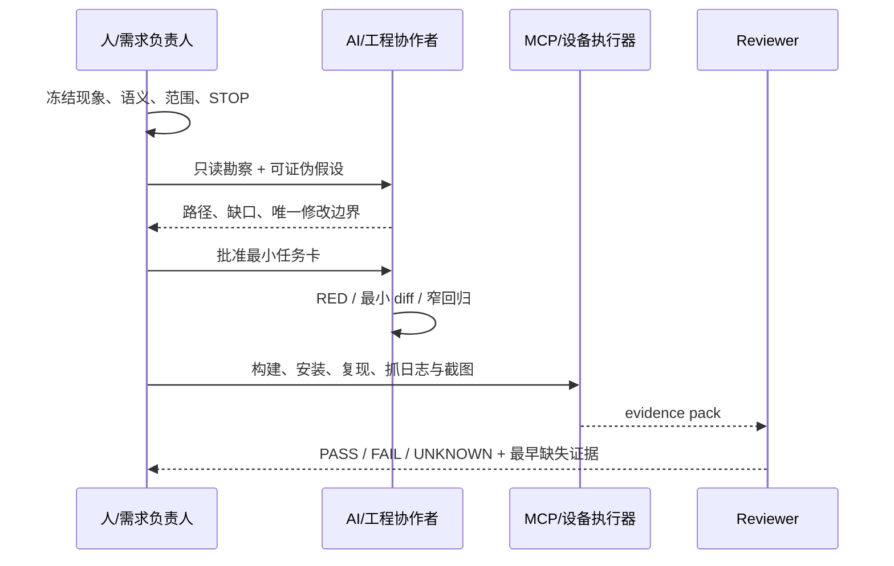


<sub>讲师读图：只有子任务真实独立时才并行；共享同一状态、事务或输出 owner 的任务必须串行或由一个协调者统一提交。多 Agent 是复杂任务的可选组织方式，不是“进阶”的必要条件。图源：Anthropic《Building Effective Agents》。</sub>

真实协同的关键不是谁打字，而是谁拥有哪类决定：

- 人决定问题语义。例如“来的本来就是区域的，不要跟全屏绑定，要自己合成哈”直接否定了 full-frame 假设。
- AI 负责快速搜索、列假设、生成最小修改与测试，但不能替人扩张范围。若人只要求清缓存，AI 不得顺手删除整条 EGLImage 路径。
- MCP 负责重复、可记录的设备动作，不负责把截图解释成系统真相。
- Reviewer 只依赖 spec、task、diff、test 与 evidence；不接受“实现者说已经好了”。

## D5. 现场可直接使用的 Prompt

### 只读定位

```text
只处理 AVC420/AVC444 GPU 送显，不修改文件。根据当前代码与一段录屏，区分：
1) 直接观察；2) 未证实假设；3) 实际 codec/owner 路径；4) 最早缺失证据。
所有结论给出代码符号或日志字段。找不到就写 NOT FOUND。
```

### 最小开发

```text
只允许补 frame trace，不允许修改 renderer、decoder、queue policy、fallback。
字段固定为 runId/sessionId/frameId/seq/tsUs/path/event/pts/queueDepth/
queueAgeMs/durationUs/owner/targetEpoch/result/reason。
先给 RED 与开销预算，再做最小 diff。无法串起完整帧时停止并标 UNKNOWN。
```

### 验收审查

```text
按同一个 runId/frameId 审查 command→decode→retained→EndFrame→present。
对 owner、readiness、dirty-rect 保留、target identity 分别给 PASS/FAIL/UNKNOWN。
视频和截图只能作辅证；缺字段不得推断为 PASS。
```

## D6. 最终证据包目录

```text
evidence/gpu-<runId>/
├── 00-identity.txt              # device / resolution / codec / commit / package
├── 01-symptom.mp4               # 原始复现，未剪掉失败过程
├── 02-frame-trace.txt           # 同 frameId 排序
├── 03-diagnostics.txt           # queue/decode/compose/present 聚合
├── 04-before.png
├── 05-after.png
├── 06-diff.patch
├── 07-test-output.txt
├── 08-device-build-install.txt
└── acceptance.md                # 每条契约 PASS / FAIL / UNKNOWN
```

## D7. 仍在本地、但未直接打包的可选录屏

| 本地文件 | 时长/内容 | 使用建议 |
|---|---|---|
| `LOCAL_ONLY/屏幕录制 2026-05-21 211221.mp4` | 约 61 秒；连接、打开内容、页面变化、右键交互 | 很适合完整 E2E，但前段含连接信息；先裁剪/脱敏再公开投屏 |
| `LOCAL_ONLY/屏幕录制 2026-06-03 102420.mp4` | 约 67.7 秒；多窗口与图片操作 | 含私网地址、用户名与私人窗口，不建议原样用于公开课 |
| `LOCAL_ONLY/屏幕录制 2026-08-07 144716.mp4` | 约 11.3 秒；新版连接页与 USB 选项 | 属于产品/USB 演示，不放进 GPU 28–38 页 |
| `LOCAL_ONLY/屏幕录制 2026-06-03 102437.mp4` | 0 字节 | 无效素材，禁止列入验证证据 |

## D8. 讲师最终检查

- [ ] 每段视频播放前有问题，播放后有判定，不是背景素材。
- [ ] 故障录屏保留失败过程，没有只展示“修好了”。
- [ ] 截图标明 runId、设备、codec/path 与版本。
- [ ] 当前实现、历史方案、TARGET/GAP 使用不同标签。
- [ ] `confirmed codec` 与实际 `SurfaceCommand.codecId` 不混用。
- [ ] 420 与 444 不共享错误的 Buffer/compositor 假设。
- [ ] 没有把单帧截图、漂亮色块或流畅视频单独当作系统 PASS。
- [ ] 公开投屏前完成 IP、用户名、聊天窗口与密码区域脱敏。

---

## D9. 第 28–38 页逐页讲授导航

### D9.1 三种授课模式

| 模式 | 时长 | 必讲/必做 | 适用场景 |
|---|---:|---|---|
| 核心主线版 | 28 分钟 | 28 背景、29 读库、30 调研、31 方案、32 穿刺、33 拆分、34 开发、36 排障、38 验收 | 保持 120 分钟总课时 |
| 完整开发版 | 40–45 分钟 | 核心版 + 35 运行账 + 37 交付包；打开调研文档、T01–T03 卡和 progress | 技术分享、内部 workshop |
| 分组实操版 | 60–75 分钟 | 完整版 + 学员拆 Task Card + 黑屏/色块/积压故障定位 + evidence pack 互审 | 半天课程、训练营 |

“丰富”不等于每次全部讲完。课件负责给讲师足够选择，现场只沿一条证据主线推进。

### D9.2 逐页节奏表

| 页 | 开场问题 | 第一层揭示 | 第二层揭示 | 学员动作 | 本页带走 |
|---:|---|---|---|---|---|
| 28 | 这个案例为什么要改？ | 卡顿背景：CPU/软件路径，未走 GPU | 缺失的 before/路径/性能证据必须占位 | 填背景卡 | 问题、已知原因和验收目标同时清楚 |
| 29 | 55.9 万行代码怎么读？ | 五问、三入口、一条 command 链 | `codebase-map` 只留输入/输出/owner/fallback/未知 | 追 `SurfaceCommand` | 读有用边界，不读全库 |
| 30 | 其他平台哪些能学？ | 通用 decoder 生命周期 | decoder 不包含 owner/EndFrame/fallback | 对照时序图 | 复用契约，不照抄代码 |
| 31 | HarmonyOS 最终选哪条路？ | RDPGFX 受控接管 + OH_AVCodec/GPU | original GDI 保留，AVC444/队列/长稳延后 | 互审 ADR | 方案先写 Decision/Reject/Deferred/Fallback |
| 32 | 先证明什么最划算？ | SP-01–05 一帧垂直链 | 一帧 PASS 不等于性能/长稳 PASS | 填 Spike verdict | 先关最危险未知 |
| 33 | 穿刺后怎么拆开发？ | T00–T07 按风险闭环拆 | 每张卡先写 Forbidden/Verify/Stop | 拆 T01–T03 | 任务小到可独立验收 |
| 34 | AI 实际开发什么？ | T01 hook/decoder → T02 output → T03 owner/EndFrame | 前一门未过不进后一任务 | 沿三张卡追源码 | 开发顺序由证据门决定 |
| 35 | 为什么要一轮一轮做？ | R1–R5 每轮只关一个未知 | progress 为下一 Session 提供入口 | 填一轮 ledger | 循环产出证据与下一步，不是多聊几轮 |
| 36 | 黑屏/色块/仍卡顿怎么办？ | 三个现象各有第一条证据链 | 只修 first abnormal，修后重放 fallback | 选一条最小观测 | 问题处理不靠猜测清单 |
| 37 | 一帧通了就能交付吗？ | T04 队列、T05 生命周期、T06 AVC444、T07 验收 | 交付包包含文档/代码/路径/性能/故障/长稳 | 选下一张必做卡 | 穿刺 PASS 不等于工程交付 |
| 38 | 视频流畅是否全部 PASS？ | before/after、path、frame trace、CPU/FPS、fault、soak 分层 | 缺失项必须留 `PENDING/UNKNOWN` | 填验收矩阵 | 结束于可复核证据，不结束于观感 |

### D9.3 一条连续案例怎么贯穿 11 页

不要把 28–38 页讲成 11 个互不相关的技术点。建议始终追踪同一个案例：

```text
原路径走 CPU/软件处理，远端视频卡顿（28）
→ 用五问、三入口和一条 command 链读 55.9 万行大库（29）
→ 对照 FFmpeg/OpenH264/MF/MediaCodec/OH_AVCodec 提炼契约（30）
→ 确认 RDPGFX 受控接管 + GPU + original GDI fallback 方案（31）
→ 用 SP-01–05 只穿刺一帧主链（32）
→ 按风险闭环拆成 T00–T07（33）
→ 实际开发 T01 hook/decoder → T02 output → T03 owner/EndFrame（34）
→ 用 R1–R5 progress ledger 每轮关一个未知（35）
→ 遇到黑屏/色块/仍卡顿时只修 first abnormal（36）
→ 补齐队列、生命周期、AVC444 和交付证据包（37）
→ 用 before/after + path + performance + fault + soak 最终验收（38）
```

每翻一页，都在白板保留六个字段：`现象 / 当前路径 / 最早异常 / 唯一修改 / 反证 / verdict`。学员会看到结论如何随着证据改变，而不是只记住最终答案。

### D9.4 推荐讲师口播主线

### 开场

> “今天我不演示 AI 一次把 bug 猜对。我演示的是：当 AI 第一轮猜错时，我们怎样用本地代码、设备日志、截图和视频，把它拉回真实边界。”

### 需求拆解

> “已知原问题是 CPU/软件路径下的视频卡顿。但工程任务不能叫‘改成 GPU’；它要被拆成产物注入、硬件 decoder、一帧输出、显示 owner、EndFrame、队列、生命周期、AVC444 和验收证据。”

### 开发

> “实际开发按 T01、T02、T03 三道门走：先证明 bridge 和硬件 decoder 真的进入产物，再证明有合法 native output，最后才让唯一 owner 在 matched EndFrame 显示。每一道门没过，AI 都必须停。”

### 发现问题后的处理

> “遇到黑屏不先猜 shader，遇到色块不先改色彩矩阵，遇到越播越卡不先加线程。保存当前 run，沿同一 frame 找第一处 expected 不等于 actual，只修那个 owner 所在边界。”

### 验证

> “可见播放是必要的用户证据，但不是全部交付。before/after 视频、decoder/path、同帧 trace、CPU/FPS/queue、fallback 故障注入和 resize/后台/重连 soak 必须同时对上；缺一项就把那一项留成 PENDING/UNKNOWN。”

### D9.5 图片与视频的现场使用方式

### 黑屏录屏

- 第一次：不暂停，只让学员描述。
- 第二次：在进入黑色窗口时暂停，标注“UI alive / remote content unknown”。
- 第三次：配合 frame trace，指出视频时间与日志时间如何通过 runId/time range 对齐。

### 色块图片

- 先并排显示，不给标题，让学员找差异。
- 揭示两张视觉近似，但一张来自 NativeBuffer 阶段，一张来自 RGBA renderer。
- 追问：如果画面相同，为什么仍要保留 EGL import 和 rect 外 hash 两种证据？

### 现有可见播放录屏

- 不问“是不是好了”，改问“这 16 秒覆盖了哪几条 AC，没覆盖哪几条？”
- 让学员在验收矩阵中只勾可见交互相关项。
- owner、EndFrame、targetEpoch 仍由日志决定。

### E2E 三帧联系表

- 30s：内容打开，证明会话与远端内容可达。
- 45s：页面变化，证明不是一张静态缓存图。
- 58s：画面中出现右键菜单变化，证明该媒体记录了交互结果；完整输入映射仍需同 run 事件日志。
- 三帧仍不能证明无偶发卡顿，需要完整视频和分段指标。

### D9.6 学员证据卡

每组打印或复制一张：

```markdown
# GPU Diagnosis Card

## 1. Symptom
- 场景/动作：
- 设备/分辨率：
- 录屏时间：

## 2. Actual Path
- negotiated codec：
- command codecId：
- decoder/consumer：
- RenderOutputOwner：

## 3. First Abnormal Boundary
- last known-good event：
- first missing/abnormal event：
- direct evidence：

## 4. One Hypothesis
- hypothesis：
- falsifier：
- only allowed probe/change：

## 5. Verification
- visible video/screenshot：
- same-frame trace：
- retained/readiness：
- owner/target：
- verdict：PASS | FAIL | UNKNOWN
```

### D9.7 讲师故意设置的四个“坑”

1. **先给 `confirmed=avc444`**：看学员是否忘记检查实际 command codecId。
2. **给两张看起来一样的色块图**：看学员是否用视觉替代 Buffer 路径证据。
3. **给低 CPU/低 decode 数据**：看学员是否过早宣布 GPU 正常。
4. **播放流畅验证视频**：看学员是否把 targetEpoch、queue ordering 等未知项也勾成 PASS。

坑的目的不是难住学员，而是让“证据等级”在课堂中真实发生一次。

### D9.8 设备不可用时的诚实降级

| 现场阻塞 | 仍可完成 | 必须保持 UNKNOWN |
|---|---|---|
| 无法连接远端 Windows | 回放原始录屏、分析代码与历史日志 | 本次设备可复现性 |
| HAP 构建失败 | 继续做路径勘察、任务卡与 trace schema | 本次包行为 |
| 无 AVC444 样本 | 用 8×4 plane 练习与历史 evidence | 真机 LC present |
| 日志缺 frameId | 证明缺口并设计最小观测任务 | 同帧因果链 |
| targetEpoch 未实现 | 做 resize 故障时间线与设计审查 | stale callback 已被阻止 |

### D9.9 GPU 段评分建议

| 维度 | 分值 | 满分表现 |
|---|---:|---|
| 需求拆解 | 15 | 把“卡”拆到场景、路径、边界与 AC |
| 路径事实 | 15 | 区分协商、command codecId、consumer、owner |
| 同帧证据 | 20 | 找到 last-good 与 first-abnormal，不只贴大段日志 |
| 最小开发 | 15 | diff 只落在允许边界，RED 与反证明确 |
| Buffer/retained | 10 | 420/444 不混用假设，小样本验证正确 |
| 生命周期/顺序 | 10 | 能识别 targetEpoch 与 queue ordering GAP |
| 验收诚实度 | 15 | 视频、日志、状态分别判定，缺证据保留 UNKNOWN |

不按代码行数、AI 回复长度、截图数量或“现场一次成功”评分。

---

# 附录 E｜真实 Session 证据与授课成效审计

本附录保存可进入课堂的真实问题片段。它不是聊天记录归档：只保留能够改变工程判断的原始提示词、初始假设、反证、修正和迁移规则。投屏时隐藏个人路径、设备标识、账号、地址和无关上下文。

## E1. USB 默认策略：从“设备可用”到“资产已被管理”

| 阶段 | 证据 |
|---|---|
| 原始问题 | 默认 allow 时设备可以使用，但黑白名单没有资产卡片 |
| 错误假设 | allow 不需要系统下发，所以也不需要保存策略状态 |
| 反证 | 产品要求白名单可见、可导出、后续可动态切换 deny |
| 最小观测 | fingerprint、existing、default、dispatchResult、shouldSave |
| 边界发现 | “系统没有禁止”是执行事实，“管理员已管理该资产”是业务事实 |
| 修正 | 首次 allow 不 dispatch，但保存 `desired=allow/active=none/present=true` |
| 独立 oracle | 新设备仍可用，同时 State Repo 与 Policy VM 出现白名单记录 |
| 提交证据 | `23c4a046 fix(peripheral): restore usb policy records` |
| 新缺口 | 系统按 baseClass 下发，仍需同类型双设备实物验证 |

课堂用途：P6、P17、P21、P25；迁移问题：还有哪些“功能能用但资产/意图没有进入管理真源”的案例？

## E2. MDM：工具/UI 返回成功不等于 USB 真实生效

| 阶段 | 证据 |
|---|---|
| 原始问题 | USB 选择器往返成功，能否宣布全局总控已经生效 |
| 自动化事实 | `PER-IF-002` 的 UI 操作步骤 PASS |
| 关键分层 | UI 受控状态、应用状态、MDM 回读、实物行为 |
| 代码事实 | 全局状态使用 restrictions 回读，设备规则使用 usbManager 类型策略 |
| 暴露问题 | 当前 E2E artifacts 为空，完整系统回读与实物矩阵尚未入证据包 |
| 结论 | UI PASS、MDM PASS、Physical PASS 必须分别记录 |

课堂用途：P23–P27；证据边界见 `case-materials/mdm/00-外设管理证据状态总表.md`。学员任务：对 `PER-IF-002 PASS` 给出四层判定，并指出最小缺失证据。

## E3. 开关机事件：真实生命周期推翻静态分析

| 阶段 | 证据 |
|---|---|
| 现象 | 开关机事件缺失 |
| 动作 | 增加诊断日志、重新构建安装、等待用户真实重启 |
| 纠偏 | “你分析得不对”，要求重新以真机生命周期为准 |
| 结果 | 复现后行为恢复，原假设不足以解释结果 |
| 收尾 | 删除只用于诊断且已无长期价值的噪声日志 |

迁移规则：需要重启、登录、权限激活或远端连接的事实不能靠静态代码独立证明；诊断代码完成使命后也要接受最小化审查。

## E4. 权限策略：乐观 UI 与系统状态撕裂

| 阶段 | 证据 |
|---|---|
| 现象 | 第一次进入数据为空、按钮状态与实际策略不一致 |
| 错误方向 | 先在组件内部更新选择状态，再等待系统写入结果 |
| 用户约束 | 失败回滚原本就是设计目的，状态只应在成功后改变 |
| 修正 | ViewModel 保持系统事实，UI pending 与 committed state 分离 |
| 验收 | 成功、失败、刷新、重新进入、多账号分别验证 |

课堂用途：P19、P22、P39。迁移规则：乐观更新只能改变“pending intent”，不能提前伪造“system committed”。

## E5. GPU：截图正确也可能是持续显示错误

| 阶段 | 证据 |
|---|---|
| 现象 | AVC444 黑屏、颜色错误、闪烁；截图偶尔能抓到正确帧 |
| 危险结论 | 单张截图正确，因此 renderer 已修复 |
| 用户约束 | “不要怀疑，要看日志，没有就加” |
| 最小观测 | negotiated codec、command codecId、frameId、dirty rect、decoder、owner、present |
| 边界发现 | 截图只证明采样瞬间；帧配对、stride、LC readiness 或 owner 仍可能错误 |

课堂用途：P28–P38。迁移规则：可见证据必须与同一 runId/frameId 的运行时事实对齐。

## E6. AVC420：删除 cache 变成删除整条路径

| 阶段 | 证据 |
|---|---|
| 用户授权 | 移除一个尚未提交的 NativeBuffer/EGLImage cache 尝试 |
| 实际修改 | 扩大为删除整条相关实现路径 |
| 用户纠偏 | “我只让你把 cache 清除掉，你给我全删除了，反思一下，不要改代码了” |
| Trace 判定 | 即使能编译，仍因超出授权范围而 FAIL |
| 正确动作 | 立即停手，识别精确对象，只回滚越界部分，不继续用新改动掩盖错误 |

课堂用途：P14、P27、P36。迁移规则：Allowed/Forbidden 不只写文件，还要写具体对象、行为和删除边界。

## E7. Session Evidence Card 模板

```markdown
# Session Evidence Card — <问题名称>

- 能力：需求 | 上下文 | Workflow/Agent | 工具 | Eval | Harness
- 原始提示词：
- 用户授权边界：
- AI 初始假设：
- 初始动作：
- 直接反证：
- 最早异常边界：
- 被推翻的方案：
- 最小修正：
- Trace verdict：PASS | FAIL | UNKNOWN
- Outcome verdict：PASS | FAIL | UNKNOWN
- 仍缺证据：
- 可迁移规则：
- 适用页码：
```

选材规则：优先保留“改变了下一步”的短片段，不复制整段聊天；同一结论至少绑定一份代码、日志、测试、截图或系统回读证据。只有提示词、没有环境事实的片段只能作为问题素材，不能作为技术结论。

---

## E8. 四线闭环与授课成效审计

### E8.1 方法论、需求、演示、问题必须在同一页链路相遇

| 教学线 | 学员必须学会 | 主案例落点 | 不能退化成 |
|---|---|---|---|
| 方法论 | 选择规格、上下文、Agent、工具、Eval 与 Harness 控制方式 | P3、P13–P17、P25–P27 | 背六个名词或读 Anthropic 文章 |
| 具体需求 | 把多用户、事务、进程、帧链等真实复杂性写成可测试行为 | P4–P12、P19–P24、P29–P38 | 只看最终代码答案 |
| 演示/截图 | 判断证据等级，复现动作并保存可追踪产物 | P1、P15、P18、P25、P28、P30、P34、P38 | 看一张图后宣布“已经好了” |
| 处理问题 | 让假设被反证，控制修改范围，保留 UNKNOWN 和剩余风险 | P16、P18、P21–P22、P24、P31、P35–P36 | 罗列可能原因或连续打补丁 |

四条线缺一条，该段都不能算完成：只有方法没有问题会空；只有需求没有方法难迁移；只有演示没有系统事实会误判；只有正确答案没有错误过程，学员遇到新问题仍不会处理。

### E8.2 120 分钟内学员必须产生的九个动作

| 页码 | 学员动作 | 当场产出 | 讲师判定 |
|---|---|---|---|
| P1 | 说出真机截图能证明和不能证明什么 | evidence scope | 不把 UI 当 system truth |
| P5–P6 | 找实现分叉并冻结一个产品语义 | Open Decision | 答案会改变代码/测试 |
| P13 | 完成只读勘察 | 入口、事实源、GAP | 所有符号可定位 |
| P15 | 解释目标 RED | failure statement | 失败来自目标行为而非环境 |
| P17 | 做上下文 A/B 交接 | Next / Forbidden / Missing evidence | 不靠完整聊天继续 |
| P18/P24 | 选择最小日志并重排跨进程链 | earliest anomaly | 能推翻当前假设 |
| P26–P27 | 设计证据契约并互审 | Trace/Outcome verdict | 只输出 PASS/FAIL/UNKNOWN |
| P30/P34 | 还原 frameId 与 plane/rect 不变量 | GPU diagnosis card | 420/444 不混用假设 |
| P39 | 将七问迁移到权限首次加载问题 | 新 Task Card | 不回答“加延迟” |

如果现场时间不足，优先保留 P6、P13、P18/P24、P26/P27、P30 和 P39；可以缩短讲师技术展开，但不要删除学员决策动作。

### E8.3 每次演示统一使用七步脚本

```text
1. Show     展示原始需求、现象、截图或失败输出
2. Ask      只问“直接看到了什么”，禁止猜根因
3. Guess    揭示 AI 第一版判断或修改
4. Falsify  给出会推翻它的日志、进程事实、getter 或帧证据
5. Decide   学员选择下一条最小观测或修改边界
6. Verify   运行 RED/GREEN、回归、构建和系统回读
7. Transfer 换一个模块，复用同一控制方法
```

讲师不要直接从 Show 跳到 Verify。课程精髓位于 Guess → Falsify → Decide：学员必须亲自经历“第一反应不够、证据改变下一步”。

### E8.4 四类常见授课失败

1. **方法论过满**：连续解释多个框架名词，却没有原始需求和失败证据。处理：方法图放备注，主画面先放项目事实。
2. **现场演示过冒险**：临时切历史提交、构建或连接远端，时间耗在环境。处理：训练分支预构建；实时操作失败时切换到带命令、退出码、commit 的回放证据。
3. **问题处理像公布答案**：讲师直接说跨进程、stride 或 owner。处理：分轮揭示证据，让学员先选择下一条探针。
4. **截图替代验收**：画面正常就把未知项全部勾 PASS。处理：每张图固定写“能证明/不能证明”，最终由系统 getter 或同帧 trace 收口。
