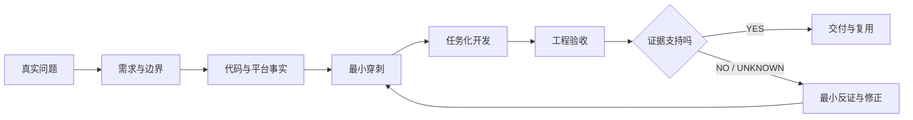
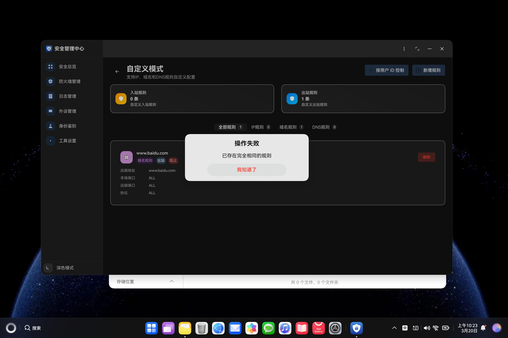
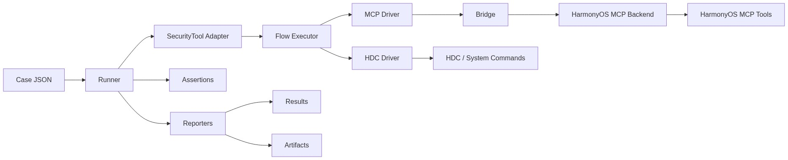
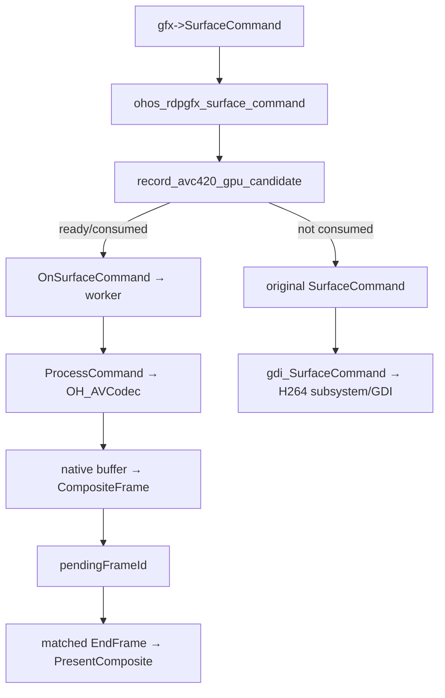
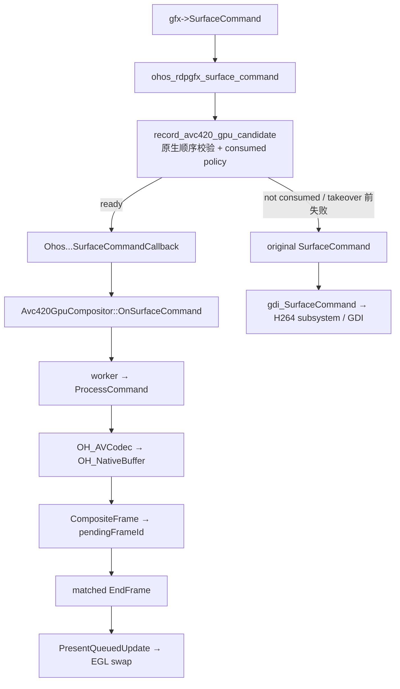
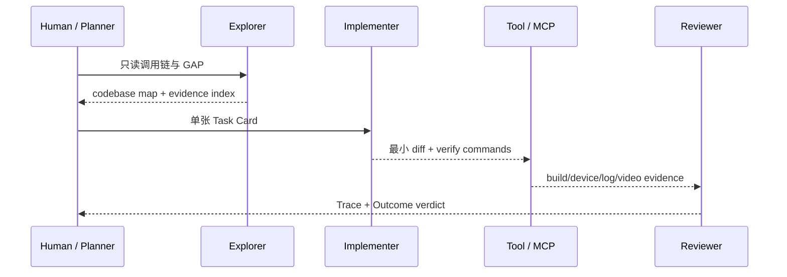
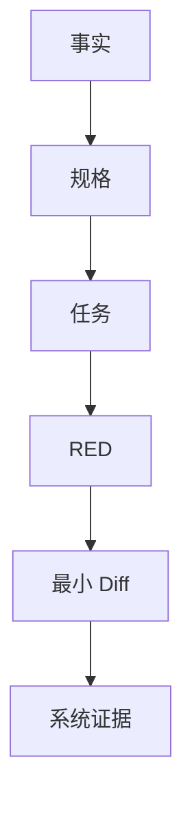
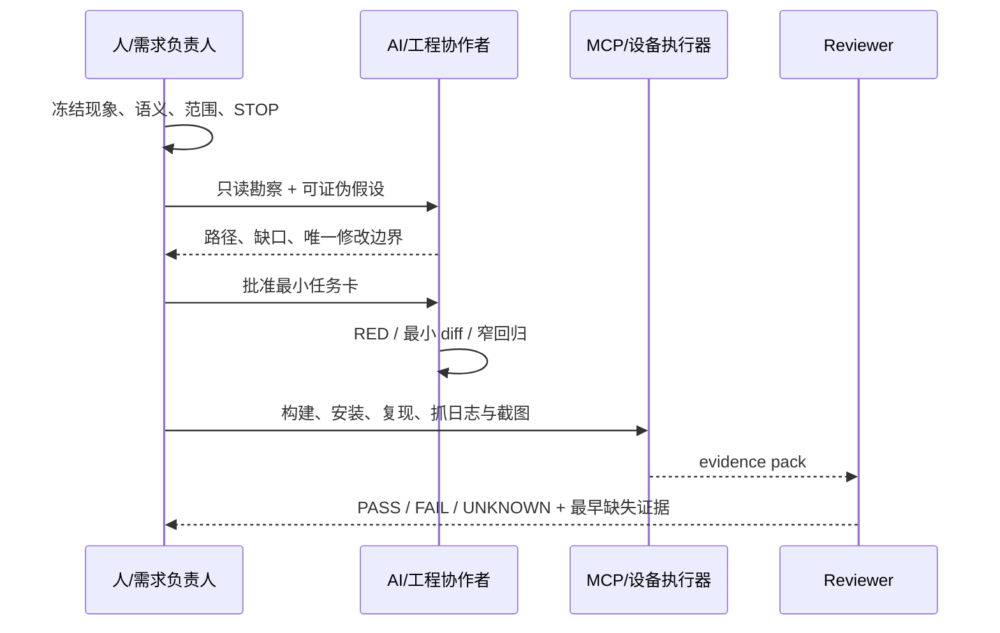

# 使用 AI 进阶能力实现较为复杂的需求

> 以真实 HarmonyOS MDM 与 FreeRDP GPU 送显问题为载体，跑通需求拆解、上下文组织、Agent 协作、开发、验证、问题定位与证据交付

> **Rich V5 / 双案例工程闭环版**：保留 39 页与 120 分钟结构，不压缩 V4 的事实、媒体与 Session 证据；重新把“AI 如何完成复杂需求”放回主角位置。案例一用 MDM 跑通需求到验收，案例二基于 55 万行级 FreeRDP 源码，从用户报告的远控视频卡顿问题出发，演示代码认知、跨平台调研、HarmonyOS 对接、最小穿刺、任务拆解、开发排障与证据验收。CPU 路径、性能改善和长稳在没有同 run 证据前保持空白或 `UNKNOWN`。

## 课程定位

这不是“AI 提示词技巧课”，也不是项目复盘。课程面向已经具备 HarmonyOS / ArkTS / C++ 基础的新员工，通过两个真实代码库，带着学员完成一次可追踪、可调试、可验收的复杂需求开发。

这里的“进阶”不是提示词更长、模型更贵或 Agent 更多，而是工程师能够驾驭复杂需求里的六类不确定性：需求会分叉、上下文会膨胀、执行链会跨工具、实现会跨会话、结果容易被误判、修改范围可能悄悄扩大。

| AI 进阶能力 | 真实问题先行 | 本课实践动作 | 可检查产物 |
|---|---|---|---|
| 需求澄清与边界冻结 | “全部账号”“自动同步”“回滚”被 AI 自行解释 | 歧义树、EARS、行为矩阵、不变量 | `spec.md` |
| 上下文工程 | 长 Session 反复搜索，换会话后重新猜问题 | 只读勘察、证据索引、按需检索、新会话交接 | `progress.md` + evidence index |
| Workflow / Agent 分工 | 构建安装等固定步骤与开放排障混在一起 | 固定动作走 Workflow，假设选择与最小修改交给 Agent | Task Card + execution trace |
| 工具契约与环境事实 | MCP 返回成功，但设备业务状态没有成功 | 分开 protocol、tool、business、system 四层结果 | tool result + getter/log |
| Eval 与反证 | UI 绿、测试绿或截图正常，但系统事实仍错误 | RED/GREEN、故障注入、状态回读、Trace/Outcome 双审 | `PASS / FAIL / UNKNOWN` |
| 长任务 Harness 与协同 | AI 越界修改、实现者自评完成、交接丢失事实 | 小任务、Git checkpoint、证据包、风险驱动 Reviewer | review verdict + next task |

公开的 AI Agent 工程研究与实践在这里充当“方法论参照系”，不是任何厂商的产品教程。本课用真实 Session 解释方法为什么必要，再把抽象原则落到 HarmonyOS 的规格、代码、设备日志、截图、视频和系统 getter 上检验。公开的 AI 熟练度课程模型只轻量参考其“先澄清与迭代、每步都做辨别”的教学节奏，不作为本课主方法论。完整来源、候选文章、工程映射与取舍见附录 I。

每个关键页面都沿用同一课堂结构：

```text
问题现场 → AI 初判 → 反证 → 最小修正 → 验收 → 可迁移规则
```

页面右上角建议固定四个小标签：`能力 / 案例 / 问题 / 产出`。讲师如果只讲了正确做法，却没有让学员看到错误方案为何失败，该页视为未完成。

Agent 组织方式按风险升级，不把“Agent 更多”误当成“能力更进阶”：

| 任务特征 | 默认组织方式 |
|---|---|
| 单文件、强测试、低风险 | 单 Agent + 确定性检查 |
| 构建、安装、日志采集 | 固定 Workflow |
| 多文件、路径未知、需要探索 | Agent 只读勘察 + Task Card |
| 跨进程、事务、权限、GPU 状态 | Planner / Implementer 分离 |
| 高风险或接近模型可靠边界 | 增加独立 Reviewer / Evaluator |

课程主线不是一次瀑布交付，而是两个案例重复同一个受控循环：



- **MDM 主实践**：Feature-first。先冻结多用户、状态、事务和失败语义，再让 AI 实现。
- **远控第二案例**：Context-first + Evidence-first。先控制 55 万行级代码库的上下文，再研究现有平台契约并映射 HarmonyOS；先让一帧走通硬解，再扩展到生命周期、队列、AVC420/AVC444 和最终验收。
- **MCP 的位置**：不是第三套方法，只负责受控循环中的 Verify——构建、安装、操作、日志、截图和验收取证。

判断 AI 是否正确不靠“它解释得很像”，固定做三层检查：

| 判断层 | 问题 | 合格证据 |
|---|---|---|
| 方案正确 | 是否沿用了协议和成熟平台已经存在的契约，而非重写一套想象中的架构 | 原生调用链、平台 API、Architecture Decision |
| 实现正确 | 代码是否只改变允许边界，并让同一输入在目标路径产生预期状态转换 | diff、单测、构建、路径日志、故障注入 |
| 结果正确 | 用户问题是否在真实设备和同一场景下改善，同时没有破坏回退、交互与稳定性 | before/after、CPU/FPS、真机视频、长稳、回归矩阵 |

任何一层缺证据都不能宣布完成：先标记 `UNKNOWN`，再补一条能推翻当前判断的最小观测；如果证据已经否定方案，就停止扩大修改，回到最近一个可信 checkpoint。

## 学员最终交付

```text
workshop/
├── mdm/
│   ├── spec.md
│   ├── design.md
│   ├── tasks/T01.md
│   ├── progress.md
│   ├── patch.diff
│   ├── acceptance.md
│   └── evidence/
│       ├── unit-test-red.txt
│       ├── unit-test-green.txt
│       ├── build.txt
│       ├── device-log.txt
│       ├── runtime-state.json
│       └── screenshot.png
└── gpu-diagnosis.md
```

最低通过标准：同一条行为必须能够从需求 ID 追踪到设计、不变量、任务、失败测试、最小代码差异和设备证据；设备或系统 getter 不可用时标记 `UNKNOWN`，不能用 UI 文案代替系统事实，也不能把 mock 结果写成 PASS。

## 120 分钟课程结构

| 时间 | 模块 | 学员动作 | 当场产出 |
|---|---|---|---|
| 00–18 | 背景与问题 | 区分对话式协作、仓库内 Agent 与异步任务代理，读懂 Agent Loop，判断“AI 完成”与“工程交付” | 一张复杂需求风险清单 |
| 18–42 | 需求闭合 | 资产同步、歧义选择、EARS、行为矩阵 | `spec.md` |
| 42–72 | 设计与受控迭代 | RFC、Story、真相源、任务卡、RED→GREEN、故障注入 | `design.md`、patch、`progress.md` |
| 72–88 | 平台与验收 | 权限预检、跨进程、MCP 设备证据 | `acceptance.md`、evidence |
| 88–116 | 远控第二案例 | 大库认知、跨平台调研、HM 方案、最小穿刺、任务与验收、开发排障 | codebase map、ADR、spike evidence、`gpu-diagnosis.md` |
| 116–120 | 收束 | 同伴审阅与七问迁移 | 最终交付包 |

每个模块结束固定做一次辨别力检查：**当前结论最可能错在哪里？我们看到的是表面输出、执行轨迹，还是最终系统事实？还缺哪一条证据？**

## 事实标签

材料对代码事实和课堂目标严格分层：

- `CURRENT`：仓库当前代码已经具备，可现场打开验证。
- `SESSION FACT`：真实 Session 中出现过的提示词、判断、日志或用户反馈。
- `GAP`：仓库当前仍存在的风险或未闭合问题。
- `TARGET`：本轮课堂希望设计或实现的能力。
- `TEACHING`：为了教学建立的 FR / D / T 编号，不是仓库既有资产。
- `TEACHING COMPOSITE`：将多个真实问题组合成一条可连续授课的案例，不表示它们在同一次历史执行中同时发生。

## 视觉与 PPT 制作约定

- 画面：16:9，浅灰白技术讲解页 + 深色代码 / 日志舞台。
- 色彩：深海军蓝=结构；蓝=规格；紫=AI / 受控循环；橙红=失败；绿=证据 / PASS。
- 字体：HarmonyOS Sans SC / 思源黑体；代码 JetBrains Mono。
- 页型只使用六种：`CLAIM`、`MAP`、`CODE`、`DEBUG`、`LAB`、`CHECKPOINT`。
- 每页只有一个视觉中心；画面正文建议 250–400 汉字；代码不超过 12 行；大表、提交历史和完整答案进入讲师备注。
- 页脚固定进度带：`需求 ─ 设计 ─ 任务 ─ 代码 ─ 调试 ─ 证据`，只高亮当前阶段。

## 仓库范围

- MDM：`repos/security_tool`
- 远控：`repos/harmony-windows-bridge`
- FreeRDP：`repos/harmony-windows-bridge/harmony/third_party/FreeRDP`
- 测试与验收辅助：`repos/harmonyos-dev-mcp`

---

# 39 页 PPT-ready 讲师稿

## 第 1 页｜AI 已经会写代码，为什么复杂需求仍然经常交付失败？

### PPT 内容

# 使用 AI 进阶能力实现较为复杂的需求

**从“让 AI 写代码”，升级到“让 AI 交付可验证的系统结果”**

开场只放一个问题：

> AI 修改完成、测试通过、页面也能打开——这能证明需求已经交付吗？

开场案例只展示四个事实，不先公布答案：

```text
需求：把一条防火墙规则同步到全部账号
AI：已完成
测试：816 / 816
页面：规则可见
系统策略：？
```

页脚小字：

```text
本课不比较模型排行榜，也不教授万能 Prompt。
我们只解决：复杂需求如何被拆解、执行、纠偏和验收。
```

### 主视觉

- 标题页保持克制，不画方法论大转盘。
- 可在右下角小幅使用真实 SecurityTool 页面，作为后续案例预告，不在本页解释调用链。
- 禁止使用“紫色 AI 中心 + 十几个节点”的自绘总览图。

### 讲师备注

不要从 SDD、Ralph、MCP 等术语开始。先让学员举手判断开场问题，大多数人会说“还要看情况”。追问：“具体还要看什么？”把回答暂时写在白板上：需求、代码、测试、设备、日志、回滚、用户体验。

本页只建立课程矛盾：模型能力提高以后，瓶颈正在从“能不能生成代码”转向“人如何定义目标、组织环境、监督过程和证明结果”。后面 7 页逐步回答这些问题。

### 现场互动

投票：以下哪一个最接近“完成”？

1. AI 回复完成。
2. 代码可以编译。
3. 单元测试通过。
4. 需求对应的系统事实可回读，失败路径可解释。

暂不公布标准答案，等第 6 页重新投票。

### 素材与来源

- 本地预告图：`harmonyos-sdd-workshop-media/mdm/firewall-domain-rule-created.jpeg`

---

## 第 2 页｜AI 工作方式正在从“即时问答”走向“任务委托”

### PPT 内容

不按产品名称分类，而是看 AI 在哪里行动、上下文由谁维护、结果如何交付：

| 工作方式 | 人主要提供 | AI 主要执行 | 典型产物 |
|---|---|---|---|
| 对话式协作 | 问题、材料、连续追问 | 理解、解释与生成 | 回答、草稿、建议 |
| 仓库内 Agent | 目标、代码库、工具权限 | 搜索、修改、运行命令和测试 | Diff、测试结果、PR |
| 异步任务代理 | 结果目标、文件和工具边界 | 跨文件、跨应用、多步骤执行 | 可审阅的文档、表格或任务结果 |

页内结论：

> 这三种方式不是互相替代，而是把“谁负责上下文、动作和结果”逐步交给系统。

### 主视觉

使用上面的三行对比作为主视觉，不放厂商 Logo、产品截图或产品矩阵。三行分别突出“人持续对话”“AI 在仓库行动”“人委托后审阅结果”。

### 讲师备注

对话式协作的核心仍是“人持续组织上下文，AI 返回内容”；仓库内 Agent 把代码库、终端、Diff 和测试放进执行环境；异步任务代理进一步把“给出目标、稍后审阅结果”变成主要交互方式。

这里不要争论哪个产品更强。让学员识别任务形状：问一个概念、改一个仓库、完成一个跨工具项目，分别适合什么方式。复杂需求可能跨越三种形态：先通过对话澄清，再让仓库内 Agent 实现，最后通过确定性工具和工作流取证。

可选口播案例：同一个错误码问题，对话式协作负责解释和追问；仓库内 Agent 负责定位、修改与测试；异步任务代理负责汇总多份材料并生成 PRD、RFC 和验收清单。正文不展开这三条支线。

[Sources]
- Anthropic, *Claude product matrix: when to use what*, 2026: https://www-cdn.anthropic.com/files/4zrzovbb/website/34783bca828d7fa331f515ced26f1c9232151b2c.pdf
- Anthropic, *Claude Cowork*: https://claude.com/product/cowork
- Anthropic, *Use Claude Code in VS Code*: https://code.claude.com/docs/en/vs-code
[/Sources]

### 现场互动

给出三个任务，让学员选择对话式协作、仓库内 Agent 或异步任务代理，并说明依据：

- 解释一个 HarmonyOS 权限错误。
- 修改已有模块并运行回归。
- 收集多份材料，生成 PRD、Story 和验收报告。

### 怎么判断讲清楚了

学员能够用“上下文由谁组织、动作在哪里发生、产物如何验收”区分三种方式，而不是只按产品名称分类。

---

## 第 3 页｜趋势不是 Prompt 越来越长，而是人在监督越来越长的工作

### PPT 内容

把 AI 应用的演进简化成四层：

```text
Prompt Engineering
→ Context Engineering
→ Harness Engineering
→ Controlled Agent Loop
```

页内结论：

> 演进的重点不是 Prompt 越写越长，而是上下文、工具、状态和验证逐步进入一个可控系统。

例：修复“登录后偶发白屏”时，四层分别解决问法、事实、工具和闭环。

### 主视觉


落版要求：原图为 2:3，只作为裁切素材；正文优先保留四个阶段名、每层输入变化和最下方演进结论。来源未补齐前，页脚标注“用户提供的概念示意图，仅用于教学解释”。

### 讲师备注

多家厂商正在把 Agent 能力放进终端、IDE、桌面工作区和后台任务：一类强调人与 AI 实时协作，另一类强调把多步骤目标交出去后再回来审阅。公开产品演进已经显示，两者正在逐步汇合，并进一步出现并行任务、专门 Agent 和长任务监督界面。

图中的四阶段是本课用于组织认知的教学视角，不宣称它是统一行业标准。尤其要纠正两个误区：Context Engineering 不是“给更多内容”，而是选择更少、更相关的高信号事实；Loop Engineering 也不是无限自治，而是把外部事实、验证、停止和升级条件放进循环。

可选口播展开：Prompt 只是“分析并修复白屏”；Context 增加复现步骤、日志、调用链和不可修改边界；Harness 固定搜索、构建、安装、截图和日志采集方式；Loop 才负责假设、最小修改、真机验证和停止。

这里的“趋势”是从多家官方产品形态做出的归纳，不等于宣称所有团队都应直接采用最高自治级别。任务越开放、动作权限越大，越需要可见过程、沙箱、检查点和人工决策。

[Sources]
- Anthropic, *Enabling Claude Code to work more autonomously*, 2025: https://www.anthropic.com/news/enabling-claude-code-to-work-more-autonomously
- Anthropic, *Claude Cowork*: https://claude.com/product/cowork
- OpenAI, *Introducing Codex*: https://openai.com/index/introducing-codex/
- OpenAI, *Introducing the Codex app*, 2026: https://openai.com/index/introducing-the-codex-app/
[/Sources]

### 现场互动

问学员：“当 AI 可以同时跑三个任务、离开电脑仍继续执行时，工程师减少的是哪类工作，增加的又是哪类工作？”

期望回答：减少重复操作和局部实现；增加目标定义、权限控制、过程监督、冲突处理和结果审阅。

---

## 第 4 页｜从 Prompt 到 Agent Loop，模型开始反复行动并读取环境

### PPT 内容

本页使用公开工程文章中的 Coding Agent Flow，不再放自绘 Mermaid。


图旁只保留五个词：

```text
Prompt
→ Model decides
→ Tool acts
→ Environment returns facts
→ Repeat or Stop
```

页内结论：

> Prompt 决定第一次怎么出发；Loop 决定后面如何根据环境继续走。

### 讲师备注

Agent Loop 的关键不是“模型连续思考”，而是模型与工具、环境反复交互。工具输出重新进入上下文，模型根据新事实决定下一步，直到返回结果、触发停止条件或需要人工输入。

OpenAI 对 Codex Agent Loop 的拆解指出：工具调用可能直接修改环境，Agent 的主要产物可能是代码而不是最后一条回复；与此同时，长链路会持续增长上下文并需要管理。Anthropic 则强调 Agent 每一步应从环境获得 ground truth，并在检查点或阻塞时回到人。

必须补一句：**Agent 返回最终消息，只能证明这次 Loop 结束了，不能自动证明业务目标完成。** 这句话直接引出第 5、6 页。

可选口播 Trace：以“重复添加相同规则”为例，只讲搜索、RED、最小修改、GREEN、回读数量五步；只有最终规则数量仍为 1 才允许 Stop。详细实现留到后面的 MDM 案例。

[Sources]
- Anthropic, *Building Effective AI Agents*: https://www.anthropic.com/engineering/building-effective-agents
- OpenAI, *Unrolling the Codex agent loop*, 2026: https://openai.com/index/unrolling-the-codex-agent-loop/
[/Sources]

### 现场互动

让学员在图上指出：编译错误、测试失败、设备日志、用户确认分别从哪里回到 Loop。答不出就说明还把 Agent 理解为聊天机器人。

---

## 第 5 页｜AI 越自主，人的辨别力越不能缺席

### PPT 内容

复杂需求中的 AI 熟练度成长模型：


图上方只补一句读图结论：

> 入口动作让任务启动，耐久上下文让能力复用，辨别力决定结果能否被信任。

### 讲师备注

先按 Claude Academy 原文讲三层，不要把图解释成产品功能清单：

1. **入口动作**：对话式工具先学会追问迭代；执行型与异步型 Agent 先学会在行动前澄清目标。本课把两者合并为“澄清完成状态，再用小步反馈迭代”。
2. **描述耐久度**：一次性的目标、上下文、示例和输出格式，逐步沉淀为任务卡、工具契约、项目规则、`progress`、证据库和自动化。
3. **辨别力螺旋**：描述能力可能随使用自然增长，但辨别力不会自动增长。每次升级都要重新追问：AI 假设了什么、证据够不够、什么会让它错、何时停止。

本地自绘图没有复制 Claude 的产品分区，而是把研究结构翻译成复杂需求工程资产。中心是一次任务的目标与快速反馈；中圈是可复用任务契约；外圈是跨 Session 的项目规则、自动化和证据。橙色虚线表示辨别力不是最后一步，而是贯穿每一层。

可选口播迁移：以“每周自动生成发布说明”为例，一次性层给提交和输出格式，可复用层沉淀任务卡与验收清单，持久层沉淀项目规则和证据目录；辨别问题始终是“每条说明能否追到真实 commit 和 issue”。

[Sources]
- Claude Academy, *Getting good at Claude: A research-backed curriculum*, 2026: https://academy.claude.com/tutorials/getting-good-at-claude-a-research-backed-curriculum
[/Sources]

### 现场互动

让学员选一个正在做的任务，在图上回答三件事：入口动作是什么？哪些信息只在当前 Prompt 中，哪些已经持久化？本轮最可能错在哪里？

### 怎么判断讲清楚了

学员能够把同一任务分别写成一次性 Prompt、可复用 Task Card 和跨 Session 项目规则，并且每一层都给出一个可执行的辨别检查。

---

## 第 6 页｜复杂需求最危险的误判：“AI 已经完成”

### PPT 内容

六类控制问题：

```text
输入不一致｜上下文漂移｜状态不一致｜局部成功｜范围蔓延｜验收错位
```

先给一个 20 秒具体场景：

```text
PRD：同步到全部账号
实现：只更新当前账号
UI：显示“同步成功”
测试：只覆盖当前账号
结论：页面成功，业务结果仍可能失败
```

主视觉继续使用真实 SecurityTool 页面，不使用通用插画。


右侧放分层判断：

```text
Agent message    “已完成”                 ≠ 交付
Unit tests       816 / 816                = 代码协议证据
UI screenshot    规则可见                  = 页面证据
System readback  未采集                    = UNKNOWN
```

底部结论：

> 低层证据不能替代高层事实；缺少最终事实时，正确答案是 UNKNOWN。

### 讲师备注

先把六类问题落到真实后果，而不是停留在抽象名词：

| 问题 | 复杂需求中的真实后果 |
|---|---|
| 输入不一致 | 原图、PRD、代码表达不同，AI 选错事实源 |
| 上下文漂移 | 长 Session 后忘记边界，重新解释已冻结决策 |
| 状态不一致 | UI 成功、缓存成功，但系统状态未改变 |
| 局部成功 | 多用户、多步骤中一半成功、一半失败 |
| 范围蔓延 | 修一个问题时顺手重构无关模块 |
| 验收错位 | 测试了“能点击”，却宣布业务策略已下发 |

然后回到第 1 页投票，要求学员说明每一层到底证明了什么：

- 回复完成：证明 Agent 决定停止。
- 命令返回成功：证明工具调用成功。
- UT 全绿：证明被覆盖的代码契约通过。
- 页面截图：证明该时刻 UI 可见状态。
- 系统 getter/readback：才可能证明设备最终业务状态。

不要把本页讲成否定测试。它讲的是证据作用域：测试非常重要，但必须与需求声明处于同一层。复杂需求不是 Prompt 更长，而是每一步都可能改变下一步的正确答案。Anthropic 区分固定 Workflow 与动态 Agent，并提醒动态 Agent 可能累积错误；OpenAI 的 Codex 系统说明也强调用户应检查终端日志、文件和最终 Diff。

[Sources]
- OpenAI, *Codex system card addendum*: https://openai.com/index/o3-o4-mini-codex-system-card-addendum/
- Anthropic, *Building Effective AI Agents*: https://www.anthropic.com/engineering/building-effective-agents
- Anthropic, *Trustworthy agents in practice*: https://www.anthropic.com/research/trustworthy-agents
[/Sources]

### 现场互动

重新投票第 1 页问题。学员必须给出 `PASS / FAIL / UNKNOWN` 中一个，并说明结论作用域。页面可见而 system readback 缺失时，不能给系统层 PASS。

---

## 第 7 页｜Ralph 的价值，是给 Agent Loop 加外部记忆、验证和停止条件

### PPT 内容

课堂找错：下面这条循环已经有规划、执行、验证、修复、记忆和调度，为什么仍然不能直接交付？


```text
表面完整 ≠ 工程受控
至少还缺：外部事实 / 独立验收 / Stop / Escalate
```

### 讲师备注

Ralph 不是模型、框架或魔法 Prompt。Geoffrey Huntley 的原始定义非常直接：纯粹形式就是把编码 Agent 放进 Bash 循环，每轮从文件和仓库重新获取状态。他同时反复强调“一轮只做一件事”，并明确提醒原始做法不适合直接套到已有代码库。

用户提供的图故意按“表面完整、工程不闭合”来讲：`验证` 如果只是 Agent 自己看输出，不是独立 oracle；`记忆` 如果写入的是错误结论，只会把错误带到下一轮；`调度` 如果没有最大迭代和升级条件，只会让错误更稳定地重复。讲完缺口后，再用 Anthropic Autonomous Agent Loop 中的 Environment Feedback / Stop 作为官方结构对照。

因此本课不是照搬无限循环，而是工程化改造：先有规格和任务，状态写入文件与 Git；每轮有独立 oracle；失败必须留下证据；达到停止条件才退出；超限或证据冲突时升级给人。对于确定性构建、签名、安装等步骤，优先使用 Workflow，不让 Agent 每轮重新发明流程。

展开时再补完整约束：一轮一个 Story，读取 spec/RFC，写回 progress/evidence，执行 RED/GREEN/regression，由独立 Reviewer 判断，并设置最大轮数、Stop、Escalate、权限边界和回滚点。Workflow、Agent Loop、Evaluator–Optimizer 与 Ralph 的区别只在讲师口播，不全部堆到本页。

[Sources]
- Geoffrey Huntley, *Ralph Wiggum as a “software engineer”*, 2025: https://ghuntley.com/ralph/
- Anthropic, *Building Effective AI Agents*: https://www.anthropic.com/engineering/building-effective-agents
[/Sources]

### 现场互动

给四个任务让学员选择 Workflow、单次 Agent、Evaluator–Optimizer 或受控 Ralph：

- 固定执行构建签名安装。
- 搜索一次 API 用法。
- 反复改进一份有评分标准的文档。
- 跨多个 Story 完成复杂 Feature。

### 怎么判断讲清楚了

学员知道“更多循环”不会自动提高正确性；Loop 必须得到外部事实、外部记忆和停止门约束。

---

## 第 8 页｜这门课用两种复杂需求，验证同一套受控交付方法

### PPT 内容

接下来用两个真实案例验证同一套方法：

| 主案例：MDM 应用 | 方法迁移：大型开源工程 |
|---|---|
| 入口是多源需求和业务规则 | 入口是性能现象和运行证据 |
| Feature-first：先冻结需求、状态和失败语义 | Evidence-first：先缩小调用链和根因范围 |

页内结论：

> 两个案例入口不同，但判断 AI 是否正确的方法相同：看它依据什么、改变了什么、如何证明。

### 主视觉

左侧：同一条规则再次添加时出现明确失败，带出“失败语义和幂等性怎么定义”。



右侧：真实远控场景画面，只用于带出“现象可见但根因仍未知”。


两张图中间只放六步共同主线，不补画不存在的性能曲线。

### 讲师备注

明确接下来的主线：第 9 页开始完整走 MDM 六阶段——资产同步、方案推导、RFC、Story、Ralph、测试验收。第二案例只负责证明这套方法能迁移到“没有清晰需求、只有运行现象”的场景。

共同主线只在口播中快速带过：管理输入 → 关闭关键未知 → 固化契约 → 拆任务 → 受控迭代 → 系统事实验收。需要互动时再给两个挑战：需求材料对“全部账号”的解释不同，先冻结语义；视频卡顿但没有同 run 证据，先采证据再决定改哪里。

转场问题：“如果原始 Excel、AI 修正版、PRD 和代码对同一个概念说法不同，你会先相信谁？”第 9、10 页用资产同步回答。

### 现场互动

请学员为两个案例分别选择入口：Feature-first 或 Evidence-first，并说明为什么不能反过来直接写代码。

---

## 第 9 页｜MDM 案例要走完六个阶段，不能从需求图直接跳到代码

### PPT 内容

主视觉是一条六阶段证据链：

```text
1 资产同步
→ 2 方案推导
→ 3 架构 RFC
→ 4 Story 拆分
→ 5 Ralph 迭代
→ 6 测试验收
```

每一步都生成一个可检查文档：

| 阶段 | 生成文档 | 解决的问题 |
|---|---|---|
| 资产同步 | 资产清单、术语表、冲突矩阵 | 输入是否完整、一致 |
| 方案推导 | 备选方案表、ADR、穿刺报告 | 为什么选这个方案 |
| RFC | 架构、状态、不变量、失败语义 | 系统应该怎样工作 |
| Story | Feature Map、Worker Packet | AI 每轮只做什么 |
| Ralph | progress、evidence、iteration ledger | 多轮如何不断线、不漂移 |
| 验收 | acceptance report | 凭什么给 PASS |

### 怎么做 / 怎么判断 / 不对怎么办

- 怎么做：每一阶段读取上一阶段产物，并产生下一阶段的进入条件。
- 怎么判断：任何代码都能追到 Story，任何 Story 都能追到 RFC/需求，任何 PASS 都能追到证据。
- 不对怎么办：缺少上游文档就停止向下执行；不能靠更长 Prompt 补齐不存在的决策。

### 讲师备注

- 先问学员：“一张需求图给 AI，最快几分钟能开始写代码？”然后指出“开始写”并不是这门课的目标。
- 本案例只选一条真实 Feature 深挖：系统账号变化后的防火墙同步。这样能把六阶段讲透，而不是展示七个模块的功能清单。
- 告诉学员，后面每页都会打开一份真实文档，而不是只看流程箭头。

### 文档 / 截图

- 文档：`case-materials/mdm/README.md`
- **【补充素材】**：六份文档目录的文件树截图。

---

## 第 10 页｜资产同步先建立来源和可信边界，不是把所有文件塞进上下文

### PPT 内容

展示本项目真实资产层级：

```text
docs/00-原始输入/
  信创工具需求清单.xlsx
  信创工具需求清单_AI修正版.xlsx
docs/01-UX设计/
  index.html / script.js / styles.css
docs/02-总体设计/
  PRD.md / 总体设计RFC.md
docs/03-模块设计/
  防火墙管理组件设计说明.md
entry/src/main/ets/...
entry/src/test/...
scripts/e2e/cases/firewall/...
```

AI 对每类资产只做对应工作：

- 原始 Excel：抽取需求原文，不做技术裁决。
- AI 修正版：作为候选平台映射，不自动视为真相。
- UX：抽取页面和交互，不证明业务生效。
- PRD/RFC/模块设计：分别管理产品范围、架构、模块状态与异常。
- 代码/测试：验证当前实现事实，不决定未来产品取舍。

### 怎么做 / 怎么判断 / 不对怎么办

- 怎么做：为每个资产记录路径、版本、用途、可信边界、被谁引用。
- 怎么判断：新 Session 看到资产索引，能知道“去哪找哪类问题的答案”。
- 不对怎么办：文档和代码冲突时不自动选最新文件；生成冲突卡，交给下一页决策。

### 讲师备注

- 现场打开原始 Excel，只看表头：场景、描述、功能、详细描述、接口、测试用例。指出原始文件后三列大量为空，这就是 AI 可以补充但不能擅自决定的空间。
- 再打开 AI 修正版，说明它补了接口，却仍可能误解产品抽象。

### 现场实操

1. 给学员 90 秒，从五类资产中各选一个文件，填写 `path / answers / cannot_prove / downstream`。
2. 用代码搜索验证两条事实：`FirewallPresetMode` 定义在哪里；真实系统防火墙 API 被封装在哪里。
3. 小组互换资产表，检查是否把 UX 当成业务真相、把代码现状当成未来需求、或把 AI 修正版当成最终决策。

学员产物示例：

```yaml
path: entry/src/main/ets/services/firewall/FirewallSystemRepository.ets
answers: 当前系统防火墙 API 的封装方式
cannot_prove: public/private/custom 的产品取舍
downstream: RFC code mapping / system readback
```

### 文档 / 截图

- 文档：`case-materials/mdm/01-资产同步与冲突清单.md#输入资产`
- **【补充素材】**：两个 Excel、UX、PRD、代码目录拼成一张真实资产地图。

---

## 第 11 页｜资产同步最有价值的产物，是把“AI 修正错了”也保留下来

### PPT 内容

展示真实冲突：

| 来源 | 对同一需求的表达 |
|---|---|
| 原始 Excel C4 | 公共、专用、自定义三种缺省配置 |
| AI 修正版 C4:E4 | 认为这是 Windows 概念，改成 IP/域名/DNS 三种规则类型 |
| 当前 PRD | 要求 `public/private/custom` 三种主模式 |
| 当前模块设计/代码 | 同时存在主模式和 IP/DOMAIN/DNS 规则类型 |

最终决策：

```text
主模式：public / private / custom
规则类型：IP / DOMAIN / DNS
```

结论：平台接口没有“公共网络模式”枚举，不代表产品不能用预置规则组合出公共/私有模式。

代码事实必须在同页出现：

```ts
// FirewallModels.ets
export type FirewallPresetMode = 'public' | 'private' | 'custom'

// 同一模型文件中的规则类型集合
RULE_IP / RULE_DOMAIN / RULE_DNS

// FirewallModeStrategy.buildRulesForMode
public  → buildPublicRules → 预置模板 × 当前账号集合
private → buildPrivateRules → 私网配置模板 × 当前账号集合
custom  → buildCustomRules → 既有 intent.targetUserIds
```

这三段代码说明两个维度不是同义词：`mode` 决定规则生成策略，`rule type` 决定单条规则的数据形态。

### 怎么做 / 怎么判断 / 不对怎么办

- 怎么做：把来源原文、AI 解释、代码现状、冲突和决策放到同一张矩阵。
- 怎么判断：一个概念是否被错误合并；产品抽象和平台 API 是否被混为一谈。
- 不对怎么办：AI 修正版与业务目标冲突时，保留原文和候选解释，由人做产品决策，再同步 PRD/RFC。

### 讲师备注

- 这是资产同步的“真实戏剧点”。不要快速略过。
- 可以问学员：“AI 修正版写得很专业、接口也很全，为什么仍然可能错？”答案是它回答了平台能力，却替产品做了取舍。
- 强调同步产物必须保留反例，否则后续 Session 会再次把模式和规则类型混淆。
- 现场从 `FirewallModels.ets:4` 跳到 `FirewallModeStrategy.buildRulesForMode()`，再打开 `mode_cards.json`。让学员分别指出：产品枚举、实现策略、E2E 可见性证据。三者职责不同，但可以通过同一 requirement ID 串起来。

### 文档 / 截图

- 文档：`case-materials/mdm/01-资产同步与冲突清单.md#真实冲突`
- **【补充素材】**：两个 Excel 第 4 行、PRD 7.2、`FirewallPresetMode` 与模式卡代码四联截图。

---

## 第 12 页｜资产同步结束时，要生成一张能追到代码和测试的需求卡

### PPT 内容

展示 `FW-MODE-001` 需求卡：

```yaml
requirement_id: FW-MODE-001
source:
  - 原始需求清单.xlsx!Sheet1:C4
  - PRD.md#7.2
decision: 保留 public/private/custom 产品模式
implementation:
  - FirewallPage.ets
  - FirewallModeStrategy.ets
tests:
  - mode-strategy.test.ets
  - e2e/cases/firewall/mode_cards.json
conflict:
  source: AI修正版.xlsx!Sheet1:C4:E4
  resolution: 规则类型与主模式是两个维度
status: RESOLVED
```

资产同步的出口门：来源可追溯、术语有定义、冲突有状态、缺口有负责人、代码和测试有初步落点。

需求卡必须通过四个机器可检查项：

```text
source 坐标可回读      Excel/Markdown 位置存在
implementation 可定位  文件存在，并能找到目标类型/函数
tests 可执行            UT 文件或 Case JSON 存在
claim 不越过证据        mode_cards 只证明模式卡可见，不证明策略已下发
```

### 怎么做 / 怎么判断 / 不对怎么办

- 怎么做：把 Excel 行转换成稳定 ID，并附来源坐标、决策、实现和测试路径。
- 怎么判断：不打开长 Session，仅凭需求卡即可复述“原始需求是什么、AI 改了什么、最终为何这样做”。
- 不对怎么办：状态仍为 OPEN/UNKNOWN 的冲突不能进入正式 RFC，先作为澄清或穿刺任务。

### 讲师备注

- 解释“结构化”不是为了机器好看，而是为了让下一步可自动检查：路径是否存在、测试是否映射、状态是否关闭。
- 这张需求卡后续可以做截图，也可以作为 Ralph 每轮读取的最小上游材料。

### 现场实操

- 给学员一张故意有错的需求卡：把 `mode_cards.json` 写成“证明系统 policy 已生效”。
- 要求学员把结论改成“公共/私有模式卡文本可见”，并追加缺失证据：`getNetFirewallPolicy(userId)` readback。
- 最终产物不是一句评价，而是修正后的 `requirement-card.yaml`，包含 `claim_scope` 和 `missing_evidence`。

### 文档 / 截图

- 文档：`case-materials/mdm/01-资产同步与冲突清单.md#同步后的需求卡示例`
- **【补充素材】**：需求卡 Markdown 实际渲染截图。

---

## 第 13 页｜方案推导先比较失败模式，再决定类和接口

### PPT 内容

以“账号变化后同步防火墙”为 Feature，展示四个方案：

| 方案 | 主要问题 | 决策 |
|---|---|---|
| Provider 读取后直接同步防火墙 | 真相源和副作用耦合，其他模块无法复用 | 拒绝 |
| 直接使用事件里的账号 ID | 不是完整集合，删除/并发语义不完整 | 拒绝 |
| MainPage/页面重进强刷 | UI 看似更新，系统 policy 仍可能错误 | 拒绝 |
| Coordinator + 全量快照 + Handler | 真相源单一、可扩展、可测试 | 选择 |

方案不是因为“结构优雅”被选择，而是因为它能同时满足：完整账号真相、模块可扩展、失败不误删、UI 不承担修复。

选中方案落实到现有代码责任：

| 决策问题 | 选中的代码责任 | 为什么不放到别处 |
|---|---|---|
| 谁接事件 | `EnterpriseAdminAbility.onAccountAdded/Removed` | 这里只拿触发信号，不知道防火墙语义 |
| 谁读完整集合 | `SystemUserProvider.loadAvailableUserIds` | Provider 只读取事实，不产生副作用 |
| 谁处理时序/并发 | `AccountChangeCoordinator.schedule/runPending/loadStableSnapshot` | 公共协调逻辑可复用，不绑定页面 |
| 谁决定防火墙分支 | `FirewallAccountChangeHandler.handle` | public/private/custom 是模块业务 |
| 谁写系统状态 | `FirewallSystemRepository` | 把 MDM API 和错误封装在系统边界 |
| 谁刷新 UI | `ApplicationRuntimeManager → ViewModel` | 只消费稳定事实，不承担修复 |

### 怎么做 / 怎么判断 / 不对怎么办

- 怎么做：每个方案写“优点、失败模式、需要新增的状态、验证成本”。
- 怎么判断：选中的方案能否解释正常、失败、并发和未来扩展；而不只是主路径能跑。
- 不对怎么办：只有一个方案时，要求 AI 至少给出两个可行替代和拒绝证据，避免把第一反应包装成架构。

### 讲师备注

- 先只展示方案名，让学员投票；再逐行展开失败模式。
- 尤其要讲 UI 强刷：它是最容易演示成功、也最容易把业务错误藏起来的方案。
- 投票后不是宣布正确答案，而是让每组用一个失败场景攻击自己的方案：新增事件早到、读取空集合、Handler 失败、页面未打开、连续事件。只有能解释这些场景的方案才进入穿刺。

### 现场实操

- 每组领取一个拒绝方案，写出最短反例和“错误会藏在哪一层”。
- 选择方案 D 的小组必须补充一个它仍未解决的问题，例如账号列表何时稳定、Handler 失败如何重试、跨进程结果如何传递。
- 当场产物：方案评分表，不允许只写“扩展性好/耦合低”，必须包含失败输入、错误状态和验证成本。

### 文档 / 截图

- 文档：`case-materials/mdm/02-方案推导与决策记录.md#方案对比`
- **【补充素材】**：四方案对比表或白板投票结果。

---

## 第 14 页｜最小穿刺发现：事件已经到达，完整账号列表却仍是旧的

### PPT 内容

穿刺只验证一个关键假设：账号新增回调与账号列表是否在同一时刻一致。

真实时间线：

```text
onAccountAdded(accountId=123)
→ 首次 loadAvailableUserIds() = [100,112,122]
→ lastApplied signature 仍为 100,112,122
→ 旧逻辑判断集合没有变化，跳过模式补下发
→ 账号 123 没有获得当前 policy/预置规则
```

这条证据否定“事件后读一次就够”，并引出稳定快照条件：只有完整集合包含 `triggerAccountId` 才能继续。

页面右侧放真实函数链，不只放时间线：

```text
EnterpriseAdminAbility.onAccountAdded(123)
→ scheduleAccountReconcile('account-added', 123)
→ AccountChangeCoordinator.schedule(...)
→ runPending() / runOnce(request)
→ loadStableSnapshot(request)
→ SystemUserProvider.loadAvailableUserIds()
→ getOsAccountLocalIds()
```

稳定条件对应当前代码：

```text
source == account-added
AND triggerAccountId 已定义
AND currentUserIds 不包含 triggerAccountId
→ wait 200ms and retry，最多 5 次
```

### 怎么做 / 怎么判断 / 不对怎么办

- 怎么做：在同一时间轴记录事件 ID、每次完整集合、账号签名、Handler 是否执行和最终系统状态。
- 怎么判断：事件是触发信号；`SystemUserProvider` 的完整集合是账号真相；系统 policy/规则是最终业务真相。
- 不对怎么办：不要把 123 手工 append 到列表，不要用 UI 出现新账号证明策略已同步；先冻结稳定条件和失败语义。

### 讲师备注

- 让学员回答：“如果过 200ms 列表出现 123，应该怎么处理？如果 1 秒后仍没有呢？”
- 再揭示当前方案：400ms 防抖、200ms 间隔、最多 5 次；数字是项目策略，通用思想是条件重试、有上限、失败保持旧真相。
- 现场打开 `AccountChangeCoordinator.loadStableSnapshot()` 和 `shouldWaitForAddedAccount()`；让学员先指出“退出条件”，再解释三个时间常量。不要把本页讲成 sleep/retry 技巧。
- 补充当前边界：Provider 的读取异常和真实空列表都会降级为 `users=[]`。当前处理选择保守跳过 prune/重放，但仅靠结果无法区分二者，这是可观测性缺口。

### 文档 / 截图

- 文档：`case-materials/mdm/02-方案推导与决策记录.md#技术穿刺如何改变方案`
- 源文档：SecurityTool `docs/superpowers/plans/2026-07-02-firewall-account-added-stable-snapshot.md`
- 代码穿刺：`08-代码级调用链与课堂穿刺.md#3-协调器400ms-防抖单飞执行条件重试`
- **【补充素材】**：事件 123 与旧集合日志；补入前只展示“待补真实日志”，不生成模拟控制台内容。

---

## 第 15 页｜穿刺结束要形成 ADR：真相源、所有权和失败语义一次写清

### PPT 内容

展示 `ADR-FW-ACCOUNT-001` 的核心字段：

```yaml
question: 账号事件后以什么作为同步输入
selected: 稳定的完整账号快照
truth_source: SystemUserProvider.loadAvailableUserIds
trigger: EnterpriseAdminAbility account event
rejected:
  - 直接使用事件 ID
  - Provider 内执行业务副作用
  - UI 强刷作为修复
failure_semantics:
  empty_or_error: preserve local truth
  added_not_visible: bounded retry, then incomplete
```

ADR 的作用：让 RFC 不再重新讨论已解决的问题，让实现 Session 不再偷偷选择另一套方案。

ADR 还要记录重新打开条件，避免把历史决定永久冻结：

```yaml
reopen_when:
  - getOsAccountLocalIds 在目标设备上长期不包含新增 ID
  - handler failure 需要自动重试或补偿队列
  - 新模块需要与防火墙共享同一账号快照
  - 设备证据证明 400/200/5 不满足稳定窗口
verification:
  - coordinator protocol UT
  - same-timeline device trace
  - policy/rules readback
```

### 怎么做 / 怎么判断 / 不对怎么办

- 怎么做：每个关键决策记录问题、选择、拒绝项、证据、影响和重新打开条件。
- 怎么判断：后续代码出现 Provider 副作用或 UI 补偿时，可以直接判定违反 ADR，而不是重新争论风格。
- 不对怎么办：新设备证据否定原假设时，重新打开 ADR、更新 RFC 和 Story；不能只改代码绕过。

### 讲师备注

- ADR 不需要很长，重点是保留“为什么不选另外三个”。
- 这一页完成“方案推导”阶段，下一页才进入 RFC。

### 现场实操

- 学员为 ADR 补一条 `reopen_when` 和一条能触发它的真实证据。
- 讲师故意提出“把重试次数改成 10”，让学员判断这是实现参数调整，还是需要重新打开稳定窗口决策；答案取决于是否有新设备证据。
- 产物：可被后续 RFC 引用的 ADR，而不是一次性会议结论。

### 文档 / 截图

- 文档：`case-materials/mdm/02-方案推导与决策记录.md#生成的决策记录`
- **【补充素材】**：ADR 渲染截图。

---

## 第 16 页｜RFC 不是一张架构图，而是范围、状态、不变量和失败语义的共同契约

### PPT 内容

RFC 必须至少包含六块：

1. 目标与非目标。
2. 上下游边界与代码责任。
3. 状态字段、所有者和写入时机。
4. 正常/失败/并发场景。
5. 系统能力、权限和跨进程依赖。
6. 测试边界与验收信号。

本 RFC 的关键不变量：

- 事件只触发，不作为完整账号真相。
- 空/失败账号集合不 prune、不重放。
- public/private 对最新集合生效。
- custom 同步默认 policy，但不扩历史规则作用域。
- 失败不能保存新签名。
- UI 只消费稳定结果，不承担修复。

将不变量变成代码审查问题：

| RFC 不变量 | 应检查的函数 | 反例 |
|---|---|---|
| 事件不是完整真相 | `onAccountAdded`、`loadStableSnapshot` | 直接 append trigger ID |
| 空集合不 prune | `FirewallAccountChangeHandler.handle` | `users=[]` 仍清理 intent |
| public/private 对最新集合生效 | `applyModeToUsers`、`buildRulesForMode` | 新 ID 未进入模板展开 |
| custom 不扩历史规则 | `buildCustomRules` | 把新增 ID 注入旧 targetUserIds |
| 失败不保存成功签名 | `saveModeApplyState`、`rollbackToSnapshot` | 部分写后 signature 残留 |
| UI 不承担修复 | `ApplicationRuntimeManager`、ViewModel | 页面 onShow 触发业务下发 |

### 怎么做 / 怎么判断 / 不对怎么办

- 怎么做：把每个业务规则写成“前置—动作—成功状态—失败保持”。
- 怎么判断：任意失败分支都能回答“哪些状态绝对不能改变”；每个字段有唯一所有者。
- 不对怎么办：RFC 只有类图没有失败保持、测试边界和非目标时，不允许进入 Story 拆分。

### 讲师备注

- 这页不展示完整 RFC 全文，只展示目录和六条不变量。
- 强调“失败保持”是 AI 实现复杂需求最容易漏掉的部分，也是后续测试最重要的 oracle。
- 这里明确告诉学员：六条是 RFC 目标契约，不代表当前实现已经全部满足；第 22 页会用真实代码反查出本地 apply-state 原子性和回滚缺口。

### 现场实操

- 每组选一条不变量，在代码里找到“满足它的分支”与“最可能违反它的分支”。
- 输出格式固定为 `invariant → owner → code anchor → counterexample → test oracle`。
- 如果找不到唯一 owner，不进入 Story 拆分，先回到 RFC 重划责任。

### 文档 / 截图

- 文档：`case-materials/mdm/03-防火墙账号同步RFC.md`
- 源文档：SecurityTool `docs/02-总体设计/总体设计RFC.md`、`docs/03-模块设计/防火墙管理组件设计说明.md`
- **【补充素材】**：RFC 目录 + 不变量表。

---

## 第 17 页｜RFC 要把抽象责任映射到真实文件，AI 才知道在哪一层修改

### PPT 内容

展示两个真实闭环，避免把业务同步和 UI 刷新画成一条模糊直线：

```text
后台业务闭环
onAccountAdded
→ schedule / loadStableSnapshot
→ getOsAccountLocalIds
→ dispatchHandlers
→ FirewallAccountChangeHandler.handle
→ pruneUnavailableUsers
→ custom: applyPolicyForMode + saveModeApplyState
  public/private: applyModeToUsers + rollback on failure

前台展示闭环
publishSnapshot
→ commonEventManager.publish/subscribe
→ AccountRuntimeService
→ ApplicationRuntimeManager
→ FirewallRulesViewModel.refreshForAccountChange
```

页脚用四个函数锚点连接到系统 API：

```text
getPolicy  → netFirewall.getNetFirewallPolicy
setPolicy  → netFirewall.setNetFirewallPolicy
listRules  → netFirewall.getNetFirewallRules
addRule    → netFirewall.addNetFirewallRule
```

同时展示关键状态及写入门：

| 字段 | 所有者 | 什么时候更新 |
|---|---|---|
| `previousUserIds` | Coordinator | 快照稳定后、Handler 分发前 |
| `desiredEnabled` | LocalRepository | 总开关成功后 |
| `lastAppliedMode` | LocalRepository | 本地提交阶段写入；当前非原子 |
| `lastAppliedUserIdsSignature` | LocalRepository | 幂等门；当前需检查部分写风险 |
| intents/deployments | LocalRepository | 系统规则成功建立并保存映射后 |

### 怎么做 / 怎么判断 / 不对怎么办

- 怎么做：RFC 每个架构节点都引用当前文件，每个字段说明读写者和失败时是否更新。
- 怎么判断：页面不会直连系统 API；Provider 不产生业务副作用；Coordinator 不内置防火墙实现。
- 不对怎么办：一个规则在两层重复决定，或字段没有唯一写入者时，先重划责任，不直接拆 Story。

### 讲师备注

- 现场按固定顺序点开四个文件：`EnterpriseAdminAbility.ets#onAccountAdded` → `AccountChangeCoordinator.ets#loadStableSnapshot` → `FirewallAccountChangeHandler.ets#handle` → `FirewallModeSwitchService.ets#applyModeToUsers`。
- 让学员在 Handler 里找出三条分支：空集合、custom、public/private；再回答每条分支成功后写什么、失败时不能写什么。
- 继续追 `FirewallModeSwitchService` 的十步事务：创建系统快照、清规则、下 policy、建规则、存 deployment、最后存 mode/signature；任一步失败进入 `rollbackToSnapshot()`。明确它是补偿式回滚，回滚本身仍可能失败。
- 最后再看前台链，说明 `refreshForAccountChange()` 只是重读 `userOptions/policy/rules`，不是后台同步的补丁。
- 不要把 RFC 不变量直接当实现事实。现场指出当前缺口：`saveCurrentMode()` 失败后仍可能写 apply state；`saveModeApplyState()` 两个 key 非原子；rollback 不恢复 last-applied state；`listRules()` 失败与空规则混淆。这一段正好演示 Reviewer 如何判断“AI 写完了但还不能交付”。

### 文档 / 截图

- 文档：`case-materials/mdm/03-防火墙账号同步RFC.md#总体架构`、`#状态模型`、`#代码映射`
- 代码手册：`case-materials/mdm/08-代码级调用链与课堂穿刺.md#1-一句话讲清这条-feature` 至 `#7-前台消费页面为什么不直接订阅系统账号事件`
- **【补充素材】**：代码目录和 RFC 架构节点对应截图。

---

## 第 18 页｜Feature 按“可独立证明的能力”拆成六个 Story

### PPT 内容

展示 Story 依赖图：

```text
S1 账号真相源与资产对齐
  ↓
S2 删除账号的本地数据清理
  ↓
S3 Coordinator + Handler
  ↓
S4 跨进程稳定事实与 UI 运行时消费
  ↓
S5 新增账号稳定快照门
  ↓
S6 custom 模式签名与全链验收
```

拆分依据：

- 每个 Story 有独立职责和 oracle。
- 高风险平台假设先证明。
- 一轮只需要读取有限文件。
- 失败能回到明确层级。
- 后续 Story 复用前一 Story 已证明的事实。

每个 Story 必须落到函数和 oracle，而不是只落到文件：

| Story | 主要函数 | 独立 oracle |
|---|---|---|
| S1 Provider | `loadAvailableUserIds / normalizeUserIds` | 去重、排序、前台标识、失败空态 |
| S2 本地清理 | `pruneUnavailableUsers` | intent/deployment/policy history 同步删失效 ID |
| S3 协调与 Handler | `schedule / runPending / dispatchHandlers / handle` | 防抖、串行、模块分支与失败汇总 |
| S4 跨进程消费 | `publishSnapshot / subscribe / refreshForAccountChange` | 稳定事实只经一条运行时链消费 |
| S5 稳定快照 | `loadStableSnapshot / shouldWaitForAddedAccount` | old→new、never-visible、removed 三组计数 |
| S6 custom 签名 | `applyPolicyForMode / saveModeApplyState` | 不重放旧规则；保存失败返回 false |

代码审阅产生的新 Story 候选：

```text
S7 apply-state 原子提交与完整回滚
S8 rule snapshot 区分 read failure 与 empty
S9 handler failure 的重试/可观测性
```

这些不是为了让范围无限增长，而是展示：Reviewer 发现新风险后，应创建独立 Story，不偷偷塞回 S5。

### 怎么做 / 怎么判断 / 不对怎么办

- 怎么做：从 RFC 的节点、状态和风险生成 Story，不按文件数量平均分配。
- 怎么判断：每个 Story 做完都能得到 PASS/FAIL/UNKNOWN，而不是等 Feature 结束才能知道。
- 不对怎么办：一个 Story 同时跨 Ability、Provider、Service、ViewModel、UI 和所有测试时，继续拆或先做穿刺。

### 讲师备注

- 展开 S1–S6 时，同步展示真实提交：`9ea957d2`、`09209bb9`、`94ff17e7`、`53751b2e`、`586880a3`、`4b372d0d`、`c0c1bc9f`、`9c7fb186`、`cecf6d17`。
- 说明一个 Story 不一定等于一个提交；真实提交用于证明这些能力边界确实在项目演进中出现过。

### 现场实操

- 给出 RFC 六条不变量和九个代码文件，让学员先不看答案拆 Story。
- 评审标准不是“拆得细”，而是每个 Story 是否有独立失败信号、有限上下文和明确回滚点。
- 最后用 S7–S9 演示需求拆解是可增量修正的：新证据进入 backlog，但不改变已完成 Story 的历史结论。

### 文档 / 截图

- 文档：`case-materials/mdm/04-Feature与Story拆解.md#Story地图`、`#Story明细`
- **【补充素材】**：Story 依赖图和真实提交时间线对照。

---

## 第 19 页｜Worker Packet 把一个 Story 变成新 Session 可以直接执行的任务

### PPT 内容

展示 S5 Worker Packet 的关键字段：

```yaml
story_id: FW-ACCOUNT-S5-STABLE-SNAPSHOT
goal: 只分发包含 triggerAccountId 的稳定快照
allowed_paths:
  - 防火墙模块设计
  - AccountChangeCoordinator.ets::loadStableSnapshot/shouldWaitForAddedAccount
  - account-change-coordinator.test.ets::old→new/never-visible/removed
forbidden:
  - FirewallPage.ets
  - Provider 内业务副作用
acceptance:
  - old_then_new: query=2, handler=1, publish=1, signature=100,122,123
  - never_visible: query=6, handler=0, publish=0, success=false
  - removed: query=1, handler=1, publish=1
stop:
  - repeated_failure_without_new_evidence
  - need_to_modify_forbidden_path
```

Worker Packet 同时写验证命令和证据目录，不允许 AI 用“我已修复”作为完成条件。

### 怎么做 / 怎么判断 / 不对怎么办

- 怎么做：Planner 从 RFC 生成目标、范围、AC、命令、保护路径和停止条件。
- 怎么判断：新 Session 不读取历史聊天，也能正确复述目标、边界、失败保持和 Done。
- 不对怎么办：实现中确实需要越过禁止路径时标 `NEEDS_REPLAN`，先更新 RFC/Story，而不是静默扩大修改面。

### 讲师备注

- 对比一句“修复账号同步问题”和完整 Worker Packet，让学员说出 AI 少猜了哪些事情。
- 重点讲禁止路径和 stop：这是复杂需求控制范围的实际机制。
- 要求学员把 AC 写成“输入序列 + 调用次数 + 输出状态”，不能只写“正确等待”“异常处理正常”。这一步直接决定后面能否写出反证旧实现的测试。

### 文档 / 截图

- 文档：`case-materials/mdm/04-Feature与Story拆解.md#Worker-Packet-示例`
- **【补充素材】**：Worker Packet Markdown 截图。

---

## 第 20 页｜Ralph 不是无限循环，而是“一个 Story、一份外部记忆、一组停止条件”

### PPT 内容

本案例的受控循环：

```text
取一个 Ready Story
→ 读取 AGENTS + RFC + Worker Packet + progress
→ 只在 allowed paths 内执行
→ 运行该 Story 的测试/检查
→ Reviewer 对照 AC、Diff、证据
→ 写回 PASS / FAIL / UNKNOWN 和下一步
→ 新上下文开始下一 Story
```

外部记忆：

- RFC：不能重新猜的业务/架构契约。
- Story：本轮目标和范围。
- progress：已证明、已否定、下一步。
- evidence：RED/GREEN、命令输出、设备证据。

一轮 S5 的真实执行脚本：

```text
1 Read
  AGENTS.md
  03-防火墙账号同步RFC.md#核心不变量
  Worker Packet S5

2 Inspect
  git show 4b372d0d
  AccountChangeCoordinator.loadStableSnapshot
  account-change-coordinator.test.ets

3 Verify
  python scripts/check_docs_consistency.py
  hvigorw test --mode module -p product=default -p module=entry@default

4 Review
  allowed paths 是否越界
  old→new / never-visible / removed 是否逐条满足
  是否发现新的 RFC 缺口

5 Write back
  status / evidence / discovered_gaps / next_story / stop_reason
```

`progress.yaml` 不写“已优化”“基本完成”，只写可复现事实：

```yaml
status: PASS_WITH_GAPS
verified:
  - stable snapshot protocol UT PASS
evidence:
  - test_result.txt: 816/816
discovered_gaps:
  - apply-state commit is not atomic
next_story: S7-APPLY-STATE-ATOMICITY
device_truth: UNKNOWN
```

### 怎么做 / 怎么判断 / 不对怎么办

- 怎么做：每轮只领取一个 Ready Story；结束前必须写回状态和证据路径。
- 怎么判断：新一轮是否产生了新证据、缩小了未知项、没有越界。
- 不对怎么办：连续两轮无新证据、重复已否定方案或需要改禁止路径时停止自治，进入重规划/人工评审。

### 讲师备注

- 明确标注：当前仓库没有把这套课堂文件命名为正式 Ralph Harness；这里是用真实提交复盘可迁移运行协议。
- 这样既能讲 Ralph 思想，也不会把培训重构误写成历史事实。

### 现场实操

- 一名学员扮演 Implementer，只能看 Worker Packet 和 allowed paths；另一名学员扮演 Reviewer，只能看 RFC、Diff 和证据。
- Reviewer 必须给出 `PASS / FAIL / UNKNOWN / NEEDS_REPLAN` 之一，并引用具体 AC 和文件位置。
- 如果 Reviewer 发现 S7 缺口，正确动作是写入 `discovered_gaps` 和下一 Story，而不是让 Implementer 当场扩大范围。

### 文档 / 截图

- 文档：`case-materials/mdm/05-Ralph迭代运行账.md#Ralph在本案例中的最小循环`
- **【补充素材】**：Story/progress/evidence 文件树。

---

## 第 21 页｜真实项目经历了九轮收敛，每一轮都暴露下一层未知

### PPT 内容

展示真实 Git 迭代：

| 轮次 | 提交 | 本轮结果 | 新暴露的问题 |
|---:|---|---|---|
| R1 | `9ea957d2` | 账号枚举统一 | 还没有事件同步 |
| R2 | `09209bb9` | 本地清理 | 缺统一协调入口 |
| R3 | `94ff17e7` | Coordinator/Handler | 跨进程消费不完整 |
| R4 | `53751b2e` | 发布稳定账号事实 | 规则展示仍需收敛 |
| R5 | `586880a3` | 规则从快照 reconcile | 发现新增事件时序差 |
| R6 | `4b372d0d` | 先定义稳定快照 | 等待实现和反证测试 |
| R7 | `c0c1bc9f` | 等待触发 ID 可见 | custom 签名仍缺 |
| R8 | `9c7fb186` | custom 保存签名 | 运行时职责仍可收口 |
| R9 | `cecf6d17` | 收口 RuntimeManager | 进入整体验收 |

时间线下方补一条“代码责任如何逐轮长出来”：

```text
Provider(getOsAccountLocalIds)
→ Repository(pruneUnavailableUsers)
→ Coordinator(schedule/loadSnapshot/dispatch)
→ EventBus(common event)
→ ViewModel(refreshForAccountChange)
→ Stable Gate(loadStableSnapshot)
→ Custom Signature(saveModeApplyState)
```

### 怎么做 / 怎么判断 / 不对怎么办

- 怎么做：每轮 progress 只记录事实、失败、证据和下一任务，不写泛泛总结。
- 怎么判断：下一轮来自上一轮真实暴露的问题，而不是 AI 随机继续优化。
- 不对怎么办：发现修改跨越多个风险层时建立 checkpoint，拆出新 Story，不把所有修复留在同一 Session。

### 讲师备注

- 这是 MDM 案例的真实感核心：复杂需求不是一次 Prompt 成功，而是九个可追踪的收敛动作。
- 不逐个念 Diff，但必须点出每轮新增的函数责任。学员要看到“下一轮”来自前一轮调用链中的断点，而不是抽象的持续优化。

### 文档 / 截图

- 文档：`case-materials/mdm/05-Ralph迭代运行账.md#真实提交映射成迭代账`
- **【补充素材】**：Git log 图形化时间线。

---

## 第 22 页｜文档先行能把一次错误假设变成五分钟后可验证的实现

### PPT 内容

展开 R6 → R7：

```text
21:58:55  4b372d0d
docs: 定义账号新增的稳定快照同步
  - 更新模块设计
  - 新增专项方案
  - 冻结等待条件、重试上限和失败保持

22:03:53  c0c1bc9f
fix: 等待新增账号快照再 reconcile
  - 修改 Coordinator
  - 新增先旧后新、一直旧、removed 单读测试
```

约五分钟不是重点；重点是顺序：先让行为可审查，再让 AI 执行。

把文档规则和实现逐项对齐：

| 文档契约 | 代码位置 | 可执行断言 |
|---|---|---|
| 新增账号必须等触发 ID 可见 | `shouldWaitForAddedAccount()` | 第一次旧集合不能 dispatch |
| 重试有上限 | `MAX_RETRIES=5` + 首次读取 | 总 query 次数为 6 |
| 超时不能伪成功 | `stable=false → return false` | Handler=0、publish=0 |
| 删除不等待被删 ID | source 判断仅命中 added | removed query=1 |

再增加一张 Reviewer 缺口卡：

```text
设计要求：失败不能保存新 signature
代码事实：saveCurrentMode 失败后仍可能调用 saveModeApplyState
回滚事实：rollbackToSnapshot 不恢复 last-applied signature
当前判定：核心协议 PASS；事务原子性 INCOMPLETE
下一 Story：本地 apply-state 原子提交 + 回滚断言
```

### 怎么做 / 怎么判断 / 不对怎么办

- 怎么做：行为、状态、失败或验收口径变化时，先更新模块设计/专项 RFC，再改代码和测试。
- 怎么判断：代码 Diff 每条关键分支都能找到文档契约；测试断言能映射到 AC。
- 不对怎么办：AI 已写完代码但无法解释对应设计变化时，不补“事后合理化”文档；先重新评审需求、现状和失败语义。

### 讲师备注

- 现场打开两个 `git show --stat`，左边是真实文档文件，右边是 Coordinator 与测试。
- 再打开测试中的 `[100,122] → [100,122,123]`，让学员看到文档里的时序如何变成可执行断言。
- 继续看 `runOnce()`：只有稳定后才更新 `previousUserIds`、dispatch、publish。提醒学员不要只检查“多了一个循环”，而要检查过期快照是否仍可能越过业务门。
- 最后反向找一个“测试尚未覆盖的契约”：模拟 `saveCurrentMode=false、saveModeApplyState=true`，检查新 signature 是否残留。这样学员能看到 Reviewer 不只确认绿色用例，还要从 RFC 不变量生成新的反例。

### 文档 / 截图

- 文档：`case-materials/mdm/05-Ralph迭代运行账.md#展开一轮-R6-R7`
- 代码手册：`case-materials/mdm/08-代码级调用链与课堂穿刺.md#8-单元测试怎样证明旧实现会失败`
- **【补充素材】**：两个 commit 的真实详情和测试片段。

---

## 第 23 页｜MCP 把 AI 接到真实环境：本页使用讲师已有材料

### PPT 内容

**【补充素材｜MCP 介绍页】**
此页正文、示意图和讲解内容由讲师使用已有 MCP 材料替换，本稿不重复编写。

建议本页只完成一个转场：

```text
前面已经定义“验什么”
→ MCP / HDC 负责把 Build、Install、Operate、Observe 接到真实环境
→ 下一页进入 E2E Runner 怎样调用这些能力
```

### 怎么做 / 怎么判断 / 不对怎么办

- 怎么做：讲师放入已有 MCP 架构、工具清单和演示素材。
- 怎么判断：学员能区分 MCP 工具执行成功与业务验收成功。
- 不对怎么办：本页不展开产品历史或完整协议细节，避免挤压后面 E2E 实操时间。

### 讲师备注

- 此页控制在 3–4 分钟，目标只是把 MCP 放到验证链里。
- 必须保留一句边界：tool success 只证明调用执行，最终业务状态仍需 Assertion/getter/log 判定。

### 文档 / 截图

- **【补充素材】**：讲师已有 MCP 介绍页，整页替换。

---

## 第 24 页｜E2E 第一页：一个 Case JSON 如何走到 MCP/HDC，再留下结果与证据

### PPT 内容

主视觉使用用户提供的 E2E 架构图：



图下保留一条真实路由，不再只写三句抽象结论：

```text
rule_create.json
→ validate_case_contract
→ normalize_case_definition(flow/assertions → execution_steps)
→ E2ERunner.run_case / run_step
→ SecurityToolFlowExecutor.execute
→ resolve_operation_binding(entity.create)
→ template_key=firewall.rule.create.domain
→ execute_template_action
→ MCP Driver / Bridge / Backend
→ AssertionExecutor.assert_text_presence
→ CaseResult(primary + secondary evidence)
```

读图结论：Case 描述业务动作；Adapter/Template 决定怎么操作；Driver 只执行；Assertion 和 `result_policy` 才决定 PASS/FAIL/UNKNOWN。

### 现场实操

- 输入：`scripts/e2e/cases/firewall/rule_create.json`。
- 学员动作：把 `entity.create(domain=firewall, entity=rule, variant=domain)` 展开成 `firewall.rule.create.domain`，再在 `ACTION_TEMPLATES` 中找出 `open_firewall_rules_page` 与 `submit_firewall_rule_form`。
- 当场产物：一张 `case step → adapter action → driver → assertion → artifact` 路由表。

### 怎么做 / 怎么判断 / 不对怎么办

- 怎么做：先读 Case JSON，再沿 Runner/Adapter/Driver 追到真实工具；不要从 MCP Tool 反推业务用例。
- 怎么判断：动作和断言分离；MCP/HDC 可替换；每个步骤能找到结果和证据落点。
- 不对怎么办：工具调用成功但 Assertion 失败时保持用例 FAIL；不要让 Driver 的 success 覆盖业务断言。

### 讲师备注

- 图片尺寸约 1865×382，适合横向铺满页面中部；不要裁掉右侧 `HarmonyOS MCP Tools`，也不要纵向拉伸。当前图仅作结构参考，正式页应重绘执行泳道与证据泳道。
- 这页讲架构与路由，不重复讲 MCP 产品能力。
- 如果现场没有设备，仍然可以完成 Case JSON 到 Driver/Assertion 的静态走读。
- 现场至少打开五个真实位置：`rule_create.json`、`normalizer.py`、`runner.py#run_step`、`operations.py#resolve_operation_binding`、`action_templates.py`。只展示目录树不算代码穿刺。

### 文档 / 截图

- 正式媒体：`harmonyos-sdd-workshop-media/e2e/e2e-runner-current-reference.jpg`
- 真实代码：SecurityTool `scripts/e2e/core/`、`adapters/security_tool/`、`drivers/`、`reporters/`。
- 代码手册：`case-materials/mdm/08-代码级调用链与课堂穿刺.md#9-e2e从-case-json-到-mcphdc-和报告的真实代码链`

---

## 第 25 页｜E2E 第二页：现场跑一个用例，再判断它证明了什么、还缺什么

### PPT 内容

建议使用真实用例 `FW-STATUS-001`：

```text
launch_app
→ reset_previous_page / relaunch_app
→ open_firewall_page
→ toggle_firewall(require_auth_prompt=true)
→ assert “公共网络模式”仍可见
→ reporter 输出 result + artifacts
```

用例状态的代码级判定：

```text
flow_action PASS/FAIL/UNKNOWN
→ assertion_action PASS/FAIL/UNKNOWN
→ FAIL：记录 failure_stage，默认 stop_on_failure
→ UNKNOWN：保留 UNKNOWN；allow_unknown=false 时升级 FAIL
→ evidence：primary_evidence + secondary_evidence
→ validate_result_contract(CaseResult)
```

现场执行分两档：

**有设备**

```bash
python scripts/e2e/tools/validate_test_assets.py
python scripts/e2e/run_e2e.py --adapter security_tool --case scripts/e2e/cases/firewall/status_toggle.json
```

**无设备**

```text
运行测试资产校验
→ 静态展开 action plan / resolver
→ 人工给出预期 Tool、Assertion、Artifact
→ 设备相关结果标 UNKNOWN
```

### 现场实操

- 小组读取生成的 JSON/Markdown 报告，给出 `PASS / FAIL / UNKNOWN`。
- 必须回答：本用例证明了页面操作链，还是证明了系统防火墙 policy？
- 当场产物：一份 E2E 结果卡和下一条缺失证据。

### 怎么做 / 怎么判断 / 不对怎么办

- 怎么做：先校验资产，再运行 Case，最后读取 Assertion、日志、截图和系统 getter。
- 怎么判断：当前 `FW-STATUS-001` 主要证明认证后页面回到稳定状态；其 notes 已说明未来仍需 service-backed getter，因此不能单独证明系统 policy。
- 不对怎么办：页面绿但 getter 缺失时标 `UNKNOWN/INCOMPLETE`；下一轮领取设备业务验收 Story，不继续扩业务代码。

### 讲师备注

- 预留第二张真实材料：Case JSON、运行命令、报告和截图，讲师可用之前页面直接替换。
- 可在页脚保留本轮基线：docs PASS、E2E assets PASS、UT 816/816；设备/业务门未执行时 overall 仍为 INCOMPLETE。
- 最后让学员投票：Runner 成功、页面可见、系统 getter 未采集，是否能宣布完成？正确答案不是 PASS。
- 打开 `AssertionExecutor.execute()` 的 `assert_text_presence` 分支：Backend 不能判定返回 UNKNOWN；文本状态与预期不符返回 FAIL；只有相符才 PASS。让学员看到三态不是课件概念，而是 Runner 的真实分支。
- 如果演示 `FW-RULE-001`，明确列表出现 `www.baidu.com` 只给 UI E2E PASS；缺少 `getNetFirewallRules(userId, ...)` 的逐字段 readback 时，系统规则结论仍为 UNKNOWN。

### 文档 / 截图

- 真实用例：SecurityTool `scripts/e2e/cases/firewall/status_toggle.json`
- 验收边界：`case-materials/mdm/06-测试验收报告.md#E2E与业务事实的边界`
- 代码手册：`case-materials/mdm/08-代码级调用链与课堂穿刺.md#9-e2e从-case-json-到-mcphdc-和报告的真实代码链`
- **【补充素材】**：讲师已有 E2E 执行页、真实报告、截图和系统状态回读。

---

## 第 26 页｜实践：把验收写成可执行的系统契约

<!--
type: LAB
section: MDM_ACCEPTANCE
layout: contract
time: 5m
progress: 证据
-->

### 画面

**T03 / Structured Acceptance Readback — TARGET**

```json
{
  "result": "PASS|FAIL|UNKNOWN",
  "accounts": [100, 112, 123],
  "mode": "public",
  "signature": "100,112,123",
  "users": [{"id": 123, "isOpen": true, "ruleCount": 4}],
  "failures": [],
  "evidence": {"device": "...", "timestamp": "..."}
}
```

操作链：`build → install → activate admin → trigger → logs → getter → screenshot`

**课堂任务不是 5 分钟现场开发 getter，而是先冻结证据契约和 PASS 规则。**

### 讲师备注

仓库已经有 App 内部 system repository getter；本页要补的是“自动验收如何稳定调用并结构化返回”的边界。课前最佳做法：准备一个测试专用、只读、最小权限的 app bridge，直接调用现有 getter，返回每用户 policy、受管规则、local apply record 和读取错误；不要通过 UI 文字二次解析。

契约必须保留：设备 ID、包版本/commit、账号快照、每用户结果、原始错误码、采集时间。读取任一关键真相源失败时 `result=UNKNOWN`，不能返回空数组并 PASS。

### 演示动作

给学员 UI 文案、成功日志和一份缺字段的 runtime JSON，让他们先设计 JSON Schema、PASS 判定和 UNKNOWN 条件。只有课前已经准备预构建 getter 时才运行真实回读；主课堂不在 5 分钟内临时开发 bridge。

### 通过条件

PASS 必须同时满足：系统账号集合、各用户 policy、预期规则、local signature/mapping 一致；截图只做辅证。

### 素材

- 附录 F 验收结果模板
- `FirewallSystemRepository.ets`
- `FirewallLocalRepository.ets`
- `evidence/mdm/firewall-runtime-readback.md`

---

## 第 27 页｜MDM Checkpoint：交付一条完整证据链

<!--
type: CHECKPOINT
section: MDM_ACCEPTANCE
layout: deliverable-pack
time: 4m
progress: 证据
-->

### 画面

**同伴验收只问六件事**

1. `spec.md` 是否冻结账号事实、失败语义与提交点？
2. `design.md` 是否区分 intent、local apply、system truth、UI？
3. T01 是否真的出现过可解释 RED 与 GREEN？
4. T02 故障后是否恢复 identity，而非只恢复数量？
5. 设备证据是否来自真机，UNKNOWN 是否被诚实保留？
6. diff 是否完全落在任务允许边界？

结果只允许：`PASS / FAIL / UNKNOWN`。

| Eval 层 | 检查什么 | 反例 |
|---|---|---|
| Trace | Prompt、工具调用、diff、测试、是否越界 | 过程规范，但底层调用仍失败 |
| Outcome | 系统账号、policy、rules、signature、mapping | 页面偶然正确，但 AI 伪造账号事实 |

最终结论由 Outcome 决定；Trace 用于解释可信度、复现过程和发现越界行为。


<sub>讲师读图：Implementer 不能独自给自己打分。Reviewer 返回的必须是可执行反馈与缺失证据；只有达到预先冻结的 AC 才接受。图源：Anthropic《Building Effective Agents》。</sub>

### 讲师备注

评分建议：规格 20，设计与不变量 20，执行 Trace 20，真机 Outcome 30，GPU 迁移 10。不要按代码行数、Prompt 长度或 AI 生成速度评分。

扩展题放到课后：删除账号对称稳定条件、mode/signature 原子保存、全局 writer serializer、结构化 compensation phase、读取失败不降级为空。它们是真实 GAP，但不应在主实践中继续扩张任务。

**Anthropic 方法锚点**：Anthropic 的长任务实践建议在长时间或高风险执行后加入 fresh-context adversarial review，让没有参与实现的 Reviewer 只根据计划、diff、测试和证据寻找缺口。Reviewer 不是所有小任务的固定仪式：单文件、强测试、低风险任务可以由确定性检查完成；跨进程、事务、权限、GPU 或接近模型可靠边界的任务才值得承担独立评估开销。课堂中的相邻小组互审就是人工版本：不读取实现者的长聊天和自我解释，只读取 spec、task、diff、progress 与 evidence pack，报告需求遗漏、越界修改和证据不足，不评价个人代码风格。

### 演示动作

相邻小组交换 evidence pack，4 分钟内只按六问给结论，并指出一条最早缺失证据。

### 通过条件

每组拥有可独立检查的完整包；没有“我本机应该是好的”这种口头通过。

### 素材

- 附录 A Runbook
- 附录 G 评分表

---

# 第五幕：案例二——在 55 万行级开源库中拆解 HarmonyOS 远控硬解需求

> 本幕所有结果陈述以 `case-materials/gpu/00-证据状态总表.md` 为准。没有绑定同一 commit/runId 的运行数据时，页面保持空白或 `PENDING / UNKNOWN`。

## 第 28 页｜案例二背景：在 55 万行级 FreeRDP 上验证视频卡顿问题

<!--
type: CLAIM
section: CASE2_CONTEXT
layout: video-hero
time: 2m
progress: 需求
-->

### 画面

**任务背景**

> 基于 30 万行级以上开源库实现 HarmonyOS 远控应用。用户报告播放远端视频时出现卡顿，希望评估 HarmonyOS 硬件解码与 GPU 合成方案。当前没有与源码 commit、decoder path、CPU/FPS 绑定的 before 证据，因此根因和改善幅度都不能提前下结论。

```text
本地 FreeRDP 快照：2014 个相关源文件 / 约 559,355 行
用户报告：远端视频播放卡顿
现有媒体：某次运行可见播放/交互，但未绑定 decoder path
第一目标：证明当前路径、建立 before 基线
最终目标：硬解路径可用、可回退、可验收、可维护
```

<!-- VIDEO SLOT: harmonyos-sdd-workshop-media/gpu-cpu-stutter-before.mp4 -->

当前用 `freerdp-stutter-scenario.jpeg` 做场景占位，它不证明卡顿。正式授课应替换为 20–30 秒 before 视频，并同时录入 CPU/FPS 与 codec path；拍摄脚本见 `harmonyos-sdd-workshop-media/VIDEO_TODO.md`。


### 讲师备注

先介绍为什么这是一个“较为复杂的需求”，而不是直接说“调用 `OH_AVCodec`”：

- 55 万行代码不可能全部读进上下文；
- 视频数据经过协议、codec、buffer、合成、Surface 多个边界；
- 软件路径能显示不代表硬解路径只需替换一个函数；
- 一张正常截图不能证明持续流畅，也不能证明走了硬件 decoder；
- 即使平均 CPU 下降，黑屏、色块、resize 或 fallback 失效仍然算失败。

这里要区分“现象”和“根因”。如果没有 runtime path 日志，就只能说“视频卡顿”，不能先写成“CPU 解码导致卡顿”。本案例第一步不是改代码，而是把这个推断变成可验证事实。

### 演示动作

当前 before 视频槽位为空。先展示静态场景并要求学员指出“静态图不能证明卡顿”；课前补齐视频后，视频只能证明持续现象，CPU/FPS、协商 codec 和 decoder path 仍需独立采样。

### 通过条件

学员能说出：**用户问题是卡顿，CPU 软件解码只是待证假设；第一份产物应是可重复的 before 基线。**

### 素材

- `freerdp-stutter-scenario.jpeg`
- `harmonyos-sdd-workshop-media/VIDEO_TODO.md`
- `evidence/gpu/01-codebase-map.md`

---

## 第 29 页｜第一步：让 AI 快速熟悉代码，但不吞下整个仓库

<!--
type: LAB
section: CASE2_CONTEXT
layout: layered-map
time: 3m
progress: 设计
-->

### 画面

**从“读全库”改成“回答五个问题”**

```text
协议：H.264 从哪里进入？
选择：command 被 GPU compositor consumed，还是回到 original GDI？
输出：格式、stride、plane 是什么？
显示：谁拥有 Surface，何时 present？
证明：怎样把 decoder、frame、owner、present 绑定到同一 run？
```



右侧放上下文预算：`1 个问题 + 1 条调用链 + 3–7 个接口 + 1 个假设 + 1 条下一步命令`。

### 讲师备注

AI 熟悉大库的产物不是“仓库总结”，而是 `codebase-map.md`：

| 层 | 本轮只读入口 | 先不读什么 |
|---|---|---|
| 原生 GDI/fallback | `libfreerdp/gdi/gfx.c`、`codec/h264.c` | 无关 channel |
| 平台 decoder 对照 | `h264_ffmpeg/openh264/mf/mediacodec/ohos_*` | 编码端与非 H.264 codec |
| OHOS hook/policy | `client/OHOS/ohos_rdpgfx_bridge.c`、`ohos_rdpgfx_surface.c`、`ohos_rdpgfx_avc444_policy.c` | ArkTS 页面业务 |
| App GPU 输出 | `rdpgfx_pipeline.cpp`、`avc420_gpu_compositor*`、`render_output_owner.*` | 尚未触发的优化分支 |

每个发现只保存 `path:line + 输入/输出 + 为什么相关 + 可信度`。AI 下一轮通过 evidence index 按需检索，而不是把整段历史 Session 再喂一遍。

#### 课堂 Prompt

```text
只读。不要修改代码，不要总结全库。
输出 SurfaceCommand → decoder → present 的调用链；
每一段只列 path:line、输入、输出、owner；
列出仍缺的运行时证据，以及下一轮最多打开的 5 个文件。
```

### 演示动作

让学员先从 `gfx->SurfaceCommand` 找到 `freerdp_ohos_rdpgfx_bridge_attach` 保存/替换回调的位置，再追 `ohos_rdpgfx_record_avc420_gpu_candidate` 的 consumed/fallback 分支；最后才打开 `h264_context_new`，确认它属于 original GDI 回退链。讲师用 `case-materials/gpu/09-源码调用链与任务拆解.md` 翻牌。

### 通过条件

- 调用链上的每个符号都能定位；
- 文件名推断不能标成运行时事实；
- 输出明确哪些事实仍为 `UNKNOWN`。

### 素材

- `evidence/gpu/01-codebase-map.md`
- `harmony/third_party/FreeRDP/libfreerdp/codec/h264.c`
- `harmony/third_party/FreeRDP/client/OHOS/README.md`

---

## 第 30 页｜第二步：研究其他平台，复制契约而不是复制代码

<!--
type: MAP
section: CASE2_RESEARCH
layout: comparison
time: 3m
progress: 设计
-->

### 画面

| 已有后端 | 作用 | AI 应该学习什么 |
|---|---|---|
| FFmpeg / OpenH264 | 通用软件路径 | 正确性 fallback、YUV 输出语义 |
| Windows Media Foundation | Windows 硬解 | 平台 decoder 生命周期与失败传播 |
| Android MediaCodec | 移动平台硬解 | buffer 输入输出、format change、释放 |
| HarmonyOS `OH_AVCodec` | 目标平台 | 能力查询、AVBuffer/Surface、stride/plane |

中央结论：

```text
共同契约：Create → Configure → Start → Input → Output → Validate → Release
平台差异：API、buffer ownership、output format、Surface/lifecycle
```

### 讲师备注

这一步不是让 AI 上网找一篇“HarmonyOS 硬解教程”然后照抄。先研究 `H264_CONTEXT_SUBSYSTEM` 如何隔离 FFmpeg、OpenH264、Media Foundation 和 MediaCodec，提炼 decoder 生命周期；随后必须回到 OHOS RDPGFX bridge，确认最终 GPU 接管还需要 command 校验、dirty rect、owner、fallback 与 EndFrame。decoder subsystem 是重要参考，不是完整方案。

AI 输出一张“同与不同”表：

- **必须保持**：上层 H.264 调用契约、错误语义、AVC420/444 协议语义、fallback；
- **必须适配**：能力查询、pixel format、异步 callback、stride/plane、NativeWindow 生命周期；
- **不能照抄**：Android 的 buffer ID、Windows COM 生命周期、其他平台的 Surface 所有权假设。

判断调研是否可信：每个“其他平台怎么做”都必须落到当前仓库的源文件或官方平台 API；二手文章只能提供关键词，不能直接成为 Architecture Decision。

### 演示动作

左右对照 `h264_mediacodec.c` 与 `h264_ohos_decoder.c`，只比较 Init/Decompress/Uninit 和 buffer 状态，不展开全部实现。

### 通过条件

学员能够说明：**我们复用其他平台的 decoder 生命周期经验，但最终接入点是 OHOS RDPGFX bridge；原生 H264 subsystem/GDI 保留为 fallback。**

### 素材

- `evidence/gpu/02-platform-research-and-spike.md`
- `h264_mediacodec.c` / `h264_mf.c` / `h264_ohos_decoder.c`

---

## 第 31 页｜先给出 HarmonyOS 对接方案，再决定改哪些文件

<!--
type: MAP
section: CASE2_RESEARCH
layout: architecture
time: 2m
progress: 设计
-->

### 画面



Architecture Decision：

```text
在 OHOS RDPGFX bridge 保存原回调并受控拦截；
App compositor 直接管理 OH_AVCodec、native buffer、retained composite 与 EndFrame；
takeover 前失败回到 original GDI/H264 subsystem；
先用 AVC420 证明一帧 decode→pending→matched present→fallback；
AVC444、队列与生命周期在边界证实后分任务推进。
```

### 讲师备注

方案评审只回答四个问题：

1. hook 是否先保存 original callback，再替换 SurfaceCommand/EndFrame？
2. command 只有在校验、target/background、decode/composite 成功后才 consumed 吗？
3. decode/composite 是否只生成 pending，并在匹配 EndFrame present？
4. takeover 前与 takeover 后的失败策略是否区分，owner 是否唯一？

AI 容易给出“OH_AVCodec → Surface 直接显示”的漂亮方案，但这可能绕开 dirty rect、AVC444 LC、EndFrame 和原生 fallback。只有调用链与失败语义完整，方案才进入穿刺。

### 演示动作

让两组学员互审 ADR：一组找“绕开原生契约”的风险，另一组找“无法验收”的风险。

### 通过条件

方案同时写明 Decision、Why、First slice、Deferred、Fallback 和 Evidence；不以架构图漂亮作为通过标准。

### 素材

- `evidence/gpu/02-platform-research-and-spike.md`
- `client/OHOS/README.md`

---

## 第 32 页｜第三步：最小能力穿刺，只证明一帧能走通

<!--
type: LAB
section: CASE2_SPIKE
layout: vertical-slice
time: 3m
progress: 代码
-->

### 画面

```text
SP-01 bridge 与 compositor 进入 arm64/HAP 产物
  ↓
SP-02 真机选择 hardware decoder
  ↓
SP-03 一个 AVC420 sample 产生可关联的 native output
  ↓
SP-04 同一 frame 完成 composite / pending / matched EndFrame present
  ↓
SP-05 注入失败时回到可解释 fallback
```

每个节点下固定显示一条证据：build symbol、decoder name、frameId + stride/planes、owner + EndFrame、fallback reason。

### 讲师备注

穿刺的价值是把五类风险分开：

- 编译和动态链接能否成立；
- 平台能力与 decoder 是否真实可用；
- compressed sample 是否能产生正确 output；
- output 是否能接回现有显示边界；
- 失败是否仍有正确性兜底。

“屏幕出现一帧”还不能证明连续视频性能，但已经能否定很多错误方向。反过来，只有 `OH_AVCodec_CreateByName` 成功也不够：如果输出格式、stride 或 owner 不明，穿刺仍是 `UNKNOWN`。

#### 学员产出

```markdown
Spike verdict: PASS | FAIL | UNKNOWN
Selected decoder:
Input frame identity:
Output format/stride/planes:
Display owner/present boundary:
Fallback injected/result:
Missing evidence:
```

### 演示动作

展示一组“API 返回成功但黑屏”的日志，让学员指出 SP-03 还是 SP-04 失败；随后播放 `gpu-failure-black-screen-13s.mp4`，禁止直接猜 shader。

### 通过条件

学员不把 build success、decoder create success 或单张截图当成整个 spike 的 PASS。

### 素材

- `gpu-failure-black-screen-13s.mp4`
- `evidence/gpu/02-platform-research-and-spike.md`
- `gpu-failure-black-screen-contact.jpg`

---

## 第 33 页｜穿刺以后再拆任务，并把验收点写进任务卡

<!--
type: LAB
section: CASE2_EXECUTION
layout: task-board
time: 3m
progress: 任务
-->

### 画面

| Task | 主要源码边界 | 一个可观察结果 / Stop |
|---|---|---|
| T00 | diagnostics only | 保存同 runId before；路径不明则不归因 |
| T01 | `InstallRdpgfxDiagnosticsHooks`、`bridge_attach`、decoder init | bridge + hardware decoder 真机成立；只编译成功则停 |
| T02 | decoder input/output、`OH_AVBuffer_GetNativeBuffer` | 一帧输入输出可关联；format/native buffer 不明则停 |
| T03 | candidate policy、`OnSurfaceCommand`、`ProcessCommand`、`PresentEndFrame` | consumed→owner→matched present 闭环；GDI/GPU 双写则 FAIL |
| T04 | `EnqueueSurfaceCommand`、worker compaction | 连续队列有界；depth/age 持续增长则停 |
| T05 | target generation、pause/detach/recreate | resize/后台/重连拒绝 stale task；旧 target 可写则 FAIL |
| T06 | AVC444 candidate/compositor、LC retained state | 单 decoder + LC + EndFrame；复用 420 假设则停 |
| T07 | 测试/脚本/报告，生产代码冻结 | 同场景 A/B；缺 CPU/FPS/path/soak 则 UNKNOWN |

### 讲师备注

穿刺以前只能确定探索任务，不能假装完整实现计划已经可靠。穿刺以后，任务沿源码中的状态所有权拆开：decoder 输出属于 T02；是否 consumed、谁拥有 output、何时 EndFrame present 属于 T03；跨线程积压属于 T04；target generation 属于 T05。这样黑屏或卡顿时能定位第一处异常，而不是让一个“大任务”同时改 codec、renderer、queue 和 lifecycle。

每张任务卡必须包含：Requirement、Current Evidence、Allowed、Forbidden、RED/Probe、Minimal Change、Verify、Stop。特别强调 `Forbidden` 写到对象和行为，例如：T02 不允许顺手重写 AVC444 compositor，也不允许为了“干净”删除原生 fallback。

验收标准分三层：

- Task 层：这一张卡的状态转换是否成立；
- Path 层：协议→decoder→output→owner→present 是否连续；
- Outcome 层：同一用户场景是否真实改善且回归可控。

### 演示动作

给学员一张错误任务卡：“完成 HarmonyOS FreeRDP 硬解优化”。要求拆成上表任务，并为每项补一个 FAIL/UNKNOWN 判定。

### 通过条件

任何 Task 都只有一个可观察结果；验收点在开发前写出，不由实现结果反向定义。

### 素材

- `evidence/gpu/03-task-acceptance-and-debug.md`
- `case-materials/gpu/09-源码调用链与任务拆解.md`
- 附录 D Task Card / Progress Ledger

---

## 第 34 页｜第四步：AI 开发不是一条聊天，而是一条可审查流水线

<!--
type: MAP
section: CASE2_EXECUTION
layout: swimlane
time: 3m
progress: 代码
-->

### 画面



### 讲师备注

这里把“怎么协同”演出来，而不是只放一张 Agent 架构图：

- Planner 冻结任务和验收，不写实现细节；
- Explorer 只读，不靠记忆声称某条路径存在；
- Implementer 只能改 Allowed，并在 stop 条件触发时停手；
- MCP/脚本执行确定性动作并保存原始证据；
- Reviewer 不看“我已经完成”的总结，先看 diff、运行路径和 outcome。

一个人也可以分时扮演五个角色，但不能让同一段自我陈述同时充当方案、实现和验收证据。

#### 怎么判断 AI 写的代码“看起来对”还是“真的对”

```text
方案：与原生/其他平台契约一致吗？
实现：diff 只覆盖任务授权吗？
路径：真机真的运行了新代码吗？
结果：用户场景和工程回归都通过吗？
```

### 演示动作

展示“只要求删除 cache，却删除整条实现路径”的真实 Session 卡。让 Reviewer 即使看到 build green 也判 Trace FAIL，并说明如何只回滚越界部分。

### 通过条件

学员能区分实现者自评、工具结果、业务路径和独立验收四种不同事实。

### 素材

- 附录 L6 越界修改 Session Evidence Card
- `evidence/gpu/03-task-acceptance-and-debug.md`
- `anthropic/evaluator-optimizer.png`（讲师备注可选）

---

## 第 35 页｜开发遇到黑屏、色块或仍卡顿：先停，再找最早异常

<!--
type: DEBUG
section: CASE2_DEBUG
layout: evidence-ladder
time: 3m
progress: 调试
-->

### 画面

左侧循环播放黑屏片段；右侧逐层点亮：

```text
1 command received
2 candidate path / decoder selected
3 compressed input queued
4 decoded output valid
5 format / stride / planes valid
6 command state applied
7 render owner correct
8 EndFrame present
9 next frame continues
```

底部写：**第一处与预期不一致的位置，才是本轮修改边界。**

### 讲师备注

AI 第一反应经常是列出十个可能原因并连续改代码。本课固定执行：

```text
Stop → Preserve → Locate → Falsify → Repair → Re-evaluate
```

典型问题：

| 现象 | 容易误改 | 最小观测 |
|---|---|---|
| 仍卡顿 | 加更多线程 | selected decoder + CPU/FPS + queue depth |
| 黑屏 | 改 shader | same frame input/output/owner/present |
| 白帧 | 改 UI 背景 | upload 前像素 + remote paint readiness |
| 粉/绿块 | 猜色彩矩阵 | output format/stride/planes/rect |
| 闪烁 | 增加 repaint | command consumed + EndFrame + owner |
| resize 后失效 | 重建 session | surface/target generation + stale queue |

没有日志时，正确动作不是继续猜，而是增加一条只回答当前假设的结构化日志。日志加到能区分两个分支的边界，不做全链路高频刷屏。

### 演示动作

先播放 `gpu-failure-black-screen-13s.mp4`，让学员选择下一条日志。随后给一张正确截图，追问：它能否证明第 9 步持续成立？

### 通过条件

学员提出的是可推翻当前判断的观测，而不是另一个无法证实的根因故事。

### 素材

- `gpu-failure-black-screen-13s.mp4`
- `gpu-failure-black-screen-contact.jpg`
- `docs/archive/rdp-white-frame-case-study.md`

---

## 第 36 页｜AI 不对时，用同一 frame 的事实推翻它

<!--
type: DEBUG
section: CASE2_DEBUG
layout: trace-table
time: 2m
progress: 调试
-->

### 画面

| frameId | codec | decoder | output | owner | present | verdict |
|---:|---|---|---|---|---|---|
|  |  |  |  |  |  | `PENDING` |

> 本表等待真实 frame trace；不再使用未绑定 run 的示例 frameId 冒充证据。

下方两句：

> “API 调用成功”只证明一个边界。

> “截图看起来正确”只证明一个采样瞬间。

### 讲师备注

Reviewer 对 AI 的结论做两次审查：

- **Trace Eval**：这条 frame 是否按预期经过 command、decoder、state、owner 和 present？
- **Outcome Eval**：持续视频是否流畅、颜色正确、交互可用、CPU 改善、fallback 稳定？

如果 Trace FAIL，就修第一处异常边界；如果 Trace PASS 但 Outcome FAIL，才继续看队列、时延、帧节奏与更长时间行为。如果两者证据不足，结论是 `UNKNOWN`，不能让模型用解释填空。

AVC444 的真实教训是：两个 decoder、过早 suppress GDI、在 SurfaceCommand 直接 present 等方案都“局部合理”，但不符合原生 LC、单 `H264_CONTEXT` 与 EndFrame 语义。正确性来自契约和同帧证据，不来自代码复杂度。

### 演示动作

在有真实 frame trace 时，只允许学员根据第一处 FAIL 选择一个最小修正。当前 trace 未入库，本环节保留为空白模板，不预设“释放 owner、补 chroma、恢复 fallback 或移动 present”中的任何一个是事实答案。

### 通过条件

修正建议与证据指向同一边界，不借机重写整条渲染链。

### 素材

- `gpu-e2e-interaction-public.jpg`
- `docs/archive/avc444-gpu-compositor-retrospective.md`
- 附录 F GPU Diagnosis 模板

---

## 第 37 页｜穿刺有结论以后，工程化能力决定它能不能交付

<!--
type: CHECKPOINT
section: CASE2_HARDENING
layout: matrix
time: 2m
progress: 证据
-->

### 画面

| 工程能力 | 必须回答 | 失败表现 |
|---|---|---|
| 生命周期 | create/start/flush/stop/destroy 与 Surface generation 如何对齐 | resize 黑屏、旧 target |
| 队列/背压 | 输入、输出、present 队列是否有界 | 延迟增长、内存上涨 |
| 所有权 | GDI、AVC420、AVC444 谁能写 XComponent | 闪烁、旧帧覆盖 |
| 回退 | 硬解失败能否回软件/原生路径 | 静默黑屏 |
| 可观测性 | 能否证明 decoder、frame、owner、present | 只能靠肉眼猜 |
| 回归 | 输入、resize、后台、重连是否仍工作 | 局部 GREEN |

### 讲师备注

“接通 `OH_AVCodec`”只是能力穿刺，工程化还包括：

- 有界等待，不让同步调用永久阻塞；
- queue depth、drop、fallback reason 可观测；
- Surface/target generation 改变后不消费旧 buffer；
- AVC420 与 AVC444 共享输出契约，但不共享未经证明的实现假设；
- 先保留可靠 fallback，再逐步优化 zero-copy；
- 每个风险都有故障注入，而不是只跑成功路径。

这一页把原 32–37 页的技术深挖收束成工程验收维度；Buffer、plane math、LC、单 decoder 和队列推演的完整材料仍保留在附录 F、J、K 与本地复盘文档中，讲师按学员水平展开。

### 演示动作

让学员从矩阵中选一个最容易被遗漏的维度，为它补一条故障注入和一条恢复验收。

### 通过条件

方案不只覆盖 happy path；至少具有 fallback、生命周期、背压和可观测性四个工程闭环。

### 素材

- `freerdp-render-queue.jpeg`
- `freerdp-compositor-scale.jpeg`
- 附录 F1–F7

---

## 第 38 页｜当前证据状态：已有材料证明什么，还缺什么

<!--
type: CHECKPOINT
section: CASE2_OUTCOME
layout: before-after-evidence
time: 2m
progress: 证据
-->

### 画面

左：before 视频槽位（`PENDING`；当前为空）

中：硬解路径待填证据链

```text
commit:
runId:
candidate path:
decoder identity:
frameId / output:
owner / matched EndFrame:
present:
```

右：现有可见媒体与验收矩阵

| 结论 | 当前证据 | 判定 |
|---|---|---|
| 源码存在 bridge→compositor→EndFrame 路径 | 源码锚点与调用链 | `REPO FACT` |
| 当前 arm64/HAP 构建通过 |  | `PENDING` |
| 真机实际选择 OHOS hardware decoder |  | `PENDING` |
| 某次运行可见播放与部分交互 | `gpu-validation-video-playback-16s.mp4` | `MEDIA FACT / UNBOUND` |
| 某次运行出现黑屏 | `gpu-failure-black-screen-13s.mp4` | `MEDIA FACT / UNBOUND` |
| CPU/FPS 与卡顿改善 |  | `UNKNOWN` |
| resize/后台/重连长稳 |  | `UNKNOWN` |

<!-- VIDEO SLOT: harmonyos-sdd-workshop-media/gpu-hwdecode-after.mp4 -->


### 讲师备注

可以播放 `gpu-validation-video-playback-16s.mp4`，但不要称它为“修复后”或“硬解 after”。它只能证明某次运行可见播放和部分交互；由于缺少 commit、runId、decoder path 和性能 CSV，不能替代 CPU/FPS A/B、路径日志和长稳。

案例二最终收获不是一个 `OH_AVCodec` API 清单，而是五种可迁移能力：

1. **大库认知**：用问题、分层地图和 evidence index 控制上下文；
2. **平台迁移**：先理解成熟实现的契约，再映射目标平台差异；
3. **最小穿刺**：先证明最短真实路径，再拆完整工程任务；
4. **正确性判断**：方案、实现、路径、用户结果四层分别取证；
5. **失败处理**：不让 AI 连续猜测，用最早异常、最小反证和 checkpoint 收口。

最终证据包必须包含 codebase map、平台调研、ADR、任务卡、build、runtime path、frame trace、before/after 性能、视频、故障注入、回归矩阵和 Reviewer verdict。缺一项就标记对应维度 `UNKNOWN`，而不是把已有视频包装成完整成功。

### 演示动作

播放现有可见视频，让学员先填写它能证明与不能证明的内容，再对照 `00-证据状态总表.md`。最后要求每组回答：“AI 为什么可能是对的？我们还缺什么证明？如果错了，回到哪一个 checkpoint？”

### 通过条件

学员的结论包含证据边界；能够把“可见播放”“硬解路径”“性能改善”“工程可交付”区分为四个独立判定。

### 素材

- `gpu-validation-video-playback-16s.mp4`
- `gpu-validation-video-playback-contact.jpg`
- `gpu-e2e-interaction-public.jpg`
- `evidence/gpu/03-task-acceptance-and-debug.md`
- `harmonyos-sdd-workshop-media/VIDEO_TODO.md`
- `case-materials/gpu/00-证据状态总表.md`

---
## 第 39 页｜把方法带回项目，只保留七个问题

<!--
type: CLAIM
section: CLOSING
layout: final-chain
time: 4m
progress: 证据
-->

### 画面



**可选收束主视觉（PPT 制作时与上方 Mermaid 二选一）**


<sub>讲师读图：任何单层检查都有孔洞。映射到本课就是测试、构建、日志、getter、截图/视频与同伴 Reviewer 叠加；只有多层证据对齐，才允许 PASS。图源：Anthropic《Demystifying Evals for AI Agents》。</sub>

下一次拿到复杂需求，只问七个问题：

1. 哪些词会让实现分叉？
2. 最终真相在哪一层？
3. 哪些不变量绝不能破坏？
4. 本轮只允许 AI 改哪个边界？
5. 怎样先制造一个可解释的 RED？
6. 最早异常证据在哪里？
7. 什么证据满足后，本轮必须停止？

**一分钟迁移题**

> 权限页面第一次进入数据为空，第二次进入正常。

每组必须用七问给出：一个最小只读勘察任务、一条可证伪假设、一项禁止修改范围和一个最终事实来源。不得直接回答“加延迟”或“页面初始化问题”。

### 讲师备注

用两个案例做最后对照：MDM 的关键是先由规格冻结多用户与事务语义；GPU 的关键是先由证据缩小未知边界。但两者最后都落到同一个外部循环：任务小、失败真、diff 窄、证据可追踪、停止条件明确。

再把七问映射回开场的六项进阶能力：前 3 问控制需求与上下文，第 4–5 问控制 Agent 边界和可验证实现，第 6 问依赖工具取得环境事实，第 7 问由 Eval 与风险匹配的 Reviewer 决定停止。这样学员离场时记住的是一套复杂需求交付框架，而不是 Ralph、MCP 或某个模型名称。

请学员展示最终包，不再展示聊天窗口。讲师最后强调：AI 可以加速探索、测试、实现和取证，但产品决策、真相源、事务边界和 PASS 判定仍由工程师负责。

### 演示动作

每组用 30 秒说出一条“原本准备让 AI 猜、现在改为先冻结或先取证”的真实工作项。

### 通过条件

学员带走的是可复用工作流与模板，而不是两个项目答案。

### 素材

- MDM evidence pack
- `gpu-diagnosis.md`
- 七问行动卡

---

# 附录 A｜120 分钟讲师 Runbook

## A1. 严格时间盒

| 时间 | 页码 | 目标 | 必须保住的实践 |
|---|---:|---|---|
| 00–08 | 1–3 | 建立课程契约、英雄任务与受控循环 | PASS / FAIL / UNKNOWN |
| 08–26 | 4–8 | 领域模型、歧义、EARS、行为矩阵 | `spec.md` |
| 26–42 | 9–14 | 状态、真相源、架构、追踪、任务卡 | `design.md`、T01 |
| 42–70 | 15–22 | 两轮 RED→GREEN、日志定位、故障注入、identity | `progress.md`、patch |
| 70–88 | 23–27 | 平台预检、跨进程、MCP、验收 | `acceptance.md`、evidence |
| 88–116 | 28–38 | GPU Evidence-first、420/444 实现与诊断 | `gpu-diagnosis.md` |
| 116–120 | 39 | 同伴审阅、迁移七问、收束 | 最终包 |

以上按每页 `time:` 元数据合计恰好 120 分钟。若现场工具链变慢，优先压缩讲师揭晓和代码浏览，不压缩以下四项：歧义冻结、一个真实 RED、一次故障注入、一次设备证据判定。

## A2. 讲师节奏

每 8–12 分钟完成一次“结论→示例→实践→证据”：

1. 先给一个可争论问题，不先给答案。
2. 学员让 AI 产出候选，人完成决策或证据判断。
3. 打开真实代码 / 测试 / 日志校正 AI。
4. 立即写入 spec、task、progress 或 evidence，不留在聊天窗口。

## A3. 现场降级策略

| 阻塞 | 允许的降级 | 不允许的假通过 |
|---|---|---|
| DevEco / SDK 不可用 | 使用课前 RED/GREEN 录制输出，结论标环境 UNKNOWN | 手写绿色输出 |
| 无真机 | 使用真实采集的只读 evidence bundle，标“回放证据” | 使用 mock 冒充本次真机 |
| Admin 激活失败 | 保留构建/安装证据，系统行为 UNKNOWN | 用 UI 页面可打开判 PASS |
| Getter 未准备 | 完成 contract 与现有 UI/log 证据，最终系统状态 UNKNOWN | 声称已有 `firewall.get_runtime_state` |

---

# 附录 B｜MDM 课堂冻结规格

## B1. TEACHING Requirements

### FR-ACC-001｜新增账号稳定快照

WHEN 收到 `account-added(triggerAccountId)`，THE SYSTEM SHALL 最多读取 5 次系统账号集合；只有包含触发账号时才 dispatch。若仍不可见，SHALL 不 dispatch、不 publish 旧快照，并记录 timeout evidence。

### FR-ACC-002｜账号集合幂等

WHEN 稳定账号集合的排序 signature 与最后成功 apply signature 相同，THE SYSTEM SHALL 跳过 public/private 模式重放；只有系统 apply 成功后才保存新 signature。

### FR-MODE-001｜保留总开关

WHEN 在任意账号上切换 public/private/custom，THE SYSTEM SHALL 保留该账号旧 policy 的 `isOpen`，只改变规格规定的默认动作与受管规则。

### FR-MODE-002｜模式事务

IF 任一用户的 policy、rule 或 local commit 失败，THE SYSTEM SHALL 不提交目标 apply state，并尝试恢复快照中的 policy、rules 与 deployment mapping；恢复后 mapping SHALL 使用系统重新分配的 rule ID。

### FR-TOGGLE-001｜总开关部分失败

WHEN 对全部用户设置 `isOpen` 且部分用户失败，THE SYSTEM SHALL 保留成功用户结果，返回每用户失败明细，并且不保存目标 `desiredEnabled`。

### FR-OBS-001｜结构化失败证据（TARGET）

WHEN forward 或 compensate 系统调用失败，THE SYSTEM SHALL 记录 `transactionId / userId / operation / phase / code / localRuleId / systemRuleId`，不得只返回模糊消息。

### NFR-SAFE-001｜未知不等于空

IF 系统 policy/rules、账号集合或 local mapping 读取失败，THE SYSTEM SHALL 在任何破坏性写入前停止；禁止把读取失败降级为空集合后继续 clear。

## B2. 完整行为矩阵

| 场景 | CURRENT / 课堂冻结行为 | 本地状态 | 证据重点 |
|---|---|---|---|
| 已开启再次开启 | Page 层 no-op；Service 本身无此保证 | 不变 | 系统 set 调用数 0 |
| 已关闭再次关闭 | Page 层 no-op | 不变 | 系统 set 调用数 0 |
| 总开关全成功 | 各用户只改 `isOpen`，保留 action | 保存 desired | 每用户 getter |
| 总开关部分失败 | 成功用户保留，失败用户明细 | 不保存 desired | mixed state + failedItems |
| public/private + 新账号 | 等 trigger 可见后在最新集合重放 | 成功后 mode/signature | 账号 123 policy/rules |
| custom + 新账号 | 同步默认 policy，不扩大旧规则 scope | 成功后更新 signature | intent targetUsers 不变 |
| 新增账号超时 | 不用旧快照 dispatch | 不提交 | retry + timeout |
| 删除账号 | CURRENT：读一次；空/失败不 prune | 安全时裁剪 mapping | removed user 不残留 |
| 重复 signature | 跳过重放 | 不变 | 系统写调用数 0 |
| 模式应用失败 | 快照补偿；恢复 ID 重映射 | 不提交目标 state | forward + rollback |
| 多用户 Create 部分失败 | CURRENT：继续收集所有失败后统一回滚 | 不写 intent/mapping | 所有 target 尝试过 |
| 普通 Edit | retained update + added add + removed remove | 全成功才保存 | bucket + reverse compensation |
| 目标类型 DNS | remove old + add new | 保存新 system ID | DNS replace |
| DNS→IP | CURRENT：retained deployment 原地 update | ID 保持 | update target ID |
| Delete 部分失败 | 重新 add 已删除规则 | 保留 intent | 恢复后 ID 对齐 |
| Local save 失败 | 视为事务失败并补偿系统 | 不形成半提交 | system/local 一致 |

## B3. 不变量与当前 GAP

| ID | 不变量 / 风险 | 状态 |
|---|---|---|
| I1 | 写入基于显式账号快照 | CURRENT 主要具备 |
| I2 | 模式切换保留 `isOpen` | CURRENT，`deaf8f27` 修复 |
| I3 | intent 可追踪到每用户 deployment | CURRENT |
| I4 | 补偿后 mapping 使用新 systemRuleId | CURRENT 主要具备 |
| I5 | 新增账号 trigger 可见才 dispatch | CURRENT |
| G1 | 读取失败可能被降级为空 | GAP |
| G2 | mode/signature 双 key 可能半提交 | GAP |
| G3 | account-removed 无对称稳定等待 | GAP |
| G4 | UI 与 Extension writer 无全局串行 | GAP |
| G5 | rollback phase 缺少结构化字段 | GAP |

## B4. `spec.md` 空白模板

```markdown
# <Feature> Specification

## Context
- 用户 / 设备 / 账号范围：
- 当前行为与证据：
- 本轮目标：
- 不在范围内：

## Terms
| Term | Exact meaning | Truth source |
|---|---|---|

## Open Decisions
| ID | Question | Options | Owner | Status |
|---|---|---|---|---|

## Functional Requirements
### FR-XXX
WHEN ...
WHILE ...
THE SYSTEM SHALL ...
IF ... THEN SHALL ...

## Behavior Matrix
| Initial | Trigger | System effect | Local commit | Failure |
|---|---|---|---|---|

## Invariants
- I1：

## Acceptance
- Direct fact required：
- PASS：
- FAIL：
- UNKNOWN：
```

## B5. `design.md` 空白模板

```markdown
# <Feature> Design

## Requirement Trace
| Requirement | Decision | Boundary | Test | Device evidence |
|---|---|---|---|---|

## State and Truth Sources
| State | Owner | Read failure | Write / commit point |
|---|---|---|---|

## Process Boundaries
- Extension：
- Service / Handler：
- UIAbility / ViewModel：
- Cross-process event：

## Transaction
- Snapshot：
- Forward order：
- Commit point：
- Compensation order：
- Identity remap：
- Compensation failure evidence：

## Concurrency
- Serialized writers：
- Still-unprotected writers：
- Stale callback / generation rule：

## Observability
- correlationId：
- mandatory fields：
- sampling / privacy：

## Current Gaps and Deferred Tasks
- GAP：
```

---

# 附录 C｜AI Prompt 梯子

下面的 Prompt 不是“万能咒语”，而是每轮输入/权限/输出/停止条件的模板。每次只使用当前阶段的一条。

## C1. 歧义勘察 Prompt

```text
你是需求分析协作者。不要设计方案，不要写代码。

输入：<原始需求>、<领域对象>、<目标平台约束>。

任务：只找会改变状态模型、系统调用顺序、事务补偿、
跨进程行为、测试或验收的实现分叉。

每项输出：
1) 原文中的模糊词；2) 至少两个互斥答案；
3) 每个答案改变的工程行为；4) 必须由谁决定；
5) 若不决定，AI 最可能做出的危险假设。

禁止输出架构、类名、代码。未知标 OPEN。
```

## C2. 仓库只读勘察 Prompt

```text
本轮禁止修改任何文件。

围绕 <Requirement ID>，使用搜索和提交历史给出：
- 用户/系统入口；
- 最短调用链；
- 每个真相源与失败表达；
- 所有副作用与唯一 commit point；
- 已有单测、设备测试、E2E；
- 相关提交为何改变行为；
- 规格与当前实现的差距。

每个结论必须附现有路径/符号/提交证据。
找不到就写 NOT FOUND，不得发明 API。
```

## C3. 任务切片 Prompt

```text
根据已冻结 spec/design，把 <Requirement ID> 切成最小任务。

每张任务卡必须包含：唯一可观察结果、Allowed Files/Layers、
Forbidden Changes、失败测试、实现提示、验证命令、证据文件、
停止条件、剩余风险。

一个任务若需要同时改 UI、Service、Repository、系统 bridge，
请继续拆分。不要按文件数量切任务。
```

## C4. RED Prompt

```text
只为 <Task ID> 增加一个会因缺少目标行为而失败的测试。
先阅读现有测试风格和可用 fake/mock；不要虚构 Hamock API。

运行最窄测试并报告：命令、退出码、唯一目标失败、关键输出。
若失败来自环境/编译/无关断言，停止并标 BLOCKED，禁止改生产代码。
```

## C5. 最小实现 Prompt

```text
目标：让 <Task ID> 的目标 RED 转 GREEN。

只允许修改：<Allowed>。
禁止修改：<Forbidden>。
必须保持：<Invariants>。

先说明最小状态转换和预计 diff，再实施。
不得删除/放宽测试，不得把未知降级为空，不得顺便重构。
完成后运行窄测试、相关回归，并更新 progress.md。
```

## C6. DEBUG Prompt

```text
不要先给修复。根据同一个 correlationId/frameId 的证据：
1) 标出最早异常事件；
2) 列出已被证据排除的层；
3) 给出一个可证伪假设；
4) 只增加验证该假设所需的最小日志/探针；
5) 写出会推翻假设的反证。

禁止根据最终 UI 现象直接跳到根因。
```

## C7. 验收审阅 Prompt

```text
按 spec 的每个 SHALL 审阅 evidence pack。
只返回 PASS / FAIL / UNKNOWN。

PASS：必须有要求层级的直接事实；
FAIL：直接证据与预期矛盾；
UNKNOWN：设备、权限、getter、日志字段或证据缺失。

UI 文案只能证明 UI；mock 只能证明测试逻辑；
不得用较弱证据替代 system getter。
```

---

# 附录 D｜Ralph 任务与进度模板

## D1. Task Card

```markdown
# TXX — <一个可观察结果>

## Requirement
- FR-...

## Current Evidence
- 现有行为：
- 代码锚点：
- 已知 GAP：

## Allowed
- 文件 / Layer：

## Forbidden
- 不得修改：
- 不得改变的不变量：

## RED First
- 输入：
- 注入失败：
- 预期断言：
- 运行命令：

## Minimal Implementation Hint
- 只描述边界和状态转换，不预写完整实现。

## Verify
- Narrow test：
- Related regression：
- Build / device：
- Evidence paths：

## Stop
- [ ] RED 原因正确
- [ ] GREEN + 回归
- [ ] diff 未越界
- [ ] 设备事实 PASS，或阻塞为 UNKNOWN
- [ ] progress.md 已更新
```

## D2. Progress Ledger

```markdown
## Round <N> — <timestamp>

- Task：
- Hypothesis：
- RED command / exit / evidence：
- Files changed：
- GREEN command / exit / evidence：
- New fact：
- Remaining risk：
- Verdict：PASS | FAIL | UNKNOWN
- Stop reason / Next task：
```

## D3. 两轮课堂示例

### Round 1 / T01

- Hypothesis：账号事件先于 OS 查询结果可见。
- RED：旧快照 `[100,112]` 被 dispatch。
- Minimal diff：新增事件按 trigger 可见性重试；timeout 拒绝旧快照。
- New fact：stable=trigger present，不是 consecutive equal reads。
- Next：在最新快照上注入模式下发失败。

### Round 2 / T02

- Hypothesis：账号 123 第 2 条 add 失败会污染目标 signature 或旧 mapping。
- RED：rollback 后 deployment 仍指向旧 systemRuleId。
- Minimal diff：收集 re-add 返回 ID，并 remap deployment；目标 apply state 不提交。
- Remaining risk：rollback phase 不结构化；mode/signature 原子性未解决。
- Stop：窄测/回归绿，设备 getter 仍待课前能力；最终为 UNKNOWN 或 PASS 取决于证据。

---

# 附录 E｜构建、测试与 MCP 验收手册

## E1. 本地验证命令

在 `repos/security_tool` 按项目 README 与本机 DevEco 工具链执行：

```powershell
hvigorw test --mode module -p product=default -p module=entry@default
hvigorw assembleHap --mode module -p product=default -p module=entry@default
```

设备侧测试示例：

```powershell
hvigorw test --mode module -p product=default -p module=entry@ohosTest
hvigorw assembleHap --mode module -p product=default -p module=entry@ohosTest
hdc shell aa test -b com.huawei.securitytool -m entry \
  -s unittest OpenHarmonyTestRunner -w 60000
```

命令必须按实际 OS、SDK 与签名环境调整；讲师课前把最终可用命令写进 task card，不在现场猜工具路径。

## E2. MCP 可执行链（CURRENT）

`harmonyos-dev-mcp` 当前可组合：

```text
list_devices
→ build_app(project_path, target="hap", module_name="entry")
→ install_app(hap_path, device_id)
→ run_app(bundle_name, device_id)
→ find_elements / click / input_text
→ logs_query(package_name, marker_keywords, save_path)
→ get_ui_tree
→ screenshot(local_path)
```

建议把一次验收固定为一个 `runId`，在应用日志、文件名与 `acceptance.md` 中复用。冷构建给足 120 秒工具超时；UI mutation 在同一设备串行，不要并发点击制造假失败。

## E3. 系统 Getter（TARGET）

只读 getter 至少返回：

```json
{
  "schemaVersion": 1,
  "runId": "mdm-20260831-001",
  "deviceId": "<device>",
  "bundleVersion": "<version-or-commit>",
  "readAt": "<iso-time>",
  "accounts": {"status": "OK", "ids": [100, 112, 123]},
  "applyState": {"mode": "public", "signature": "100,112,123"},
  "users": [
    {"id": 123, "policyStatus": "OK", "isOpen": true,
     "inAction": "...", "outAction": "...",
     "rulesStatus": "OK", "managedRuleIds": [9417, 9418]}
  ],
  "mappingStatus": "OK",
  "errors": []
}
```

任何 `status != OK` 都使最终判定至少为 UNKNOWN。禁止使用 `rules=[]` 同时表达“确实无规则”和“读取失败”。

## E4. `acceptance.md` 模板

```markdown
# Acceptance — <runId>

## Identity
- Device / HDC endpoint：
- Bundle / version / commit：
- Build artifact hash：
- Time range：

## Preconditions
- SDK / permission / ACL：admin：PASS | FAIL | UNKNOWN
- Accounts before：
- Mode / desired before：

## Action
- Trigger / UI flow：
- Injected failure：

## Evidence
- unit-test-red.txt：
- unit-test-green.txt：
- build.txt：
- device-log.txt：
- runtime-state.json：
- screenshot.png：

## Requirement Verdicts
| Requirement | Direct evidence | Verdict | Reason |
|---|---|---|---|

## Final
PASS | FAIL | UNKNOWN
```

---

# 附录 F｜GPU 实现与诊断手册

## F1. AVC420 / AVC444 事实对照

| 维度 | AVC420 | AVC444 |
|---|---|---|
| Decoder output | opaque NativeBuffer | mapped NV12/NV21 planes |
| GPU input | EGLImage + External OES | Y/UV plane upload |
| Retained state | RGBA Texture + FBO | Y/U/V texture state |
| First takeover | full update 或可信 GDI base | 完整 luma/base-chroma readiness |
| Partial update | dirty rect 外保留旧 RGBA | LC 更新指定 luma/chroma |
| GDI relation | producer 保留；GPU owner 时 presenter 受控 | GPU owner 时 GDI presenter 受控 |
| Decoder model | AVC stream + retained GDI | 单 decoder 顺序消费 luma/chroma |
| Current risk | 累计阈值、queue 720 同步越序、0 rect | queue 非硬上限、Surface lifecycle |

## F2. AVC420 接管判定

| 输入 | 背景 | 结果 |
|---|---|---|
| Full-surface AVC | 不要求 GDI seed | 可同步构建 base 并尝试接管 |
| Partial AVC | fresh、同尺寸、有效 GDI snapshot | seed RGBA FBO 后接管 |
| Partial AVC | 无可信 snapshot | 返回 false，不 suppress GDI |
| Active AVC | retained 已可信 | 深拷贝 command 后入 worker |
| Active enqueue 失败 | retained / owner 仍在 | 当前实现可能同步处理，检查顺序 GAP |

`failures` 与 `ignoredUpdates` 是累计计数；教学时若要表达“连续失败”，必须先设计 reset 条件并补测试。

## F3. AVC444 LC 判定

```text
LC=0: needsLuma=true,  needsChroma=true
      stream1=luma, stream2=chroma

LC=1: needsLuma=true,  needsChroma=false
      stream1=luma

LC=2: needsLuma=false, needsChroma=true
      stream1=chroma
```

只有 retained state 满足 present readiness 时才可 claim / present。测试至少覆盖 LC 顺序变化、SPS/PPS 缺失、decoder reset、NV12/NV21、v1/v2 chroma、0 dirty rect、Surface recreate。

## F4. Frame boundary 的规则与例外

- 普通 AVC pending update：匹配 real 或 synthetic EndFrame 后 present。
- `frameOpen=false`：bridge 生成 synthetic matched frame callback。
- AVC420 GDI-only 且无 AVC pending：可以立即 present。
- AVC420 deferred GDI-only：可在匹配 EndFrame present。
- target 恢复：可以直接重呈现 retained composite。

因此验收断言应写具体分支，不能写成“所有 present 都必须对应真实 EndFrame”。

## F5. `gpu-diagnosis.md` 模板

```markdown
# GPU Diagnosis — <runId>

## Reproduction
- Device / build / resolution / network：
- Gesture or workload：
- AVC420 | AVC444 | shared：
- Time window / frameId：

## Symptom
- 可观察现象：
- 基线指标：decode / queueAge / compose / present / fps：

## Earliest Anomaly
- Event：
- Evidence：
- Layers already excluded：

## Falsifiable Hypothesis
- Hypothesis：
- One boundary to change or instrument：
- Counter-evidence that would reject it：

## Minimal Diff
- Allowed files：
- Forbidden changes：

## Verification
- Same frameId trace：
- Owner / readiness / EndFrame / Surface generation：
- Before / after metrics：
- Visual evidence：

## Verdict
PASS | FAIL | UNKNOWN
```

## F6. 两个课堂 Case 参考答案

### Case 420

证据：decode 4ms、compose 3ms、queueAge 110ms，queue 达 720 后 enqueue false、当前命令转同步路径。

- 最早异常：worker 排队与排序边界。
- 下一轮：只记录 sequence number、enqueue/processed order、fallback path；不要改 decoder。
- 反证：若 queueAge 降低且严格顺序仍卡，假设被推翻，继续看 present / target。
- GAP：同步处理可能越过旧队列任务，不能宣称天然保序。

### Case 444

证据：decode/compose 均低，首个可见命令 LC=2，retained `hasLuma=false`。

- 最早异常：首次接管 readiness / 命令序列，不是 shader 性能。
- 下一轮：记录 LC、SPS/PPS、hasLuma/hasChroma、claim owner；验证是否应等待 luma base。
- 反证：若此前有成功 LC0/1 并且 luma state 在同 Surface generation 有效，则检查生命周期丢失。

## F7. GPU 验收矩阵

| 场景 | 必备直接证据 | PASS 条件 |
|---|---|---|
| 420 full takeover | command、import、retained、owner | 首帧完整、无双写 |
| 420 partial + seed | snapshot validity、rect、FBO | rect 外像素保留 |
| 420 partial no seed | suppress/owner log | 保持 GDI，不出现黑底 |
| 420 target pause/recover | generation、state、re-present | 旧 callback 不写新 target |
| 420 backlog | enqueue/process sequence | 无协议乱序或明确安全策略 |
| 444 LC0/1/2 | LC、decode order、readiness | 未更新 plane 保持旧值 |
| 444 NV12/NV21 | planes、shader input、known frame | 无错色/越界 |
| 444 queue / Surface | depth、destroy/reset、owner | 队列有界目标与资源闭合 |
| 共用输出 | owner transition、EndFrame、swap | 单 owner、帧边界正确 |

---

# 附录 G｜代码与提交素材索引

## G1. MDM 代码锚点

| 教学问题 | 真实锚点 |
|---|---|
| 全用户总开关 | `FirewallPolicyService.setFirewallEnabledForAllUsers` |
| 稳定账号快照 | `AccountChangeCoordinator.loadStableSnapshot/runOnce` |
| 账号对账 | `FirewallAccountChangeHandler.handle` |
| 模式事务 | `FirewallModeSwitchService.createSnapshot/applyModeToUsers/rollbackToSnapshot` |
| Identity remap | `FirewallModeSwitchService.remapDeployments` |
| 规则事务 | `FirewallRuleMutationService.applyUpdateTransaction` |
| DNS replace | `FirewallRuleMutationService.applyDnsReplaceUpdateTransaction` |
| UI 互斥 | `FirewallPage`、`FirewallOverviewViewModel` |

推荐提交故事：

- `deaf8f27`：模式切换错误地重新开启防火墙。
- `ddff7a5f`：拆分 Policy / Mode / Rule 等职责。
- `0b5edc5f`：快照、补偿、systemRuleId remap。
- `f6886182`：UI / ViewModel 模式与开关互斥。
- `063ac1ab`：Create / Edit / Delete 事务补偿。
- `76e7f6e6`：目标 DNS 的 remove+add 与新 ID。
- `94ff17e7`：账号变化对账、desiredEnabled、mode/signature。
- `53751b2e`：handler registry 与 CommonEvent。
- `c0c1bc9f`：account-added 200ms×5 等 trigger 可见。
- `9c7fb186`：custom 模式保存 signature。
- `cecf6d17`：handler 失败仍发布账号事实。
- `4906f7d3 → 06864339 → 78fca089`：401、undefined payload、错误证据闭环。
- `72cd7d47`：正式 E2E 删除 mock/scripted 结果通道。

## G2. GPU 代码锚点

| 教学问题 | 真实锚点 |
|---|---|
| 420 owner/state/queue | `surface/avc420_gpu_compositor.h/.cpp` |
| 420 decode/EGL/retained | `surface/avc420_gpu_compositor_internal.cpp` |
| 444 queue/callback | `surface/avc444_gpu_compositor.cpp` |
| 444 decoder/LC/YUV | `surface/avc444_gpu_compositor_internal.cpp` |
| 公共 owner | `surface/render_output_owner.h/.cpp` |
| XComponent target | `surface/xcomponent_native_host.cpp` |
| FreeRDP OHOS bridge | `client/OHOS/ohos_rdpgfx_surface.c` |
| FreeRDP H264 fallback | `libfreerdp/codec/h264_ohos_decoder*.c` |

可用于讲师备注的提交锚点：`a9c05d2`、`a6918ba1`、`93c6207`、`d789bb5`、`5370d34`、`227c1a9`、`1c07750`、`00544cb`。上课不在画面堆哈希，只在打开历史时使用。

## G3. 每 2–3 页插入的真实素材

1. MDM 首页与账号列表截图。
2. `rg` 勘察结果与调用链。
3. T01 红测 / 绿测对照。
4. 模式事务关键代码与 fault injection 输出。
5. Extension / Coordinator / UI 同 eventId 日志。
6. MCP build/install/log/screenshot 输出。
7. AVC420 opaque import、dirty rect、owner 日志。
8. AVC444 planes、LC、readiness 日志。
9. Surface destroy/recreate 与 owner transition。
10. 最终 evidence pack 文件树。

---

# 附录 H｜课前准备与视觉交付清单

## H1. 讲师必须提前准备

- 锁定两个仓库的演示 commit，确认所有代码锚点仍存在。
- 准备训练分支：T01/T02 可产生真实 RED；不要直接在已经修复的 HEAD 上假演示失败。
  - T01：GREEN=`c0c1bc9f`，基线 parent=`4b372d0d`；在训练分支上只加入目标 RED 测试，不提前带入生产修复。
  - T02：GREEN=`0b5edc5f`，基线 parent=`46819417`；故障注入必须能区分 forward 与 compensate。
- 在授课设备跑通 Hvigor test/build、签名、安装、admin 激活与 HDC。
- 准备账号 `[100,112,123]` 或等价真机条件。
- 若要最终 PASS，课前实现并验证只读 firewall runtime getter；否则在材料中固定展示 UNKNOWN。
- 预采集一份真机 evidence bundle，作为设备故障时的“回放证据”，标明设备与时间。
- 为 GPU 准备 AVC420/AVC444 可复现片段、卡顿录屏、已脱敏 frame trace 与色块 Buffer。
- 提前验证 39 页所有 `time:` 合计 120 分钟。

## H2. PPT 资产命名

先检查现成资产，不把“建议截图”误写成“证据已经准备”：

| 资产 | 当前状态 | 授课要求 |
|---|---|---|
| `harmonyos-sdd-workshop-media/mdm/firewall-domain-rule-created.jpeg` | READY | 第 1 页只用于证明 UI 可见，明确不能证明系统下发 |
| `harmonyos-sdd-workshop-media/gpu-*` 与 `freerdp-*` | READY | 结合 runId/frame trace 使用，不以单图判 PASS |
| T01 `unit-test-red/green` 输出 | EVIDENCE READY | `evidence/mdm/t01-red-green.md` 已保留 commit、命令、目标断言与退出码陷阱；课前只需转成截图 |
| P24 两进程四阶段日志 | EVIDENCE READY / TELEMETRY GAP | `evidence/mdm/account-cross-process-log.md` 已脱敏；历史无 eventId，课件不得补造 |
| P25 structured acceptance readback | TARGET | App 内部 getter 已存在，验收 bridge 未实现；固定演示 UNKNOWN，不用 UI tree 顶替 |

```text
assets/
├── 01-opening-device-vs-tests.png       # 可由 READY 真机图 + 测试输出组合
├── 04-mdm-domain-model.svg
├── 15-t01-red.png
├── 16-t01-green.png
├── 18-mdm-401-log.png
├── 21-rollback-fault.png
├── 24-cross-process-log.png
├── 25-mcp-current-target.png
├── 29-dual-codec-path.svg
├── 34-buffer-inspection.png
├── 35-avc420-takeover.png
├── 37-avc444-lc.png
└── 38-owner-frame-trace.png
```

## H3. 页面制作验收

- [ ] 画面层每页只有一个判断中心。
- [ ] 所有长答案、完整矩阵、哈希与路径进入 Notes / 附录。
- [ ] 表格画面层不超过 4×4；代码不超过 12 行。
- [ ] CLAIM / MAP / CODE / DEBUG / LAB / CHECKPOINT 节奏交替。
- [ ] 所有 CURRENT / GAP / TARGET 标签颜色统一。
- [ ] LAB 都有输入、允许动作、交付和通过条件。
- [ ] DEBUG 都有最早异常、下一步和反证。
- [ ] 证据页明确 PASS / FAIL / UNKNOWN。
- [ ] 每个真实截图/视频都写明“能证明 / 不能证明”，并绑定 runId 或时间范围。
- [ ] 每 10–12 分钟至少有一次学员可观察动作；不能连续三页只有讲师操作。
- [ ] 主画面优先真实问题与项目证据；Anthropic 配图只解释方法，不抢占案例证据中心。
- [ ] 页脚进度带 `需求—设计—任务—代码—调试—证据` 与本页阶段一致。

---

# 附录 I｜项目事实与方法论依据

## I1. 项目事实来源

本课程的项目事实以以下本地仓库及其提交历史为准：

- `repos/security_tool`
- `repos/harmony-windows-bridge`
- `repos/harmony-windows-bridge/harmony/third_party/FreeRDP`
- `repos/harmonyos-dev-mcp`

对外分享前，再按授课当天的 HarmonyOS SDK、MDM API、OH_AVCodec / OH_NativeBuffer 文档复核接口签名、权限、错误码和生命周期约束。外部文档只用于确认平台契约；案例行为仍必须由当前代码、测试和真机证据共同支持。

## I2. Anthropic 方法论文章

| 官方文章 | 核心观点（本课采用的部分） | 在课程中的落点 |
|---|---|---|
| [Best practices for Claude Code](https://code.claude.com/docs/en/best-practices) | 先 Explore，再 Plan、Implement；给 Agent 可运行的检查；主动管理上下文；长任务后用新上下文反证 | 第 3–5、13、27 页 |
| [Building Effective AI Agents](https://www.anthropic.com/engineering/building-effective-agents) | 从最简单可行方案开始；工作流适合确定路径，Agent 适合开放任务；执行中持续获取环境 ground truth，并设置 checkpoint / stopping condition | 第 4、6–7、28、39 页 |
| [Effective Harnesses for Long-Running Agents](https://www.anthropic.com/engineering/effective-harnesses-for-long-running-agents) | 首轮建立任务与验证清单；后续一次只推进一个 feature；使用 progress、Git 和端到端测试完成跨上下文交接 | 第 14–17 页、附录 D |
| [Effective Context Engineering for AI Agents](https://www.anthropic.com/engineering/effective-context-engineering-for-ai-agents) | 上下文是有限注意力预算；保留完成当前任务所需的最小高信号信息；长任务使用压缩、结构化记录和按需检索 | 第 13、17 页、附录 D |
| [Writing Effective Tools for Agents](https://www.anthropic.com/engineering/writing-tools-for-agents) | 少量高价值工具优于大量重叠薄包装；工具应有清晰边界、语义化返回、token 效率，并用真实任务评测 | 第 25–26 页、附录 E |
| [Demystifying Evals for AI Agents](https://www.anthropic.com/engineering/demystifying-evals-for-ai-agents) | 复杂 Agent 评估要区分 task、trial、trace 与 outcome；组合代码、模型和人工 grader；从真实失败建立可维护的 eval suite | 第 3、26–27、39 页、附录 E |
| [Harness Design for Long-Running Application Development](https://www.anthropic.com/engineering/harness-design-long-running-apps) | 把长任务拆成可处理片段，用结构化产物跨阶段交接；Planner、Generator 与 Evaluator 分工；持续检验 harness 中哪些假设真正必要 | 第 14–17、27、39 页、附录 D |
| [AI Fluency 研究型课程模型](https://academy.claude.com/tutorials/getting-good-at-claude-a-research-backed-curriculum) | 对话式工具先教迭代，执行型与异步型 Agent 先教澄清目标；描述能力沿耐久度逐渐扩展；辨别力不会随使用时间自然增长，必须在每一步重复训练 | 第 5 页主视觉、各模块辨别检查、结课迁移 |

使用这些来源时保留两个时间与适用性边界：

1. `Building Effective AI Agents` 发布于 2024 年，原页面已提示工具生态随后发生变化。本课只采用仍稳定的原则：从简单方案开始、区分 Workflow 与 Agent、持续读取环境事实、设置 checkpoint 和 stopping condition；不照搬具体产品配置。
2. 独立 Evaluator 不是所有任务的固定要求。任务位于模型可靠能力范围内且已有强确定性检查时，额外 Evaluator 可能只是开销；跨进程、事务、权限、GPU、主观质量或模型能力边缘任务才优先启用。

## I3. 从文章观点到本课动作

本课不照搬任何具体 AI 产品命令或功能清单，而是提炼跨工具、跨项目成立的工程动作：

| Anthropic 观点 | 本课工程化动作 | HarmonyOS 项目证据 |
|---|---|---|
| Agent 需要环境 ground truth | 每轮必须读取测试、构建、日志、system getter 或帧链事实 | MDM policy/rules；GPU frameId/owner/EndFrame |
| Workflow 与 Agent 解决不同问题 | 构建、安装、采集走可重复 workflow；歧义探索、假设选择和最小 diff 才交给 Agent | MCP 验证链固定；MDM / GPU 决策路径按证据分叉 |
| 不同工作形态有不同入口动作 | 对话式工具用追问迭代；执行型与异步型 Agent 先澄清完成状态与边界，再进入小步反馈 | 第 2–5 页、英雄任务、歧义树与 Task Card |
| 辨别力必须刻意训练 | 每个模块都以“什么会让它错、还缺什么证据”收尾 | 故障注入、UNKNOWN、同伴反证与最终系统回读 |
| 没有检查就只能“看起来完成” | STOP 由可执行 Verification 决定，阻塞时返回 UNKNOWN | RED/GREEN、HAP build、真机回读 |
| 一次只推进一个 feature | 一张 Task Card 只允许一个可观察结果和有限文件范围 | T01 稳定快照；T02 故障补偿；T03 getter |
| progress 是跨上下文控制面 | 记录新事实、证据路径、剩余风险和 Stop/Next，不复制聊天 | `progress.md` 与 evidence pack |
| 上下文要少而高信号 | 只给 spec、current task、progress、相关文件和证据索引 | 新会话复现下一步，不重新扫描整仓 |
| 工具应面向工作流而非底层 API | MCP 返回 Agent 下一步决策所需的状态、原因码和证据路径 | `build_app`、`logs_query`、TARGET runtime getter |
| Trace 与 outcome 必须分开评估 | 既审查 Agent 的工具调用、修改轨迹和越界行为，也回读系统最终状态 | `progress.md` + diff 是 trace；getter / frame evidence 是 outcome |
| 高风险任务不由实现者独自打分 | Planner 冻结目标，Implementer 产出最小 diff，Reviewer 只按 AC、diff、测试和证据反证；低风险强测试任务允许确定性检查直接收口 | 第 27 页 evidence pack 互审 |

引用这些文章的目的不是给课程增加一套新名词，而是说明：本课从两个真实 HarmonyOS 项目提炼出的“需求先冻结、上下文高信号、Workflow 与 Agent 有边界、任务小、失败真、证据强、评估独立、停止清楚”，与 Anthropic 在 Agent 工程实践中总结的可靠性原则一致。

## I4. 把 Agent Eval 图翻译成课堂验收


课堂不要求学员搭建完整评测平台，但必须理解图中的六个对象如何映射：

- `Task` → 一张带输入、AC、Allowed、Forbidden 与 Stop 的任务卡。
- `Trial / Trajectory` → 一次受控执行及其 Prompt、工具调用、diff、测试和 `progress.md`。
- `Outcome` → 真机最终 policy/rules，或 GPU 同一 `frameId` 的 owner / present 事实。
- `Graders` → 确定性测试、状态 getter、Reviewer rubric 与人工设备观察。
- `Evaluation suite` → 正常、失败注入、重复事件、跨进程和回归 Case 集合。
- `Harness` → 负责装载上下文、调用工具、保存轨迹、执行 grader 与汇总结论的外部控制面。

这张图最适合放在第 27 页之后做 2 分钟拓展：先遮住 `Outcome`，问学员“为什么聊天记录、diff 和测试全绿仍可能不够”；揭示最终环境状态后，再回到 `PASS / FAIL / UNKNOWN`。

## I5. 其他值得参考的文章：分级使用，不扩张主线

AI 熟练度成长模型已前移到第 5 页作为正文主视觉，这里不重复放图。研究型课程模型提供教学节奏：对话式工具先形成迭代习惯，执行型与异步型 Agent 先澄清目标，再沿描述耐久度沉淀任务卡、项目规则和自动化，并让辨别与验证贯穿每一步。课程自己的工程主线仍是 **需求拆解 → 开发 → 验证 → 问题定位与协同闭环**。

| 优先级 | 官方文章 | 最值得借用的观点 | 建议落点 | 不建议带入的内容 |
|---|---|---|---|---|
| A | [Anthropic Education Report: The AI Fluency Index](https://www.anthropic.com/research/AI-fluency-index) | 迭代与更多熟练行为强相关；产出代码/文档等成品时，用户反而更少质疑推理、检查事实和识别缺失上下文 | 第 1 或 27 页加入一张“越像完成，越要验证”的研究数据卡 | 不把相关性说成因果；保留样本与可观测行为限制 |
| A | [How AI Assistance Impacts the Formation of Coding Skills](https://www.anthropic.com/research/AI-assistance-coding-skills) | 对照实验中 AI 组掌握度更低；把 AI 用于追问、解释和概念理解的人保留得更好 | 实操要求学员解释真相源、不变量、失败原因和 diff，而不是只展示生成结果 | 不把单项研究泛化成“使用 AI 一定降低能力” |
| A | [The 4 Ds of AI Fluency](https://academy.claude.com/tutorials/the-4-ds-of-ai-fluency-behavioral-indicators) | Delegation、Description、Discernment、Diligence 可作为“学员行为观察表” | 结课评价：会不会分工、描述、判断和负责地交付 | 不新增一套工程流程，不取代 SDD / Task / Verify |
| B | [The 4 Properties of AI](https://academy.claude.com/tutorials/the-4-properties-of-ai) | next-token prediction、knowledge、working memory、steerability 解释了为什么 AI 会自信、遗忘上下文、误解意图 | 课前阅读或第 1 页 90 秒心智模型 | 不展开成模型原理课 |
| B | [Can You Trust What AI Tells You?](https://academy.claude.com/tutorials/can-you-trust-what-ai-tells-you) | 信任是随风险调整的刻度，不是开关；高影响决策需要更强审查 | 把 `PASS / FAIL / UNKNOWN` 与风险分级结合 | 不用泛泛“AI 会幻觉”替代具体证据标准 |
| B | [The “Think” Tool: Enabling Claude to Stop and Think](https://www.anthropic.com/engineering/claude-think-tool) | 长工具链拿到新证据后，应暂停、更新假设并检查信息是否齐全，再执行下一动作 | 第 18、30–31 页增加 `Observe → Reframe → Act` 口令 | 不讲具体工具 API；官方更新也不再建议多数场景使用独立 think tool |
| B | [How We Built Our Multi-Agent Research System](https://www.anthropic.com/engineering/multi-agent-research-system) | 只并行真正独立的搜索；Lead 负责任务拆分、预算和最终综合；Worker 返回压缩后的高信号结果 | 附录 J4 的协同演示与分组实操 | 不把“多 Agent”包装成进阶能力本身 |
| C | [Equipping Agents for the Real World with Agent Skills](https://www.anthropic.com/engineering/equipping-agents-for-the-real-world-with-agent-skills) | 把组织的步骤、脚本、模板和资源封装为可发现、按需加载的能力包 | 课后扩展：把 Task Card、MCP 命令和验收模板沉淀成团队能力 | 120 分钟主课不讲产品配置与安装流程 |

如果正文只再吸收两项，优先选择前两篇研究：一篇解释“为什么精美成品更需要辨别”，一篇解释“为什么学员必须能讲清 AI 生成的代码”。4D 适合做评分观察表，其余文章保持讲师备课参考即可。

---

# 附录 J｜GPU 图片、视频与协同实操包

本附录只服务第 28–38 页，不改变原 39 页结构。正文保留概念与判断，附录提供“怎么让学员带入、怎么播放素材、怎么实操、怎么判定”的完整脚本。若严格维持 120 分钟，可选做 J2 的前两轮；若作为半天 workshop，可完整执行三轮。

## J1. 已整理进课件包的素材

| 素材 | 内容 | 课堂用途 | 能证明 / 不能证明 |
|---|---|---|---|
| `gpu-failure-black-screen-13s.mp4` | 连接后远程窗口持续黑屏 | 第 28、32 页故障起点 | 能证明该媒体中存在黑屏；不能证明它与卡顿用户报告属于同一 run，也不能证明根因 |
| `gpu-failure-black-screen-contact.jpg` | 黑屏录屏关键帧 | 投屏静止讨论、标注最早异常 | 能证明现象时序；不能替代 frameId 日志 |
| `gpu-validation-video-playback-16s.mp4` | 视频播放、窗口切换与遮挡变化 | 第 31、38 页媒体观察 | 能证明该媒体时段内可见播放/交互；未绑定 commit/runId，不能命名为硬解 after |
| `gpu-validation-video-playback-contact.jpg` | 现有动态录屏关键帧 | 逐格检查媒体覆盖 | 适合观察遮挡前后；不证明 bit-exact、decoder path 或性能 |
| `gpu-connection-interaction-contact.jpg` | 连接、打开内容、页面变化、右键交互 | 可选扩展验证 | 证明多种交互被执行；前段含连接信息，公开投屏前需裁剪/脱敏 |
| `nativebuffer-test-pattern.png` | NativeBuffer 阶段色块 | 第 29、34 页 420 import | 只证明该阶段画面；路径事实仍需 EGLImage/OES 日志 |
| `rgba-renderer-test-pattern.png` | RGBA renderer 阶段色块 | 第 29、34 页 retained 输出 | 可与上一张肉眼对照；不能替代 dirty-rect 保留断言 |
| `freerdp-stutter-scenario.jpeg` | 远程桌面真实播放场景 | 第 28 页场景建立 | 是场景图，不是卡顿根因证据 |
| `freerdp-frame-pacing.jpeg` | 视频与侧栏交互画面 | 第 31 页节奏验证 | 辅助说明 workload；单帧不能证明 frame pacing |
| `freerdp-render-queue.jpeg` | 连接与诊断界面 | 第 30 页采集准备 | 证明诊断入口可达；不证明队列行为正确 |
| `freerdp-compositor-scale.jpeg` | compositor 缩放场景 | 第 32 页 resize 讨论 | 用来引出 target/retained 尺寸错位；仍需尺寸与 epoch 日志 |

仓库素材目录：`harmonyos-sdd-workshop-media/`。

## J2. 三轮实操：需求拆解 → 开发 → 验证 → 问题处理

### Round 1｜先把“黑屏”拆成可验证需求（6–8 分钟）

1. 播放 `gpu-failure-black-screen-13s.mp4`，第一次静音、不暂停。
2. 学员只写观察：什么时候进入远程窗口、黑色区域是否变化、鼠标/外层窗口是否仍响应。
3. 第二次播放时建立行为契约：
   - WHEN 远端已有真实更新且 target 可用，THE SYSTEM SHALL 在匹配帧边界提交可见内容。
   - IF primary/retained 尚未 ready，THEN SHALL 保留 fallback 或返回 UNKNOWN，不得把空/白/黑状态标为可显示。
4. 每组把“换 decoder、改 shader、加线程”放入假设栏，不得写入需求栏。
5. 交付：`gpu-diagnosis.md / Symptom + First Missing Evidence`。

讲师追问：如果黑屏窗口外的 HarmonyOS UI 正常，排除了什么？没有排除什么？

### Round 2｜只开发最小观测，不急着修 renderer（8–10 分钟）

任务卡只允许新增/补齐公共帧事件：

```text
runId sessionId frameId seq tsUs path event pts
queueDepth queueAgeMs durationUs owner targetEpoch result reason
```

协同分工：

- 人：冻结本轮问题语义、Allowed/Forbidden 与停止条件。
- AI：只读搜索实际 codec/owner 路径，生成日志点候选和最小 diff；不得顺手换 decoder 或重构队列。
- MCP/设备操作者：构建、安装、启动、复现、抓日志、截图，记录设备与包版本。
- Reviewer：按同一个 frameId 排序，只找“最早缺失/异常”，不评价代码风格。

交付物必须包含命令、退出结果、时间窗与 evidence path。若日志仍串不起完整一帧，结论为 UNKNOWN，下一轮任务是补唯一缺口。

### Round 3｜证据补齐后做正向与破坏性验证（8–12 分钟）

先播放 `gpu-validation-video-playback-16s.mp4` 练习“媒体能证明什么”；只有取得绑定同一 runId 的 trace/metrics 后，才逐项判定：

| 动作 | 可见检查 | 同步证据 | 判定 |
|---|---|---|---|
| 视频连续播放 | 无持续静止、黑/绿块 | queue age、EndFrame gap、present | PASS / FAIL / UNKNOWN |
| 窗口移动/遮挡 | 暴露区域被正确恢复 | dirty rect、retained readiness | PASS / FAIL / UNKNOWN |
| 切换设置/返回 | owner 不双写、不丢写 | owner transition、target identity | PASS / FAIL / UNKNOWN |
| resize/重建 | 无旧尺寸残留 | old/new size、targetEpoch | 当前通常为 UNKNOWN，直到 epoch 闭环完成 |

随后注入一个失败：target 暂不可用、partial+no snapshot、LC=2 且 luma not ready，三选一。观察系统是否 preserve/pause/fail-open，而不是只看“最后有没有画面”。

## J3. 一组图片不是装饰，而是一条证据叙事

建议按以下顺序投屏：

1. **现象图**：黑屏联系表。问“我们直接看到了什么？”
2. **路径图**：420/444 双路径。问“最早应该在哪个边界分流？”
3. **代码图**：三套 decoder 的搜索结果。问“改哪一套才会影响当前命令？”
4. **日志图**：同 frameId 事件。问“第一处缺失在哪？”
5. **设计图**：retained takeover / LC readiness。问“哪条不变量阻止错误接管？”
6. **验证图**：动态录屏联系表。逐项判 PASS/FAIL/UNKNOWN。
7. **剩余风险图**：targetEpoch、AVC420 同步 fallback 顺序、AVC444 软上限。明确哪些仍未完成。

截图时固定四个角标：`runId`、设备/分辨率、codec/path、commit/包版本。没有这四项的图只做场景素材，不进入最终 evidence pack。

## J4. 人、AI、MCP 如何协同，才不会演成聊天秀




<sub>讲师读图：只有子任务真实独立时才并行；共享同一状态、事务或输出 owner 的任务必须串行或由一个协调者统一提交。多 Agent 是复杂任务的可选组织方式，不是“进阶”的必要条件。图源：Anthropic《Building Effective Agents》。</sub>

真实协同的关键不是谁打字，而是谁拥有哪类决定：

- 人决定问题语义。例如“来的本来就是区域的，不要跟全屏绑定，要自己合成哈”直接否定了 full-frame 假设。
- AI 负责快速搜索、列假设、生成最小修改与测试，但不能替人扩张范围。若人只要求清缓存，AI 不得顺手删除整条 EGLImage 路径。
- MCP 负责重复、可记录的设备动作，不负责把截图解释成系统真相。
- Reviewer 只依赖 spec、task、diff、test 与 evidence；不接受“实现者说已经好了”。

## J5. 现场可直接使用的 Prompt

### 只读定位

```text
只处理 AVC420/AVC444 GPU 送显，不修改文件。根据当前代码与一段录屏，区分：
1) 直接观察；2) 未证实假设；3) 实际 codec/owner 路径；4) 最早缺失证据。
所有结论给出代码符号或日志字段。找不到就写 NOT FOUND。
```

### 最小开发

```text
只允许补 frame trace，不允许修改 renderer、decoder、queue policy、fallback。
字段固定为 runId/sessionId/frameId/seq/tsUs/path/event/pts/queueDepth/
queueAgeMs/durationUs/owner/targetEpoch/result/reason。
先给 RED 与开销预算，再做最小 diff。无法串起完整帧时停止并标 UNKNOWN。
```

### 验收审查

```text
按同一个 runId/frameId 审查 command→decode→retained→EndFrame→present。
对 owner、readiness、dirty-rect 保留、target identity 分别给 PASS/FAIL/UNKNOWN。
视频和截图只能作辅证；缺字段不得推断为 PASS。
```

## J6. 最终证据包目录

```text
evidence/gpu-<runId>/
├── 00-identity.txt              # device / resolution / codec / commit / package
├── 01-symptom.mp4               # 原始复现，未剪掉失败过程
├── 02-frame-trace.txt           # 同 frameId 排序
├── 03-diagnostics.txt           # queue/decode/compose/present 聚合
├── 04-before.png
├── 05-after.png
├── 06-diff.patch
├── 07-test-output.txt
├── 08-device-build-install.txt
└── acceptance.md                # 每条契约 PASS / FAIL / UNKNOWN
```

## J7. 仍在本地、但未直接打包的可选录屏

| 本地文件 | 时长/内容 | 使用建议 |
|---|---|---|
| `LOCAL_ONLY/屏幕录制 2026-05-21 211221.mp4` | 约 61 秒；连接、打开内容、页面变化、右键交互 | 很适合完整 E2E，但前段含连接信息；先裁剪/脱敏再公开投屏 |
| `LOCAL_ONLY/屏幕录制 2026-06-03 102420.mp4` | 约 67.7 秒；多窗口与图片操作 | 含私网地址、用户名与私人窗口，不建议原样用于公开课 |
| `LOCAL_ONLY/屏幕录制 2026-08-07 144716.mp4` | 约 11.3 秒；新版连接页与 USB 选项 | 属于产品/USB 演示，不放进 GPU 28–38 页 |
| `LOCAL_ONLY/屏幕录制 2026-06-03 102437.mp4` | 0 字节 | 无效素材，禁止列入验证证据 |

## J8. 讲师最终检查

- [ ] 每段视频播放前有问题，播放后有判定，不是背景素材。
- [ ] 故障录屏保留失败过程，没有只展示“修好了”。
- [ ] 截图标明 runId、设备、codec/path 与版本。
- [ ] 当前实现、历史方案、TARGET/GAP 使用不同标签。
- [ ] `confirmed codec` 与实际 `SurfaceCommand.codecId` 不混用。
- [ ] 420 与 444 不共享错误的 Buffer/compositor 假设。
- [ ] 没有把单帧截图、漂亮色块或流畅视频单独当作系统 PASS。
- [ ] 公开投屏前完成 IP、用户名、聊天窗口与密码区域脱敏。

---

# 附录 K｜第 28–38 页逐页讲授导航

## K1. 三种授课模式

| 模式 | 时长 | 必讲/必做 | 适用场景 |
|---|---:|---|---|
| 核心迁移版 | 28 分钟 | 28 黑屏带入、29 双路径、30 同帧 trace、35 可信背景、38 验收矩阵 | 保持原 120 分钟总课时 |
| 完整演示版 | 45 分钟 | 核心版 + 31 指标案例、32 resize、33 三套 decoder、36 队列推演、37 LC 卡片 | 技术分享、内部 workshop |
| 分组实操版 | 60–75 分钟 | 完整演示版 + 34 Buffer 实操 + 故障注入 + evidence pack 互审 | 半天课程、训练营 |

“丰富”不等于每次全部讲完。课件负责给讲师足够选择，现场只沿一条证据主线推进。

## K2. 逐页节奏表

| 页 | 开场问题 | 第一层揭示 | 第二层揭示 | 学员动作 | 本页带走 |
|---:|---|---|---|---|---|
| 28 | 黑屏第一步改哪里？ | 区分观察与解释 | 冻结诊断交付 | 填三栏事实表 | 现象先变成可证伪问题 |
| 29 | confirmed=444 是否等于走 444？ | 能力确认 ≠ 命令分流 | owner 又是第三层事实 | 画命令身份证 | 先定位真实数据路径 |
| 30 | frameId 单独够不够？ | 加 run/session/seq/time | 找最早断链而非最终失败 | 重排 trace | 观测本身也是最小任务 |
| 31 | decode 低为何仍卡？ | 指标只排除一部分假设 | 上游、queue、lifecycle 都可能 | 写下一条反证 | 指标选择层，不宣布根因 |
| 32 | 每帧成功为何 resize 残留？ | old composite 写 new target | 入队检查不足以阻止晚回调 | 选择 epoch 校验点 | Buffer 与 target 生命周期要闭环 |
| 33 | 为什么改了 decoder 没效果？ | 两层三套接入 | callback ≠ 已显示 | 三组认领证据 | diff 必须落在真实 consumer |
| 34 | `width*height` 能算 UV offset 吗？ | runtime stride/sliceHeight | 420 与 444 证据完全不同 | 算 8×4 Buffer | 小样本先验证格式契约 |
| 35 | 白帧是 clear color 吗？ | 被提交内容本身已白 | readiness 才是最早异常 | 排除五轮假设 | 对象存在不等于内容可用 |
| 36 | latest-frame-wins 能用于 dirty rect 吗？ | 每个 command 是状态增量 | 720 后同步 fallback 仍有顺序 GAP | 队列卡片推演 | 局部更新不能随便丢历史命令 |
| 37 | luma/chroma 为什么不用双 decoder？ | LC 是同一协议状态 | readiness 决定能否接管 | 翻 Y/UV 卡 | 单 decoder 保持参考与参数状态 |
| 38 | 视频流畅是否全部 PASS？ | 可见结果只是一层 | targetEpoch/背压仍可能 UNKNOWN | 填验收矩阵 | 结束于证据，不结束于观感 |

## K3. 一条连续案例怎么贯穿 11 页

不要把 28–38 页讲成 11 个互不相关的技术点。建议始终追踪同一个案例：

```text
用户说“远程画面黑/卡”
→ 先冻结现象（28）
→ 判断实际是 420 还是 444，谁持有输出（29）
→ 补同帧 trace（30）
→ 用指标选择 queue / content / lifecycle（31）
→ 发现 resize/target 错位（32）
→ 确认不能改错 decoder（33）
→ 用小 Buffer 验证 import/plane（34）
→ 首次接管需要可信 retained/base（35）
→ 压力下还要保序与 fail-open（36）
→ 444 另有 LC/readiness 语义（37）
→ 用公共契约逐条验收，留下诚实 GAP（38）
```

每翻一页，都在白板保留六个字段：`现象 / 当前路径 / 最早异常 / 唯一修改 / 反证 / verdict`。学员会看到结论如何随着证据改变，而不是只记住最终答案。

## K4. 推荐讲师口播主线

### 开场

> “今天我不演示 AI 一次把 bug 猜对。我演示的是：当 AI 第一轮猜错时，我们怎样用本地代码、设备日志、截图和视频，把它拉回真实边界。”

### 需求拆解

> “用户说的是卡顿，但工程任务不能叫‘优化卡顿’。我们先把它拆成：哪条 codec 路径、哪一个 frame、哪个 owner、在哪个 target 上第一次不满足显示契约。”

### 开发

> “第一轮开发甚至不修画面，只补能把 command、decode、retained、EndFrame、present 串起来的观测。因为没有这条链，后面的每个优化都无法证明有效。”

### 发现问题后的处理

> “证据推翻假设不是失败，而是本轮最值钱的产出。比如我们原来把输入当全帧，人一句‘来的本来就是区域的’，就迫使设计从直接 present 收敛到 retained composite。”

### 验证

> “可见播放是必要的用户证据，但不是全部契约。我们还要确认实际 decoder path、没有双写、没有 stale callback、局部更新没丢像素、LC readiness 正确。缺一个关键事实就写 UNKNOWN。”

## K5. 图片与视频的现场使用方式

### 黑屏录屏

- 第一次：不暂停，只让学员描述。
- 第二次：在进入黑色窗口时暂停，标注“UI alive / remote content unknown”。
- 第三次：配合 frame trace，指出视频时间与日志时间如何通过 runId/time range 对齐。

### 色块图片

- 先并排显示，不给标题，让学员找差异。
- 揭示两张视觉近似，但一张来自 NativeBuffer 阶段，一张来自 RGBA renderer。
- 追问：如果画面相同，为什么仍要保留 EGL import 和 rect 外 hash 两种证据？

### 现有可见播放录屏

- 不问“是不是好了”，改问“这 16 秒覆盖了哪几条 AC，没覆盖哪几条？”
- 让学员在验收矩阵中只勾可见交互相关项。
- owner、EndFrame、targetEpoch 仍由日志决定。

### E2E 三帧联系表

- 30s：内容打开，证明会话与远端内容可达。
- 45s：页面变化，证明不是一张静态缓存图。
- 58s：画面中出现右键菜单变化，证明该媒体记录了交互结果；完整输入映射仍需同 run 事件日志。
- 三帧仍不能证明无偶发卡顿，需要完整视频和分段指标。

## K6. 学员证据卡

每组打印或复制一张：

```markdown
# GPU Diagnosis Card

## 1. Symptom
- 场景/动作：
- 设备/分辨率：
- 录屏时间：

## 2. Actual Path
- negotiated codec：
- command codecId：
- decoder/consumer：
- RenderOutputOwner：

## 3. First Abnormal Boundary
- last known-good event：
- first missing/abnormal event：
- direct evidence：

## 4. One Hypothesis
- hypothesis：
- falsifier：
- only allowed probe/change：

## 5. Verification
- visible video/screenshot：
- same-frame trace：
- retained/readiness：
- owner/target：
- verdict：PASS | FAIL | UNKNOWN
```

## K7. 讲师故意设置的四个“坑”

1. **先给 `confirmed=avc444`**：看学员是否忘记检查实际 command codecId。
2. **给两张看起来一样的色块图**：看学员是否用视觉替代 Buffer 路径证据。
3. **给低 CPU/低 decode 数据**：看学员是否过早宣布 GPU 正常。
4. **播放流畅验证视频**：看学员是否把 targetEpoch、queue ordering 等未知项也勾成 PASS。

坑的目的不是难住学员，而是让“证据等级”在课堂中真实发生一次。

## K8. 设备不可用时的诚实降级

| 现场阻塞 | 仍可完成 | 必须保持 UNKNOWN |
|---|---|---|
| 无法连接远端 Windows | 回放原始录屏、分析代码与历史日志 | 本次设备可复现性 |
| HAP 构建失败 | 继续做路径勘察、任务卡与 trace schema | 本次包行为 |
| 无 AVC444 样本 | 用 8×4 plane 练习与历史 evidence | 真机 LC present |
| 日志缺 frameId | 证明缺口并设计最小观测任务 | 同帧因果链 |
| targetEpoch 未实现 | 做 resize 故障时间线与设计审查 | stale callback 已被阻止 |

## K9. GPU 段评分建议

| 维度 | 分值 | 满分表现 |
|---|---:|---|
| 需求拆解 | 15 | 把“卡”拆到场景、路径、边界与 AC |
| 路径事实 | 15 | 区分协商、command codecId、consumer、owner |
| 同帧证据 | 20 | 找到 last-good 与 first-abnormal，不只贴大段日志 |
| 最小开发 | 15 | diff 只落在允许边界，RED 与反证明确 |
| Buffer/retained | 10 | 420/444 不混用假设，小样本验证正确 |
| 生命周期/顺序 | 10 | 能识别 targetEpoch 与 queue ordering GAP |
| 验收诚实度 | 15 | 视频、日志、状态分别判定，缺证据保留 UNKNOWN |

不按代码行数、AI 回复长度、截图数量或“现场一次成功”评分。

---

# 附录 L｜真实 Session 证据卡

本附录保存可进入课堂的真实问题片段。它不是聊天记录归档：只保留能够改变工程判断的原始提示词、初始假设、反证、修正和迁移规则。投屏时隐藏个人路径、设备标识、账号、地址和无关上下文。

## L1. 账号变化：从延迟补丁到跨进程事实

| 阶段 | 证据 |
|---|---|
| 原始问题 | “新增规则为什么不会重新读取账号信息” |
| 约束升级 | “先不要改，先看看要怎么改，怎么实时拿到账号信息” |
| 错误假设 | 系统账号事实只是刷新慢，增加 2 秒延迟即可 |
| 用户反证 | “延迟 2S 还是拿不到，你分析得不对吧” |
| 最小观测 | Provider raw、snapshot signature、handler count、进程身份 |
| 边界发现 | Extension 与 UI 是两个进程，进程内静态状态不能传事实 |
| 局部 GREEN | CommonEvent 后卡片刷新，但已有规则和记录没有刷新 |
| 职责修正 | 事实发布、业务 reconcile、UI refresh 分开判定；规则收敛进入 Service |
| 真机链路 | 删除 115 → raw `[100,114]` → signature `100,114` → firewall handler success |
| 新缺口 | `previous=` 导致首次 diff 基线失真；历史日志无统一 eventId；UI 阶段没有完整日志 |

课堂用途：P5、P16、P18、P24；完整脱敏日志见 `evidence/mdm/account-cross-process-log.md`。迁移问题：权限、应用卸载、日志页面还有哪些消费者依赖同一账号事实？

## L2. MCP：工具返回成功不等于业务成功

| 阶段 | 证据 |
|---|---|
| 原始问题 | “之前发现 MCP 工具基本都失败了，请帮我看看为什么” |
| 范围扩大 | 使用真实 SecurityTool 测试全部工具，并保存完整测试结果 |
| 关键分层 | 外部客户端 Schema、工具调用、业务返回、设备最终状态 |
| 代码事实 | App 内部已有 `getNetFirewallPolicy` / `getNetFirewallRules` 系统读取 |
| 暴露问题 | E2E action map 没有 `firewall.get_runtime_state`，内部 getter 尚未变成验收侧结构化事实 |
| 结论 | 协议成功、Tool成功、Business成功、System成功必须分别记录 |

课堂用途：P25–P27；证据边界见 `evidence/mdm/firewall-runtime-readback.md`。学员任务：对一个 `tool returned ok` 的结果给出四层判定，并指出最小缺失证据。

## L3. 开关机事件：真实生命周期推翻静态分析

| 阶段 | 证据 |
|---|---|
| 现象 | 开关机事件缺失 |
| 动作 | 增加诊断日志、重新构建安装、等待用户真实重启 |
| 纠偏 | “你分析得不对”，要求重新以真机生命周期为准 |
| 结果 | 复现后行为恢复，原假设不足以解释结果 |
| 收尾 | 删除只用于诊断且已无长期价值的噪声日志 |

迁移规则：需要重启、登录、权限激活或远端连接的事实不能靠静态代码独立证明；诊断代码完成使命后也要接受最小化审查。

## L4. 权限策略：乐观 UI 与系统状态撕裂

| 阶段 | 证据 |
|---|---|
| 现象 | 第一次进入数据为空、按钮状态与实际策略不一致 |
| 错误方向 | 先在组件内部更新选择状态，再等待系统写入结果 |
| 用户约束 | 失败回滚原本就是设计目的，状态只应在成功后改变 |
| 修正 | ViewModel 保持系统事实，UI pending 与 committed state 分离 |
| 验收 | 成功、失败、刷新、重新进入、多账号分别验证 |

课堂用途：P19、P22、P39。迁移规则：乐观更新只能改变“pending intent”，不能提前伪造“system committed”。

## L5. GPU：截图正确也可能是持续显示错误

| 阶段 | 证据 |
|---|---|
| 现象 | AVC444 黑屏、颜色错误、闪烁；截图偶尔能抓到正确帧 |
| 危险结论 | 单张截图正确，因此 renderer 已修复 |
| 用户约束 | “不要怀疑，要看日志，没有就加” |
| 最小观测 | negotiated codec、command codecId、frameId、dirty rect、decoder、owner、present |
| 边界发现 | 截图只证明采样瞬间；帧配对、stride、LC readiness 或 owner 仍可能错误 |

课堂用途：P28–P38。迁移规则：可见证据必须与同一 runId/frameId 的运行时事实对齐。

## L6. AVC420：删除 cache 变成删除整条路径

| 阶段 | 证据 |
|---|---|
| 用户授权 | 移除一个尚未提交的 NativeBuffer/EGLImage cache 尝试 |
| 实际修改 | 扩大为删除整条相关实现路径 |
| 用户纠偏 | “我只让你把 cache 清除掉，你给我全删除了，反思一下，不要改代码了” |
| Trace 判定 | 即使能编译，仍因超出授权范围而 FAIL |
| 正确动作 | 立即停手，识别精确对象，只回滚越界部分，不继续用新改动掩盖错误 |

课堂用途：P14、P27、P36。迁移规则：Allowed/Forbidden 不只写文件，还要写具体对象、行为和删除边界。

## L7. Session Evidence Card 模板

```markdown
# Session Evidence Card — <问题名称>

- 能力：需求 | 上下文 | Workflow/Agent | 工具 | Eval | Harness
- 原始提示词：
- 用户授权边界：
- AI 初始假设：
- 初始动作：
- 直接反证：
- 最早异常边界：
- 被推翻的方案：
- 最小修正：
- Trace verdict：PASS | FAIL | UNKNOWN
- Outcome verdict：PASS | FAIL | UNKNOWN
- 仍缺证据：
- 可迁移规则：
- 适用页码：
```

选材规则：优先保留“改变了下一步”的短片段，不复制整段聊天；同一结论至少绑定一份代码、日志、测试、截图或系统回读证据。只有提示词、没有环境事实的片段只能作为问题素材，不能作为技术结论。

---

# 附录 M｜四线闭环与授课成效审计

## M1. 方法论、需求、演示、问题必须在同一页链路相遇

| 教学线 | 学员必须学会 | 主案例落点 | 不能退化成 |
|---|---|---|---|
| 方法论 | 选择规格、上下文、Agent、工具、Eval 与 Harness 控制方式 | P3、P13–P17、P25–P27 | 背六个名词或读 Anthropic 文章 |
| 具体需求 | 把多用户、事务、进程、帧链等真实复杂性写成可测试行为 | P4–P12、P19–P24、P29–P38 | 只看最终代码答案 |
| 演示/截图 | 判断证据等级，复现动作并保存可追踪产物 | P1、P15、P18、P25、P28、P30、P34、P38 | 看一张图后宣布“已经好了” |
| 处理问题 | 让假设被反证，控制修改范围，保留 UNKNOWN 和剩余风险 | P16、P18、P21–P22、P24、P31、P35–P36 | 罗列可能原因或连续打补丁 |

四条线缺一条，该段都不能算完成：只有方法没有问题会空；只有需求没有方法难迁移；只有演示没有系统事实会误判；只有正确答案没有错误过程，学员遇到新问题仍不会处理。

## M2. 120 分钟内学员必须产生的九个动作

| 页码 | 学员动作 | 当场产出 | 讲师判定 |
|---|---|---|---|
| P1 | 说出真机截图能证明和不能证明什么 | evidence scope | 不把 UI 当 system truth |
| P5–P6 | 找实现分叉并冻结一个产品语义 | Open Decision | 答案会改变代码/测试 |
| P13 | 完成只读勘察 | 入口、事实源、GAP | 所有符号可定位 |
| P15 | 解释目标 RED | failure statement | 失败来自目标行为而非环境 |
| P17 | 做上下文 A/B 交接 | Next / Forbidden / Missing evidence | 不靠完整聊天继续 |
| P18/P24 | 选择最小日志并重排跨进程链 | earliest anomaly | 能推翻当前假设 |
| P26–P27 | 设计证据契约并互审 | Trace/Outcome verdict | 只输出 PASS/FAIL/UNKNOWN |
| P30/P34 | 还原 frameId 与 plane/rect 不变量 | GPU diagnosis card | 420/444 不混用假设 |
| P39 | 将七问迁移到权限首次加载问题 | 新 Task Card | 不回答“加延迟” |

如果现场时间不足，优先保留 P6、P13、P18/P24、P26/P27、P30 和 P39；可以缩短讲师技术展开，但不要删除学员决策动作。

## M3. 每次演示统一使用七步脚本

```text
1. Show     展示原始需求、现象、截图或失败输出
2. Ask      只问“直接看到了什么”，禁止猜根因
3. Guess    揭示 AI 第一版判断或修改
4. Falsify  给出会推翻它的日志、进程事实、getter 或帧证据
5. Decide   学员选择下一条最小观测或修改边界
6. Verify   运行 RED/GREEN、回归、构建和系统回读
7. Transfer 换一个模块，复用同一控制方法
```

讲师不要直接从 Show 跳到 Verify。课程精髓位于 Guess → Falsify → Decide：学员必须亲自经历“第一反应不够、证据改变下一步”。

## M4. 四类常见授课失败

1. **方法论过满**：连续解释多个框架名词，却没有原始需求和失败证据。处理：方法图放备注，主画面先放项目事实。
2. **现场演示过冒险**：临时切历史提交、构建或连接远端，时间耗在环境。处理：训练分支预构建；实时操作失败时切换到带命令、退出码、commit 的回放证据。
3. **问题处理像公布答案**：讲师直接说跨进程、stride 或 owner。处理：分轮揭示证据，让学员先选择下一条探针。
4. **截图替代验收**：画面正常就把未知项全部勾 PASS。处理：每张图固定写“能证明/不能证明”，最终由系统 getter 或同帧 trace 收口。
